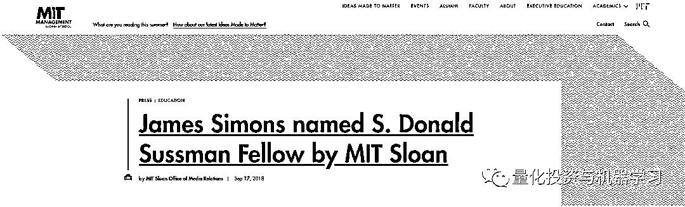
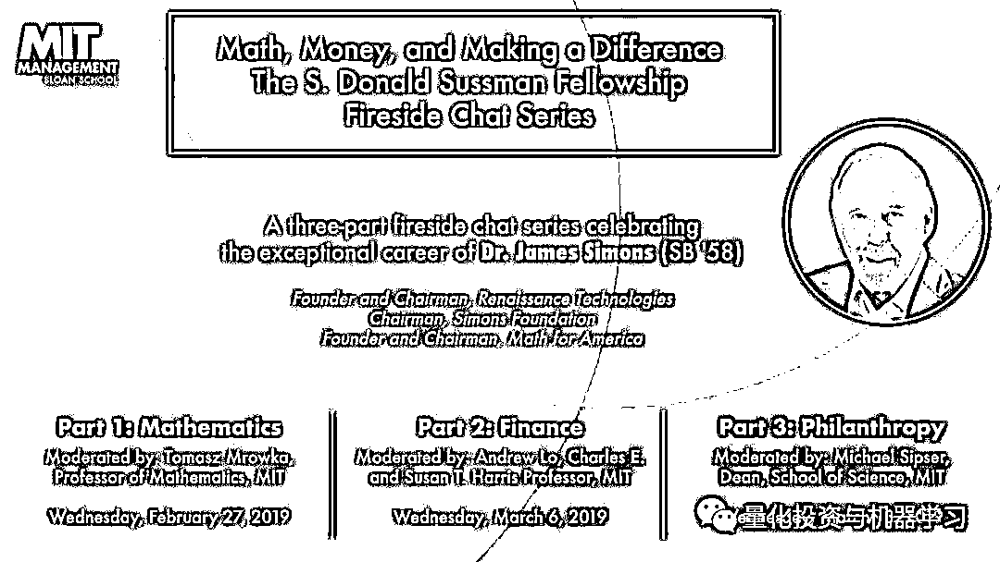
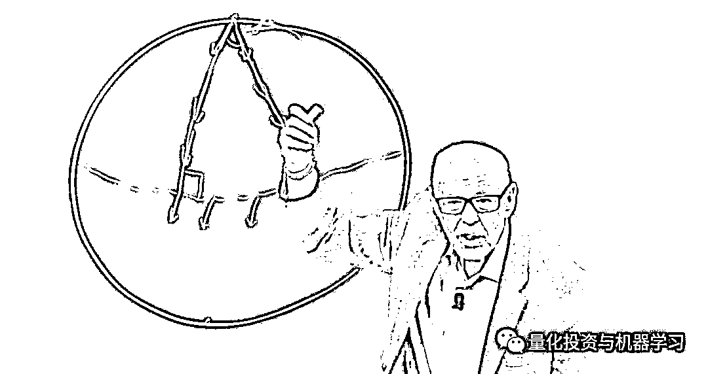

# 二千零一十九、西蒙斯访谈二：数学，一生所爱！

> 原文：[`mp.weixin.qq.com/s?__biz=MzAxNTc0Mjg0Mg==&mid=2653295879&idx=1&sn=682b0863d90682b69b4fc700f31e0c99&chksm=802dd712b75a5e043b3c1d550ca0e256898a870d4906895f7562272928055ca1e02bdbb85f39&scene=27#wechat_redirect`](http://mp.weixin.qq.com/s?__biz=MzAxNTc0Mjg0Mg==&mid=2653295879&idx=1&sn=682b0863d90682b69b4fc700f31e0c99&chksm=802dd712b75a5e043b3c1d550ca0e256898a870d4906895f7562272928055ca1e02bdbb85f39&scene=27#wechat_redirect)

**标星★公众号     **爱你们♥

量化投资与机器学习微信公众号，是业内垂直于**Quant**、**MFE**、****Fintech、******CST、AI、ML**等领域的**量化类主流自媒体**。公众号拥有来自**公募、私募、券商、期货、银行、海外**等众多圈内**18W+**关注者。每日发布行业前沿研究成果和最新行业资讯。

**编译人员**

Allen 、方的馒头

**量化投资与机器学习公众号独家解读**

**未经允许，禁止任何媒体转载** 

**前言**

提起西蒙斯、大奖章、文艺复兴大家可能再也熟悉不过了，几乎所有 Quant 都听闻过他老人家和文艺复兴的辉煌业绩。在这里我们不再对其西蒙斯本人进行过多的介绍。只想说一句：

**詹姆斯·西蒙斯（ James Simons，1938 年－）是美国的数学家、投资家和慈善家。作为最伟大的对冲基金经理之一，他是量化投资界的传奇人物！**

****

据机构投资者在 4 月份公布的年度收入最高对冲基金经理富豪榜中：文艺复兴科技公司的西蒙斯排名第二，其赚了 15 亿美元，低于 2017 年的 17 亿美元。第一名则是桥水的[***达里奥***](https://mp.weixin.qq.com/s?__biz=MzAxNTc0Mjg0Mg==&mid=2653294948&idx=1&sn=bd2a6b749ed236d7e538a75878a0311d&chksm=802dd371b75a5a67dd473800325a7feb4c742500aa98d034317af84cf758920815b73389bf0e&token=1350979614&lang=zh_CN&scene=21#wechat_redirect)。Citadel 的创始人 Kenneth Griffin 以 8.7 亿美元的收入位居第三，与去年的 14 亿美元持平。

**2017 年，西蒙斯的平均工资为 ****每小时 18.4 万美元**。该基金的许多量化研究员一年挣的钱还不够这个数字，至少在薪水方面是这样。

根据最新的数据，**在这 30 年里，5%的管理费、44%的业绩提成下，大奖章的费后收益均值为 39%。简直了！！！**

下图显示了文艺复兴以 H1B 签证向其 East Setauket New York 办事处聘用的量化分析师和工程师支付的薪资（单位为 K）。**文艺复兴以只雇佣少数精英研究人员而闻名**，但与以往的 H1B 薪酬数据一样，这只是一个小样本，它反映了仅向非美国研究人员支付的薪酬数额（在美国工作的公民）。

数据表明，文艺复兴是很多对冲基金中薪酬最高的机构之一。然而，值得注意的是，**工资并不是大多数人为西蒙斯工作的原因。****真正的吸引力是他们向 Medallion 基金投资的机会**，该基金只对员工开放，自 1988 年成立以来，**每年的回报率约为****40%****。**

本周二，公众号力推了一本书，介绍如下：

作为全网具有影响力的量化类自媒体，公众号今日为大家推荐一本刚刚出版的书籍，我们在上个月就在等待这本书的出版了，可谓日思夜想！

这本书可谓有着**一手资料！**

本书由《华尔街日报》记者格 Greg Zuckerman 撰写，讲述了西蒙斯和他创立的文艺复兴的历史。Greg Zuckerman 花了**两年半的时间**研究这家公司，与**40 多名员工**进行了交谈。尽管西蒙斯对这本有些顾虑，但最终还是同意坐下来接受**超过 10 个小时的采访**。

这本书应该是对西蒙斯的权威研究，让我们了解很多关于文艺复兴不为人知的技术细节。作为西蒙斯的粉丝，公众号力推这本书，**很多内容都是新的，不是市面上我们看到的陈词滥调！**

**点击上方图片免费下载此书**

这本书读起来更像是一本精彩的小说，而不是通常的金融书籍。西蒙斯并没有“解决市场问题” ，相反，他创造了一个极其有利可图的交易系统。在价值数十万亿美元的市场上，文艺复兴只限于交易几十亿美元。如果他真的解决了市场问题，那么，大奖章的规模将远远超过 100 亿美元。相反，西蒙斯只解决了一个问题：**如何让自己和其他的投资伙伴变得超级富有。**

在前几年有关西蒙斯的公开视频中，大家关注最多的有以下几个：

**2010 年 MIT**

**2014 年 AMS Einstein Public Lecture**

**2015 年 TED**

时隔多年，2019 年，西蒙斯又一次在公开场合会为我们带来怎样的论点呢？

**讲座背景**

2018 年 9 月 17 日：麻省理工 Sloan 管理学院宣布，麻省理工学院校友、文艺复兴创始人、数学家詹姆斯·西蒙斯获得 S. Donald Sussman 奖。该奖项授予在量化投资策略和模型方面表现出创新和卓越表现的个人或团体。西蒙斯因其在这一领域的杰出贡献，以及他在数学方面的工作和对基础科学研究的积极支持而入选。麻省理工 Sloan 管理学院院长 David Schmittlein 表示：“我们很高兴授予西蒙斯博士这个奖项，以表彰他作为数学家、投资者和慈善家的非凡职业生涯。”

麻省理工 Sloan 管理学院金融工程实验室主任、奖项委员会成员 Andrew Lo 教授指出：“西蒙斯在多个领域都是一个传奇人物，他是量化投资的典范；我们很感谢他接受这个奖项。”

**关于 S. Donald Sussman 奖**

## S. Donald Sussman 从事另类投资超过 30 年，管理着专注于量化和基本面策略的基金。他是 Trust Asset Management、Paloma Funds 和 New China Capital Management LLC 的创始人。他是董事会成员和执行委员会成员，也是卡内基音乐厅投资委员会的联合主席。他曾就读于哥伦比亚大学，并在纽约大学获得理学学士和工商管理硕士学位。

## S. Donald Sussman 奖由 MIT Sloan Finance Group 监管。获奖者将获得 10 万美元的现金奖励，**且在获奖期间于麻省理工 Sloan 管理学院举办三场公开讲座，分享对量化金融和金融业的见解。**

**这就是本次演讲的由来，大家清楚了吧？**

S. Donald Sussman Fellowship Award Fireside Chat Series 

本次公开讲座的总体主旨是：

***Math, Money, and Making a Difference***

主题分别为：

2018-2019 年度获奖者：MIT 校友詹姆斯·西蒙斯博士，SB '58

*   **第 1 场：数学**

*   [**第 2 场：金融**](https://mp.weixin.qq.com/s?__biz=MzAxNTc0Mjg0Mg==&mid=2653293316&idx=1&sn=1828e486f53b70a21c04b94b020ed5c6&scene=21#wechat_redirect)

*   **第 3 场：慈善事业**

第二场 **金融 **我们已经做了翻译解读，详见：

本文对**【第 1 场：数学】****的****采访和问答进行了脱水整理**。这场的主持人 MIT 数学教授：Tomasz Mrowka。

视频地址：*https://www.youtube.com/watch?v=HVqxs0YBp4g*

对比之前得照片，可以感觉到，西蒙斯老了

针对【**第 3 场：慈善事业】**我们将**不做解读**，大家自行收看！

由于此次视频油桶连**字幕都没有给！！！**

**我们尽力了！**

**正文访谈**

****▍主持人****

本期内容**没有金融问题，没有慈善问题，只有数学！**

**▍西蒙斯**

我一直对数学感兴趣，甚至当我还是个孩子的时候。我脑子里有两件事。当我很小的时候，我不知道 2 的所有次方，所以我才来到 4，8，16。有了幂次方。我计算到了 1024，但当时的我只有 3 岁，所以那是相当高的，我认为很远。但是我在不太大的时候有过一次经历，也许三岁，三岁半，我在我父亲车里的时候。他说，我们得停下来加油。我想，你什么意思？我们必须放更多的汽油，否则汽油会用完的。我担心的是，汽油用完了，我不知道我们没有更多的魔法。我说，你没有汽油用完，或者你要做的就是尽你所能。那就好好利用它，继续前进。这对于其他人来说是相当深刻的，我没有意识到，但也不会有任何进展。但是，你知道，对于四岁的孩子来说，这是很复杂的。**但是我一直喜欢数学，我对阅读非常兴奋。我喜欢阅读。但是数学是我在学校真正关心的科目。**

****▍主持人****

你在高中时享受数学吗？

**▍西蒙斯**

是的，我喜欢高中数学。我喜欢几何，这是我搜索玩几何的大部分证据，我希望玩几何。有证据的想法对我很有吸引力。我非常喜欢。学到的东西中我更喜欢微积分。我擅长微积分，但玩几何，没有什么想法，也没有长时间提高对我很有吸引力。这是一个答案。

****▍主持人****

你是麻省理工学院（MIT）的本科生，你能告诉我们一些你在这里的经历吗？那时候你喜欢谁？

**▍西蒙斯**

我是麻省理工学院的本科生。我在离麻省理工学院不远的布鲁克岛长大，我一直在这里。啊！如你所知，我迷上了数学。**大一的时候，我在修大二的课程。**在二年级的时候，我看到有一门研究生课程在外面，阿尔法抽象代数是第一年的研究生课程，但重要的是没有先决条件。所以我选了这门课，发现极有可能。我是说我已经设法通过了，但是没有证据。但是我不能理解这些主题的本质。那年夏天，我得到了一本关于这个主题的书，那是一个星期，非常清楚，所有可能的事情，为什么要这样做？具体来说，同态的基本定理，我不认为对你们大多数人有多大帮助，只是对你们中的一些人有帮助，但这是有各种各样的代数的一个基本的仪式。你画一张从一个地方到另一个地方的地图，有些东西会归零。比方说，你通过那些东西买断，然后在左手边得到一个结构，在右手边得到图像中的人。但在那之后，我参加了所有的研究生代数课。我 17 岁时参加了第一门研究生课程。所以这并不奇怪，我有点困惑，但尽管如此，在麻省理工很好，我三年后毕业。这很好，但真正让我着迷的话题，我的数学领域是所谓的微分几何，这是一个服务的研究，但也涉及计算功能和所有这类的东西。你知道，股票是微积分基本定理的推广。你可能记得微积分的基本定理作为导数的积分，让你回到你开始的地方。B 的积分 F 素 A 等于 B 的 F 减去 A 的 F。所以，众所周知，当你在某个事物的边界上积分某个事物时，这就等于在它的内部积分了另一个事物。这是一个如此美丽的定理，以至于我被它改变了，但我真的很喜欢它。这是我想要的方向，我留在了麻省理工学院。又过了一年，我毕业了，三年后我还是一名研究生。我在一个叫辛格的人手下工作，在座的一些教员可能认识辛格，但他是一位伟大的数学家。那天早上我去看了他，他 94 岁了，在精神上和身体上都有一点儿衰老，但是他仍然状态很好，网球打得更好，他坐在椅子上看着外面，他这样做了。但是那早上我们聊得很开心。所以我和他一起工作，在我几何学函数的领域中有一位伟大的数学家，他叫 Char。他恰巧住在芝加哥大学要去伯克利。辛格和另一个和我一起工作的人安布罗斯建议我去伯克利，或者去麻省理工，或者去伯克利和陈一起工作，只是去那里。所以我去那里和陈一起工作。他原则上在那里，但他也在休假，这意味着他不在那里。事实上，原则上，他在那里，所以我没有和陈一起工作。但是我在学校外面找到了一个人，他很棒，他回到东海岸后在麻省理工做了很多年的教授，他的名字叫康斯坦特。他是一个非常好的数学家，伯斯·康斯坦特，就是和我一起工作的人。因为陈不在那里。我想要好的。

****▍主持人****

那么你在你的论文中做了什么？

**▍西蒙斯**

在我的论文中，我的论文是关于全息学的，或者我可以描述，这是黑板，我过去，有粉笔，好的。

那么我们在平面上给他们看，所以我站在这里。任何一个都有一条曲线，一条封闭的曲线，你取一个向量，不管向量是什么，但是你保持它的位置，你围绕这条曲线移动它到它自己，保持它与自己平行。不管怎样，它在这里是平行的，看起来像这样。最后它回到了起点。它似乎是一个向量，但没有改变，只是移动了一个与之平行的点，然后就出现了。

所以没什么大不了的。但是现在假设我有一个球体，这里是赤道，这里是北极点，这里是南极点。对吗？这是球体。现在，取一个趋向球体的向量，让我们看看这个，我在这里画了一个大圆，它相遇当然是因为它来自北角，所以它相遇时特别像一个路边。我要把它移回自作用力。它在下面。最后突出来了。作用力，现在可以了。现在我要开始以这种方式前进，保持对自己的作用力，对自己的作用力。现在我要回到另一条线上，回到另一个大圆上，让我们看看这条线的切线。现在我向后移动以保持对自己的作用力，对自己的作用力，对自己的作用力。但当我回到这里，它不再停留。它转过来了。让我们转过一个角度。所以，一般来说，当一个人有表面或高维物体时，会有一个矩阵的，如果你取一个围绕这个组的切线向量，然后回到它自己。总的来说，它不会回到起点。你考虑所有你可以用于任何点的组，你有一个完整的变换组，一个完整的时间空间变换组，通过循环称为组，这个变换组被称为全息组。这是一个组群，有些人知道什么是组群，但是组群是你可以乘到的东西，它仍然在组群中，在运输中，你可以彼此发现。它仍然是一种交通工具。所以它叫做全息组。辛格对这个组群的早期研究，在我到达后不久就在麻省理工学院写了下来。现在我命名为布什元帅，他在这个时间框架前不久列出了所有可能的全息组，所有可能的组都可以称为全息组。嗯，他有一份参与它们的名单。它们都是一些众所周知的团体。但是它们都有一个共同点，它们对单位向量有过渡作用。所以如果这里有单位向量，这里还有一个。会有一条相同的车道，在某个地方会有一条封闭的曲线，当你的作用力在附近的时候，会有一条通向这个组群。我们称为任何元素都可以作用成任何其他元素。不是所有的组群，这些非法组群，但这并不重要。并非所有的群组都能作用，所以这是所有这些东西的共性。那么回到问题上，好吧，提出这个问题，为什么你能暂时证明这一点，而不必求助于某个列表？并且说，列表上的一切都是真的吗？这里面有什么？所以当我在伯克利的时候，我和一个叫康斯坦特的人一起工作，我想出了一些小主意。他看了看，说，这很可爱，这可能与全息组的传递性有关。我说，是的。我谈了很多问题。他说不要在那上面工作，因为士气，他是一个著名的数学家，他尝试过，辛格他尝试过，但并没有在那上面工作，但那当然让我前进了。所以即便我没有与之工作，天哪，我解决了。事实上，有一次我被困住了。我在这里咨询了辛格。我回来过圣诞节，我走出困境，我能找到论文的路径，但不能用你的假设，对吗？我没有，有一些关于假设的论文，我没有。所以，我挺过去了，这是一篇好论文。这就是我的论文。这是我在伯克利时最吸引人的地方。然后麻省理工学院聘请我做讲师，所以我回到了麻省理工学院。

**▍主持人**

虽然你不和 Chen 一起工作，但我想有一个关于第一次在伯克利遇见他的有趣故事。

**▍西蒙斯**

这是一个有趣的故事。我在伯克利的第二年开始时，我收到了一位召唤师，正好是这个高个子中国人的箱子的开始。我对旁边的人说，那是谁？是陈。陈？我从来没见过他的照片，我以为他的名字叫？你知道，这个陈一是个事物的简称。如果是陈或张，我会意识到他是中国人。好吧，这就是我在伯克利的第二年遇见陈，在那儿我们成为朋友，但是那些和我们一起工作和生活的大多数人都认为我是学生，但我不是，我应该是学生，但我不是学生。这就是故事。

****▍主持人****

那么你早年在哈佛读呆过一段时间。我想那段时间很有趣？

**▍西蒙斯**

不错。我在这里度过了人生中的一段奇怪的时光，我来到这里在麻省理工学院教书。但我有点不安。我有麻省理工学院的朋友，谈了次天，哥伦比亚，他们是哥伦比亚人。我去过那里一次。他们非常聪明，尤其是科学家。但我觉得他们是非常聪明的人和优秀的商人。所以我说，你们在哥伦比亚开了一家公司。第一学期结束的时候，我回到教学的第二年。我让他们慢下来，告诉他们我不会离开，直到你找到生意，然后帮助他们在生意上投资。虽然那时我一点钱都没有，但我想可能是吧。你知道，就像我得到一点钱，所以他们找到了生意。它是由所有的东西组成的，如果我知道全平铺，你知道把文件平铺在地板上。那时有很多破坏正在进行，所以这就是他们要做的，我回到了麻省理工学院。我是你知道开始做数学的，但是我的后脑勺被锁住了，建起了风格工厂，我想，你知道，我应该走出哥伦比亚，去一家瓷砖工厂帮忙工作，这是一个疯狂的开始，因为我几乎想得太晚了，我知道我在思考生意，我不会说西班牙语，我对最后的瓷砖一窍不通，我怎么可能继续这个生意呢？但我已经从我更受打击的船上退下来，以为我会这么做，我做了一些我讨厌的疯狂的工作，我意识到我不会去哥伦比亚大学，我告诉辛格和鲍勃，鲍勃是哈佛大学的伟大数学家。鲍勃说，哦，好吧，我把你放在我的合约中，所以在那些日子里，你可以只拿助学金，应该雇个人来签约，所以我在哈佛，然后他们让我当教授，我在那里再呆一年。但实际上我不喜欢哈佛。我不知道，我是说我在麻省理工学院，所以我不喜欢哈佛。我在一个被描述的领域工作，我呼吁最小曲面，最小的不同，实际上我解释说，我希望进展缓慢，这是偶然的，但它缓慢，我需要钱，因为我已经借了一些钱投资疯狂的哥伦比亚企业。所以我需要一些钱，普林斯顿有一个地方，叫做国防分析研究所。这个地方雇佣数学家攻击俄罗斯的密码。那是一个高度机密的地方，当时在普林斯顿大学校园里。他们工资很高，所以我申请了。这些人说好的。我已经通过了安全客户端。所以他们雇用了我，我得到的薪水是我在哈佛当助理教授时的两倍，我不喜欢那里的任何人。所以，那是一次非常好的经历，我在那里呆了四年，规则是你可以花一半的时间在你自己的数学上，至少花另一半的时间在他们的东西上，也就是说，你知道试着教授论文稍作休息一下，我发现两者都很有趣，我的数学开始很好。我喜欢这个想法，那是计算机的早期，这是在一个大系统中，那里有计算机，不像我正在编写的程序，但是你想出了一些想法，你会测试它们。在计算机上，你测试想法，或者这可能会破解代码，你用算法写出它们，然后你工作，其他人的程序和计算机垃圾被清除，通常它不能很好地工作，但是我发现了很多乐趣，同时，我越来越深入到最小的变化。

你知道，有时它是一个名字或一个词，你知道，有一个价格俱乐部，每个人都在她的价格俱乐部，你知道我们有它的名字，普莱斯先生。普莱斯先生告诉价格俱乐部，钱是必须要做的，但他却无事可做。但是无论如何，我告诉他们问题。但是更高维的版本是上图，好吧，这是二维表面或三维空间，那么三维表面，四维表面，五维表面，六维表面呢。不管怎么说，我在研究高维最小曲面的一般原理，并证明了它们在那里对这些被敲打和学习很多的东西很有意思，但是最终，我会解决这个问题，这是一个很大的开放问题。嗯，它已经被解决了，每一个更高的，三维空间，四维空间，三维表面，四维表面，你总是能在最小的一个中找到。嗯，我设法证明了你可以在六维表面和七维空间中一直做到这一点。但当你在八维空间时，证明不起作用，我的证明不起作用。不仅如此，我还找到了一个反例。我们对一个定理的反例是一个例子，它表明你的定理是错误的，因为这里有一个例子，你知道，一些与你的定理有关的东西，我发现了我提出的反例。我不知道如何证明这一点，但它是一个表面，看起来非常小，但有一点，它就像一个核心。所以我们有一个奇点，它并不平滑。我可以证明，如果你把它们放在一起，它是局部最小的，它会变得更大，也许有一种方法可以用同样的边界来解决这个小问题，我不知道。不管怎样，那是一篇论文，是一篇非常成功的论文。这篇论文发表了，有 1500 次引用，然后一对非常著名的数学家立即看到了结果。但是什么反例被证明是反例呢？这是鲍勃·贝利。乔治在意大利，他喜欢鲍勃·贝利，他告诉我。他说，乔治完成了一些。我们可以做到这一点，我们可以解决这个真正的反例。然后他从那天晚上后工作了三天。他们说乔治销毁了他们能证明的任何武器。我永远无法证明这一点。所以这就让所有的问题都迎刃而解。我很高兴，因为我不会那么做。那是我几年来的主要工作，我主要是在做数学和国防分析的时候做的。

****▍主持人****

你在做真正的数学时使用过像这样的计算机状态吗？你用电脑做研究了吗？只有电脑上有这方面的研究？

**▍西蒙斯**

不不，你的意思是？

****▍主持人****

我是说你有一个接口可以将这个告诉你的计算机。

**▍西蒙斯**

我在研究中使用它们，在代码破解中使用它们。我是说，我们在新泽西州有权威的计算能力。当这台巨大的计算机出现的时候，我被告知我有一百万个单词的内存，现在这些单词是 16 位，所以它就像，我不知道，700 万个你们称之为的字节。我们在想，为什么我们有这样的内存，我们怎么可能使用 700 万字节的内存？但是两周之内，机器实际上就被设定好了。人们经常很快就发现使用了这种内存。你知道，你的苹果手机上有 10000 倍的内存，但在那些日子里，这是一件大事。所以……

****▍主持人****

你有没有什么有趣的故事是关于你在麻省理工学院做数学时的呢？

**▍西蒙斯**

都是机密。这是真的。都是机密。几分钟前有人来了，他是我之前挑战过的那个人，他是数学家。所以我给他一个挑战，我有一个快速算法去做一些事情，这很重要，这很容易描述这个问题，所以这是我在那里的主要成就，所以我告诉他这个算法，然后他说他今晚就能计算出来。第二天让我们拭目以待，也许会，但我不太确定。这就是我在那里做的。

****▍主持人****

当你在那儿时，你开始和你的第一位博士杰夫·齐格一起工作。

**▍西蒙斯**

哦，是的。杰夫·齐格是一个优秀的学生，一个数学学生。我告诉他，论文，你读了一些论文，越多越好，有一天，他进来说，我证明出这个。我说，你能证明？好吧，你做得好。我是说他真的是。他把它们都平衡了。但是通常情况下，学生你必须引导他们。你在论文中帮助他们。所以我有很多学生。现在有人知道是齐格。他是一个仍然把一生都放在成就上的人。所以他成了一名非常好的数学家。

****▍主持人****

那又过了四年，是什么让你离开或者发生了什么？

**▍西蒙斯**

是的，我离开了国防分析研究所。有些人可能知道这个故事，他们有一个国际开发协会，总部设在华盛顿，因为它有许多单位，国防分析是最先进的单位组织，最小的是普林斯顿的这个小组织。所以他是大老板。他写了一篇在越南战争期间发表的文章，他写了封面，为纽约时报写了一篇关于我们是如何赢得这场战争的火灾封面文章，我们坚持了下来，一切都很好。所以我对那篇文章很重视，所以我给泰晤士报写了一封信，让所有为泰勒将军工作的人都同意他的观点，我写了一封信说，在我看来，我们应该尽快离开那里，还有一些话。没人说战争。大约三四个月后，一个年龄比我大不了多少的人，也许还年轻，我 29 岁，过来说他是一个新杂志的特约记者，一个特约记者，你知道，有些人，我不知道这到底意味着什么，除了，他在为他们写一篇文章，关于国防部工作的人，那些应该是战争的人。现在他说，我找不到并不奇怪，他说，我能采访你吗，你从来没有问过我一次采访，在我想在这里采访之前。所以我说，当然，你可以采访我。所以他说，你在做什么，我说，我在做的应该是把一半的时间花在所有的数学上，剩下的时间，应该花在他们的东西上。所以现在我只做我的东西，当战争结束的时候，我在他们的东西上花同样多的时间。他说平衡了所以。这不完全取决于位置。然后我回到我当地的老板那里，我接受了这次采访，他说，你说什么？我说，我说了这个，我说了那个。我得给泰勒打电话。他去办公室，打电话给泰勒，然后从办公室出来，说你被解雇了。我说，我被解雇了？为什么你不可以解雇我，因为我的头衔是麻省理工学院的终身成员。他说，你知道终身成员和临时成员有什么不同吗？我说不，他说，临时成员有合同。但是终身成员当然没有。所以我离开了那里。但是很好。因为我知道我会在某个地方找到一份更的工作，因为我已经做了最少的变化。还有一个办公室，但是石溪大学来了，问我是否愿意当他们数学系的主席，数学系是最薄弱的一个系，需要加强。我听到能够建造一些东西很开心。我记得，我面试了一位在生物学方面非常杰出的学生。他说完后，就结束了。西蒙斯博士，你是我面试这份工作时真正想要的人。我说，我想要，我想要，听起来不错。所以我接受了这份工作，非常棒。我们真的玩得很开心，那是我们留在大学里的时候，钱很多，但今天的情况不是这样的，他们有很多钱，洛克·费勒被州长收买了，他真的很想先看看州立大学。我对人很好，第一年我雇佣了 10 个人，其中一个是齐格，另一个是非常有名的家伙。所以我在三年多的时间里建立起来，我雇佣了 30 个人。我已经为很多没有 10 年时间的人做好了准备。从一个薄弱的部门转向非常强大的部门，但是在普林斯顿有非常强大的部门，尤其是微分几何，因为我知道这个领域最好的人。我非常喜欢当主席，但同时，我真的很有效率，因为我在数学有收获，那是我和陈合作的时候，那是我开始的时候。

****▍主持人****

你是怎么做出来的？

**▍西蒙斯**

我在互联网上解决了这个问题，当然，这在 1970 年是不存在的。我在鬼混，试图理解几何管理这一特征类领域的一些东西，很难描述特征类，所以我想要一点。你听说过欧拉特征吗，有人听说过吗？如果听过，举手。哦，够了，我会讲述剩下的。如果你拿一个封闭的球体，比方说球体，加上三角形和正方形，你可以用各种各样的瓷砖把它做成一个整体，所以所有的都放在一起。现在你说，有多少个面，从边的数量开始追踪，加上顶点的数量，好的，你必须有面，边和顶点。我记得那个标志，但它总是变成两个。不管你怎么做，不管你用什么形状，它总是变成两个。现在你对环状物的表面做了同样的事情，它叫做 tories，结果是零。如果有一个有两个孔的环状物，算出来是减去两个或三个孔减去四个，所以这是拓扑不变量，所以我们只依赖于它的形状，而不依赖于你平铺它的形状，对吗？这是一位名叫欧拉的数学家发现的。我想大概是 1700 年前，这叫做欧拉特征。或者事实证明高维事物的其他特征不是用这种方法计算的，而是用另一种方法计算的。我给某些特殊的微分形式打分，你会得到数字。这是一个相当重要的领域，这是一个非常重要的领域，我想学习这个领域，我决定通过对下一个东西做一个完整的欧拉公式的评论来学习，这叫做标记，四维物质的标记，这是一个与四维物质的任何接近相关的实习，叫做标记。现在你计算的方式，但是是间接的方式，我想我可以像计算所有的字符一样计算这个，所以我尝试角度，有方法得到一个组合，它叫做组合公式。我正要到达某个地方，然后我被一个术语卡住了，那就是整合一个东西，这个东西被试着在大约它们被证明是标记的间隔内把东西变平，但出了点问题，可我想不出来。有趣的是，你可以计算出任何三维物质，当然也可以得到一些。但是这个数字由一个实体来定义。就像，你把小数点右边的所有东西都拿走了，忘记了实体。所以你可以计算这个数，它在保形变化下是不变的，这些保形变化意味着一个技术术语。不管怎样，你把它构造出来。我会告诉你保形是什么意思。但这是非常共形的变化，我有各种其他非常漂亮的结果。我给陈看了这些，他非常喜欢。但他说，当你只在三维空间做这件事时，我们可以在任何维度做这件事。我说，好吧，我们开始吧。你告诉我怎么做。但我明白了他的方法。那是我和陈的作品，非常流行，非常有用，我是说，你告诉我你每天都用它。

****▍主持人****

我每天都用它。我今天正在教我的学生西蒙斯函数。

****▍主持人****

不，我没有告诉他们你来了。我希望他们当中有部分。

**▍西蒙斯**

这里有汤姆的学生吗？

****▍主持人****

我会有名字的。

**▍西蒙斯**

好吧，很抱歉的问。我们认为这是一个非常好的数学。我发表了另外一件事。我想要一个价格，部分是因为这个，也是因为其他种类最少的东西。所以在那之后不久，像我这样使用这个的物理学家，你们中的许多人可能都没有听说过，他在强度理论中使用的著名物理学家也没有听说过，然后人们过去做的被称为凝聚态物理。所以这种数学叫做詹姆斯·西蒙斯的东西，非常和巨魔一样，不管它的术语是什么，开始了一段时间所有的物理，你知道，我一点也不知道物理。我知道 F 等于 MA。那是关于重力的，我也知道重力的平方倒数，我知道两件事，但我不知道任何物理学。我认为我的物理学观点是因为当时的物理学正在研究那种将会在这个世界上扩展的结构。我提到一位物理学家 CNA，他实际上是一位伟大的物理学家，发现了我的许多用途，他说，是的，也许。这是我最后一次听到这方面的消息。但它总是震惊黑暗，我不知道物理学家将如何使用。但这是基础科学的一个极好的例子，你永远不知道它会去哪里，好吧，就像一个肿块一样排列，什么都不会发生。或者它可以去一个你从未提起过的地方，我最喜欢的故事我认为是真的。这是关于物理学家的名字，他发现了一种叫做核磁共振的东西，这是一种现象，我想解释一下是什么，但这是一种现象。他发现并获得了诺贝尔奖。几年后，其他几个人意识到实际上你可以用它来获得一种材料的成分。他们获得了诺贝尔奖。另外两个人说，你知道，你可以用这个来制作图像。他们不想称之为核磁共振，这听起来太危险了。所以他们称之为磁共振成像。现在谁做了核磁共振扫描一个点另一个点。当你做了一次核磁共振扫描，那是第二次，有一天他的肩膀有问题，他做了核磁共振扫描。50 年前，他的肩膀没人帮忙，你知道，他的发现一定很高兴，对吧？所以大多数欧洲科学家，你们中的许多人会去那里做科学家，而你永远不知道哪里有好的科学。如果你说我的第三个角色，做了很多慈善事业，并作为基础科学进行报道，这是一个月。一门好的基础科学真的很有价值。还有别的吗？

****▍主持人****

与杨的互动，哪一个更注重？第三本字典。

**▍西蒙斯**

好吧，我给你讲了这个故事。杨获得了诺贝尔奖，当时他在石溪，当我到那里的时候，他坐在椅子上，他很小的时候就获得了诺贝尔奖，他是一名物理学家。我在那里的第一年，我们是同一栋楼，他邀请我上楼给我看他在做什么。好吧，我上来了。他在黑板上，做了这个做了那个。我不明白他在说什么，但是你知道，出于礼貌，我说，非常感谢，非常有趣。我回到楼下。第二年，我们经历了同样的不解，我的部分是不解，我无法理解。然而，第三次，他在一块黑板上做报告时，我意识到他在做什么，在数学方面，我说，不要再写了。他说，你之前有像我一样做过吗？是的，这是 30 年前，40 年前做的。他说，为什么数学家们会这样做？我说，这只是数学上的，不是物理上的。我说，你要去的是一个错误的方向，你必须这样那样。所以他很兴奋地找到了一个数字。所以他邀请我保留一个类似于他的教员的班级，那是 8 个人或 10 个人，一个非常好的班级，所以我们有了我有过的最好的班级。我们在午餐时吃了这个，我真正做的是在你说这个的时候告诉他们物理，但是我们说这个的数学，其实是一样的。你知道，当正反两面，它们都是直的，事实上，杨在数学和物理的几百个单词后写了一个词汇表，你知道，两件事。除了教我有史以来最小的一堂课很有趣之外，我还买了一本字典，我拼写很差，最后，记住这本字典，我们可以在国际牛津字典看到，我不知道你要用什么来拿着它，所以他给了我一本字典，我很感激他，喜欢它。但结果我的拼写并没有变得更好。这就是与杨的互动，他仍然在中国，他已经 93 或 94 岁了。大约一年前，我有幸去拜访过他，我们拜访过他几次，他就要走了，我是说中国是一个很棒的地方，那里很棒，几年前我和他一起去拜访的时候，他很健康，我们沿着直道走，几个地方和孩子会走过来，把我推到一边，说，杨博士，我能和你照张相吗？在美国，谁会和一些科学家拍照，你知道，这是不可能的，但这发生在中国，他们真的非常尊重那些人。当他下来的时候，转过身来，成千上万的人经过，同一年龄的人群随时经过。杨还在那里，这就是我和杨的经历。

****▍主持人****

1976 年你获得了这个奖，更让你在数学方面止步，那是怎么做到的？

**▍西蒙斯**

是的，是的。我总是处于辞职的过程中。顺便说一下，汤姆获得了诺贝尔奖，所以每个人都得了奖，不，不，哈哈哈。不是每个人都获奖了。当我获奖时，我非常高兴，我的亲戚问，多少钱？我说，我不知道，因为我没钱。你知道，我很高兴是因为我获得了这个奖，结果是没有多少钱，也许是 500 美元或者别的什么，但确实没有收获。无论如何，我已经准备好开始对我正在做的一些数学感到沮丧，而哥伦比亚公司已经取得了成功。我和我的基金从那家公司中赚了一点钱，我觉得用它来修整一下会很有趣。我有一个有趣的基金柜台，我不知道为什么，我做了修整并伴有一些好运，逐渐决定什么时候，我有时间先干一年，然后在公司中全职，这是我的下一个话题，如果你们想让我回来，那么下周三，你们会听到的。我就是我所做的。

****▍主持人****

如果你回去与大家工作，你不可能完全放弃数学。

**▍西蒙斯**

不管年龄有多大，是的，我没有回到数学，大约 20 年后，我又开始学数学，但是有一项工作是齐格做的，我一直在做，是我放弃数学的原因之一，因为我们都陷入了某种困境，所以我回到了这个话题，我有一个想法，如何证明这一点。我把它们给杰夫·齐格看，齐格说：“我不知道，你应该和唐纳德谈谈”。唐纳德知道这件事。唐纳德·所罗门是一位著名的数学家，在麻省理工学院已经呆了几年。无论如何，他一部分是同在石溪学校，一部分是朋友，我看见他，我说，这样那样是对的。他说，是的，很好。我说，这样的其他这样做。他说，这真是个棘手的问题，你为什么问我这个？我说，因为我们想证明这样那样。他变得非常感兴趣。他一起加入了这个小组，写了一篇论文，题目是《普通微分上同调的不对称刻画》。明白了吗？在接下来的几组中，这是一个很好的作品，有一个小的实际上是齐格，几年前我构建的，叫做微分上同调，所以这是一个新的对象以及新的数学对象，它满足了一系列规则，你可以从这里映射到这里，一些熟悉的和其他熟悉的东西可以映射到这里，所以被六个东西包围着，每个东西都映射到和映射到那里，所有熟悉的对象都在其中，这是一个新的对象。所以我的猜测是，任何一个函子有这样一个新的对象，只要它满足了这个图中所有熟悉的映射到它之外的东西，就应该是这个，它们不可能是其他任何东西，应该是所有东西的映射之间的字符。这就是我想证明的。和唐纳德一起，我们证明了这一点，我很开心。然后我试着做了一学期的感觉，唐纳德和我自己，几年前我得到了一个非常好的结果，我真的很高兴，不是因为唐纳德，他非常高兴证明了一个又证明了另一个。我开始写它，但我突然想到，也许这是已知的，所以我谷歌了一下，我确信我知道 15 年前我认识的石溪的一个人证明了这一点。但是，无论如何，我仍然很高兴我发现并证明了这一点，当然也不高兴我不能把它们作为一篇论文来庆祝。那不是做数学，有趣的是大约两年前，我得知早在 1950 年做数学的克劳迪娅·布朗，一位法国数学家证明了这一点，并得到了同样的结果，他消失了，而且他的作用消失得如此之快，无人理会。所以即使是会议的人也得到结果，不是第一个，他仍然是一个法国人，他的消失是未知的，你们谁知道这个法国人？所以我做了一些数学，变得更难了。

****▍主持人****

确实。

**问答环节**

**▍提问者一**

我是迈尔斯，我是哈佛大学应用数学专业的大三学生，我的问题与你漫长的数学生涯有关，你对这门课的看法是如何演变的，以及这门学科本身是如何在早年间开始演变成指导各种论文的？

**▍西蒙斯**

我认为，我的方法是非常相同的，数学在过去已经繁荣了，比如说从我 30 岁的时候到现在的 30 或 40 年前，也就是 80 年代初，它繁荣了，因为各种各样的新数学真的很棒，因为它长大了，有人提出了一个想法。接下来你知道的是整个概念是一个新的定义，你知道，看这东西，他们称之为我提到的上同调，这在我小的时候是不存在的，它来自微分上同调，现在它是织物数学的一部分，还有很多其他东西，对吗？所以这是一个很好的领域，事实是我和丹尼斯一起工作的方式有点令人惊讶，因为我很久以前就开始使用东西了。所以数学一直很繁荣，很明显其中一些比以前更容易计算了。在所有的竞赛中，我把论文发表在数论上。比方说，或者也许在另一个领域，计算机在数学中扮演着重要的角色。我知道计算机的角色扮演着创造性的数学，但是仅仅通过尝试一百万种方法来证明这一点是不可能的。

**▍提问者一**

我在应用数学的同时也在应用经济学，所以纯数学系列的应用还不多。

**▍西蒙斯**

你是学经济的？

**▍提问者一**

应用数学与经济学中的应用，所以纯数学系列中的应用较少。

**▍西蒙斯**

我的妻子坐在那里，应用数学是她的工作。很好。

**▍提问者一**

谢谢您。

 ---

**▍提问者二**

我是麻省理工学院斯隆商学院的卡什·伯格。我的问题是，您能否多谈谈您所参与解决的最具挑战性的密码或数学问题，或者您能不能谈一点，这个问题的难度如何与你今天创造唐纳德的挑战的难度相比较？

**▍西蒙斯**

嗯，你问我关于我所成功的难的事情。但是很难说，最难的事情我没有成功。所以我已经研究这个问题 15 年了。事实上，部分结果就是我刚才描述的问题，这一点以前已经得到了证明。当我在 1968 年来到石溪学校担任一个部门的主席时，那里的一位教授刚刚发表了一篇论文，证明在六维球体上不可能有任何复杂的结构，现在六维球体很容易用七维空间中的单位因子来描述。六维球体就像平面中的单位因子圆。所以一个六维球体，一个复杂的结构必须做一个复数，而我不会去研究这个复杂的结构是什么，它覆盖了具有跃迁和函数的邻域，这就是所谓的全纯。不管怎样，这是一种非常简单的结构方式，一个非常简单的球体，一个六维球体没有复杂的结构，这个家伙声称要证明。没有，你不可能完成。但是这篇论文是有争议的，一个期刊拒绝了，另一个期刊接受了，就此退出。所以我对自己说，我是主席，我自己在边上读这篇论文，这是对的。但是事情太复杂了，我终于放弃了，所以我通过了权威的判断，后来我问陈关于论文的事，他说，不，这是错的，我说，亲爱的，你知道，你找到新的领域了吗？他说，没有，但没有新的想法。那是一个论点，结果证明是错误的。实际上有人没有找到，所以这是错误的。但是这是一个很好的问题，很难描述为什么这是一个很好的问题，但是出于各种原因，这是一个非常好的问题。十年来，我一直在这方面努力，但没有成功。人们一直在努力，事实上，陈临死前就在努力解决这个问题，他取得了一些进步，他投资了这个问题，他没有解决这个问题，但是他取得了进步，那是在他九十多岁的时候，所以我还有 12 年的时间去解决这个问题，还有其他问题吗？

 ---

**▍提问者三**

我的问题是，我想，鉴于你早期对这种描述的强烈程度，把注意力明确地集中在纯粹的数学、微分几何、拓扑、图形平台，所有的抽象都给你带来了更多的东西，然后我想，对于商业，特别是金融和量化金融，你是如何获得从这一点到这一点的顺序的，以及你是如何在这两个领域取得如此好的成绩的。我想我的问题是这样的，这些是一般数学和一般科学之间的分析，能够探索和理想的系统思维，这是我当然想到的要点。但是，我想，纯粹的数学集中并不能让你在商业和定量金融领域取得成功。

**▍西蒙斯**

那么我是怎么找到这个问题的呢？

**▍提问者三**

没错。

**▍西蒙斯**

好的，所以我可以简单地说一下。有一天，**我进入了金融行业，因为我喜欢钱，我想我会有钱。我的策略真的能和聪明人合作**。当我进入那家公司后，我找到了好的合作伙伴，起初我们完全使用数学，然后我们开始带来统计数据，我们使用模型，就这样。如果你要听，下周三再来。

   ---

**▍提问者四**

您能告诉我们 flatiron Institue 的计算数学中心想做你希望在那里完成的数学工作吗？

**▍西蒙斯**

是的。在一个基金会，这将在第三堂课中讨论。我们得到了基础科学的资助。所以我们从室内科学开始，这是计算科学，我们从计算生物学开始，我们允许一些人在室内工作，这可能是不错的时光，一个 4 年的小组，45 个人在生物学领域做着非常重要的事情，他们想出了一些漂亮的算法来进行某些测量，还有其他一些。我们认为那很好。我们决定推广整个运动，在没有磁场的情况下进行，所以第二个磁场是额外的物理。第三个领域是量化的，第四个领域是计算数学，第五个领域是计算分析，所以我们建造了这样的建筑，建筑里有大约 100 人，你会问什么，我的意思是计算数学听起来有点多余。计算数学就是所有的数学计算。但这涉及到机器学习、计算机科学、统计学、算法和数值分析。在真正的应用中，数学更广泛，这就是未来。你对那里的工作感兴趣吗？这是一个严肃的问题。不管怎样，这就是未来，将雇佣几个人来增加员工。

  ---

**▍提问者五**

谢谢您。当你进入工业界后，几何学的发展实际上是非常吸引人和令人兴奋的，您是怎么想的，如果您在学术界或者类似的地方，您想继续什么样的几何学发展，您能说出一些几何理论的发展吗？比如在你从事工业界工作之后，最让你兴奋并给你留下印象的。

**▍西蒙斯**

嗯，我想自打我开始从事起，几何学已经繁荣起来，而且非常受挤压。我最近对几何学的一些发展了解不够，我想汤姆知道的比我多。所以我不知道如何回答你的问题，除了我对这个问题几乎一无所知。但是你在问，所以我回答不了。

  ---

**▍提问者六**

那么在您的代码工作者或破解工作者期间，在密码学数论或任何其他数学领域取得任何成果的过程中，发现了在公共领域仍然未知的东西。

**▍西蒙斯**

但我仍然不知道在公共领域？

在我从事的时候，没有人在保密世界之外做密码学或密码学分析师。这不是一个领域，但是，当然，现在，有很多研究在进行，我不是，一些证书，非常多种，所以我今天根本不知道这个世界上发生了什么。第三，保密世界正在发生什么，因为他们会告诉我。未保密的世界不是一个我非常了解的领域，对它们知之甚少但不多。我想这就是问题所在。那么，谢谢大家！！！

大家可以在**留言处**写下你对本次访谈的感想。

**更多访谈：**

*—End—*