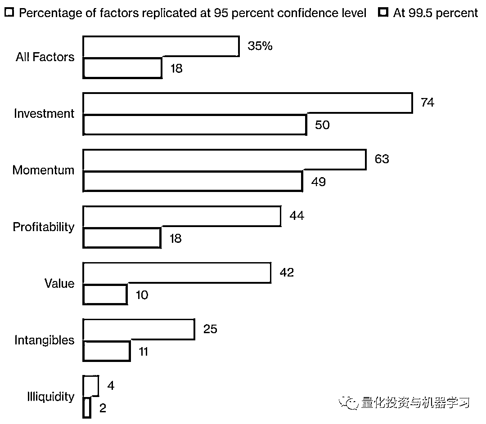

# 二千零一十九、最新『尤金·法玛』访谈：主动基金该何去何从？

> 原文：[`mp.weixin.qq.com/s?__biz=MzAxNTc0Mjg0Mg==&mid=2653295869&idx=1&sn=1f90e26f8cebf04ec55832364180bc6f&chksm=802dd6e8b75a5ffedbed82d721063ad01a892163f6b5b30748359539f1e31d44e036aacb168c&scene=27#wechat_redirect`](http://mp.weixin.qq.com/s?__biz=MzAxNTc0Mjg0Mg==&mid=2653295869&idx=1&sn=1f90e26f8cebf04ec55832364180bc6f&chksm=802dd6e8b75a5ffedbed82d721063ad01a892163f6b5b30748359539f1e31d44e036aacb168c&scene=27#wechat_redirect)

**标星★****置顶****公众号     **爱你们♥   

作者：Steve Matthews & Katia Dmitrieva   

编译：方的馒头 | 公众号编辑部 

**尤金·法玛**

提起**尤金·法玛**（Eugene F. Fama），想必大家再也熟悉不过了。老爷子是**全世界引用率最高的经济学家之一、金融经济学领域的思想家，2013 年诺贝尔经济学奖获得者。**

著名的“有效市场假说”（Efficient Market Hypothesis，EMH）就是他老子也提的，牛掰！

今天，公众号为大家**独家整理翻译**了最近尤金·法玛与 Barry Ritholtz 的访谈对话。干货满满！

**访谈要点**

1、尤金·法玛预测：**主动管理者将长期缓慢下降，因为有效市场理论意味着大多数人将无法战胜市场。**他确实承认主动的管理者有价值，因为没有他们中的一些人，你就没有一个有效的市场。

2、尤金·法玛称：**对价值股是否会有更好的收益持矛盾态度，称目前基本上不可知**。价值股近年来表现一直不如成长股。资产价格泡沫也是如此，历史上很容易识别，而不是实时识别。

**正文**

法玛对金融和投资领域的影响怎么强调都不为过。许多人认为他是有效市场假说和因子投资理论之父，有效市场假说这一观点本质上是指，投资者不能在不冒更多风险的情况下战胜市场。

他与达特茅斯大学教 Ken French 的开创性因子研究首次发表于 20 世纪 90 年代初，该研究为现有模型增加了变量或因子，更好地解释了股票的收益、规模和价值，以及后来的盈利能力。

这引发了金融经济学寻找额外因子的竞赛——研究人员现在声称已经发现了数百个因子（因子动物园）。

Lu Zhang 在 2017 年与 Kewei Hou 和 Chen Xue 发表了一篇论文，研究了各种学术期刊中描述的 452 个因子。**他们的发现证实了许多人的担忧：****大多数因子经不起推敲。**

当他们试图复制这些因子时，294 个没有通过统计学意义的测试。当他们对这些因子进行更严格的 99.5%置信度测试时，又有 77 个因子未能达标。总共有 81 个因子存活下来，仅占原始数据的 18%。

*图片来自：Kewei Hou、Chen Xue、Lu Zhang

此外，幸存下来的大部分因子是价值、质量和动量。

也不完全清楚有多少因子是真实存在的。正如 Lu Zhang 所指出的，“这些因子是相互关联的，所以它们并不是完全独立的。”

值得注意的是，Lu Zhang 发现低波动率几乎无效。低波动率是一个受投资者欢迎的因子，因为它以更低的波动率换取更高的收益。“低波动性的经验证据非常脆弱”。他表示：**“我们研究的 16 种波动性指标中，有 15 种在最广泛的股票样本中不起作用。”**

读了 Lu Zhang 的论文，我们有理由问，除了确认从业者早已了解的东西之外，**学术对因子的探究是否做出了有意义的贡献？**不足为奇的是，Lu Zhang 的发现并没有受到他的一些同事的欢迎。Lu Zhang 说：“它可以是孤独的，但我只能写我相信的东西。”

也许，Lu Zhang 的研究最能说明人们对因子投资知之甚少。**很多因子都是基于美国股市数据，因此目前尚不清楚同样的规则是否适用于海外市场。**例如，Lu Zhang 指出，“美国的价值和趋势比中国更强，这可能是因为许多中国公司都是国有的，政府可能没有实现价值最大化。”

同时，这还引发了指数复制因子数量的爆炸式增长，以及追踪这些因子的指数基金，也被称为 Smart Beta。事实上，这些因子指数基金正在以一小部分成本复制传统的主动管理风格，有可能取代人类的选股者。

**因子投资的受欢迎程度持续上升**

*图片来自：彭博

在过去的十年里，一些著名的因素超过了市场的增长速度：

*图片来自：MSCI

股票市场是买入还是卖出？在法玛看来，这是不可知的。20 世纪 60 年代，他提出了股票走势不可预测的观点，即**随机游走**。因此任何投资者都很难获得优势。这一理论导致了指数基金的发展。

Booth 致力于这些想法，使用数据驱动模型来塑造 DFA 的基金。

*图片来自：彭博

Booth 将和尤金·法玛一起参加了这次的采访，Boot 在 20 世纪 80 年代初创立了 Dimensional Fund Advisors。

价值是最广为人知的因子之一，也是与法玛有着广泛联系的因子，**自 2008 年金融危机以来，价值严重落后于市场，导致许多投资者质疑这是否是海市蜃楼**。这也让人们对其他因子产生了怀疑，尽管一些因子在同一时期超过了市场，如动量和质量。

*图片来自：Kenneth French

注：价值溢价是价值股超过增长的总收益，按市净率排序。

根据 Morningstar inc 的估计，8 月份的资金流动帮助指数追踪型美国股票基金的资产升至 4.271 万亿美元，相比之下，选股公司的资产为 4.246 万亿美元。

现在，一些精明的投资者，即著名的“大空头”Michael Burry，认为被动投资本身就是一个泡沫。这是一个有趣的问题：当每个人都转向被动基金时，主动管理者又有优势了吗？

*图片来自：彭博

Dimensional 公司的博客认可了成长型股票相较于价值型股票的优势：**“虽然股票收益是不可预测的，但在持续表现不佳的时期过后，价值溢价会迅速回升，这是有先例的。**” 这将是一个非常有趣的讨论话题。

*图片来自：彭博

Barry Ritholtz 对被动投资有如下看法: **“被动指数的兴起是过去十年最重要的投资趋势。****然而，值得注意的是，被动管理的资金总额仅占全球总资产的一小部分。****”**

Booth 将和尤金·法玛

**法玛提到数据挖掘。它被广泛认为是金融经济研究中的一个大问题，尤其是因子研究。**

我们认为今天股票价格数据的可用性是理所当然的，它允许数据窥探，但这是一个相对较新的发展，得以允许法玛的大部分研究得以完成。

Booth：和法玛一起上课改变了他的生活，也改变了他的职业生涯。

20 世纪 80 年代初，Dimensional 的第一只基金是一只小盘基金。这个时机被证明是可怕的，因为小盘股几年来表现不佳。很有意思的是，Booth 是是否把这种经历比作对近期表现不佳的评价，那将是件有趣的事情。

**法玛：****对于他的有效市场理论，我们受到了很多专业人士的反对，而且投资公司对学者毫不尊重！**

法玛在许多投资者心目中对技术分析（弱式有效市场）的质疑中扮演了重要角色。有趣的是，技术分析卷土重来，至少在有限的意义上，有了动量因子，法玛在其他因子上的工作帮助其打开了大门。

**法玛：**accumulation of performance evidence 使得有效市场理论得到了更广泛的接受。

**法玛：**现在的信息传播速度比 50 年前快得多” ，尽管从数据中很难看出来。

法玛的工作在考虑泡沫或高估资产时有很大的意义。如果股票市场是高效的——快速吸收和反映新的公开信息，那么股票（或任何其他资产）就不会真正出现价格泡沫。

**法玛：**这一直是一个 zero-sum 游戏。

法玛的早期研究表明，大多数主动基金管理者无法战胜市场。但重要的是，它并不认为主动管理不能战胜市场。

事实上，他的因子工作表明，在过去 10 年或更长的时间里，规模和价值等主动管理风格已经击败了市场。

Booth 讲述了他是如何在工作中运用法玛的研究的：你可以利用“市场的能量、市场的力量将对你有利”。

Booth 是提供低成本主动基金的先驱，但现在它们无处不在。如今，投资者可以为被动基金和主动基金支付大致相同的费用，这让他们能够专注于投资价值而非费用。

Booth：我们是小本经营，在一间空余的卧室里经营这项业务。 当他要求安装电话线时，电话公司拒绝了，因为他们认为他是个赌徒。

Booth：直到最近，他旗下共同基金的所有“独立”董事都在芝加哥大学任教。

Booth：他会向人们展示其基金 30 年的跟踪记录。尽管当时有竞争对手，但没有人能提供 30 年的跟踪记录，因为他们没能活下来！

Booth：**在金融危机最严重的时候，你必须不断提醒人们，市场是买卖双方走到一起的地方。市场正在按预期运行：有时上涨，有时下跌。**

Booth 说他想给芝加哥大学一份重要礼物，芝加哥大学想以他的名字命名商学院。Booth 说那不是他的目标。

法玛在一次采访中表示，这场危机证实了有效市场理论：**股票价格在衰退之前和期间下跌。**

**价值死了吗？**

****法玛：**你无法真正预测，现在很难判断价值股。**

****

****法玛：**价值溢价波动太大，以至于你无法判断它是否发生了变化，最近的表现不佳也在预期的结果范围内。**

****法玛：**大多数行为金融学只是对有效市场的批评。**

****公众号补充：****

**如果价值的受欢迎程度在增长，那么它相对于增长的折扣应该在下降，但情况恰恰相反。2018 年，成长型股票的市盈率为 6 倍，而 2007 年为 4 倍。在经历了又一个糟糕的价值年之后，如今的市盈率几乎更高。事实上，相对于价值而言，经济增长的代价只高了 2 倍。在大萧条和互联网泡沫时期，市盈率和市盈率说明了同样的问题。**

****

***图片来自：Kenneth French**

**第二种理论认为，成长型公司比过去更具主导地位。据说，他们巨大的技术优势和近乎垄断的权力，将使他们在可预见的未来超越价值公司。如果这是真的，成长型股票的市值应该会相对于市值上升，但在这里，情况又恰恰相反。标准普尔 500 增长指数中排名前 10 位的股票占标准普尔 500 指数的 17.3%，低于 2009 年的 18.7%和 2001 年的 20.9%。**

**第三种理论也是对价值最慷慨的理论：衡量价值的标准被打破了，而不一定是策略本身。P/B 比率被研究人员和指数广泛用于识别价值型股票，但一些人抱怨称，账面价值不再能够完全反映出亚马逊、谷歌和 Facebook 等快速增长公司的智力资本和其他无形资产的价值，这让它们显得比实际价值更昂贵。**

**虽然 P/B 比率是过去 12 年来表现最差的价值衡量指标，但现在说它过时还为时过早。在过去几十年里，没有任何一项指标的表现一直好于其他指标，因此，市盈率最近的挣扎很可能纯属巧合。在互联网泡沫时期，人们对账面价值也有类似的担忧，市盈率表现与其它指标一样好，甚至更好。**

***图片来自：Kenneth French**

**此外，与成长型股票相比，市盈率在经历了一轮又一轮的疲弱表现后，长期以来一直表现强劲，反之亦然，这有力地表明，其近期表现不佳将被证明是周期性的，而非永久性的。大萧条之后，上世纪 40 年代，它每年的价值溢价超过 10%。而在互联网泡沫之后，它每年的溢价高达 7%。**

****

***图片来自：Kenneth French**

****一个大问题是因子溢价是基于风险还是行为。****

**法玛属于风险阵营，这就是为什么他认为这种情况会持续下去。如果它是行为性的，它可能会消失。**

****法玛：**主动管理者一直在缓慢萎缩，它会走向何方，我们拭目以待！**

**Booth：主动管理者足智多谋，总是能想出新点子，试图用魔法吸引客户。**

****法玛：**如果有 10 万人在选股，那么就算是数学问题，也会有一个人会表现非常出色。**

****法玛：**你必须有一些主动的管理者才能让价格有效。**

**注意 Dimensional 是一个主动管理者。可以说，法玛为主动管理提供了一条生命线，因子指数基金为主动管理提供了廉价服务。 除此之外，很难看出市值加权指数基金与接近于零的费用之间的竞争有多激烈。**

****法玛：**Ritholtz 带来了资产价格泡沫。人们无法实时识别泡沫，事后。就容易了。**

****法玛补充：**人们看到的泡沫，其实并不存在。**

****

**法玛提出了一个未得到充分重视的观点：任何能够可靠地选择出击败市场个股管理者，都可能会保留所有利润，而不是与投资者分享。一个很好的例子是文艺复兴，尽管投资环境不同，但它不吸收外部资金。**

**访谈基本结束。**

****更多访谈：****

****

***—End—***

**量化投资与机器学习微信公众号，是业内垂直于**Quant**、**MFE**、**Fintech****、AI、ML**等领域的**量化类主流自媒体。**公众号拥有来自**公募、私募、券商、期货、银行、海外**等众多圈内**18W+**关注者。每日发布行业前沿研究成果和最新量化资讯。**

******你点的每个“在看”，都是对我们最大的鼓励**