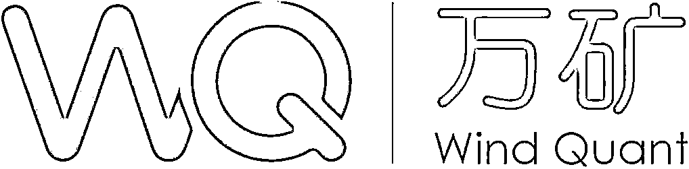

# 宽客们：秦始皇在召唤你！

> 原文：[`mp.weixin.qq.com/s?__biz=MzAxNTc0Mjg0Mg==&mid=2653295843&idx=1&sn=d0a700e5c8fe7ffa286252c8f4218edb&chksm=802dd6f6b75a5fe065c840cf6ad270b55921b3384fbfa1f7b96c888ddc8b55144808e174f548&scene=27#wechat_redirect`](http://mp.weixin.qq.com/s?__biz=MzAxNTc0Mjg0Mg==&mid=2653295843&idx=1&sn=d0a700e5c8fe7ffa286252c8f4218edb&chksm=802dd6f6b75a5fe065c840cf6ad270b55921b3384fbfa1f7b96c888ddc8b55144808e174f548&scene=27#wechat_redirect)

**标星★****置顶****公众号     **爱你们♥   

全网评选中：

## **[2019 | 你最喜爱的券商金工团队是？](https://mp.weixin.qq.com/s?__biz=MzAxNTc0Mjg0Mg==&mid=2653295802&idx=1&sn=518ba53c7e67709a3eb4e5a25ac8f74b&chksm=802dd6afb75a5fb9c4f30ab5ddf97809bb6a37586d22aaedf7896436173ed3fb2abee8bb4474&token=2097460753&lang=zh_CN&scene=21#wechat_redirect)**

近年来，**因子投资备受市场关注，其已成为资产管理领域非常重要的理念之一**。在国内量化行业，许多量化金融机构都对因子投入了大量研究，包括类选股因子、传统基本面因子、技术类因子、高频因子的挖掘等都取得了有效进展。

当投资者踏着金融创新的步伐追求超额收益的同时，二级市场的现代风控技术也越来越受到重视。近年来，中国证券市场的风控工作也得到了国家的大力支持。**中国人民银行印发的《金融科技（FinTech）发展规划（2019-2021 年）》也同样提到通过金融科技提高金融风控水平。**

**本次大赛围绕 ****量化因子挖掘、****风****险控制 ****为主题展开**，结合万矿 WindAlpha 工具，挖掘和培养有志于从事量化投资、风险控制的高端人才，为相关机构培养具有因子挖掘能力的研究员。通过整合、引导高校教育与金融两大创新资源，为打造国际化大数据人才队伍和提升本土人才国际化素质搭建平台。

***赶快报名参赛吧！******！！***

***www.windquant.com ******等你*** | 中国大陆领先的金融数据、信息和软件服务企业，总部位于上海陆家嘴金融中心。在国内市场，Wind 的客户包括中国绝大多数的证券公司、基金管理公司、保险公司、银行和投资公司等金融企业；在国际市场，已经被中国证监会批准的合格境外机构投资者（QFII）中的众多机构是 Wind 的客户。 | Wind 旗下高端量化分析云平台，提供基于 Python 的量化投资研究环境，以及丰富的金融数据，全矩阵覆盖量化投研环境。用户通过浏览器或 Wind 金融终端即可开始投资研究。****主赛：****量化因子挖掘大赛****

**1、目标：**

挖掘盈利稳定的因子。

**2、赛题设置：**

*   选股范围：中证 800（剔除 ST、*ST、上市不满一年新股、停牌、涨停）；

*   初始资金：10000000（1 千万）;

*   样本内时间：2012 年 1 月 1 日-2019 年 10 月 30 日；

*   每日持仓量：以根据因子排名前 10%的股票作为持仓每日持仓量（具体是因子值最大的前 10%股票，还是因子值最小的前 10%股票根据具体因子的性质自行定义）；

*   调仓频率：日、周、月，不区别评分，但指标计算会有相应调整；

*   交易成本：不考虑滑点，所有交易费用合计为万 3；

*   回测工具：统一用 WindAlgo 模块。

**3、单因子表现打分公式：**

其中 S_ic 为因子 ic 体系综合得分，S_pflo 为因子组合绩效综合得分。具体：

其中：

更详细赛题了解，请点击**阅读原文**了解

**分赛一：**风险预测分赛****

**1、目标：**

预测选定股票指数和商品期货的次日收益波动率。

**2、赛题设置：**

*   指数选取范围为：

*   股票指数——上证综指、上证 50、沪深 300、中证 500；

*   商品期货——黄金、原油、螺纹钢、豆粕、PTA、铁矿石、白糖；

*   预测目标为标的次日波动率，当天收盘后赛事组委会运行预测模型、记录预测值，并在次日收盘后验证；

*   预测时间段为复赛进行时段。

**3、指标评分公式：**

通过偏差测试打分，计算预测波动率值与实际波动率值的偏差大小，测评公式为：

其中 f(x)为模型给出的预测值，y 为实际值，bias2 为偏差值大小。

更详细赛题了解，请点击**阅读原文**了解

**分赛二：风控指标设计分赛**

**1、赛题设置：**

*   设计衡量不同种类风险的风险指标。风控目标包括但不限于：波动率、相关系数、市场情绪、下行风险等。作品形式包括但不限于风控指标设计的公式、风控模型的设计论述等。

更详细赛题了解，请点击**阅读原文**了解

**赛事规则**

本次大赛**面向 ****全国****高校在校学生**，凡正式注册的在读大学生（含本科生、硕士生、博士生及国（境） 外同层次的学生）均可参赛，参赛人数不限。在报名及初赛阶段，参赛团队通过指定网站提交初赛作品成功视为确认报名参加比赛。参赛者可以组成**1-4 人**的团队报名参赛。允许参赛者来自不同单位，以第一作者所在单位为参赛单位，但必须全部为学生。**每人最多只能参加一支参赛队伍，每支队伍可以参加多个比赛（主赛、分赛都可以同时参加）。**

**大赛流程及时间安排**▍**2019 年 12 月 1 日~****2020 年 3 月 31 日****：****报名&提交策略阶段**▍2020 年 4 月 1 日~2020 年 9 月 1 日：初赛阶段▍2020 年 9 月：复赛阶段▍2020 年 10 月：评审阶段**奖项设置**

本次比赛设一、二、三等奖，优胜奖项按最终成绩酌情确定。

**1、主赛：****量化因子挖掘**

**2、分赛：风险预测**

**3、分赛：风控指标设计**

**赛事咨询**

参赛过程中，如有任何问题可通过邮件等方式与主办方联系。更多活动信息，请关注大赛官方微信公众号及 QQ 群了解大赛最新动态。

1、服务邮箱：***service@windquant.com***

2、* 量化因子挖掘主赛、风险预测分赛、风控指标设计分赛服务 QQ 群：**905662718**（只通过参赛队伍）：

WindQuant 需给参赛队伍开通高级数据权限

请队长务必加入 QQ 群

**WindQuant 福利**

为了让所有参赛选手对赛题有更深入的了解，同时对量化投资、Python 编程有更充分的掌握。万矿特推出了：

**▍WQFA 人才培养计划****（超人气）**

• **数万**学员报名 WQFA，课程累计收看量达**30 万+**

• 从机构到高校，各行各业对量化投资感兴趣的人们都加入了 WQFA 计划，部分包括（排名不分先后）：

部分机构

嘉实基金、博时基金、华安基金、华夏基金、汇添富基金、平安人寿、中国银行、普华永道、国泰君安、中融信托、景顺长城、幻方量化、九坤投资、敦和资管、大岩资本、UBS······

部分高校

清华、北大、人大、上交、浙大、复旦、中大、上财、中科大、西财、央财、中科院、港大、新加坡国立大学、卡耐基梅隆大学、墨尔本大学、剑桥大学、帝国理工、纽约大学、宾夕法尼亚大学、加州大学伯克利分校······

**报名学习**，点击上方图片

**▍Python 基础线上培训**（超人气）****

• 所有课程**免费**。• **真正从 0 到 1**掌握 Python。•  很用心的为大家准备每一节课程，希望真正帮助那些想学 Python 的金融人，让你们从入门到不放弃！

**课程回听、课件获****取**，点击上方图片

**▍因子投资专题系列**（重点针对主赛）****

• **12 家**券商金融工程团队• **1****8 位**业界知名分析师• **22****场**精彩的线上分享

**收听讲座+课件获取**，点击上方图片

**参赛纪律声明**

1、参赛作品应具有团队原创性，不得将他人的科研成果直接作为参赛作品，一经发现将取消团队参赛资格。凡是涉及产权纠纷的参赛作品，专家委员会一律不予评审。

2、参赛者不得运用非法手段窃取他人技术数据等。如出现此类问题，取消其参赛资格并通报其所在培养单位。3、大赛专家委员会及评审专家等各职能部门及个人严格遵守大赛各项规章制度，做到公正、公平、公开。**指导单位**

陕西省科学技术协会

**主办单位**

西咸新区开发建设管理委员会

**承办单位**

陕西科技报社

西咸新区金融工作办公室

陕西西咸金融控股集团有限公司

西咸新区旷特投资管理有限公司

**协办单位**

万得信息技术股份有限公司

陕西省科普宣教中心

西咸新区金控资本资产管理有限公司

全英/全欧中国经济学会

西安交通大学经济与金融学院

中国海洋大学经济学院

西安电子科技大学经济与管理学院

西北大学经济管理学院

西安邮电大学计算金融与风险管理研究中心

陕西空港金控资产管理有限公司

中国银河证券股份有限公司

中大期货有限公司

光大投资基金（青岛）有限公司

**媒体支持**

Wind 资讯

万得大学

量化投资与机器学习

*—End—*

量化投资与机器学习微信公众号，是业内垂直于**Quant**、**MFE**、**Fintech****、AI、ML**等领域的**量化类主流自媒体。**公众号拥有来自**公募、私募、券商、期货、银行、海外**等众多圈内**18W+**关注者。每日发布行业前沿研究成果和最新量化资讯。

你点的每个“在看”，都是对我们最大的鼓励