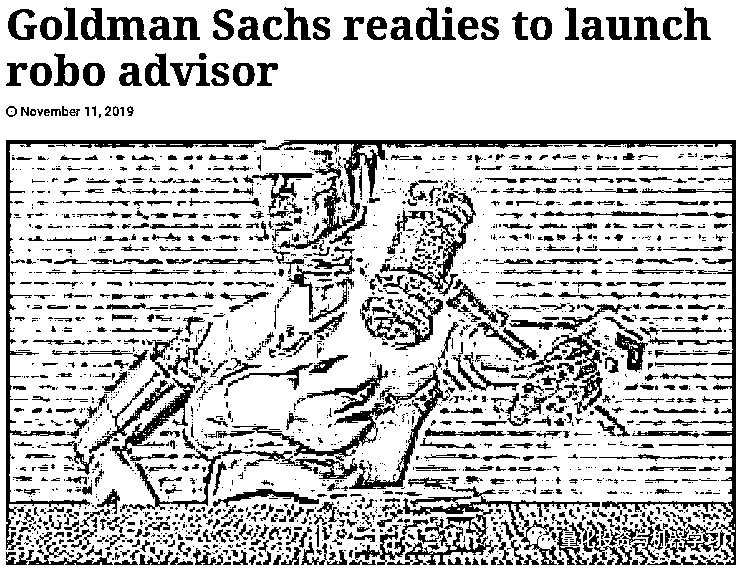
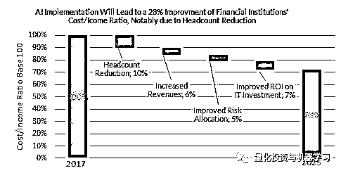
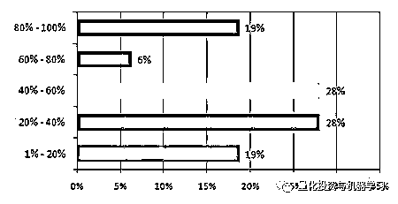
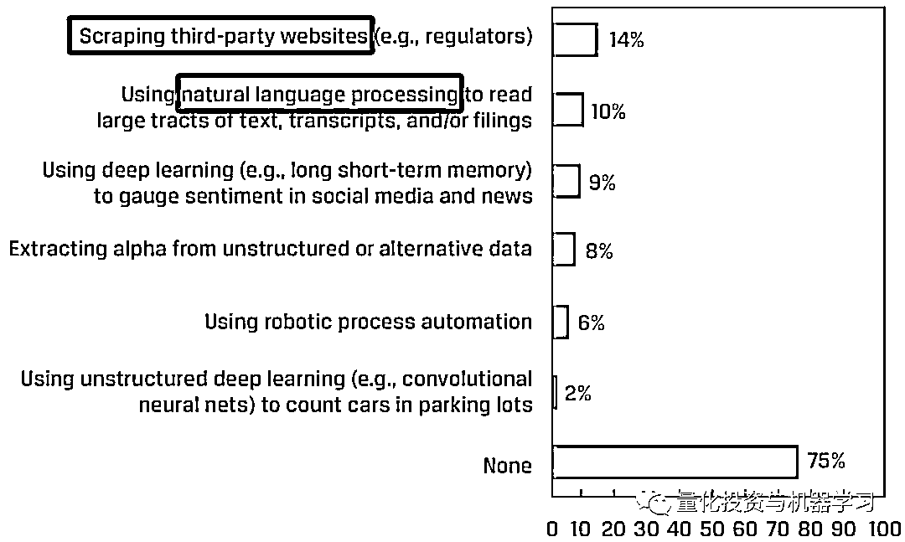
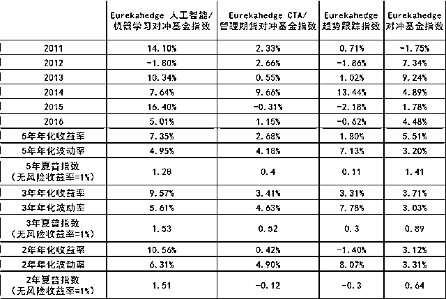

# 这场举世瞩目的人工智能听证会，让华尔街何去何从？

> 原文：[`mp.weixin.qq.com/s?__biz=MzAxNTc0Mjg0Mg==&mid=2653295832&idx=1&sn=6ce3a88c05eac71aa11d36681544a503&chksm=802dd6cdb75a5fdb0fb597cfdfa57ff928731f605b5d81af95f664c5b40d5dcbfd00d814b859&scene=27#wechat_redirect`](http://mp.weixin.qq.com/s?__biz=MzAxNTc0Mjg0Mg==&mid=2653295832&idx=1&sn=6ce3a88c05eac71aa11d36681544a503&chksm=802dd6cdb75a5fdb0fb597cfdfa57ff928731f605b5d81af95f664c5b40d5dcbfd00d814b859&scene=27#wechat_redirect)

**标星★****置顶****公众号     **爱你们♥   

本期编辑：**Allen**

未经允许，禁止转载

全网评选中：

## [**2019 | 你最喜爱的券商金工团队是？**](https://mp.weixin.qq.com/s?__biz=MzAxNTc0Mjg0Mg==&mid=2653295802&idx=1&sn=518ba53c7e67709a3eb4e5a25ac8f74b&chksm=802dd6afb75a5fb9c4f30ab5ddf97809bb6a37586d22aaedf7896436173ed3fb2abee8bb4474&token=2097460753&lang=zh_CN&scene=21#wechat_redirect)

**正文**

今天的这篇文章想说的太多太多，那就让我们从 Marcos Lopez de Prado 说起吧！

公众号第一次介绍 Marcos Lopez de Prado，则是来自他一篇论文：《The 7 Reasons Most Machine Learning Funds Fail》，公众号进行了解读，详见：

## [**机器学习应用量化投资失败的 7 个主要原因**](https://mp.weixin.qq.com/s?__biz=MzAxNTc0Mjg0Mg==&mid=2653286358&idx=1&sn=549e54a2a3b9607b18056463d90cd929&scene=21#wechat_redirect)

此后我们还对他的另一篇论文进行了解读：《The 7 Reasons Most Econometric Investments Fail》，详见：

## [ **计量经济学应用量化投资失败的 7 个主要原因**](https://mp.weixin.qq.com/s?__biz=MzAxNTc0Mjg0Mg==&mid=2653292186&idx=1&sn=87501434ae16f29afffec19a6884ee8d&scene=21#wechat_redirect)

在国内大多数人眼中，最为出名的是他那本大名鼎鼎的**《Advances in Financial Machine Learning》**，堪称经典！

公众号联合王的机器准备对其做一个全面的解读。下面是第一期内容：

[**《AFML 第一章脱水解读》**](https://mp.weixin.qq.com/s?__biz=MzAxNTc0Mjg0Mg==&mid=2653292098&idx=1&sn=b48bfb2858fc3edb00679c95dacd146f&scene=21#wechat_redirect)

第二期即将推出

同时，Marcos Lopez de Prado 还被***Journal of Portfolio Management***评为 2019 年度 Quant，被认为是当今金融界领先的量化数学家之一。

Marcos Lopez de Prado 目前在 SSRN 经济学领域的作者中排名第一（根据过去 12 个月内下载的 paper 来计算，最新数据截至 2019 年 12 月）：

前不久，他离开了 AQR，创办了自己公司 TPT（True Positive Technologies）:

*TPT’s mission is to help bring asset management into the 21st century.*

*We focus all of our efforts on one task: uncovering persistent inefficiencies in financial markets. The client keeps the assets, so that all our resources are directed towards alpha generation. This, combined with our relentless automation, allows us to deliver performance at much lower costs than those charged by traditional asset managers.*

上面就是其公司的理念与宗旨。

Marcos Lopez de Prado 在接受电话采访是说：

***“There is tremendous hype and very few people have a track record···It’s not helpful.”***

他也曾经说过：

“我的抱负一直是帮助金融业实现现代化，为投资者提供颠覆性的解决方案。”

“最好的方法就是用我自己的方式。”

*图片来自：彭博

很明显，许多机器学习或基于人工智能的投资基金只获得了微小的成功。Eurekahedge AI 对冲基金指数是一个由 29 只成分基金的平均加权指数。该指数旨在为那些在交易过程中利用人工智能和机器学习理论基础的对冲基金经理提供业绩衡量指标。该指数在 2010 年 12 月初始值为 100 刀。

Eurekahedge AI 指数在 2018 年和 2019 年（截至今日）的收益率分别为-4.31%和 4.43%。

## 部分统计指标，截止 2019 年 12 月 17 日

## 历史月度表现，截止 2019 年 12 月 17 日

Marcos Lopez de Prado 的也在近期的一篇论文中强调：

****

**“基金经理经常把数据扔给机器人，却没有形成一个理论，没有这个理论，投资者就会把信任寄托在玩具模型或高科技占星术上。****”**

Greenwich Associates 调查了 107 位市场参与者对人工智能影响交易的看法：

Brookings Institution 在今年（2019）11 月份发布的一份报告称，白领、受教育程度较高的等最容易受到人工智能扩散到经济中的影响。斯坦福大学研究生 Michael Webb 指出：**商业、金融和科技更容易受到 AI 的影响。**

*图片来源：Webb's 报告

目前 Marcos Lopez de Prado 计划聘用一个约 20 人的团队，并根据每项任务聘请外部专家。Marcos Lopez de Prado 称，该公司已经与一些新客户签约，包括一家主权财富基金和几家对冲基金。

**机器学习与回归和大数据的区别**

Lopez de Prado 还在 SSRN 网站上发表过一篇论文: 

在这篇文章中，Marcos Lopez de Prado 解释了机器学习如何不同于传统的回归分析，回归分析是经济学和金融学的支柱。他用下面的例子来说明这一点：

*Consider the following example: A researcher wishes to estimate the survival probability of a passenger on the Titanic, based on a number of variables, such as gender, ticket class, age, etc. A typical regression approach would be to fit a logit model to a binary variable, where 1 means survivor and 0 means deceased, using gender, ticket class and age as regressors. It turns out that, even though these regressors are correct, a logit (or probit) regression model fails to make good predictions. The reason is that logit models do not recognize that this dataset embeds a hierarchical (tree-like) structure, with complex interactions. For example, adult males in second class died at a much higher rate than each of these attributes taken independently.* *In contrast, a simple “classification tree” algorithm performs substantially better, because the algorithm learns the hierarchical nature of the dataset (and associated complex interactions).*

Marcos Lopez de Prado 还强调，机器学习不仅仅是大数据，实践者必须正确分析这些数据才能有效，并且必须使用比传统经济学更复杂的模型。他解释道：

*The bad news is that these datasets are beyond the grasp of econometrics, and pose multiple challenges to the study of economics. To cite just a few: *

*(a) some of the most interesting datasets are unstructured**. They can also be non-numerical and non-categorical, like news articles, voice recordings or satellite images;*

*(b) these datasets are high-dimensional (e.g., credit card transactions.)* *The number of variables involved often greatly exceeds the number of observations, making it very difficult to apply linear algebra solutions; *

*(c) many of these datasets are extremely sparse**. For instance, samples may contain a large proportion of zeros, where standard notions such as correlation do not work well; and *

*(d) embedded within these datasets is critical information regarding networks of agents, incentives and aggregate behavior of groups of people.* *ML techniques are designed for analyzing big data, which is why they are often cited together.*

让我们再回到今天的主题：**一场重要的会议！**

**一场重要的会议！**

2019 年 12 月 6 日，由美国众议院金融服务委员会组织的主题为（下方）的讨论会：

***Robots on Wall Street: The Impact of AI on Capital Markets and Jobs in the Financial Services Industry.***

Marcos Lopez de Prado 与另外四名专家一起出席作证，就人工智能对华尔街的影响进行发言。作证的五位小组成员是：

*   **Dr. Charlton McIlwain**,Vice Provost for Faculty Engagement and Development and
    Professor of Media, Culture, and Communication at NYU

*   **Dr. Marcos Lopez de Prado**, Professor of Practice, Engineering School, Cornell University and Chief Investment Officer, True Positive Technologies

*   **Ms. Rebecca Fender**, CFA, Senior Director, Future of Finance, Chartered Financial Analyst Institute

*   **Ms. Kirsten Wegner**, Chief Executive Officer, Modern Markets Initiative

*   **Ms. Martina Rejsjö**,   Head of Nasdaq Market Surveillance, Nasdaq Stock Market

 小组讨论的议题包括：

**1、计算机自动化和人工智能对金融行业的潜在影响。**

**2、可能对该行业就业产生的影响。**

**3、金融领域机器学习系统的各种数据类型。**

**4、人工智能和机器学习方法是否有助于发现金融市场中的欺诈行为。**

**5、该领域所需的培训，既针对现有专业人员，也针对 K-12 教育系统的年轻人。**

**6、需要调整移民政策，允许更多在美国接受教育的专业人才毕业后留在美国。**

**7、是否需要在该领域采取反垄断行动，以防止少数几家成功的大型企业主导市场并推高价格。**

**8、金融行业可能需要哪些其他法规或披露要求。**

这份是委员会备忘录：

**下载：***https://financialservices.house.gov/uploadedfiles/hhrg-116-ba00-20191206-sd002-u1.pdf*

这份是 Marcos Lopez de Prado 为听证会准备发言的摘录：

**下载：***https://www.mathinvestor.org/resources/MLDP-20191206-House-v3.pdf*

部分内容:

金融【机器学习】给金融和保险行业的 614 万从业人员带来了许多挑战，其中**许多人将失去工作，这不一定是因为他们被机器取代了，而是因为他们没有接受过与算法一起工作的培训。**对这些人进行再培训是一项紧迫而艰巨的任务。但并非一切都是坏消息。关键是要保证接受技术教育的平等机会。**在金融领域，数学也可以成为 The Great Equalizer**。

对现有员工进行再培训是最重要的，但这是不够的。我们必须确保美国保留其发展的人才。下一个谷歌、亚马逊或苹果的创始人今天早上正在我们的一所大学上工程学或数学课。与过去不同的是，**这些未来的企业家很可能是持学生签证来美国的，他们毕业后将很难留在美国。除非我们帮助他们留下来，否则培养的人才又面临大批量的流失。**

**下面是 Marcos Lopez de Prado 的发言，****公众号做了独家翻译（讲的比较快，我们尽可能做到完善）：**

[`mp.weixin.qq.com/mp/readtemplate?t=pages/video_player_tmpl&action=mpvideo&auto=0&vid=wxv_1123784125623795712`](https://mp.weixin.qq.com/mp/readtemplate?t=pages/video_player_tmpl&action=mpvideo&auto=0&vid=wxv_1123784125623795712)

视频

**发言如下：**  

谢谢 Foster 主席。今天很荣幸被邀请为这个委员会做出贡献，由于模式识别超级计算和大数据方面的最新进展，今天机器学习算法一直是只有专家才能完成的任务。特别感兴趣的领域是投资管理。有三个原因，首先，历史上一些最成功的对冲基金碰巧是算法型的。算法基金的主要优势是它们的决策客观、可重复，并且是经过长期验证的，第二个优势是它们的信息使我们能够降低成本。自动任务包括构建前的订单执行、预测等。

我同意对金融和保险行业 600 多万从业人员面临的挑战进行统计，他们中的许多人将会失业，不是因为他们会使用机器，而是因为他们没有接受过培训或者没有和算法结合起来工作。对这些工人进行再培训是一项紧迫而困难的任务，但并非一切都是坏消息。有色眼镜技能在金融领域变得更加重要，因为个人关系有更多的时间来缩小男女之间的工资差距，这是现在应该知道的另一种分类。你会发现我们是一个伟大的均衡器，保留我们现有的劳动力是重要的，然而，这还不够，我们必须确保美国大学想要及时收集的人才在我们的国家得到发展，下一个谷歌、亚马逊或苹果的创始人是早上在我们的一所大学上数学课，甚至是在教室。

与过去不同的是，这两种情况都不是我们国家的学生签证，除非我们帮助他们，否则他们将很难留在美国。除非我们帮助他们，否则他们今年将和他们的同学一起回国与我们竞争。另一方面，我想提请大家注意 ragtime 的实际例子，即机器学习算法在监管监督中的应用。reddead 首先参与的是众包调查，监管者面临的最具挑战性的任务之一是在海量数据中识别市场操纵者。这是最近非常棘手的任务，就像大海捞针一样。监管机构按照云实现或 Netflix 价格的例子，注册数据科学社区帮助的实用方法。

因此，监管机构仔细审查了提供给全球数据科学家群体的部分数据，他们将获得监管机构对违法者的部分罚款。下一次，金融市场变得可疑，就像闪电崩盘一样。stormers 的方法可能导致更快地识别潜在的市场监管者，事实的第二个实施例说，虚假投资产品的发现，经济金融期刊充满虚假投资，股票是实践失败的结果，金融公司提供在线工具来过度投资因子，甚至大型对冲基金可能为此多次导致投资者损失。一种解决方案是要求金融公司记录项目开发中涉及的所有因素，利用这些信息，所有领导者和监管者可以计算出投资策略被过度利用的概率，这种概率可以在金融宣传材料中报告。

最后，我想以对偏差的讨论来结束我的发言。是的，机器学习算法研究包含偏差。好消息是，我们有更好的机会检测算法中偏差的存在，这是一种比人类更精确的偏差测量。原因是我们可以让算法匹配友好的 mice 控制实验。A recolor it outside business to perform as intended, algorithms canassist human position makers by providing a basin recommendation that humans canoverride, thus exposing biases in humans。我说算法投资是因为委员会和监管者可以在帮助获得这项技术的好处，同时降低其风险，从而更普遍地发挥根本性作用。感谢给我这次机会来听证会发表意见，我期待大家的提问。

···

彭博也报道了这件事，在近两个小时的听证会上，议员们就人工智能领域的种族和性别偏见、对高技能技术工人的竞争，以及监管日益复杂、数据驱动的金融市场所面临的挑战，向专家提问。

Modern Markets Initiative 首席执行官 Kirsten Wegner 表示：

**“金融监管机构必须具备资金来源、技术能力，以及人工智能和自动化技术，才能成为一名强有力、高效率的巡逻警察。”**

Nasdaq Surveillance North America Equities，Nasdaq inc.负责人 Martina rejsj 表示：

**“纳斯达克运行着 40 多种不同的算法，使用约 35000 个参数，实时查找市场滥用和操纵行为。”**

她说：“市场数据的大量增长，在很多情况下是指数级增长，这对监控专业人员来说是一个重大挑战”。“滥用市场的企图变得更加复杂，给监管团队施加了更大压力，迫使他们在数据大海捞针。”

CFA Institute 高级总监 Rebecca Fender 表示：

**“一项针对 3800 多名受访者的调查显示，43%的 CFA 会员和考生预计，他们的角色将在未来 5 至 10 年内发生重大变化。最有可能消失的三个职位是销售代理、交易员和业绩分析师。”**

也许这场听证会会让人工智能在华尔街更加受到重视。

**华尔街下一步会如何？**

根据前几天的报道：最近有消息称，高盛将要推出机器人顾问，或将完全取代交易员。

“机器人顾问对交易员生存业态的冲击很大。”一位华尔街金融机构股票交易员直言，基于大数据、人工智能等各类金融科技技术的机器人投资模型，**正从根本上替代交易员的人工交易决策机制，最终导致交易员这个职业成为历史。**

*图片来源：Managers of Wealth

今年 5 月，高盛以 7.5 亿美元现金收购了 United Capital。在收购之时，United 拥有约 250 亿美元的管理资产，2.3 亿美元的收入，以及全国近 100 个办事处。该公司的 FinLife CX 数字平台和财务规划软件也随之而来。

高盛收购 United Capital 可能是高盛即将推出的机器人产品的先驱。

根据 Aite Group 的研究，2017 年，机器人咨询引发了新的可支配账户激增，达到 2700 万，而四年前只有 1500 万。到 2023 年，数字平台上的资产预计将超过 1.26 万亿美元。

金融服务咨询公司 Opimas 在一份报告中估计：**到 2025 年，人工智能的普及，华尔街将减少 10%的员工，约为 23 万人将被人工智能取代。****那么，谁最有可能被机器人抢走工作？**第一个被淘汰的将是那些本质上具有重复性的角色：支持功能、后台处理、生成依赖于结构化数据的报告。在摩根大通，比如 1 个机器人处理的 170 万个请求相当于 140 个人完成的工。 德意志银行首席执行官 John Cryan 指出，那些“大部分时间都在打算盘”的会计师面临失业风险。 McKinsey & co.合伙人 Jared Moon 预计，席卷投资银行的技术将使普通员工的工作量减少三分之一左右。

*图片来源：彭博

以初级投资银行家为例，他们花费大量时间收集和分析数据，然后编写报告。咨询公司 Kognetics 发现，投资银行分析师在每天 16 个小时的工作时间中，几乎有一半都花在了建模和更新手册图表等任务上。机器学习程序在这方面已经很擅长了。合规和监管部门的员工有一个不同的担忧：在过去五年里，他们的队伍扩大了一倍，而银行的员工总数下降了 10%。将这些活动自动化，即所谓的 regtech——对于希望控制合规成本上升的金融机构来说可能是好消息，而对于希望保住工作的人来说则是坏消息。
包括 LendingClub Corp.和 On Deck Capital Inc.在内的初创公司是网络借贷的先驱，它们迅速将希望借到钱的消费者与希望从利息中获利的人匹配起来。现在，各家银行都在寻求竞争，它们宣布了自己的在线贷款门户网站，并与金融科技公司建立了合作关系。这使得信贷员和办事员成为最容易受到自动化影响的职业。

*图片来源：彭博根据 OPIMAS 估计，**到 2025 年，金融机构的成本收入比率将提高 28% ，因为它们将目前由雇员执行的日常流程自动化**。2017 年，预计金融公司在人工智能相关技术方面的支出将超过 15 亿美元，到 2021 年将达到 28 亿美元，增长 75% 。

*图片来源：OPIMAS 人工智能将为金融机构带来无数好处，包括提高运营效率和降低成本。 它还将升级传统 IT 系统，改进数据和分析，增强客户服务，增加收入。 OPIMAS 预计，到 2025 年，金融机构推出人工智能技术，将使成本/收入比率降低 25%以上，尤其是通过削减总人数。摩根大通此前宣布将投资 114 亿美元研发全球股票交易机器人，贝莱德基金则正积极引入基于机器人投资决策的量化策略替代交易员人工投资决策机制，高盛则侧重投行工作的自动化，将 IPO 过程分成逾 140 个步骤，通过机器人模型自动完成。
**金融科技的应用使金融交易、销售、风控工作效率提升，对人力资源确实产生了明显的替代效应**，面对这样的趋势，国际银行巨头们，开始努力研发各种机器交易模型，开始抢大量相关人才。**甚至高盛前 CEO 劳尔德·贝兰克梵甚至将高盛重新定位为“一家科技公司”。**2019 年，高盛进军算法驱动的 ETF，表明华尔街越来越依赖先进的自动化操作。在几百名计算机工程师的技术支持下，自动化交易程序已经接管了高盛大多数日常工作量。在今年年初高盛发布的 2018 年报中，高盛员工数不降反增，雇佣员工人数提高了 9%，增加了近 3000 人。但是仔细分析就会发现，**新增的雇员基本都是科技岗的。**在高盛 2018 年的招聘岗位中，50%以上为工程技术人员。*图片来源：高盛 2018 年报高盛的 Strats 团队为了与科技公司争夺人才，薪资超级高。其成员均毕业于世界顶级名校，**绝大部分拥有的不是金融、而是数学与计算机科学相关的学位，且精专于各种编程语言。**据 CNBC 报道，高盛内部总结归纳出**“一名数据工程师可以取代四名交易员”**的规律，目前，高盛三分之一的员工是计算机工程师，约有 9000 人。与高盛一样，摩根大通也相当重视技术人才的招揽，摩根大通正在大力投资人工智能和机器学习技术。与其他大型投资银行一样**已将其 108 亿美元年度技术预算的一半以上用于新投资，寻找额外的摩根大通 AI 雇员。**甚至疯狂到，摩根大通新任人工智能和机器学习服务负责人 Apoorv Saxena，**仅两周**就从 Facebook 挖走了一位经验丰富的 AI 和大数据工程师加入他的团队。

根据香港万得通讯社报道，美国监管批准大举改革沃尔克规则，意味着“允许”华尔街大行以“对冲”的名义进行他们已经进行的相同的自营交易。<ai type="7" parm="{}" style="font-family: mp-quote, -apple-system-font, BlinkMacSystemFont, &quot;Helvetica Neue&quot;, &quot;PingFang SC&quot;, &quot;Hiragino Sans GB&quot;, &quot;Microsoft YaHei UI&quot;, &quot;Microsoft YaHei&quot;, Arial, sans-serif;">**高盛**</ai>**、**<ai type="7" parm="{}" style="font-family: mp-quote, -apple-system-font, BlinkMacSystemFont, &quot;Helvetica Neue&quot;, &quot;PingFang SC&quot;, &quot;Hiragino Sans GB&quot;, &quot;Microsoft YaHei UI&quot;, &quot;Microsoft YaHei&quot;, Arial, sans-serif;">**摩根大通**</ai>**、**<ai type="7" parm="{}" style="font-family: mp-quote, -apple-system-font, BlinkMacSystemFont, &quot;Helvetica Neue&quot;, &quot;PingFang SC&quot;, &quot;Hiragino Sans GB&quot;, &quot;Microsoft YaHei UI&quot;, &quot;Microsoft YaHei&quot;, Arial, sans-serif;">**摩根士丹利**</ai>等华尔街银行此前已向政府游说多年，如今终于将要得偿所愿。

8 月 20 日周二，美国货币监理署（OCC）和美国联邦存款保险公司（FDIC）双双批准了沃尔克规则改革方案。其他三个负责沃尔克规则的金融监管机构——美联储、美国证监会（SEC）和商品期货交易委员会（CFTC）预计也会在不久的将来签发。放松对银行进行“投机性”交易限制的法案改革呼之欲出。

这则消息公布后，各大行顺势调整业务。<ai type="7" parm="{}">高盛</ai>做的第一件事，并不是进行交易员“大扩招”，而是和同行、硅谷抢夺程序员。

**1、抢程序员！**

目前，沃尔克法则改革实施还未真正进入实施阶段，<ai type="7" parm="{}" style="font-family: mp-quote, -apple-system-font, BlinkMacSystemFont, &quot;Helvetica Neue&quot;, &quot;PingFang SC&quot;, &quot;Hiragino Sans GB&quot;, &quot;Microsoft YaHei UI&quot;, &quot;Microsoft YaHei&quot;, Arial, sans-serif;">高盛</ai>招兵买马了已经拉开序幕。最新消息称，高盛<ai type="17" parm="{}" style="font-family: mp-quote, -apple-system-font, BlinkMacSystemFont, &quot;Helvetica Neue&quot;, &quot;PingFang SC&quot;, &quot;Hiragino Sans GB&quot;, &quot;Microsoft YaHei UI&quot;, &quot;Microsoft YaHei&quot;, Arial, sans-serif;">交易</ai>部门已经启动了一项近几年前所未有的招聘计划。**这项招聘计划被媒体称为“整个工作都集中在程序员身上，这是华尔街未来走向的标志”。**

高盛<ai type="17" parm="{}">交易</ai>部门技术联合负责人 Adam Korn 表示，未来几个月，高盛<ai type="17" parm="{}">交易</ai>部门将招聘超过 100 名技术相关的职务的工程师。**由于目前在劳动力市场上，显然没有足够的人知道如何编程，**<ai type="7" parm="{}">**高盛**</ai>**计划在其在科技和金融行业的竞争对手那里“挖人”。****据悉，大多数新职位将设在纽约和伦敦。**

Adam Korn 对媒体表示：“等到高盛<ai type="17" parm="{}">交易</ai>部门融入这些新鲜血液之后，全世界都会知道我们在交易市场上有多活跃。**历史上，工程师不会认为是**<ai type="17" parm="{}">**交易**</ai>**部门的一份子，显然一切都改变了。****”**

据悉，<ai type="7" parm="{}">高盛</ai>大举招聘程序员的事宜得到了该行 CEO David Solomon 的支持。

Adam Korn 说：“<ai type="7" parm="{}">高盛</ai>高层对招聘更多的程序员充满兴趣且很兴奋，公司这样做是用实际行动证明自己的观点。”

**2、舍交易员……**

分析称，**从高盛的招聘启事上看，每招聘一名程序员就会解雇一位或者更多的交易员，“招聘更多的程序员**，是致力于能够对寻求自动化的<ai type="17" parm="{}" style="font-family: mp-quote, -apple-system-font, BlinkMacSystemFont, &quot;Helvetica Neue&quot;, &quot;PingFang SC&quot;, &quot;Hiragino Sans GB&quot;, &quot;Microsoft YaHei UI&quot;, &quot;Microsoft YaHei&quot;, Arial, sans-serif;">交易</ai>伙伴的要求作出反应。”

取程序员舍交易员，对于<ai type="7" parm="{}">高盛</ai>以及其他华尔街大行来说，是一件“有益无害”的事情。**首先，相比交易员，程序员的的成本低太多；而且算法**<ai type="17" parm="{}">**交易**</ai>**不需要拿走他们产生的全部利润的 10%；况且，交易员所做的**<ai type="17" parm="{}">**交易**</ai>**决策不仅可能不会有回报，而且还会受到监管的惩罚。**

众议院金融服务委员会主席 Maxine <ai type="7" parm="{}">Waters</ai>表示，自 10 年前的金融危机以来，美国 GSIB 作为一个大型金融集团，已因为损害消费者利益及其他非法行为累计支付了至少 1637 亿美元的巨额罚款。“他们(银行)似乎只是将这些罚款视为开展业务的成本。”

据悉，<ai type="7" parm="{}">高盛</ai>的最新招聘将有助于继续构建 Marquee，一个<ai type="17" parm="{}">交易</ai>和风险管理平台，该公司希望将其转化为<ai type="17" parm="{}">交易</ai>部门有意义的业务线。

除此之外，<ai type="7" parm="{}">高盛</ai>还对其电子交易平台进行了改造，为大规模对冲基金提供服务，着眼于利用<ai type="17" parm="{}">交易</ai>工具的进步，这些工具随后可以部署到更大的业务合作伙伴中。**这一逻辑足够可靠：****减少交易时间、处理更多请求和快速响应查询，以此有助于生成更多**<ai type="17" parm="{}">**交易**</ai>**和更多业务。**

未来，在<ai type="7" parm="{}">高盛</ai>等华尔街大行获得 7 位数薪酬的，不仅仅是交易员，也是程序员！

在<ai type="7" parm="{}">高盛</ai>之前，<ai type="7" parm="{}">花旗</ai>已经做出了先例。<ai type="7" parm="{}">花旗</ai>在 2019 年将从固收和股票交易两个部门进行裁员，其中股票部门至少裁员 100 人，占整个部门员工人数的 10%。裁员主要是因为客户不活跃（低频<ai type="17" parm="{}">交易</ai>），叠加机器<ai type="17" parm="{}">交易</ai>全面崛起。

美银美林研报也曾表示，**3 年之后，被动投资管理的资产规模将全面超过主动投资，交易员在华尔街也会变得更加“稀有”。**

**程序员占领硅谷以后，下一站是占领华尔街！**

**机器能“学习”金融吗？**

## AQR 的一篇报告这样说：

机器学习中的“学习”仅仅意味着统计和模型选择。新技术的创新之处在于，通过生成大量的数据和强大的算力，使大规模统计模型变得切实可行。

对于**机器学习与统计学的区别**，有很多论述：

1、论文 STATISTICAL MODELING: THE TWO CULTURES，这是 Leo Breiman 大神 2001 年发表在 Statistical Science 上的一篇老文，他将统计科学分为两个分支：Data Modeling 和 Algorithm Modeling。Data Model 直接假设数据服从一定的分布和随机噪声，数据均是由这些分布产生。而 Algorithm Modeling 认为框架内部非常复杂，他们只是寻找一个函数 f(x)，用 x 做输入来预测 y。文章认为**统计学过分依赖了 Data Modeling，而机器学习主要依赖****模型预测精度（predictive accuracy of models），从而取得了更多进步。**

2、Brendan O’Connor 的博文 Statistics vs. Machine Learning, fight!，初稿是 08 年写的，或许和作者的机器学习背景有关，他在初稿中主要是贬低了统计学，思想和 1 有点类似，认为**机器学习比统计学多了些 Algorithm Modeling 方面内容**，比如 SVM 的 Max-margin，决策树等，此外他认为机器学习更偏实际。但 09 年十月的时候他转而放弃自己原来的观点，认为统计才是 real deal: Statistics, not machine learning, is the real deal, but unfortunately suffers from bad marketing.

他的博文中还引用了大神 Robert Tibshiriani 的一张对比表：

3、与人们的普遍认识相反，机器学习实际上已经有数十年的历史了。受模型计算需求和早期算力限制的影响，这一领域之前并未兴起。然而，得力于近年来信息爆炸所带来的海量数据优势，机器学习正方兴未艾。

我们常常听到与这一问题有关的一些模糊陈述：

“机器学习与统计学之间的区别在于其目的不同。机器学习旨在进行精确预测。而统计学模型则用于推断变量之间的关系。”

从技术角度看，这一陈述是正确的，然而却并非令人满意且明确的答案。可以肯定的是，目的确实是机器学习与统计学之间的主要区别，但关于机器学习的精确预测与统计学的关系推断这一论断则没有什么意义，除非你精通这些概念。

《Nature Methods》杂志上发表了一篇论文，概述了统计学和机器学习的不同。这个想法看起来可笑，但是却证明了在这一层次探讨的必要性。

*Points of Significance: Statistics versus machine learning*

*Statistics draws population inferences from a sample, and machine learning finds generalizable predictive patterns. Two…*

*www.nature.com*

**机器学习建立在统计学基础上。**这是因为机器学习涉及数据，而数据则必须使用统计学框架进行描述。然而，被扩展为大量粒子热力学的统计力学同样也建立在统计学框架之上。压强的概念实际上也是一个统计量，温度也是如此。如果你觉得很可笑，没关系，但事实如此。这就是为什么你不能描述一个分子的温度或压力。温度实际上是分子间碰撞产生平均能量的表现。对于足够多的分子，比如房子或户外环境来说，描述其温度才具有实际意义。

你会承认热力学和统计学是一样的吗？不会的，实际上热力学是用统计学来帮助我们理解功和热相互作用产生的输运现象。

事实上，除统计学外，热力学的建立还以很多其他学科为基础。同理，机器学习（ML）的建立也要以数学和计算机科学等领域为基础，比如：

*   **ML 理论源于数学和统计学**

*   **ML 算法源于优化、接矩阵代数、微积分**

*   **ML 的实现要依靠计算机科学和工程概念（如内核技巧、特性哈希）**

**当我们用 Python 编程，引入 sklearn 库并开始使用算法时，很多概念都被抽象了，所以很难看到它们的区别。因此，这种抽象导致了对机器学习内涵的不了解。**

公众号编辑部也认为：

**机器学习 != 统计学**

AQR 报告举例了：**决策树和神经网络**

因为树模型通常是我们形成投资组合的方式：

在上图中：假设观察结果是股票收益，两个“排序”变量是公司的市场权益（ME）和账面市值比（B/M）。首先根据公司规模对股票进行排序，形成几个在规模上最相似的组。然后在每个组中，股票进一步按 B/M 排序。树的最终“叶”只是由在这些特征上彼此最相似的一组股票组成，这些股票可以形成一个股票组合。树模型对“large value”股票的回报预测就是 large value 投资组合的平均回报。学术金融几十年来一直使用投资组合排序（Fama 和 French, 1992），而这本质上就是决策树的作用。

下图左边显示了两个简单的神经网络。第一个例子展示了一个单一“输入层”和“输出层”的神经网络。从左到右影响一个方向的流动，这使得这是一个简单的“前馈”网络。输入是简单的预测因子/回归因子/独立变量 x，输出是因变量或结果 y。目标是了解输入如何影响输出并使用它来进行预测。

图：AQR

右图增加了“隐藏层”。在统计学的术语中，它是变量 x 的一个变换，在这种情况下，它取 x 的正值，然后将负值归零。正是这些隐藏层使得神经网络如此强大。

隐藏层增加了模型的复杂性，但基本思想是相同的。 模型首先将它们处理为 z1 和 z2，然后测量 y 与 z 的关系，而不是对 x1，x2 和 x3 进行回归。**在资产管理研究中，在回归前使用转换自变量（例如，通过波动率进行缩放）是常见****的**。神经网络只是将这个步骤带入模型中，而不是预先选择数据转换。它使用统计信息搜索许多潜在的转换，以学习 y 的最佳预测。它需要强大的处理能力和大量的数据能才能进行可靠地估算。

**大数据，高速处理器**

下图给出了“深度”神经网络的示例，这些类型的神经网络已被证明在地震建模、计算机视觉和自动驾驶车辆等各种应用中取得了成功。通过将成千上万个小网络叠加在一起，你最终得到了一个非常灵活的模型，可以捕捉到一系列的结果和变量之间的相互作用，这些变量是描述现实世界现象复杂性所必需的。如果没有大量的数据和强大的计算能力来计算所有的网络路径，这一切都不可能实现。因此，机器学习应用的巨大创新飞跃更多地是由技术而不是技术驱动的。

图：AQR

此外，计算能力与我们现在拥有的大量信息源密切相关。我们获取和存储数据的能力远远超过我们分析和理解数据的能力，而这正是机器学习能够帮助弥合这一鸿沟的地方——尽管还有很长的路要走。

**金融是不同的**

**机器学习可以完成很多事情，但它在金融中的应用并不明显，也没有得到研究的支持，至少目前还没有。**

具体有哪些不同，论文给出了以下几点：

**1、低信噪比**

在金融领域，尤其是收益预测。信噪比不仅很弱，而且总是会趋向于 0。

首先，**信噪比较低的一个原因是金融市场极度嘈杂**。世界上最好的股票或投资组合，在任何一天、一季度或一年中，都会因为意料之外的消息而经历剧烈的波动。

其次，**金融市场的信号预计会很低，而且将保持在低位**。低信噪比并非市场的不幸巧合。相反，它是一种通过利润最大化和竞争这种简单的经济力量来确保并不断加强的特征。如果交易员有一些可靠的信息可以预测未来价格上涨，这是一个强烈的信号，他们就不会被动地依赖这些信息。他们开始进行交易。正是这种利用预测信息的行为推高了价格，从而从市场中吸收了一些可预测性。而他们不会在价格上涨一点点后就停止。他们会继续购买，直到用尽他们的信息，直到价格完全调整到他们的信息预测水平。通过利用信息进行以利润为导向的交易，投资者将可预测性降到最低。**由于市场的可预测性已经体现在价格中，唯一能推动市场的是意料之外的消息——噪音**。这个观点并不新鲜。也正是这个想法支撑着诺贝尔奖得主关于有效市场假说的研究（Fama，1970）。

在有效市场中，回报不一定完全缺乏可预测性。例如，如果需要承担太多风险、面临交易成本，或者像内幕交易那样受到法律限制，投资者可能会停止使用他们的信息。剩下的可预测性应该很小，而且很难把握，因为任何容易获得的利润都会很快被有竞争力的交易员抓住。

**样本较少和非结构化数据**

**结构化数据 vs. 非结构化数据：**结构化数据由明确定义的数据类型组成，其模式可以使其易于搜索。而非结构化数据通常由不容易搜索的数据组成，其中包括音频、视频和社交媒体发布等格式。

另类数据解读，可见公众号文章：

[**另类数据是否可产生 Alpha？**](https://mp.weixin.qq.com/s?__biz=MzAxNTc0Mjg0Mg==&mid=2653292677&idx=1&sn=02245bb19a10b95f53c37f803d81810a&chksm=802dca90b75a43864b417c90d8c542aa9704d740d8a1af05a7bbb77989fcb022ae59445a35b1&token=1318691415&lang=zh_CN&scene=21#wechat_redirect)

**对于大多数非结构化数据集，数据历史很短**。例如，使用社交媒体，你可能有十年的数据要处理。有限时间序列对有意义的回测提出了挑战。由于历史较短，对策略表现形成准确的估计就更加困难，这最终意味着，即使是非常强烈的信号，在投资组合中也可能只会谨慎地获得很小的权重。

另类数据更多的应用于偏股票型的量化对冲基金。近于实时的另类数据流有助资产管理公司提前获得大量股票买入或卖出的信号。除此之外，传统资产管理公司也已经开始使用另类数据来帮助提升人工制定长期投资决策的质量。例如，英国资产管理公司 Schroders 在 2014 年推出了一个“数据洞察部门”（Data Insights Unit，以下简称“DIU”）。DIU 拥有 30 名数据科学家，他们分析各种另类数据，帮助投资组合管理团队制定中长期投资决策。

**欧美市场也正在形成包括使用另类数据的资产管理经理、数据所有者和供应商的另类数据生态系统**。例如，Orbital Insights 和 Prattle 两家另类数据供应商，前者利用卫星图像估计原油库存，后者根据文本数据定量分析主要国家货币政策情绪。

投资机构为了获得超额收益，不断寻找新的市场阿尔法，**但主动型基金在寻找市场阿尔法这个核心竞争力上的优势越来越弱：**

1、因为市场有效性不断增强，基金经理很难找到被错误定价的资产；

2、因为大部分基金经理能得到的信息同质化，导致很难找到独特的信息优势和额外信息；

3、因为调研高度人工化导致人才的费用越来越高。

**目前国内使用另类数据的多为对冲基金、二级市场基金及部分一级市场基金**。另类数据可以**给基金经理带来五点优势：**

*   **更大体量的数据和信息**

*   **新的洞察力**

*   **竞争优势**

*   **可靠性**

*   **效率**

虽然基金经理使用另类数据寻找到新的阿尔法只是时间问题，**但并不是所有另类数据都有潜力可以帮助基金公司获取市场阿尔法**，因此另类数据公司在收集、清洗数据的同时，需要基金经理来评判数据是否有价值，同时高效的处理和应用将是降低成本和提升效率的关键，因此**另类数据公司应当具备机器学习等技术开发能力和高效的产品策略**。

**另类数据并非神秘的、完全新生的事物，而是人类扩展信息边界的漫漫过程中的又一次量变性突破。**之所以这么说，是因为另类数据完全是一个具有相对性与变化性的概念。将历史拉长来看能更好理解：两百年前，地缘政治事件是另类数据；一百年前，股票价格数据是另类数据；五十年前，路透社公司首次将公司报表数字化之前，公司财务报表数据是另类数据。当时的这些数据和当今的网页数据等等很相似，都对于投资决策有重要意义，但其获取成本还未降低到足以使其普及。随着后来技术的不断进步，这些数据逐步被正式纳入投资决策数据，构成了今天的我们所认为的传统数据。而随着今天和未来技术的发展迭代，越来越多之前无法利用的有效信息、当下我们所称的“另类信息”也将逐步常规化，成为未来的传统数据。

**这一观点带给我们的启示是，数据的内涵与外延在不断变化，分析人员的思维不能停留在传统数据的舒适圈中，必须与时俱进，保持开放。而目前，我们的时代也许正处于这一轮变革浪潮的高潮。**

**需要可解释性**

部分机器学习模型是众所周知的黑箱。

模型的内部工作方式是资产管理中的一个重要的问题。资产管理者有责任去和客户沟通投资组合中的风险，这使得他们特别强调模型的可解释性。

# **机器学习模型的“可解释性”到底有多重要？**

虽然有些人说，知道模型性能好就行了，为什么还要知道它背后的原理呢？ 然而，作为人类，大多数决策基于逻辑和推理。 因此，人工智能（AI）作出决策的模式无疑会受到怀疑。 在很多现实情况下，有偏差的模型可能会产生真正的负面影响。 这包括预测潜在的犯罪、司法量刑、信用评分、欺诈发现、健康评估、贷款借款、自动驾驶等，其中模型的理解和解释是最重要的。 数据科学家、作家 Cathy O’ Neil 在她的著名著作《Weapons of Math Destruction》中也强调了这一点。

著名学者和作家凯特克劳福德在 NIPS 2017 主题演讲《The Trouble with Bias》中谈到了偏差在机器学习中的影响以及它对社会的影响。如果我们想利用机器学习来解决这些问题，所有这些真实世界的场景都在告诉我们模型解释是多么的重要。

随着时间的推移，由于环境中各种因素造成的模型概念漂移，性能可能会发生变化。因此，了解什么促使模型作出某些决定是极为重要的。论文《Why Should I Trust You？》由 MT Ribeiro，S. Singh 和 C. Guestrin 在 SIGKDD 2016 上介绍了 LIME（Local Interpretable Model-Agnostic Explanations）介绍了这些概念。

**然而，理解预测背后的原因在评估信任方面非常重要，如果计划基于预测采取行动，或者选择是否部署新模型，则对模型的信任是至关重要的。 无论人类是直接使用机器学习分类器作为工具还是在其他产品中部署模型，仍然存在一个至关重要的问题：如果用户不信任模型或预测，他们将不会使用它。**

同时大家可以看看这篇文章：

*地址：https://arxiv.org/pdf/1802.01933.pdf*

可解释性成为机器学习研究中一个优先考虑的问题。不过有许多有趣的潜在研究途径可以从金融机器学习模型中得出更有意义和更直观的结论。具体论述详见论文。

论文最后列举了一写机器学习在未来改进金融方面的方向：

**1、Analysis, Not Anecdotes**

当人们讨论金融领域的机器学习时：“我听别人说，关于某某经理是如何应用机器学习做到这一点的“。机器学习对资产管理的系统性研究还处于起步阶段。而且从经济上和统计上看，它的辅助作用是渐进的，但绝不是革命性的。

**2、Combining Economic Theory**

在资产管理中，人们可以通过引入经济理论来描述数据的某些方面，并辅以机器学习工具来捕获理论不涉及的数据的某些方面，从而解决低信噪比问题。

**3、Beyond Return Prediction**

虽然我们强调回报预测（由于其低信噪比和非平稳特性）对机器学习提出了一个特别困难的挑战，但也必须认识到，一些金融问题可以从机器学习中获益。与回报预测不同，投资者行为没有明显的趋势去消除这种可预测性，这使得机器学习可能更适合风险和交易成本建模。

大多数关于机器学习应用于金融领域的讨论，都集中在 Alpha 的创建上。使用新的数据和机器学习来构建 Alpha。随着越来越多的投资者带着类似的数据和工具进入市场，错误定价就会纠正，Alpha 就会减小为零。相比之下，一个有前途的资产管理研究领域，可以使用机器学习来改善投资的其他方面。

机器学习在金融领域的应用有可能成为量化投资的下一个飞跃。在资产管理实践中，理解机器学习当前状态的两个关键点是至关重要的。首先，**研究刚刚起步，许多重要问题尚待解决**。利用机器学习在投资组合上的**改善是渐进的，而不是革命性的**。

机器学习提供了一种系统化的投资方法，使管理机制化，允许管理者更快地消化来自更多新资源的信息，包括以前未开发的非结构化数据，并提供工具来搜索越来越灵活的经济模型，让这些模型更好地捕捉金融市场的复杂问题。**机器学习在金融领域的发展才刚刚开始。**

**AI&ML 究竟如何应用对冲基金**

**先说明一点，AI&ML 应用对冲基金，有成功的例子，也有失败的，我们并不是让大家一窝蜂去的学、去立马赚钱，而是想告诉大家，这是一个趋势，但是能不能成功（盈利），还是要看你对此技术的掌握程度。**

有人预测股价成功了、有人挖到了 Alpha 因子、有些人辅助他的策略···，我们今天只想说说，现在大厂都在招这样的人才，是为什么？AI&ML 有哪些东西确实在建模和投资中用到（具体细节怎么用，那人家肯定不会告诉你），而不是说一定要做出什么才算成功！

许多对冲基金正在使用人工智能分析大量数据，预测供需平衡的修正，并预测市场动向，以便进行战术性资产配置。这有可能帮助 CIO 团队整合不同的策略和定制分配。

近年来出现了一类完全基于机器学习和人工智能算法的人工智能对冲基金。包括 Aidiyia Holdings、cerebelum Capital、Taaffeite Capital Management 和 Numerai。最近，Numerai 通过其产品 Erasure 扩展了其商业模式，使其平台的元素能够为其他金融界所用，Erasure 是一个使用区块链技术分散式预测市场。

让 AI pure 这些新贵相形见绌的是一些在对冲基金行业家喻户晓的大型定量基金，如 Man AHL、Two Sigma、Citadel、Bridgewater 和 D.E. Shaw。多年来，像这样的投资者一直在使用计算机驱动的模型来揭示新的交易策略，并识别主题、因素和交易信号。量化分析师把这些因素和信号输入交易系统。随着市场的不断变化，这些前人工智能模型往往需要定量分析师的频繁监控和重新编程。人工智能模型的不同之处在于，尽管它们最初是由人类制造的，但它们能够自行适应不断变化的市场环境，而人类的监督和干预要少得多。量化基金经理已经开发出一种算法，可以收集和微调数据，然后在发现新模式时自动改变投资过程。

**1、正面**

去年 9 月，巴克莱对冲基金的的一项调查调查发现，超过一半的对冲基金受访者（56%）使用人工智能来指导投资决策，几乎是去年同期 20% 的三倍。大约三分之二使用人工智能的人这样做是为了产生交易想法和优化投资组合。调查显示，超过四分之一的人使用它来自动化交易执行。

*图片来源：巴克莱对冲基金

 超过一半的人认为人工智能/机器学习指导了他们 20-60%的决策过程，略低于五分之一的人认为它占了 80-100% 。43%的平均水平强调了这样一个观点，他们深深依赖于先进的自动化和数据分析工具。

*图片来源：巴克莱对冲基金

超过三分之二的调查对象对不到 5000 万美元的资产使用人工智能 / 机器学习，这表明他们不愿在机器人上下大赌注。另一种可能性是，规模较小的基金能够更好地执行交易，而不会将技术和策略拱手让给竞争对手。

通过来自 CFA 的人工智能报告中。基金经理在过去的 12 个月里，为了创建交易算法，使用的人工智能/机器学习技术：

*图片来源：CFA
我们还可以看到，NLP 这块对非结构化数据应用十分广泛：
*图片来源：CFA**Man Group**我们拿 Man Group 做个具体的说明：

Man Group 管理着约 960 亿美元的资产，通常会在几周内将其最有前途的想法从测试转化为真金白银的交易。在快速变化的现代金融世界里，今天的优势明天就可能消失。这里的问题是，即使程序在模拟交易中产生了惊人的收益，但工程师们也无法解释为什么人工智能要执行它正在进行的交易。所有起初他们对人工智能的应用十分谨慎。

这个项目一直被搁置到 2014 年，当时一位拥有数理博士学位的资深投资组合经理 Nick Granger 决定是时候让它退出测试。他从自己管理的一个投资组合中拿出一小笔钱给人工智能系统，然后再拿出更多···。“它经受住了我们的一切考验”Granger 说。

随着时间的推移，Granger 让公司对这个项目有了信心。到 2015 年，人工智能贡献了人类最大基金之一 AHL Dimension Programme 大约一半的利润，该计划目前管理着 51 亿美元，尽管人工智能只控制了总资产的一小部分。在该公司的其它领域（乃至整个行业），人工智能技术正被用于寻找最快的交易方式、押注市场动能、以及在新闻稿和财务报告中搜索可能预示股市涨跌的关键词。

根据(Man Group 网站的数据，规模 52 亿美元的 AHL Dimension 基金自 2014 年以来一直在使用这种技术，在截至 2017 年 6 月的三年中，该基金的回报率接近 15%。投资 42 亿美元的 AHL Alpha 和 33 亿美元的 AHL Diversified 在此期间分别增长了 13.1%和 7.6%。AHL 也开始使用这些模型。这些模型也用于曼哈趋势替代基金。这四家基金都使用了一系列算法来赚钱。四个基金累计管理规模达 127 亿美元自 2014 年初以来，Man Group 管理的资产激增了约 77%。自那以来，AHL Dimension 基金的资产已增长逾 5 倍。

*图片来源：彭博

Man Group 对人工智能的接纳，使其处于一场巨变的前沿。

**人工智能更进一步，使系统能够根据接收到的信息进行调整。在 Man Group，工程师设定参数：敞口上限、资产类别、波动性、交易成本等。合规和风险管理规则根植于金融体系的 DNA 中，防止它失控或违法，成为获利的快车道。这些约束设置了机器工作的边界。然后系统寻找模式，将人类看不到的数据连接起来。人工智能根据过去发生的事情做出有根据的预测，当机会对它有利时进行交易。**

Man Group 对人工智能的研究是在牛津大学的一幢高楼里进行的。该公司的工程师、统计学家和程序员与研究算法、人工智能和相关进展如何应用到金融领域的学者和研究人员共享这个空间。这一名为 Oxford-Man Institute of Quantitative Finance 的合作伙伴关系最初获得了 Man Group1420 万美元的捐款。这个研究所很安静，人没惹你工作的一个核心重点是采用机器学习技术，这些技术是为图像识别等领域而创造的，而不是金融或贸易。对冲基金已经建立了自己的代码库——有些是由自己的人编写的，有些是从公开的数据库中改编的。Man Group 的首席科学家、牛津大学实验室的负责人 Anthony Ledford 表示，工程师们在开发新的人工智能技术时可以从中汲取经验。

人工智能工程师使用惩罚和奖励来引导机器，这就像是教一只老鼠按下一个按钮来获取食物。在广为人知的深度学习中，算法被训练为在历史信息库中寻找预测模式。当他们发现股票或大宗商品定价数据等方面的相似之处时，就会“受到刺激”。在另一种方法中，称为强化学习，机器根据特定行为的成败来重新调整自己。研究人员还将惩罚编程到算法中，以阻止人工智能的某些行为，例如创建与人类已经使用的策略太相似的策略。

Man Group 或许最为外界所知的是它 Man Booker Prizes 文学奖的赞助，但它并不总是一家以科技为中心的投资公司。该公司由 James Man 于 1783 年创立，当时是 Harp Lane 的一家经纪公司，距离目前位于伦敦泰晤士河沿岸的办公室约 500 米。在接下来的两个世纪里，它向英国皇家海军供应朗姆酒，并交易咖啡和糖等大宗商品，最后将重点放在金融服务上。1989 年，曼恩开始收购一家名为 AHL 的电脑驱动的交易商店，这家商店现在存放着该公司所有最尖端的人工智能产品（AHL 这个名字来源于他们的创始人，AHL 的创始人后来创立了两家相互竞争的技术驱动型对冲基金 Aspect Capital Ltd.和 Winton）。

对 Man Group 来说，全球的的投资者越来越相信他们把钱投向了技术。计算机驱动的量化基金是去年对冲基金行业中唯一增长的部分。其它利用人工智能的公司包括文艺复兴科技、Two Sigma 和桥水。据报道，美国亿万富翁投资者 Paul Tudor Jones 在经历了收益率低迷之后，正在采用部分技术。管理亿万富翁 Steven Cohen 财富的家族理财 Point72 也一直在聘请该领域的专家。

*图片来源：彭博

Protege Partners 的创始人兼董事长 Jeff Tarrant 花了几年时间研究金融领域的人工智能。他说，虽然这项技术仍处于采用的早期阶段，但它将对整个行业产生革命性的影响，他将其比作优 Uber Technologies Inc.在交通领域的影响。Tarrant 表示，尽管 Man Group 积极采用人工智能，但它也有被颠覆的风险。一些专注于人工智能的新基金收取 1%的管理费和 10%的利润，是普通对冲基金的一半。在纯人工智能公司，大部分流程是自动化的，因此不需要庞大的劳动力。Tarrant 说，**这个行业的权力正在转移到那些拥有最好技术的人身上，而不是那些拥有最有才华的投资组合经理的人身上。他表示：“未来几年，资产管理行业将出现大规模失业。”**

再看看不是那么不成功的例子。

这是 2017 年我们分析的结果：

下表总结了人工智能/机器学习对冲基金相对于其他基金的某些关键性能数据。重要的结论包括：

*   除 2012 年之外，人工智能/机器学习对冲基金在其他年份中的表现都优于普通的全球对冲基金。

*   除 2011 年和 2014 年之外，人工智能/机器学习对冲基金在其他年份的收益率都高于传统的 CTA 基金/管理期货策略，并且只有 2014 年度的收益率低于系统化趋势跟踪策略（短线能源期货交易为该策略的收益率带来了强劲的增长）。

*   人工智能/机器学习对冲基金五年、三年和两年的年化收益率分别为 7.35%、9.57%和 10.56%，高于传统的量化对冲基金和普通的全球对冲基金。

*   与下表中列出的其他基金相比，人工智能/机器学习对冲基金过去两年和三年的风险调整后收益更高，夏普比率分别为 1.51 和 1.53。

*   与普通的对冲基金相比（对比 Eurekahedge 对冲基金指数），虽然人工智能/机器学习对冲基金的收益率更加不稳定，但是其年化波动率却要比系统化趋势跟踪策略低得多。

*图片来源：Eurekahedge

下表给出了人工智能/机器学习对冲基金与其他几种基金的相关矩阵。依据该表，我们可以得出一个有趣的结论：人工智能/机器学习对冲基金与普通对冲基金之间为负相关关系（-0.267），而与 CTA/管理期货基金和趋势跟踪策略之间则为正相关关系，相关系数介于零和零点几之间。这表明，人工智能/机器学习对冲基金的分散投资可以使整个投资组合实现正收益。

*图片来源：Eurekahedge

再我们 2019 年分析的结果，越来越不好了！

在美国，与人工智能相关的 ETF 管理着大约 60 亿美元的规模，而美国的股票 ETF 管理着 3 万亿美元的规模。**500 倍！**

**需求不足的一个原因可能是业绩不佳。自 2013 年以来，这类主题 ETF 的等权指数表现远逊于 NASDAQ 和全球科技指数。这还不包括管理费：这些 ETF 的平均年管理费为 78bps，而所有股票 ETF 平均年管理费为 53bps。**

****

**数据来自：ETF.com**

**但或许投资者根本就不应该把目标对准专注于人工智能基金。为什么不让人工智能直接管理我们的钱呢?** 

**不幸的是，**只有少数 ETF 的投资决策是由人工智能执行的**。那它们管理规模是多少呢？**刚刚超过 1 亿美元**。这些基金的年平均管理费为 0.77%。**

**但即便如此，投资者对人工智能的耐心也有限，解雇它们也是很容易的事。BUZ 是首只使用人工智能收集美国股市舆情数据的 ETF。今年早些时候，该公司在成立仅三年后就倒闭了。**

**近年来，以人工智能驱动的新 ETF 纷纷推出，其中包括使用 IBM 著名 Watson AI 的 ETF。这些基金大多试图击败美国大盘股。但很难找到证据表明他们在这方面取得了成功。事实证明，人工智能想要战胜市场，可能和人类一样困难。**

****以 AI 驱动的 ETF（美股）****

****

**数据来自：FactorResearch**

**以标普 500 为基准，四分之三以 AI 驱动 ETF 表现不佳。**

**尽管有两只 ETF 是今年推出的，交易历史较短，但如果认为人工智能会像传统 ETF 一样，需要一个完整的市场周期才能产生超群表现，那就有点牵强了。**

****CAGR****

****

**数据来自：FactorResearch**

**2 万多字，写累了，祝大家在人工智能、机器学习应用量化投资的道路上，努力前行！**

***—End—***

**量化投资与机器学习微信公众号，是业内垂直于**Quant**、**MFE**、**Fintech****、AI、ML**等领域的**量化类主流自媒体。**公众号拥有来自**公募、私募、券商、期货、银行、海外**等众多圈内**18W+**关注者。每日发布行业前沿研究成果和最新量化资讯。**