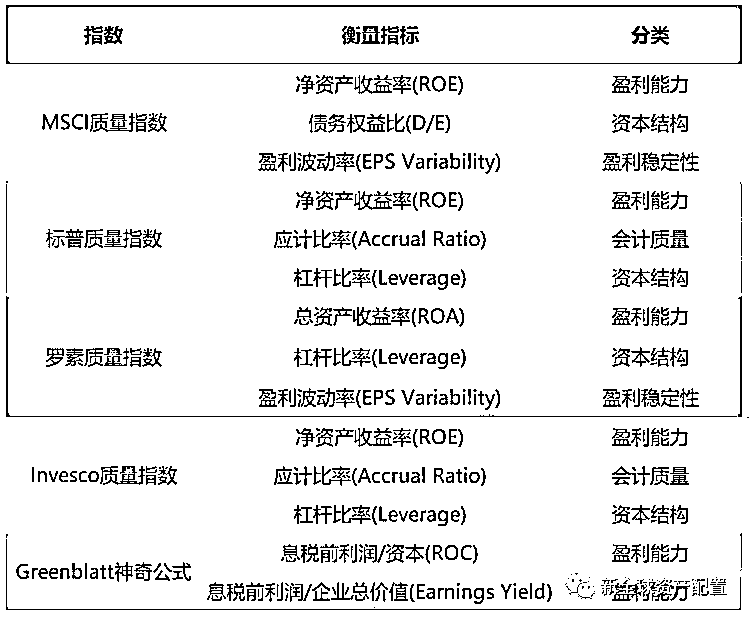
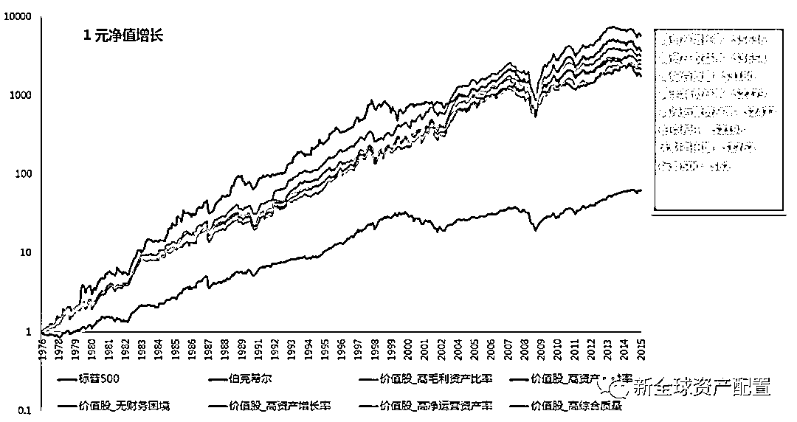
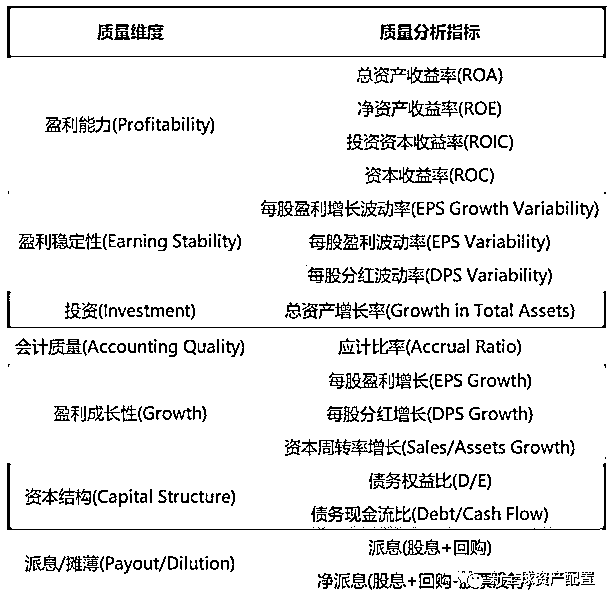
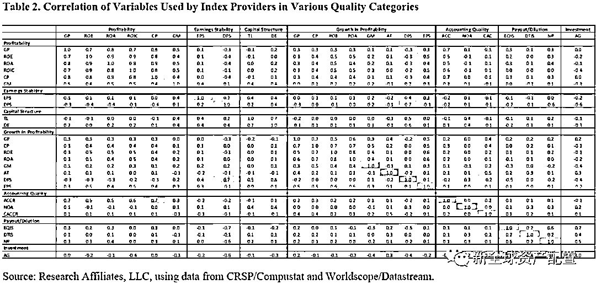
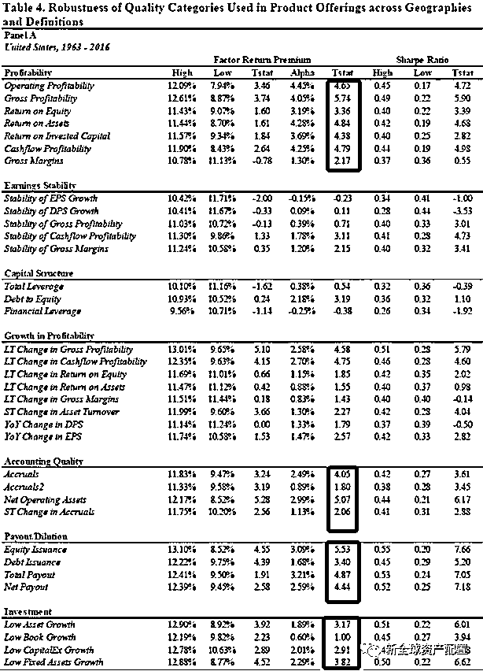
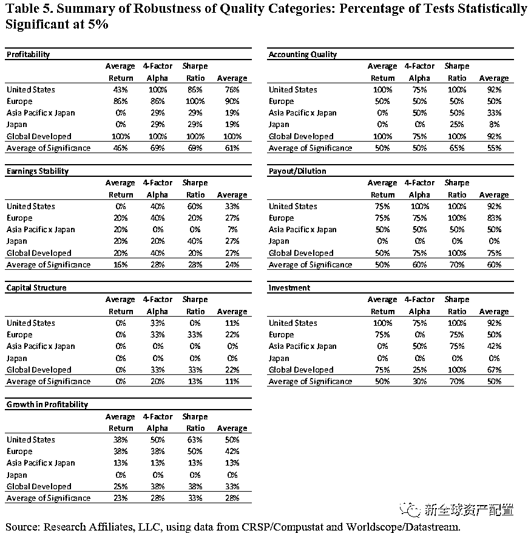
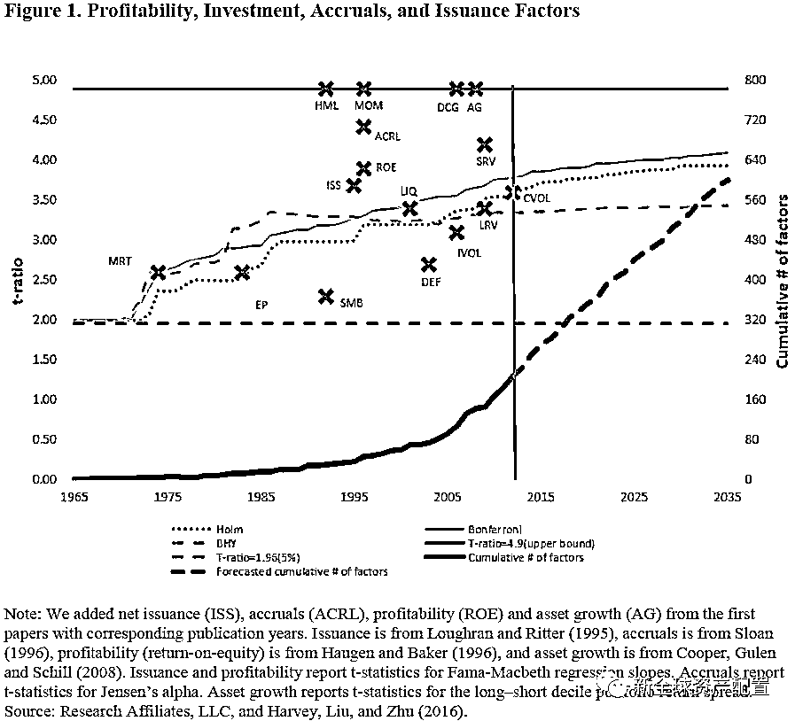
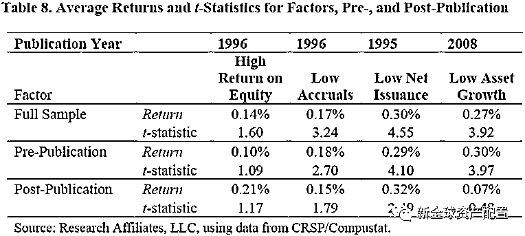
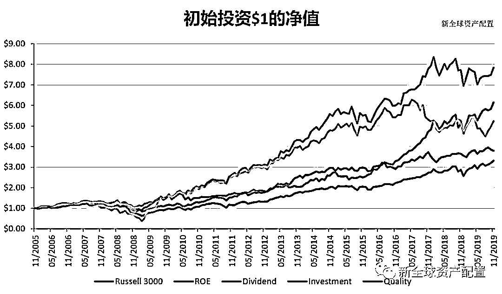
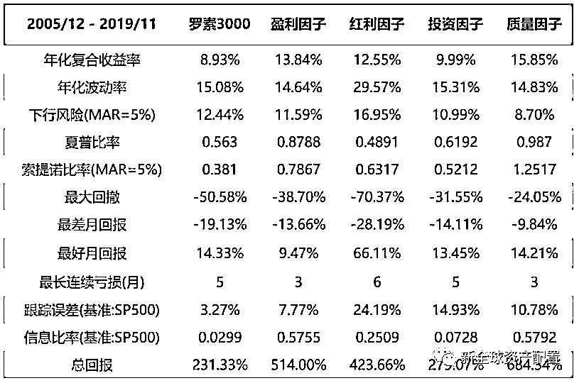

# 质量因子：聚焦财务分析的多因子策略

> 原文：[`mp.weixin.qq.com/s?__biz=MzAxNTc0Mjg0Mg==&mid=2653295797&idx=1&sn=d5e7e09c8e71cb62b3fc329aec311b24&chksm=802dd6a0b75a5fb642af2b223851d6c8c022561622d6e51c5eb85d3872dc3238b36394c49388&scene=27#wechat_redirect`](http://mp.weixin.qq.com/s?__biz=MzAxNTc0Mjg0Mg==&mid=2653295797&idx=1&sn=d5e7e09c8e71cb62b3fc329aec311b24&chksm=802dd6a0b75a5fb642af2b223851d6c8c022561622d6e51c5eb85d3872dc3238b36394c49388&scene=27#wechat_redirect)

**标星★****置顶****公众号     **爱你们♥   

文 | 庆炜     编辑 | 张梵梵

**近期原创文章：**

## ♥ [5 种机器学习算法在预测股价的应用（代码+数据）](https://mp.weixin.qq.com/s?__biz=MzAxNTc0Mjg0Mg==&mid=2653290588&idx=1&sn=1d0409ad212ea8627e5d5cedf61953ac&chksm=802dc249b75a4b5fa245433320a4cc9da1a2cceb22df6fb1a28e5b94ff038319ae4e7ec6941f&token=1298662931&lang=zh_CN&scene=21#wechat_redirect)

## ♥ [Two Sigma 用新闻来预测股价走势，带你吊打 Kaggle](https://mp.weixin.qq.com/s?__biz=MzAxNTc0Mjg0Mg==&mid=2653290456&idx=1&sn=b8d2d8febc599742e43ea48e3c249323&chksm=802e3dcdb759b4db9279c689202101b6b154fb118a1c1be12b52e522e1a1d7944858dbd6637e&token=1330520237&lang=zh_CN&scene=21#wechat_redirect)

## ♥ 2 万字干货：[利用深度学习最新前沿预测股价走势](https://mp.weixin.qq.com/s?__biz=MzAxNTc0Mjg0Mg==&mid=2653290080&idx=1&sn=06c50cefe78a7b24c64c4fdb9739c7f3&chksm=802e3c75b759b563c01495d16a638a56ac7305fc324ee4917fd76c648f670b7f7276826bdaa8&token=770078636&lang=zh_CN&scene=21#wechat_redirect)

## ♥ [机器学习在量化金融领域的误用！](http://mp.weixin.qq.com/s?__biz=MzAxNTc0Mjg0Mg==&mid=2653292984&idx=1&sn=3e7efe9fe9452c4a5492d2175b4159ef&chksm=802dcbadb75a42bbdce895c49070c3f552dc8c983afce5eeac5d7c25974b7753e670a0162c89&scene=21#wechat_redirect)

## ♥ [基于 RNN 和 LSTM 的股市预测方法](https://mp.weixin.qq.com/s?__biz=MzAxNTc0Mjg0Mg==&mid=2653290481&idx=1&sn=f7360ea8554cc4f86fcc71315176b093&chksm=802e3de4b759b4f2235a0aeabb6e76b3e101ff09b9a2aa6fa67e6e824fc4274f68f4ae51af95&token=1865137106&lang=zh_CN&scene=21#wechat_redirect)

## ♥ [如何鉴别那些用深度学习预测股价的花哨模型？](https://mp.weixin.qq.com/s?__biz=MzAxNTc0Mjg0Mg==&mid=2653290132&idx=1&sn=cbf1e2a4526e6e9305a6110c17063f46&chksm=802e3c81b759b597d3dd94b8008e150c90087567904a29c0c4b58d7be220a9ece2008956d5db&token=1266110554&lang=zh_CN&scene=21#wechat_redirect)

## ♥ [优化强化学习 Q-learning 算法进行股市](https://mp.weixin.qq.com/s?__biz=MzAxNTc0Mjg0Mg==&mid=2653290286&idx=1&sn=882d39a18018733b93c8c8eac385b515&chksm=802e3d3bb759b42d1fc849f96bf02ae87edf2eab01b0beecd9340112c7fb06b95cb2246d2429&token=1330520237&lang=zh_CN&scene=21#wechat_redirect)

## ♥ [WorldQuant 101 Alpha、国泰君安 191 Alpha](https://mp.weixin.qq.com/s?__biz=MzAxNTc0Mjg0Mg==&mid=2653290927&idx=1&sn=ecca60811da74967f33a00329a1fe66a&chksm=802dc3bab75a4aac2bb4ccff7010063cc08ef51d0bf3d2f71621cdd6adece11f28133a242a15&token=48775331&lang=zh_CN&scene=21#wechat_redirect)

## ♥ [基于回声状态网络预测股票价格（附代码）](https://mp.weixin.qq.com/s?__biz=MzAxNTc0Mjg0Mg==&mid=2653291171&idx=1&sn=485a35e564b45046ff5a07c42bba1743&chksm=802dc0b6b75a49a07e5b91c512c8575104f777b39d0e1d71cf11881502209dc399fd6f641fb1&token=48775331&lang=zh_CN&scene=21#wechat_redirect)

## ♥ [计量经济学应用投资失败的 7 个原因](https://mp.weixin.qq.com/s?__biz=MzAxNTc0Mjg0Mg==&mid=2653292186&idx=1&sn=87501434ae16f29afffec19a6884ee8d&chksm=802dc48fb75a4d99e0172bf484cdbf6aee86e36a95037847fd9f070cbe7144b4617c2d1b0644&token=48775331&lang=zh_CN&scene=21#wechat_redirect)

## ♥ [配对交易千千万，强化学习最 NB！（文档+代码）](http://mp.weixin.qq.com/s?__biz=MzAxNTc0Mjg0Mg==&mid=2653292915&idx=1&sn=13f4ddebcd209b082697a75544852608&chksm=802dcb66b75a4270ceb19fac90eb2a70dc05f5b6daa295a7d31401aaa8697bbb53f5ff7c05af&scene=21#wechat_redirect)

## ♥ [关于高盛在 Github 开源背后的真相！](https://mp.weixin.qq.com/s?__biz=MzAxNTc0Mjg0Mg==&mid=2653291594&idx=1&sn=7703403c5c537061994396e7e49e7ce5&chksm=802dc65fb75a4f49019cec951ac25d30ec7783738e9640ec108be95335597361c427258f5d5f&token=48775331&lang=zh_CN&scene=21#wechat_redirect)

## ♥ [新一代量化带货王诞生！Oh My God！](https://mp.weixin.qq.com/s?__biz=MzAxNTc0Mjg0Mg==&mid=2653291789&idx=1&sn=e31778d1b9372bc7aa6e57b82a69ec6e&chksm=802dc718b75a4e0ea4c022e70ea53f51c48d102ebf7e54993261619c36f24f3f9a5b63437e9e&token=48775331&lang=zh_CN&scene=21#wechat_redirect)

## ♥ [独家！关于定量/交易求职分享（附真实试题）](https://mp.weixin.qq.com/s?__biz=MzAxNTc0Mjg0Mg==&mid=2653291844&idx=1&sn=3fd8b57d32a0ebd43b17fa68ae954471&chksm=802dc751b75a4e4755fcbb0aa228355cebbbb6d34b292aa25b4f3fbd51013fcf7b17b91ddb71&token=48775331&lang=zh_CN&scene=21#wechat_redirect)

## ♥ [Quant 们的身份危机！](https://mp.weixin.qq.com/s?__biz=MzAxNTc0Mjg0Mg==&mid=2653291856&idx=1&sn=729b657ede2cb50c96e92193ab16102d&chksm=802dc745b75a4e53c5018cc1385214233ec4657a3479cd7193c95aaf65642f5f45fa0e465694&token=48775331&lang=zh_CN&scene=21#wechat_redirect)

## ♥ [AQR 最新研究 | 机器能“学习”金融吗](http://mp.weixin.qq.com/s?__biz=MzAxNTc0Mjg0Mg==&mid=2653292710&idx=1&sn=e5e852de00159a96d5dcc92f349f5b58&chksm=802dcab3b75a43a5492bc98874684081eb5c5666aff32a36a0cdc144d74de0200cc0d997894f&scene=21#wechat_redirect)

股神巴菲特曾说：“比起买一个估值很低但质量中规中矩的公司，我更喜欢买质量高但估值一般的公司。” 然而，人们对质量的定义是模糊的，不同人从不同的角度都可以定义质量。评判一家公司时，有人看的是公司的盈利能力，有人看的是会计质量：“这家公司财报真实可靠”，还有人看的是业务质量、管理团队能力等。那么，如何从量化的角度定义质量高的公司呢？于是，在金融研究中，质量因子出现了。

**与规模、价值、动量等由单指标或同类型指标构成的风格因子不同，质量因子通常由多个不同维度的财务指标构成。**目前市场上主流的质量因子指数，往往都采用不同的财务指标构建，这也给不少研究者通过数据挖掘得出各种统计检验有效但本质截然不同的质量因子提供了机会。下表为几个主要的质量因子指数或策略所采用的指标：主要的质量因子指数或策略所采用的指标  2017 年，著名 smart beta 量化对冲基金 Research Affliate 的 Jason Hsu 和 Vitali Kalesnik 等几位学者发表了一篇研究论文《What is Quality？》，**对七个不同维度的财务指标进行了全面的测试，探讨哪些维度的指标可以有效的衡量公司的质量，清晰地解释了到底什么是质量因子。**接下来，我们将介绍这篇文章的研究成果，同时也根据其提出的有效的质量因子的评价维度，自己动手构建美国股票市场质量因子组合，并进行回测检验。** 质量因子是单因子还是多因子？**投资人买一个东西愿意付出和认可的价格，不一定一致，这个价值是具有相对性的；而质量是一个产品固有特质，更加偏向于绝对。学术研究中，估值比较的是公司内在价值和其市场价值，而质量分析的是公司的财务质量。我们之前的公众号文章《寻找高质量的价值股，才是真正的价值投资》也曾通过五个指标构建了高质量的价值股组合，在 1976-2015 年间，不同的高质量价值股组合均跑赢了标普 500 指数，甚至比股神巴菲特的同期表现略胜一筹。

高综合质量的价值股与标普 500 和巴菲特的回报比较 

数据时间：1976 年-2015 年

数据来源：Bloomberg

在 MSCI、富时罗素、标普等公司发行的质量因子指数中，常用的衡量质量的指标主要涵盖**盈利能力、盈利稳定性、资本结构、盈利成长性、会计质量、股票发行摊薄与投资能力**等维度。 同一维度下，指标具有同质性，也就是说，同一维度的指标在回测中的表现应该是相似的，这就属于单因子。若在回测中某个指标比其他同维度指标表现优异很多，则很可能是数据挖掘的结果，其样本外的表现通常会令人失望。下图表为《What is Quality?》一文划分的不同质量维度下的质量指标：不同维度下的质量分析指标 作者们首先计算了所有指标构建出的因子回报的相关性矩阵。结果如上文所述，同一维度下的指标相关性较高，不同维度下指标间的相关性较低。如下图所示，灰度越浅，相关性越低：不同维度的质量因子指标相关性矩阵可见，质量因子中各个维度的财务指标在构成方式上有着很大的差异。所以，我们将 MSCI、富时罗素、标普等公司发行的质量因子指数解释为多因子投资组合更为恰当，所谓质量因子实际上是多因子组合。**哪些财务指标是有效的质量因子指标？**在商店买食品，你可能需要通过看生产日期、生产厂家、包装品质、质检标签等来判断这个食品的好坏；同样，一个质量好的公司，与很多因素都有关，它的盈利能力、投资保守程度、会计质量、资本结构和派息/摊薄等。不过这些指标都只是代表公司质量的单一维度，把他们综合起来评判一家公司的质量显然更为全面。

举个栗子，公司的盈利能力强，往往说明它有着健康的利润率、坚实的经济护城河，具有这些优点的公司通常能稳定增长，为投资人带来不错的回报，如可口可乐。而公司保守投资的表现，和 CEO 的举措密切相关，虽然公司有现金可以筹集更多的资金，但管理人在再投资方面表现出很大的克制，没有建立帝国的欲望，不浪费投资者的钱，这标志着高质量的公司治理水平。在投资保守程度上，特斯拉是一个反例，它并没有真正盈利，却在大规模地募集新资本扩大投资。CEO 埃隆·马斯克是个杰出的营销家，很会通过讲述伟大的公司故事获得公众关注。实际上，人们还没有看到洛杉矶地下的隧道，甚至钻探都没有，火星上也没有殖民地，也没有看到火箭向火星发射，只是马斯克的目标很吸引人。当他的计划引起关注时，就会引发情怀党对特斯拉股票的追逐，从而推高股价，让马斯克更容易建立一个帝国。然而，当一个不受约束的首席执行官的注意力集中在帝国建设上时，这未必是公司最佳的治理类型。

**在不同市场中，有些维度的指标表现得很好，有些则并没有那么有效**。比如公司资本结构指标，人们倾向于认为公司的财务杠杆越高，则公司的风险越大，理应获得更高的回报。然而，在美国这个高度有效的债券市场中，债券投资人可能比股票投资者更为精明。他们愿意借钱给一个公司，是因为他们认为该公司有足够健康的现金流偿债或有足够好的资产作为抵押。所以资本结构指标是否能有效评价一个公司的质量，是值得商榷的。《What is Quality?》一文对各个维度的指标进行了回测。**作者们分别使用了因子检验三步法和两个附加测试，对各财务指标进行定性与定量分析，分析其产生超额收益的有效性与强健性。**首先，文章使用了 Hsu，Kalensnik and Visawanathan(2015)中的因子检验三步法，此法认为某财务指标应满足以下三点：（1）现有的学术论文已对其进行了广泛的研究。这说明某种程度上它们得到了学术界的验证。这些受到学术启发或经过学术研究的定义在产生回报方面往往是最有说服力的，因此也是更有价值的质量定义。（2）该指标在同一维度的指标超额收益在统计上普遍显著。这说明同一维度因子的强健性是足够的，不太可能是数据挖掘的结果。数据挖掘的结果可能刚好使因子统计有效，但其中并没有经济理论和逻辑。我们举个栗子：ChordiaGoyal and Saretto(2017)检验了 210 万个股票策略，为了减小数据挖掘的影响，他们将统计显著的门槛值提高，结果发现，有 17 个策略的表现脱颖而出。然而，这 17 个策略都没有经济学逻辑支撑。比如其中一个因子构建方式是：(长期债券发行 – 可赎回优先股数量)/未来四年的租约承诺。很明显，这是个难以解释的公式。 

（3）该指标在不同国家地区的超额收益在统计上显著，则其超额收益更可能是真实的。这同样为了说明指标不只在一个范围地区有效，指标有足够的强健性。此外，作者们还根据 HLZ（2016）和 MP（2016）两篇文章的方法对各财务指标进行了两个附加测试，以进一步确定哪些指标是长期回报的真正来源。接下来，我们看看因子检验三步法及附加测试的步骤及结果： **Step 1：分析各财务指标的学术研究程度****盈利能力指标(Profitability)**这是最常用的质量因子指标，共有七篇顶级论文都对盈利能力指标的有效性进行了论述，其中包括 Fama-French 的五因子模型和侯恪惟、薛辰、张橹教授的 Q 因子模型（相关文章：《因子战国：Q 因子模型的五大讨论》）。托宾的 Q 理论模型认为，在均衡的市场中，盈利能力高的公司有着更高的隐含风险以及融资成本，因此能带来超额收益。**盈利稳定性(Earnings Stability)**Dischev and Tang(2009), Hsu, Kudoh andYamada(2013)和 Donelson and Resutek(2015)这三篇论文均阐释了盈利的波动率与盈利预期的联系。其中 Hsu,Kudoh and Yamada(2013)认为，盈利波动性小且分析师与投资者对其盈利预期乐观的公司具有低波动的特性，因此盈利稳定性指标可以被归为低波因子的范畴。**资本结构(Capital Structure)**学术界关于资本结构对股票未来收益的影响结论不一。本文作者认为，公司杠杆率与股票回报的波动率基本上是负相关的，因此资本结构指标也应归入低波因子。**盈利成长性(Growth in Earnings)**作者们认为，至今还没有学术研究揭示盈利成长性与股票收益之间存在联系。**会计质量(Accounting Quality)**Sloan(1996)，Hirshleiferet al.(2004)、Dechow and Ge(2006)和 Chan et al.(2006)发现应计比率越高的公司通常股票回报越低，因为这类会计账户盈利作假的风险高，股价容易被操纵。在 Hirshleifer et al.(2004) 中作者进一步解释了这是由于很多投资者过分关注新闻头条中显示的每股盈利和公司营收数据，并没有认真分析财报中对盈利部分的操纵。**派息/摊薄(Payout/Dilution)**本文作者将派息与摊薄都归为公司行动对其股票投资者的影响。多篇论文证明，公司股票摊薄与其股票回报呈明显的负相关。也就是当公司给投资者发钱，如分红与股票回购，则有利于股价上涨；公司若发行新股票，则会导致股价下跌。**投资(Investment)**在大名鼎鼎的 Fama-French 五因子模型中，投资因子占据了一席。除此之外，侯恪惟/薛辰/张橹教授于 2015 年发表的著名论文《Digesting Anomalies: An Investment Approach》中指出，可以通过融资进行大量投资的公司通常会投资比较保守的项目，因此回报较低。综上所述，【盈利能力、会计质量、派息/摊薄与投资】这四个维度的财务指标与未来股票回报的关系在主流金融文献中可被证明。**Step 2: 分析同一维度指标间的稳健性**统计结果显著是由数据挖掘而产生的标志表现是【指标构建方法的微小变化会带来因子性能的巨大变化】。为了抢占学术期刊的头条，不少研究者通过在构建方式上对同一维度的指标进行微小的改变，便挖掘出看似统计显著的因子。**因此，我们对因子定义需要仔细审查。质量因子由于其定义上的模糊性，可能是最容易受到数据挖掘影响的因子了。**《What is Quality?》对同一维度中多个相似的财务指标同时进行了回测，作为强健性分析的一部分。文章的回测过程如下：数据来源：CRSP 美国股票回报与市值数据与 Compustat 公司财务数据，剔除所有账面价值为负的公司。行业中性处理：为了避免指标在不同行业间存在差异，作者对样本中的公司进行了行业中性处理。再平衡：投资组合每年 7 月依据 6 月底的财务数据进行再平衡。因子构建：作者采用 Fama-French 的 12 行业分类，然后在每个行业中将股票用 50 分位点分为大小市值组。再选择质量财务指标最高 30%与最低 30%的股票构成高质量组和低质量组，组内市值加权。如此等权构成大市值高质量组、小市值高质量组、大市值低质量组与小市值低质量组四个组别。在测试中，作者使用以下 3 个指标评价投资组合表现的稳定性：

*   投资组合平均收益差异：即高质量组优于低质量组是否在统计学上显著。

*   对四因子模型(Fama French 三因子+动量因子)做回归的平均 alpha。注意，即使某财务指标的 alpha 不显著，但与四个公共因子的相关性为负，也会对投资组合的风险因子有分散作用，可以提高投资组合的信息比率和夏普比率。

*   夏普比例：测试高质量组的夏普比率是否显著高于低质量组。

以下为测试结果：财务因子指标的稳定性测试 从上表可以看出，与 Step 1 中的学术文献综述的结果一致，**盈利能力、会计质量、派息/摊薄和投资类****指标中的超额收益大多数是有效的**（T 值大于 3），而测试结果显示，资本结构中的债务占比并不能说明质量问题，没有数据表明债务越少意味着质量越高。

**Step 3：财务指标在不同国家地区是否都有效**

作者对各类财务指标在欧洲、日本、全球发达国家和亚太除日本外国家等地区进行测试，使用与在美国市场同样的标准，只是在国际市场，大市值定义为行业内市值最大的 90%，回测时间段为 1990-2016 年。测试结果如下：除亚太地区以外，前两步测试中比较稳定的盈利能力、会计质量、派息/摊销和投资因子的超额收益基本上是显著的。财务指标在不同国家地区中的有效性测试 

**附加测试一**

HLZ(2016)中认为，测试因子收益时，由于前人研究中只公布统计上显著的因子，样本中的观察值可能只是数百万个备选财务指标中的正异常值，因此 t 检测值的阈值应高于 1.96 才可称为显著。于是，作者对上述回测结果较为强健的盈利能力、会计质量、派息/摊销和投资因子按照 HLZ(2016)的方法重新测试。结果发现，这四类指标的 t 检验值都远大于 1.96。各指标的 t 检验值  

**附加测试二**

MP(2016)中提出另一种测试因子稳健性的方法。他们发现因子回报在学术论文发表后往往会变差，原因是有效因子被发现后会使众多资金涌入追逐，提高了该因子的交易冲击成本，从而压低了超额收益。于是作者将四大类财务指标在发现前后的表现进行了比较。四大类财务指标被发现前后因子回报表现  结果显示，除了用总资产增长衡量的投资因子被在发表后表现有明显的下滑之外（但统计上并不显著），其他三类因子的表现并没有受到发现其有效性的论文的发表的影响。**自己动手，丰衣足食**根据《What is Quality？》一文的定义，**质量因子更准确地说，是聚焦于公司财务分析的多因子策略，筛选出盈利性强、投资保守稳健、财务质量高和股票派息高摊薄低的一篮子股票，以获得超额收益。** 纸上得来终觉浅，接下来我们自己动手在美国市场对本文定义的质量因子进行一个小回测：数据来源：Bloomberg 股票池：美国全市场股票回测时间段：2005 年 12 月-2019 年 11 月，覆盖了 08 年金融危机，包含全段本轮美股牛市。使用指标：a. 盈利能力维度（盈利因子）：扣除了非经常开支与收入的 ROEb. 投资稳健维度（投资因子）：总资产的增长率（与一年前对比）c. 股票派息（红利因子）：股息率会计质量和股票摊薄指标限于数据质量，我们的回测无法呈现其真正的效果，故在此略去。构建方法：Z-score 打分排名法质量因子总分 Z = Zscore(a)-Zscore(b)+Zscore(c)，对股票做了行业中性处理，选择总分排名高于 99.5%分位点的股票为质量因子组合（每期持有 35-45 只股票），按市值加权持有，每月再平衡，不考虑交易成本。基准：罗素 3000 指数，包含美股中市值最大的前 3000 家公司。

以 1 美元为初始投资的策略净值变化 

数据时间：2005 年 12 月-2019 年 11 月

数据来源：Bloomberg

三个维度构建的质量因子美国市场的回测结果

数据时间：2005 年 12 月-2019 年 11 月

数据来源：Bloomberg

以上回测结果显示，单个维度的盈利因子、红利因子和投资因子都能走出比美国全盘股票基准罗素 3000 指数更好的表现；而结合了三个维度有效因子的质量因子，能录得高于基准将近一倍的年化收益，且波动率更小，最大回撤也不到基准的一半。当然，上述结果并没有考虑到股票换手所产生的交易成本。根据回测结果，质量因子组合每期平均换手率为 27.72%。我们假设换手所产生的交易费用和市场冲击成本为 0.5%，则一年下来，交易成本为 27.72%*12*0.5% = 1.66%。质量因子组合在扣除了交易成本后，依然能带来超过 14%的年化收益。**写在最后**如果你对质量因子感兴趣，严谨深入地对多维度的财务指标进行研究，根据多因子综合评分筛选出来的股票组合，都能帮助你在长周期内更有可能稳健地跑赢大盘。至于投资拥有令人兴奋的未来畅想的故事的公司，则属于主观投资的范畴。这些故事往往难以量化，无法回测，**仅凭主观信仰投资这类公司，不如采用系统化的量化策略更能让人安心持有。**
在因子策略的构建上，从符合经济常识以及公司金融理论基础的方向出发，是必要的条件。**本文定义的质量因子能够在不同的市场环境中都有超额收益，关键在于从定性和定量的角度，在多个维度上捕捉高质量的公司的特征，这是广大投资者在选股的过程中最值得借鉴的方法论。**

*—End—*

量化投资与机器学习微信公众号，是业内垂直于**Quant**、**MFE**、**Fintech****、AI、ML**等领域的**量化类主流自媒体。**公众号拥有来自**公募、私募、券商、期货、银行、海外**等众多圈内**18W+**关注者。每日发布行业前沿研究成果和最新量化资讯。

你点的每个“在看”，都是对我们最大的鼓励