# 纽约金融男太太太太太 sao 了！

> 原文：[`mp.weixin.qq.com/s?__biz=MzAxNTc0Mjg0Mg==&mid=2653295786&idx=1&sn=07805e3f2f3fbca0faa5d9ea8b582ee7&chksm=802dd6bfb75a5fa95337c78181b4684bfb8acb11f33c0a2679ee05101ff4ed9abaec607bfab4&scene=27#wechat_redirect`](http://mp.weixin.qq.com/s?__biz=MzAxNTc0Mjg0Mg==&mid=2653295786&idx=1&sn=07805e3f2f3fbca0faa5d9ea8b582ee7&chksm=802dd6bfb75a5fa95337c78181b4684bfb8acb11f33c0a2679ee05101ff4ed9abaec607bfab4&scene=27#wechat_redirect)

**标星★****置顶****公众号     **爱你们♥   

来自：BiuBiu 在纽约

作者：徐某某

**终于轮到盘点纽约金融男的时刻了！**

论职业来说，金融总是离钱最近的代表。既然离钱近，那必定存在着值得深扒的信息点。

比如拜金女是不是对他们情有独钟？他们是不是因为有钱而广约妹子？会不会是纽约渣男的代表人物？既然收入不错，他们对生活要求又会是如何？他们会不会彼此之间也有一条彩虹屁产业链？

金融男往往又是高材生，他们是不是真的才貌双全？他们的生活兴趣爱好又是什么？他们到底和我们有多远的距离？还是说，每一个人身边都会有这样的一个「金融男」。

在纽约，他们到底混得如何？

别急，往下看，一个个给你解答。

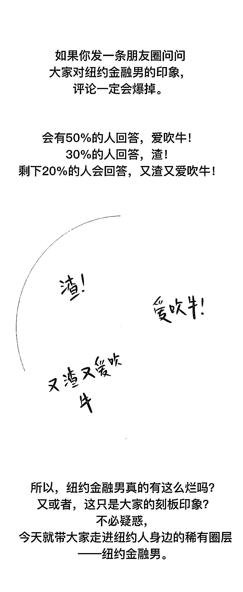

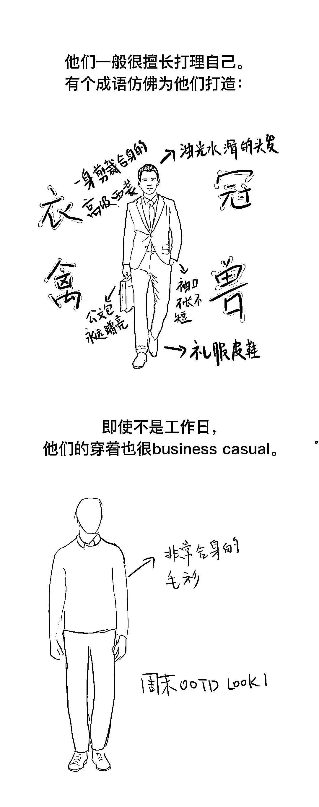

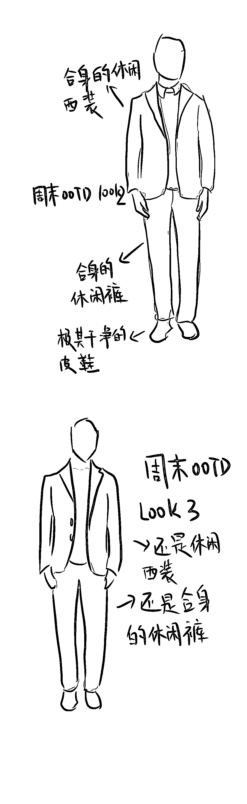

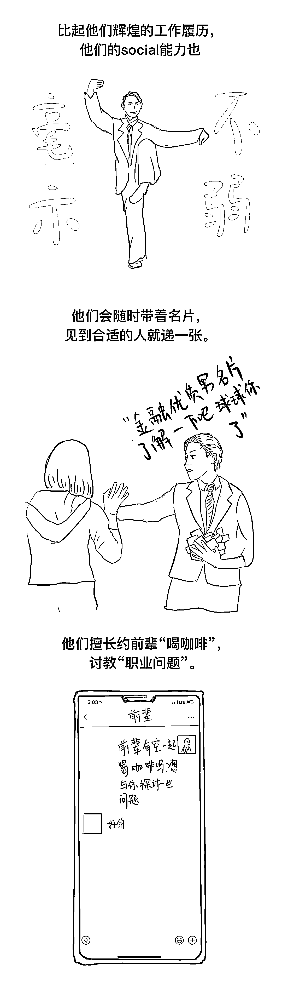

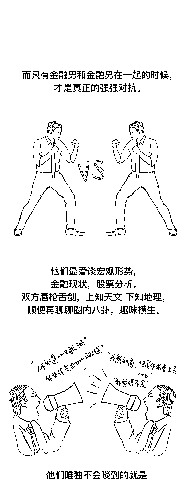

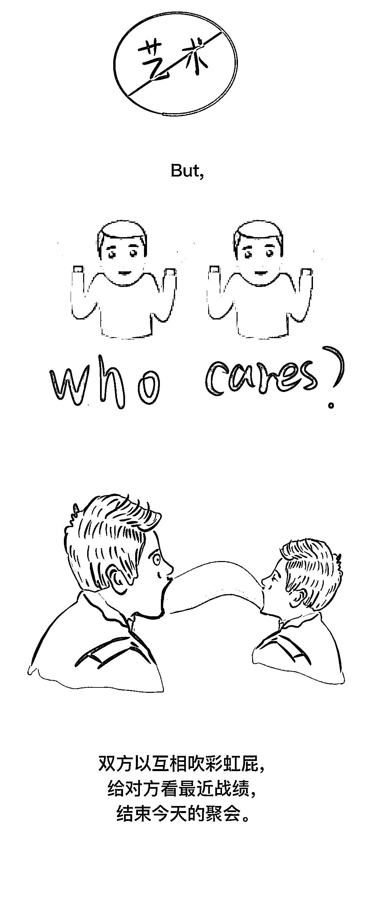

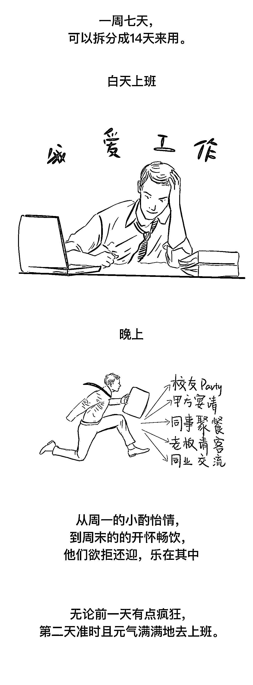

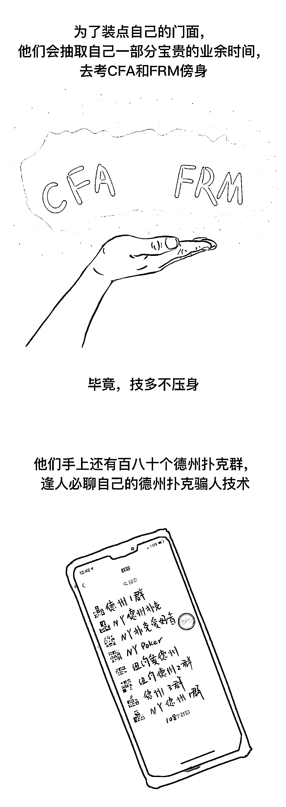

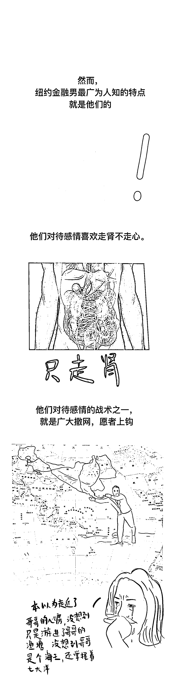

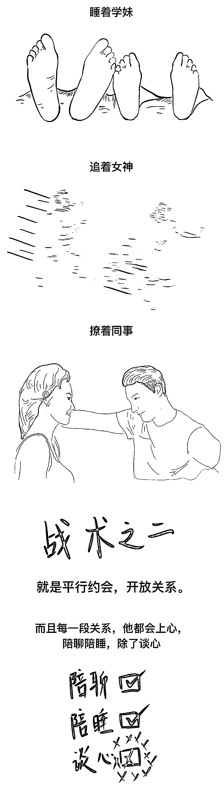

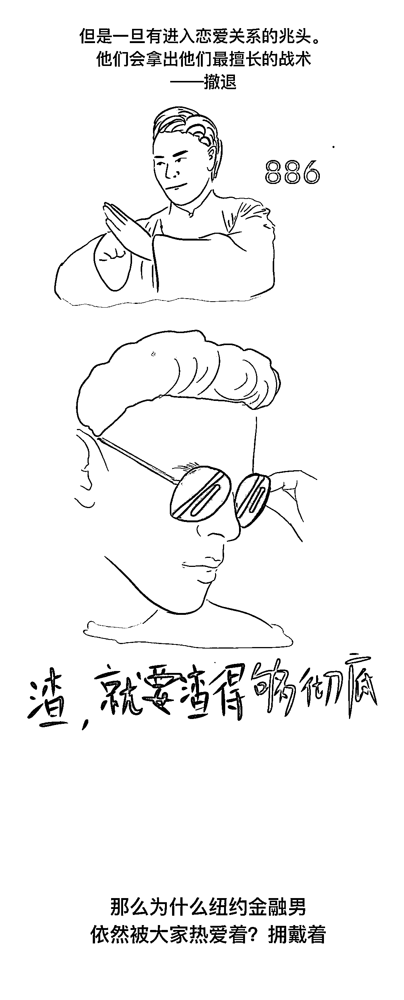

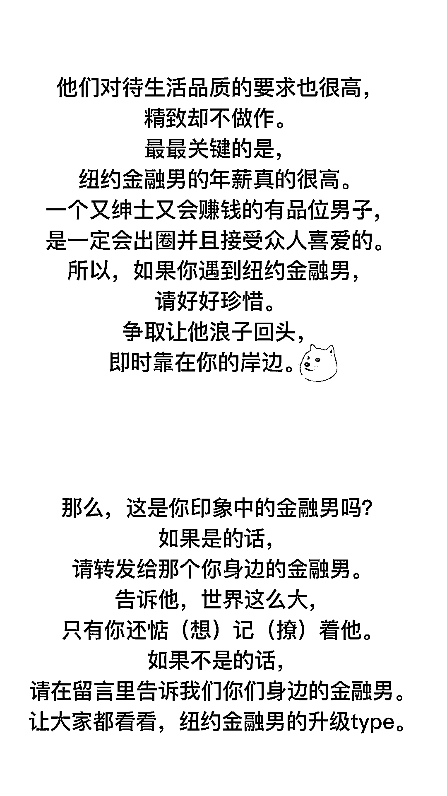

用两个字来总结纽约金融男，那就是贱萌。人无完人，无论给金融男冠上怎样的初级印象，本质上，金融男依然也是一个普通人。对待金融男，希望各位稍微仁慈一点，稍微宽容一点，但如果他们渣到了你的头上，那不必二话，立刻离开。毕竟，失去一个带着劣根的金融男，咱们还拥有千千万万的优质金融男呀。

**欢迎扫码关注**

策划：biubiu 在纽约

监制：biubiu

插画：+1

撰文：biubiu、仲达

来源：身边真实朋友

*—End—*

量化投资与机器学习微信公众号，是业内垂直于**Quant**、**MFE**、**Fintech****、AI、ML**等领域的**量化类主流自媒体。**公众号拥有来自**公募、私募、券商、期货、银行、海外**等众多圈内**18W+**关注者。每日发布行业前沿研究成果和最新量化资讯。

你点的每个“在看”，都是对我们最大的鼓励