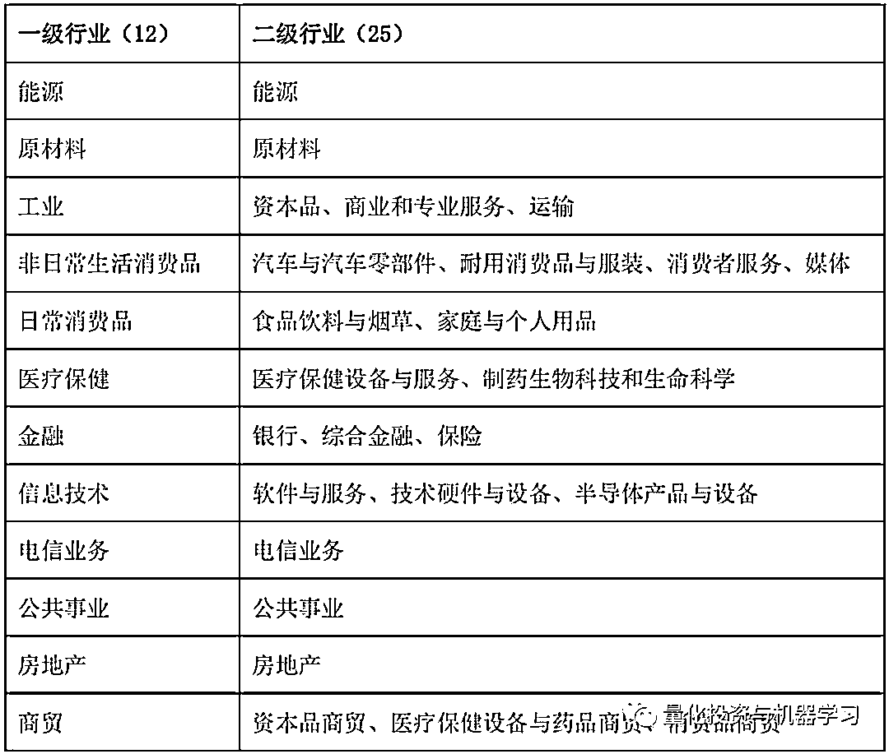

# 一个都不能少！多行业暴露下行业因子收益研究

> 原文：[`mp.weixin.qq.com/s?__biz=MzAxNTc0Mjg0Mg==&mid=2653295776&idx=1&sn=7ae53b20d29de8d6727e50c774daf82d&chksm=802dd6b5b75a5fa388c6a610dc0f27e53c0d8718f21ba18151c1fdbcf164b9e9825abc47539d&scene=27#wechat_redirect`](http://mp.weixin.qq.com/s?__biz=MzAxNTc0Mjg0Mg==&mid=2653295776&idx=1&sn=7ae53b20d29de8d6727e50c774daf82d&chksm=802dd6b5b75a5fa388c6a610dc0f27e53c0d8718f21ba18151c1fdbcf164b9e9825abc47539d&scene=27#wechat_redirect)

**标星★****置顶****公众号     **爱你们♥   

编辑：公众号编辑部

**近期原创文章：**

## ♥ [5 种机器学习算法在预测股价的应用（代码+数据）](https://mp.weixin.qq.com/s?__biz=MzAxNTc0Mjg0Mg==&mid=2653290588&idx=1&sn=1d0409ad212ea8627e5d5cedf61953ac&chksm=802dc249b75a4b5fa245433320a4cc9da1a2cceb22df6fb1a28e5b94ff038319ae4e7ec6941f&token=1298662931&lang=zh_CN&scene=21#wechat_redirect)

## ♥ [Two Sigma 用新闻来预测股价走势，带你吊打 Kaggle](https://mp.weixin.qq.com/s?__biz=MzAxNTc0Mjg0Mg==&mid=2653290456&idx=1&sn=b8d2d8febc599742e43ea48e3c249323&chksm=802e3dcdb759b4db9279c689202101b6b154fb118a1c1be12b52e522e1a1d7944858dbd6637e&token=1330520237&lang=zh_CN&scene=21#wechat_redirect)

## ♥ 2 万字干货：[利用深度学习最新前沿预测股价走势](https://mp.weixin.qq.com/s?__biz=MzAxNTc0Mjg0Mg==&mid=2653290080&idx=1&sn=06c50cefe78a7b24c64c4fdb9739c7f3&chksm=802e3c75b759b563c01495d16a638a56ac7305fc324ee4917fd76c648f670b7f7276826bdaa8&token=770078636&lang=zh_CN&scene=21#wechat_redirect)

## ♥ [机器学习在量化金融领域的误用！](http://mp.weixin.qq.com/s?__biz=MzAxNTc0Mjg0Mg==&mid=2653292984&idx=1&sn=3e7efe9fe9452c4a5492d2175b4159ef&chksm=802dcbadb75a42bbdce895c49070c3f552dc8c983afce5eeac5d7c25974b7753e670a0162c89&scene=21#wechat_redirect)

## ♥ [基于 RNN 和 LSTM 的股市预测方法](https://mp.weixin.qq.com/s?__biz=MzAxNTc0Mjg0Mg==&mid=2653290481&idx=1&sn=f7360ea8554cc4f86fcc71315176b093&chksm=802e3de4b759b4f2235a0aeabb6e76b3e101ff09b9a2aa6fa67e6e824fc4274f68f4ae51af95&token=1865137106&lang=zh_CN&scene=21#wechat_redirect)

## ♥ [如何鉴别那些用深度学习预测股价的花哨模型？](https://mp.weixin.qq.com/s?__biz=MzAxNTc0Mjg0Mg==&mid=2653290132&idx=1&sn=cbf1e2a4526e6e9305a6110c17063f46&chksm=802e3c81b759b597d3dd94b8008e150c90087567904a29c0c4b58d7be220a9ece2008956d5db&token=1266110554&lang=zh_CN&scene=21#wechat_redirect)

## ♥ [优化强化学习 Q-learning 算法进行股市](https://mp.weixin.qq.com/s?__biz=MzAxNTc0Mjg0Mg==&mid=2653290286&idx=1&sn=882d39a18018733b93c8c8eac385b515&chksm=802e3d3bb759b42d1fc849f96bf02ae87edf2eab01b0beecd9340112c7fb06b95cb2246d2429&token=1330520237&lang=zh_CN&scene=21#wechat_redirect)

## ♥ [WorldQuant 101 Alpha、国泰君安 191 Alpha](https://mp.weixin.qq.com/s?__biz=MzAxNTc0Mjg0Mg==&mid=2653290927&idx=1&sn=ecca60811da74967f33a00329a1fe66a&chksm=802dc3bab75a4aac2bb4ccff7010063cc08ef51d0bf3d2f71621cdd6adece11f28133a242a15&token=48775331&lang=zh_CN&scene=21#wechat_redirect)

## ♥ [基于回声状态网络预测股票价格（附代码）](https://mp.weixin.qq.com/s?__biz=MzAxNTc0Mjg0Mg==&mid=2653291171&idx=1&sn=485a35e564b45046ff5a07c42bba1743&chksm=802dc0b6b75a49a07e5b91c512c8575104f777b39d0e1d71cf11881502209dc399fd6f641fb1&token=48775331&lang=zh_CN&scene=21#wechat_redirect)

## ♥ [计量经济学应用投资失败的 7 个原因](https://mp.weixin.qq.com/s?__biz=MzAxNTc0Mjg0Mg==&mid=2653292186&idx=1&sn=87501434ae16f29afffec19a6884ee8d&chksm=802dc48fb75a4d99e0172bf484cdbf6aee86e36a95037847fd9f070cbe7144b4617c2d1b0644&token=48775331&lang=zh_CN&scene=21#wechat_redirect)

## ♥ [配对交易千千万，强化学习最 NB！（文档+代码）](http://mp.weixin.qq.com/s?__biz=MzAxNTc0Mjg0Mg==&mid=2653292915&idx=1&sn=13f4ddebcd209b082697a75544852608&chksm=802dcb66b75a4270ceb19fac90eb2a70dc05f5b6daa295a7d31401aaa8697bbb53f5ff7c05af&scene=21#wechat_redirect)

## ♥ [关于高盛在 Github 开源背后的真相！](https://mp.weixin.qq.com/s?__biz=MzAxNTc0Mjg0Mg==&mid=2653291594&idx=1&sn=7703403c5c537061994396e7e49e7ce5&chksm=802dc65fb75a4f49019cec951ac25d30ec7783738e9640ec108be95335597361c427258f5d5f&token=48775331&lang=zh_CN&scene=21#wechat_redirect)

## ♥ [新一代量化带货王诞生！Oh My God！](https://mp.weixin.qq.com/s?__biz=MzAxNTc0Mjg0Mg==&mid=2653291789&idx=1&sn=e31778d1b9372bc7aa6e57b82a69ec6e&chksm=802dc718b75a4e0ea4c022e70ea53f51c48d102ebf7e54993261619c36f24f3f9a5b63437e9e&token=48775331&lang=zh_CN&scene=21#wechat_redirect)

## ♥ [独家！关于定量/交易求职分享（附真实试题）](https://mp.weixin.qq.com/s?__biz=MzAxNTc0Mjg0Mg==&mid=2653291844&idx=1&sn=3fd8b57d32a0ebd43b17fa68ae954471&chksm=802dc751b75a4e4755fcbb0aa228355cebbbb6d34b292aa25b4f3fbd51013fcf7b17b91ddb71&token=48775331&lang=zh_CN&scene=21#wechat_redirect)

## ♥ [Quant 们的身份危机！](https://mp.weixin.qq.com/s?__biz=MzAxNTc0Mjg0Mg==&mid=2653291856&idx=1&sn=729b657ede2cb50c96e92193ab16102d&chksm=802dc745b75a4e53c5018cc1385214233ec4657a3479cd7193c95aaf65642f5f45fa0e465694&token=48775331&lang=zh_CN&scene=21#wechat_redirect)

## ♥ [AQR 最新研究 | 机器能“学习”金融吗](http://mp.weixin.qq.com/s?__biz=MzAxNTc0Mjg0Mg==&mid=2653292710&idx=1&sn=e5e852de00159a96d5dcc92f349f5b58&chksm=802dcab3b75a43a5492bc98874684081eb5c5666aff32a36a0cdc144d74de0200cc0d997894f&scene=21#wechat_redirect)

**概要**

最近，公众号测试了数库的行业分类数据，其基于上市公司的产品收入分项数据，能够更细致的刻画跨行业经营的上市公司的行业属性。**基于该行业分类构建风险模型，相对于单一行业分类的体系**，有两点**优势**：**首先能明显的提高模型的解释度，其次提纯后的行业纯因子组合之间的相关性明显降低，更有利于在组合优化的过程中控制行业风险的暴露。**

**正文**

在风险模型的构建中，除了常用的风格因子，还需要使用行业因子来剥离股票收益中由于行业暴露带来的收益，在常用的行业分类体系中，一只股票往往只被归类于一个行业。而在多元化经营的大趋势下，上市公司的产品往往会横跨多个行业，以单一的行业划分构建风险模型并不能准确的定义一家上市公司的行业暴露。在业界公认的风险模型—BARRA 模型中，也已经提及了关于多行业暴露的处理方法（具体请参考 Barra USE4），其根据上市公司业务收入及资产的行业划分来加权计算公司的行业暴露。

数库的行业分类正是基于上市公司的产品收入分项数据，能够更细致的刻画跨行业经营的上市公司的行业属性，**本文基于数库的行业分类数据，测试及对比在单一行业属性与多行业属性下风险模型的表现。**

**数据说明**

**1、数库行业分类**

随着多元化经营的发展趋势，传统的单一行业分类模式已无法有效及时反应企业完整的业务覆盖范围及变化。数库建立的行业分类体系基于 GICS 全球行业分类标准，同时结合国内行业特点，主要考虑上市公司主营产品类别，根据产品的属性、收入比重进行分类，相比传统的行业分类标准更加细化，具有更明确的分类逻辑。

数库行业分类一共分为四级，其中一级行业的数量为 12 个，二级至四级行业的数量分别为 25、68、115。行业分类的四级作为产品分类的一级科目，从而可以有效的结合数据 SAM 产业链进行行业分析。数库一级二级行业分类名称见下表：

表格 1 数库行业分类一级、二级明细

**2、构建上市公司多行业属性数据**

数库 SAM 产业链数据的产品一级科目对应的是数库行业分类的四级科目。通过匹配上市公司主营产品在数库 SAM 产业链产品标准下的收入与该产品对应的数库行业分类，我们可以计算出该上市公司在不同行业上的业务分布。

以**杉杉股份（600884）**为例，根据其 2019 中报披露的营收分布对应到数库 SAM 产品一级后的数据如下表所示，我们把这些产品收入汇总到数库二级行业分类下，计算出该公司在该报告期的二级行业属性数据。由于有其他收入项或关联交易的存在，各项产品收入除以营业总收入的占比之和可能会出现大于或小于 1 的情况。针对这种情况，在计算上市公司行业属性数据时，我们会做标准化处理，使最终总和为 100%。

表格 2 杉杉股份 2019 中报多行业业务分布数据

**3、A 股中多行业属性上市公司统计**

以数库二级行业分类为基准，我们统计了 2014-2019 年，全部 A 股上市公司及中证 800 成分股业务分部属于多个行业的情况，如下图所示，在全部 A 股中，行业属性多于一个行业上市公司占比平均为 60%；在中证 800 成分股中，该比例为 62%。其中行业属性最多的公司为 8 个行业。大部分公司的行业属性分布在 1-3 个行业。

图 1 A 股上市公司多行业属性统计

**行业纯因子组合构建**

**1、基于 Barra（CNE5）的多因子模型构建**

Barra（CNE5）模型中共有 1 个国家因子，多个行业因子及 10 个风格因子。如下式所示，其中 f_c 为国家因子，f_Ip 为行业因子，f_Is 为风格因子。

在 A 股的实践中，行业因子多以申万或中信一级行业分类为基础，并以虚拟变量的形式作为回归中的自变量。以这些行业分类作为行业因子时，一个股票只能属于一行业。由于申万或中信行业的一级行业分类分别有 28 个及 29 个（多余数库二级分类的 25 个行业），且行业的划分与数库基于 GICS 的行业划分有不小的差别，所以无法直接对比多行业属性下风险模型的表现。在接下来的测试，我们测试及对比了以下两类行业分类数据：

**A.  原始组（多行业）**：以产品收入在数库各二级行业的占比作为该公司在不同行业的暴露，一家公司在所有二级行业的总暴露为 1。

**B.  对比组（单一行业）**: 以产品收入在数库各二级行业中占比最大的行业作为该上市公司的行业暴露，且设置为 1。

**2、相关细节设置**

**A、测试时间：**2015-01-05 至 2019-10-31，日度截面回归

**B、股票池选择：**中证 800 成分股

*   由于风格因子计算中需要长达两年多的历史数据，考虑到以全 A 为成份股覆盖度的不稳定性，本报告采用中证 800 成分股进行测试，无风险利率选取一个月 SHIBOR 利率。

**C、  风格因子的计算方式**

*   风格因子的计算方式参照 Barra-CNE5，但其中涉及分析师预期的描述变量（Descriptor）未予计算，主要包括盈利及成长风格因子。关于因子的具体的计算方式可见 Barra-CNE5。

**D、  截面回归的方式**

*   由于行业因子与国家因子潜在的多重线性相关，我们参考 Barra 对的行业因子收益（行业因子的回归系数）设置了以下限制：

其中为 W_i 为行业 i 的股票市值占当日中证 800 总市值的比例，当使用原始组数据计算当日行业市值时，行业市值等于所有股票在该行业上暴露的市值总和：

其中 I 为某行业市值，C_i 为股票 i 在行业 i 上的暴露比例，V_i 为股票 i 的市值，N 为当日所有股票的数量。

在具体的回归中，我们使用解析解的形式求出了因子收益，并未使用任何回归工具，具体细节参见附录。

**3、实证结果**

我们基于以上的设置对中证 800 成分股分别采用原始组（多行业分类）及对比组（单一行业分类）进行了截面回归与测试。

**A、风格因子收益对比**

两组回归后的风格因子收益无显著差别，基本保持一致，说明**在因子数量（回归自变量）保持一致的情况下，行业分类是否使用多行业属性对风格因子收益不会造成影响**。当我们分离出截面收益由风格因子影响的部分后，我们就可以对比原始组（多行业）和对比组（单行业）的差异及造成这种差异的原因。

**B、模型解释度对比**

由上文可知，原始组与对比组两种行业分类并不会对风格因子的收益产生影响。那么**模型解释度（用 R-Square 表示）的差异就可以认为是由于行业分类不同造成的**。我们统计了 2015 年 1 月 1 日至 2019 年 10 月 31 日每个交易日截面回归的 R-Square（见下图），得出以下数据：原始组的平均 R-Square 为 21%，而对比组的平均 R-Square 为 19%。也就是说**采用多行业分类的方式可以使模型的解释度提高 10%左右（2%/21%）**。

**C、行业纯因子组合收益对比**

关于行业纯因子组合，可以这么理解：首先，行业纯因子投资组合是零投入的多空组合。其本质是 100%做多该行业，并 100%做空国家纯因子组合，该组合对应的就是该行业相对于市场的超额收益。其次，行业纯因子组合对所有风格因子的暴露为 0。

我们发现大部分行业，在过去五年，都跑输了市场组合，仅有银行、半导体产品与设备及综合金融有明显的超额收益。其中原始组与收益组收益差最大的出现在以下五个数库二级行业：家庭与个人用品，医疗保健设备与服务，半导体产品与设备，医疗保健设备与药品商贸及半导体产品与设备。

**如果一个行业分类能够更有效的“提纯”来自行业本身的收益，那么基于此行业分类构建的行业纯因子组合的收益之间的相关性应该更低**。如下图所以，每一个立柱表示该行业与其他行业纯因子组合收益的相关系数的平均值。我们发现，原始组（多行业）行业纯因子组合之间的相关性要明显低于对比组（单行业）。这表明，**在采用多行业分类的体系下更能“提纯”来自行业本身的收益，对于风险模型来说，更低的相关性意味着更有效的控制行业暴露。**

**附录**

**1、风格因子及行业纯因子组合收益曲线：**

**2、截面回归计算方式**

把因子模型写成矩阵形式，如下：

其中 X 为因子暴露矩阵，f 为因子收益矩阵，ε为股票特质收益向量。

以加权最小二乘法进行回归，权重如下：

其中：

e 为股票 i 当日的总市值。

最终就是求以下等式的最小值的解析解：

为了避免回归时出现奇异矩阵无法求逆矩阵的情况，设定以下线性约束：

其中 W_li 为属于行业 i 所有股票的市值占参与回归的所有股票总市值的比例。根据 Ruud(2000)，因子收益矩阵 f 可以改写为以下形式：

其中：

则 MSE 可写为：

求解以上等式最小值的解析解可得因子收益 f 为：

数库通过自主研发的资讯采集平台灵活迅速的抓取互联网上的海量财经信息，并通过强大的处理能力，准确挖掘所需数据，如智能标签、实体识别及情绪识别等。目前，该系统已覆盖中国大陆主流财经媒体及主要行业网站，总计 3000+网站新闻版面，平均每 5 分钟抓取一次，每日新增新闻抓取量约 20000 条。更多关于数库智能资讯系统的详细介绍可参考数库智能资讯用户手册及数库 NLP 技术白皮书（**点击阅读原文**）。

*—End—*

量化投资与机器学习微信公众号，是业内垂直于**Quant**、**MFE**、**Fintech****、AI、ML**等领域的**量化类主流自媒体。**公众号拥有来自**公募、私募、券商、期货、银行、海外**等众多圈内**18W+**关注者。每日发布行业前沿研究成果和最新量化资讯。

你点的每个“在看”，都是对我们最大的鼓励