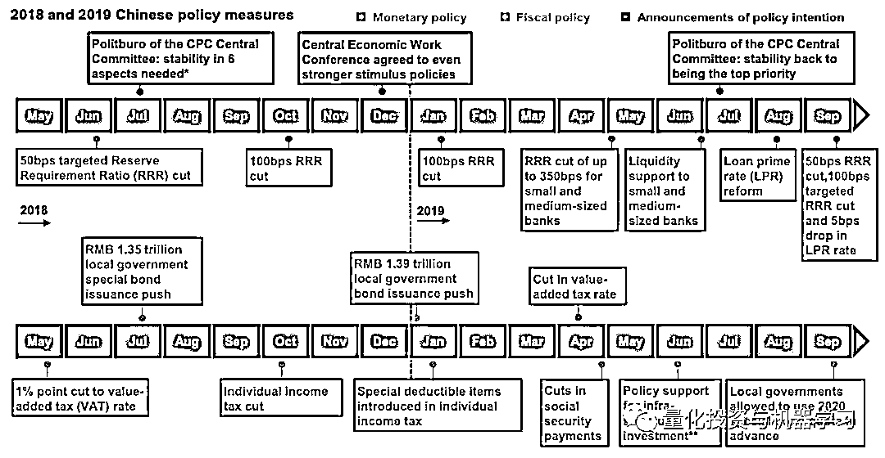

# 量化投资界：2019 年度最佳论文出炉！

> 原文：[`mp.weixin.qq.com/s?__biz=MzAxNTc0Mjg0Mg==&mid=2653295746&idx=1&sn=7c76d0cd1817a84a8cab44010f294e4d&chksm=802dd697b75a5f81ed58c0c051e22853c8b8b82bac3f47a9fb5e3a05a560e25161e1c4c70c2b&scene=27#wechat_redirect`](http://mp.weixin.qq.com/s?__biz=MzAxNTc0Mjg0Mg==&mid=2653295746&idx=1&sn=7c76d0cd1817a84a8cab44010f294e4d&chksm=802dd697b75a5f81ed58c0c051e22853c8b8b82bac3f47a9fb5e3a05a560e25161e1c4c70c2b&scene=27#wechat_redirect)

**标星★****置顶****公众号     **爱你们♥   

编辑：公众号编辑部

**近期原创文章：**

## ♥ [5 种机器学习算法在预测股价的应用（代码+数据）](https://mp.weixin.qq.com/s?__biz=MzAxNTc0Mjg0Mg==&mid=2653290588&idx=1&sn=1d0409ad212ea8627e5d5cedf61953ac&chksm=802dc249b75a4b5fa245433320a4cc9da1a2cceb22df6fb1a28e5b94ff038319ae4e7ec6941f&token=1298662931&lang=zh_CN&scene=21#wechat_redirect)

## ♥ [Two Sigma 用新闻来预测股价走势，带你吊打 Kaggle](https://mp.weixin.qq.com/s?__biz=MzAxNTc0Mjg0Mg==&mid=2653290456&idx=1&sn=b8d2d8febc599742e43ea48e3c249323&chksm=802e3dcdb759b4db9279c689202101b6b154fb118a1c1be12b52e522e1a1d7944858dbd6637e&token=1330520237&lang=zh_CN&scene=21#wechat_redirect)

## ♥ 2 万字干货：[利用深度学习最新前沿预测股价走势](https://mp.weixin.qq.com/s?__biz=MzAxNTc0Mjg0Mg==&mid=2653290080&idx=1&sn=06c50cefe78a7b24c64c4fdb9739c7f3&chksm=802e3c75b759b563c01495d16a638a56ac7305fc324ee4917fd76c648f670b7f7276826bdaa8&token=770078636&lang=zh_CN&scene=21#wechat_redirect)

## ♥ [机器学习在量化金融领域的误用！](http://mp.weixin.qq.com/s?__biz=MzAxNTc0Mjg0Mg==&mid=2653292984&idx=1&sn=3e7efe9fe9452c4a5492d2175b4159ef&chksm=802dcbadb75a42bbdce895c49070c3f552dc8c983afce5eeac5d7c25974b7753e670a0162c89&scene=21#wechat_redirect)

## ♥ [基于 RNN 和 LSTM 的股市预测方法](https://mp.weixin.qq.com/s?__biz=MzAxNTc0Mjg0Mg==&mid=2653290481&idx=1&sn=f7360ea8554cc4f86fcc71315176b093&chksm=802e3de4b759b4f2235a0aeabb6e76b3e101ff09b9a2aa6fa67e6e824fc4274f68f4ae51af95&token=1865137106&lang=zh_CN&scene=21#wechat_redirect)

## ♥ [如何鉴别那些用深度学习预测股价的花哨模型？](https://mp.weixin.qq.com/s?__biz=MzAxNTc0Mjg0Mg==&mid=2653290132&idx=1&sn=cbf1e2a4526e6e9305a6110c17063f46&chksm=802e3c81b759b597d3dd94b8008e150c90087567904a29c0c4b58d7be220a9ece2008956d5db&token=1266110554&lang=zh_CN&scene=21#wechat_redirect)

## ♥ [优化强化学习 Q-learning 算法进行股市](https://mp.weixin.qq.com/s?__biz=MzAxNTc0Mjg0Mg==&mid=2653290286&idx=1&sn=882d39a18018733b93c8c8eac385b515&chksm=802e3d3bb759b42d1fc849f96bf02ae87edf2eab01b0beecd9340112c7fb06b95cb2246d2429&token=1330520237&lang=zh_CN&scene=21#wechat_redirect)

## ♥ [WorldQuant 101 Alpha、国泰君安 191 Alpha](https://mp.weixin.qq.com/s?__biz=MzAxNTc0Mjg0Mg==&mid=2653290927&idx=1&sn=ecca60811da74967f33a00329a1fe66a&chksm=802dc3bab75a4aac2bb4ccff7010063cc08ef51d0bf3d2f71621cdd6adece11f28133a242a15&token=48775331&lang=zh_CN&scene=21#wechat_redirect)

## ♥ [基于回声状态网络预测股票价格（附代码）](https://mp.weixin.qq.com/s?__biz=MzAxNTc0Mjg0Mg==&mid=2653291171&idx=1&sn=485a35e564b45046ff5a07c42bba1743&chksm=802dc0b6b75a49a07e5b91c512c8575104f777b39d0e1d71cf11881502209dc399fd6f641fb1&token=48775331&lang=zh_CN&scene=21#wechat_redirect)

## ♥ [计量经济学应用投资失败的 7 个原因](https://mp.weixin.qq.com/s?__biz=MzAxNTc0Mjg0Mg==&mid=2653292186&idx=1&sn=87501434ae16f29afffec19a6884ee8d&chksm=802dc48fb75a4d99e0172bf484cdbf6aee86e36a95037847fd9f070cbe7144b4617c2d1b0644&token=48775331&lang=zh_CN&scene=21#wechat_redirect)

## ♥ [配对交易千千万，强化学习最 NB！（文档+代码）](http://mp.weixin.qq.com/s?__biz=MzAxNTc0Mjg0Mg==&mid=2653292915&idx=1&sn=13f4ddebcd209b082697a75544852608&chksm=802dcb66b75a4270ceb19fac90eb2a70dc05f5b6daa295a7d31401aaa8697bbb53f5ff7c05af&scene=21#wechat_redirect)

## ♥ [关于高盛在 Github 开源背后的真相！](https://mp.weixin.qq.com/s?__biz=MzAxNTc0Mjg0Mg==&mid=2653291594&idx=1&sn=7703403c5c537061994396e7e49e7ce5&chksm=802dc65fb75a4f49019cec951ac25d30ec7783738e9640ec108be95335597361c427258f5d5f&token=48775331&lang=zh_CN&scene=21#wechat_redirect)

## ♥ [新一代量化带货王诞生！Oh My God！](https://mp.weixin.qq.com/s?__biz=MzAxNTc0Mjg0Mg==&mid=2653291789&idx=1&sn=e31778d1b9372bc7aa6e57b82a69ec6e&chksm=802dc718b75a4e0ea4c022e70ea53f51c48d102ebf7e54993261619c36f24f3f9a5b63437e9e&token=48775331&lang=zh_CN&scene=21#wechat_redirect)

## ♥ [独家！关于定量/交易求职分享（附真实试题）](https://mp.weixin.qq.com/s?__biz=MzAxNTc0Mjg0Mg==&mid=2653291844&idx=1&sn=3fd8b57d32a0ebd43b17fa68ae954471&chksm=802dc751b75a4e4755fcbb0aa228355cebbbb6d34b292aa25b4f3fbd51013fcf7b17b91ddb71&token=48775331&lang=zh_CN&scene=21#wechat_redirect)

## ♥ [Quant 们的身份危机！](https://mp.weixin.qq.com/s?__biz=MzAxNTc0Mjg0Mg==&mid=2653291856&idx=1&sn=729b657ede2cb50c96e92193ab16102d&chksm=802dc745b75a4e53c5018cc1385214233ec4657a3479cd7193c95aaf65642f5f45fa0e465694&token=48775331&lang=zh_CN&scene=21#wechat_redirect)

## ♥ [AQR 最新研究 | 机器能“学习”金融吗](http://mp.weixin.qq.com/s?__biz=MzAxNTc0Mjg0Mg==&mid=2653292710&idx=1&sn=e5e852de00159a96d5dcc92f349f5b58&chksm=802dcab3b75a43a5492bc98874684081eb5c5666aff32a36a0cdc144d74de0200cc0d997894f&scene=21#wechat_redirect)

# 2019 年，SIA 为我们评选了年度最佳：**量****化、因子投资、资产配置、策略与经济、固收、ETF、ESG、趋势、投资行业**领域的最佳论文，下面让我们一睹为快吧！

**获取全部 paper，见文末**

**量化**

2019 年度最佳量化论文来自**AQR Capital Management：**

2019 年度最佳

✎

**量化**

**《Factor Momentum Everywhere》**

“在本文中，AQR 记录了 65 个被广泛研究因子中的动量行为，发现这种行为具有统计上的稳健性。他们的研究结果表明，动量现象在很大程度上是由共同收益因子的持久性所驱动，而不仅仅是由特殊股票表现的持久性所驱动。此外，在传统的因子投资组合中加入动量因子可以提高这些策略的表现。”

相关人气论文

**1、****Buf****fet****t's Alpha****(Financial Analyst Journal)**

**2、Mar****ket Efficiency: Who is on the Other Side?** **(Michael J. Mauboussin)**

**3、E****quity Risk Premiums (ERP): Determinants, Estimation and Implications** **(Damodaran)**

**4、Uncover****ing Macro Characteristics in Carry Portfolios** **(QMA)**

**5、Cons****trained Risk Budgeting Portfolios** **(Amundi Asset Management)**

**ESG**

2019 年度最佳 ESG 论文来自**MSCI：**

2019 年度最佳

✎

**ESG**

**《2019 ESG Trends to Watch》**

“在这篇论文中，MSCI 探讨了五个 ESG 趋势：1、不仅需要减少塑料垃圾，还需要提供生物可降解的替代品；2、公司和投资者对 ESG 信息披露施加越来越大的监管压力；3、气候变化的加速影响其对投资的影响；4、利用各种 ESG 数据来提取有价值的信号；5、在公司透明的时代学习良好的治理技能。”

相关人气论文

**1、****Pass****ive Investing 2019: The rise of stewardship** **(CREATE-Research/DWS)**

**2、****Asse****ssing Risk Through ESG Exposures** **(AQR Capital Management)**

**3、****ERO****CI and the Tough Road Ahead for Oil** **(BNP Paribas Asset Management)**

**4、****A Surv****ey of ESG Vendor Data: Strategies for Managing Score Differences** **(Qontigo)**

**因子投资**

2019 年度最佳因子投资论文来自**QMA：**

2019 年度最佳

✎

**因子投资**

**《Value vs. Growth: The New Bubble》**

“价值风险因子在过去几年表现不佳，一直是因子投资支持者真正关心的问题。 也许正是出于这个原因，QMA 的论文引起了投资者的共鸣，在仅仅 12 页的篇幅内，QMA 提出了各种各样的图表，为他们构建一个有说服力的论点。 他们认为，投资者应该考虑为投资组合增加价值倾斜。”

相关人气论文

**1、Global Factor Premiums** **(Robeco)**

**2、Do Factor Premia Vary Over Time? A Century of Evidence** **(AQR Capital Management)**

**3、What, Exactly, Is a Factor?** **(Qontigo)**

**4、Smart Beta 2019 - Global Survey Findings from Asset Owners** **(FTSE Russell)**

**5、What explains the poor performance of factor strategies over the last 3 years?** **(Scientific Beta)**

**6、Factor Investing in Equities and Corporate Bonds: Neutralising Bias** **(BNP Paribas Asset Management)**

**ETF**

2019 年度最佳 ETF 论文来自**S&P Dow Jones Indices：**

2019 年度最佳

✎

**ETF**

**《ETFs in Insurance General Accounts》**

“ETF 在投资者资产中所占的份额不断上升。在长达 54 页的报告中，S&P Dow Jones Indices 提供了保险公司 ETF 资产的非常详细的信息。按照公司规模、类型、所有权结构、ETF 资产类别、配置、股票部门、固定收益信贷质量、固定收益期限、SV 持有量和 smart beta 类别对这些数据进行了研究。”

相关人气论文

**1、The Revenge of the Stock Pickers** **(Financial Analysts Journal)**

**2、The Performance of Exchange-Traded Funds** **(Robeco)**

**3、EDHEC European ETF, Smart Beta and Factor Investing Survey 2019**

**4、Are Passive Funds Really Superior Investments? An Investor Perspective** **(Financial Analysts Journal)**

**资产配置**

2019 年度最佳资产配置论文来自**Robeco：**

2019 年度最佳

✎

**资产配置**

**《5-year Expected Returns 2020-2024:**

**Escaping the Hall of Mirrors》**

“Robeco 的这篇论文长达 117 页，提供了中长期资本市场预期、与这些预期相关的已知风险，以及与其它资产类别的相关性。以极大的深度和敏锐涵盖了所有这些主题。”

相关人气论文

**1、2019 Long-Term Capital Market Expectations** **(Franklin Templeton)**

**2、Investing for the long term** **(UBS Asset Management)**

**3、Balancing Act: Managing Risk across Multiple Time Horizons** **(FCLT)**

**4、Slower growth and performance: five year capital market expectations** **(UBS Asset Management)**

**5、Time to evolve: A quarter-century of FX reserve management** **(UBS Asset Management)**

**固收**

2019 年度最佳固收论文来自**PGIM Fixed Income：**

2019 年度最佳

✎

**固收**

**《Capturing the Opportunity of Constraints》**

“固定收益市场非常分散，不同类型的固定收益投资者受到独特的约束。例如，被动投资者主要关心的是跟踪误差低于基准指数，他们可能不得不从指数成分股那里购买证券。 同样，货币市场投资者必须购买期限在一年或一年以下的证券。 这些类型的限制可以为固定收益投资者带来不受同样要求约束的机会。这份 PGIM 固定收益论文深入研究了确定相对价值、衡量和管理风险，以及构建多部门固定收益投资组合的具体细节。”

相关人气论文

**1、High Yield: Dealing with Fallen Angel Risk** **(Moody's)**

**2、Traditional and Alternative Factors in Investment Grade Corporate Bond Investing** **(Amundi Asset Management)**

**3、U.S. Corporate Bond Market: Where Has My Credit Premium Gone?** **(Mellon Capital)**

**4、Rehabilitation of the European Structured Finance Market** **(BNP Paribas Asset Management)**

**5、Optimizing Yield Curve Positioning for Multi‑Asset Portfolios (PIMCO)**

**Corporate Leverage Through the Cycle** **(MFS Investment Management)**

**趋势**

2019 年度最佳趋势论文来自**BNY Mellon Investment Management：**

2019 年度最佳

✎

**趋势**

**《Future-Proofing Your Asset Allocation **

**in the Age of Mega Trends》**

“这里的趋势主要指的是关于长期趋势的论文，它们有能力在经济或投资领域产生结构性变化。例如人口、技术、社会、地理或环境方面的趋势。BNY Mellon Investment Management 的论文指出了其中的两个大趋势：人工智能和气候变化，以及它们带来的挑战和投资者应该如何应对的讨论。通过对一些全球顶级投资者和资产配置者的采访，其深入探讨了投资界面临的挑战，以及投资者和资产配置者是如何应对使自己的投资组合经得起时间考验的。”

相关人气论文

1、Five things you should know about trends investing (Robeco)  

**2、Tech Trends 2019: Beyond the digital frontier** **(Deloitte)**

**3、Megatrends: The economics of a graying world** **(Vanguard)**

##### **4、Artificial Intelligence: Real opportunity** **(Franklin Templeton)**

##### **5、Machine Learning for Investment Managers** **(SimCorp)**

**投资行业**2019 年度最佳投资论文来自**CFA Institute：**

2019 年度最佳

✎

**投资行业**

**《Investment Professional of the Future》**

“随着投资行业的加速变化，未来的投资专业人士必须适应并迎接新的挑战和机遇，以获得职业上的成功。本报告探讨了投资行业角色、技能和职业以及组织环境和文化如何塑造未来投资专业人员的属性。报告内容包括对全球 3832 名 CFA 协会会员和候选人的调查，对 133 名专家的意见调查，以及对 100 多名行业圆桌会议和个人访谈参与者的意见。”

相关人气论文

**1、How can asset managers meet the needs of asset owners in the Great Acceleration?****(Thinking Ahead Institute)**

##### ****2、Asset & Wealth Management 2025: The Asian Awakening** **(PwC)****

##### ****3、Trends in the Expenses and Fees of Funds** **(ICI)****

##### ****4、Asset Managers & Wholesale Banks: Searching for Growth in Disruption** **(Oliver Wyman/Morgan Stanley)****

##### ****5、Will the good times keep rolling for Asia's asset managers?** **(McKinsey & Company)****

##### ****6、How much do fees affect the active versus passive debate?** **(S&P Dow Jones Indices)****

****投资策略与宏观经济******2019 年度最佳投资论文来自**J.P. Morgan：**** 

**2019 年度最佳**

**✎**

****策略与经济****

****《 Guide to the Markets - ****Asia version》****

**“J.P. Morgan Asset Management 的《市场指南》是一份图表季度报告，它展示了与经济和市场相关的各种有说服力的数据，同时与大多数投资者的策略讨论有关。”**

****

**相关人气论文**

****1、Debunking the yield curve as a ‘super-forecaster’ of recessions** **(BNP Paribas AM)****

****2、Global Macro Trends: Wisdom in Curiosity** **(KKR)****

****3、Guide to Recessions: What to look out for and how to prepare****(Capital Group)****

****4、Wealth Inequality - A Tale of the Diverging Tails** **(PGIM Fixed Income)****

****论文下载****

**在**后台**输入（严格大小写）**

*****QIML_ 最佳论文 _Get*****

****手慢无**** 

***—End—***

**量化投资与机器学习微信公众号，是业内垂直于**Quant**、**MFE**、**Fintech****、AI、ML**等领域的**量化类主流自媒体。**公众号拥有来自**公募、私募、券商、期货、银行、海外**等众多圈内**18W+**关注者。每日发布行业前沿研究成果和最新量化资讯。**

******你点的每个“在看”，都是对我们最大的鼓励**