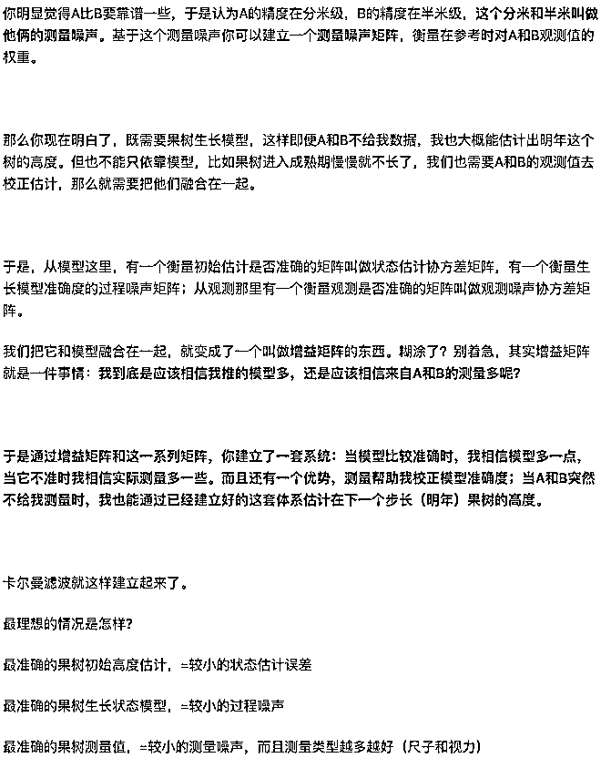
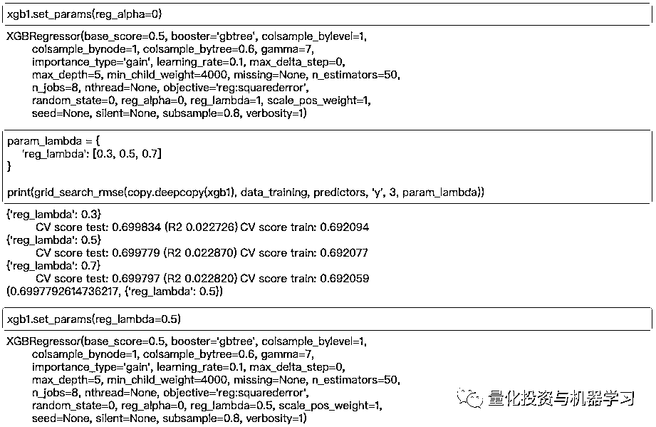
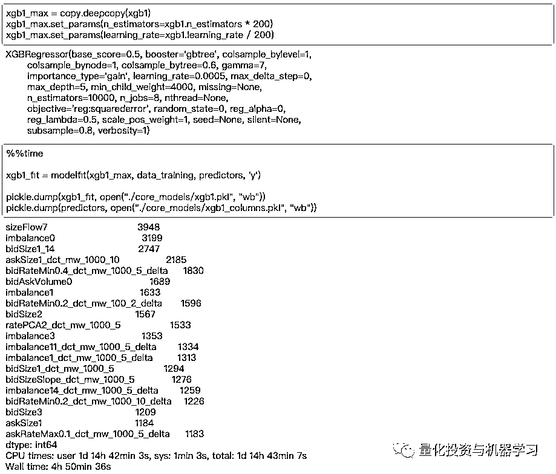
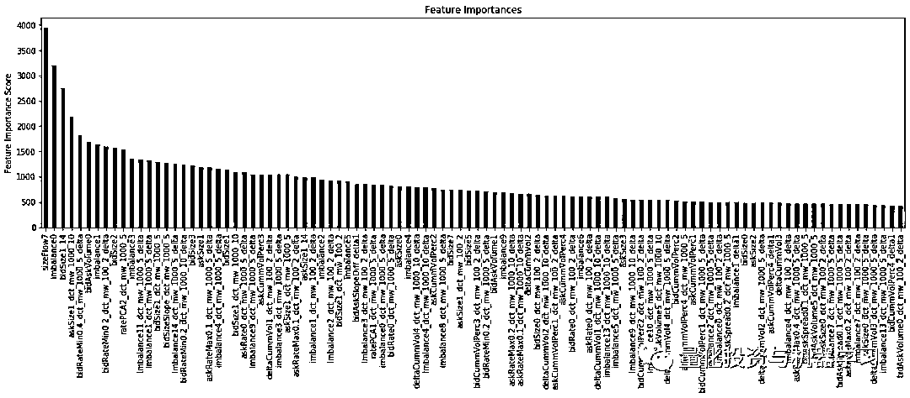

# 从限价订单薄中推导预测因子：卡尔曼滤波来搞定！

> 原文：[`mp.weixin.qq.com/s?__biz=MzAxNTc0Mjg0Mg==&mid=2653295727&idx=1&sn=ca6a2b849c4d1ab99e8a2cd644dbae42&chksm=802dd67ab75a5f6caf9f3b0f163e2cc70ba947434af9f8013e78565967ec1a5edc4f51020973&scene=27#wechat_redirect`](http://mp.weixin.qq.com/s?__biz=MzAxNTc0Mjg0Mg==&mid=2653295727&idx=1&sn=ca6a2b849c4d1ab99e8a2cd644dbae42&chksm=802dd67ab75a5f6caf9f3b0f163e2cc70ba947434af9f8013e78565967ec1a5edc4f51020973&scene=27#wechat_redirect)


**标星★****置顶****公众号     **爱你们♥   

作者：Alex Botsula

编辑：1+1=6

**近期原创文章：**

## ♥ [5 种机器学习算法在预测股价的应用（代码+数据）](https://mp.weixin.qq.com/s?__biz=MzAxNTc0Mjg0Mg==&mid=2653290588&idx=1&sn=1d0409ad212ea8627e5d5cedf61953ac&chksm=802dc249b75a4b5fa245433320a4cc9da1a2cceb22df6fb1a28e5b94ff038319ae4e7ec6941f&token=1298662931&lang=zh_CN&scene=21#wechat_redirect)

## ♥ [Two Sigma 用新闻来预测股价走势，带你吊打 Kaggle](https://mp.weixin.qq.com/s?__biz=MzAxNTc0Mjg0Mg==&mid=2653290456&idx=1&sn=b8d2d8febc599742e43ea48e3c249323&chksm=802e3dcdb759b4db9279c689202101b6b154fb118a1c1be12b52e522e1a1d7944858dbd6637e&token=1330520237&lang=zh_CN&scene=21#wechat_redirect)

## ♥ 2 万字干货：[利用深度学习最新前沿预测股价走势](https://mp.weixin.qq.com/s?__biz=MzAxNTc0Mjg0Mg==&mid=2653290080&idx=1&sn=06c50cefe78a7b24c64c4fdb9739c7f3&chksm=802e3c75b759b563c01495d16a638a56ac7305fc324ee4917fd76c648f670b7f7276826bdaa8&token=770078636&lang=zh_CN&scene=21#wechat_redirect)

## ♥ [机器学习在量化金融领域的误用！](http://mp.weixin.qq.com/s?__biz=MzAxNTc0Mjg0Mg==&mid=2653292984&idx=1&sn=3e7efe9fe9452c4a5492d2175b4159ef&chksm=802dcbadb75a42bbdce895c49070c3f552dc8c983afce5eeac5d7c25974b7753e670a0162c89&scene=21#wechat_redirect)

## ♥ [基于 RNN 和 LSTM 的股市预测方法](https://mp.weixin.qq.com/s?__biz=MzAxNTc0Mjg0Mg==&mid=2653290481&idx=1&sn=f7360ea8554cc4f86fcc71315176b093&chksm=802e3de4b759b4f2235a0aeabb6e76b3e101ff09b9a2aa6fa67e6e824fc4274f68f4ae51af95&token=1865137106&lang=zh_CN&scene=21#wechat_redirect)

## ♥ [如何鉴别那些用深度学习预测股价的花哨模型？](https://mp.weixin.qq.com/s?__biz=MzAxNTc0Mjg0Mg==&mid=2653290132&idx=1&sn=cbf1e2a4526e6e9305a6110c17063f46&chksm=802e3c81b759b597d3dd94b8008e150c90087567904a29c0c4b58d7be220a9ece2008956d5db&token=1266110554&lang=zh_CN&scene=21#wechat_redirect)

## ♥ [优化强化学习 Q-learning 算法进行股市](https://mp.weixin.qq.com/s?__biz=MzAxNTc0Mjg0Mg==&mid=2653290286&idx=1&sn=882d39a18018733b93c8c8eac385b515&chksm=802e3d3bb759b42d1fc849f96bf02ae87edf2eab01b0beecd9340112c7fb06b95cb2246d2429&token=1330520237&lang=zh_CN&scene=21#wechat_redirect)

## ♥ [WorldQuant 101 Alpha、国泰君安 191 Alpha](https://mp.weixin.qq.com/s?__biz=MzAxNTc0Mjg0Mg==&mid=2653290927&idx=1&sn=ecca60811da74967f33a00329a1fe66a&chksm=802dc3bab75a4aac2bb4ccff7010063cc08ef51d0bf3d2f71621cdd6adece11f28133a242a15&token=48775331&lang=zh_CN&scene=21#wechat_redirect)

## ♥ [基于回声状态网络预测股票价格（附代码）](https://mp.weixin.qq.com/s?__biz=MzAxNTc0Mjg0Mg==&mid=2653291171&idx=1&sn=485a35e564b45046ff5a07c42bba1743&chksm=802dc0b6b75a49a07e5b91c512c8575104f777b39d0e1d71cf11881502209dc399fd6f641fb1&token=48775331&lang=zh_CN&scene=21#wechat_redirect)

## ♥ [计量经济学应用投资失败的 7 个原因](https://mp.weixin.qq.com/s?__biz=MzAxNTc0Mjg0Mg==&mid=2653292186&idx=1&sn=87501434ae16f29afffec19a6884ee8d&chksm=802dc48fb75a4d99e0172bf484cdbf6aee86e36a95037847fd9f070cbe7144b4617c2d1b0644&token=48775331&lang=zh_CN&scene=21#wechat_redirect)

## ♥ [配对交易千千万，强化学习最 NB！（文档+代码）](http://mp.weixin.qq.com/s?__biz=MzAxNTc0Mjg0Mg==&mid=2653292915&idx=1&sn=13f4ddebcd209b082697a75544852608&chksm=802dcb66b75a4270ceb19fac90eb2a70dc05f5b6daa295a7d31401aaa8697bbb53f5ff7c05af&scene=21#wechat_redirect)

## ♥ [关于高盛在 Github 开源背后的真相！](https://mp.weixin.qq.com/s?__biz=MzAxNTc0Mjg0Mg==&mid=2653291594&idx=1&sn=7703403c5c537061994396e7e49e7ce5&chksm=802dc65fb75a4f49019cec951ac25d30ec7783738e9640ec108be95335597361c427258f5d5f&token=48775331&lang=zh_CN&scene=21#wechat_redirect)

## ♥ [新一代量化带货王诞生！Oh My God！](https://mp.weixin.qq.com/s?__biz=MzAxNTc0Mjg0Mg==&mid=2653291789&idx=1&sn=e31778d1b9372bc7aa6e57b82a69ec6e&chksm=802dc718b75a4e0ea4c022e70ea53f51c48d102ebf7e54993261619c36f24f3f9a5b63437e9e&token=48775331&lang=zh_CN&scene=21#wechat_redirect)

## ♥ [独家！关于定量/交易求职分享（附真实试题）](https://mp.weixin.qq.com/s?__biz=MzAxNTc0Mjg0Mg==&mid=2653291844&idx=1&sn=3fd8b57d32a0ebd43b17fa68ae954471&chksm=802dc751b75a4e4755fcbb0aa228355cebbbb6d34b292aa25b4f3fbd51013fcf7b17b91ddb71&token=48775331&lang=zh_CN&scene=21#wechat_redirect)

## ♥ [Quant 们的身份危机！](https://mp.weixin.qq.com/s?__biz=MzAxNTc0Mjg0Mg==&mid=2653291856&idx=1&sn=729b657ede2cb50c96e92193ab16102d&chksm=802dc745b75a4e53c5018cc1385214233ec4657a3479cd7193c95aaf65642f5f45fa0e465694&token=48775331&lang=zh_CN&scene=21#wechat_redirect)

## ♥ [AQR 最新研究 | 机器能“学习”金融吗](http://mp.weixin.qq.com/s?__biz=MzAxNTc0Mjg0Mg==&mid=2653292710&idx=1&sn=e5e852de00159a96d5dcc92f349f5b58&chksm=802dcab3b75a43a5492bc98874684081eb5c5666aff32a36a0cdc144d74de0200cc0d997894f&scene=21#wechat_redirect)

**前言**

本篇推文，是从一场比赛中学到的一些方法与技巧，分享给公众号的读者们！本文是预测因子的一部分内容。

参赛者要求从限价订单簿（LOB）数据预测外汇资产的未来收益。 这些数据包括 300 万条交易记录，每条记录都包含多档的 bid 和 ask 价格。作为比赛的保密性。其没有披露资产或限价订单日期的细节。

在本文中，我们将重点介绍卡尔曼滤波的应用，以推导 LOB 的隐式状态。关于卡尔曼滤波理论的详细描述可见下面的链接：

*http://web.mit.edu/kirtley/kirtley/binlustuff/literature/control/Kalman%20filter.pdf*


知乎网友@太空精酿的这段回答，通俗易懂，让大家很容易理解**什么是卡尔曼滤波（一定要看哦！）**：

  

**模型框架**

我们采用一种相对标准（传统）的方法来建立回归模型：

1、以 XGBoost 回归模型为核心

2、基于 walk forward 交叉验证的参数网格搜索

3、根据历史 tick 数据生成额外的动态因子

**卡尔曼滤波的特征工程与 LOB 推导**

LOB 数据以 bid/ask 规模和价格数组的形式呈现，分为 15 个部分：bidSize[0..14]，askSize[0..14]，bidPrice[0..14]，askPrice[0..14]。参考下面图，了解 LOB 在短时间内的累计 bid/ask 交易量：


为了跟踪 LOB 随时间的动态变化，引入了 LOB buckets 之间隐含的现金流。简化一下，所有的 buckets[1..14] 被合并成一个。因此，观察结果被描述为向量[bidSize1_14, bidSize0, askSize0, askSize1_14]。

根据以下 11 个参数定义系统的隐藏状态：

1、每个 buckets 中四个参数为当前成交量 bidSize1_14，bidSize0，askSize0，askSize1_14。虽然这些参数在数据中是直接观测到的，但卡尔曼滤波将其视为受到测量和过程误差的影响；

2、相应 buckets 的外部现金流量的四个参数；

3、三个参数定义了 buckets 之间的现金流：

ask1_14 ⇆ ask_0

bid1_14 ⇆ bid_0

ask_0 ⇆ bid_0

除了来自外部的流之外，隐藏状态假定存在于 buckets 之间的隐式流。 正如我们看到的，这些流的估计被用作回归模型中的因子。

基于上述状态，11×11 卡尔曼状态转移矩阵为：


在状态转换矩阵中，行和列按照上面的隐藏状态列表排序。从第 5 行开始，它是一个单位矩阵，表示流不会发生任何变化。第 1 行到第 4 行表示当前 bid/ask 的成交量。例如，buckets1-14 的 BidSize 随时间 t 的变化如下：


ω代表白噪声过程。

卡尔曼滤波算法在下面的代码中实现：

```py
process_data = np.array(data[['bidSize1_14', 'bidSize0', 'askSize0', 'askSize1_14']])
N_states = 11                                                                       # number of states
xhat = np.zeros((process_data.shape[0], N_states)) # a posteriori estimate of x
P = np.identity(N_states) # a posteriori error estimate
xhatminus = np.zeros((process_data.shape[0], N_states)) # a priori estimate of x
Pminus = np.identity(N_states) # a priori error estimate
K = np.zeros((N_states, process_data.shape[1])) # gain or blending factor
Q = np.identity(N_states) * 1e-3                                                    # estimate of process variance
R = 1                                                                               # estimate of measurement variance

A = np.identity(N_states)
A[0:4, 4:11] = [
    [1, 0, 0, 0, 0, -1, 0],
    [0, 1, 0, 0, 0, 1, -1],
    [0, 0, 1, 0, 1, 0, 1],
    [0, 0, 0, 1, -1, 0, 0]
]
```

该代码返回隐式流的值，这些值进一步用作核心回归模型中的预测因子。作为一个例子，流的第一个 20000 个观测值（ask_0 ⇆ bid_0）表示在下面的时间序列中：


在 XGBoost 模型中使用了新的预测因子，并根据它们在 XGBoost 决策树中使用的次数来估计它们的相对重要性。

变量的提取重要统计数据表示在下面的图上，第一个特征表示流 ask_0⇆bid_0：


我们观察了一个基于 LOB 隐式动态现金流生成因子的示例。尽管流是隐式的，数据中没有观察到，但是使用卡尔曼滤波算法可以生成具有显著预测能力的因子，并将其作为核心 X 输入到 GBoost 算法中。

**XGBoost 和交叉验证的细节**

直接上代码：








*—End—*

量化投资与机器学习微信公众号，是业内垂直于**Quant**、**MFE**、**Fintech****、AI、ML**等领域的**量化类主流自媒体。**公众号拥有来自**公募、私募、券商、期货、银行、海外**等众多圈内**18W+**关注者。每日发布行业前沿研究成果和最新量化资讯。

你点的每个“在看”，都是对我们最大的鼓励