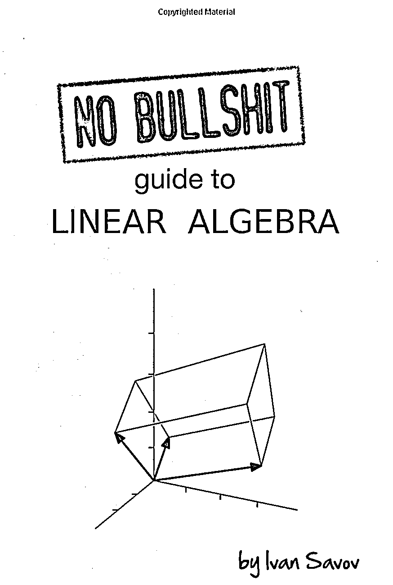
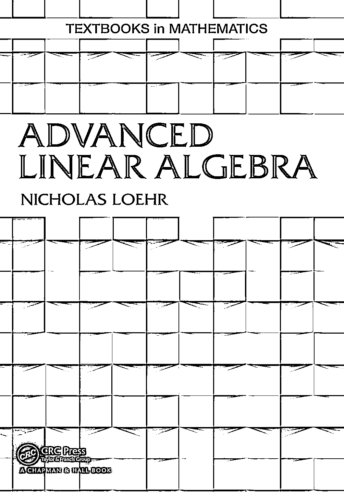
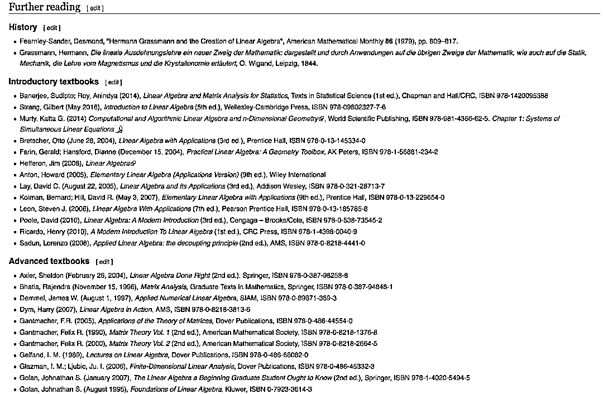
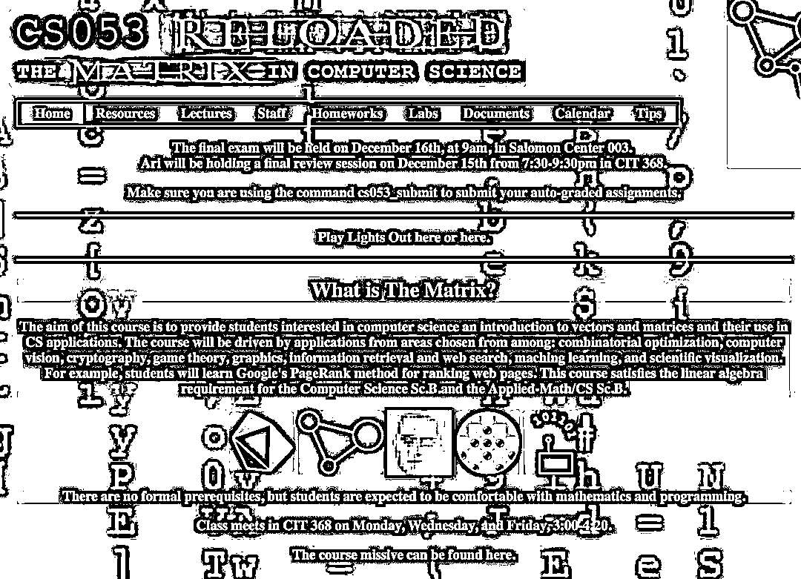
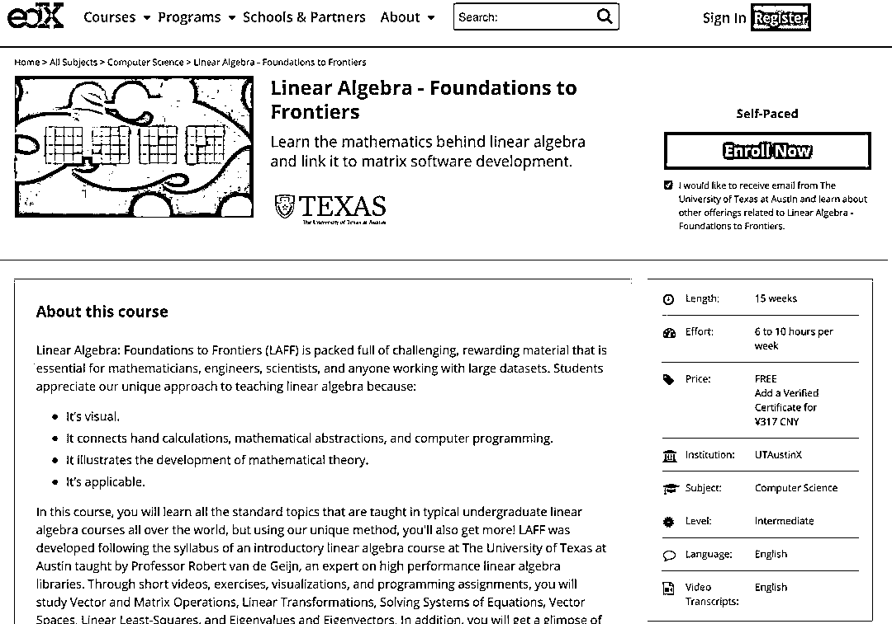
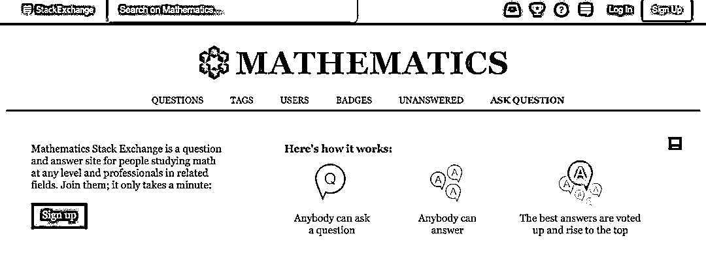
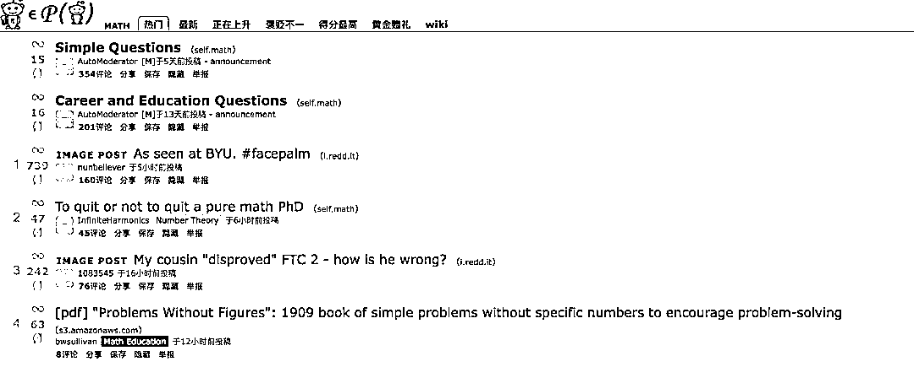

# 华尔街失守：23 万交易员被机器人取代！

> 原文：[`mp.weixin.qq.com/s?__biz=MzAxNTc0Mjg0Mg==&mid=2653295698&idx=1&sn=8962f70a639c81174400861bec2883de&chksm=802dd647b75a5f517994a266985166ccacb63cac9f5589103d157ae699cdff9d37e4886671de&scene=27#wechat_redirect`](http://mp.weixin.qq.com/s?__biz=MzAxNTc0Mjg0Mg==&mid=2653295698&idx=1&sn=8962f70a639c81174400861bec2883de&chksm=802dd647b75a5f517994a266985166ccacb63cac9f5589103d157ae699cdff9d37e4886671de&scene=27#wechat_redirect)

**标星★****置顶****公众号     **爱你们♥   

作者：编辑部、UniCareer

**近期原创文章：**

## ♥ [5 种机器学习算法在预测股价的应用（代码+数据）](https://mp.weixin.qq.com/s?__biz=MzAxNTc0Mjg0Mg==&mid=2653290588&idx=1&sn=1d0409ad212ea8627e5d5cedf61953ac&chksm=802dc249b75a4b5fa245433320a4cc9da1a2cceb22df6fb1a28e5b94ff038319ae4e7ec6941f&token=1298662931&lang=zh_CN&scene=21#wechat_redirect)

## ♥ [Two Sigma 用新闻来预测股价走势，带你吊打 Kaggle](https://mp.weixin.qq.com/s?__biz=MzAxNTc0Mjg0Mg==&mid=2653290456&idx=1&sn=b8d2d8febc599742e43ea48e3c249323&chksm=802e3dcdb759b4db9279c689202101b6b154fb118a1c1be12b52e522e1a1d7944858dbd6637e&token=1330520237&lang=zh_CN&scene=21#wechat_redirect)

## ♥ 2 万字干货：[利用深度学习最新前沿预测股价走势](https://mp.weixin.qq.com/s?__biz=MzAxNTc0Mjg0Mg==&mid=2653290080&idx=1&sn=06c50cefe78a7b24c64c4fdb9739c7f3&chksm=802e3c75b759b563c01495d16a638a56ac7305fc324ee4917fd76c648f670b7f7276826bdaa8&token=770078636&lang=zh_CN&scene=21#wechat_redirect)

## ♥ [机器学习在量化金融领域的误用！](http://mp.weixin.qq.com/s?__biz=MzAxNTc0Mjg0Mg==&mid=2653292984&idx=1&sn=3e7efe9fe9452c4a5492d2175b4159ef&chksm=802dcbadb75a42bbdce895c49070c3f552dc8c983afce5eeac5d7c25974b7753e670a0162c89&scene=21#wechat_redirect)

## ♥ [基于 RNN 和 LSTM 的股市预测方法](https://mp.weixin.qq.com/s?__biz=MzAxNTc0Mjg0Mg==&mid=2653290481&idx=1&sn=f7360ea8554cc4f86fcc71315176b093&chksm=802e3de4b759b4f2235a0aeabb6e76b3e101ff09b9a2aa6fa67e6e824fc4274f68f4ae51af95&token=1865137106&lang=zh_CN&scene=21#wechat_redirect)

## ♥ [如何鉴别那些用深度学习预测股价的花哨模型？](https://mp.weixin.qq.com/s?__biz=MzAxNTc0Mjg0Mg==&mid=2653290132&idx=1&sn=cbf1e2a4526e6e9305a6110c17063f46&chksm=802e3c81b759b597d3dd94b8008e150c90087567904a29c0c4b58d7be220a9ece2008956d5db&token=1266110554&lang=zh_CN&scene=21#wechat_redirect)

## ♥ [优化强化学习 Q-learning 算法进行股市](https://mp.weixin.qq.com/s?__biz=MzAxNTc0Mjg0Mg==&mid=2653290286&idx=1&sn=882d39a18018733b93c8c8eac385b515&chksm=802e3d3bb759b42d1fc849f96bf02ae87edf2eab01b0beecd9340112c7fb06b95cb2246d2429&token=1330520237&lang=zh_CN&scene=21#wechat_redirect)

## ♥ [WorldQuant 101 Alpha、国泰君安 191 Alpha](https://mp.weixin.qq.com/s?__biz=MzAxNTc0Mjg0Mg==&mid=2653290927&idx=1&sn=ecca60811da74967f33a00329a1fe66a&chksm=802dc3bab75a4aac2bb4ccff7010063cc08ef51d0bf3d2f71621cdd6adece11f28133a242a15&token=48775331&lang=zh_CN&scene=21#wechat_redirect)

## ♥ [基于回声状态网络预测股票价格（附代码）](https://mp.weixin.qq.com/s?__biz=MzAxNTc0Mjg0Mg==&mid=2653291171&idx=1&sn=485a35e564b45046ff5a07c42bba1743&chksm=802dc0b6b75a49a07e5b91c512c8575104f777b39d0e1d71cf11881502209dc399fd6f641fb1&token=48775331&lang=zh_CN&scene=21#wechat_redirect)

## ♥ [计量经济学应用投资失败的 7 个原因](https://mp.weixin.qq.com/s?__biz=MzAxNTc0Mjg0Mg==&mid=2653292186&idx=1&sn=87501434ae16f29afffec19a6884ee8d&chksm=802dc48fb75a4d99e0172bf484cdbf6aee86e36a95037847fd9f070cbe7144b4617c2d1b0644&token=48775331&lang=zh_CN&scene=21#wechat_redirect)

## ♥ [配对交易千千万，强化学习最 NB！（文档+代码）](http://mp.weixin.qq.com/s?__biz=MzAxNTc0Mjg0Mg==&mid=2653292915&idx=1&sn=13f4ddebcd209b082697a75544852608&chksm=802dcb66b75a4270ceb19fac90eb2a70dc05f5b6daa295a7d31401aaa8697bbb53f5ff7c05af&scene=21#wechat_redirect)

## ♥ [关于高盛在 Github 开源背后的真相！](https://mp.weixin.qq.com/s?__biz=MzAxNTc0Mjg0Mg==&mid=2653291594&idx=1&sn=7703403c5c537061994396e7e49e7ce5&chksm=802dc65fb75a4f49019cec951ac25d30ec7783738e9640ec108be95335597361c427258f5d5f&token=48775331&lang=zh_CN&scene=21#wechat_redirect)

## ♥ [新一代量化带货王诞生！Oh My God！](https://mp.weixin.qq.com/s?__biz=MzAxNTc0Mjg0Mg==&mid=2653291789&idx=1&sn=e31778d1b9372bc7aa6e57b82a69ec6e&chksm=802dc718b75a4e0ea4c022e70ea53f51c48d102ebf7e54993261619c36f24f3f9a5b63437e9e&token=48775331&lang=zh_CN&scene=21#wechat_redirect)

## ♥ [独家！关于定量/交易求职分享（附真实试题）](https://mp.weixin.qq.com/s?__biz=MzAxNTc0Mjg0Mg==&mid=2653291844&idx=1&sn=3fd8b57d32a0ebd43b17fa68ae954471&chksm=802dc751b75a4e4755fcbb0aa228355cebbbb6d34b292aa25b4f3fbd51013fcf7b17b91ddb71&token=48775331&lang=zh_CN&scene=21#wechat_redirect)

## ♥ [Quant 们的身份危机！](https://mp.weixin.qq.com/s?__biz=MzAxNTc0Mjg0Mg==&mid=2653291856&idx=1&sn=729b657ede2cb50c96e92193ab16102d&chksm=802dc745b75a4e53c5018cc1385214233ec4657a3479cd7193c95aaf65642f5f45fa0e465694&token=48775331&lang=zh_CN&scene=21#wechat_redirect)

## ♥ [AQR 最新研究 | 机器能“学习”金融吗](http://mp.weixin.qq.com/s?__biz=MzAxNTc0Mjg0Mg==&mid=2653292710&idx=1&sn=e5e852de00159a96d5dcc92f349f5b58&chksm=802dcab3b75a43a5492bc98874684081eb5c5666aff32a36a0cdc144d74de0200cc0d997894f&scene=21#wechat_redirect)

**前言**

最近有消息称，高盛将要推出机器人顾问，或将完全取代交易员。

“机器人顾问对交易员生存业态的冲击很大。”一位华尔街金融机构股票交易员直言，基于大数据、人工智能等各类金融科技技术的机器人投资模型，**正从根本上替代交易员的人工交易决策机制，最终导致交易员这个职业成为历史。**

*图片来源：Managers of Wealth

今年 5 月，高盛以 7.5 亿美元现金收购了 United Capital。在收购之时，United 拥有约 250 亿美元的管理资产，2.3 亿美元的收入，以及全国近 100 个办事处。该公司的 FinLife CX 数字平台和财务规划软件也随之而来。

高盛收购 United Capital 可能是高盛即将推出的机器人产品的先驱。

根据 Aite Group 的研究，2017 年，机器人咨询引发了新的可支配账户激增，达到 2700 万，而四年前只有 1500 万。到 2023 年，数字平台上的资产预计将超过 1.26 万亿美元。

金融服务咨询公司 Opimas 在一份报告中估计：**到 2025 年，人工智能的普及，华尔街将减少 10%的员工，约为 23 万人将被人工智能取代。****那么，谁最有可能被机器人抢走工作？**第一个被淘汰的将是那些本质上具有重复性的角色：支持功能、后台处理、生成依赖于结构化数据的报告。在摩根大通，比如 1 个机器人处理的 170 万个请求相当于 140 个人完成的工。 德意志银行首席执行官 John Cryan 指出，那些“大部分时间都在打算盘”的会计师面临失业风险。 McKinsey & co.合伙人 Jared Moon 预计，席卷投资银行的技术将使普通员工的工作量减少三分之一左右。

*图片来源：彭博

以初级投资银行家为例，他们花费大量时间收集和分析数据，然后编写报告。咨询公司 Kognetics 发现，投资银行分析师在每天 16 个小时的工作时间中，几乎有一半都花在了建模和更新手册图表等任务上。机器学习程序在这方面已经很擅长了。合规和监管部门的员工有一个不同的担忧：在过去五年里，他们的队伍扩大了一倍，而银行的员工总数下降了 10%。将这些活动自动化，即所谓的 regtech——对于希望控制合规成本上升的金融机构来说可能是好消息，而对于希望保住工作的人来说则是坏消息。
包括 LendingClub Corp.和 On Deck Capital Inc.在内的初创公司是网络借贷的先驱，它们迅速将希望借到钱的消费者与希望从利息中获利的人匹配起来。现在，各家银行都在寻求竞争，它们宣布了自己的在线贷款门户网站，并与金融科技公司建立了合作关系。这使得信贷员和办事员成为最容易受到自动化影响的职业。

*图片来源：彭博根据 OPIMAS 估计，**到 2025 年，金融机构的成本收入比率将提高 28% ，因为它们将目前由雇员执行的日常流程自动化**。2017 年，预计金融公司在人工智能相关技术方面的支出将超过 15 亿美元，到 2021 年将达到 28 亿美元，增长 75% 。

*图片来源：OPIMAS 人工智能将为金融机构带来无数好处，包括提高运营效率和降低成本。 它还将升级传统 IT 系统，改进数据和分析，增强客户服务，增加收入。 OPIMAS 预计，到 2025 年，金融机构推出人工智能技术，将使成本/收入比率降低 25%以上，尤其是通过削减总人数。****摩根大通引领金融科技转型  ****11 月，**摩根大通为对 AI 工作感兴趣的学生开设了虚拟学院，摩根大通此举就是为了吸纳更多的 AI 人才**。对 AI 感兴趣的学生，可以在这里接触到摩根大通的定量研究专家、数据科学、人工智能和机器学习岗位方面的各种信息。
**10 月中旬，摩根大通的硅谷办公室开始组建一个新的人工智能团队，进行了大规模招聘，其中 17 个与 AI 直接相关的职位，还包括高级机器学习工程师。**该团队其任务是建立一个“V1”模型，该模型是研究和实施深度学习、机器学习，从而解决业务问题。******这已经不是摩根大通第一次在人工智能方面进行大规模投入了。为了能加速金融科技的发展，保持自己的核心竞争力，摩根大通一直在作出努力。******1、摩根大通员工都要学 Python******据英国《金融时报》报道，今年摩根大通已经开始要求其资产管理部门的所有员工参加强制性编程课程学习。目前该集团的分析师和员工中，有 1/3 已经接受过 Python 编程培训，而数据科学和机器学习课程也在制定之中。*****图片来源：Financial Times****摩根大通资管经理 Mary Callahan Erodes 表示“**现代资产管理的唯一语言是编程语言**”。因为强制普及编程语言，现在<ai type="7" parm="{}" style="caret-color: rgb(51, 51, 51);font-family: -apple-system-font, BlinkMacSystemFont, &quot;Helvetica Neue&quot;, &quot;PingFang SC&quot;, &quot;Hiragino Sans GB&quot;, &quot;Microsoft YaHei UI&quot;, &quot;Microsoft YaHei&quot;, Arial, sans-serif;letter-spacing: 0.544px;white-space: normal;text-size-adjust: auto;">摩根大通</ai>的资管部门员工可以和科技部门一样使用编程语言，这样有助于开发更好的理财产品服务客户。明年摩根大通将扩大强制学习范围，包括数字算法和机器学习。******2、开设大规模金融科技园区******摩根大通去年宣布，计划在旧金山帕洛阿尔托开设一个新的金融科技园区，这个最终能容纳 1000 人的园区将于 2020 年开放，**这意味着会有大批的 AI、机器学习人才入驻到园区。*******图片来源：FINEXTRA****H1B 数据库表明，摩根大通实际上已经建立了 San Mateo 机器学习团队已有一段时间。以 17 万美元的价格聘请了一名机器学习后端基础架构工程师，此后以每人 16 万美元和 17 万美元的价格聘请了圣马特奥的两名机器学习数据科学家。****即使是在硅谷，招聘机器学习人才的竞争也很激烈，JPMorgan 似乎是在高额雇佣和大量的 H1B 上，让自己与众不同。******3、大批定量分析师从事股票销售******彭博社最近报道称，摩根大通的技术分析的团队已经开始为定量分析师配备从事股票销售工作的许可证。摩根大通全球股票主管贾森•西佩尔也表示，正在为股权出售聘请程序员，需要他们利用交易员提供的大量数据提供开发思路，**简单说就是需要交易员和定量分析师的高配融合。******彭博社还采访了很多华尔街金融机构的高管，制作了一系列自动化交易图。**红色方框底部的黑色文字是在交易过程中使用的人工智能技术，包括机器学习(ML)、自然语言处理(NLP) 、机器人过程自动化(PRA) 、预测分析(PA)。**从图中我们会发现，从卖方到买方，从股票到债券，AI 替代人类的趋势有不可阻挡之势。*********图片来源：网络******其他机构的情况********1、编程语言****

**高盛发布了一份调查报告中显示：针对全球 2500 名在高盛的夏季实习生调查， 当问到你认为“哪个语言在未来会更重要”时，在被调查的全球 2500 名 80、90 后优秀年轻人中，**72%选了 Python**。** 

****

**报告来自：高盛**

**同时，根据彭博报道：花旗希望分析师将 Python 语言加入简历：**

**** 

***图片来源：彭博**

**金融公司已经转向数字工具来帮助削减成本，提高交易和投行收入。**他们越来越重视良好的编程技能，其重视程度几乎与精英商学院的金融学位不相上下。****

**我们再来看看国际顶尖投行关于编程语言的情况：**

**我们拿英国来做具体分析，我们对 2019 年 9 月和 2019 年 5 月在英国各大投行网站上发布的工作岗位进行了分析。在这两个时期**Java 和 Python 主导**了招聘列表，C++，Javascript 和 C#紧随其后。** 

****

***英国地区** 

**我们研究了**高盛（Goldman Sachs）、摩根大通（JPMorgan）、摩根士丹利（Morgan Stanley）、美国银行（Bank of America）、花旗（Citi）、德意志银行（Deutsche Bank）、瑞银（UBS）、瑞士信贷（Credit Suisse）和巴克莱银行（Barclays**）这几家顶尖的投行。**

****整体概括****

****并非所有投行都在 5 月至 9 月期间削减了对编程人才的需求。在高盛、摩根士丹利和瑞银 ，需求大幅增长。然而，在德意志银行，这个数字跌至 0，原因大家都知道的。巴克莱银行目前是英国最大的技术人员招聘机构，但同期巴克莱银行对编程语言人才的需求下降了近 40% 。****

********

****英国地区**** 

******高盛******

************

********摩根大通********

****************

**********UBS**********

****************

**********巴克莱银行**********

****************

**********摩根士丹利**********

****************

********···********

**********2、投行编程岗位空缺数据**********

********过去半年，纽约投资银行与科技相关的职位空缺数量大幅下降。例如，与去年秋季相比，摩根士丹利和花旗目前的岗位空缺远少于去年秋季的一半。与此同时，摩根大通在纽约的科技类职位空缺较去年 11 月减少了 55%。********

********下面这张图是一个整体的数据情况：********

****************

********正如你所看到的，仅仅 6 个月之后，**Ja****va 就几乎被 Python 取代，成为纽约投行最受欢迎的编程语言**。就在去年秋天，纽约提到 Java 的职位空缺比需要 Python 的职位空缺多了 180 个。现在这一差距已被削减至 12 个。********

********过去的一段时间，有关 Python 的职位数量几乎没有变化。Python 使用率的上升就向前面说的，**非开发人员的使用等**。C#的百分比降幅最大，目前仍在使用，但主要用于一些低延迟项目。********

********自去年 11 月以来，高盛与编程相关的岗位空缺减少了一半以上。范围所有部门。高盛可能自称是一家技术公司，但其对限制成本的控制似乎缩减了工程师的数量，至少在纽约是这样。********

****************

********高盛岗位空缺数据截止 5 月******** 

********与此同时，摩根大通似乎有一些变化，Python 的使用度比去年明显增多。********

****************

********摩根大通岗位空缺数据截止 5 月********

********最反常的是美国银行，Java、Python 和 C++的缺口都增加了一倍多。 过去六个月里，美国银行在纽约地区的技术工作岗位数量有所下降。通过梳理该行网站上的职位描述，很可能新的职位介绍加入了额外的编程语言，以便在搜索中更具包容性。虽然有重叠部分，但总体结果与去年一样：**美国银行似乎并不偏爱 Java 或 Python。**********

********美国银行岗位空缺数据截止 5 月********

********摩根士丹利和花旗的 Java 和 Python 职位空缺数量均大幅减少，不过它们似乎都更愿意**考虑在不太受欢迎的编程语言方面招聘具有专业知识的求职者**。********

****************

********摩根士丹利岗位空缺数据截止 5 月********

****************

********花旗岗位空缺数据截止 5 月********

**********金融领域的 AI 和机器学习  ******************1、在投行业务领域**************摩根大通利用机器学习帮助该行的全球股票算法，每天执行 1,300 只股票交易，随着 Morgan 向新国家推出 DeepX 系统，每天可执行交易的股票数目会随之增加。**************自然语言处理为机器提供了潜力，可以消化成千上万份书面报告，并将语言归类为情感，从而产生广泛的投资前景。**************在一个案例研究中，JP Morgan Research 建立了一个基于 25 万份分析报告的算法，该算法提供了学习诸如“超重”、“中性”和“减持”之类的财务术语含义的原始资料。100,000 篇针对全球股票市场的新闻文章，为未来的股票投资决策提供信息。************如下表所示，**该信号产生了强劲的回报，并超过了一些基准指数**。这些新的数据形式都必须经过分析之后，才能在交易投资策略中运用。*************图片来源：摩根大通官网**************2、其他分支领域****************a. 在消费金融产品和服务市场营销领域**************根据个人客户的储蓄或投资能力、他们的旅行偏好或他们喜欢的品牌的折扣情况，提供具针对性的顾问咨询意见、有价值的信息或见解及相关的消费金融产品和服务。**************b. 在消费信贷领域****************利用相关的技术解决方案，帮助员工更好地进行消费贷款的发放工作**，加快按揭或汽车贷款审批流程，让客户只需点击几下就可以接受和获得贷款，然后开始购买房屋或汽车。**************c. 在反欺诈的应用**************摩根的机器学习反欺诈应用的初步结果预计每年可带来约 1.5 亿美元的收益和多方面的效率提升。减少支票欺诈损失机器学习有助于提供更好的客户体验，同时也优先考虑销售点的安全性，交易的自动决策在几毫秒内完成。************因而，**混现代金融圈的，熟练运用 Machine learning 的人才才是最不被淘汰的，能够担当这些数据分析责任的人才，也是缺口巨大，并且在交易中占据举足轻重的地位。**************这也是为什么金融业各 Big Name 都在疯狂引入大量 AI 领域技术人才。专业的技术人员承担机器人、交易程序研发等任务，而其他的员工也被要求要用编程来进行数据分析。**************Big Name 狂招科技人才 **************摩根大通此前宣布将投资 114 亿美元研发全球股票交易机器人，贝莱德基金则正积极引入基于机器人投资决策的量化策略替代交易员人工投资决策机制，高盛则侧重投行工作的自动化，将 IPO 过程分成逾 140 个步骤，通过机器人模型自动完成。****** ********金融科技的应用使金融交易、销售、风控工作效率提升，对人力资源确实产生了明显的替代效应**，面对这样的趋势，国际银行巨头们，开始努力研发各种机器交易模型，开始抢大量相关人才。**************甚至高盛前 CEO 劳尔德·贝兰克梵甚至将高盛重新定位为“一家科技公司”。**2019 年，高盛进军算法驱动的 ETF，表明华尔街越来越依赖先进的自动化操作。在几百名计算机工程师的技术支持下，自动化交易程序已经接管了高盛大多数日常工作量。************在今年年初高盛发布的 2018 年报中，高盛员工数不降反增，雇佣员工人数提高了 9%，增加了近 3000 人。但是仔细分析就会发现，**新增的雇员基本都是科技岗的。**在高盛 2018 年的招聘岗位中，50%以上为工程技术人员。*************图片来源：高盛 2018 年报************高盛的 Strats 团队为了与科技公司争夺人才，薪资超级高。其成员均毕业于世界顶级名校，**绝大部分拥有的不是金融、而是数学与计算机科学相关的学位，且精专于各种编程语言。**************据 CNBC 报道，高盛内部总结归纳出**“一名数据工程师可以取代四名交易员”**的规律，目前，高盛三分之一的员工是计算机工程师，约有 9000 人。************与高盛一样，摩根大通也相当重视技术人才的招揽，摩根大通正在大力投资人工智能和机器学习技术。与其他大型投资银行一样**已将其 108 亿美元年度技术预算的一半以上用于新投资，寻找额外的摩根大通 AI 雇员。**************甚至疯狂到，摩根大通新任人工智能和机器学习服务负责人 Apoorv Saxena，**仅两周**就从 Facebook 挖走了一位经验丰富的 AI 和大数据工程师加入他的团队。******

******根据香港万得通讯社报道，美国监管批准大举改革沃尔克规则，意味着“允许”华尔街大行以“对冲”的名义进行他们已经进行的相同的自营交易。<ai type="7" parm="{}" style="font-family: mp-quote, -apple-system-font, BlinkMacSystemFont, &quot;Helvetica Neue&quot;, &quot;PingFang SC&quot;, &quot;Hiragino Sans GB&quot;, &quot;Microsoft YaHei UI&quot;, &quot;Microsoft YaHei&quot;, Arial, sans-serif;">**高盛**</ai>**、**<ai type="7" parm="{}" style="font-family: mp-quote, -apple-system-font, BlinkMacSystemFont, &quot;Helvetica Neue&quot;, &quot;PingFang SC&quot;, &quot;Hiragino Sans GB&quot;, &quot;Microsoft YaHei UI&quot;, &quot;Microsoft YaHei&quot;, Arial, sans-serif;">**摩根大通**</ai>**、**<ai type="7" parm="{}" style="font-family: mp-quote, -apple-system-font, BlinkMacSystemFont, &quot;Helvetica Neue&quot;, &quot;PingFang SC&quot;, &quot;Hiragino Sans GB&quot;, &quot;Microsoft YaHei UI&quot;, &quot;Microsoft YaHei&quot;, Arial, sans-serif;">**摩根士丹利**</ai>等华尔街银行此前已向政府游说多年，如今终于将要得偿所愿。******

******8 月 20 日周二，美国货币监理署（OCC）和美国联邦存款保险公司（FDIC）双双批准了沃尔克规则改革方案。其他三个负责沃尔克规则的金融监管机构——美联储、美国证监会（SEC）和商品期货交易委员会（CFTC）预计也会在不久的将来签发。放松对银行进行“投机性”交易限制的法案改革呼之欲出。******

******这则消息公布后，各大行顺势调整业务。<ai type="7" parm="{}">高盛</ai>做的第一件事，并不是进行交易员“大扩招”，而是和同行、硅谷抢夺程序员。******

********1、抢程序员！********

******目前，沃尔克法则改革实施还未真正进入实施阶段，<ai type="7" parm="{}" style="font-family: mp-quote, -apple-system-font, BlinkMacSystemFont, &quot;Helvetica Neue&quot;, &quot;PingFang SC&quot;, &quot;Hiragino Sans GB&quot;, &quot;Microsoft YaHei UI&quot;, &quot;Microsoft YaHei&quot;, Arial, sans-serif;">高盛</ai>招兵买马了已经拉开序幕。最新消息称，高盛<ai type="17" parm="{}" style="font-family: mp-quote, -apple-system-font, BlinkMacSystemFont, &quot;Helvetica Neue&quot;, &quot;PingFang SC&quot;, &quot;Hiragino Sans GB&quot;, &quot;Microsoft YaHei UI&quot;, &quot;Microsoft YaHei&quot;, Arial, sans-serif;">交易</ai>部门已经启动了一项近几年前所未有的招聘计划。**这项招聘计划被媒体称为“整个工作都集中在程序员身上，这是华尔街未来走向的标志”。********

******高盛<ai type="17" parm="{}">交易</ai>部门技术联合负责人 Adam Korn 表示，未来几个月，高盛<ai type="17" parm="{}">交易</ai>部门将招聘超过 100 名技术相关的职务的工程师。**由于目前在劳动力市场上，显然没有足够的人知道如何编程，**<ai type="7" parm="{}">**高盛**</ai>**计划在其在科技和金融行业的竞争对手那里“挖人”。****据悉，大多数新职位将设在纽约和伦敦。********

******Adam Korn 对媒体表示：“等到高盛<ai type="17" parm="{}">交易</ai>部门融入这些新鲜血液之后，全世界都会知道我们在交易市场上有多活跃。**历史上，工程师不会认为是**<ai type="17" parm="{}">**交易**</ai>**部门的一份子，显然一切都改变了。****”********

******据悉，<ai type="7" parm="{}">高盛</ai>大举招聘程序员的事宜得到了该行 CEO David Solomon 的支持。******

******Adam Korn 说：“<ai type="7" parm="{}">高盛</ai>高层对招聘更多的程序员充满兴趣且很兴奋，公司这样做是用实际行动证明自己的观点。”******

********2、舍交易员……********

******分析称，**从高盛的招聘启事上看，每招聘一名程序员就会解雇一位或者更多的交易员，“招聘更多的程序员**，是致力于能够对寻求自动化的<ai type="17" parm="{}" style="font-family: mp-quote, -apple-system-font, BlinkMacSystemFont, &quot;Helvetica Neue&quot;, &quot;PingFang SC&quot;, &quot;Hiragino Sans GB&quot;, &quot;Microsoft YaHei UI&quot;, &quot;Microsoft YaHei&quot;, Arial, sans-serif;">交易</ai>伙伴的要求作出反应。”******

******取程序员舍交易员，对于<ai type="7" parm="{}">高盛</ai>以及其他华尔街大行来说，是一件“有益无害”的事情。**首先，相比交易员，程序员的的成本低太多；而且算法**<ai type="17" parm="{}">**交易**</ai>**不需要拿走他们产生的全部利润的 10%；况且，交易员所做的**<ai type="17" parm="{}">**交易**</ai>**决策不仅可能不会有回报，而且还会受到监管的惩罚。********

******众议院金融服务委员会主席 Maxine <ai type="7" parm="{}">Waters</ai>表示，自 10 年前的金融危机以来，美国 GSIB 作为一个大型金融集团，已因为损害消费者利益及其他非法行为累计支付了至少 1637 亿美元的巨额罚款。“他们(银行)似乎只是将这些罚款视为开展业务的成本。”******

******据悉，<ai type="7" parm="{}">高盛</ai>的最新招聘将有助于继续构建 Marquee，一个<ai type="17" parm="{}">交易</ai>和风险管理平台，该公司希望将其转化为<ai type="17" parm="{}">交易</ai>部门有意义的业务线。******

******除此之外，<ai type="7" parm="{}">高盛</ai>还对其电子交易平台进行了改造，为大规模对冲基金提供服务，着眼于利用<ai type="17" parm="{}">交易</ai>工具的进步，这些工具随后可以部署到更大的业务合作伙伴中。**这一逻辑足够可靠：****减少交易时间、处理更多请求和快速响应查询，以此有助于生成更多**<ai type="17" parm="{}">**交易**</ai>**和更多业务。********

******未来，在<ai type="7" parm="{}">高盛</ai>等华尔街大行获得 7 位数薪酬的，不仅仅是交易员，也是程序员！******

******在<ai type="7" parm="{}">高盛</ai>之前，<ai type="7" parm="{}">花旗</ai>已经做出了先例。<ai type="7" parm="{}">花旗</ai>在 2019 年将从固收和股票交易两个部门进行裁员，其中股票部门至少裁员 100 人，占整个部门员工人数的 10%。裁员主要是因为客户不活跃（低频<ai type="17" parm="{}">交易</ai>），叠加机器<ai type="17" parm="{}">交易</ai>全面崛起。******

************

******美银美林研报也曾表示，**3 年之后，被动投资管理的资产规模将全面超过主动投资，交易员在华尔街也会变得更加“稀有”。********

********程序员占领硅谷以后，下一站是占领华尔街！********

********华尔街的“科技热”都是为了数据！**************数据对金融行业的重要性不言而喻。华尔街的各大投行长期以来，就一直抱怨购买财务数据的成本高企。“华尔街之王”高盛每年就要花费高昂的价格，购买各类经济金融相关数据。****** ******一位高盛的高管估计，该行每年在金融数据上的花费就达到 4 亿美元。**而随着科技手段的发展，机构投资者用于大数据获取的成本还将进一步增加。***************图片来源：Businessinsider************许多金融机构还会通过一些新型科技手段，进行数据收集。据摩根大通预测，去年底，机**构投资者目前在这类新型大数据获取上的花费已超过 20-30 亿美元，且投入金额还在进一步攀升。**************比如这两年大热的另类数据：******

******NRI（Nomura Research Institute，日本野村综合研究所）Takeshi Shimamura 写过一篇文章提到：******

************

********近些年，另类数据在资产管理行业中的使用越来越广泛。根据 Opimas 公司的预测，全球另类数据市场将从 2017 年 43 亿美元增长到 2020 年的 90 亿美元——在 3 年间翻一番。********

******另类数据更多的应用于偏股票型的量化对冲基金。近于实时的另类数据流有助资产管理公司提前获得大量股票买入或卖出的信号。除此之外，传统资产管理公司也已经开始使用另类数据来帮助提升人工制定长期投资决策的质量。例如，英国资产管理公司 Schroders 在 2014 年推出了一个“数据洞察部门”（Data Insights Unit，以下简称“DIU”）。DIU 拥有 30 名数据科学家，他们分析各种另类数据，帮助投资组合管理团队制定中长期投资决策。******

******在今年过去 12 个月里，分析师中使用的另类数据：******

************

******所以为了数据，**华尔街这些金字塔顶尖的企业才把目光放到了人工智能和机器学习上**，整个金融行业都在招聘“人工智能+金融”的从业者，Fintech 越来越火，甚至 2019 年 CFA 考试新增了 Fintech 科目。即使是在职的金融人，也不得不做出改变，**近 40%的资管类岗位需要接受新的 Fintech 培训。***************图片来源：网络************Brookings Institution 在今年（2019）11 月份发布的一份报告称，白领、受教育程度较高的等最容易受到人工智能扩散到经济中的影响。斯坦福大学研究生 Michael Webb 指出：**商业、金融和科技更容易受到 AI 的影响。********

************

*******图片来源：Webb's 报告************摩根大通去年 5 月发布了一个大数据金融服务报告，该报告显示：“大数据和人工智能战略”以及“投资机器学习和替代数据方法”，机器学习将成为市场未来运作的关键。**分析师、投资组合经理、交易员和首席投资官都需要熟悉机器学习技巧。********

************

*******图片来源：彭博******

******如果他们不去适应新环境，他们将面临淘汰。因为传统的数据来源，如季度收入和 GDP 数据将变得越来越无关紧要，**因为使用更新的数据集和方法的管理人员将能够提前预测它们并在发布之前进行交易**。这意味着他们必须要掌握人工智能相关的知识，无论是编程语言还是数据分析工具。**************AI&ML 究竟如何应用对冲基金********

********先说明一点，AI&ML 应用对冲基金，有成功的例子，也有失败的，我们并不是让大家一窝蜂去的学、去立马赚钱，而是想告诉大家，这是一个趋势，但是能不能成功（盈利），还是要看你对此技术的掌握程度。********

******有人预测股价成功了、有人挖到了 Alpha 因子、有些人辅助他的策略···，我们今天只想说说，现在大厂都在招这样的人才，是为什么？AI&ML 有哪些东西确实在建模和投资中用到（具体细节怎么用，那人家肯定不会告诉你），而不是说一定要做出什么才算成功！******

******许多对冲基金正在使用人工智能分析大量数据，预测供需平衡的修正，并预测市场动向，以便进行战术性资产配置。这有可能帮助 CIO 团队整合不同的策略和定制分配。****** 

******近年来出现了一类完全基于机器学习和人工智能算法的人工智能对冲基金。包括 Aidiyia Holdings、cerebelum Capital、Taaffeite Capital Management 和 Numerai。最近，Numerai 通过其产品 Erasure 扩展了其商业模式，使其平台的元素能够为其他金融界所用，Erasure 是一个使用区块链技术分散式预测市场。******

******让 AI pure 这些新贵相形见绌的是一些在对冲基金行业家喻户晓的大型定量基金，如 Man AHL、Two Sigma、Citadel、Bridgewater 和 D.E. Shaw。多年来，像这样的投资者一直在使用计算机驱动的模型来揭示新的交易策略，并识别主题、因素和交易信号。量化分析师把这些因素和信号输入交易系统。随着市场的不断变化，这些前人工智能模型往往需要定量分析师的频繁监控和重新编程。人工智能模型的不同之处在于，尽管它们最初是由人类制造的，但它们能够自行适应不断变化的市场环境，而人类的监督和干预要少得多。量化基金经理已经开发出一种算法，可以收集和微调数据，然后在发现新模式时自动改变投资过程。******

********1、正面********

******去年 9 月，巴克莱对冲基金的的一项调查调查发现，超过一半的对冲基金受访者（56%）使用人工智能来指导投资决策，几乎是去年同期 20% 的三倍。大约三分之二使用人工智能的人这样做是为了产生交易想法和优化投资组合。调查显示，超过四分之一的人使用它来自动化交易执行。******

************

*******图片来源：巴克莱对冲基金******

 ******超过一半的人认为人工智能/机器学习指导了他们 20-60%的决策过程，略低于五分之一的人认为它占了 80-100% 。43%的平均水平强调了这样一个观点，他们深深依赖于先进的自动化和数据分析工具。******

************

*******图片来源：巴克莱对冲基金******

******超过三分之二的调查对象对不到 5000 万美元的资产使用人工智能 / 机器学习，这表明他们不愿在机器人上下大赌注。另一种可能性是，规模较小的基金能够更好地执行交易，而不会将技术和策略拱手让给竞争对手。******

************

******通过来自 CFA 的人工智能报告中。基金经理在过去的 12 个月里，为了创建交易算法，使用的人工智能/机器学习技术：******

************

*******图片来源：CFA****** ******我们还可以看到，NLP 这块对非结构化数据应用十分广泛：****** *******************图片来源：CFA**************Man Group**************我们拿 Man Group 做个具体的说明：******

******Man Group 管理着约 960 亿美元的资产，通常会在几周内将其最有前途的想法从测试转化为真金白银的交易。在快速变化的现代金融世界里，今天的优势明天就可能消失。这里的问题是，即使程序在模拟交易中产生了惊人的收益，但工程师们也无法解释为什么人工智能要执行它正在进行的交易。所有起初他们对人工智能的应用十分谨慎。******

******这个项目一直被搁置到 2014 年，当时一位拥有数理博士学位的资深投资组合经理 Nick Granger 决定是时候让它退出测试。他从自己管理的一个投资组合中拿出一小笔钱给人工智能系统，然后再拿出更多···。“它经受住了我们的一切考验”Granger 说。******

******随着时间的推移，Granger 让公司对这个项目有了信心。到 2015 年，人工智能贡献了人类最大基金之一 AHL Dimension Programme 大约一半的利润，该计划目前管理着 51 亿美元，尽管人工智能只控制了总资产的一小部分。在该公司的其它领域（乃至整个行业），人工智能技术正被用于寻找最快的交易方式、押注市场动能、以及在新闻稿和财务报告中搜索可能预示股市涨跌的关键词。******

******根据(Man Group 网站的数据，规模 52 亿美元的 AHL Dimension 基金自 2014 年以来一直在使用这种技术，在截至 2017 年 6 月的三年中，该基金的回报率接近 15%。投资 42 亿美元的 AHL Alpha 和 33 亿美元的 AHL Diversified 在此期间分别增长了 13.1%和 7.6%。AHL 也开始使用这些模型。这些模型也用于曼哈趋势替代基金。这四家基金都使用了一系列算法来赚钱。四个基金累计管理规模达 127 亿美元自 2014 年初以来，Man Group 管理的资产激增了约 77%。自那以来，AHL Dimension 基金的资产已增长逾 5 倍。******

************

*******图片来源：彭博******

******Man Group 对人工智能的接纳，使其处于一场巨变的前沿。******

********人工智能更进一步，使系统能够根据接收到的信息进行调整。在 Man Group，工程师设定参数：敞口上限、资产类别、波动性、交易成本等。合规和风险管理规则根植于金融体系的 DNA 中，防止它失控或违法，成为获利的快车道。这些约束设置了机器工作的边界。然后系统寻找模式，将人类看不到的数据连接起来。人工智能根据过去发生的事情做出有根据的预测，当机会对它有利时进行交易。********

******Man Group 对人工智能的研究是在牛津大学的一幢高楼里进行的。该公司的工程师、统计学家和程序员与研究算法、人工智能和相关进展如何应用到金融领域的学者和研究人员共享这个空间。这一名为 Oxford-Man Institute of Quantitative Finance 的合作伙伴关系最初获得了 Man Group1420 万美元的捐款。这个研究所很安静，人没惹你工作的一个核心重点是采用机器学习技术，这些技术是为图像识别等领域而创造的，而不是金融或贸易。对冲基金已经建立了自己的代码库——有些是由自己的人编写的，有些是从公开的数据库中改编的。Man Group 的首席科学家、牛津大学实验室的负责人 Anthony Ledford 表示，工程师们在开发新的人工智能技术时可以从中汲取经验。******

******人工智能工程师使用惩罚和奖励来引导机器，这就像是教一只老鼠按下一个按钮来获取食物。在广为人知的深度学习中，算法被训练为在历史信息库中寻找预测模式。当他们发现股票或大宗商品定价数据等方面的相似之处时，就会“受到刺激”。在另一种方法中，称为强化学习，机器根据特定行为的成败来重新调整自己。研究人员还将惩罚编程到算法中，以阻止人工智能的某些行为，例如创建与人类已经使用的策略太相似的策略。******

******Man Group 或许最为外界所知的是它 Man Booker Prizes 文学奖的赞助，但它并不总是一家以科技为中心的投资公司。该公司由 James Man 于 1783 年创立，当时是 Harp Lane 的一家经纪公司，距离目前位于伦敦泰晤士河沿岸的办公室约 500 米。在接下来的两个世纪里，它向英国皇家海军供应朗姆酒，并交易咖啡和糖等大宗商品，最后将重点放在金融服务上。1989 年，曼恩开始收购一家名为 AHL 的电脑驱动的交易商店，这家商店现在存放着该公司所有最尖端的人工智能产品（AHL 这个名字来源于他们的创始人，AHL 的创始人后来创立了两家相互竞争的技术驱动型对冲基金 Aspect Capital Ltd.和 Winton）。******

******对 Man Group 来说，全球的的投资者越来越相信他们把钱投向了技术。计算机驱动的量化基金是去年对冲基金行业中唯一增长的部分。其它利用人工智能的公司包括文艺复兴科技、Two Sigma 和桥水。据报道，美国亿万富翁投资者 Paul Tudor Jones 在经历了收益率低迷之后，正在采用部分技术。管理亿万富翁 Steven Cohen 财富的家族理财 Point72 也一直在聘请该领域的专家。******

************

*******图片来源：彭博******

******Protege Partners 的创始人兼董事长 Jeff Tarrant 花了几年时间研究金融领域的人工智能。他说，虽然这项技术仍处于采用的早期阶段，但它将对整个行业产生革命性的影响，他将其比作优 Uber Technologies Inc.在交通领域的影响。Tarrant 表示，尽管 Man Group 积极采用人工智能，但它也有被颠覆的风险。一些专注于人工智能的新基金收取 1%的管理费和 10%的利润，是普通对冲基金的一半。在纯人工智能公司，大部分流程是自动化的，因此不需要庞大的劳动力。Tarrant 说，**这个行业的权力正在转移到那些拥有最好技术的人身上，而不是那些拥有最有才华的投资组合经理的人身上。他表示：“未来几年，资产管理行业将出现大规模失业。”********

******再看看不是那么不成功的例子。******

******这是 2017 年我们分析的结果：******

******下表总结了人工智能/机器学习对冲基金相对于其他基金的某些关键性能数据。重要的结论包括：******

*   ******除 2012 年之外，人工智能/机器学习对冲基金在其他年份中的表现都优于普通的全球对冲基金。******

*   ******除 2011 年和 2014 年之外，人工智能/机器学习对冲基金在其他年份的收益率都高于传统的 CTA 基金/管理期货策略，并且只有 2014 年度的收益率低于系统化趋势跟踪策略（短线能源期货交易为该策略的收益率带来了强劲的增长）。******

*   ******人工智能/机器学习对冲基金五年、三年和两年的年化收益率分别为 7.35%、9.57%和 10.56%，高于传统的量化对冲基金和普通的全球对冲基金。******

*   ******与下表中列出的其他基金相比，人工智能/机器学习对冲基金过去两年和三年的风险调整后收益更高，夏普比率分别为 1.51 和 1.53。******

*   ******与普通的对冲基金相比（对比 Eurekahedge 对冲基金指数），虽然人工智能/机器学习对冲基金的收益率更加不稳定，但是其年化波动率却要比系统化趋势跟踪策略低得多。******

************

*******图片来源：Eurekahedge******

******下表给出了人工智能/机器学习对冲基金与其他几种基金的相关矩阵。依据该表，我们可以得出一个有趣的结论：人工智能/机器学习对冲基金与普通对冲基金之间为负相关关系（-0.267），而与 CTA/管理期货基金和趋势跟踪策略之间则为正相关关系，相关系数介于零和零点几之间。这表明，人工智能/机器学习对冲基金的分散投资可以使整个投资组合实现正收益。******

************

*******图片来源：Eurekahedge******

 ******再我们 2019 年分析的结果，越来越不好了！****** 

******在美国，与人工智能相关的 ETF 管理着大约 60 亿美元的规模，而美国的股票 ETF 管理着 3 万亿美元的规模。**500 倍！********

********需求不足的一个原因可能是业绩不佳。自 2013 年以来，这类主题 ETF 的等权指数表现远逊于 NASDAQ 和全球科技指数。这还不包括管理费：这些 ETF 的平均年管理费为 78bps，而所有股票 ETF 平均年管理费为 53bps。********

****************

********数据来自：ETF.com********

********但或许投资者根本就不应该把目标对准专注于人工智能基金。为什么不让人工智能直接管理我们的钱呢?******** 

********不幸的是，**只有少数 ETF 的投资决策是由人工智能执行的**。那它们管理规模是多少呢？**刚刚超过 1 亿美元**。这些基金的年平均管理费为 0.77%。********

********但即便如此，投资者对人工智能的耐心也有限，解雇它们也是很容易的事。BUZ 是首只使用人工智能收集美国股市舆情数据的 ETF。今年早些时候，该公司在成立仅三年后就倒闭了。********

********近年来，以人工智能驱动的新 ETF 纷纷推出，其中包括使用 IBM 著名 Watson AI 的 ETF。这些基金大多试图击败美国大盘股。但很难找到证据表明他们在这方面取得了成功。事实证明，人工智能想要战胜市场，可能和人类一样困难。********

**********以 AI 驱动的 ETF（美股）**********

****************

********数据来自：FactorResearch********

********以标普 500 为基准，四分之三以 AI 驱动 ETF 表现不佳。********

********尽管有两只 ETF 是今年推出的，交易历史较短，但如果认为人工智能会像传统 ETF 一样，需要一个完整的市场周期才能产生超群表现，那就有点牵强了。********

**********CAGR**********

****************

********数据来自：FactorResearch********

********基于人工智能驱动的 ETF 的问题在于，它们局限于股票和只 long-only 的投资。人工智能可能需要更大的灵活性来创造价值并释放其全部潜力。自 2009 年以来，以人工智能为驱动的对冲基金表现明显好于常用基准，尽管它们在今年的表现不如基准。********

**********以人工智能为驱动的对冲基金**********

****************

****************

********数据来自：Eurekahedge********

********Eurekahedge AI 对冲基金指数目前有 14 个成员。另有 36 家公司已被清算或不再提出进一步报告。因此，成功地选择基金是一项挑战！********

********以人工智能为驱动的对冲基金为例，投资者需要更加谨慎。创建人工智能的程序员和数据科学家常常不能完全理解他们的行为。**所以它们仍然是黑盒，甚至对它们的创造者也是如此。**********

**********量化交易领域最缺的人才！**********

*   ********最缺的人才：c++ developer********

*   ********最有潜力的人才：量化研究-机器学习********

*   ********新兴的人才：数据分析********

*   ********竞争最激烈的职位：量化研究********

******在量化交易领域，研究和开发是行业存在的基础，已经有人做了大量工作来回答一些尚未解决的问题。在投资银行和对冲基金的语音交易平台上，你会发现交易者、结构者和开发量化模型的量化——对复杂的单纯期权和奇异衍生品合约交易、定价并进行风险管理。90 年代衍生产品定价专家的技能组合通常是拥有一个在顶尖院校的纯数学专业的博士学位，主修马尔可夫链模型、偏微分方程或蒙特卡罗建模。快进到今天，技能组合已有很大不同。**Quant 需要在计算金融领域有坚实的基础——这是一个软件工程和应用数学的结合。******** 

******最近的一项研究证实了这一说法(见下图)；请注意，在 2005-2010 年间毕业的 Quant 占了所选定学位的毕业生的近 50%。相比之下，2010-2015 年下降了 18%。而且当你在不同时间区间之间比较科学硕士学位的流行性时，他们已经经历了一个向上的轨道，并且显著增长了 13%。**值得注意的是，人们越来越有兴趣雇佣在某一特定领域从事进一步研究并有实际工作经验的 Quant，而不是一个可能已经花了 8 年时间攻读哲学博士学位和博士后研究的 Quant。**对未来的雇员来说，实际工作经验比理论知识更有价值。也就是说，重要的是要认识到，**高度专业化的 Quant Researcher 总是会优先选择拥有博士学位的宽客作为技能提供者**，比如在无人监管的环境中进行独立研究和分析。******

************

*******图片来源：领英******

******自 2008 年金融危机十年后，有证据表明，市场已经发生了变化，对风险的偏好在很大程度上降低了。曾经不知道或对理解他们正在买卖交易的复杂证券不感兴趣的客户现在更倾向于投资流动资产。这些奇异金融产品有成千上万的标的的产生高回报的高风险的奇异产品已经越来越不受欢迎，因此迫切需要对这类产品进行建模。**因此，流动性交易量的增加和流动性工具交易需求的增加是市场的大势所趋。********

********Quant 不再仅仅关注构建复杂的衍生产品定价模型；重点已经转移到改进现有模型和使用技术来创建工具——这些工具准确地代表了真实世界的风险/机遇以供交易者采取行动。因此，技能组合的转变已经转移到诸如计算金融、工程与计算机科学、模式识别和信号处理，以及人工智能和机器学习**。技术进步的副产品是可用的计算能力，这意味着跑一次包含大量市场数据的模拟，过去可能需要几个小时，现在可能只需要几分钟。缓慢、不可靠和过时技术的成本是生产率的障碍，因此，量化系统开发工程师的市场依然繁荣活跃。那些能够开发核心基础设施和生产系统的人会被给予很高的重视。这些系统可以有效计算千万衍生产品合约，并且能够研究剖析数字和作出有价值的分析报告。特别强调的是运用的语言是 C++，目前市场上，90%的对冲基金公司都在招聘 C++ Developer。但是能够达到要求的 C++ Developer 却不多。 ******

************

*******图片来源：领英******

************

*******图片来源：领英******

******上面的图表说明了在未来教育中被选中的正在流行的研究领域里两类人员之间的差异，第一类是毕业于 2005-2010 年间，第二类是毕业于 2010-2015 年间。在结果中有一些重大结论被发现：在两段时间年份中，**数学都是最流行的研究领域，毕竟这也是数量分析到如今经久不衰的基本原则。**但是，然而，显而易见的是，在同一时期，计算机科学的受欢迎程度上升了 4%，接近第二位。看来统计数据在排名中有所下降了 10%，并被机器学习所取代。机器学习占第二组的 19%。**有些人会认为机器学习是统计建模和应用于大数据集的计算机科学的混合体，这使得它在当今的行业中成为一个更相关的选择**。在此期间，金融和工程略有变化，而普通科学从图表[1]中的第二名上升到图表[2]的第四名，受欢迎程度下降了 18%。******

******很明显，如今 Quant 的角色已经发生了变化，因此这个术语不再仅仅与忙于定价和在银行中做市商部门设计对冲策略的博士的形象联系在一起，也不是对冲基金或自营交易公司。金融服务的许多领域现在都可以找到 Quant，无论是在银行的风险部门——验证/审查定价模型；在零售银行预测客户拖欠贷款/抵押贷款的可能性；或者是为小型精品店客户开发第三方投资分析的 R&D 集团。因此，进入该行业的初级 Quant 有更广泛的职业选择。一次可以观察到的结果是通过提供一条更非传统的职业道路和一个完全不同的命题，无论大小，Fintech 公司在吸引 Quant 人才方面都取得了更大的成功——这种吸引力来自于一种企业家精神、协作精神和更少官僚制度环境。并且在某些情况下，你会拥有股权。******

********另一方面，有一种观点认为，没得到的一定是更好的。所以买方仍然被视为通往阿尔法和投资组合管理的大门。自营交易、无上限奖金诱惑仍然是业内最聪明、最有能力的人首选的目的地。更常见的情况是，趋势是从卖方到买方，或从买方到买方的单向流向。当然，钱会带来风险；基金表现不佳，或者雇佣你的投资组合经理损失惨重。********

********要在竞争激烈的就业市场紧跟潮流，就必须保持技术精进，而且****编程是必须的****。**最受欢迎的技能是熟练使用 Python，因为它是一种用于脚本编写、原型制作和实现解决方案的开源语言。这是许多角色和企业的首选语言，以至于没有这种技术可能会成为吸引人才库中最顶尖人才或输给竞争对手的区别。Python 支持多重编程解析典范，包括面向对象、命令式、函数式和过程式。主要的商业利益是通过自动化简单但劳动密集型的过程来提高生产效率，将数据聚集到可视化工具中，以促进高效的决策制定。**但同时，如果公司业务对低延迟有要求，那么就需要 C++了，并且目前的市场情况是低延迟系统的 ****C****++ 人才少，职位多****。********

******数据工程和大数据分析技能也同样不是一个“你拥有的话会不错”的技能，而应是必须有的前提条件，因为**很多面向金融领域的一系列决策/行为科学新问题需要数据驱动的方法**。理解替代数据集以复制真实世界的情景，为决策者、政策制定者和投资者提供具有竞争优势的洞察力。以算法交易为例；它使用具有复杂数学模型的大量历史数据来最大化投资组合回报。一家保险公司可能想分析从汽车里的黑匣子地理空间数据去估计投保人发生事故并索赔的可能性。通过基于数百个因素的分析、建模和预测结果，使用线性回归/时间序列分析/随机森林方法，对少数结果赋予权重，从而为保险费定价——是可能的。**从数据中发现的信号中提取价值的方法有很多，且围绕智能分析仍将是一个未来几年投资的重要领域。********

******机器/深度学习也是市场上一个蓬勃发展的领域，供不应求。有一种想法是将复杂的方法，如神经网络、贝叶斯推理或自然语言处理[NLP]，应用于大型结构化和非结构化数据集，采用监督或无监督学习的选择。由于数据战持续不断，对这类技能的需求将会占上风，而这个领域的顶尖人才也会被标上最高的价码标签。尽管硅谷是全球公认的尖端技术和创新研发之都，也是业内一些最有才华人士的圣地，**但高频交易公司、电子交易流动性提供商和对冲基金都仍在招募机器学习，即使研发成本高，不仅仅需要具备专业的机器学习专业知识，还要精通统计，对金融知识熟悉，但是这是技术的未来，下一个技术时代。********

********Data 岗位需求量与日俱增  **************管理咨询公司 Opimas LLC 说，将为技术和数据人员创造多达 2.7 万个新工作岗位。像机器学习工程师和数据科学家这样的新工作需求越来越大。据穆恩说，美国银行在人工智能领域的投资超过了欧洲或亚洲的银行，因此它们可能会看到市场份额的增长。************另一个是：Data Science 行业领域的从业者已被誉为“今后十年 IT 行业最重要的人才”了。根据 Glassdoor 的最新权威数据，**数据相关类岗位的平均年薪高达 13W 美金！******** *******图片来源：Indeed************麦肯锡曾预计未来三年内数据分析师的缺口将达到 150 万。在国内，**数据分析师的平均工资为 10630/月**；**大数据开发平均工资为 30230/月**；**数据挖掘的平均工资为 21740/月**。根据 Glassdoor 的数据显示，海外的数据相关岗位如 Data Scientist 年薪高达 118,700 美金，高居排行榜榜首！**就连入门级 Data Analyst 岗位也有将近 7W 美金的薪资。***************图片来源：Glassdoor************麦肯锡等咨询大佬曾发出多份详细的数据行业研究报告，**数据相关类的岗位需求仅在美国就突破了 20W。**************************更别说现在已经进入了全行业数字化转型的时代，**具备数据能力显然已经成为各个岗位的的标配。腾讯、联想、欧莱雅、IBM、招商银行等 Big Name 都在招募数据分析人才；移动互联网、计算机软件、咨询、金融、银行...几乎所有行业，都离不开数据分析。**************甚至可以说，无论你是处于公司中的哪个环节，从专职数据分析、市场策划、销售运营、到客户服务，都需要掌握数据分析技能。*************图片来源：网络************那是不是说 Data 相关领域就是像程序员一样写代码吗？并不全是，编程语言和工具都只是“玩转”数据的工具。在求职过程中，多一个技能就比别人多一些优势，在同等条件下，自然会拔得头筹。**现在各行各业需要的是 Business 与 Data 双管齐下的复合型人才，如果你也想成为掌握多项技能的数据人才，加油！******************公众好给你带来的学习****书籍**********

******涉及面广的学科。它涵盖金融市场、时间序列分析、风险管理、金融工程、统计学和机器学习。******

********1、交易系统********

************

************

************

************

********2、机器学习&深度学习********

************

************

************

********Python********

************

************

************

************

********金融工程********

************

************

************

************

********公众号往期书单 1********

******书单如下，整整 400M+******

************

********后台回复：20181201******** 

********Jason Brownlee 系列********

************

************

************ 

************

************

********后台回复：5 月超级干货******** 

********线性代数系列********

******一些**高层次**的学习网页：******

*   ********线性代数********

******https://en.wikipedia.org/wiki/Linear_algebra******

*   ********矩阵（数学）********

******https://en.wikipedia.org/wiki/Matrix_(mathematics)******

*   ********矩阵分解********

******https://en.wikipedia.org/wiki/Matrix_decomposition******

*   ********线性代数主题列表********

******https://en.wikipedia.org/wiki/List_of_linear_algebra_topics******

*   ********Introduction to Linear Algebra, Fifth Edition, Gilbert Strang, 2016.********

************

*   ********Linear Algebra Done Right, Third Edition, 2015.********

************

*   ********No Bullshit Guide To Linear Algebra, Ivan Savov, 2017.********

************

*   ********Matrix Computations, Gene Golub and Charles Van Loan, 2012.********

************

*   ********Numerical Linear Algebra with Applications: Using MATLAB.********

************

*   ********Numerical Linear Algebra with Applications Using MATLAB.********

************

*   ********Applied Multivariate Statistical Analysis, Richard Johnson and Dean Wichern, 2012.********

************

*   ********Lin****ear Algebraand Its Applications David C. Lay, 2016.********

************

*   ********ADVANCED LINEAR ALGEBRA NICHOLAS LOEHR, Virginia Polytechnic Institute and State University Blacksburg, USA, 2014.********

************

*   ********Elementary Linear Algebra, 8e, Ron Larson, 2017.********

************

*   ******还有更多优秀的免费在线图书。在维基百科上查看线性代数页面的末尾，可以看到更多的书籍列表。******

******https://en.wikipedia.org/wiki/Linear_algebra#Further_reading******

************

********大学课程********

******现在许多大学课程提供 PDF 版本的讲义幻灯片，笔记和阅读材料。有些甚至提供预先录制的视频讲座，这是非常宝贵的。******

******美国顶尖学校推荐的一些课程包括：******

*   ********MIT 的线性代数——Gilbert Strang********

******https://ocw.mit.edu/courses/mathematics/18-06-linear-algebra-spring-2010/index.htm******

************

*   ********The Matrix in Computer Science at Brown by Philip Klein********

******http://cs.brown.edu/courses/cs053/current/index.htm******

************

*   ********Computational Linear Algebra for Coders at University of San Francisco by Rachel Thomas.********

******https://github.com/fastai/numerical-linear-algebra/******

************

********在线课程********

*   ********Linear Algebra on Khan Academy********

******https://www.khanacademy.org/math/linear-algebra******

************

*   ********Linear Algebra: Foundations to Frontiers on edX********

******https://www.edx.org/course/laff-linear-algebra-foundations-to-frontiers******

************

********问答平台********

******考虑到当前有大量的问答平台，有很多地方可以在线提出有关线性代数的问题。******

******以下是推荐的最热门的平台，供大家参考学习：******

*   ********Linear Algebra tag on the Mathematics Stack Exchange********

******https://math.stackexchange.com/?tags=linear-algebra******

************

*   ********Linear Algebra tag on Cross Validated********

******https://stats.stackexchange.com/questions/tagged/linear-algebra******

************

*   ********Linear Algebra tag on Stack Overflow********

******https://stackoverflow.com/questions/tagged/linear-algebra******

************

*   ********Linear Algebra on Quora********

******https://www.quora.com/topic/Linear-Algebra******

************

*   ********Math Subreddit********

******https://www.reddit.com/r/math/******

************

********NumPy 资源********

******在 Python 中实现线性代数时，您可能需要 NumPy 的帮助。******

*   ********NumPy Reference********

******https://docs.scipy.org/doc/numpy/reference/******

*   ********NumPy Array Creation Routines********

******https://docs.scipy.org/doc/numpy/reference/routines.array-creation.html******

*   ********NumPy Array Manipulation Routines********

******https://docs.scipy.org/doc/numpy/reference/routines.array-manipulation.html******

*   ********NumPy Linear Algebra********

******https://docs.scipy.org/doc/numpy/reference/routines.linalg.html******

*   ********SciPy Linear Algebra********

******https://docs.scipy.org/doc/scipy/reference/linalg.html******

********后台回复：线性代数******** 

********12 月系列********

************** 

********后台回复：12 月系列 1********

********R 语言系列********

************

************

************

******后台回复：R 语言******

********行为经济学专题********

************

************

********后台回复：行为经济学******** 

********贝叶斯系列********

************

************

************

************

************

************

************

************

******还有好多好多，你们自己点开看吧···******

********2017 年********

******01. [2016 年全年所有券商金融工程研究报告（共 600 篇）- 第 1 部分](http://mp.weixin.qq.com/s?__biz=MzAxNTc0Mjg0Mg==&mid=2653284668&idx=1&sn=1d099b61ac8a378f39ef99203cfb85af&chksm=802e2b29b759a23f1ce824e84ab55601f8da41ace7877cac3fe97900f1a7147c97a732481841&scene=21#wechat_redirect)******

******02. [2016 年全年所有券商金融工程研究报告（共 600 篇）- 第 2、3、4 部分](http://mp.weixin.qq.com/s?__biz=MzAxNTc0Mjg0Mg==&mid=2653284678&idx=1&sn=0c29d884ada86f565b5849057fe5cdb6&chksm=802e2b53b759a245db87fe77c211e8f987464d0d188305808b412fb2d36cbc9f4bb707fedde9&scene=21#wechat_redirect)******

******03. [2016 年全年所有券商金融工程研究报告（共 600 篇）- 第 5、6、7、8、9 部分](http://mp.weixin.qq.com/s?__biz=MzAxNTc0Mjg0Mg==&mid=2653284702&idx=1&sn=c150e541adb6f852459b085a086bf97f&chksm=802e2b4bb759a25de30c981d25e8db6c90e409e0c8ec5303ad0b3fa673abfc01fd4832842c16&scene=21#wechat_redirect)******

******04. [满满都是干货哦！（附 Matlab 等程序及经典文献 85 篇）](http://mp.weixin.qq.com/s?__biz=MzAxNTc0Mjg0Mg==&mid=2653284807&idx=2&sn=974a470be9d074738ddc076a80aef561&chksm=802e2bd2b759a2c441aef580c25c14dbda749fd9f0a6f764e97ef0011672b1f3b520e225803c&scene=21#wechat_redirect)******

******[05.【精编干货】史上最全神经网络结构图画图工具介绍，没有之一！](https://mp.weixin.qq.com/s?__biz=MzAxNTc0Mjg0Mg==&mid=2653284913&idx=1&sn=9673d5d7a8f0a6fb06f03c93ef137096&chksm=802e2824b759a132598fdfb12421145e0fc80e20bd1470515cc45337be5610a3e2d74bebaeb3&scene=21#wechat_redirect)******

******[06\. 最新国外机器学习书籍推荐，可直接以获取电子版哦！](https://mp.weixin.qq.com/s?__biz=MzAxNTc0Mjg0Mg==&mid=2653284979&idx=1&sn=ab5c74f1ab19496297398b4c1ff42a15&chksm=802e2866b759a170cbfa4039aa2aa9ca17a9757efee4c2202eccede256ed7ca2f7004eaafee3&scene=21#wechat_redirect)******

******[07\. 国外优秀量化投资书籍推荐（可直接获取电子版，杜绝转发、分享等行为！）](https://mp.weixin.qq.com/s?__biz=MzAxNTc0Mjg0Mg==&mid=2653285014&idx=1&sn=7b008dd3b3c6362e2c8176e87934fc43&chksm=802e2883b759a195d086130716f83b01f88ed702b3db0dfc3bb0a30a0c3aae141ec823fcc5b6&scene=21#wechat_redirect)******

******08.网上盛传的深度学习 PPT 资料链接: http://pan.baidu.com/s/1eRLk1d4 密码: di64 链接: http://pan.baidu.com/s/1miG4ItM 密码: 61uc******

******[09. 读书日丨畅游 ML 和量化界（干货哦）](https://mp.weixin.qq.com/s?__biz=MzAxNTc0Mjg0Mg==&mid=2653285137&idx=1&sn=d5c92766a78f302f85a07428b805c555&chksm=802e2904b759a012b0d0e7e59f996f063c0b12b5ef1b4d16d60c9d620f6922a889a50842e537&scene=21#wechat_redirect)******

******[10\. 以色列神秘 AI 研究力量：深度学习的四大失败（视频+论文+ppt 下载）](https://mp.weixin.qq.com/s?__biz=MzAxNTc0Mjg0Mg==&mid=2653285299&idx=1&sn=cef320cbac5c9155868a12c3e374613e&chksm=802e29a6b759a0b0527fac1276cdce6646484fe101d525e0373b58ab925074456faadc81b323&scene=21#wechat_redirect)******

******[11. 5 月干货第一波来袭（一本书+一套深度学习课程）](https://mp.weixin.qq.com/s?__biz=MzAxNTc0Mjg0Mg==&mid=2653285320&idx=1&sn=f2c5938355ef8f7d462b402b46bbb85b&chksm=802e29ddb759a0cb2f23c963e35b53c3cea69dd4f893a5e0903786a0984c22ddc8306b881bda&scene=21#wechat_redirect)******

******[12\. 高频交易（18 篇论文）+（15 本书籍）+（9 篇研报）+（1 个程序）我们精选的！](https://mp.weixin.qq.com/s?__biz=MzAxNTc0Mjg0Mg==&mid=2653285360&idx=1&sn=e90f550136b74dc8490a9d48886cdd71&chksm=802e29e5b759a0f3288d7c0434e46e2c7f116f21d056401de19df7b4aefda80434d6e509919c&scene=21#wechat_redirect)******

******[13. 文本挖掘在量化投资中的应用之（28 篇最全券商研报）+（2 个策略程序）](https://mp.weixin.qq.com/s?__biz=MzAxNTc0Mjg0Mg==&mid=2653285408&idx=1&sn=a21c1ba55f954cf8875a45b736977645&chksm=802e2e35b759a72314dda71191036327642ebf168e1bb161ec37f6f56a563c73cc73d72fefda&scene=21#wechat_redirect)******

******[14. 5 月书籍第四波（2 本深度学习+1 本机器学习）](https://mp.weixin.qq.com/s?__biz=MzAxNTc0Mjg0Mg==&mid=2653285450&idx=1&sn=e14e611a642827c83658c53f63c64981&chksm=802e2e5fb759a749a4729442adcc8dd73d085527e582c154e03e254ad92e6afb80ab4cf71428&scene=21#wechat_redirect)******

******[15. 【年度干货】2017 上半年所有券商金融工程研究报告（一）](https://mp.weixin.qq.com/s?__biz=MzAxNTc0Mjg0Mg==&mid=2653286032&idx=1&sn=f931e3de55ba425049553d524173b57e&chksm=802e2c85b759a5935002ab01161a92be5ba6c7a5ba64ad12d8be55490fa328973835008ab2dc&scene=21#wechat_redirect)******

******[16. 【年度干货】2017 上半年所有券商金融工程研究报告（完结）](https://mp.weixin.qq.com/s?__biz=MzAxNTc0Mjg0Mg==&mid=2653286039&idx=2&sn=b6fda2baaff0af634531e3d2928755e0&chksm=802e2c82b759a59496553894c6e3a90e8a47622a228276d61c6c84a3b593b8a81e989926fb5c&scene=21#wechat_redirect)******

******[17. 【每月系列】2017 年 7 月全部券商金工研报汇总](https://mp.weixin.qq.com/s?__biz=MzAxNTc0Mjg0Mg==&mid=2653286133&idx=1&sn=c8ef7e2df827698971c71c270ec08a65&chksm=802e2ce0b759a5f63de0fb7f635e8959c4f25a5c761d165a0a2312d08e48e48e408dde572642&scene=21#wechat_redirect)******

******[18. 【每月系列】2017 年 8 月全部券商金融工程研报汇总](https://mp.weixin.qq.com/s?__biz=MzAxNTc0Mjg0Mg==&mid=2653286262&idx=1&sn=8fe879fc4a5189cf027b7496da82681f&chksm=802e2d63b759a47535c7a0dfe279672f10821edcdeb49c6f099a7388feef39e8faeb2aaf30e3&scene=21#wechat_redirect)******

******[19\. 【干货】贝叶斯系列书籍汇总——老样子，无偿分享！](https://mp.weixin.qq.com/s?__biz=MzAxNTc0Mjg0Mg==&mid=2653286349&idx=1&sn=7c5ad32458f812e0b8bcd70a352f4245&chksm=802e2dd8b759a4ceb60bbd7f36d7abb06526dbc6bbd6193cbd1ad2db23104a83a7bcf3c17804&scene=21#wechat_redirect)******

******[20. 【每月系列】2017 年 9 月全部券商金融工程研报汇总](https://mp.weixin.qq.com/s?__biz=MzAxNTc0Mjg0Mg==&mid=2653286383&idx=1&sn=7c6b9f54ee5727ede261042510daa401&chksm=802e2dfab759a4ec6a3eb346d6e27fceae852aefae361bd93320ba4ffab7a2859899b28ace19&scene=21#wechat_redirect)******

******[21\. 【精选干货】有关行为经济学的（10 多本书籍）+（130 多篇论文）致敬诺贝尔经济学奖！](https://mp.weixin.qq.com/s?__biz=MzAxNTc0Mjg0Mg==&mid=2653286392&idx=1&sn=f3dd6c7926a797f6111701146d78b529&chksm=802e2dedb759a4fb8fd7806f820f874223246a8cf040e394b98a7333857be8ab39a88870cd66&scene=21#wechat_redirect)******

******[22. 【分享】机器学习和投资组合优化](https://mp.weixin.qq.com/s?__biz=MzAxNTc0Mjg0Mg==&mid=2653286401&idx=2&sn=f6212fb88b9a7096cb85e237f9ebc2fe&chksm=802e3214b759bb0208d3f7b4c98af2b42a9c5e0b4d428621f70842b522dc56330f39cc67cd8a&scene=21#wechat_redirect)******

******[23. 【干货】Quantitative Finance 杂志关于量化交易领域排名前十的文章（文末有第二期免费赠书活动）](https://mp.weixin.qq.com/s?__biz=MzAxNTc0Mjg0Mg==&mid=2653286500&idx=1&sn=106e28d25e413c816193005ef64c479d&chksm=802e3271b759bb67f5088e176153a51dc945abb373d7eabc5c089adb2ecdd207138bfb667631&scene=21#wechat_redirect)******

******[24. 【每月系列】2017 年 10 月全部券商金融工程研报汇总](https://mp.weixin.qq.com/s?__biz=MzAxNTc0Mjg0Mg==&mid=2653286510&idx=1&sn=b64aab20dc1ba2e56776aa34090d361d&chksm=802e327bb759bb6d558caf6a2aaf4e86bfaf31a3558573f58c7f5f24d1526756ec0ac1d3a820&scene=21#wechat_redirect)******

******[25\. 【精选】AI 正当时——机器学习、深度学习必备书单！](https://mp.weixin.qq.com/s?__biz=MzAxNTc0Mjg0Mg==&mid=2653286545&idx=1&sn=f91bb0fddb28c49305349850ba99cb55&chksm=802e3284b759bb9256db53ceac2fba56ea1fc91cbfd9009e91ecc38e814fa171712a97ac6617&scene=21#wechat_redirect)******

******[26. 【精选干货】区块链相关资料汇总](https://mp.weixin.qq.com/s?__biz=MzAxNTc0Mjg0Mg==&mid=2653286579&idx=2&sn=9165141fe04ad64deb8dd203633ac766&chksm=802e32a6b759bbb0a17cfc22c051e997d86ee23fde840d73e67dc5f3c6291c2edc855ccc0ed9&scene=21#wechat_redirect)******

******[27. 【代码+论文】最全 LSTM 在量化交易中的应用汇总](https://mp.weixin.qq.com/s?__biz=MzAxNTc0Mjg0Mg==&mid=2653286702&idx=1&sn=e4416e23c8b5ab7955a258e1077153e3&chksm=802e333bb759ba2dea0b46da08d0d7b6268090033d6af98b2f72b14909e2935c1e7fbe4bec69&scene=21#wechat_redirect)******

******[28. 2017 年“第 15 届新财富最佳分析师”金融工程前五获奖名单](https://mp.weixin.qq.com/s?__biz=MzAxNTc0Mjg0Mg==&mid=2653286725&idx=1&sn=7a8a3c2ab0fae018e1fc0e1ddc89c943&chksm=802e3350b759ba46b17543e7024f027bc5d08259b0cd722d781b92b98ee743d5e9c1ddcce4f3&scene=21#wechat_redirect)******

******-----------------------------------------------******

********2016 年********

******01. [这么好的干货你们都没发现，可惜啊！](http://mp.weixin.qq.com/s?__biz=MzAxNTc0Mjg0Mg==&mid=2653284248&idx=1&sn=64a9a7f0211eabcfcf1b794ee1e3b6b3&chksm=802e258db759ac9b3fc58e6dfedaddaa6fc829f141f4453e0d8fe4de85cee77f17da18bb0b63&scene=21#wechat_redirect)******

******02. [【海通证券】 研报大放送（百篇）](http://mp.weixin.qq.com/s?__biz=MzAxNTc0Mjg0Mg==&mid=2653284202&idx=1&sn=f94bdefe70ddcb538ca463ba1c5e5205&chksm=802e257fb759ac69899d8544937600c22637697591fce25d1ed1b72414d975eeeba7cc58c9d8&scene=21#wechat_redirect)******

******03. [【广发证券】 研报大放送（最全）](http://mp.weixin.qq.com/s?__biz=MzAxNTc0Mjg0Mg==&mid=2653284199&idx=1&sn=4ec9cac078f8057744349c9c953decb2&chksm=802e2572b759ac6438362451289132ab4bb631da5b41e9f2b2545eb5efe50e0d14d6bd3d3015&scene=21#wechat_redirect)******

******04. [【国泰君安】 研报大放送（精华）](http://mp.weixin.qq.com/s?__biz=MzAxNTc0Mjg0Mg==&mid=2653284196&idx=1&sn=85245caf9148fb965df1c56c963984ba&chksm=802e2571b759ac6772582aea40781bddd6f148f144edc9b8b08606749f3c2c012b907441d59d&scene=21#wechat_redirect)******

******05. [银行货币、财务管理、金融、投资组合管理](http://mp.weixin.qq.com/s?__biz=MzAxNTc0Mjg0Mg==&mid=2653283840&idx=1&sn=8c54136226549c78ac40a21c56dcb4c9&chksm=802e2415b759ad03b710af655fd45d2c16ae76028bb7c00b62a71a04a2618e2775eec8a395c9&scene=21#wechat_redirect)******

******06. [各大券商研究报告！](http://mp.weixin.qq.com/s?__biz=MzAxNTc0Mjg0Mg==&mid=2653283773&idx=1&sn=d4604682da0c5563be9da16717d11bf9&scene=21#wechat_redirect)******

******07\.  [Machine Learning with Python](http://mp.weixin.qq.com/s?__biz=MzAxNTc0Mjg0Mg==&mid=2653283760&idx=1&sn=f4ce3621e3f49425e2fe2acc042e8316&scene=21#wechat_redirect)******

******08\.  [Market Making 论文分享](http://mp.weixin.qq.com/s?__biz=MzAxNTc0Mjg0Mg==&mid=2653283381&idx=1&sn=48ec361d5b5a0e86e7749ff100a1f335&scene=21#wechat_redirect)******

******09. [各大券商研报免费分享](http://mp.weixin.qq.com/s?__biz=MzAxNTc0Mjg0Mg==&mid=2653283257&idx=2&sn=49c78925e7f3535b9cad95bf91574519&scene=21#wechat_redirect)******

******10. [跟踪聪明钱：从分钟行情数据到选股因子](http://mp.weixin.qq.com/s?__biz=MzAxNTc0Mjg0Mg==&mid=2653283181&idx=1&sn=d49547d3ae954126cce54fa3e0ab07ec&scene=21#wechat_redirect)******

******11. [2016 年最新机器学习书籍电子版](http://mp.weixin.qq.com/s?__biz=MzAxNTc0Mjg0Mg==&mid=2653283159&idx=1&sn=2b5ff2017cabafc48fd3497ae5efa58c&scene=21#wechat_redirect)******

******12. [国外近期深度学习与机器学习书籍电子版](http://mp.weixin.qq.com/s?__biz=MzAxNTc0Mjg0Mg==&mid=2653283143&idx=1&sn=2316c1a067239aa007196cc8cb2e6c5b&scene=21#wechat_redirect)******

******13. [关于文本挖掘的资料](http://mp.weixin.qq.com/s?__biz=MzAxNTc0Mjg0Mg==&mid=2653283053&idx=1&sn=1d17fbc17545e561be0664af78304a67&scene=21#wechat_redirect)******

******14. [机器学习资料整理](http://mp.weixin.qq.com/s?__biz=MzAxNTc0Mjg0Mg==&mid=2653282920&idx=1&sn=6faa96116c590c75d92569351f987e52&scene=21#wechat_redirect)******

******15. [互联网金融之量化投资深度文本挖掘](http://mp.weixin.qq.com/s?__biz=MzAxNTc0Mjg0Mg==&mid=2653282879&idx=1&sn=12a91c4b8317662fbae470541ebe4683&scene=21#wechat_redirect)******

******16. [Python 数据结构与算法设计总结篇](http://mp.weixin.qq.com/s?__biz=MzAxNTc0Mjg0Mg==&mid=2653282752&idx=1&sn=5db4c3e27508abc083a7a5f388ddb6ed&scene=21#wechat_redirect)******

******17. [扎实资料干货分享](http://mp.weixin.qq.com/s?__biz=MzAxNTc0Mjg0Mg==&mid=2653282744&idx=2&sn=c9e9fbf1fd0cd4efa8bf08b9c5f16d8a&scene=21#wechat_redirect)******

******18. [Quant 需要哪些 Python 知识](http://mp.weixin.qq.com/s?__biz=MzAxNTc0Mjg0Mg==&mid=405488375&idx=2&sn=bb7bd9d7eadea8ad68f1f404bbb0753a&scene=21#wechat_redirect)******

******19. [量化投资国内外很棒的论坛网站](http://mp.weixin.qq.com/s?__biz=MzAxNTc0Mjg0Mg==&mid=404455727&idx=2&sn=11acb86a872c0b4871ac094136903f3d&scene=21#wechat_redirect)******

******20. [券商精选研报](http://mp.weixin.qq.com/s?__biz=MzAxNTc0Mjg0Mg==&mid=403960472&idx=1&sn=2ceb55f6699913f371a80c32bb90d88b&scene=21#wechat_redirect)******

******21. [中国人民大学统计数据挖掘中心专题报告](http://mp.weixin.qq.com/s?__biz=MzAxNTc0Mjg0Mg==&mid=403111936&idx=1&sn=a7c3bacbec312ed928229c258720a01b&scene=21#wechat_redirect)******

******22. [境外程序化交易发展及监管](http://mp.weixin.qq.com/s?__biz=MzAxNTc0Mjg0Mg==&mid=403111936&idx=3&sn=3455ac2d157d544ce5e8e83ac7dac06e&scene=21#wechat_redirect)******

******23. [金融数学藏书](http://mp.weixin.qq.com/s?__biz=MzAxNTc0Mjg0Mg==&mid=403111936&idx=4&sn=97822bfa300f3d856d6c9acd8dc24914&scene=21#wechat_redirect)******

******24. [中国人民大学统计数据挖掘中心专题报告资料](http://mp.weixin.qq.com/s?__biz=MzAxNTc0Mjg0Mg==&mid=403090451&idx=1&sn=b4fe66fd5fc4a6a60f6e7affd9aad5ac&scene=21#wechat_redirect)******

******25. [中国量化产品现状及未来趋势](http://mp.weixin.qq.com/s?__biz=MzAxNTc0Mjg0Mg==&mid=403090451&idx=2&sn=a11520decea295b42ae55c606462a25b&scene=21#wechat_redirect)******

******26. [一个人如何从平庸到优秀，再到卓越？](http://mp.weixin.qq.com/s?__biz=MzAxNTc0Mjg0Mg==&mid=403090451&idx=3&sn=c0b2ed8f0443574b8057f6169661cf30&scene=21#wechat_redirect)******

******27. [Matlab 的内存问题讨论](http://mp.weixin.qq.com/s?__biz=MzAxNTc0Mjg0Mg==&mid=402818387&idx=1&sn=91d699ca797ddb9de064aae2cd92c327&scene=21#wechat_redirect)******

******28. [牛逼的生活，既可以浪迹天涯也可以朝九晚五](http://mp.weixin.qq.com/s?__biz=MzAxNTc0Mjg0Mg==&mid=402818387&idx=2&sn=90b1a2f95aea5f34e40d4993d759b37f&scene=21#wechat_redirect)******

******29. [广发证券 2016 年度 A 股策略报告](http://mp.weixin.qq.com/s?__biz=MzAxNTc0Mjg0Mg==&mid=402718883&idx=1&sn=c03205ab570afd8741220f252e0dd90a&scene=21#wechat_redirect)******

******30. [最新华尔街牛人必读书籍排行后 12 本](http://mp.weixin.qq.com/s?__biz=MzAxNTc0Mjg0Mg==&mid=401959558&idx=2&sn=0561027d6fe8eeaf8a3fef1869b942db&scene=21#wechat_redirect)******

******31. [银行货币、财务管理、金融、投资组合管理](http://mp.weixin.qq.com/s?__biz=MzAxNTc0Mjg0Mg==&mid=401959558&idx=3&sn=36783a1e1334165ccd3dddd212e88bed&scene=21#wechat_redirect)******

******32. [我们为什么要做金融，出路在哪里？](http://mp.weixin.qq.com/s?__biz=MzAxNTc0Mjg0Mg==&mid=401959558&idx=4&sn=32392a96b08e6d7f1b9d77192a407774&scene=21#wechat_redirect)******

******33. [最新华尔街牛人必读书籍排行](http://mp.weixin.qq.com/s?__biz=MzAxNTc0Mjg0Mg==&mid=401910135&idx=1&sn=43d5eb7549281bb9231a3be831302139&scene=21#wechat_redirect)******

******34. [广发证券金融工程报告第一篇](http://mp.weixin.qq.com/s?__biz=MzAxNTc0Mjg0Mg==&mid=400989792&idx=1&sn=106bfe9965dc7dc5097ae69a85136373&scene=21#wechat_redirect)******

******35. [量化投资以 Matlab 为语言写的国外好教材](http://mp.weixin.qq.com/s?__biz=MzAxNTc0Mjg0Mg==&mid=401173274&idx=2&sn=67f4bff8c2f6f5892ab6bb6e8c8b9daf&scene=21#wechat_redirect)******

******36. [北美 18 名校的数据挖掘及机器学习课程汇总](http://mp.weixin.qq.com/s?__biz=MzAxNTc0Mjg0Mg==&mid=401173274&idx=1&sn=2042394ef59aed7a10ca316d75d1c39f&scene=21#wechat_redirect)******

******37. [深度学习算法掘金 ALPHA 因子](http://mp.weixin.qq.com/s?__biz=MzAxNTc0Mjg0Mg==&mid=401294678&idx=4&sn=1f5c1630b9ecac854016408167cac9c0&scene=21#wechat_redirect)******

******38. [Algorithmic trading winning strategies and their rationale](http://mp.weixin.qq.com/s?__biz=MzAxNTc0Mjg0Mg==&mid=401294678&idx=3&sn=a4b18379bcf4eab062969464b9a689d1&scene=21#wechat_redirect)******

*******—End—*******

******量化投资与机器学习微信公众号，是业内垂直于**Quant**、**MFE**、**Fintech****、AI、ML**等领域的**量化类主流自媒体。**公众号拥有来自**公募、私募、券商、期货、银行、海外**等众多圈内**18W+**关注者。每日发布行业前沿研究成果和最新量化资讯。******

******************你点的每个“在看”，都是对我们最大的鼓励******