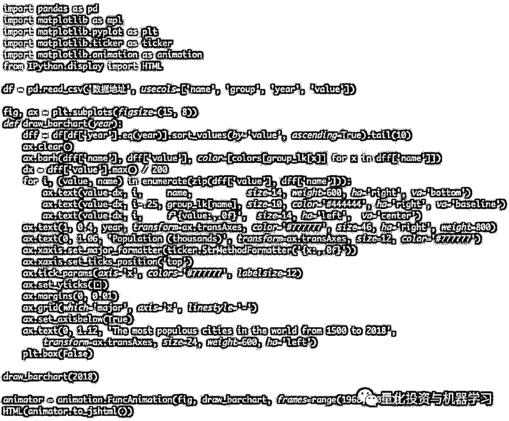
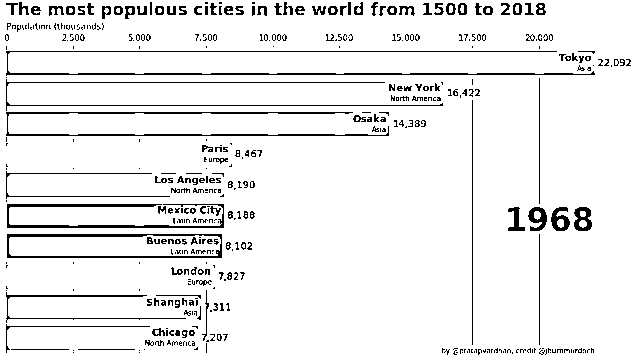
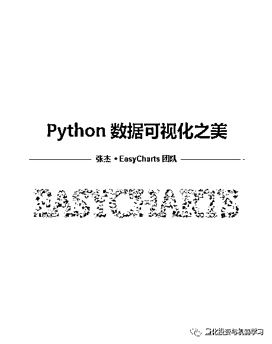
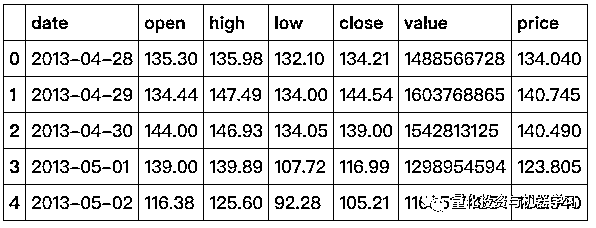
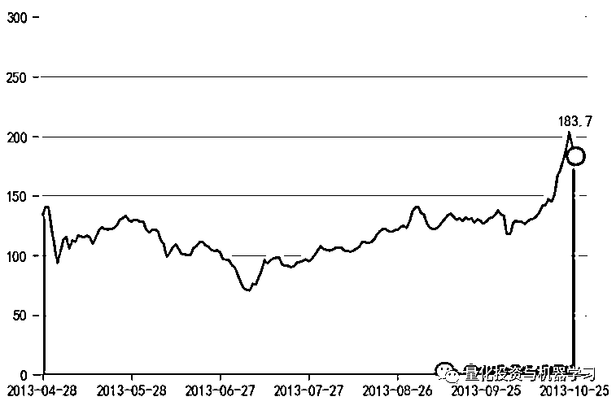
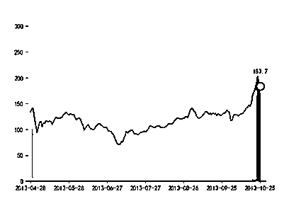
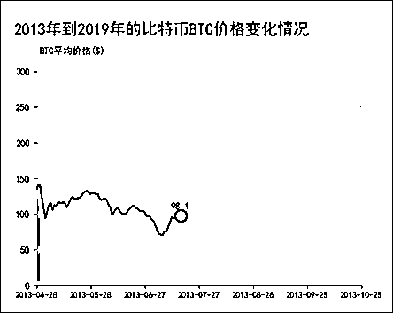
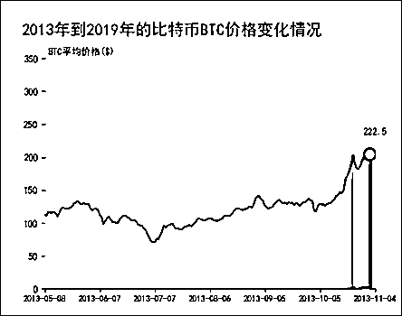
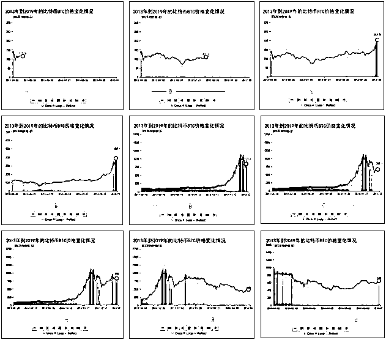

# 超火动态价格面积图：手把手教你！

> 原文：[`mp.weixin.qq.com/s?__biz=MzAxNTc0Mjg0Mg==&mid=2653295675&idx=1&sn=aa1b41b545cf71f7cb55bb1bd6a8ee5e&chksm=802dd62eb75a5f3840785d5589e221374076fb52d6cedb9558c013334a859b2a4c633b12259b&scene=27#wechat_redirect`](http://mp.weixin.qq.com/s?__biz=MzAxNTc0Mjg0Mg==&mid=2653295675&idx=1&sn=aa1b41b545cf71f7cb55bb1bd6a8ee5e&chksm=802dd62eb75a5f3840785d5589e221374076fb52d6cedb9558c013334a859b2a4c633b12259b&scene=27#wechat_redirect)

**标星★公众号     **爱你们♥

**近期热文**

♥ [Two Sigma 用新闻来预测股价走势，带你吊打 Kaggle](https://mp.weixin.qq.com/s?__biz=MzAxNTc0Mjg0Mg==&mid=2653290456&idx=1&sn=b8d2d8febc599742e43ea48e3c249323&chksm=802e3dcdb759b4db9279c689202101b6b154fb118a1c1be12b52e522e1a1d7944858dbd6637e&token=1330520237&lang=zh_CN&scene=21#wechat_redirect)

♥ 2 万字干货：[利用深度学习最新前沿预测股价走势](https://mp.weixin.qq.com/s?__biz=MzAxNTc0Mjg0Mg==&mid=2653290080&idx=1&sn=06c50cefe78a7b24c64c4fdb9739c7f3&chksm=802e3c75b759b563c01495d16a638a56ac7305fc324ee4917fd76c648f670b7f7276826bdaa8&token=770078636&lang=zh_CN&scene=21#wechat_redirect)

♥ [如何鉴别那些用深度学习预测股价的花哨模型？](https://mp.weixin.qq.com/s?__biz=MzAxNTc0Mjg0Mg==&mid=2653290132&idx=1&sn=cbf1e2a4526e6e9305a6110c17063f46&chksm=802e3c81b759b597d3dd94b8008e150c90087567904a29c0c4b58d7be220a9ece2008956d5db&token=1266110554&lang=zh_CN&scene=21#wechat_redirect)

♥ [优化强化学习 Q-learning 算法进行股市](https://mp.weixin.qq.com/s?__biz=MzAxNTc0Mjg0Mg==&mid=2653290286&idx=1&sn=882d39a18018733b93c8c8eac385b515&chksm=802e3d3bb759b42d1fc849f96bf02ae87edf2eab01b0beecd9340112c7fb06b95cb2246d2429&token=1330520237&lang=zh_CN&scene=21#wechat_redirect)

♥ [WorldQuant 101 Alpha、国泰君安 191 Alpha](https://mp.weixin.qq.com/s?__biz=MzAxNTc0Mjg0Mg==&mid=2653290927&idx=1&sn=ecca60811da74967f33a00329a1fe66a&chksm=802dc3bab75a4aac2bb4ccff7010063cc08ef51d0bf3d2f71621cdd6adece11f28133a242a15&token=48775331&lang=zh_CN&scene=21#wechat_redirect)

♥ [基于回声状态网络预测股票价格（附代码）](https://mp.weixin.qq.com/s?__biz=MzAxNTc0Mjg0Mg==&mid=2653291171&idx=1&sn=485a35e564b45046ff5a07c42bba1743&chksm=802dc0b6b75a49a07e5b91c512c8575104f777b39d0e1d71cf11881502209dc399fd6f641fb1&token=48775331&lang=zh_CN&scene=21#wechat_redirect)

♥ [计量经济学应用投资失败的 7 个原因](https://mp.weixin.qq.com/s?__biz=MzAxNTc0Mjg0Mg==&mid=2653292186&idx=1&sn=87501434ae16f29afffec19a6884ee8d&chksm=802dc48fb75a4d99e0172bf484cdbf6aee86e36a95037847fd9f070cbe7144b4617c2d1b0644&token=48775331&lang=zh_CN&scene=21#wechat_redirect)

♥ [配对交易千千万，强化学习最 NB！（文档+代码）](http://mp.weixin.qq.com/s?__biz=MzAxNTc0Mjg0Mg==&mid=2653292915&idx=1&sn=13f4ddebcd209b082697a75544852608&chksm=802dcb66b75a4270ceb19fac90eb2a70dc05f5b6daa295a7d31401aaa8697bbb53f5ff7c05af&scene=21#wechat_redirect)

♥ [关于高盛在 Github 开源背后的真相！](https://mp.weixin.qq.com/s?__biz=MzAxNTc0Mjg0Mg==&mid=2653291594&idx=1&sn=7703403c5c537061994396e7e49e7ce5&chksm=802dc65fb75a4f49019cec951ac25d30ec7783738e9640ec108be95335597361c427258f5d5f&token=48775331&lang=zh_CN&scene=21#wechat_redirect)

♥ [新一代量化带货王诞生！Oh My God！](https://mp.weixin.qq.com/s?__biz=MzAxNTc0Mjg0Mg==&mid=2653291789&idx=1&sn=e31778d1b9372bc7aa6e57b82a69ec6e&chksm=802dc718b75a4e0ea4c022e70ea53f51c48d102ebf7e54993261619c36f24f3f9a5b63437e9e&token=48775331&lang=zh_CN&scene=21#wechat_redirect)

♥ [独家！关于定量/交易求职分享（附真实试题）](https://mp.weixin.qq.com/s?__biz=MzAxNTc0Mjg0Mg==&mid=2653291844&idx=1&sn=3fd8b57d32a0ebd43b17fa68ae954471&chksm=802dc751b75a4e4755fcbb0aa228355cebbbb6d34b292aa25b4f3fbd51013fcf7b17b91ddb71&token=48775331&lang=zh_CN&scene=21#wechat_redirect)

♥ [Quant 们的身份危机！](https://mp.weixin.qq.com/s?__biz=MzAxNTc0Mjg0Mg==&mid=2653291856&idx=1&sn=729b657ede2cb50c96e92193ab16102d&chksm=802dc745b75a4e53c5018cc1385214233ec4657a3479cd7193c95aaf65642f5f45fa0e465694&token=48775331&lang=zh_CN&scene=21#wechat_redirect)

♥ [AQR 最新研究 | 机器能“学习”金融吗？](http://mp.weixin.qq.com/s?__biz=MzAxNTc0Mjg0Mg==&mid=2653292710&idx=1&sn=e5e852de00159a96d5dcc92f349f5b58&chksm=802dcab3b75a43a5492bc98874684081eb5c5666aff32a36a0cdc144d74de0200cc0d997894f&scene=21#wechat_redirect)

**前言**

近日，公众号推出了一篇名为[**《超火动态排序图：****代码不到 40 行，手把手教你！****》**](https://mp.weixin.qq.com/s?__biz=MzAxNTc0Mjg0Mg==&mid=2653294507&idx=1&sn=51db6de93d8ca1d1630c79c4ba053421&scene=21#wechat_redirect)的文章，反向十分强烈。各大公众号进行的了转载，知乎也是有 400+的点赞。





具体来说，这种图可以叫：Bar Chart Race，有什么国家 GDP 的、某某沉浮史等等。

今天**EasyCharts 博主张杰**为我们带来了关于动态价格变化面积图的 NB 操作。下面就让我们赶紧看看吧！**同时也祝张杰的新书大卖！**



本文来源即将出版的新书**《Python 数据可视化之美》**之动态图表的绘制。

**正文**

我们使用 2013 年-2019 年比特币的价格数据绘制面积图动画，其 HTML 交互效果页面如下图所示，包括 2013 年 04 月 28 日起每天的开盘、最高、最低和收盘的价格。

[`mp.weixin.qq.com/mp/readtemplate?t=pages/video_player_tmpl&action=mpvideo&auto=0&vid=wxv_1107344837382242304`](https://mp.weixin.qq.com/mp/readtemplate?t=pages/video_player_tmpl&action=mpvideo&auto=0&vid=wxv_1107344837382242304)

**具体实现代码**

我们先导入数据集'BTC_price_history.csv'，然后将 date 列转换成日期型数据。我们选择一天的最高和最低价的均值作为这一天比特币的价格 Price。其具体代码如下：

```py
df = pd.read_csv('BTC_price_history.csv')
df['date']=[datetime.strptime(d, '%Y/%m/%d').date() for d in df['date']]
df['price']=(df['high']+df['low'])/2
df.head(5)
```



我们设置图表每次展示 Span_Date=180 天的比特币价格数据，所以得到 180 天的数据集 df_temp 后，如果使用 plt.fill_between()函数可以实现红色填充的面积图，如下图所示；如果使用 plt.bar()函数可以实现 Spectral_r 颜色映射的面积图，如图下图 b 所示。代码如下：

```py
def draw_areachart(Num_Date):
    Span_Date=180
    ax.clear()
    if Num_Date<Span_Date:
        df_temp=df.loc[0:Num_Date,:]
        df_span=df.loc[0:Span_Date,:]
        plt.fill_between(df_temp.date.values, y1=df_temp.price.values, y2=0,alpha=0.75, facecolor='r', linewidth=1,edgecolor ='none',zorder=1)
        plt.plot(df_temp.date, df_temp.price, color='k',zorder=2)
        plt.scatter(df_temp.date.values[-1], df_temp.price.values[-1], color='white',s=150,edgecolor ='k',linewidth=2,zorder=3)
        plt.text(df_temp.date.values[-1], df_temp.price.values[-1]*1.18,s=np.round(df_temp.price.values[-1],1),size=10,ha='center', va='top')
        plt.ylim(0, df_span.price.max()*1.68)
        plt.xlim(df_span.date.values[0], df_span.date.values[-1])
        plt.xticks(ticks=df_span.date.values[0:Span_Date+1:30],labels=df_span.date.values[0:Span_Date+1:30],rotation=0,fontsize=9)
    else:
        df_temp=df.loc[Num_Date-Span_Date:Num_Date,:]
        plt.fill_between(df_temp.date.values[:-2], y1=df_temp.price.values[:-2], y2=0,alpha=0.75, facecolor='r', linewidth=1,edgecolor ='none',zorder=1)
        plt.plot(df_temp.date[:-2], df_temp.price[:-2], color='k',zorder=2)
        plt.scatter(df_temp.date.values[-4], df_temp.price.values[-4], color='white',s=150,edgecolor ='k',linewidth=2,zorder=3)
        plt.text(df_temp.date.values[-1], df_temp.price.values[-1]*1.18,s=np.round(df_temp.price.values[-1],1),size=10,ha='center', va='top')
        plt.ylim(0, df_temp.price.max()*1.68)
        plt.xlim(df_temp.date.values[0], df_temp.date.values[-1])
        plt.xticks(ticks=df_temp.date.values[0:Span_Date+1:30],labels=df_temp.date.values[0:Span_Date+1:30],rotation=0,fontsize=9)

    plt.margins(x=0.2)
    ax.spines['top'].set_color('none') # 设置上‘脊梁’为红色
    ax.spines['right'].set_color('none') # 设置上‘脊梁’为无色
    ax.spines['left'].set_color('none') # 设置上‘脊梁’为无色
    plt.grid(axis="y",c=(217/256,217/256,217/256),linewidth=1) #设置网格线
    plt.text(0.01, 0.95,"BTC 平均价格($)",transform=ax.transAxes, size=10, weight='light', ha='left')
    ax.text(-0.07, 1.03, '2013 年到 2019 年的比特币 BTC 价格变化情况',transform=ax.transAxes, size=17, weight='light', ha='left')

fig, ax = plt.subplots(figsize=(6,4), dpi=100)
plt.subplots_adjust(top=1,bottom=0.1,left=0.1,right=0.9,hspace=0,wspace=0)
draw_areachart(180)
```



a



b

我们将上面的静态面积图代码整合成函数。当开始的日期天数据绘制面积图；当开始的日期≥时，就选择截止到当前日期的天数据绘制面积图。使用函数绘制的不同日期的面积图如图所示。



不同日期 Num_Date 的面积图，Num_Date=60



不同日期 Num_Date 的面积图，Num_Date=150

使用 matplotlib 包的 animation.FuncAnimation()函数，调用 draw_areachart(Num_Date)函数，其中输入的参数 Num_Date = np.arange(0,df.shape[0],1)，最后使用 Ipython 包的 HTML()函数将动画转换成 HTML 页面的形式演示，其动画不同日期下的演示效果如图下图所示。

```py
import matplotlib.animation as animation
from IPython.display import HTML
fig, ax = plt.subplots(figsize=(6,4), dpi=100)
plt.subplots_adjust(left=0.12, right=0.98, top=0.85, bottom=0.1,hspace=0,wspace=0)
animator = animation.FuncAnimation(fig, draw_areachart, frames=np.arange(0,df.shape[0],1),interval=100)#
HTML(animator.to_jshtml())
```



面积图动画不同时间下的演示效果

但是由于动画默认的最大体积为 20971520.0 bytes，所以图 11-4-10 只生成了 2013 年 04 月-2014 年 07 月数据绘制的面积图动画。如果需要调整生成的动画最大体积，需要更改参数 animation.embed_limit。

matplotlib 包和 plotnine 包都可以实现动态数据的可视化演示。其中，在 matplotlib 包中：函数 FuncAnimation(fig,func,frames,init_func,interval,blit)是绘制动图的主要函数，其参数如下：

1、fig 表示绘制动图的画布名称(figure)；

2、func 为自定义绘图函数，如 draw_barchart()函数；

3、frames 为动画长度，一次循环包含的帧数，在函数运行时，其值会传递给函数 draw_barchart (year)的形参“year”；

4、init_func 为自定义开始帧，即初始化函数 init，可省略；

5、interval 表示更新频率，计量单位为 ms；

6、blit 表示选择更新所有点，还是仅更新产生变化的点，应选择为 True，但 mac 用户应选择 False，否则无法显示。

另外，也可以使用 animator.save(‘animation.gif’)或者 animator.save(‘animation.mp4)导出 gif 或者 mp4 格式的动画。但是如果要导出 mp4，需要先安装已经安装 ffmpeg 或者 mencoder。

*—End—*

量化投资与机器学习微信公众号，是业内垂直于**Quant**、**MFE**、**Fintech****、AI、ML**等领域的**量化类主流自媒体。**公众号拥有来自**公募、私募、券商、期货、银行、海外**等众多圈内**18W+**关注者。每日发布行业前沿研究成果和最新量化资讯。

你点的每个“在看”，都是对我们最大的鼓励