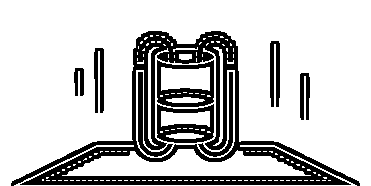
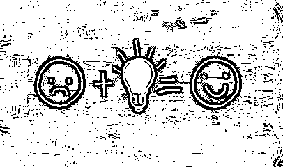
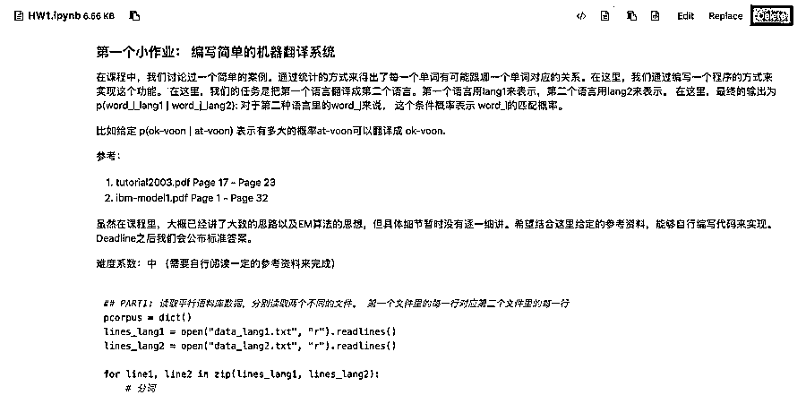

# 面试 AI 算法岗，你被要求复现顶会了嘛？

> 原文：[`mp.weixin.qq.com/s?__biz=MzAxNTc0Mjg0Mg==&mid=2653295662&idx=1&sn=1a5443e6a147fdb061c55d8ad6c04ab3&chksm=802dd63bb75a5f2d48a83752c03aff4940db820b4190ce92efade0aa900069b2659592b0c8d3&scene=27#wechat_redirect`](http://mp.weixin.qq.com/s?__biz=MzAxNTc0Mjg0Mg==&mid=2653295662&idx=1&sn=1a5443e6a147fdb061c55d8ad6c04ab3&chksm=802dd63bb75a5f2d48a83752c03aff4940db820b4190ce92efade0aa900069b2659592b0c8d3&scene=27#wechat_redirect)

**加入 AI 行业拿到高薪仅仅是职业生涯的开始。****现阶段 AI 人才结构在不断升级，这也意味着如果目前仍然停留在调用一些函数库，则在未来 1-2 年内很大概率上会失去核心竞争力的**。几年前如果熟练使用 TensorFlow，同时掌握基本的 AI 算法就可以很容易找到一份高薪的工作，但现在不一样了，AI 岗位的要求越来越高，对知识的深度也提出了更高的要求。如果现在一个**面试官**让你从零推导 SVM 的 Dual、从零实现 CRF、推导 LDA、设计一个 QP 问题、从零编写 XLNet、编写 GCN/GNN、改造 SkipGram 模型、用一天时间复现一篇顶级会议.... 这些要求一点都不过分。相反，连这些基本内容都有些吃力，就需要重新审视一下自己的核心技术壁垒了。 目前 AI 人才竞争越来越激烈，“**调参侠**”**的时代已慢慢过去，这些事情其实根本不需要 AI 工程师来做，未来的研发工程师就可以承担这些了！**我相信不少人曾经遇到过以下的情况或者困惑：

*   从事 AI 行业多年，但技术上**总感觉不够深入****，**而且很难再有提升；

*   对每个技术点了解，但**不具备体系化的认知**，无法把它们串起来； 

*   **停留在使用模型/工具上，**很难基于业务场景来提出新的模型； 

*   对于机器学习**背后的优化理论、前沿的技术不够深入；**

*   计划从事尖端的科研、研究工作、**申请 AI 领域研究生、博士生；**

*   **打算进入最顶尖的 AI 公司**比如 Google，Facebook，Amazon， 阿里，头条等；

为了迎合时代的需求，贪心学院（国内唯一体系化 AI 学院）目前推出了两门高端的 AI 训练营，分别是**《机器学习高阶训练营》**和**《自然语言处理高阶训练营》**。**需要一定的 AI 基础，是为进阶人士量身定做的一套 AI 进阶课程，**采用**全程直播授课模式，近距离接触顶级讲师。  **根据以往的经验，很大部分学员都是国内外顶尖公司的 AI 从业者、还有一部分是大学里从事 AI 的研究生、博士生，**这里不乏来自斯坦福、UCSD、USC、哥大、HKUST、爱丁堡等世界名府的学生；**在这里，你不仅可以享受到通往顶尖人才的快乐、也可以结识志同道合的 AI 从业者以及未来的科学家。 那这样的训练营到底是怎么样的呢？ 下面以**《机器学习高阶训练营》**为例。 《自然语言处理高阶训练营》的内容可以添加我们专业的 AI 职业规划师来咨询，我们的咨询师也是顶级 AI 公司出来的哦~ **01 课程大纲********第一阶段 机器学习基础与凸优化**本阶段主要目的是讲解必要的算法理论以及凸优化技术，为后续的课程打下基础。凸优化的重要性不言而喻，如果想具备改造模型的能力，对于凸优化的理解是必不可少的！ **【核心知识点】**- KNN，Weighted KNN、近似 KNN- KD 树，近似 KD 树、哈希算法、LSH- 岭回归、LASSO、ElasticNet- 正则：L1, L2, L-inifity Norm- LR、GD、SGD、小批量 SGD- 凸集，凸函数、判定凸函数- LP、QP、ILP、SDP 问题- Duality，Strong Duality、KKT 条件- 带条件/无条件优化问题、Projected GD- 平滑函数、Convergence Analysis**【部分案例讲解】**- 基于 QP 的股票投资组合策略设计- 基于 LP 的短文本相似度计算- 基于 KNN 的图像识别

**第二阶段 SVM 与集成模型**本阶段主要目的是深入理解 SVM 以及核函数部分的知识点。为了理解清楚 SVM 的 Dual 转换，需要掌握第一部分里的 Duality 理论。另外，重点介绍 Bagging 和 Boosting 模型，以及所涉及到的几项有趣的理论。**【核心知识点】**- Max-Margin 与线性 SVM 构建- Slack Variable 以及条件的松弛- SVM 的 Dual、Kernelized SVM- Kernel Functions, Mercer'定理- Kernelized LR/KNN/K-Means/PCA- Bagging, Boosting, Stacking- 信息论与决策树- 随机森林，完全随机森林- 基于残差的提升树训练思想- GBDT 与 XGBoost- 集成不同类型的模型- VC 理论， PAC Learning**【部分案例讲解】**- 基于 XGBoost 的金融风控模型- 基于 PCA 和 Kernel SVM 的人脸识别. - 基于 Kernal PCA 和 Linear SVM 的人脸识别

**第三阶段 无监督学习与序列模型**本阶段主要目的是学习无监督算法和经典的序列模型。重点讲解 EM 算法以及 GMM，K-means 的关系，同时花几次课程时间来仔细讲解 CRF 的细节：从无向图模型、Potential 函数、Log-Linear Model、逻辑回归、HMM、MEMM、Label Bias、Linear CRF、Inference，最后到 Non-Linear CRF。**【核心知识点】**- K-means、GMM 以及 EM- 层次聚类，DCSCAN，Spectral 聚类算法- 隐变量与隐变量模型、Partition 函数- 条件独立、D-Separation、Markov 性质- HMM 以及基于 Viterbi 的 Decoding- Forward/Backward 算法- 基于 EM 算法的参数估计- 有向图与无向图模型区别- Log-Linear Model，逻辑回归，特征函数- MEMM 与 Label Bias 问题- Linear CRF 以及参数估计**【部分案例讲解】**- 基于 HMM 和 GMM 的语音识别- 基于聚类分析的用户群体分析- 基于 CRF 的命名实体识别

**第四阶段 深度学习**本阶段主要讲解深度学习理论以及常见的模型。这里包括 BP 算法、卷积神经网络、RNN/LSTM、BERT、XLNet、ALBERT 以及各类深度学习图模型。另外，也会涉及到深度相关的优化以及调参技术。 **【核心知识点】**- 神经网络与激活函数- BP 算法、卷积层、Pooling 层、全连接层- 卷积神经网络、常用的 CNN 结构- Dropout 与 Batch Normalization- SGD、Adam、Adagrad 算法- RNN 与梯度消失、LSTM 与 GRU- Seq2Seq 模型与注意力机制- Word2Vec, Elmo, Bert, XLNet- 深度学习中的调参技术- 深度学习与图嵌入（Graph Embedding）- Translating Embedding (TransE)- Node2Vec- Graph Convolutional Network- Graph Neural Network- Dynamic Graph Embedding**【部分案例讲解】**- 基于 Seq2Seq 和注意力机制的机器翻译- 基于 TransE 和 GCN 的知识图谱推理- 基于 CNN 的人脸关键点检测

**第五阶段 推荐系统与在线学习**推荐系统一直是机器学习领域的核心，所以在本阶段重点来学习推荐系统领域主流的算法以及在线学习的技术、包括如何使用增强学习来做推荐系统。 在线学习算法很深具有很漂亮的理论基础，在本阶段你都会一一体会到！**【核心知识点】**- 基于内容和协同过滤的推荐算法- 矩阵分解，带条件的矩阵分解- 基于内容的 Gradient Tree- 基于深度学习的推荐算法- 冷启动问题的处理- Exploration vs Exploitation- Multi-armed Bandit- UCB1 algorithm，EXP3 algorithm- Adversarial Bandit model- Contexulalized Bandit、LinUCB**【部分案例讲解】**- 使用 GB Tree 做基于 interaction 与 content 的广告推荐- 使用深度神经网络做基于 interaction 与 content 的推荐- LinUCB 做新闻推荐, 最大化 rewards

**第六阶段 贝叶斯模型**本阶段重点讲解贝叶斯模型。贝叶斯派区别于频率派，主要的任务是估计后验概率的方式来做预测。我们重点讲解主题模型以及不同的算法包括吉布采样、变分法、SGLD 等，以及如何把贝叶斯的框架结合在深度学习模型里使用，这就会衍生出 Bayesian LSTM 的模型。贝叶斯部分的学习需要一定的门槛，但我们会让每个人听懂所有细节！ **【核心知识点】**- 主题模型（LDA) 以及生成过程- Dirichlet/Multinomial Distribution- 蒙特卡洛与 MCMC- Metropolis Hasting 与 Gibbs Sampling- 使用 Collapsed Gibbs Sampler 求解 LDA- Mean-field variational Inference- 使用 VI 求解 LDA- Stochastic Optimization 与贝叶斯估计- 利用 SLGD 和 SVI 求解 LDA- 基于分布式计算的贝叶斯模型求解- 随机过程与无参模型（non-parametric)- Chinese Retarant Process- Stick Breaking Process- Stochastic Block Model 与 MMSB- 基于 SGLD 与 SVI 的 MMSB 求解- Bayesian Deep Learning 模型- Deep Generative Model**【部分案例讲解】**- 基于 Bayesian LSTM 的文本分析- 使用无参主题模型做文本分类- 基于贝叶斯模型实现小数量的图像识别

**第七阶段 增强学习与其他前沿主题**本阶段重点讲解增强学习以及前沿的内容，包括增强学习在文本领域的应用，GAN, VAE，图片和文本的 Disentangling，深度学习领域可解释性问题、Adversial Learning, Fair Learning 等最前沿的主题。 这一阶段的安排也会根据学员的兴趣点做局部的调整。**【核心知识点】**- Policy Learning、Deep RL- Variational Autoencoder(VAE)与求解- 隐变量的 Disentangling- 图像的生成以及 Disentangling- 文本的生成以及 Disentangling- Generative Adversial Network(GAN)- CycleGan- 深度学习的可解释性- Deconvolution 与图像特征的解释- Layer-wise Propagation- Adversial Machine Learning- Purturbation Analysis- Fair Learning**【部分案例讲解】**- 基于 GAN 的图像生成- 基于 VAE 的文本 Style Transfer- 可视化机器翻译系统**为 AI 从业者/研究生/研究员专门定制****全网唯一《机器学习高阶训练营》**

**对课程有意向的同学**

**添加课程顾问小姐姐微信**

**报名、课程咨询**

**👇👇👇**

**02 部分项目作业**课程设计**紧密围绕学术界最新进展以及工业界的需求，**涵盖了所有核心知识点，并且结合了**大量实战项目，**培养学员的动手能力，解决问题能力。

**项目 1：人脸识别**基于 Kernel PCA 的思路, 实现 Kernel LDA(Linear Discriminant Analysis). 使用 Kernel LDA 进行人脸识别。

**项目 2：语音识别**基于 HMM 和 GMM 从零搭建一个语音识别系统，这个语音识别系统可用于 IOT 的场景中来识别各类命令。在项目中也需要使用常见的语音的特征如 MFCC。

**项目 3：实时视频人脸美化** 在基于 CNN 人脸关键点检测的基础上, 实现一个人脸美化的算法, 给一副照片中的人脸加上墨镜。

**项目 4： 机器翻译** 从零搭建一个中英机器翻译系统。项目中需要使用 LSTM 以及注意力机制，并结合 Bert 等词向量技术。

**项目 5： 推荐系统** 使用 Gradient Boost Machine 预测用户点击广告的概率 CTR, 用于广告推荐系统。

**项目 6：情感分析** 基于 LDA 模型做改造并应用在情感分析。在此项目中需要完成：1\. 改造原始的 LDA 模型。2\. 对于改造后的模型做求解 3\. 实现模型并识别文本中的情感。

**项目 7：基于深度神经网络的强化学习系统“**打乒乓球**”**使用 Policy Gradient 的思路, 实现基于深度神经网络的强化学习系统, 让系统能够在乒乓球游戏中战胜机器。

**项目 8：文本风格迁移** 基于 VAE 搭建一个文本风格迁移模型。对于给定的一句话，按照一定的风格去改造文本。**03 直播授课，现场推导演示****区别于劣质的 PPT 讲解，导师全程现场推导，**让你在学习中有清晰的思路，深刻的理解算法模型背后推导的每个细节。更重要的是可以清晰地看到各种模型之间的关系！帮助你打通六脉！▲源自：CRF 与 Log-Linear 模型讲解▲源自：CRF 与 Log-Linear 模型讲解▲源自：Convex Optimization 讲解▲源自：Convergence Analysis 讲解不管你在学习过程中遇到多少阻碍，你都可以通过以下**4 种方式解决：**1、直接在线问导师；2、记录到共享文档中，每日固定时间的直播答疑；3、学习社群中全职助教，随时提问答疑 4、共同的问题在 Review Session 里面做讲解注：每次答疑，班主任都会进行记录，以便学员实时查阅。**04 课程适合谁？**

*   **对机器学习算法有基础了解，具备一定的编程能力；**

*   **对数据结构与算法比较熟悉；**

*   **想申请国外名校 AI 相关专业的硕士/博士；**

*   **已从事 AI 领域的相关工作，想要升职加薪；**

*   ****打算进入最顶尖的 AI 公司**比如 Google，Facebook，Amazon， 阿里，头条等；**

**05 每周课程安排**采用直播的授课方式，**一周 4-5 次的直播教学， 包括 2 次的 main lectures, 1-2 次的 discussion session** (讲解某一个实战、必备基础、案例或者技术上的延伸）， **1 次的 paper reading session** (每周会 assign 一篇必备论文，并且直播解读)。教学模式上也参考了美国顶级院校的教学体系。以下为其中一周的课程安排，供参考。 **06 你的必备挑战****1.编写一些技术类文章**通过在知乎上发表相关技术文章进行自我成果检验，同时也是一种思想碰撞的方式，导师会对发表的每一篇文章写一个详细的评语。万一不小心成为一个大 V 了呢？虽然写文章的过程万分痛苦，学习群里半夜哀嚎遍野，但看一看抓着头发写出来的文章结果还是非常喜人的！看着自己收获的点赞数，大家都默默地感谢起导师们的无情！这种满满的成就感，让大家一篇接一篇写了下去！个个都立刻变身成了知乎大牛~**2.Project 项目****除了文章，算法工程师的立命根本--项目代码，**导师更是不会放过的。每次在 Gitlab 上布置的作业，导师们都会带领助教团队会予以详细的批改和反馈。并逼着你不断的优化！**07 训练营****导师****2 位硅谷 AI 博士，学术、工业界大牛**在被大魔头们折磨了多个日日夜夜后，大家不但没有放弃学习，而且很快乐地学习着。来听听大家的心声吧：

[`v.qq.com/iframe/preview.html?width=500&height=375&auto=0&vid=x09179wzdl3`](https://v.qq.com/iframe/preview.html?width=500&height=375&auto=0&vid=x09179wzdl3)

由于内容的专业性以及深度，在过去我们的训练营吸引了大量全球顶级名府的学员，**这里不乏来自 CMU, Columbia, USC, UCSD 等美国顶级名校和清北上交等国内名校学员，还有知名企业的一线工程师。**我们的魔鬼训练营体系已经在众多课程中得到了认可，帮助数百名学员达到技能提升并成功拿到高薪 offer。**08 报名须知**1、本课程为**收费教学。**2、本期仅招收**50**个名额。3、品质保障！正式**开课后 7 天内****，无条件全额退款。**4、学习本课程需要具备一定的 AI 基础。●●●**为 AI 从业者/研究生/研究员专门定制****全网唯一《机器学习高阶训练营》**

**对课程有意向的同学**

**添加课程顾问小姐姐微信**

**报名、课程咨询**

**👇👇👇**

