# 使用 Python『秒开』100GB+数据！

> 原文：[`mp.weixin.qq.com/s?__biz=MzAxNTc0Mjg0Mg==&mid=2653295650&idx=1&sn=f5f6d4ff4c7af64b1fe668050cf06c98&chksm=802dd637b75a5f21004a5c21e7eb1a01130e42ddf3e07bad1cd140fd1a88abfd5fcb9c710a60&scene=27#wechat_redirect`](http://mp.weixin.qq.com/s?__biz=MzAxNTc0Mjg0Mg==&mid=2653295650&idx=1&sn=f5f6d4ff4c7af64b1fe668050cf06c98&chksm=802dd637b75a5f21004a5c21e7eb1a01130e42ddf3e07bad1cd140fd1a88abfd5fcb9c710a60&scene=27#wechat_redirect)


**标星★****置顶****公众号     **爱你们♥   

作者：Jovan Veljanoski、编辑部

编辑：1+1=6

**近期原创文章：**

## ♥ [5 种机器学习算法在预测股价的应用（代码+数据）](https://mp.weixin.qq.com/s?__biz=MzAxNTc0Mjg0Mg==&mid=2653290588&idx=1&sn=1d0409ad212ea8627e5d5cedf61953ac&chksm=802dc249b75a4b5fa245433320a4cc9da1a2cceb22df6fb1a28e5b94ff038319ae4e7ec6941f&token=1298662931&lang=zh_CN&scene=21#wechat_redirect)

## ♥ [Two Sigma 用新闻来预测股价走势，带你吊打 Kaggle](https://mp.weixin.qq.com/s?__biz=MzAxNTc0Mjg0Mg==&mid=2653290456&idx=1&sn=b8d2d8febc599742e43ea48e3c249323&chksm=802e3dcdb759b4db9279c689202101b6b154fb118a1c1be12b52e522e1a1d7944858dbd6637e&token=1330520237&lang=zh_CN&scene=21#wechat_redirect)

## ♥ 2 万字干货：[利用深度学习最新前沿预测股价走势](https://mp.weixin.qq.com/s?__biz=MzAxNTc0Mjg0Mg==&mid=2653290080&idx=1&sn=06c50cefe78a7b24c64c4fdb9739c7f3&chksm=802e3c75b759b563c01495d16a638a56ac7305fc324ee4917fd76c648f670b7f7276826bdaa8&token=770078636&lang=zh_CN&scene=21#wechat_redirect)

## ♥ [机器学习在量化金融领域的误用！](http://mp.weixin.qq.com/s?__biz=MzAxNTc0Mjg0Mg==&mid=2653292984&idx=1&sn=3e7efe9fe9452c4a5492d2175b4159ef&chksm=802dcbadb75a42bbdce895c49070c3f552dc8c983afce5eeac5d7c25974b7753e670a0162c89&scene=21#wechat_redirect)

## ♥ [基于 RNN 和 LSTM 的股市预测方法](https://mp.weixin.qq.com/s?__biz=MzAxNTc0Mjg0Mg==&mid=2653290481&idx=1&sn=f7360ea8554cc4f86fcc71315176b093&chksm=802e3de4b759b4f2235a0aeabb6e76b3e101ff09b9a2aa6fa67e6e824fc4274f68f4ae51af95&token=1865137106&lang=zh_CN&scene=21#wechat_redirect)

## ♥ [如何鉴别那些用深度学习预测股价的花哨模型？](https://mp.weixin.qq.com/s?__biz=MzAxNTc0Mjg0Mg==&mid=2653290132&idx=1&sn=cbf1e2a4526e6e9305a6110c17063f46&chksm=802e3c81b759b597d3dd94b8008e150c90087567904a29c0c4b58d7be220a9ece2008956d5db&token=1266110554&lang=zh_CN&scene=21#wechat_redirect)

## ♥ [优化强化学习 Q-learning 算法进行股市](https://mp.weixin.qq.com/s?__biz=MzAxNTc0Mjg0Mg==&mid=2653290286&idx=1&sn=882d39a18018733b93c8c8eac385b515&chksm=802e3d3bb759b42d1fc849f96bf02ae87edf2eab01b0beecd9340112c7fb06b95cb2246d2429&token=1330520237&lang=zh_CN&scene=21#wechat_redirect)

## ♥ [WorldQuant 101 Alpha、国泰君安 191 Alpha](https://mp.weixin.qq.com/s?__biz=MzAxNTc0Mjg0Mg==&mid=2653290927&idx=1&sn=ecca60811da74967f33a00329a1fe66a&chksm=802dc3bab75a4aac2bb4ccff7010063cc08ef51d0bf3d2f71621cdd6adece11f28133a242a15&token=48775331&lang=zh_CN&scene=21#wechat_redirect)

## ♥ [基于回声状态网络预测股票价格（附代码）](https://mp.weixin.qq.com/s?__biz=MzAxNTc0Mjg0Mg==&mid=2653291171&idx=1&sn=485a35e564b45046ff5a07c42bba1743&chksm=802dc0b6b75a49a07e5b91c512c8575104f777b39d0e1d71cf11881502209dc399fd6f641fb1&token=48775331&lang=zh_CN&scene=21#wechat_redirect)

## ♥ [计量经济学应用投资失败的 7 个原因](https://mp.weixin.qq.com/s?__biz=MzAxNTc0Mjg0Mg==&mid=2653292186&idx=1&sn=87501434ae16f29afffec19a6884ee8d&chksm=802dc48fb75a4d99e0172bf484cdbf6aee86e36a95037847fd9f070cbe7144b4617c2d1b0644&token=48775331&lang=zh_CN&scene=21#wechat_redirect)

## ♥ [配对交易千千万，强化学习最 NB！（文档+代码）](http://mp.weixin.qq.com/s?__biz=MzAxNTc0Mjg0Mg==&mid=2653292915&idx=1&sn=13f4ddebcd209b082697a75544852608&chksm=802dcb66b75a4270ceb19fac90eb2a70dc05f5b6daa295a7d31401aaa8697bbb53f5ff7c05af&scene=21#wechat_redirect)

## ♥ [关于高盛在 Github 开源背后的真相！](https://mp.weixin.qq.com/s?__biz=MzAxNTc0Mjg0Mg==&mid=2653291594&idx=1&sn=7703403c5c537061994396e7e49e7ce5&chksm=802dc65fb75a4f49019cec951ac25d30ec7783738e9640ec108be95335597361c427258f5d5f&token=48775331&lang=zh_CN&scene=21#wechat_redirect)

## ♥ [新一代量化带货王诞生！Oh My God！](https://mp.weixin.qq.com/s?__biz=MzAxNTc0Mjg0Mg==&mid=2653291789&idx=1&sn=e31778d1b9372bc7aa6e57b82a69ec6e&chksm=802dc718b75a4e0ea4c022e70ea53f51c48d102ebf7e54993261619c36f24f3f9a5b63437e9e&token=48775331&lang=zh_CN&scene=21#wechat_redirect)

## ♥ [独家！关于定量/交易求职分享（附真实试题）](https://mp.weixin.qq.com/s?__biz=MzAxNTc0Mjg0Mg==&mid=2653291844&idx=1&sn=3fd8b57d32a0ebd43b17fa68ae954471&chksm=802dc751b75a4e4755fcbb0aa228355cebbbb6d34b292aa25b4f3fbd51013fcf7b17b91ddb71&token=48775331&lang=zh_CN&scene=21#wechat_redirect)

## ♥ [Quant 们的身份危机！](https://mp.weixin.qq.com/s?__biz=MzAxNTc0Mjg0Mg==&mid=2653291856&idx=1&sn=729b657ede2cb50c96e92193ab16102d&chksm=802dc745b75a4e53c5018cc1385214233ec4657a3479cd7193c95aaf65642f5f45fa0e465694&token=48775331&lang=zh_CN&scene=21#wechat_redirect)

## ♥ [AQR 最新研究 | 机器能“学习”金融吗](http://mp.weixin.qq.com/s?__biz=MzAxNTc0Mjg0Mg==&mid=2653292710&idx=1&sn=e5e852de00159a96d5dcc92f349f5b58&chksm=802dcab3b75a43a5492bc98874684081eb5c5666aff32a36a0cdc144d74de0200cc0d997894f&scene=21#wechat_redirect)

**前言**

如果你 50GB 甚至 500GB 的数据集，打开他们都很困难了，更别说分析了。

在处理这样的数据集时，我们通常采用 3 种方法。

第一种对数据进抽样：这里的缺点是显而易见的，样本数据能否代表整个数据。

第二种使用分布式计算：虽然在某些情况下这是一种有效的方法，但是它带来了管理和维护集群的巨大开销。想象一下，必须为一个刚好超出 RAM 范围的数据集设置一个集群，比如在 30-50GB 范围内。这有点过分了。

第三种租用一个强大的云服务：例如，AWS 提供了具有 TB 内存的实例。在这种情况下，你仍然需要管理云数据，每次启动时都要等待一个个的数据传输。处理将数据放到云上所带来的遵从性问题，以及处理在远程机器上工作所带来的所有不便。更不用说成本了，尽管开始时成本很低，但随着时间的推移，成本往往会越来越高。

在本文中，我们将向你展示一种新的方法：**一种更快、更安全、总体上更方便的方法，可以使用几乎任意大小的数据进行数据研究分析**，只要它能够适用于笔记本电脑、台式机或服务器的硬盘驱动器。

**Vaex**


Vaex 是一个开源的 DataFrame 库，它可以对表格数据集进行可视化、探索、分析，甚至机器学习，这些数据集和你的硬盘驱动器一样大。**它可以在一个 n 维网格上每秒计算超过 10 亿（10⁹）个对象的平均值、和、计数、标准差等统计信息**。可视化使用直方图、使用直方图、密度图和 3D 立体渲染进行可视化。为此，**Vaex 采用了内存映射、高效的外核算法和延迟计算等概念来获得最佳性能（不浪费内存）**。所有这些都封装在一个类似 Pandas 的 API 中。

**GitHub：*****https://github.com/vaexio/vaex***

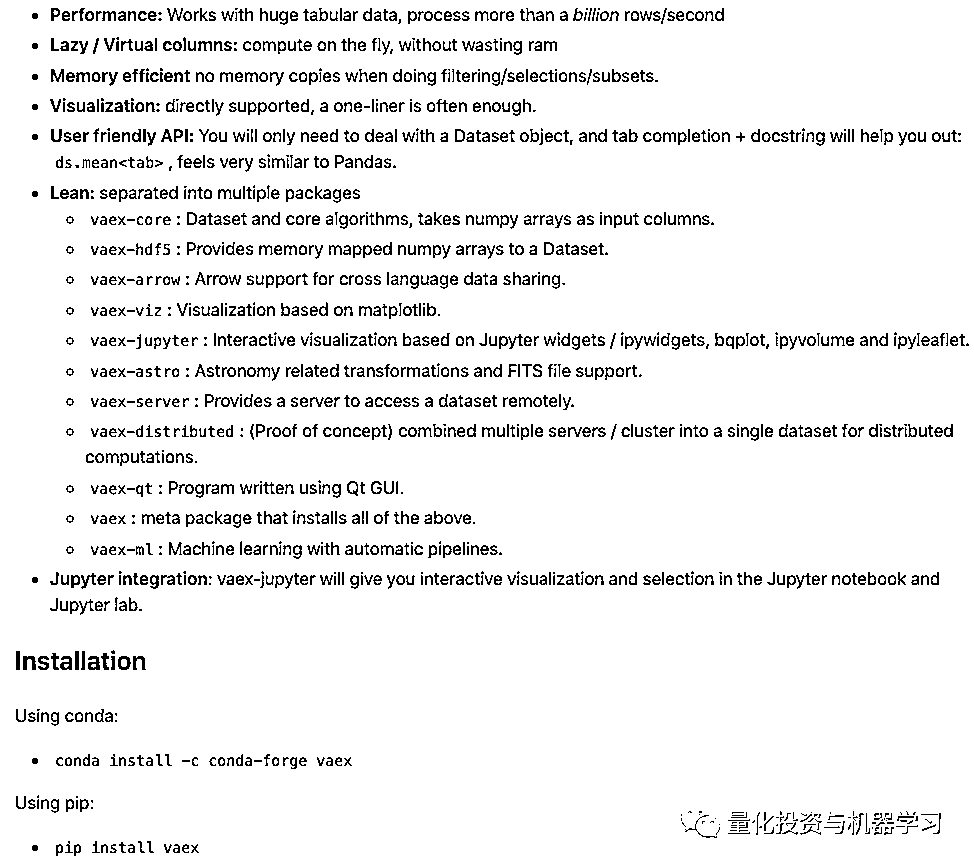

为了说明 Vaex 的性能，我们为大家举个例子。

**数据准备**

我们使用纽约市出租车的数据集，该数据集包含了出租车在 2009 年至 2015 年间超过 10 亿次出租车出行的信息。数据可从下面的网站下载，并以 CSV 格式提供：

*https://www1.nyc.gov/site/tlc/about/tlc-trip-record-data.page*

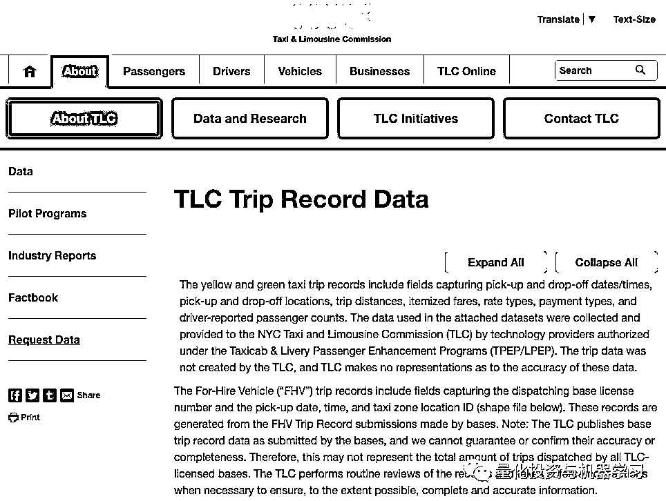

**数据清洗**

第一步将数据转换为内存映射文件格式，如 Apache Arrow、Apache Parque 或 HDF5。一旦数据成为内存映射格式，使用 Vaex 打开它是瞬间的（数据的磁盘大小超过 100GB）。有多块？

**0.052 秒！**

将 CSV 数据转换为 HDF5 的代码如下：

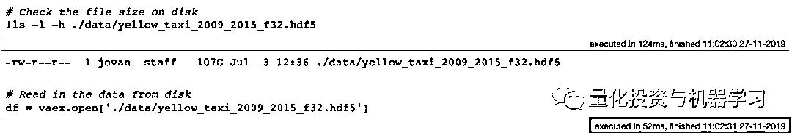

**为什么这么快？**

当你使用 Vaex 打开内存映射文件时，**实际上没有数据读取。Vaex 只读取文件元数据，比如磁盘上数据的位置、数据结构（行数、列数、列名和类型）、文件描述等等**。那么，如果我们想要检查或与数据交互呢？打开一个数据集会得到一个标准的 DataFrame：

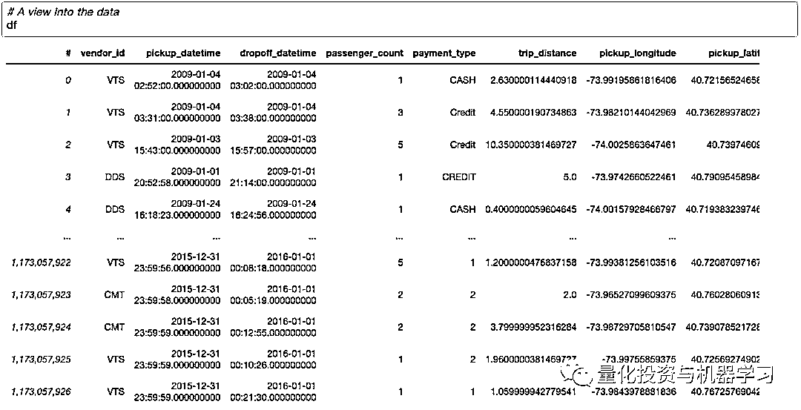

再次注意，单元执行时间非常短。这是因为显示 Vaex DataFrame 或列只需要从磁盘读取前 5 行和后 5 行。这就引出了另一个重要的问题：**V****aex 只会在必要时遍历整个数据集，而且它会尽可能少地遍历数据。**

现在开始清理数据集。一个好的开始方法是使用 describe 方法获得数据的概览：

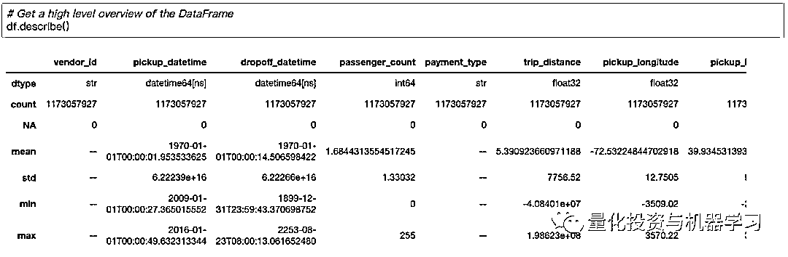

describe 方法很好地说明了 Vaex 的性能和效率：所有这些统计数据都是在 MacBook Pro（15 英寸，2018 年，2.6GHz Intel Core i7，32GB RAM）上用**不到 3 分钟**计算出来的。其他库或方法需要分布式计算或超过 100GB 的云才能预先相同的计算。**有了 Vaex，你所需要的只是数据，以及只有几 GB 内存的笔记本电脑。**

查看 description 的输出，很容易注意到数据包含一些严重的异常值。由于我们使用的是如此庞大的数据集，直方图是最有效的可视化方法。用 Vaex 创建和显示柱状图和热图是如此的快，这样的图可又是交互式的！

```py
df.plot_widget(df.pickup_longitude,
               df.pickup_latitude,
               shape=512,
               limits='minmax',
               f='log1p',
               colormap='plasma')
```

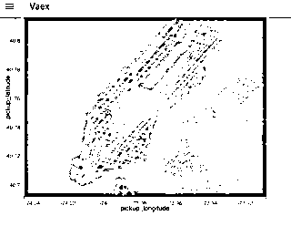

一旦我们决定了想要关注纽约的哪个区域，我们就可以简单地创建一个过滤后的 DataFrame：

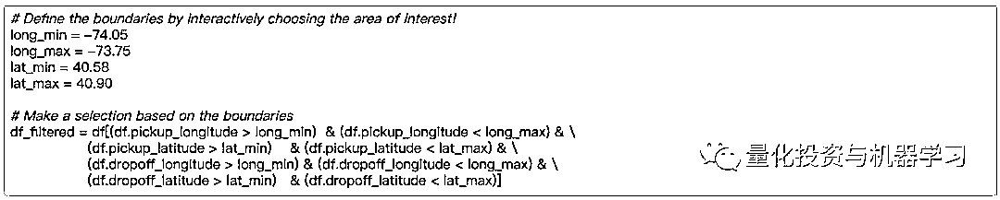

上面的代码块的优点在于：**它所需要的内存可以忽略不计**！在过滤 Vaex DataFrame 时，不会生成数据副本。相反，只创建对原始对象的引用，并在其上应用二进制掩码。掩码选择显示哪些行并用于将来的计算。这为我们节省了 100GB 的 RAM，如果要复制数据，就需要这样做，就像现在许多标准的数据分析所做的那样。

现在，让我们检查一下 passenger_count 列。单次乘坐出租车的最高记录是 255 人，这似乎有点极端。让我们数一数每一名乘客的出行次数。使用 value_counts 方法很容易做到这一点：

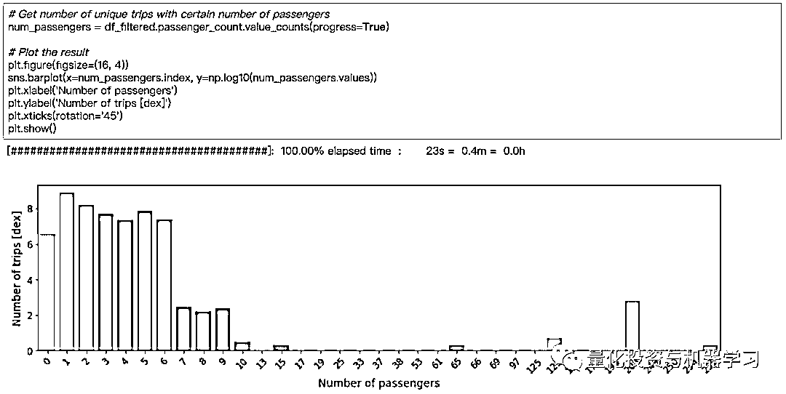

应用 10 亿行的“value_counts”方法只需要 20 秒！

从上图中我们可以看出，乘客超过 6 人的出行很可能是罕见的异常值，或者是数据输入错误。也有大量的出现，没有（0 名）乘客。既然现在我们还不知道这些旅行是否合法，那就让我们把它们过滤掉吧。


让我们做一个关于类似出行距离的操作。由于这是一个连续的变量，我们可以画出出行距离的分布。看看最小和最大的距离，让我们用一个更合理的范围来绘制直方图。

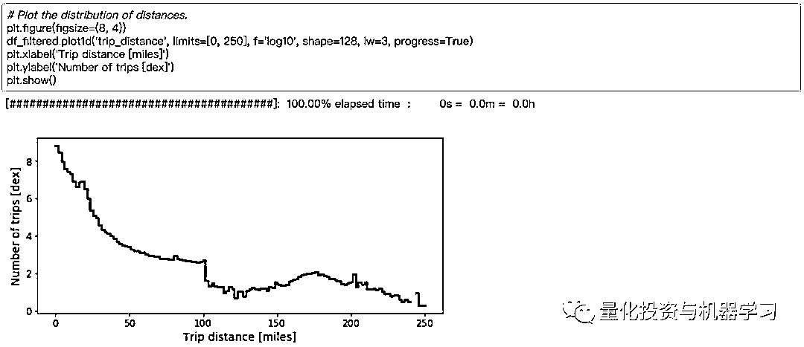

从上图中我们可以看到，出行次数随着距离的增加而减少。在大约 100 英里的距离上，分布有很大的下降。现在，我们用这个作为分界点，来消除基于行程距离的极端异常值：


出行距离列中存在的极端离群值是调查出租车出行时间和平均速度的原因。这些特征在数据集中是不容易获得的，但是计算起来很简单：

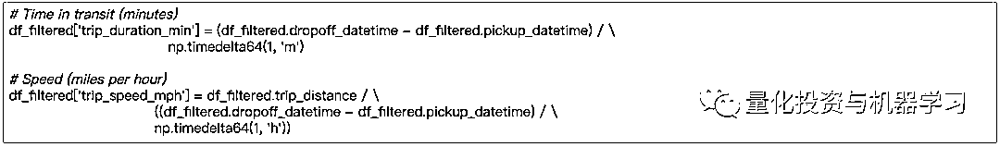

**上面的代码块需要零内存，不需要执行时间！****这是因为代码会创建虚拟列。****这些列只包含数学表达式，仅在需要时才计算它们。**否则，虚列的行为与任何其他常规列一样。注意，其他标准库需要 10s 的 GB 内存来完成相同的操作。

让我们画出行程时间的分布图：

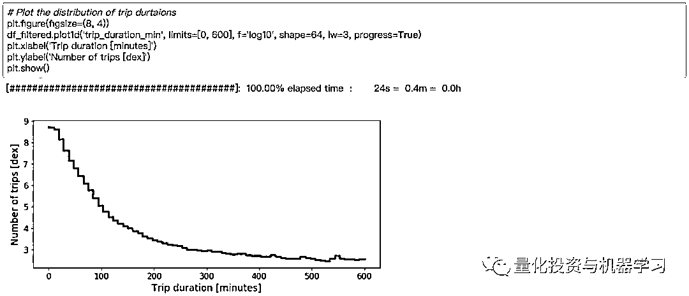

从上图我们可以看到，95% 的出租车行程花费不到 30 分钟到达目的地，尽管有些行程花费了 4-5 个小时。你能想象在纽约被困在出租车里超过 3 个小时的情景吗？考虑所有总共不超过 3 小时的行程：


现在让我们看一下出租车的平均速度，同时为数据限制选择一个合理的范围：

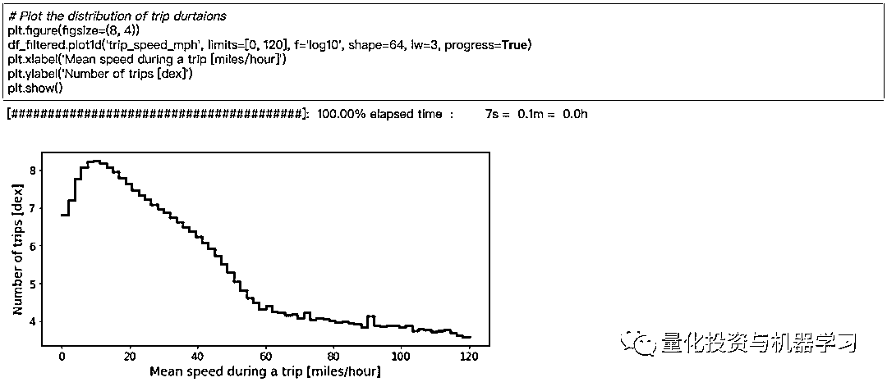

根据分布趋平的地方，我们可以推断出合理的出租车平均速度在每小时 1 到 60 英里之间，因此我们可以更新过滤后的 dataframe：


让我们把焦点转移到出租车的费用上。从 describe 方法的输出中，我们可以看到在 fare_amount、total_amount 和 tip_amount 列中存在一些异常值。对于初学者来说，这些列中的任何值都不应该是负值。让我们看看这些数据的分布在一个相对合理的范围内：

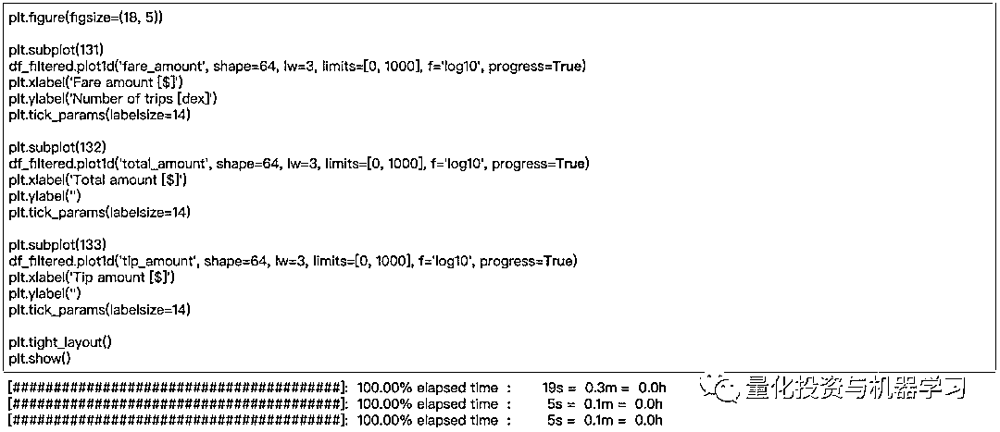

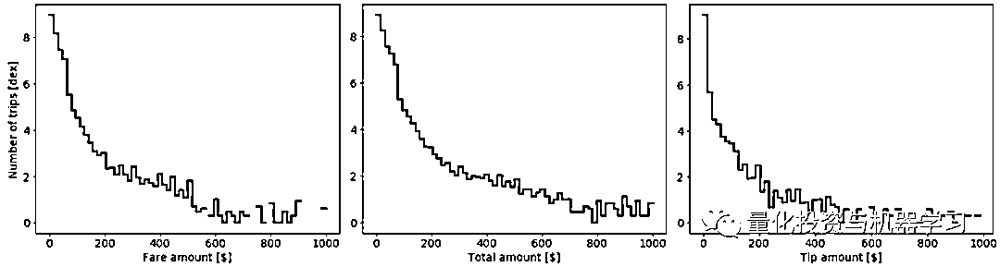

我们看到上面的三个分布都有相当长的尾部。尾部的一些值可能是正确的，而其他值可能是错误的数据输入。无论如何，让我们现在保守一点，只考虑票价为 fare_amount、total_amount 和 tip_amount 低于 200 美元的乘客。我们还要求 fare_amount、total_amount 的值大于 0。


最后，在所有初始数据清理之后，让我们看看还剩下多少出租车次数供我们分析：

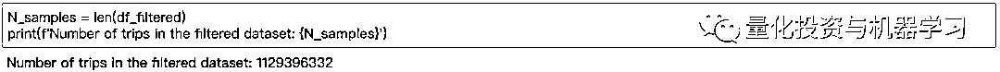

超过 11 亿次的出行！ 

**具体分析**

假设我们使用这个数据集来学习**如何最大化利润，最小化成本**。

让我们从找出从平均值而言，能带来较好收入的载客地点开始。我们只需绘制一张热点地区接送地点的热图，对平均票价进行颜色编码，然后查看热点地区。然而，出租车司机也有自己的成本。例如，燃料费用。因此，把乘客带到很远的地方可能会导致更高的票价，但这也意味着更大的燃料消耗和时间损失。此外，从偏远的地方载一个乘客去市中心可能不那么容易，因此在没有乘客的情况下开车回去可能会很贵。一种解释的方法是，用票价金额与出行距离之比的平均值来表示热图的颜色。让我们考虑一下这两种方法：

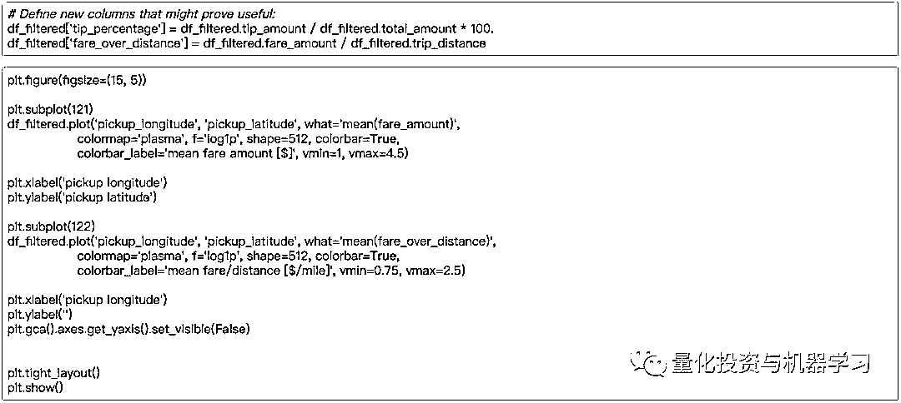

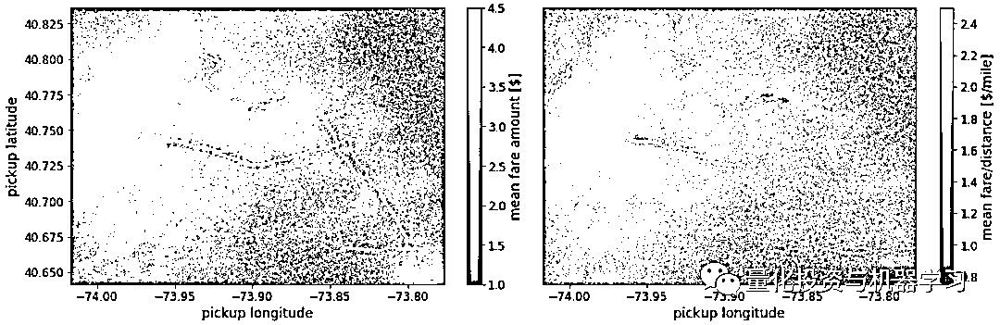

出租车司机是一份相当灵活的工作。除了知道应该去哪里，如果让他们知道什么时候开车最赚钱也是很有用的。为了回答这个问题，让我们制作一个图表，显示每天和每小时的平均票价与行程的比率：

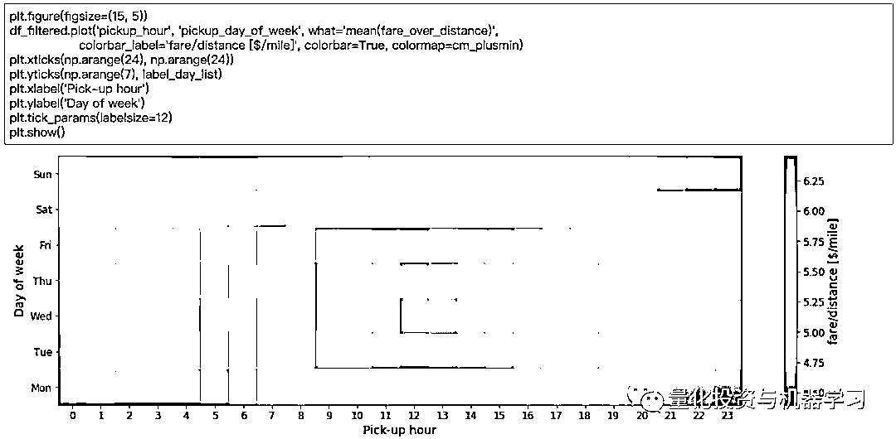

上面的数字是合理的，最好的收入发生在高峰时间，**特别是中午**，在工作日。作为一名出租车司机，我们收入的一部分给了出租车公司，所以我们可能会对哪一天、哪段时间顾客给的小费最多感兴趣。让我们制作一个类似的图，这次显示的是平均小费的比例：

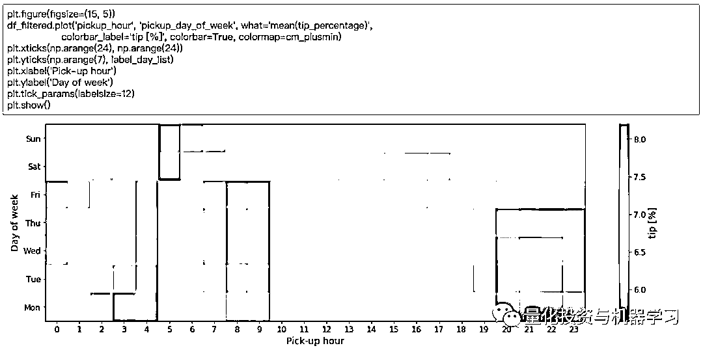

上面的结论很有趣。它告诉我们，**乘客在早上 7 点到 10 点之间给出租车司机的小费最多**，如果你在凌晨 3 点或 4 点接乘客，不要指望会有大额小费。

**更深入的分析**

在本文的前一部分中，我们简要地集中讨论了 trip_distance 列，在去除异常值时，我们保留了所有值小于 100 英里的行程。但这仍然是一个相当大的临界值，尤其是考虑到 Yellow Taxi 公司主要在曼哈顿运营。trip_distance 列描述出租车从上客点到下客点的距离。然而，人们经常可以选择不同的路线，在两个确切的上落地点之间有不同的距离，例如为了避免交通堵塞或道路工程。因此，作为 trip_distance 列的一个对应项，让我们计算接送位置之间可能的最短距离，我们称之为 arc_distance：

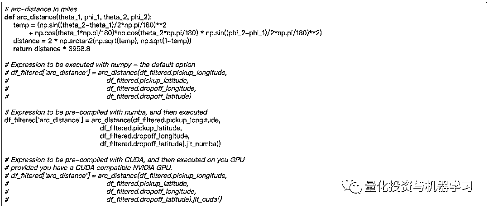

对于用 Numpy 编写的复杂表达式，vaex 可以在 Numba、Pythran 甚至 CUDA（如果你有 NVIDIA GPU 的话）的帮助下使用即时编译来极大地提高你的计算速度。

arc_distance 的计算公式非常复杂，它包含了大量的三角函数和算术知识，特别是在处理大数据集的情况下，计算量很大。如果表达式或函数仅使用来自 Numpy 包的 Python 操作和方法编写，Vaex 将使用计算机的所有核心并行地计算它。除此之外，Vaex 通过 Numba（使用 LLVM）或 Pythran（通过 C++加速）支持即时编译，从而提供更好的性能。如果你有 NVIDIA 显卡，你可以通过 jit_cuda 方法使用 CUDA 来获得更快的性能。

无论如何，我们来画一下 trip_distance 和 arc_distance 的分布：

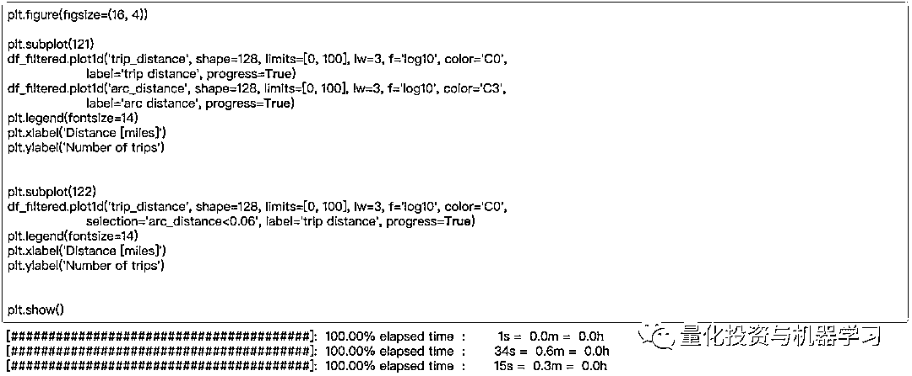

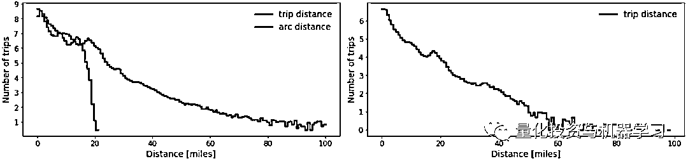

有趣的是，arc_distance 从未超过 21 英里，但出租车实际行驶的距离可能是它的 5 倍。事实上，在数百万次的出租车行程中，落客点距离接客点只有 100 米（0.06 英里）。

我们这次试用的数据集跨越了 7 年。我们可以看看在这段时间里，人们对某些东西的兴趣是如何演变的，可能会很有趣。使用 Vaex，我们可以进行 out-of-core group-by 和 aggregation 操作。让我们来看看这 7 年中票价和旅行距离的变化：

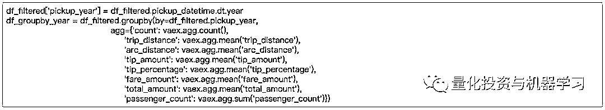

**在拥有四核处理器的笔记本电脑上，对一个拥有超过 10 亿个样本的 Vaex DataFrame 进行 8 个聚合的分组操作只需不到 2 分钟。**

在上面的单元格格中，我们执行 groupby 操作，然后执行 8 个聚合，其中 2 个位于虚拟列上。上面的单元格在我们的笔记本电脑上执行不到 2 分钟。考虑到我们使用的数据包含超过 10 亿个样本，这是相当令人印象深刻的。不管怎样，让我们看看结果。以下是多年来乘坐出租车的费用是如何演变的：

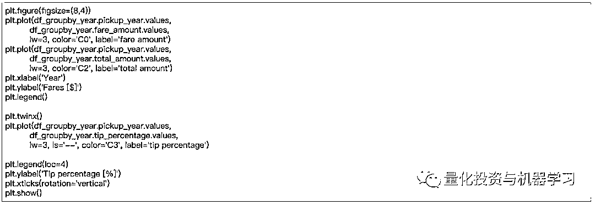

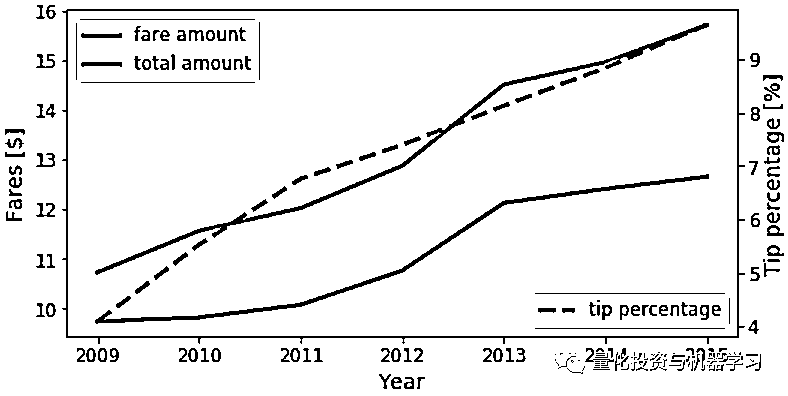

我们看到，随着时间的流逝，出租车费和小费都在上涨。现在让我们看看出租车的 trip_distance 和 arc_distance 作为年的函数：

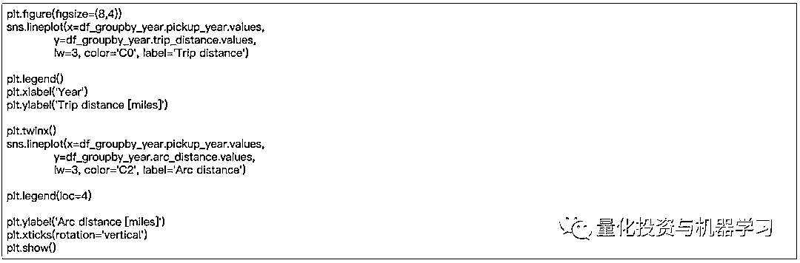

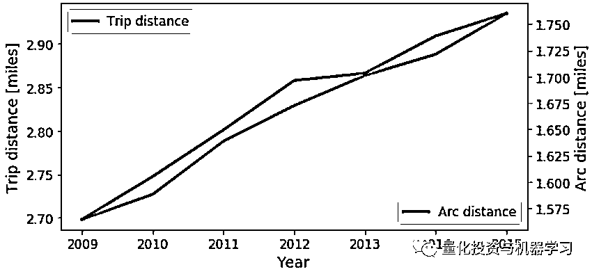

上图显示，trip_distance 和 arc_distance 都有一个小的增长，这意味着，平均而言，人们倾向于每年走得更远一点。

让我们再调查一下乘客是如何支付他们的车费的：payment_type 列，让我们看看它包含的值：

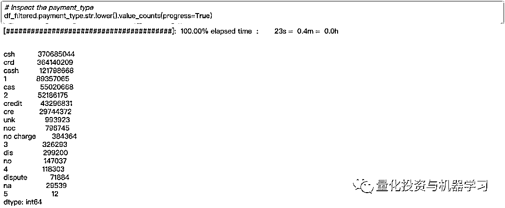

从数据集中，我们可以看到只有 6 个有效的条目：

1=信用卡支付

2=现金支付

3=不收费

4=纠纷

5=未知

6=无效行程

因此，我们可以简单地将 payment_type 列中的条目映射到整数：

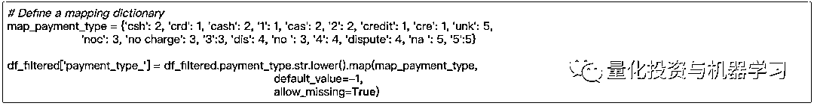

现在我们可以根据每年的数据进行分组，看看纽约人在支付打车费用方面的习惯是如何改变的：

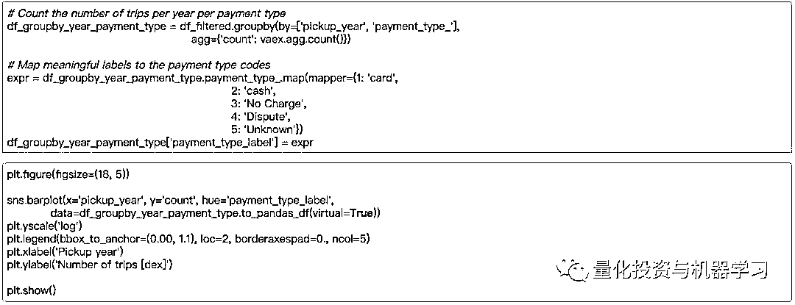

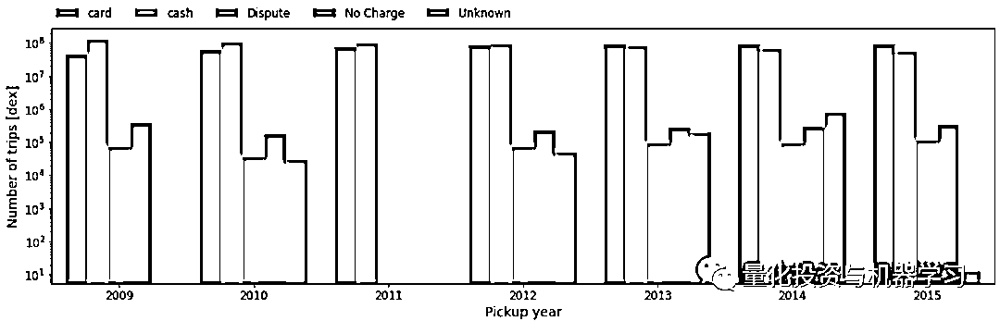

我们发现，随着时间的推移，信用卡支付慢慢变得比现金支付更频繁。在上面的代码块中，一旦我们聚合了数据，小型的 Vaex dataframe 就可以很容易地转换为 Pandas DataFrame，将其传递给 Seaborn。

最后，让我们通过绘制现金支付与信用卡支付之间的比率来查看付款方法是否取决于当天的时间或星期几。为此，我们将首先创建一个过滤器，它只选择用现金或信用卡支付。下一步是具有 Vaex 特色功能的操作：带有选择的聚合。其他库要求对每个支付方法进行聚合，然后将这些支付方法后来合并为一个支付方法。 另一方面，我们可以通过在聚合函数中提供的参数，一步完成这个操作。 这非常方便，只需要传递一次数据，就可以获得更好的性能。 然后，我们可以用标准的方式绘制出最终的 DataFrame：

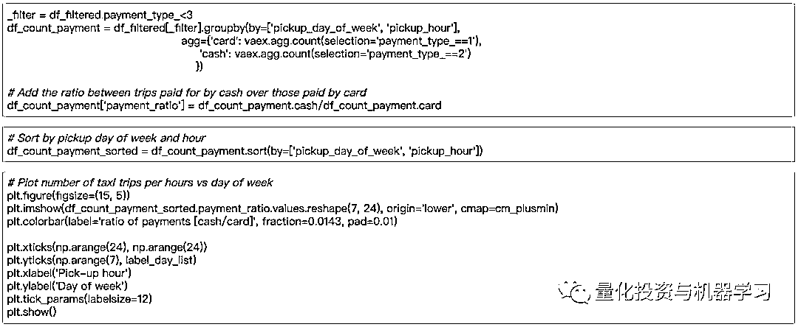

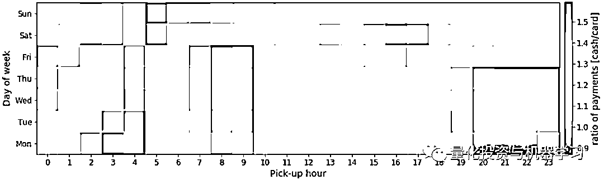

从上面的图可以看出，显示的小费百分比可以作为一周的某天或一天的某时段的函数。从这两个图中表明，用信用卡支付的乘客比用现金支付的乘客更倾向于给小费。看看分布：

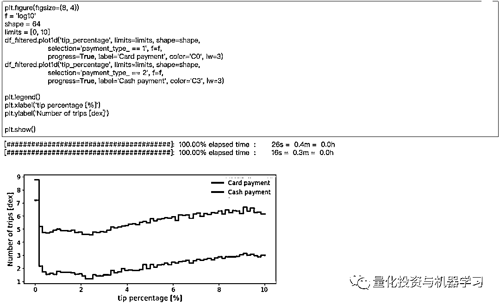

乘客多久付一次小费？

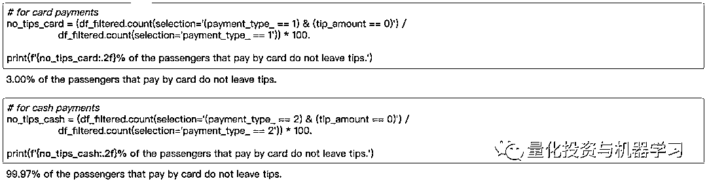

但是让我们看看 _fareamount 和 _totalamount 的分布，这取决于支付方式是刷卡还是现金。

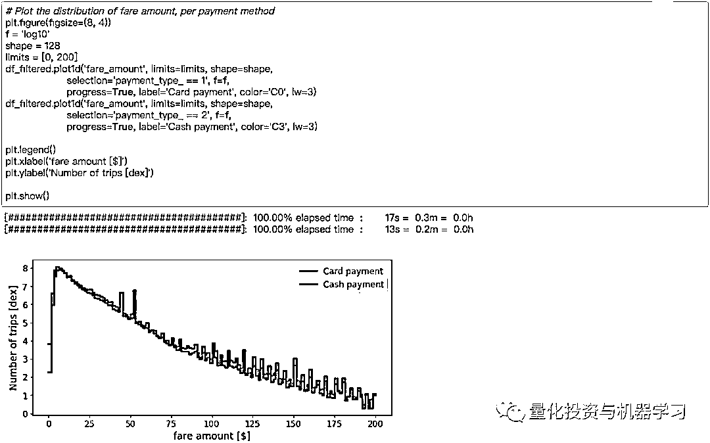

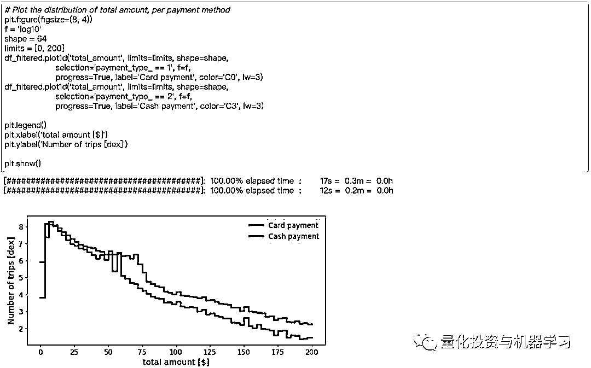

**结论**

有了 Vaex，你可以在短短几秒钟内浏览超过 10 亿行数据，计算各种统计数据、聚合信息，并生成信息图表，而这一切都是在你自己的笔记本电脑上完成的。而且它是免费和开源的！

*—End—*

量化投资与机器学习微信公众号，是业内垂直于**Quant**、**MFE**、**Fintech****、AI、ML**等领域的**量化类主流自媒体。**公众号拥有来自**公募、私募、券商、期货、银行、海外**等众多圈内**18W+**关注者。每日发布行业前沿研究成果和最新量化资讯。

你点的每个“在看”，都是对我们最大的鼓励