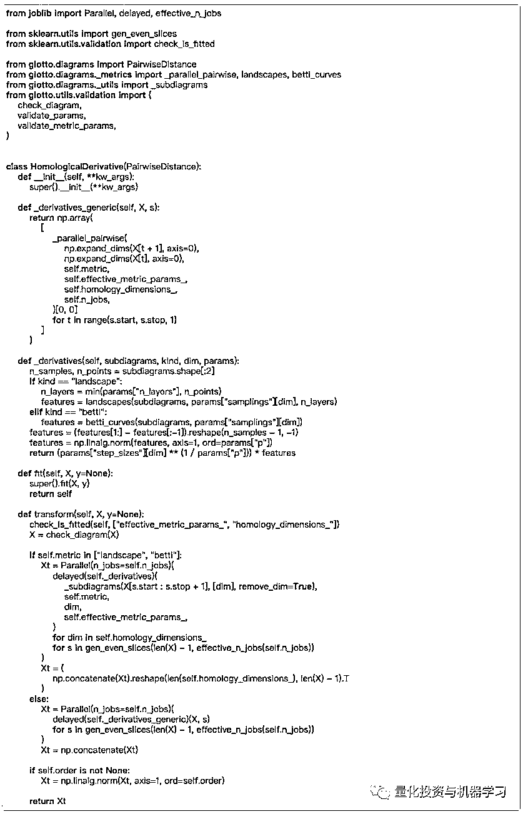

# 拓扑数据分析：珍爱生命，远离股灾！

> 原文：[`mp.weixin.qq.com/s?__biz=MzAxNTc0Mjg0Mg==&mid=2653295587&idx=1&sn=5c046516dfd077cdce8e426bccda12f4&chksm=802dd1f6b75a58e06d9e9ba0c6c357cc7b76d5bfab0bdbf07d566a062184959c327261bdf1d2&scene=27#wechat_redirect`](http://mp.weixin.qq.com/s?__biz=MzAxNTc0Mjg0Mg==&mid=2653295587&idx=1&sn=5c046516dfd077cdce8e426bccda12f4&chksm=802dd1f6b75a58e06d9e9ba0c6c357cc7b76d5bfab0bdbf07d566a062184959c327261bdf1d2&scene=27#wechat_redirect)


**标星★****置顶****公众号     **爱你们♥   

作者：Wallyson Lemes、编辑部

编辑：1+1=6

**近期原创文章：**

## ♥ [5 种机器学习算法在预测股价的应用（代码+数据）](https://mp.weixin.qq.com/s?__biz=MzAxNTc0Mjg0Mg==&mid=2653290588&idx=1&sn=1d0409ad212ea8627e5d5cedf61953ac&chksm=802dc249b75a4b5fa245433320a4cc9da1a2cceb22df6fb1a28e5b94ff038319ae4e7ec6941f&token=1298662931&lang=zh_CN&scene=21#wechat_redirect)

## ♥ [Two Sigma 用新闻来预测股价走势，带你吊打 Kaggle](https://mp.weixin.qq.com/s?__biz=MzAxNTc0Mjg0Mg==&mid=2653290456&idx=1&sn=b8d2d8febc599742e43ea48e3c249323&chksm=802e3dcdb759b4db9279c689202101b6b154fb118a1c1be12b52e522e1a1d7944858dbd6637e&token=1330520237&lang=zh_CN&scene=21#wechat_redirect)

## ♥ 2 万字干货：[利用深度学习最新前沿预测股价走势](https://mp.weixin.qq.com/s?__biz=MzAxNTc0Mjg0Mg==&mid=2653290080&idx=1&sn=06c50cefe78a7b24c64c4fdb9739c7f3&chksm=802e3c75b759b563c01495d16a638a56ac7305fc324ee4917fd76c648f670b7f7276826bdaa8&token=770078636&lang=zh_CN&scene=21#wechat_redirect)

## ♥ [机器学习在量化金融领域的误用！](http://mp.weixin.qq.com/s?__biz=MzAxNTc0Mjg0Mg==&mid=2653292984&idx=1&sn=3e7efe9fe9452c4a5492d2175b4159ef&chksm=802dcbadb75a42bbdce895c49070c3f552dc8c983afce5eeac5d7c25974b7753e670a0162c89&scene=21#wechat_redirect)

## ♥ [基于 RNN 和 LSTM 的股市预测方法](https://mp.weixin.qq.com/s?__biz=MzAxNTc0Mjg0Mg==&mid=2653290481&idx=1&sn=f7360ea8554cc4f86fcc71315176b093&chksm=802e3de4b759b4f2235a0aeabb6e76b3e101ff09b9a2aa6fa67e6e824fc4274f68f4ae51af95&token=1865137106&lang=zh_CN&scene=21#wechat_redirect)

## ♥ [如何鉴别那些用深度学习预测股价的花哨模型？](https://mp.weixin.qq.com/s?__biz=MzAxNTc0Mjg0Mg==&mid=2653290132&idx=1&sn=cbf1e2a4526e6e9305a6110c17063f46&chksm=802e3c81b759b597d3dd94b8008e150c90087567904a29c0c4b58d7be220a9ece2008956d5db&token=1266110554&lang=zh_CN&scene=21#wechat_redirect)

## ♥ [优化强化学习 Q-learning 算法进行股市](https://mp.weixin.qq.com/s?__biz=MzAxNTc0Mjg0Mg==&mid=2653290286&idx=1&sn=882d39a18018733b93c8c8eac385b515&chksm=802e3d3bb759b42d1fc849f96bf02ae87edf2eab01b0beecd9340112c7fb06b95cb2246d2429&token=1330520237&lang=zh_CN&scene=21#wechat_redirect)

## ♥ [WorldQuant 101 Alpha、国泰君安 191 Alpha](https://mp.weixin.qq.com/s?__biz=MzAxNTc0Mjg0Mg==&mid=2653290927&idx=1&sn=ecca60811da74967f33a00329a1fe66a&chksm=802dc3bab75a4aac2bb4ccff7010063cc08ef51d0bf3d2f71621cdd6adece11f28133a242a15&token=48775331&lang=zh_CN&scene=21#wechat_redirect)

## ♥ [基于回声状态网络预测股票价格（附代码）](https://mp.weixin.qq.com/s?__biz=MzAxNTc0Mjg0Mg==&mid=2653291171&idx=1&sn=485a35e564b45046ff5a07c42bba1743&chksm=802dc0b6b75a49a07e5b91c512c8575104f777b39d0e1d71cf11881502209dc399fd6f641fb1&token=48775331&lang=zh_CN&scene=21#wechat_redirect)

## ♥ [计量经济学应用投资失败的 7 个原因](https://mp.weixin.qq.com/s?__biz=MzAxNTc0Mjg0Mg==&mid=2653292186&idx=1&sn=87501434ae16f29afffec19a6884ee8d&chksm=802dc48fb75a4d99e0172bf484cdbf6aee86e36a95037847fd9f070cbe7144b4617c2d1b0644&token=48775331&lang=zh_CN&scene=21#wechat_redirect)

## ♥ [配对交易千千万，强化学习最 NB！（文档+代码）](http://mp.weixin.qq.com/s?__biz=MzAxNTc0Mjg0Mg==&mid=2653292915&idx=1&sn=13f4ddebcd209b082697a75544852608&chksm=802dcb66b75a4270ceb19fac90eb2a70dc05f5b6daa295a7d31401aaa8697bbb53f5ff7c05af&scene=21#wechat_redirect)

## ♥ [关于高盛在 Github 开源背后的真相！](https://mp.weixin.qq.com/s?__biz=MzAxNTc0Mjg0Mg==&mid=2653291594&idx=1&sn=7703403c5c537061994396e7e49e7ce5&chksm=802dc65fb75a4f49019cec951ac25d30ec7783738e9640ec108be95335597361c427258f5d5f&token=48775331&lang=zh_CN&scene=21#wechat_redirect)

## ♥ [新一代量化带货王诞生！Oh My God！](https://mp.weixin.qq.com/s?__biz=MzAxNTc0Mjg0Mg==&mid=2653291789&idx=1&sn=e31778d1b9372bc7aa6e57b82a69ec6e&chksm=802dc718b75a4e0ea4c022e70ea53f51c48d102ebf7e54993261619c36f24f3f9a5b63437e9e&token=48775331&lang=zh_CN&scene=21#wechat_redirect)

## ♥ [独家！关于定量/交易求职分享（附真实试题）](https://mp.weixin.qq.com/s?__biz=MzAxNTc0Mjg0Mg==&mid=2653291844&idx=1&sn=3fd8b57d32a0ebd43b17fa68ae954471&chksm=802dc751b75a4e4755fcbb0aa228355cebbbb6d34b292aa25b4f3fbd51013fcf7b17b91ddb71&token=48775331&lang=zh_CN&scene=21#wechat_redirect)

## ♥ [Quant 们的身份危机！](https://mp.weixin.qq.com/s?__biz=MzAxNTc0Mjg0Mg==&mid=2653291856&idx=1&sn=729b657ede2cb50c96e92193ab16102d&chksm=802dc745b75a4e53c5018cc1385214233ec4657a3479cd7193c95aaf65642f5f45fa0e465694&token=48775331&lang=zh_CN&scene=21#wechat_redirect)

## ♥ [AQR 最新研究 | 机器能“学习”金融吗](http://mp.weixin.qq.com/s?__biz=MzAxNTc0Mjg0Mg==&mid=2653292710&idx=1&sn=e5e852de00159a96d5dcc92f349f5b58&chksm=802dcab3b75a43a5492bc98874684081eb5c5666aff32a36a0cdc144d74de0200cc0d997894f&scene=21#wechat_redirect)

**前言**

去噪是一项永无止境的工作，快刀斩乱麻可能会危及整个分析。


好比上面这张动图：把一块巨大的圆石滚到山上，但当它接近山顶时，它又滚了下来，重复着这个动作，直到永远···

**正文**

只要有金融市场，就会有金融危机（股灾）。当股市下跌时，那些能够预见到市场下跌的人可以保护自己的资产，或者采取高风险的空头头寸来获利。金融市场上资产的价格是由多种信息决定的，在有效市场假说中，信息的一个简单变化会立即反映在价格中。

*"The dynamics of financial systems are comparable to those of physical systems."*

就像固体、液体和气体之间发生相变一样，我们可以分辨市场上的正常状态和混乱状态。

观察表明，在金融危机之前，资产价格会出现一段时间的振荡。这个高度不确定性的时期与时间序列的几何结构的异常变化有关。

在今天的推文中，我们将使用**拓扑数据分析（TDA）**来捕捉时间序列中的这些几何变化，从而为股灾提供一个可靠的探测器。

**对于金融危机（股灾）的准确定义，人们几乎没有达成共识**

直观地说，股灾就是资产价格的迅速下跌。价格下跌是由大规模抛售资产造成的，这是一种在价格进一步下跌之前结清头寸的操作。

意识到一个巨大的投机泡沫（比如次贷）或一个灾难性事件，将导致市场崩盘。在过去 20 年里，我们目睹了两场重大的股灾：2000 年的互联网崩盘和 2008 年的全球金融危机。

我们分析了标普 500 指数从 1980 年到现在的每日价格。**与简单的 baseline 相比，我们发现拓扑信号对噪声具有较强的鲁棒性，因此不易产生 False Positives。**


那么什么是拓扑数据分析（TDA）呢？

****拓扑数据分析（TDA）****

拓扑数据分析（Topological Data Analysis，简称 TDA），就是把拓扑学与数据分析结合的一种分析方法，即可以提供一种强大的方法来抽象复杂数据中的微观结构。

什么是“拓扑”？

**拓扑是研究几何图形或空间在连续改变形状后还能保持不变的一些性质的一个学科**。它**只考虑物体间的****位置关系**而**不考虑它们的****形状和大小**。拓扑学是一种几何学，但它研究的并不是大家所熟悉的普通几何性质，而是一类特殊的几何性质，这就是“拓扑性质”，即图形在整体结构上的特性。它与几何图形的大小、形状以及所含线段的曲直等无关。

相比于主成分分析、聚类分析这些常用的方法，TDA 不仅可以有效地捕捉高维数据空间的拓扑信息，而且**擅长发现一些用传统方法无法发现的小分类**。这种方法也因此曾在基因与癌症研究领域大显身手。

我们知道，TDA 是基于拓扑学而来的，**拓扑学是描述数学空间，特别是其空间形状属性的一个数学分支**。拓扑学家处理的很多形态都是非常奇怪的，种类太多以至于几乎所有的日常物体（如碗、宠物和树木等的）的形态只占了拓扑学研究范围的一小部分。"拓扑"（Topology）一词源于希腊语，表示地点（Topos）和研究（Logy）。

和通常研究的成对关系相比，这种相互关系的形状之中可能潜藏了巨大的研究价值。要理解数据的形状，就必须求助于拓扑学。**TDA 所做的就是抽取这种形状并进行分析**。


 检测股灾的 baseline 和拓扑模型

接下来，给大家介绍一款由 Giotto 出品的一款开源 TDA 库：


网址：***https://giotto.ai/***


网站有很丰富的学习文档和资料，大家可以自行查看：


Giotto-learn 是 Python 中的一个高性能拓扑机器学习工具箱，它构建在 scikit-learn 之上，并在 Apache 2.0 许可下发布。 

GitHub：***https://github.com/giotto-ai/giotto-learn***

## 

安装 Giotto 的最简单方法是使用 pip：

```py
pip install giotto-learn
```

*   Python（>= 3.5）

*   Scikit-learn（>= 0.21.3）

*   NumPy（>= 1.11.0）

*   SciPy（>= 0.17.0）

*   joblib（>= 0.11）

*   Matplotlib（> = 1.5.1）

*   plotly（> = 4.1.0）

**baseline**

考虑到股灾代表着股价的突然下跌，检测这些变化的一个简单方法是通过移动窗口来跟踪均价的一阶导数。事实上，从下图中我们可以看出，这种比较初级的方法已经抓住了“黑色星期一”（1987 年）、互联网泡沫（2000-2004 年）和金融危机（2007-2008 年）的特点。


S&P500 指数

对这个时间序列进行标准化 [0,1]，我们用一个阈值在发生崩盘的原始时间序列上进行标记。


baseline 模型的崩溃概率


原始时间序列上高于阈值的点

显然，这种简单的方法是相当嘈杂的。

随着许多点被标记为崩盘，遵循这些建议将导致过度恐慌和过早出售资产。让我们看看 TDA 是否可以帮助我们降低信号中的噪声，并获得一个更加稳健的检测器！

**TDA pipeline**

TDA 以提取数据基本形状的方式去除噪声。

典型的方法包括滤波（卡尔曼滤波）和平滑策略（指数移动平均）。这些方法都侧重于时间平均方法，并在噪声频率远高于信号频率的假设下工作。相比之下，**TDA 不是基于简单的时间平均，而是从每个固定时间提取结构信息。**

TDA 背后的数学原理很深奥，本文将不对此进行讨论。我们将 TDA 看作是一种提取可用于在建模是提取信息特征的方法就足够了。

1、将时间序列嵌入到一个 PointCloud（点云）中，构造点云移动窗口。

**▍什么是点云数据？**
点云数据是指在一个三维坐标系统中的一组向量的集合。这些向量通常以 X、Y、Z 三维坐标的形式表示，而且一般主要用来代表一个物体的外表面形状。不仅如此，除（X,Y,Z）代表的几何位置信息之外，点云数据还可以表示一个点的 RGB 颜色，灰度值，深度，分割结果等。


圆环形的点云图像

2、在每个窗口上建立过滤，对每个窗口的几何形状进行编码。

3、使用持久性同源性（Persistent homology）提取这些窗口的相关特征。

4、通过测量这些特征从一个窗口到下一个窗口的差异来比较每个窗口。

5、基于这种差异构造一个崩溃检测器。

**时间序列作为点云**

TDA pipeline 从点云生成一个 simplicial complex 。因此，时间序列应用的关键问题是如何生成这样的点云。离散时间序列，通常被可视化为二维的散点图。通过从左到右扫描图像，这种表示方式使得时间序列的局部行为很容易跟踪。 但是，在传达较长时间范围内可能发生的重要影响方面，它往往是无效的。

一个众所周知的捕捉周期性行为的方法来自傅立叶变换分析。例如，时间序列上一个时间窗口的离散傅里叶变换给出了该窗口中的信号信息是否作可以作为几个简单周期信号总和。

出于本次研究的目的，我们考虑采用一种不同的编码方式来实现时间演变过程。它是基于这样一种思想，即动力学的一些关键性质可以在更高的维度上有效地揭示出来。首先，我们将一个单变量时间序列表示为一个点云，即在任意维的欧氏空间中表示一组向量。

过程如下我：我们选择两个整数 d 和τ。对于每一次 tᵢ∈(t₀t₁,…)，我们收集变量 y 在 d 不同时间的值，从 ti 开始均匀地间隔τ，并将它们作为一个有 d 条目的向量，即：


结果为 d 维空间中的一组向量！τ称为时延参数，d 为嵌入维数。

在 Floris Takens 之后，这种时间延嵌入方法也被称为 Taken’s 嵌入，在非线性动力系统中有着十分重要的性质。

最后，在整个时间序列上对移动窗口分别应用这个过程，得到一个点云时间序列（每个移动窗口一个点云），其中可能包含有趣的拓扑。下图显示了这种点云是如何在二维空间中生成的。


嵌入维数 d=2 和时间延迟τ=1

接下来我们需要将 embedder 初始化，将价格时间序列表示为点云的时间序列：


既然我们的 embedder 是初始化的，其中每个元素是一个三维向量：


接下来，我们应用一个移动窗口来获得每个窗口的点云。选择窗口大小，每个间隔将跨越 36 天：


**从点云到 Persistence 图**

既然我们已经知道了如何生成点云的时间序列，那么我们该如何处理这些信息呢？持久性同源性（Persistent homology），它查找在某个参数值范围内持久存在的 simplicial complex 中的拓扑特征。通常，比如一个洞，最初不会被观察到，然后会出现，在一系列的参数值之后又会消失。




来自两个连续窗口的点云及其相关的持久性关系图

**持久图之间的距离**

给定两个窗口及其对应的持久性关系图，我们可以计算各种距离度量。在这里，我们比较了两个距离，一个基于 persistence landscape 的概念，另一个基于 Betti 曲线。


```py
Landscape Distances of the S&P 500 Index
```


Betti Curve Distances of the S&P 500 Index

从这些图中我们可以推断，基于 Landscape Distances 的度量比 Betti 曲线的噪声小。

**一个拓扑检测器**

使用窗口之间的 landscape 距离作为我们的拓扑特征，就像我们为 baseline 模型所做的一样。下面，我们将为大家呈现互联网泡沫和全球金融危机的测试结果。与我们的 baseline 相比，我们可以看到使用拓扑特征减少了信号中的噪声。


**结论**

我们的研究结果表明，高波动周期之前产生的几何特征，利用拓扑数据分析可以更可靠地检测到这些特征。然而，这些结果只涉及到一个特定的市场，而且是短期的，因此我们应该进一步研究这一过程在不同市场和不同阈值下的稳健性。后面为大家分享！

*—End—*

量化投资与机器学习微信公众号，是业内垂直于**Quant**、**MFE**、**Fintech****、AI、ML**等领域的**量化类主流自媒体。**公众号拥有来自**公募、私募、券商、期货、银行、海外**等众多圈内**18W+**关注者。每日发布行业前沿研究成果和最新量化资讯。

你点的每个“在看”，都是对我们最大的鼓励