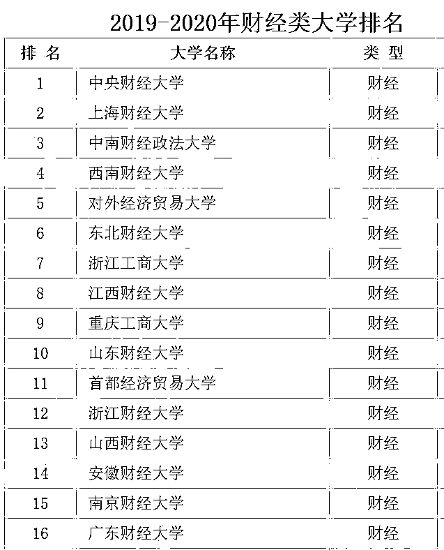
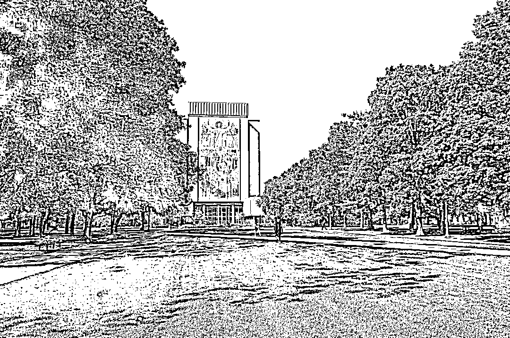

# 二千零二十、财经院校排名出炉：上财居然不是第一！

> 原文：[`mp.weixin.qq.com/s?__biz=MzAxNTc0Mjg0Mg==&mid=2653295547&idx=1&sn=81fba85ff08b050f08eee02d81ec9002&chksm=802dd1aeb75a58b80c30d08a3409aa889b121e37aedbab915a01f3bcfd1999868a51edbdd692&scene=27#wechat_redirect`](http://mp.weixin.qq.com/s?__biz=MzAxNTc0Mjg0Mg==&mid=2653295547&idx=1&sn=81fba85ff08b050f08eee02d81ec9002&chksm=802dd1aeb75a58b80c30d08a3409aa889b121e37aedbab915a01f3bcfd1999868a51edbdd692&scene=27#wechat_redirect)

**标星★****置顶****公众号     **爱你们♥   

作者：Uni 酱

来自：UniCareer 

**近期原创文章：**

## ♥ [5 种机器学习算法在预测股价的应用（代码+数据）](https://mp.weixin.qq.com/s?__biz=MzAxNTc0Mjg0Mg==&mid=2653290588&idx=1&sn=1d0409ad212ea8627e5d5cedf61953ac&chksm=802dc249b75a4b5fa245433320a4cc9da1a2cceb22df6fb1a28e5b94ff038319ae4e7ec6941f&token=1298662931&lang=zh_CN&scene=21#wechat_redirect)

## ♥ [Two Sigma 用新闻来预测股价走势，带你吊打 Kaggle](https://mp.weixin.qq.com/s?__biz=MzAxNTc0Mjg0Mg==&mid=2653290456&idx=1&sn=b8d2d8febc599742e43ea48e3c249323&chksm=802e3dcdb759b4db9279c689202101b6b154fb118a1c1be12b52e522e1a1d7944858dbd6637e&token=1330520237&lang=zh_CN&scene=21#wechat_redirect)

## ♥ 2 万字干货：[利用深度学习最新前沿预测股价走势](https://mp.weixin.qq.com/s?__biz=MzAxNTc0Mjg0Mg==&mid=2653290080&idx=1&sn=06c50cefe78a7b24c64c4fdb9739c7f3&chksm=802e3c75b759b563c01495d16a638a56ac7305fc324ee4917fd76c648f670b7f7276826bdaa8&token=770078636&lang=zh_CN&scene=21#wechat_redirect)

## ♥ [机器学习在量化金融领域的误用！](http://mp.weixin.qq.com/s?__biz=MzAxNTc0Mjg0Mg==&mid=2653292984&idx=1&sn=3e7efe9fe9452c4a5492d2175b4159ef&chksm=802dcbadb75a42bbdce895c49070c3f552dc8c983afce5eeac5d7c25974b7753e670a0162c89&scene=21#wechat_redirect)

## ♥ [基于 RNN 和 LSTM 的股市预测方法](https://mp.weixin.qq.com/s?__biz=MzAxNTc0Mjg0Mg==&mid=2653290481&idx=1&sn=f7360ea8554cc4f86fcc71315176b093&chksm=802e3de4b759b4f2235a0aeabb6e76b3e101ff09b9a2aa6fa67e6e824fc4274f68f4ae51af95&token=1865137106&lang=zh_CN&scene=21#wechat_redirect)

## ♥ [如何鉴别那些用深度学习预测股价的花哨模型？](https://mp.weixin.qq.com/s?__biz=MzAxNTc0Mjg0Mg==&mid=2653290132&idx=1&sn=cbf1e2a4526e6e9305a6110c17063f46&chksm=802e3c81b759b597d3dd94b8008e150c90087567904a29c0c4b58d7be220a9ece2008956d5db&token=1266110554&lang=zh_CN&scene=21#wechat_redirect)

## ♥ [优化强化学习 Q-learning 算法进行股市](https://mp.weixin.qq.com/s?__biz=MzAxNTc0Mjg0Mg==&mid=2653290286&idx=1&sn=882d39a18018733b93c8c8eac385b515&chksm=802e3d3bb759b42d1fc849f96bf02ae87edf2eab01b0beecd9340112c7fb06b95cb2246d2429&token=1330520237&lang=zh_CN&scene=21#wechat_redirect)

## ♥ [WorldQuant 101 Alpha、国泰君安 191 Alpha](https://mp.weixin.qq.com/s?__biz=MzAxNTc0Mjg0Mg==&mid=2653290927&idx=1&sn=ecca60811da74967f33a00329a1fe66a&chksm=802dc3bab75a4aac2bb4ccff7010063cc08ef51d0bf3d2f71621cdd6adece11f28133a242a15&token=48775331&lang=zh_CN&scene=21#wechat_redirect)

## ♥ [基于回声状态网络预测股票价格（附代码）](https://mp.weixin.qq.com/s?__biz=MzAxNTc0Mjg0Mg==&mid=2653291171&idx=1&sn=485a35e564b45046ff5a07c42bba1743&chksm=802dc0b6b75a49a07e5b91c512c8575104f777b39d0e1d71cf11881502209dc399fd6f641fb1&token=48775331&lang=zh_CN&scene=21#wechat_redirect)

## ♥ [计量经济学应用投资失败的 7 个原因](https://mp.weixin.qq.com/s?__biz=MzAxNTc0Mjg0Mg==&mid=2653292186&idx=1&sn=87501434ae16f29afffec19a6884ee8d&chksm=802dc48fb75a4d99e0172bf484cdbf6aee86e36a95037847fd9f070cbe7144b4617c2d1b0644&token=48775331&lang=zh_CN&scene=21#wechat_redirect)

## ♥ [配对交易千千万，强化学习最 NB！（文档+代码）](http://mp.weixin.qq.com/s?__biz=MzAxNTc0Mjg0Mg==&mid=2653292915&idx=1&sn=13f4ddebcd209b082697a75544852608&chksm=802dcb66b75a4270ceb19fac90eb2a70dc05f5b6daa295a7d31401aaa8697bbb53f5ff7c05af&scene=21#wechat_redirect)

## ♥ [关于高盛在 Github 开源背后的真相！](https://mp.weixin.qq.com/s?__biz=MzAxNTc0Mjg0Mg==&mid=2653291594&idx=1&sn=7703403c5c537061994396e7e49e7ce5&chksm=802dc65fb75a4f49019cec951ac25d30ec7783738e9640ec108be95335597361c427258f5d5f&token=48775331&lang=zh_CN&scene=21#wechat_redirect)

## ♥ [新一代量化带货王诞生！Oh My God！](https://mp.weixin.qq.com/s?__biz=MzAxNTc0Mjg0Mg==&mid=2653291789&idx=1&sn=e31778d1b9372bc7aa6e57b82a69ec6e&chksm=802dc718b75a4e0ea4c022e70ea53f51c48d102ebf7e54993261619c36f24f3f9a5b63437e9e&token=48775331&lang=zh_CN&scene=21#wechat_redirect)

## ♥ [独家！关于定量/交易求职分享（附真实试题）](https://mp.weixin.qq.com/s?__biz=MzAxNTc0Mjg0Mg==&mid=2653291844&idx=1&sn=3fd8b57d32a0ebd43b17fa68ae954471&chksm=802dc751b75a4e4755fcbb0aa228355cebbbb6d34b292aa25b4f3fbd51013fcf7b17b91ddb71&token=48775331&lang=zh_CN&scene=21#wechat_redirect)

## ♥ [Quant 们的身份危机！](https://mp.weixin.qq.com/s?__biz=MzAxNTc0Mjg0Mg==&mid=2653291856&idx=1&sn=729b657ede2cb50c96e92193ab16102d&chksm=802dc745b75a4e53c5018cc1385214233ec4657a3479cd7193c95aaf65642f5f45fa0e465694&token=48775331&lang=zh_CN&scene=21#wechat_redirect)

## ♥ [AQR 最新研究 | 机器能“学习”金融吗](http://mp.weixin.qq.com/s?__biz=MzAxNTc0Mjg0Mg==&mid=2653292710&idx=1&sn=e5e852de00159a96d5dcc92f349f5b58&chksm=802dcab3b75a43a5492bc98874684081eb5c5666aff32a36a0cdc144d74de0200cc0d997894f&scene=21#wechat_redirect)

2020 国内财经院校排名出炉央财力压上财，成为第一
中南财大、西财名列第三及第四名
央财为何力压群雄，夺得第一？对比国外热门财会强校及专业国内财大到底表现如何？今天，我们来盘一盘国内外财经强校**央财力压上财, 夺得第一**

近日，中国科教网发布 2020 国内财经院校排名榜单，**中央财经大学超越上海财经大学排名第一**。中南财大，西财，对外经贸分别名列第三、四、五名。

*图片来源：网络

**同时，中国科教网还对 2019 年-2020 年经济学学科门类进行了排名** ，其中中国人大的经济学排第一，其次是央财，北大、西南财经、对外经济贸易大学的经济学学科。

*图片来源：网络

事实上，不光在国内，即使在国际范围内，央财的名号也是响当当，据 U.S.News 发布 2019 世界大学排名，经济与商科专业共有 200 所大学上榜，中国内地共有 9 所高校位列榜单，包括：

*北京大学、清华大学、上海交通大学、复旦大学、中国人民大学、浙江大学、上海财经大学、厦门大学、中山大学，国内经管专业知名的中央财经大学*

其中，**中央财经大学以 137 名的好成绩比肩人大，力挫浙大（150）、厦大（165）及上财（156）。**可见央财在经济、管理方面的学科竞争力。

*图片来源：U.S.News

**央财和 UIUC, 谁更强?**

央财既是国内财经院校霸主，那么对比国外热门财会专业，表现又是如何呢？这里以 UIUC 会计专业为样本，UIUC 全称伊利诺伊大学香槟分校，在**美国会计界，没有人不知道 UIUC，因为该校会计专业全美第二**，在四大拥有超多校友，“美国会计专业公告”将 UIUC 的会计课程评为美国最好的会计学课程。那么，综合对比国内财会院校，谁更胜一筹？

**1、就业率**

一切不以就业为重点的对比都是耍流氓，据各高校公布的 2018 年毕业生就业质量报告来看，**央财就业率为 96.58%**，同时央财毕业生在公募、私募基金及新财富的占比也是力压国内一众财经院校，人数分别达 22（公募基金）、20（私募基金）、7（新财富）。

*图片来源：中国教育在线 UIUC 的会计专业则在 Gies 商学院下，于 1902 年开设，1922 年颁发全美第一个会计专业学士学位，可以说是引领全球了。**数据显示，UIUC 会计专业就业率高达 95%，与央财相当。以下是 Gies 商学院就业数据：***图片来源：网络 | Gies 商学院就业数据**2、薪资**毕业生薪资方面，央财毕业生平均薪资为 11630 元，领跑一众财经院校，要知道 2019 年全国高校毕业生平均薪资不过 7000 元，**也就是说央财毕业生薪资高过国内 66%的同期毕业生。**

*图片来源：大猫财经

**反观 UIUC 会计专业，其毕业生平均薪酬为 62330 美元，**对比 Gies 商学院其他专业，薪资中等偏上。但要是能够进入税务局工作，薪资可达 10 万美元。

**国内外财经强校盘点**

**1、国内篇**  

国内财经院校有“四财一贸”的说法，指上海财经大学、中央财经大学、中南财经政法大学、西南财经大学和对外经济贸易大学，因为 5 所院校均为 211，在中国财经业处于领先地位，故得名“四财一贸”。▍**中央财经大学**

央财应用经济学连续十多年保持优势，以 A+的成绩坐实了双一流学科。理论经济学有所提升，工商管理和统计学尚可。总体而言比较偏科，经济学强，管理学较强。**在央财，绝大多数人和事情都是“目的指向型”的。**

*上课、自习、点名、回答问题、和老师问问题套近乎——为了成绩；**参加活动、参加比赛、学生工作、志愿者、社会实践——为了综测。*

*图片来源：网络

**▍上海财经大学**

综合大学嘲笑财经类大学太功利，财经大学看不上综合大学的就业率低，毕竟薪资排名第一的上财已经碾压众多 985，仅次于清华。

*图片来源：网络

其次，上财经管学科（应经、理经、工商管理、统计）总体发展水平总体在同类学校中最高，基本与央财持平，有个 06 届学长表示，财大 BBS 还在的时候，最热门的板块永远是求职招聘板；大二开始实习就蔚然成风，翘课实习很常见；到了大三，更是变成了全民实习的阶段，连带如何选课排课也成了一门学问，如何应对一周三天甚至四天的实习，可是愁坏了多少人。这就是上财，你的 peer pressure 会让你玩都玩的不安心。

*图片来源：网络

**▍对外经济贸易大学**

经、管、(外)文、法全面开花，是所有同类院校中亮点最多院校。相对于 2013 年学科评估成绩止跌回升，但现阶段与上海财经、中央财经仍有小幅差距。但，外经贸真的是一座有情怀，有深度，有广度，能学会玩的学校。就自由度来说，贸大应该是财经院校之首，因为你可以：

*选课不是一般的自由，大学四年修满学分即可（私心认为是坑爹的选课系统根本选不到课，所以才特别自由）；**从来没有“夜不归宿”这个说法，在外实习到深夜的同学不用担心门禁；**wifi 覆盖全校，不限流量不要钱；**参加美赛建模，学校提供场地和各种支持，简直不要更贴心……*

*图片来源：网络

**▍中南财经政法大学**

和其他财经校一样，功利也是中南财经政法的代名词；和其他校略有不同的是，作为四大财经院校之一，中南财的学子似乎更为低调，务实不好高骛远。见过 top10 的学生，觉得天之骄子，天下之美为尽在己；中南财的学生其实普遍认为学校仅仅是 211 而已，所以找工作也好，做工作也罢，不会觉得自身了不起，自大骄人，但是也不自卑。

*图片来源：网络

**▍西南财经大学**

总体评估结果的确不够理想，甚至可以说出乎意料，与长期以来西财的内部评价和外部口碑不匹配。曾有西财学子吐槽：

*“我财和电科有点像，都是本科中的高职高专，少了川大的那种大气，有种‘我别的不会但我金融/会计/保险很牛’的专业技工气质。”*

*图片来源：网络

**除四财一贸外，国内仍不乏财经高校，比如近两年势头正旺的南京审计大学：**

**▍南京审计大学**

虽然该院校仅为双非一本，但江浙沪一带认可度超高，而且在银行，四大中也有较为丰富的校友资源。

*图片来源：网络

**2、国外篇**

**▍德克萨斯大学奥斯汀分校**

会计系是该校著名专业之一。UT 课程设置跟着 CPA 考试走，是个很好的入门，学生后期自己复习 CPA 的时候上手比较快。**德州的公司想招会计学生一般最先想的是 UT-Austin！**

*图片来源：网络

**▍南加州大学**

**USC 会计系 Leventhal 在全美名气都很大**，在加州地区也相当有影响力。既可以主修 Business 或其他专业，同时 minor 会计，或者直接参加学校的 Progressive Master’s Degree 项目，获得提前被硕士项目 MAcc 和 MBT 的录取机会。

*图片来源：网络**▍杨百翰大学**

美国最大的教会大学。**会计项目一直是全美 Top10**，会计项目可以本硕连读，5 年就可以完成。

*图片来源：网络**▍密歇根大学安娜堡分校**

中部名校，美国州立大学的翘楚。**会计专业毕业生 CPA 通过率全美 Top 10。**

*图片来源：网络

**▍圣母大学**

私立天主教学校，属于超有实力超土豪但超低调的一所大学。圣母大学商学院和会计专业排名都很靠前。MSA（会计硕士）有 Assurance 和 Tax 两个 track 可选，就业导向很强。

*图片来源：网络

**▍宾州州立大学**

四大中校友网庞大，全美各校现任职四大人数最多的就是 Penn State（每一家都是最多的哦），**加起来有近 2500 人。**

*图片来源：网络

**▍纽约大学**

座落于纽约心脏地带的世界顶尖名校。NYU 的斯特恩（Stern）商学院的**会计学专业一直在全美排名 Top 10。**

*图片来源：网络

**▍俄亥俄州立大学**

美国顶尖的公立大学，被誉为“公立常青藤”大学之一。俄亥俄州立大学的费舍尔商学院（Fisher）被评为美国最顶尖的商学院之一。**会计专业全美 Top10。**

*图片来源：网络**万事讲求实用的财大学子**

知乎@曾大嘟曾这么写过西财：

*没办法，这是一所专科类学校（真讨厌这个描述），它有自己本身固有的性质，人文气息在这里不可能长存，我想这也是所有财经类学校既死又活的地方。*你休想在这看见脚踩拖鞋板的行吟诗人，引吭高歌的路人，热闹的文学讨论。但你会发现这里有学生自主经营的超市，独立创办的广告公司，还有那些西装革履、逻辑缜密，让其他学校竞争对手闻风丧胆的求职者。**财大出去的学生很难成为庸才**，要有这自信，也要有这骚劲儿。北清复交忙着扎堆搞金融投资，财经类反倒是遍地开花，提升整体就业率。其实，对于所有的财经类学校，都是如此。如果说学校是座象牙塔，那么财经类大学应该是介于社会与象牙塔之间的。**他们把大学当跳板，从进校门开始就确定好了求职目标**。当大部分人大三才开始找实习的时候，他们手里可能已经有数家 500 强实习经历。秋招？春招？不好意思，我已经拿好了 return offer。**财会学子与四大**

毕业进四大，是大多财会学子的选择，领英曾经以四大会计师事务所作为调查对象，发布了一份《四大会计师事务所用人调查分析报告》，**包含一个四大从业者毕业高校百分比排名。其中上海财经大学更是达到了 6.3%的超高比例。**

*图片来源：领英 在四大用人方面，影响因素有很多，比如所在城市、专业等。而四大的宣讲会院校，基本上就是 target school。普华永道宣讲学校包括以下十所：   对外经济贸易大学、广东财经大学、广东外语外贸大学、江西财经大学、南京审计大学、上海财经大学、天津财经大学、西南财经大学、中南财经政法大学、中央财经大学毕马威宣讲学校，包括以下 13 所：对外经济贸易大学、广东外语外贸大学、江西财经大学、南京财经大学、南京审计大学、上海财经大学、上海对外经贸大学、首都经济贸易大学、天津财经大学、西南财经大学、浙江财经大学、中南财经政法大学、中央财经大学德勤宣讲学校，包括以下十所：东北财经大学、广东外语经贸大学、南京审计大学、上海财经大学、上海对外经贸大学、首都经济贸易大学、天津财经大学、浙江财经大学、中南财经政法大学、中央财经大学安永宣讲学校包括以下十所：东北财经大学、对外经济贸易大学、广东外语外贸大学、南京审计大学、上海财经大学、上海对外经贸大学、首都经济贸易大学、天津财经大学、西南财经大学、中央财经大学而且，很多学生进入四大都是奔着审计岗位去的，尤其是 PwC 的审计岗位，更是整个公司的“核心业务”。据上财《2018 年度就业质量报告》，毕业生的就业流向，会计师事务所占到了将近 11.8%，但其中却只有约 1 成是其他会计师事务所，**也就是说近 10.1%进入会计师事务所的同学都进了四大。***图片来源：上财《2018 年度就业质量报告》看完排名吃完瓜，编辑部想说财经院校内部的互撕并没有多大意义，等开始找工作或者开始工作了突然发现，大家大多数其实都是平凡的人：在学校里绝大多数平凡的人最后区别不过是你在这片区域做柜员，我在那片区域做柜员。你在这里卖理财，我在那里卖理财。我在这里加班做底稿，你在那边加班做底稿。学校之间那些差距其实很渺小。而那些特别出类拔萃的精英们，早就不是自己的学校可以定义他们的。他们找到的工作，以后得发展其实他在这 a 财会这样，在 b 财也会，在 c 财也没差。所以，**别让学校成为你的上限，也别让它成为你的下限。***—End—*量化投资与机器学习微信公众号，是业内垂直于**Quant**、**MFE**、**CST、AI**等专业的**主****流量化自媒体**。公众号拥有来自**公募、私募、券商、银行、海外**等众多圈内**18W+**关注者。每日发布行业前沿研究成果和最新量化资讯。你点的每个“在看”，都是对我们最大的鼓励