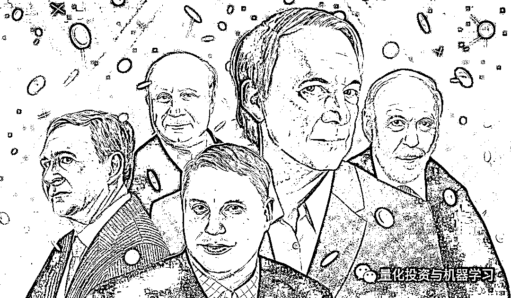
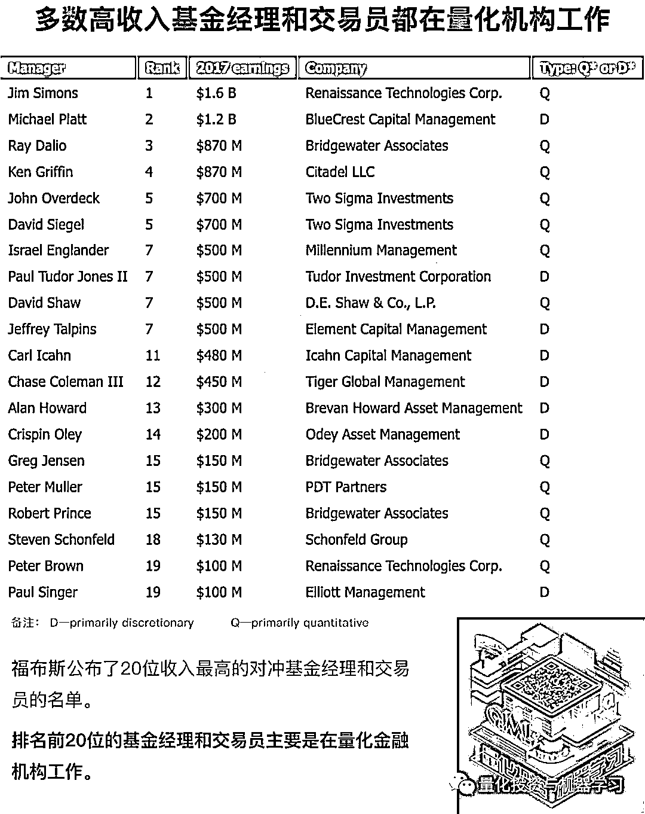

# 顶级对冲基金经理 PK 顶级 CEO，谁挣得多？

> 原文：[`mp.weixin.qq.com/s?__biz=MzAxNTc0Mjg0Mg==&mid=2653295537&idx=1&sn=6ac07b1d03e50502cfffb869ceb7dc4e&chksm=802dd1a4b75a58b21490289bfdfe4faf1d0576b272006a591d38e30b1358b6367700cf5e079e&scene=27#wechat_redirect`](http://mp.weixin.qq.com/s?__biz=MzAxNTc0Mjg0Mg==&mid=2653295537&idx=1&sn=6ac07b1d03e50502cfffb869ceb7dc4e&chksm=802dd1a4b75a58b21490289bfdfe4faf1d0576b272006a591d38e30b1358b6367700cf5e079e&scene=27#wechat_redirect)

**标星★****置顶****公众号     **爱你们♥   

作者：Wind、QIML 编辑部综合报道

编辑：1+1=6

**近期原创文章：**

## ♥ [5 种机器学习算法在预测股价的应用（代码+数据）](https://mp.weixin.qq.com/s?__biz=MzAxNTc0Mjg0Mg==&mid=2653290588&idx=1&sn=1d0409ad212ea8627e5d5cedf61953ac&chksm=802dc249b75a4b5fa245433320a4cc9da1a2cceb22df6fb1a28e5b94ff038319ae4e7ec6941f&token=1298662931&lang=zh_CN&scene=21#wechat_redirect)

## ♥ [Two Sigma 用新闻来预测股价走势，带你吊打 Kaggle](https://mp.weixin.qq.com/s?__biz=MzAxNTc0Mjg0Mg==&mid=2653290456&idx=1&sn=b8d2d8febc599742e43ea48e3c249323&chksm=802e3dcdb759b4db9279c689202101b6b154fb118a1c1be12b52e522e1a1d7944858dbd6637e&token=1330520237&lang=zh_CN&scene=21#wechat_redirect)

## ♥ 2 万字干货：[利用深度学习最新前沿预测股价走势](https://mp.weixin.qq.com/s?__biz=MzAxNTc0Mjg0Mg==&mid=2653290080&idx=1&sn=06c50cefe78a7b24c64c4fdb9739c7f3&chksm=802e3c75b759b563c01495d16a638a56ac7305fc324ee4917fd76c648f670b7f7276826bdaa8&token=770078636&lang=zh_CN&scene=21#wechat_redirect)

## ♥ [机器学习在量化金融领域的误用！](http://mp.weixin.qq.com/s?__biz=MzAxNTc0Mjg0Mg==&mid=2653292984&idx=1&sn=3e7efe9fe9452c4a5492d2175b4159ef&chksm=802dcbadb75a42bbdce895c49070c3f552dc8c983afce5eeac5d7c25974b7753e670a0162c89&scene=21#wechat_redirect)

## ♥ [基于 RNN 和 LSTM 的股市预测方法](https://mp.weixin.qq.com/s?__biz=MzAxNTc0Mjg0Mg==&mid=2653290481&idx=1&sn=f7360ea8554cc4f86fcc71315176b093&chksm=802e3de4b759b4f2235a0aeabb6e76b3e101ff09b9a2aa6fa67e6e824fc4274f68f4ae51af95&token=1865137106&lang=zh_CN&scene=21#wechat_redirect)

## ♥ [如何鉴别那些用深度学习预测股价的花哨模型？](https://mp.weixin.qq.com/s?__biz=MzAxNTc0Mjg0Mg==&mid=2653290132&idx=1&sn=cbf1e2a4526e6e9305a6110c17063f46&chksm=802e3c81b759b597d3dd94b8008e150c90087567904a29c0c4b58d7be220a9ece2008956d5db&token=1266110554&lang=zh_CN&scene=21#wechat_redirect)

## ♥ [优化强化学习 Q-learning 算法进行股市](https://mp.weixin.qq.com/s?__biz=MzAxNTc0Mjg0Mg==&mid=2653290286&idx=1&sn=882d39a18018733b93c8c8eac385b515&chksm=802e3d3bb759b42d1fc849f96bf02ae87edf2eab01b0beecd9340112c7fb06b95cb2246d2429&token=1330520237&lang=zh_CN&scene=21#wechat_redirect)

## ♥ [WorldQuant 101 Alpha、国泰君安 191 Alpha](https://mp.weixin.qq.com/s?__biz=MzAxNTc0Mjg0Mg==&mid=2653290927&idx=1&sn=ecca60811da74967f33a00329a1fe66a&chksm=802dc3bab75a4aac2bb4ccff7010063cc08ef51d0bf3d2f71621cdd6adece11f28133a242a15&token=48775331&lang=zh_CN&scene=21#wechat_redirect)

## ♥ [基于回声状态网络预测股票价格（附代码）](https://mp.weixin.qq.com/s?__biz=MzAxNTc0Mjg0Mg==&mid=2653291171&idx=1&sn=485a35e564b45046ff5a07c42bba1743&chksm=802dc0b6b75a49a07e5b91c512c8575104f777b39d0e1d71cf11881502209dc399fd6f641fb1&token=48775331&lang=zh_CN&scene=21#wechat_redirect)

## ♥ [计量经济学应用投资失败的 7 个原因](https://mp.weixin.qq.com/s?__biz=MzAxNTc0Mjg0Mg==&mid=2653292186&idx=1&sn=87501434ae16f29afffec19a6884ee8d&chksm=802dc48fb75a4d99e0172bf484cdbf6aee86e36a95037847fd9f070cbe7144b4617c2d1b0644&token=48775331&lang=zh_CN&scene=21#wechat_redirect)

## ♥ [配对交易千千万，强化学习最 NB！（文档+代码）](http://mp.weixin.qq.com/s?__biz=MzAxNTc0Mjg0Mg==&mid=2653292915&idx=1&sn=13f4ddebcd209b082697a75544852608&chksm=802dcb66b75a4270ceb19fac90eb2a70dc05f5b6daa295a7d31401aaa8697bbb53f5ff7c05af&scene=21#wechat_redirect)

## ♥ [关于高盛在 Github 开源背后的真相！](https://mp.weixin.qq.com/s?__biz=MzAxNTc0Mjg0Mg==&mid=2653291594&idx=1&sn=7703403c5c537061994396e7e49e7ce5&chksm=802dc65fb75a4f49019cec951ac25d30ec7783738e9640ec108be95335597361c427258f5d5f&token=48775331&lang=zh_CN&scene=21#wechat_redirect)

## ♥ [新一代量化带货王诞生！Oh My God！](https://mp.weixin.qq.com/s?__biz=MzAxNTc0Mjg0Mg==&mid=2653291789&idx=1&sn=e31778d1b9372bc7aa6e57b82a69ec6e&chksm=802dc718b75a4e0ea4c022e70ea53f51c48d102ebf7e54993261619c36f24f3f9a5b63437e9e&token=48775331&lang=zh_CN&scene=21#wechat_redirect)

## ♥ [独家！关于定量/交易求职分享（附真实试题）](https://mp.weixin.qq.com/s?__biz=MzAxNTc0Mjg0Mg==&mid=2653291844&idx=1&sn=3fd8b57d32a0ebd43b17fa68ae954471&chksm=802dc751b75a4e4755fcbb0aa228355cebbbb6d34b292aa25b4f3fbd51013fcf7b17b91ddb71&token=48775331&lang=zh_CN&scene=21#wechat_redirect)

## ♥ [Quant 们的身份危机！](https://mp.weixin.qq.com/s?__biz=MzAxNTc0Mjg0Mg==&mid=2653291856&idx=1&sn=729b657ede2cb50c96e92193ab16102d&chksm=802dc745b75a4e53c5018cc1385214233ec4657a3479cd7193c95aaf65642f5f45fa0e465694&token=48775331&lang=zh_CN&scene=21#wechat_redirect)

## ♥ [AQR 最新研究 | 机器能“学习”金融吗](http://mp.weixin.qq.com/s?__biz=MzAxNTc0Mjg0Mg==&mid=2653292710&idx=1&sn=e5e852de00159a96d5dcc92f349f5b58&chksm=802dcab3b75a43a5492bc98874684081eb5c5666aff32a36a0cdc144d74de0200cc0d997894f&scene=21#wechat_redirect)

**正文**

又到一年底，各行各业比谁能挣得多时候到了。从往年来看，家喻户晓的名人和光鲜亮丽的全球性大公司的 CEO，高额的年收入会在各种平台上刷屏，但与投资界弄潮儿的年收入相比，却要暗淡不少。 

2016 年，Taylor Swift 年收入 1.6 亿美元登顶福布斯名人榜百强之首。再往前一年，Uber 现任 CEO Dara Khosrowshahi，当时担任 Expedia 的 CEO，获得了 9460 万美元年薪也让舆论哗然。

迪斯尼的 CEO Bob Iger 年薪 4490 万美元；甲骨文的 CEO Mark Hurd 年薪 5300 万美元等等。公众一直有一个固有的印象，那就是名人和顶级大公司的 CEO 们太能挣了。

**顶级 CEO、国际歌手的因为高收入刷屏，对冲基金经理怎么看呢？**

Cambria Investment Management 的 Meb Faber 在社交媒体上抛了一个 hold my beer 梗（中文大概类似于“站稳了，我要开始装逼了”），表示对冲基金经理挣的钱可比耳熟能详的名人，光鲜无比的顶级 CEO 多多了。

下面的评论也是炸了：

年龄让这场对比变得越来越艰难，说明努力要乘早。但在娱乐圈可能出名要乘早吧

也有人提出了质疑：

还有一位小哥说：

哥，其实挺难的

作为对比，**有对冲基金之王美誉的 Citadel，业绩漂亮，其董事长兼 CEO Ken Griffin 在 2016 年进账 17 亿美元，是 Taylor Swift 同期年收入的 10 倍多**。长期投资收益帅炸的文艺复兴科技创始人 James Simons 在同一年也挣了 17 亿美元。

截止到 2018 年底，对冲基金经理们挣钱的本事又长进了吗？

让人失望的是，他们继续挣得更多，与社会名人和普罗大众的差距更大了。

据 2019 年 3 月公布的数据，在 2018 年，全球最大的对冲基金公司桥水（Bridgewater Associates），管理着近 1400 亿美元的资产。根据机构投资者在 4 月份公布的年度收入最高对冲基金经理富豪榜中，桥水的掌舵人达里奥位居榜首。年收入 20 亿美元。2018 年对于大多数对冲基金来说，都十分不友好，但是桥水基金的总收益率仍然达到了可怕的 14.6%。

**2019: $2 billion**

#### **2018 排名: 4 ($1.3 billion)**

在过去一年半的时间里，达里奥一直看跌，这推动了他的旗舰产品 Pure Alpha 宏观策略，其获得了 14.6%的收益，这是自 2011 年以来的最佳表现，因此荣登今年富豪榜榜首。这也让达里奥净赚了 20 亿美元。正如机构投资者此前计算的那样，这相当于他：

**每天赚 550 万美元**

**or**
**每周工作 ****7 天****每天工作 ****24 小时****每小时赚 ****228310 美元**

达利奥出版了 2 本比较重要的书籍：

原则

**文末免费下载**

债务危机

**文末免费下载**

**公众号提供：******中英对照版、PDF 版、kindle 版****

**紧随达里奥之后的是去年的第一名，文艺复兴科技公司的 James Simons，他赚了 15 亿美元，低于 2017 年的 17 亿美元。**

****2017 年，西蒙斯的平均工资为 ****每小时 18.4 万美元**。该基金的许多量化研究员一年挣的钱还不够这个数字，至少在薪水方面是这样。**

**根据最新的数据显示，**在这 30 年里，5%的管理费、44%的业绩提成下，大奖章的费后收益均值为 39%，接近 40%。逆天了！！！****

****

**下图显示了文艺复兴以 H1B 签证向其 East Setauket New York 办事处聘用的量化分析师和工程师支付的薪资（单位为 K）。**文艺复兴以只雇佣少数精英研究人员而闻名**，但与以往的 H1B 薪酬数据一样，这只是一个小样本，它反映了仅向非美国研究人员支付的薪酬数额（在美国工作的公民）。**

**数据表明，文艺复兴是很多对冲基金中薪酬最高的机构之一。然而，值得注意的是，**工资并不是大多数人为西蒙斯工作的原因。****真正的吸引力是他们向 Medallion 基金投资的机会**，该基金只对员工开放，自 1988 年成立以来，**每年的回报率约为****40%****。****

****

**前几日，公众号力推了一本书，介绍如下：**

**本书由《华尔街日报》记者格 Greg Zuckerman 撰写，讲述了西蒙斯和他创立的文艺复兴的历史。Greg Zuckerman 花了**两年半的时间**研究这家公司，与**40 多名员工**进行了交谈。尽管西蒙斯对这本有些顾虑，但最终还是同意坐下来接受**超过 10 个小时的采访**。**

**这本书应该是对西蒙斯的权威研究，让我们了解很多关于文艺复兴不为人知的技术细节。作为西蒙斯的粉丝，公众号力推这本书，**很多内容都是新的，不是市面上我们看到的陈词滥调！****

****

****点击上方图片免费下载此书****

**公众号前段时间，对西蒙斯在 2019 年麻省理工学院的的采访和问答进行了**脱水整理与解读：****

****

**点击阅读**

****复兴机构股票基金（Renaissance Institutional Equities Fund）2018 年回报率为 8.52%，这是 6 年来首次未能实现两位数的回报。但鉴于 James Simons 的使命是在三到五年的滚动期内，利用约 2.5 比 1 的平均杠杆率，**创造出高于标普 500 指数 4 到 6 个百分点的年度总回报率，这一收益可以称得上是该基金的很好的表现了。******

********

****2018 年，排在第三位的是 Citadel 的 Kenneth Griffin，年收入 8.7 亿美元。Citadel 全球固定收益基金 2018 年上涨 6.59%，全球股市上涨 5.92%。****

****来自由量化对冲基金之王 Two Sigma 的 John Overdeck 和 David Siegel 是 2018 年对冲基金经理收入榜单第四名和第五名，年收入 8.2 亿美元。Two Sigma 旗下的 Spectrum 基金 2018 年年收益达到 9.9%，Compass 基金年收益率达到 13.9%****

****因此，该公司去年为投资者创造了 32 亿美元的净收益，使其登上了基金公司 LCH 发布的年度最成功对冲基金排行榜（按为投资者创造的回报计算）。LCH 的数据显示，自成立以来，Two Sigma 为投资者创造了 152 亿美元的收益。Two Sigma 现在管理着 590 亿美元，使其成为世界上最大的对冲基金公司之一。****

****与文艺复兴科技类似，Two Sigma 的 John Overdeck 和 David Siegel 非常重视数学在投资中的重要性。****

******对冲基金经理的收入，通常由两部分组成，即 2%的资产管理年费，和 20%的收益抽成。文艺复兴科技的不一样，资产管理年费为 5%，收益抽成为 44%。******

****另外根据近期福布斯发布的一份排行榜可以看出，大佬还是大佬！****

********

****2019 年，在美股高涨的背景下，对冲基金遭遇关门、巨额赎回的状况越来越多，即使是达里奥这样的江湖老手，在年中披露的数据也不理想。****

****对冲基金经理们在 2019 年的收入，还会继续碾压社会名人和顶尖的 CEO 吗？****

******获取《原则+债务危机》******

****在**后台**输入（严格大小写）****

*******Ray_Dalio_ 书籍*******

****公众号提供：中英对照版、PDF 版、电子书版****

*****—End—*****

****量化投资与机器学习微信公众号，是业内垂直于**Quant**、**MFE**、**CST、AI**等专业的**主****流量化自媒体**。公众号拥有来自**公募、私募、券商、银行、海外**等众多圈内**18W+**关注者。每日发布行业前沿研究成果和最新量化资讯。****

************你点的每个“在看”，都是对我们最大的鼓励****