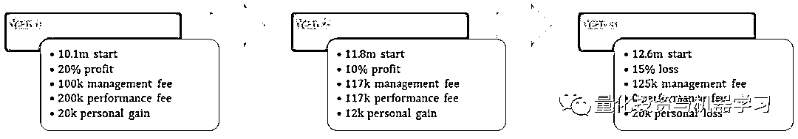

# 一名专业量化交易员的自我修养

> 原文：[`mp.weixin.qq.com/s?__biz=MzAxNTc0Mjg0Mg==&mid=2653295516&idx=1&sn=efb79821674715582242fa814f927d34&chksm=802dd189b75a589f56bd2ee3655fc40305a01be294403fd42d3e93c2cea209bce4916c35b028&scene=27#wechat_redirect`](http://mp.weixin.qq.com/s?__biz=MzAxNTc0Mjg0Mg==&mid=2653295516&idx=1&sn=efb79821674715582242fa814f927d34&chksm=802dd189b75a589f56bd2ee3655fc40305a01be294403fd42d3e93c2cea209bce4916c35b028&scene=27#wechat_redirect)

**标星★****置顶****公众号     **爱你们♥   

作者：Andreas clennow

编辑：1+1=6

**近期原创文章：**

## ♥ [5 种机器学习算法在预测股价的应用（代码+数据）](https://mp.weixin.qq.com/s?__biz=MzAxNTc0Mjg0Mg==&mid=2653290588&idx=1&sn=1d0409ad212ea8627e5d5cedf61953ac&chksm=802dc249b75a4b5fa245433320a4cc9da1a2cceb22df6fb1a28e5b94ff038319ae4e7ec6941f&token=1298662931&lang=zh_CN&scene=21#wechat_redirect)

## ♥ [Two Sigma 用新闻来预测股价走势，带你吊打 Kaggle](https://mp.weixin.qq.com/s?__biz=MzAxNTc0Mjg0Mg==&mid=2653290456&idx=1&sn=b8d2d8febc599742e43ea48e3c249323&chksm=802e3dcdb759b4db9279c689202101b6b154fb118a1c1be12b52e522e1a1d7944858dbd6637e&token=1330520237&lang=zh_CN&scene=21#wechat_redirect)

## ♥ 2 万字干货：[利用深度学习最新前沿预测股价走势](https://mp.weixin.qq.com/s?__biz=MzAxNTc0Mjg0Mg==&mid=2653290080&idx=1&sn=06c50cefe78a7b24c64c4fdb9739c7f3&chksm=802e3c75b759b563c01495d16a638a56ac7305fc324ee4917fd76c648f670b7f7276826bdaa8&token=770078636&lang=zh_CN&scene=21#wechat_redirect)

## ♥ [机器学习在量化金融领域的误用！](http://mp.weixin.qq.com/s?__biz=MzAxNTc0Mjg0Mg==&mid=2653292984&idx=1&sn=3e7efe9fe9452c4a5492d2175b4159ef&chksm=802dcbadb75a42bbdce895c49070c3f552dc8c983afce5eeac5d7c25974b7753e670a0162c89&scene=21#wechat_redirect)

## ♥ [基于 RNN 和 LSTM 的股市预测方法](https://mp.weixin.qq.com/s?__biz=MzAxNTc0Mjg0Mg==&mid=2653290481&idx=1&sn=f7360ea8554cc4f86fcc71315176b093&chksm=802e3de4b759b4f2235a0aeabb6e76b3e101ff09b9a2aa6fa67e6e824fc4274f68f4ae51af95&token=1865137106&lang=zh_CN&scene=21#wechat_redirect)

## ♥ [如何鉴别那些用深度学习预测股价的花哨模型？](https://mp.weixin.qq.com/s?__biz=MzAxNTc0Mjg0Mg==&mid=2653290132&idx=1&sn=cbf1e2a4526e6e9305a6110c17063f46&chksm=802e3c81b759b597d3dd94b8008e150c90087567904a29c0c4b58d7be220a9ece2008956d5db&token=1266110554&lang=zh_CN&scene=21#wechat_redirect)

## ♥ [优化强化学习 Q-learning 算法进行股市](https://mp.weixin.qq.com/s?__biz=MzAxNTc0Mjg0Mg==&mid=2653290286&idx=1&sn=882d39a18018733b93c8c8eac385b515&chksm=802e3d3bb759b42d1fc849f96bf02ae87edf2eab01b0beecd9340112c7fb06b95cb2246d2429&token=1330520237&lang=zh_CN&scene=21#wechat_redirect)

## ♥ [WorldQuant 101 Alpha、国泰君安 191 Alpha](https://mp.weixin.qq.com/s?__biz=MzAxNTc0Mjg0Mg==&mid=2653290927&idx=1&sn=ecca60811da74967f33a00329a1fe66a&chksm=802dc3bab75a4aac2bb4ccff7010063cc08ef51d0bf3d2f71621cdd6adece11f28133a242a15&token=48775331&lang=zh_CN&scene=21#wechat_redirect)

## ♥ [基于回声状态网络预测股票价格（附代码）](https://mp.weixin.qq.com/s?__biz=MzAxNTc0Mjg0Mg==&mid=2653291171&idx=1&sn=485a35e564b45046ff5a07c42bba1743&chksm=802dc0b6b75a49a07e5b91c512c8575104f777b39d0e1d71cf11881502209dc399fd6f641fb1&token=48775331&lang=zh_CN&scene=21#wechat_redirect)

## ♥ [计量经济学应用投资失败的 7 个原因](https://mp.weixin.qq.com/s?__biz=MzAxNTc0Mjg0Mg==&mid=2653292186&idx=1&sn=87501434ae16f29afffec19a6884ee8d&chksm=802dc48fb75a4d99e0172bf484cdbf6aee86e36a95037847fd9f070cbe7144b4617c2d1b0644&token=48775331&lang=zh_CN&scene=21#wechat_redirect)

## ♥ [配对交易千千万，强化学习最 NB！（文档+代码）](http://mp.weixin.qq.com/s?__biz=MzAxNTc0Mjg0Mg==&mid=2653292915&idx=1&sn=13f4ddebcd209b082697a75544852608&chksm=802dcb66b75a4270ceb19fac90eb2a70dc05f5b6daa295a7d31401aaa8697bbb53f5ff7c05af&scene=21#wechat_redirect)

## ♥ [关于高盛在 Github 开源背后的真相！](https://mp.weixin.qq.com/s?__biz=MzAxNTc0Mjg0Mg==&mid=2653291594&idx=1&sn=7703403c5c537061994396e7e49e7ce5&chksm=802dc65fb75a4f49019cec951ac25d30ec7783738e9640ec108be95335597361c427258f5d5f&token=48775331&lang=zh_CN&scene=21#wechat_redirect)

## ♥ [新一代量化带货王诞生！Oh My God！](https://mp.weixin.qq.com/s?__biz=MzAxNTc0Mjg0Mg==&mid=2653291789&idx=1&sn=e31778d1b9372bc7aa6e57b82a69ec6e&chksm=802dc718b75a4e0ea4c022e70ea53f51c48d102ebf7e54993261619c36f24f3f9a5b63437e9e&token=48775331&lang=zh_CN&scene=21#wechat_redirect)

## ♥ [独家！关于定量/交易求职分享（附真实试题）](https://mp.weixin.qq.com/s?__biz=MzAxNTc0Mjg0Mg==&mid=2653291844&idx=1&sn=3fd8b57d32a0ebd43b17fa68ae954471&chksm=802dc751b75a4e4755fcbb0aa228355cebbbb6d34b292aa25b4f3fbd51013fcf7b17b91ddb71&token=48775331&lang=zh_CN&scene=21#wechat_redirect)

## ♥ [Quant 们的身份危机！](https://mp.weixin.qq.com/s?__biz=MzAxNTc0Mjg0Mg==&mid=2653291856&idx=1&sn=729b657ede2cb50c96e92193ab16102d&chksm=802dc745b75a4e53c5018cc1385214233ec4657a3479cd7193c95aaf65642f5f45fa0e465694&token=48775331&lang=zh_CN&scene=21#wechat_redirect)

## ♥ [AQR 最新研究 | 机器能“学习”金融吗](http://mp.weixin.qq.com/s?__biz=MzAxNTc0Mjg0Mg==&mid=2653292710&idx=1&sn=e5e852de00159a96d5dcc92f349f5b58&chksm=802dcab3b75a43a5492bc98874684081eb5c5666aff32a36a0cdc144d74de0200cc0d997894f&scene=21#wechat_redirect)

**你想以交易为生吗？**

如果想。那就好好读读这篇文章吧！

在你阅读这篇文章之前，你需要做一个决定：

  **你想成为一名专业交易员吗？**

**一个好的交易员能赚多少钱?**

大家现在可以想出一个数，你觉得一个好的交易员每年应该赚多少钱？（不是工资或奖金之类的，就是一个交易员实打实赚的）。

那么，我们来告诉你，这也是这篇文章**最重要的一句话**：

**世界上最优秀的交易员可以实现年化约 20%的收益率**

但这并不意味着每年都会达到这么多。有些年份可能更多，有些年份可能更少。在这几十年的时间里，那些年收益率达到 18-23%的公司是世界上最好的。这是我们对 Buffett、Soros、Lynch、Einhorn、Jones、Koulajian、Harding 等人的期望。

因此，如果你认为的数字是 40%、50%、60%甚至 100%，你现在应该开始担心了吧···

**白日梦**

试想一下，我们生活在一个幻想的世界里，有可能实现 100%的年收益率。让我们假设这是真的。

因此，我们把少量的现金投入到某个自称市场奇才的疯狂赚钱机器中并开始交易，假设是 10k。

一年后，我们的账户是 20000，两年后是 40000。7 年后，我们就有了 100 万美元。但让我们有点失望的是，我们不得不等到第 17 年才赚到 10 个亿，在 20 年后才能达到 100 亿美元。

这是一个非常吸引人的白日梦。

通过技能、努力工作、运气或两者的结合，在一年内达到 100%是可能的。但上面是个例外，没有人能达到这样的水平。

但是某某人说他在短时间内就把一小笔钱变成了一大笔钱，现在你付给他钱，他就教你如何达到每年百分之百的收益。

祝你好运！

**回到现实**

让我们再回到现实世界。在这篇文章中，我们假设你有一个你十分满意的交易策略。

你可能已经花了相当多的时间来学习交易。通过看书，做研究等等，甚至也实盘交易了一段时间，并且实盘收益还不错。现在让我们看看你还有什么选择。

1、找一份相关的工作。

2、管理自己的钱。

3、管别人的钱。

**1、找份相关的工作**

找到能挣七位数薪水的工作并不容易。 不过话又说回来，大多数理性的人对 6 位数的中位数已经很满意。

不要低估薪水的价值。如果你在金融行业工作，即使是一个相对较低的职位，你也能挣到六位数的薪水。你可以从公司内部学到很多东西，即使最终你要离开。**在职场中的工作获得的见解可能是非常有价值的。**

金融行业的工作可能并不完全是外界所想的那样。大多数人的工作头衔中带有交易员这个词，但他们的事情却不是这样。大多数是执行交易员，处理其他人的订单指令···

在这个行业里，很少有人能拿到一大笔钱，然后随心所欲地进行交易，非常少。在金融行业工作可能是非常有益的，**但对绝大多数人来说，这只是一份和其他工作一样的工作。**

**他们会窃取你的代码吗?**

也许你已经构建了一些可靠的交易代码，并考虑使用它在金融机构获得一份高薪工作。但你可能担心他们只是想窃取你的代码。那你应该如何保密呢？

这在很大程度上是一种误解，**他们不会对你的代码感兴趣。如果他们是，那他们就是业余的。**

**即使你已经建立了一些非常伟大的东西，它也不可能是完全革命性的。**如果你构建了类似于他们正在使用的东西，即使它不太好，他们也会对你印象深刻。

即使它很好，即使它真的是革命性的，窃取它是没有意义的！**如果你做了一些非常独特的事情，那么雇佣你是有意义的。****接受你的代码意味着他们需要花费大量的时间和金钱去理解和适应你的代码，而不是简单地雇佣构建它的人。**

此外，**如果你曾经创造过伟大的东西，那么你很可能还会再创造一次**。他们当然想雇用你，而不是窃取代码。

超级代码价值连城的概念在很大程度上是一个神话，事实不是这样的！

**怎样才能在这个行业找到工作？**

竞争很激烈！

**如果你没有上过最好的学校，没有最好的成绩，你需要用通过非常努力的工作来弥补。让自己出彩，让别人注意到你。**

没有简单的答案。在这个行业找到一份好工作是非常困难的，你可能会被拒绝很多次。但不要让这些这阻止你前进的脚步！

**管理自己的钱**

如果你靠交易自己的钱来谋生，你将被迫承担过高的风险，以获得足够的钱来维持生活。 这会适得其反。

如果你走这条路，成功的机会就大大减少。当你听说一些非常成功的短线操盘手的故事，他们用自己的钱进行交易，获得了很高的收益，积累了财富，你可以确定你正在面对 2 种情况中的一种。他们要么很极端，要么就是故事本身的价值。

短线操盘手倾向于宣传他们的成功，而对损失保持沉默。关于一年内赚了 500%的交易员的文章不太可能在第二年失去了所有才来更新。

**日内交易的问题归根结底是风险。**

假设你已经做好了成为日内交易员的准备。你有了自己的交易策略，也做了很好的研究，你一直努力工作，存了 10 万元开始交易。

那么你的目标是什么呢？你需要多少钱来维持生活？

有了这个目标，你需要在你的 10 万元上获得 50%的收益。是巴菲特成就的 2 倍多。

为了能够达到这样的收益，你需要承担高度的风险。收益并不是免费的。过去不是，将来也不会是。除非你爸爸开矿的。

技术和努力可以让你用承担略小的风险，但要达到 50%的收益率，你要承担的风险是非常高的！

追求 50%的平均年收益率迟早会让你的账户彻底破产。这相当于把你所有的钱都押在赌桌上。 你可能会幸运几次，但如果你一直留在赌桌上，你迟早会失去一切。

**以交易为生意味着以收益为生。**这意味着根据你的个人情况，将所得用于支付基本需求，如住房、交通等。这里有两个主要的含义：

首先，从生活费用中提取收益意味着你不会得到复利。从长远来看，这将产生实质性的变化。

其次，依赖收益来支付生活费，绝对会推动你承担过高的风险，目的是获得过高的收益。 即日交易者很少有现实的目标，但他们的目标是年化 50%至 100% 。 从长远来看，这肯定会导致灾难。

需要明确的是，**日内交易者失败的主要原因不是缺乏交易技巧，而在于他们承担了如此高的风险，以至于交易技能变得无关紧要。**

这个行业的收益率并不高。 从来都不是。业内最优秀的人士年化能达到 20%左右就可以成为了亿万富翁了。 在这个领域，只要达到 10-15% ，你就可以成为百万富翁了。

**用别人的钱交易**

事实上，在这个行业里，最有意思的是管理别人的钱。

当你管理别人的钱时，你自然会因此得到报酬。你获得的基本费用，通常被称为管理费，为你提供了稳定的收入，**不要低估管理费提供的价值，有些人靠这个就可以养活一个公司！**

有一个基本收入会让你做出理性的决定，而不是追逐不切实际的结果。它将使你瞄准现实的收益，而不灾难的风险。

一个常见的误解是，客户或潜在客户会与收益最高的经理一起投资。对成熟的投资者来说，过高的收益率目标是一个主要的警告信号。

如果有人声称以 10 倍的夏普比率实现 50%的年收益率，没有人会认真对待他们。这就像有人声称以 2 秒跑完 100 米短跑。**非凡的要求需要非凡的证明**。到目前为止，还没有人做到这一点。

你会发现，如果你的目标年化收益率为 15%，而夏普为 0.8，懂行的投资者则会更加关注你。

当然，你仍然可以用自己的钱进行交易。但通过管理其他人的资产，你也可以稳定下来，并可以通过交易过上好日子，而不用承担日内交易的非理性风险。

**比较各种方法**

假设你有 10 万元可以交易，并且有一个可靠的交易策略。现在你想做短线操盘手。

既然你打算靠投资收益生活，你就需要瞄准非常高的收益。接下来很可能会发生这样的情况：

第一年，你开始很好。如下图所示，第一年你就获得了 40%的实际收益。这是一个惊人的收益。远高于合理的长期平均水平。

第二年，以 10 万元重新开始，并获得 20%的净收益，仍然是非常好的一年。但 2 万元够生活吗？

**日内交易风险高！**

**然后不可避免的事情发生了。迟早会有失败的一年。第 3 年，我们又开始了 10 万，损失了 30%。与之前的涨幅相比，这甚至算不上什么大损失。这并不意味着你的交易策略有任何问题。**

**但是，现在你最初的 10 万下减少到了 7 万。你现在的钱比三年前创业的时候还少，今年你一分钱都没赚到。你付不起房租···**

**这是毁灭职业生涯的一年。它可能发生在第三年，第一年或者第七年。**但是这一切终究会发生。****

**现在看看另一种选择。**

**重新开始这三年。这一次，我们筹集了一些外部资产，管理别人的钱和我们自己的钱。筹集 1000 万···**

**对于管理外部资产，我们将收取相当合理的 1+10。也就是 1%的管理费和 10%的绩效费。既然我们现在有了基本收入，我们就可以更负责地进行交易。把波动性减半吧，我们将承担一半的风险，得到一半的收益。**

**第一年，我们有 1010 万。外部的 1000 万，自己的 10 万。如果风险降低到一半，我们最终会得到 20%的收益。你觉得 20%太低了吗？这远远高于行业平均水平，任何理性的客户都会非常高兴。**

**我们不再像第一种方式的第一年在高风险日交易中那样只赚 4 万美元，而是赚到了更多。我们有 10 万的管理费，20 万的绩效费和 2 万个人收入。 **

**第二年，我们开始时有 1180 万美元，你的客户可能会很高兴和你一起，所以前没有必要赎回，而且你不用自己掏钱就能得到报酬。以一半的风险，在今年的收益是 10% ， 结果还是不错，而且你和你的客户都赚了不少钱。**

****

**第三年呢？**

**现在你从第三年开始，有 1260 万。按照同样的逻辑，你现在看到的是 15%的损失，虽然表现不好，但不至于让你一败涂地。在+20 和+10 之后，-15 年是非常合理的比例。如果你向你的客户正确地解释了你的策略和潜在的收益和损失，他会理解你。你还是赚了 12.5 万管理费，减去 2 万的个人损失。**

**你可以继续交易。也许第 4 年将是一个+20%的年份。随着时间的推移，你和你的客户仍在赚钱。**

****一步一步****

**成为专业交易员的第一步是了解业务是如何运作的。学会抛开业余爱好中那些陈词滥调，**了解真正的钱是在哪里赚的，又在哪里赔的**。** 

**当然，还有更多的步骤需要克服。另一个非常重要的是**理解风险**，这一点如果要展开说又是一篇文章了。**

**然后是如何处理策略和模型所产成的问题。一旦所有这些都完成了，你需要学习如何进行融资，如何展示你自己和你的策略，以及如何营销你的投资服务。**

**毫无疑问，这是一个和其他行业一样的行业。这是一个非常有趣且收益颇丰的行业，但它仍然是一个行业。**

**所以问题是，**你想成为一名交易员，还是梦想成为一名交易员。** **你说了算！****

***—End—***

**量化投资与机器学习微信公众号，是业内垂直于**Quant**、**MFE**、**CST、AI**等专业的**主****流量化自媒体**。公众号拥有来自**公募、私募、券商、银行、海外**等众多圈内**18W+**关注者。每日发布行业前沿研究成果和最新量化资讯。**

******你点的每个“在看”，都是对我们最大的鼓励**