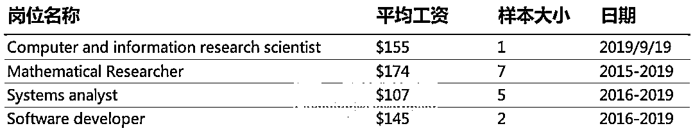

# 数据科学家在对冲基金薪酬几何？告诉你真相！

> 原文：[`mp.weixin.qq.com/s?__biz=MzAxNTc0Mjg0Mg==&mid=2653295460&idx=1&sn=e855452c73bd0b0c528e2009b02f543e&chksm=802dd171b75a5867ec10d061fc8b9b786f8420ad7edc2fb85d74b67a95abdd981923194b4fbe&scene=27#wechat_redirect`](http://mp.weixin.qq.com/s?__biz=MzAxNTc0Mjg0Mg==&mid=2653295460&idx=1&sn=e855452c73bd0b0c528e2009b02f543e&chksm=802dd171b75a5867ec10d061fc8b9b786f8420ad7edc2fb85d74b67a95abdd981923194b4fbe&scene=27#wechat_redirect)

**标星★****置顶****公众号     **爱你们♥   

编辑：1+1=6

**近期原创文章：**

## ♥ [5 种机器学习算法在预测股价的应用（代码+数据）](https://mp.weixin.qq.com/s?__biz=MzAxNTc0Mjg0Mg==&mid=2653290588&idx=1&sn=1d0409ad212ea8627e5d5cedf61953ac&chksm=802dc249b75a4b5fa245433320a4cc9da1a2cceb22df6fb1a28e5b94ff038319ae4e7ec6941f&token=1298662931&lang=zh_CN&scene=21#wechat_redirect)

## ♥ [Two Sigma 用新闻来预测股价走势，带你吊打 Kaggle](https://mp.weixin.qq.com/s?__biz=MzAxNTc0Mjg0Mg==&mid=2653290456&idx=1&sn=b8d2d8febc599742e43ea48e3c249323&chksm=802e3dcdb759b4db9279c689202101b6b154fb118a1c1be12b52e522e1a1d7944858dbd6637e&token=1330520237&lang=zh_CN&scene=21#wechat_redirect)

## ♥ 2 万字干货：[利用深度学习最新前沿预测股价走势](https://mp.weixin.qq.com/s?__biz=MzAxNTc0Mjg0Mg==&mid=2653290080&idx=1&sn=06c50cefe78a7b24c64c4fdb9739c7f3&chksm=802e3c75b759b563c01495d16a638a56ac7305fc324ee4917fd76c648f670b7f7276826bdaa8&token=770078636&lang=zh_CN&scene=21#wechat_redirect)

## ♥ [机器学习在量化金融领域的误用！](http://mp.weixin.qq.com/s?__biz=MzAxNTc0Mjg0Mg==&mid=2653292984&idx=1&sn=3e7efe9fe9452c4a5492d2175b4159ef&chksm=802dcbadb75a42bbdce895c49070c3f552dc8c983afce5eeac5d7c25974b7753e670a0162c89&scene=21#wechat_redirect)

## ♥ [基于 RNN 和 LSTM 的股市预测方法](https://mp.weixin.qq.com/s?__biz=MzAxNTc0Mjg0Mg==&mid=2653290481&idx=1&sn=f7360ea8554cc4f86fcc71315176b093&chksm=802e3de4b759b4f2235a0aeabb6e76b3e101ff09b9a2aa6fa67e6e824fc4274f68f4ae51af95&token=1865137106&lang=zh_CN&scene=21#wechat_redirect)

## ♥ [如何鉴别那些用深度学习预测股价的花哨模型？](https://mp.weixin.qq.com/s?__biz=MzAxNTc0Mjg0Mg==&mid=2653290132&idx=1&sn=cbf1e2a4526e6e9305a6110c17063f46&chksm=802e3c81b759b597d3dd94b8008e150c90087567904a29c0c4b58d7be220a9ece2008956d5db&token=1266110554&lang=zh_CN&scene=21#wechat_redirect)

## ♥ [优化强化学习 Q-learning 算法进行股市](https://mp.weixin.qq.com/s?__biz=MzAxNTc0Mjg0Mg==&mid=2653290286&idx=1&sn=882d39a18018733b93c8c8eac385b515&chksm=802e3d3bb759b42d1fc849f96bf02ae87edf2eab01b0beecd9340112c7fb06b95cb2246d2429&token=1330520237&lang=zh_CN&scene=21#wechat_redirect)

## ♥ [WorldQuant 101 Alpha、国泰君安 191 Alpha](https://mp.weixin.qq.com/s?__biz=MzAxNTc0Mjg0Mg==&mid=2653290927&idx=1&sn=ecca60811da74967f33a00329a1fe66a&chksm=802dc3bab75a4aac2bb4ccff7010063cc08ef51d0bf3d2f71621cdd6adece11f28133a242a15&token=48775331&lang=zh_CN&scene=21#wechat_redirect)

## ♥ [基于回声状态网络预测股票价格（附代码）](https://mp.weixin.qq.com/s?__biz=MzAxNTc0Mjg0Mg==&mid=2653291171&idx=1&sn=485a35e564b45046ff5a07c42bba1743&chksm=802dc0b6b75a49a07e5b91c512c8575104f777b39d0e1d71cf11881502209dc399fd6f641fb1&token=48775331&lang=zh_CN&scene=21#wechat_redirect)

## ♥ [计量经济学应用投资失败的 7 个原因](https://mp.weixin.qq.com/s?__biz=MzAxNTc0Mjg0Mg==&mid=2653292186&idx=1&sn=87501434ae16f29afffec19a6884ee8d&chksm=802dc48fb75a4d99e0172bf484cdbf6aee86e36a95037847fd9f070cbe7144b4617c2d1b0644&token=48775331&lang=zh_CN&scene=21#wechat_redirect)

## ♥ [配对交易千千万，强化学习最 NB！（文档+代码）](http://mp.weixin.qq.com/s?__biz=MzAxNTc0Mjg0Mg==&mid=2653292915&idx=1&sn=13f4ddebcd209b082697a75544852608&chksm=802dcb66b75a4270ceb19fac90eb2a70dc05f5b6daa295a7d31401aaa8697bbb53f5ff7c05af&scene=21#wechat_redirect)

## ♥ [关于高盛在 Github 开源背后的真相！](https://mp.weixin.qq.com/s?__biz=MzAxNTc0Mjg0Mg==&mid=2653291594&idx=1&sn=7703403c5c537061994396e7e49e7ce5&chksm=802dc65fb75a4f49019cec951ac25d30ec7783738e9640ec108be95335597361c427258f5d5f&token=48775331&lang=zh_CN&scene=21#wechat_redirect)

## ♥ [新一代量化带货王诞生！Oh My God！](https://mp.weixin.qq.com/s?__biz=MzAxNTc0Mjg0Mg==&mid=2653291789&idx=1&sn=e31778d1b9372bc7aa6e57b82a69ec6e&chksm=802dc718b75a4e0ea4c022e70ea53f51c48d102ebf7e54993261619c36f24f3f9a5b63437e9e&token=48775331&lang=zh_CN&scene=21#wechat_redirect)

## ♥ [独家！关于定量/交易求职分享（附真实试题）](https://mp.weixin.qq.com/s?__biz=MzAxNTc0Mjg0Mg==&mid=2653291844&idx=1&sn=3fd8b57d32a0ebd43b17fa68ae954471&chksm=802dc751b75a4e4755fcbb0aa228355cebbbb6d34b292aa25b4f3fbd51013fcf7b17b91ddb71&token=48775331&lang=zh_CN&scene=21#wechat_redirect)

## ♥ [Quant 们的身份危机！](https://mp.weixin.qq.com/s?__biz=MzAxNTc0Mjg0Mg==&mid=2653291856&idx=1&sn=729b657ede2cb50c96e92193ab16102d&chksm=802dc745b75a4e53c5018cc1385214233ec4657a3479cd7193c95aaf65642f5f45fa0e465694&token=48775331&lang=zh_CN&scene=21#wechat_redirect)

## ♥ [AQR 最新研究 | 机器能“学习”金融吗](http://mp.weixin.qq.com/s?__biz=MzAxNTc0Mjg0Mg==&mid=2653292710&idx=1&sn=e5e852de00159a96d5dcc92f349f5b58&chksm=802dcab3b75a43a5492bc98874684081eb5c5666aff32a36a0cdc144d74de0200cc0d997894f&scene=21#wechat_redirect)

**正文**

从理论上讲，在对冲基金行业中，数据科学工作是薪酬最高的工作之一。民间传言，刚获得博士学位的人毕业后不久就能在顶级基金找到 50 万美元以上的工作，毕业后不久就能找到七位数的工作，实际情况也可能有出入。

Dore Partnership 的猎头顾问 Richard Pook 说，如果你的数据科学硕士，那么你在对冲基金做数据科学家的薪水不会超过 15 万到 20 万美元。在调查了顶级对冲基金在今年用 H1B 签证聘用的数据科学家的薪资后，这基本上是正确的。

**H1B：**美国签证的一种，指特殊专业人员/临时工作签证 Specialty Occupations/ Temporary Worker Visas (H-1B)。发放给美国公司雇佣的外国籍有专业技能的员工，属于非移民签证的一种。

下表列出了 Citadel、Renaissance Technologies（文艺复兴）、Balyasny、Two Sigma 和 Point72 等公司最近聘用的持 H1B 签证人的工资范围。平均工资远并不是 50 万美元以上，而是相对较低的**14.5 万美元**，最低工资也很低，才**5.8 万美元**。

显然，这些只是工资，因为对冲基金以支付高额奖金而著称。然而，如果你的工资是 15 万美元，你不太可能很快赚到 100 万美元。对冲基金的数据科学工作当然薪水不错，但是金钱和神话不一定相符。

前几天在朋友圈刷屏的国内头部私募幻方量化，**年薪 150 万起**，招聘 5-10 人， 当前管理规模逾百亿：

  这样看，国内给的不低啊。

顺便打个小广告：量化投资与机器学习目前开设了**量化岗位直推**专栏。我们已**与近百家国内外知名公募、私募、券商、期货、金融科技公司等**机构建立了十分密切的合作关系，**免费**为其发布招聘信息，为合作机构寻找量化人才。

这是合作机构发给我们的感谢语：

··· 

**再次感谢国内各大量化金融机构对我们的支持与信任！**

让我们再看看其他岗位：

**文艺复兴**

数据表明，文艺复兴是很多对冲基金中薪酬最高的机构之一。然而，值得注意的是，**工资并不是大多数人为西蒙斯工作的原因。****真正的吸引力是他们向 Medallion 基金投资的机会**，该基金只对员工开放，自 1988 年成立以来，**每年的回报率约为****40%****。**

**桥水**

这份表格上，高薪职位显然是 mission manager，年薪 18.5 万美元。目前还不清楚这指的是什么，但人们猜测这与戴利奥的原则有关，相对较高的薪酬反映出这一更广泛的使命对基金会有多么重要。

**Citadel**

H1B 签证数据显示，Citadel 向其**交易主管**支付了**50 万美元**的薪酬。今年 6 月，一名**大宗商品主管**的薪资为**50 万美元**，而一名**量化交易主管**的薪资为**37.5 万美元**。

**资历较浅的量化研究人员的薪酬从 14.5 万美元到 22 万美元不等**。**电子交易分析师和助理的薪酬为 10.5 万美元或 15 万美元**。

值得注意的是，**H1B 数字不包括奖金**，如果你是一明投资交易人员并能产生 Alpha 收益，那么，上面的数字是相当可观的。在许多情况下，基本工资只占总薪酬的一小部分。

**千禧年**

千禧年对冲基金在全球范围内被分为 200 个独立运营团队，每个团队的**收益与其自身业绩成正比**。 而千禧年的薪酬结构更加细化：**如果你的团队的策略做得好，你就会得到奖励，即使该基金其他团队都出现了亏损。**

这对你的工资和奖金意味着什么？千禧年没有在全球公布薪酬，但该基金的两家英国实体：Millennium Capital Management ltd.（英国控股公司，包括所有行政和投资人员）和 Millennium Capital Partners LLP（主要由投资人员组成）刚刚公布了截至 2018 年 12 月 31 日的年度薪酬信息。

Millennium Capital Partners 的薪酬最高。2018 年，12 名合伙人的平均利润分配为 130 万英镑（高于前一年的 110 万英镑），**收入最高的合伙人获得 650 万英镑**（低于前一年的 700 万英镑）。

除了 12 名合伙人，Millennium Capital Partners 在 2018 年聘用了**127 名专业投资人员**，向他们支付了总计 6900 万英镑的薪资，**平均每人 54.3 万英镑**。

如果加上行政人员，平均薪酬就会下降。Millennium Capital Management 在英国的 279 名员工（142 名专业人士和 137 名管理人员）2018 年的平均薪资为 9200 万英镑，**平均每人 33****万英镑**。

去年，千禧年旗下两家英国公司的营业额都增长了 19%左右，达到 2.26 亿英镑。然而，每个注册实体的成本几乎成比例增加，结果是利润基本停滞不前。

**其他**

下面列出的一些对冲基金是大型雇主。例如，Winton Capital Management 有 375 名员工。BlueBay 有 317 名。Aspect Capital 拥有 142 家公司等等。

除非你是合伙人，否则对冲基金对雇主的吸引力可能会比以前小。在伦敦的高盛（Goldman Sachs）， 2018 年的平均薪资为 31.4 万英镑，高于下表中的大多数对冲基金。一旦你加入了对冲基金，就很难再离开了。

*—End—*

量化投资与机器学习微信公众号，是业内垂直于**Quant**、**MFE**、**CST、AI**等专业的**主****流量化自媒体**。公众号拥有来自**公募、私募、券商、银行、海外**等众多圈内**18W+**关注者。每日发布行业前沿研究成果和最新量化资讯。

你点的每个“在看”，都是对我们最大的鼓励