# 劝退读博！

> 原文：[`mp.weixin.qq.com/s?__biz=MzAxNTc0Mjg0Mg==&mid=2653295445&idx=1&sn=6c4647ace9f8ff6f5a29e56769c51a88&chksm=802dd140b75a5856047258841b4027788ee39ca66802f60e5bd2f727e5d83b8dc438c8fb62e6&scene=27#wechat_redirect`](http://mp.weixin.qq.com/s?__biz=MzAxNTc0Mjg0Mg==&mid=2653295445&idx=1&sn=6c4647ace9f8ff6f5a29e56769c51a88&chksm=802dd140b75a5856047258841b4027788ee39ca66802f60e5bd2f727e5d83b8dc438c8fb62e6&scene=27#wechat_redirect)

**标星★****置顶****公众号     **爱你们♥   

##### 压栗山大 郭一璞 发自 凹非寺 
量子位 报道 | 公众号 QbitAI

**近期原创文章：**

## ♥ [5 种机器学习算法在预测股价的应用（代码+数据）](https://mp.weixin.qq.com/s?__biz=MzAxNTc0Mjg0Mg==&mid=2653290588&idx=1&sn=1d0409ad212ea8627e5d5cedf61953ac&chksm=802dc249b75a4b5fa245433320a4cc9da1a2cceb22df6fb1a28e5b94ff038319ae4e7ec6941f&token=1298662931&lang=zh_CN&scene=21#wechat_redirect)

## ♥ [Two Sigma 用新闻来预测股价走势，带你吊打 Kaggle](https://mp.weixin.qq.com/s?__biz=MzAxNTc0Mjg0Mg==&mid=2653290456&idx=1&sn=b8d2d8febc599742e43ea48e3c249323&chksm=802e3dcdb759b4db9279c689202101b6b154fb118a1c1be12b52e522e1a1d7944858dbd6637e&token=1330520237&lang=zh_CN&scene=21#wechat_redirect)

## ♥ 2 万字干货：[利用深度学习最新前沿预测股价走势](https://mp.weixin.qq.com/s?__biz=MzAxNTc0Mjg0Mg==&mid=2653290080&idx=1&sn=06c50cefe78a7b24c64c4fdb9739c7f3&chksm=802e3c75b759b563c01495d16a638a56ac7305fc324ee4917fd76c648f670b7f7276826bdaa8&token=770078636&lang=zh_CN&scene=21#wechat_redirect)

## ♥ [机器学习在量化金融领域的误用！](http://mp.weixin.qq.com/s?__biz=MzAxNTc0Mjg0Mg==&mid=2653292984&idx=1&sn=3e7efe9fe9452c4a5492d2175b4159ef&chksm=802dcbadb75a42bbdce895c49070c3f552dc8c983afce5eeac5d7c25974b7753e670a0162c89&scene=21#wechat_redirect)

## ♥ [基于 RNN 和 LSTM 的股市预测方法](https://mp.weixin.qq.com/s?__biz=MzAxNTc0Mjg0Mg==&mid=2653290481&idx=1&sn=f7360ea8554cc4f86fcc71315176b093&chksm=802e3de4b759b4f2235a0aeabb6e76b3e101ff09b9a2aa6fa67e6e824fc4274f68f4ae51af95&token=1865137106&lang=zh_CN&scene=21#wechat_redirect)

## ♥ [如何鉴别那些用深度学习预测股价的花哨模型？](https://mp.weixin.qq.com/s?__biz=MzAxNTc0Mjg0Mg==&mid=2653290132&idx=1&sn=cbf1e2a4526e6e9305a6110c17063f46&chksm=802e3c81b759b597d3dd94b8008e150c90087567904a29c0c4b58d7be220a9ece2008956d5db&token=1266110554&lang=zh_CN&scene=21#wechat_redirect)

## ♥ [优化强化学习 Q-learning 算法进行股市](https://mp.weixin.qq.com/s?__biz=MzAxNTc0Mjg0Mg==&mid=2653290286&idx=1&sn=882d39a18018733b93c8c8eac385b515&chksm=802e3d3bb759b42d1fc849f96bf02ae87edf2eab01b0beecd9340112c7fb06b95cb2246d2429&token=1330520237&lang=zh_CN&scene=21#wechat_redirect)

## ♥ [WorldQuant 101 Alpha、国泰君安 191 Alpha](https://mp.weixin.qq.com/s?__biz=MzAxNTc0Mjg0Mg==&mid=2653290927&idx=1&sn=ecca60811da74967f33a00329a1fe66a&chksm=802dc3bab75a4aac2bb4ccff7010063cc08ef51d0bf3d2f71621cdd6adece11f28133a242a15&token=48775331&lang=zh_CN&scene=21#wechat_redirect)

## ♥ [基于回声状态网络预测股票价格（附代码）](https://mp.weixin.qq.com/s?__biz=MzAxNTc0Mjg0Mg==&mid=2653291171&idx=1&sn=485a35e564b45046ff5a07c42bba1743&chksm=802dc0b6b75a49a07e5b91c512c8575104f777b39d0e1d71cf11881502209dc399fd6f641fb1&token=48775331&lang=zh_CN&scene=21#wechat_redirect)

## ♥ [计量经济学应用投资失败的 7 个原因](https://mp.weixin.qq.com/s?__biz=MzAxNTc0Mjg0Mg==&mid=2653292186&idx=1&sn=87501434ae16f29afffec19a6884ee8d&chksm=802dc48fb75a4d99e0172bf484cdbf6aee86e36a95037847fd9f070cbe7144b4617c2d1b0644&token=48775331&lang=zh_CN&scene=21#wechat_redirect)

## ♥ [配对交易千千万，强化学习最 NB！（文档+代码）](http://mp.weixin.qq.com/s?__biz=MzAxNTc0Mjg0Mg==&mid=2653292915&idx=1&sn=13f4ddebcd209b082697a75544852608&chksm=802dcb66b75a4270ceb19fac90eb2a70dc05f5b6daa295a7d31401aaa8697bbb53f5ff7c05af&scene=21#wechat_redirect)

## ♥ [关于高盛在 Github 开源背后的真相！](https://mp.weixin.qq.com/s?__biz=MzAxNTc0Mjg0Mg==&mid=2653291594&idx=1&sn=7703403c5c537061994396e7e49e7ce5&chksm=802dc65fb75a4f49019cec951ac25d30ec7783738e9640ec108be95335597361c427258f5d5f&token=48775331&lang=zh_CN&scene=21#wechat_redirect)

## ♥ [新一代量化带货王诞生！Oh My God！](https://mp.weixin.qq.com/s?__biz=MzAxNTc0Mjg0Mg==&mid=2653291789&idx=1&sn=e31778d1b9372bc7aa6e57b82a69ec6e&chksm=802dc718b75a4e0ea4c022e70ea53f51c48d102ebf7e54993261619c36f24f3f9a5b63437e9e&token=48775331&lang=zh_CN&scene=21#wechat_redirect)

## ♥ [独家！关于定量/交易求职分享（附真实试题）](https://mp.weixin.qq.com/s?__biz=MzAxNTc0Mjg0Mg==&mid=2653291844&idx=1&sn=3fd8b57d32a0ebd43b17fa68ae954471&chksm=802dc751b75a4e4755fcbb0aa228355cebbbb6d34b292aa25b4f3fbd51013fcf7b17b91ddb71&token=48775331&lang=zh_CN&scene=21#wechat_redirect)

## ♥ [Quant 们的身份危机！](https://mp.weixin.qq.com/s?__biz=MzAxNTc0Mjg0Mg==&mid=2653291856&idx=1&sn=729b657ede2cb50c96e92193ab16102d&chksm=802dc745b75a4e53c5018cc1385214233ec4657a3479cd7193c95aaf65642f5f45fa0e465694&token=48775331&lang=zh_CN&scene=21#wechat_redirect)

## ♥ [AQR 最新研究 | 机器能“学习”金融吗](http://mp.weixin.qq.com/s?__biz=MzAxNTc0Mjg0Mg==&mid=2653292710&idx=1&sn=e5e852de00159a96d5dcc92f349f5b58&chksm=802dcab3b75a43a5492bc98874684081eb5c5666aff32a36a0cdc144d74de0200cc0d997894f&scene=21#wechat_redirect)

**前言**

读博，向来是压力山大的活动，博士生工作时间长、压力大、补贴少，同龄人已经成家立业了，博士生还在为论文焦头烂额。

不过现在，读博过程中你的苦你的累，Nature 都知道。

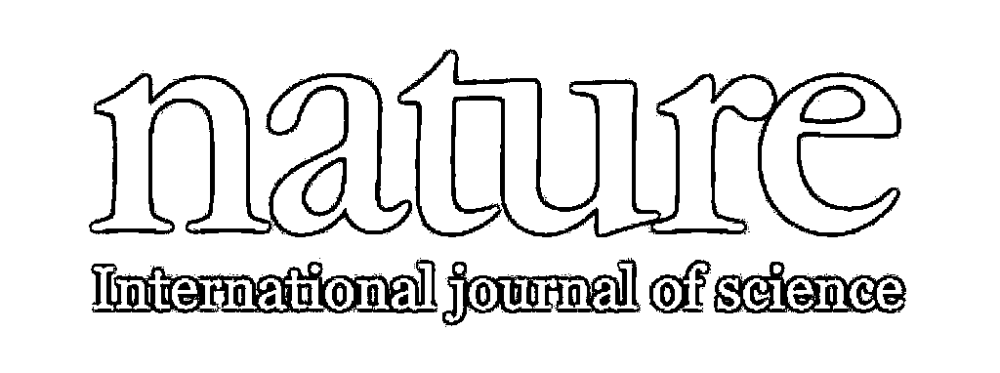

是的，顶级学术期刊 Nature，开展了面向博士生群体的大调查，**6000**余名来自全球各地的博士生，借机大吐苦水，把科研的焦虑、求职的压力、对圈子的不满全都倾诉了出来。

统计一下，这次调查的数据让人大跌眼镜：

36%的博士生都因为**焦虑症或抑郁****症**而寻求过帮助；

21%的博士生都遭遇过**骚扰、歧视和霸凌**行为；

将近八成的博士认为，当前的学术圈风气不正，充斥着各种关系、特权和官僚主义，过于压榨博士生，文化落后有待改进。

而对于最现实的毕业求职问题，七成博士不知道将来该做什么工作，甚至，还有超过 30%的博士生觉得自己**正在读的项目根本就对找工作没有用**。

一个全世界学术圈人士都期望能发论文的顶级期刊，公布了这样惊人的数据，简直是“官方劝退科研”啊！

怪不得，连房东老太太都说“不要读博，不要写代码”（不要赌博，不要吸大麻）了。

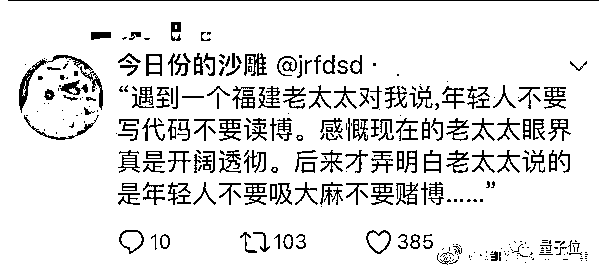

**近四成博士生都是出国党****在职博士也不少**

其实这已是 Nature 的第五次博士生调查，共有超过 6320 份有效数据。

除了英文版，问卷还被翻译成了中葡西法四种文字，因此获得了全球博士生们的广泛参与。其中 36%的问卷来自欧洲，28%来自亚洲（主要是中国人和印度人），27%来自北美和中美洲，非洲、南美和大洋洲的博士生各自只有 3%。

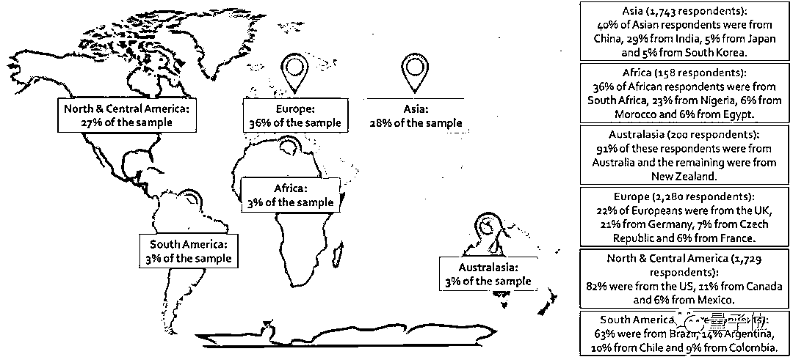

这 6000 位博士生，性别基本上男女各一半，大部分人的年龄都在 25 岁到 34 岁之间，另外还有 12%的博士生不到 25 岁，11%的博士生超过了 35 岁，甚至还有五六十岁的老博士生。

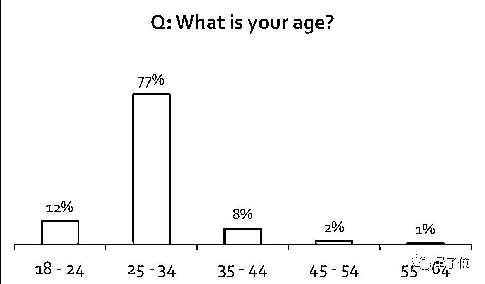

其中 22%的人都处在或上有老、或下有小的状态，需要照顾家庭。

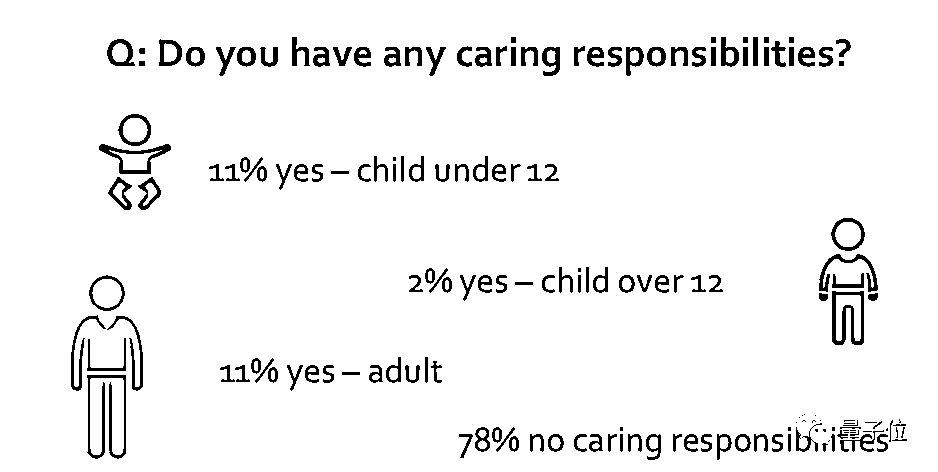

已经当妈妈了的博士生 Fonseca-Hernández，就对边读博边带娃这件事感到十分焦虑，因为学校里没有幼儿园，她把 5 岁的女儿送到了收费很贵的校外日托中心，她感叹，想要同时成为一个优秀的博士生和优秀的父母，实在是太难了。

37%的博士生是出国读的，大部分去了欧洲和美国，出国的原因集中在体验异国文化、本国的资金和博士项目不足以及方便找工作方面。

不过，有不少出国党的压力非常大，一位学气象的古巴女生去了墨西哥读海洋物理博士，发现换一个国家已经很难了，读一个新领域则是难上加难，甚至患上了焦虑症。

19%的博士生是边读博边工作的，他们主要是为了养家糊口，还有少数人是为了提升技能或者刷简历刷人脉。考虑到年龄和家庭环境的因素，35 岁以上的大龄博士生、那些上有老下有小的博士们基本上都有工作。

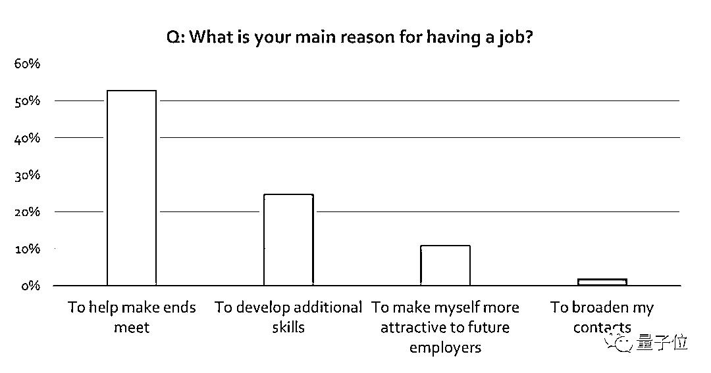

**欧美博士生担心“德不配位”，****亚非拉博士生最愁求职赚钱**

## 读博过程中，人们普遍最头疼的事情是对前途的迷茫，79%的博士生都对自己的职业前景感到不确定，70%的博士生时刻都在关心着除了当博士后之外哪里还有坑可以去谋个教职。

另外他们的学术压力也很大，78%的博士生都觉得难以维持工作生活的平衡，74%的博士生无法在规定时间内完成学业。

钱，也是一个难题。第一个方面是研究经费的问题，68%的博士生都在担心经费；第二个方面，一半的博士生都在担心自己的助学贷款怎么还；第三个方面则是日后生涯的收入问题，67%的博士生都在担忧毕业之后过日子、买房子、养孩子和退休养老的钱要从哪儿来。

看到博士生也哭穷，渣本心理平衡了。

不过，这些令人担忧的问题也是有地域性的：

非洲博士生最愁没钱；

大洋洲博士生最愁没教职；

南美的博士生除了担心找工作的问题，还要操着卖白粉的心，时刻担心政局；

欧洲博士生担心自己和老板的关系、工作生活平衡和心理健康问题；

北美和中美洲的博士生担心自己“德不配位”，专业名词叫“冒名顶替症候群”——总觉得自己如今的地位是靠运气获得的，生怕有一天被人发现自己一无所长，被当成骗子，然后身败名裂。当然，同样富（chi）有（bao）而（le）优（cheng）越（de）的欧洲人有时候也担心这个问题；

苦哈哈的亚洲博士生，发愁的地方可多了去了：找不到工作怎么办、挣不到钱怎么办、博士学位通货膨胀怎么办、家里的老父亲老母亲怎么办……注意，这里不是贩卖焦虑，是 nature 的报告白底黑字写的。

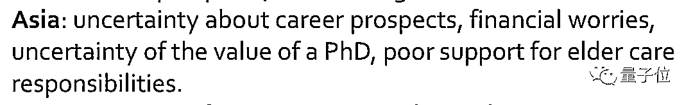

唉，在座的亚洲读者们，你们都生活在 hard 模式里啊。

**不后悔，但满足感越来越低**

## 在美国读博学兽医的 Radhakrishnan 说，现在的博士项目很适合自己，并不觉得孤单。

他对自己的研究项目还有很深的兴趣，想找到一种能在自己的母国印度抑制狂犬病传播的方法。

所以，就算一边读博一边带孩子，一点闲暇都没有，他还是没有后悔读博。

其实，这项调查中，有有 74%的博士生和他一样，对当初读博的决定感到满意 (下图两个绿色柱) ：

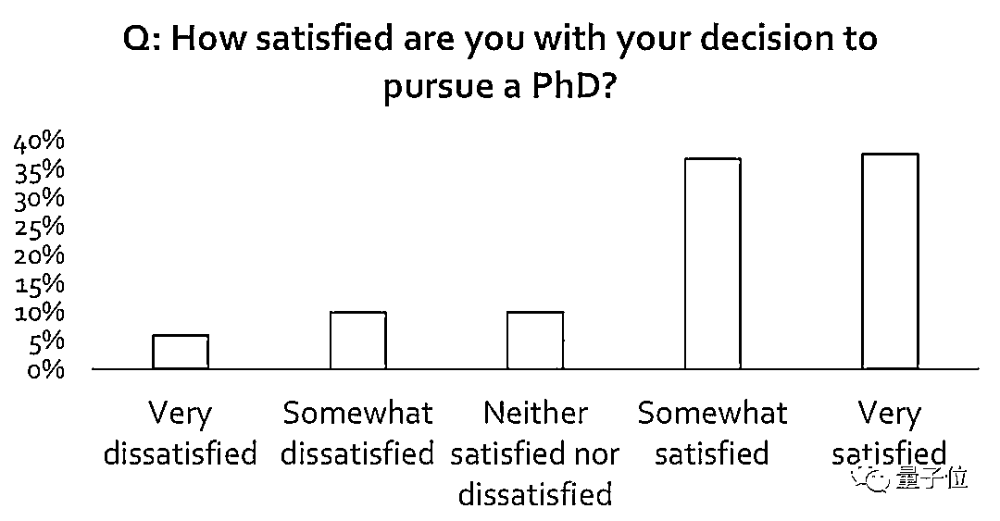

有**75%**的博士生，对自己做研究的独立程度表示满意。

有**67%**对自己和导师的关系表示满意。

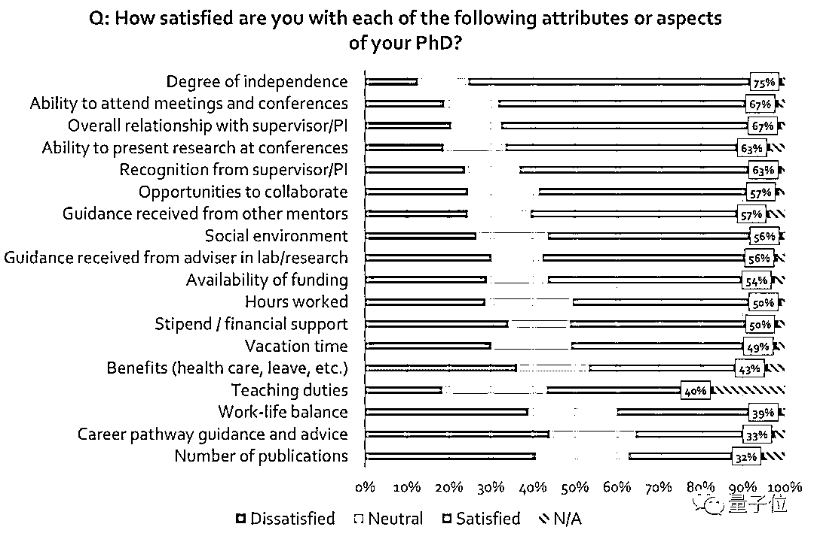

然而，就算说着满意，也依然有挫折和抱怨的情绪。 

有**45%**的博士生表示，随着时间的推移和项目的进行，满意程度下降了。相比之下，**42%**的人认为满意度提升了。

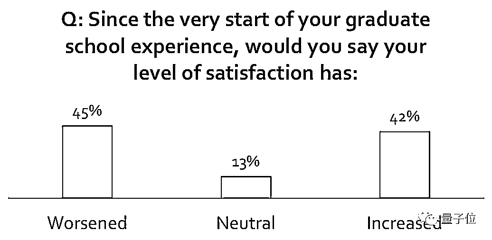

满意度下降的主要原因，很可能是项目的状况达不到自己的预期。 

40%的博士生说，他们读的项目没有达到最初的期望，只有 10%表示超出了最初的期待。

10%这个数字，比起 2017 年有了严重的下滑，那时还有 23%的人认为超出期待。

麦吉尔大学的教育心理学家 Anna Sverdlik 说，这样的调查报告可以帮学生们建立起更现实的认知：

如果知道，周围的大多数人都有冒名顶替症候群；如果知道，自己的满意程度会随着时间而减退，至少还可以提前做些心理准备。

当然，有关学术的挑战只是一部分。

Zhou Yang 是从中国去到美国加州 Scripps Research Institute 读化学博士的，他说：

我原以为只有科研的事情需要担心，但发现还要想着怎样和实验室里的其他人相处，还要想着怎样把自己的项目解释给别人听。除了做实验，还有很多很多要考虑的事。

Yang 也和许多人一样，发现随着时间推移压力越来越大。

除了发够论文才能毕业的压力，还要担心签证问题。回一次家就要重新签证，签证至少也要一个月，又不能请一个月假。所以，Yang 一次都没回过家，不然只会再增加一份压力。

这也是大部分在美国读博的外国人，都会遇到的问题。

**骚扰和歧视随处可见，又不敢说**

调查发现，带有伤害性的行为，时有发生。

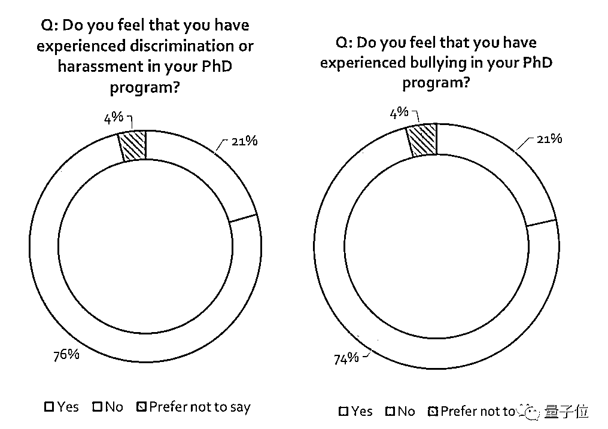

###### △左是骚扰/歧视，右是霸凌

有**21%**的博士生说，他们受到过骚扰或者歧视；表示受到霸凌 (Bullying) 的也有**21%**。超过五分之一。 

分性别看，有**25%**的女博士生说，自己遭受过骚扰或歧视。男生则有**16%**表示自己受到过骚扰或歧视。

分国家看，最严重的是北美 (**24%**) ，最轻微的是澳大利亚+新西兰 (**18%**) 。

有些博士生，还在问卷的评论区详细说明了自己的遭遇或感受。

比如，一位在印度的女生提到，就像性骚扰会有“Me too”运动爆发的瞬间一样，研究生在工作场所遇到的骚扰也需要得到关注。

比如，一位在比利时的女生说，看到过并且自身也有过被导师霸凌和恐吓的经历。学术界顶尖教授，做了错事也不受罚的现象让人震惊，对年轻的学者构成很大的威胁 (包括心理健康受损) 。

在表示受到过霸凌的博士生当中，又有**57%**害怕报复，没有办法自在地讨论自己的处境。

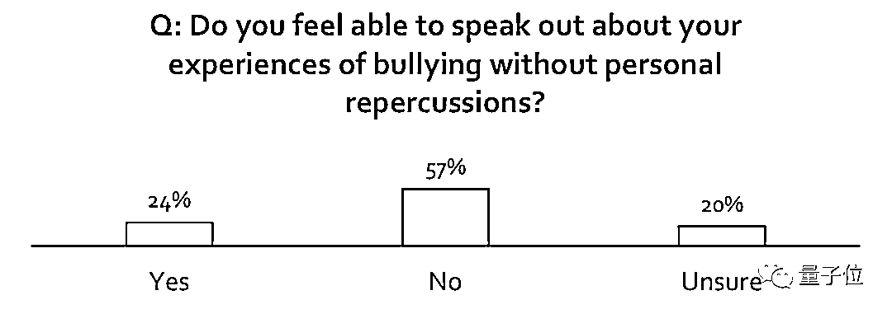

另一方面，工作时长也是博士生们受到的不公对待之一。6000 位博士生里，大约一半都认同：**我读博的大学里就是有长时间工作的文化，包括通宵**。

那么，博士生平均每周工时多少？

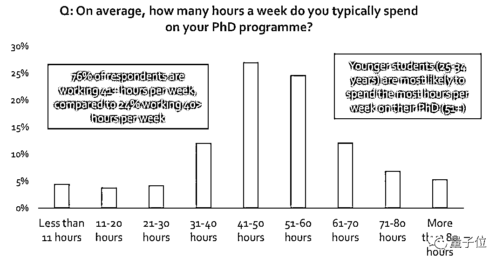

76%的博士生表示，平均每周工作 41 小时以上。其中，41-50 小时的比例 26%，也就是说 6000 位博士生中有接近 50%，平均每周工作超过 50 小时。

而在每周工作 41 小时以上的人当中，有 85%都表示对这个时长不满意。

**三成博士生认为当前项目对求职无益**

## 更加令人忧心的是，长时间的工作，也不是都能得到回报。

只有 26%的博士生认为，他们的博士项目，正在为将来找到一个满意的职位，做着很有力 (Very Well) 的准备。相比之下，有超过 30%的博士生，都认为自己在读的项目没带来什么职业准备 (Very Badly) 。

而在大部分人看来，博士项目给个人带来的最大提升，集中在具体操作层面：比如分析数据、收集数据、做学术演讲、设计实验等等。

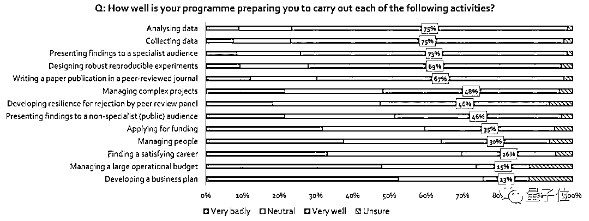

可即便如此，依然有 67%的博士生相信，有了博士学位就能大大改善工作前景。

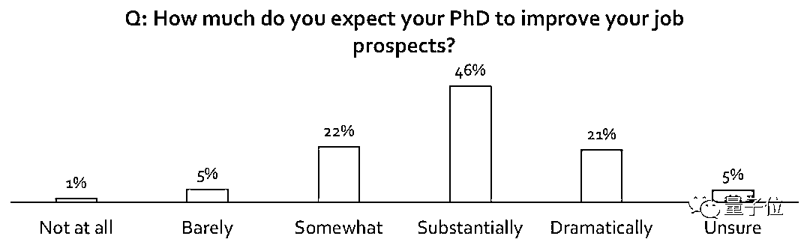

问题是，全球范围内高校提供的岗位都很稀少，但仍然有高达 56%的博士生把学术界作为首选工作领域。相比之下，只有 28%的博士生把工业界作为首选。

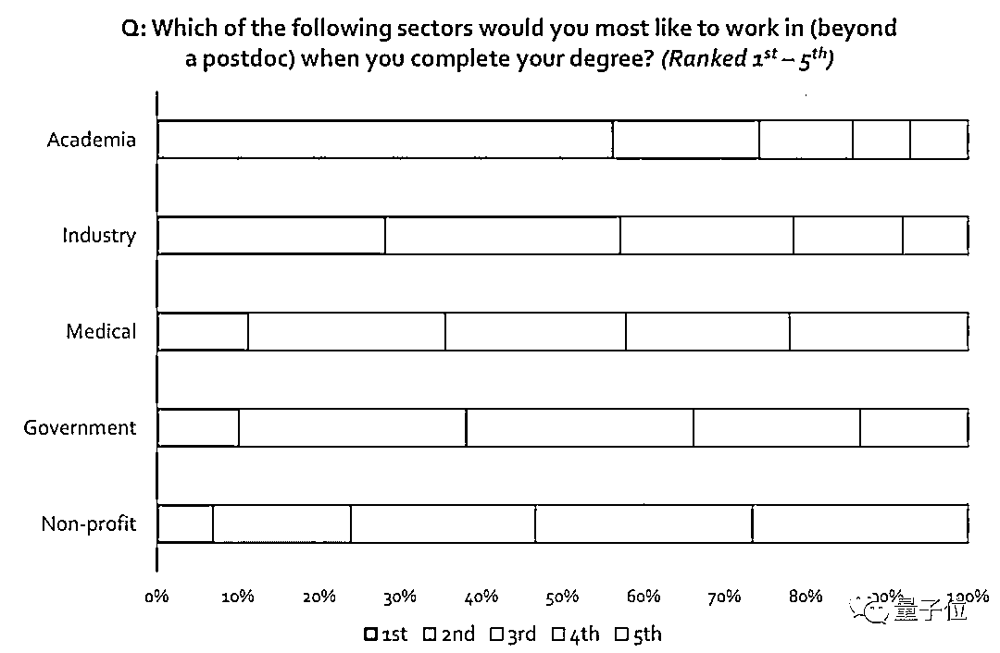

而当被问到博士毕业后立刻就能找到怎样的工作，几乎一半人都回答了**学界的博士后 (46%)** ，排名第二的是**工业界的科学家 (10%)** ，排名第三的答案就是**不知道 (9%)** ：

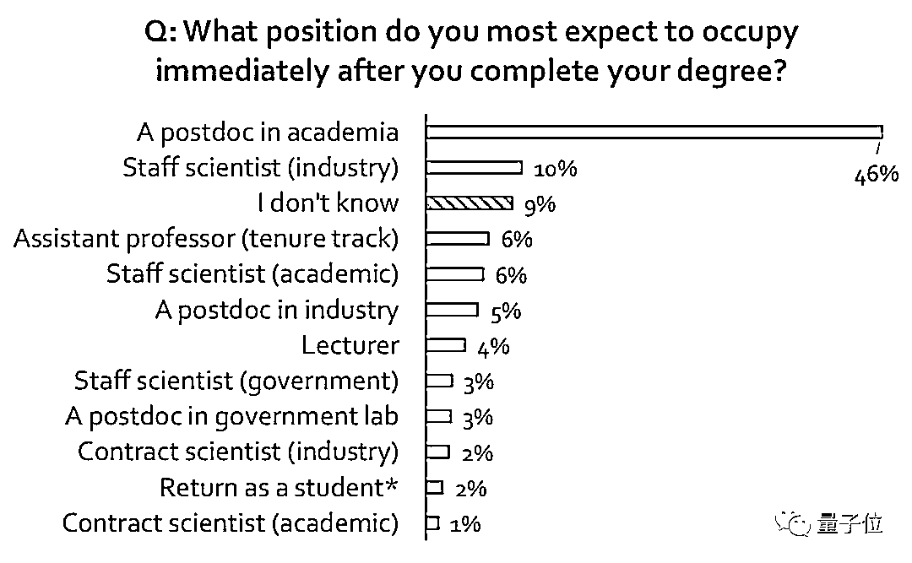

工作形势严峻是博士生面临的一个大问题。 

Matt Murray 是耶鲁大学在读的分子医学博士生，他并不知道自己现在的努力会带来怎样的结果：

我还是怀疑自己读博的决定是不是对的。

有些日子里，感觉一切都很讨厌，只想回家。

调查中有 36%的博士生表示，因为焦虑和抑郁而寻求过帮助。

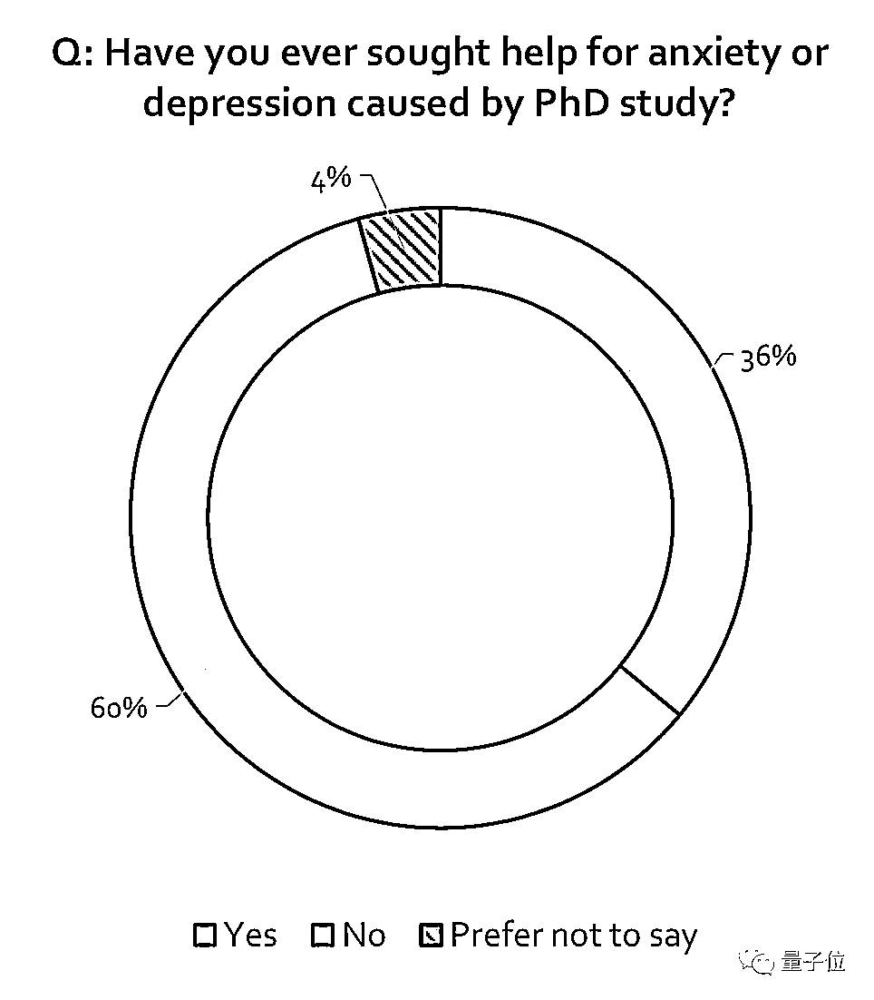

**八成博士生不满学术圈现状**

## 最后，关于整个学术圈的现状，博士们也有话要说。

Nature 统计了博士们对于当前学术体系的评价，结果发现，绝大部分的博士都认为，学术圈真乱。

只有 23%的博士觉得当前的学术体系还不错，在他们之外，更多人觉得这个体系是有问题的，很多时候靠关系，很多事儿不公平，给博士们发的钱太少而压力太大，环境官僚化，整个文化是落后过时的，需要得到改进。

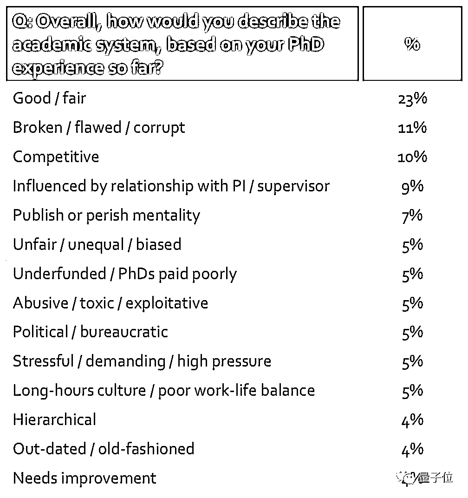

甚至有 8%的人觉得早知如此，就不读博了；还有 24%的人觉得要是重新开始的话一定要换个老板。

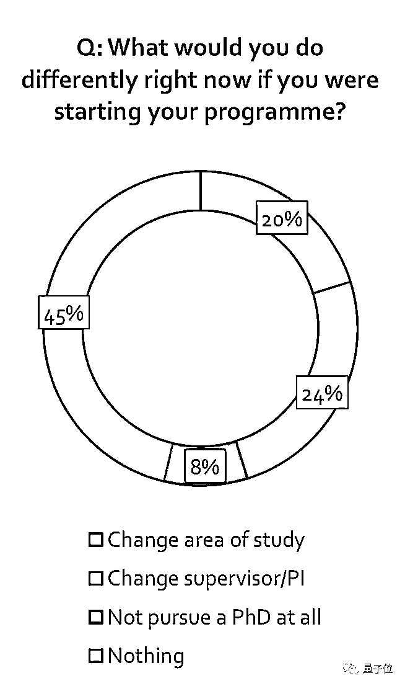

因此，在 Nature 的调查中，一些人表达了博士生涯中的痛苦纠结：

*I cannot emphasize enough the impact on mental health when obtaining a PhD. I wish I were alone in making that statement; however, students in my programme struggled with suicidality, depression and anxiety.*

***读博过程中的心理健康是再重要不过的了，我希望我是唯一讨论这个话题的，但我项目里的同学们一直在沮丧焦虑甚至想自杀的情绪中挣扎。***

不过，终究也有很多人认为博士生涯依然是充满荣光与希望的：

*99% of the time it fails. But that one time it works makes up for all of it.*

***99%的时候都失败了，但是成功的那次能弥补过往的全部。***

希望大家都有那 1%的幸运吧。

原始报告及数据： *https://figshare.com/s/74a5ea79d76ad66a8af8*

*—End—*

量化投资与机器学习微信公众号，是业内垂直于**Quant**、**MFE**、**CST、AI**等专业的**主****流量化自媒体**。公众号拥有来自**公募、私募、券商、银行、海外**等众多圈内**18W+**关注者。每日发布行业前沿研究成果和最新量化资讯。

你点的每个“在看”，都是对我们最大的鼓励