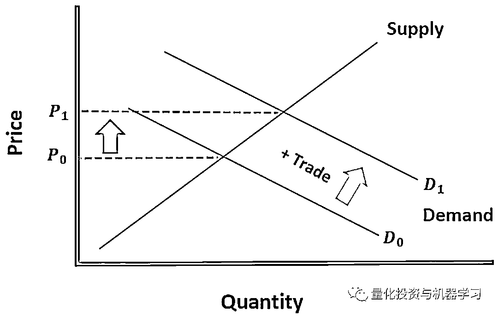
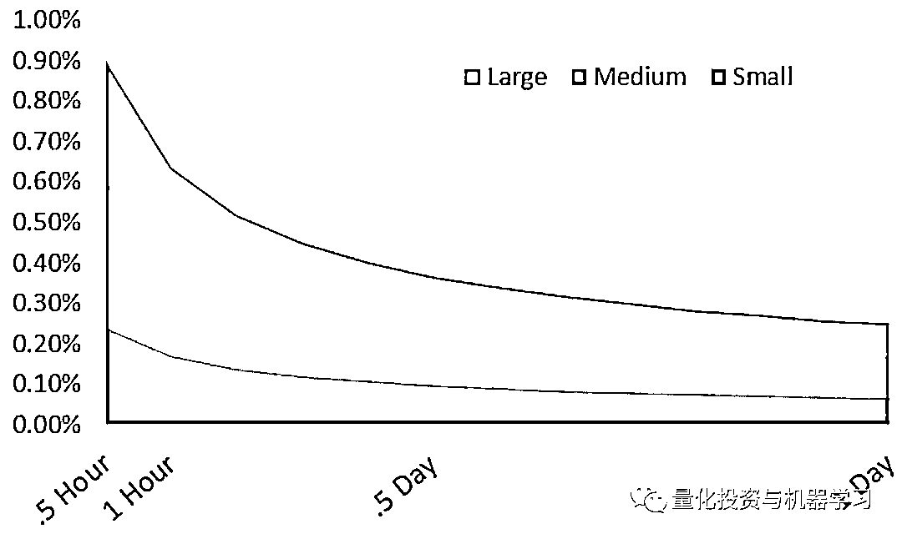
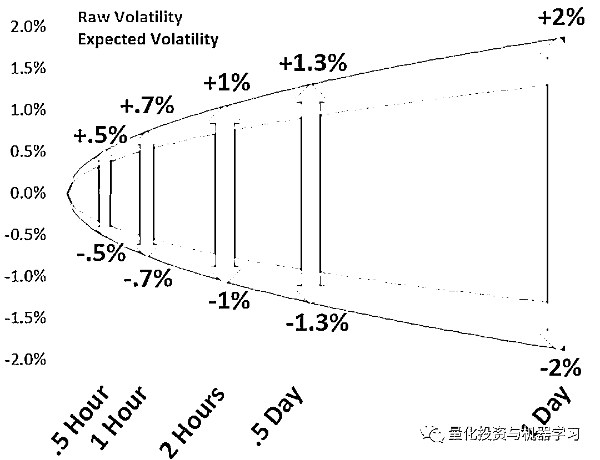
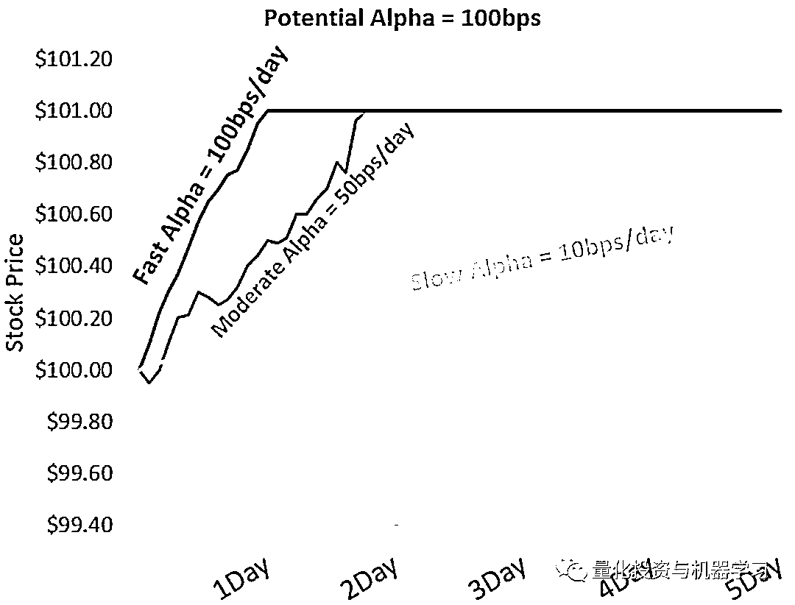
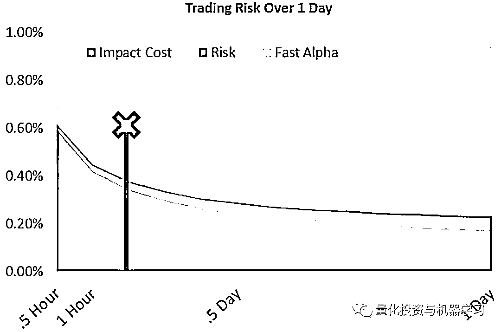
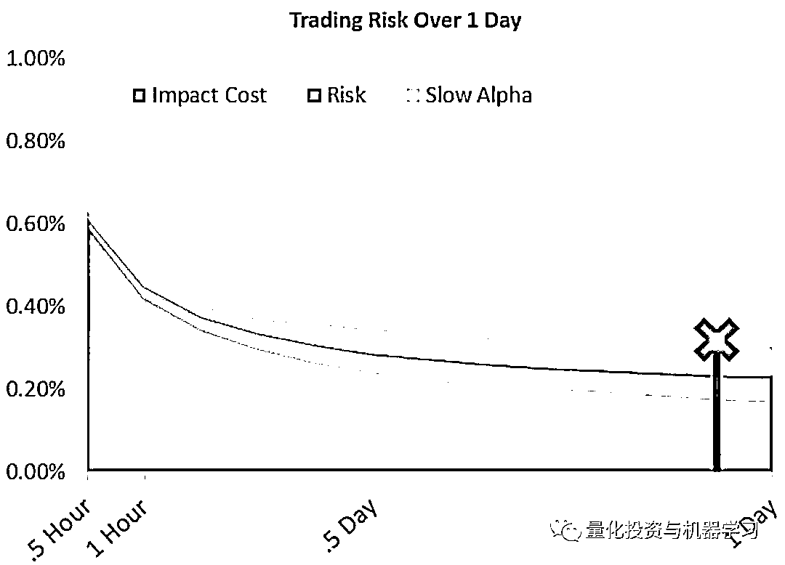

# 你应该以多快的速度执行交易?

> 原文：[`mp.weixin.qq.com/s?__biz=MzAxNTc0Mjg0Mg==&mid=2653295433&idx=1&sn=64827ff1926361143cf1652848f87df1&chksm=802dd15cb75a584a7bdeb667197fc50b8e9effd400030de60ae5ee5ca2b255ec3d22977219a8&scene=27#wechat_redirect`](http://mp.weixin.qq.com/s?__biz=MzAxNTc0Mjg0Mg==&mid=2653295433&idx=1&sn=64827ff1926361143cf1652848f87df1&chksm=802dd15cb75a584a7bdeb667197fc50b8e9effd400030de60ae5ee5ca2b255ec3d22977219a8&scene=27#wechat_redirect)

**标星★****置顶****公众号     **爱你们♥   

作者：Phil Mackintosh

编译：1+1=6

**近期原创文章：**

## ♥ [5 种机器学习算法在预测股价的应用（代码+数据）](https://mp.weixin.qq.com/s?__biz=MzAxNTc0Mjg0Mg==&mid=2653290588&idx=1&sn=1d0409ad212ea8627e5d5cedf61953ac&chksm=802dc249b75a4b5fa245433320a4cc9da1a2cceb22df6fb1a28e5b94ff038319ae4e7ec6941f&token=1298662931&lang=zh_CN&scene=21#wechat_redirect)

## ♥ [Two Sigma 用新闻来预测股价走势，带你吊打 Kaggle](https://mp.weixin.qq.com/s?__biz=MzAxNTc0Mjg0Mg==&mid=2653290456&idx=1&sn=b8d2d8febc599742e43ea48e3c249323&chksm=802e3dcdb759b4db9279c689202101b6b154fb118a1c1be12b52e522e1a1d7944858dbd6637e&token=1330520237&lang=zh_CN&scene=21#wechat_redirect)

## ♥ 2 万字干货：[利用深度学习最新前沿预测股价走势](https://mp.weixin.qq.com/s?__biz=MzAxNTc0Mjg0Mg==&mid=2653290080&idx=1&sn=06c50cefe78a7b24c64c4fdb9739c7f3&chksm=802e3c75b759b563c01495d16a638a56ac7305fc324ee4917fd76c648f670b7f7276826bdaa8&token=770078636&lang=zh_CN&scene=21#wechat_redirect)

## ♥ [机器学习在量化金融领域的误用！](http://mp.weixin.qq.com/s?__biz=MzAxNTc0Mjg0Mg==&mid=2653292984&idx=1&sn=3e7efe9fe9452c4a5492d2175b4159ef&chksm=802dcbadb75a42bbdce895c49070c3f552dc8c983afce5eeac5d7c25974b7753e670a0162c89&scene=21#wechat_redirect)

## ♥ [基于 RNN 和 LSTM 的股市预测方法](https://mp.weixin.qq.com/s?__biz=MzAxNTc0Mjg0Mg==&mid=2653290481&idx=1&sn=f7360ea8554cc4f86fcc71315176b093&chksm=802e3de4b759b4f2235a0aeabb6e76b3e101ff09b9a2aa6fa67e6e824fc4274f68f4ae51af95&token=1865137106&lang=zh_CN&scene=21#wechat_redirect)

## ♥ [如何鉴别那些用深度学习预测股价的花哨模型？](https://mp.weixin.qq.com/s?__biz=MzAxNTc0Mjg0Mg==&mid=2653290132&idx=1&sn=cbf1e2a4526e6e9305a6110c17063f46&chksm=802e3c81b759b597d3dd94b8008e150c90087567904a29c0c4b58d7be220a9ece2008956d5db&token=1266110554&lang=zh_CN&scene=21#wechat_redirect)

## ♥ [优化强化学习 Q-learning 算法进行股市](https://mp.weixin.qq.com/s?__biz=MzAxNTc0Mjg0Mg==&mid=2653290286&idx=1&sn=882d39a18018733b93c8c8eac385b515&chksm=802e3d3bb759b42d1fc849f96bf02ae87edf2eab01b0beecd9340112c7fb06b95cb2246d2429&token=1330520237&lang=zh_CN&scene=21#wechat_redirect)

## ♥ [WorldQuant 101 Alpha、国泰君安 191 Alpha](https://mp.weixin.qq.com/s?__biz=MzAxNTc0Mjg0Mg==&mid=2653290927&idx=1&sn=ecca60811da74967f33a00329a1fe66a&chksm=802dc3bab75a4aac2bb4ccff7010063cc08ef51d0bf3d2f71621cdd6adece11f28133a242a15&token=48775331&lang=zh_CN&scene=21#wechat_redirect)

## ♥ [基于回声状态网络预测股票价格（附代码）](https://mp.weixin.qq.com/s?__biz=MzAxNTc0Mjg0Mg==&mid=2653291171&idx=1&sn=485a35e564b45046ff5a07c42bba1743&chksm=802dc0b6b75a49a07e5b91c512c8575104f777b39d0e1d71cf11881502209dc399fd6f641fb1&token=48775331&lang=zh_CN&scene=21#wechat_redirect)

## ♥ [计量经济学应用投资失败的 7 个原因](https://mp.weixin.qq.com/s?__biz=MzAxNTc0Mjg0Mg==&mid=2653292186&idx=1&sn=87501434ae16f29afffec19a6884ee8d&chksm=802dc48fb75a4d99e0172bf484cdbf6aee86e36a95037847fd9f070cbe7144b4617c2d1b0644&token=48775331&lang=zh_CN&scene=21#wechat_redirect)

## ♥ [配对交易千千万，强化学习最 NB！（文档+代码）](http://mp.weixin.qq.com/s?__biz=MzAxNTc0Mjg0Mg==&mid=2653292915&idx=1&sn=13f4ddebcd209b082697a75544852608&chksm=802dcb66b75a4270ceb19fac90eb2a70dc05f5b6daa295a7d31401aaa8697bbb53f5ff7c05af&scene=21#wechat_redirect)

## ♥ [关于高盛在 Github 开源背后的真相！](https://mp.weixin.qq.com/s?__biz=MzAxNTc0Mjg0Mg==&mid=2653291594&idx=1&sn=7703403c5c537061994396e7e49e7ce5&chksm=802dc65fb75a4f49019cec951ac25d30ec7783738e9640ec108be95335597361c427258f5d5f&token=48775331&lang=zh_CN&scene=21#wechat_redirect)

## ♥ [新一代量化带货王诞生！Oh My God！](https://mp.weixin.qq.com/s?__biz=MzAxNTc0Mjg0Mg==&mid=2653291789&idx=1&sn=e31778d1b9372bc7aa6e57b82a69ec6e&chksm=802dc718b75a4e0ea4c022e70ea53f51c48d102ebf7e54993261619c36f24f3f9a5b63437e9e&token=48775331&lang=zh_CN&scene=21#wechat_redirect)

## ♥ [独家！关于定量/交易求职分享（附真实试题）](https://mp.weixin.qq.com/s?__biz=MzAxNTc0Mjg0Mg==&mid=2653291844&idx=1&sn=3fd8b57d32a0ebd43b17fa68ae954471&chksm=802dc751b75a4e4755fcbb0aa228355cebbbb6d34b292aa25b4f3fbd51013fcf7b17b91ddb71&token=48775331&lang=zh_CN&scene=21#wechat_redirect)

## ♥ [Quant 们的身份危机！](https://mp.weixin.qq.com/s?__biz=MzAxNTc0Mjg0Mg==&mid=2653291856&idx=1&sn=729b657ede2cb50c96e92193ab16102d&chksm=802dc745b75a4e53c5018cc1385214233ec4657a3479cd7193c95aaf65642f5f45fa0e465694&token=48775331&lang=zh_CN&scene=21#wechat_redirect)

## ♥ [AQR 最新研究 | 机器能“学习”金融吗](http://mp.weixin.qq.com/s?__biz=MzAxNTc0Mjg0Mg==&mid=2653292710&idx=1&sn=e5e852de00159a96d5dcc92f349f5b58&chksm=802dcab3b75a43a5492bc98874684081eb5c5666aff32a36a0cdc144d74de0200cc0d997894f&scene=21#wechat_redirect)

这个问题的简短回答是：

**看情况！**

**交易是一种权衡**

交易速度太快，你的成本就会增加，从而减少你获得的投资收益。

如果交易速度太慢，你可能会错过价格合理的流动性，结果只能看到股票价格远离你的入手价格。这也降低了收益率。

**市场影响：交易规模越大，成本越高**

市场影响指的是你的交易对价格的影响程度。

从根本上说，这就是供求经济学。如果你要求更多的流动性，你将影响股票的短期供求，这将增加你需要支付的平均价格。

**新的交易改变供给和需求，导致价格波动（称为市场影响）**

关于交易对市场产生影响的事实，已经有大量成熟的文献，以及已经发展起来的交易成本分析(TCA)行业来衡量和管理这一事实。

大多数研究表明，成本随着规模、波动性和利差的增加而增加。这与 ITG 的数据一致，该数据显示，美国大盘股平均每笔交易的亏损成本约为 30 个基点，而价差较大且波动性较大的小盘股每笔交易的亏损成本约为 80 个基点。

大多数模型通常将交易“规模”定义为日均交易量（ADV）的百分比。当你看到所有股票的成交量相当稳定时，这种方法就有意义了。它还有一个优势，就是可以计算出每家公司的相对规模。显然，购买市值约 1 万亿美元的 AMZN 股票，要比购买市值 2 亿美元流通股的 50%容易得多。

研究还表明，成本的增长速度在下降。因此，交易规模翻倍并不意味着完成更大订单所需的价格波动也翻倍。当你考虑到股价上涨本身可能会吸引卖家，有助于抵消后来的买盘时，这就说得通了。

TCA 的数据还表明，同样的订单交易速度变慢也会降低影响。这是有道理的，因为交易放缓让卖家有更多时间组织对冲交易。它还能更好地隐藏你的购买足迹，因为每个购买订单移动的供求曲线更少。

**交易规模和速度的增加影响其交易成本**

**缓慢的交易需要更多的时间来执行**

然而，交易速度放慢并非没有风险。

交易变慢的问题在于你需要更长的时间来完成交易。例如，如果你想交易 10%的股票 ADV，你可以：

1、立即交易。

2、在一小时内交易。

3、在几个小时内以 30%的参与率交易。

4、每天以 10%的参与率交易。

5、以 2%的参与率（每天 2%x5 天=10%）交易一周。

立即交易由于没有时间去寻找合适的卖家，你的大量购买通常会造成更大的市场影响。

在一个小时之内进行一笔非常大的交易，这将需要跨越利差，并在新的、更高的水平上公布流动性，以确保优先于其他买家，从而推高价格。

然而，如果你将订单分散在 5 天内，你的交易就会变得几乎难以察觉，从而抵消了市场上所有其他的噪音和交易。

放慢订单速度的问题在于，财经新闻或市场人气在较长时间内发生变化的可能性要大得多。市场风险随着时间的根函数而增加（下图）。在一天的过程中，30-vol 的股票预计平均上涨或下跌 2%。这意味着，在大约三分之一的日子里，它的移动幅度甚至更大。

一周后，风险增加到 5%，这超过了你的基金经理希望赚到的钱，导致错失机会和投资组合表现不佳。

**降低速度会降低成本，但会增加风险**

然而，1%的风险并不等于 1%的成本。

从技术上讲，风险的“预期成本”为 0，因为“随机”的市场波动既可能带来好处，也可能带来坏处。因此，如果你大量交易，市场风险的成本将被抵消。

也就是说，由于随机价格变动可能导致不平等的交易执行，避免不必要的风险是有道理的。基金经理习惯于使用风险厌恶因素来降低风险。在我们的优化下面，我们给 5%的权重，以避免风险。

我们还注意到，订单薄并没有暴露在一天的所有风险。在公开市场进行的交易被锁定在最小化这部分交易的风险上。只有在当天收盘时的交易才能看到 2%的预期风险。我们在上面的图中用较深的红色区域展示了如何处理订单以降低风险。

**Alpha：衰变速度可快可慢**

还有另一个更重要的理由，那就是加快交易速度。

你可能不是唯一一个有相同想法人。如果是这种情况，如果你走得太慢，你的竞争对手就会在你等待的过程中积累头寸并影响价格。

这通常被称为 Alpha 的衰变或机会成本。

从理论上讲，每笔交易都应该有 Alpha，即期望跑赢市场。如果你认为你买的股票不会上涨，你最好不要交易。

Alpha 衰减率是计算最佳交易速度的重要因素。

估计 Alpha 衰减最常见的方法是观察交易信号之前、期间和之后股市的变化。在下面的图中，我们展示了三个 1%Alpha 衰减的不同例子：

1、在你的交易信号出现之前，该股票就已经有了上涨的势头，在与市场同步表现之前，它还会很快再上涨 1%，以每天 50 个基点的速度递减。

2、100 个基点的预期 Alpha 在一天内全部衰减，这可能发生在已知的新闻事件或数据发布中。

3、没有新消息的价值型股票可能会出现日衰减 10 个基点的 Alpha。

**Alpha 会因交易信号或策略而变化**

在一个完美的世界里，你会在投资组合进行真正的交易之前解决这个问题。然而，在现实世界中，通常你已经在交易了。这使得从市场影响中分离 Alpha 衰减变得更加困难。尽管如此，这也意味着你的整个订单不会暴露在一整天中。

试图将交易影响与 Alpha 衰减区分开来的一种方法是观察逆转。如果你的交易速度太快，很有可能在你买完后，股票会稍微回落，而 Alpha 衰减很强的股票可能会在你完成交易后继续上涨。

**你应该以多快的速度交易**

上面的每一个指标都是基于完成相同规模交易所花费的时间而变化的。我们可以简单地把这些因素加起来，看看在不同的交易速度下，总成本是如何变化的。我们看到的是典型的 U 型，如下图所示：

1、交易太快，交易成本超过了其他收益（蓝色区域）。

2、交易太慢，错过了 Alpha 影响你的收益。

3、即使 Alpha 较低，将交易暴露于不必要的风险也不是最佳的选择。

从概念上讲，正确的交易速度是亏损最小的速度。U 型曲线的最低点在下面的图表中用“X”标出。

这两个例子也强调了 Alpha 衰减越高，交易速度就会越快。

**Alpha 衰减快的情况**

**Alpha 衰减慢的情况**

像我们市场上的大多数东西一样，最优的解决方案是存在的，但它需要在流动性和成本之间进行权衡，再加上一些数学运算，才能做出正确的选择。

*—End—*

量化投资与机器学习微信公众号，是业内垂直于**Quant**、**MFE**、**CST、AI**等专业的**主****流量化自媒体**。公众号拥有来自**公募、私募、券商、银行、海外**等众多圈内**18W+**关注者。每日发布行业前沿研究成果和最新量化资讯。你点的每个“在看”，都是对我们最大的鼓励