# XGBoost：股价预测进阶（附代码）

> 原文：[`mp.weixin.qq.com/s?__biz=MzAxNTc0Mjg0Mg==&mid=2653295392&idx=1&sn=a82657a2e2180a4a6414066bc9cc7a74&chksm=802dd135b75a5823f4dcb5da77484cb755f942cf8376ce8b2900cce07e4caed589077e8ca80a&scene=27#wechat_redirect`](http://mp.weixin.qq.com/s?__biz=MzAxNTc0Mjg0Mg==&mid=2653295392&idx=1&sn=a82657a2e2180a4a6414066bc9cc7a74&chksm=802dd135b75a5823f4dcb5da77484cb755f942cf8376ce8b2900cce07e4caed589077e8ca80a&scene=27#wechat_redirect)


**标星★****置顶****公众号     **爱你们♥   

作者：Yibin Ng

编译：1+1=6

**近期原创文章：**

## ♥ [5 种机器学习算法在预测股价的应用（代码+数据）](https://mp.weixin.qq.com/s?__biz=MzAxNTc0Mjg0Mg==&mid=2653290588&idx=1&sn=1d0409ad212ea8627e5d5cedf61953ac&chksm=802dc249b75a4b5fa245433320a4cc9da1a2cceb22df6fb1a28e5b94ff038319ae4e7ec6941f&token=1298662931&lang=zh_CN&scene=21#wechat_redirect)

## ♥ [Two Sigma 用新闻来预测股价走势，带你吊打 Kaggle](https://mp.weixin.qq.com/s?__biz=MzAxNTc0Mjg0Mg==&mid=2653290456&idx=1&sn=b8d2d8febc599742e43ea48e3c249323&chksm=802e3dcdb759b4db9279c689202101b6b154fb118a1c1be12b52e522e1a1d7944858dbd6637e&token=1330520237&lang=zh_CN&scene=21#wechat_redirect)

## ♥ 2 万字干货：[利用深度学习最新前沿预测股价走势](https://mp.weixin.qq.com/s?__biz=MzAxNTc0Mjg0Mg==&mid=2653290080&idx=1&sn=06c50cefe78a7b24c64c4fdb9739c7f3&chksm=802e3c75b759b563c01495d16a638a56ac7305fc324ee4917fd76c648f670b7f7276826bdaa8&token=770078636&lang=zh_CN&scene=21#wechat_redirect)

## ♥ [机器学习在量化金融领域的误用！](http://mp.weixin.qq.com/s?__biz=MzAxNTc0Mjg0Mg==&mid=2653292984&idx=1&sn=3e7efe9fe9452c4a5492d2175b4159ef&chksm=802dcbadb75a42bbdce895c49070c3f552dc8c983afce5eeac5d7c25974b7753e670a0162c89&scene=21#wechat_redirect)

## ♥ [基于 RNN 和 LSTM 的股市预测方法](https://mp.weixin.qq.com/s?__biz=MzAxNTc0Mjg0Mg==&mid=2653290481&idx=1&sn=f7360ea8554cc4f86fcc71315176b093&chksm=802e3de4b759b4f2235a0aeabb6e76b3e101ff09b9a2aa6fa67e6e824fc4274f68f4ae51af95&token=1865137106&lang=zh_CN&scene=21#wechat_redirect)

## ♥ [如何鉴别那些用深度学习预测股价的花哨模型？](https://mp.weixin.qq.com/s?__biz=MzAxNTc0Mjg0Mg==&mid=2653290132&idx=1&sn=cbf1e2a4526e6e9305a6110c17063f46&chksm=802e3c81b759b597d3dd94b8008e150c90087567904a29c0c4b58d7be220a9ece2008956d5db&token=1266110554&lang=zh_CN&scene=21#wechat_redirect)

## ♥ [优化强化学习 Q-learning 算法进行股市](https://mp.weixin.qq.com/s?__biz=MzAxNTc0Mjg0Mg==&mid=2653290286&idx=1&sn=882d39a18018733b93c8c8eac385b515&chksm=802e3d3bb759b42d1fc849f96bf02ae87edf2eab01b0beecd9340112c7fb06b95cb2246d2429&token=1330520237&lang=zh_CN&scene=21#wechat_redirect)

## ♥ [WorldQuant 101 Alpha、国泰君安 191 Alpha](https://mp.weixin.qq.com/s?__biz=MzAxNTc0Mjg0Mg==&mid=2653290927&idx=1&sn=ecca60811da74967f33a00329a1fe66a&chksm=802dc3bab75a4aac2bb4ccff7010063cc08ef51d0bf3d2f71621cdd6adece11f28133a242a15&token=48775331&lang=zh_CN&scene=21#wechat_redirect)

## ♥ [基于回声状态网络预测股票价格（附代码）](https://mp.weixin.qq.com/s?__biz=MzAxNTc0Mjg0Mg==&mid=2653291171&idx=1&sn=485a35e564b45046ff5a07c42bba1743&chksm=802dc0b6b75a49a07e5b91c512c8575104f777b39d0e1d71cf11881502209dc399fd6f641fb1&token=48775331&lang=zh_CN&scene=21#wechat_redirect)

## ♥ [计量经济学应用投资失败的 7 个原因](https://mp.weixin.qq.com/s?__biz=MzAxNTc0Mjg0Mg==&mid=2653292186&idx=1&sn=87501434ae16f29afffec19a6884ee8d&chksm=802dc48fb75a4d99e0172bf484cdbf6aee86e36a95037847fd9f070cbe7144b4617c2d1b0644&token=48775331&lang=zh_CN&scene=21#wechat_redirect)

## ♥ [配对交易千千万，强化学习最 NB！（文档+代码）](http://mp.weixin.qq.com/s?__biz=MzAxNTc0Mjg0Mg==&mid=2653292915&idx=1&sn=13f4ddebcd209b082697a75544852608&chksm=802dcb66b75a4270ceb19fac90eb2a70dc05f5b6daa295a7d31401aaa8697bbb53f5ff7c05af&scene=21#wechat_redirect)

## ♥ [关于高盛在 Github 开源背后的真相！](https://mp.weixin.qq.com/s?__biz=MzAxNTc0Mjg0Mg==&mid=2653291594&idx=1&sn=7703403c5c537061994396e7e49e7ce5&chksm=802dc65fb75a4f49019cec951ac25d30ec7783738e9640ec108be95335597361c427258f5d5f&token=48775331&lang=zh_CN&scene=21#wechat_redirect)

## ♥ [新一代量化带货王诞生！Oh My God！](https://mp.weixin.qq.com/s?__biz=MzAxNTc0Mjg0Mg==&mid=2653291789&idx=1&sn=e31778d1b9372bc7aa6e57b82a69ec6e&chksm=802dc718b75a4e0ea4c022e70ea53f51c48d102ebf7e54993261619c36f24f3f9a5b63437e9e&token=48775331&lang=zh_CN&scene=21#wechat_redirect)

## ♥ [独家！关于定量/交易求职分享（附真实试题）](https://mp.weixin.qq.com/s?__biz=MzAxNTc0Mjg0Mg==&mid=2653291844&idx=1&sn=3fd8b57d32a0ebd43b17fa68ae954471&chksm=802dc751b75a4e4755fcbb0aa228355cebbbb6d34b292aa25b4f3fbd51013fcf7b17b91ddb71&token=48775331&lang=zh_CN&scene=21#wechat_redirect)

## ♥ [Quant 们的身份危机！](https://mp.weixin.qq.com/s?__biz=MzAxNTc0Mjg0Mg==&mid=2653291856&idx=1&sn=729b657ede2cb50c96e92193ab16102d&chksm=802dc745b75a4e53c5018cc1385214233ec4657a3479cd7193c95aaf65642f5f45fa0e465694&token=48775331&lang=zh_CN&scene=21#wechat_redirect)

## ♥ [AQR 最新研究 | 机器能“学习”金融吗](http://mp.weixin.qq.com/s?__biz=MzAxNTc0Mjg0Mg==&mid=2653292710&idx=1&sn=e5e852de00159a96d5dcc92f349f5b58&chksm=802dcab3b75a43a5492bc98874684081eb5c5666aff32a36a0cdc144d74de0200cc0d997894f&scene=21#wechat_redirect)

**前言**

公众号之前发表过一篇文章：

[**严谨解决 5 种机器学习算法在预测股价的应用（代码+数据）**](https://mp.weixin.qq.com/s?__biz=MzAxNTc0Mjg0Mg==&mid=2653290588&idx=1&sn=1d0409ad212ea8627e5d5cedf61953ac&scene=21#wechat_redirect)

我们已经对 XGBoost 进行了验证，但在本文中，我们将更详细地研究 XGBoost 在股票价格预测问题中的性能。这篇文章和上篇文章的主要区别如下：

1、在上篇文章中，我们只预测了**1 天**，本篇文章中我们预测了未来**21 天**（大约一个月）。为此，我们使用了一种称为递归预测的技术。

2、在上篇文章中，我们使用了一个简单的训练-验证-测试，本篇文章中我们使用了移动窗口验证的方法来执行超参数调优。

3、在上篇文章中，我们只使用前 N 天的价格作为特征，但是在这里，我们引入了更多的特征。

**数据准备**

我们的目标是预测 Vanguard Total Stock Market ETF（VTI）的每日复权收盘价，使用前 N 天的数据。在这个例子中，我们将使用 VTI 在 2013-01-02 到 2018-12-28 这 6 年的历史价格，数据集如下：

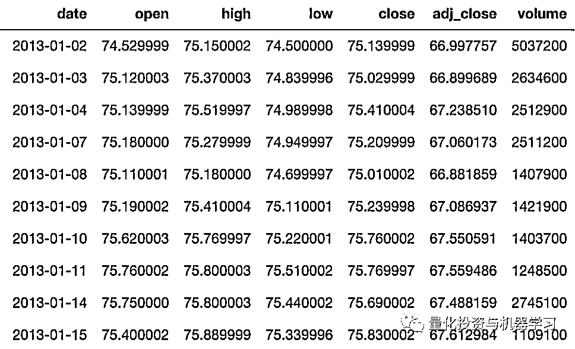

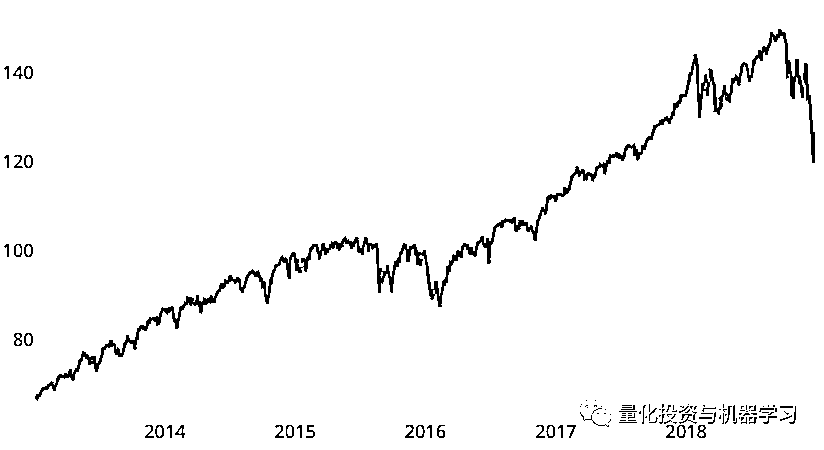

收盘价

为了有效地评估 XGBoost 的性能，仅在一个日期运行一个预测是不够的。相反，我们将在此数据集中的不同日期执行各种预测，并对结果进行平均。

为了评估我们的方法的有效性，我们将使用均方根误差（RMSE），平均绝对百分比误差（MAPE）和平均绝对误差（MAE）指标。对于所有指标，值越低，预测效果越好。与上一篇文章类似，我们将使用 Last Value 方法来对结果进行基准测试。

**探索性数据分析（EDA）**

EDA 是机器学习项目的重要组成部分，它可以帮助我们获得对数据集的良好“感知”。正如我们将在下面看到的，EDA 过程涉及到创建可视化来帮助大家更好地理解数据集。

下图显示了每个月复权收盘价法人均值。可以根据数据集推断，就平均值而言，后几个月的值比前几个月的值高。

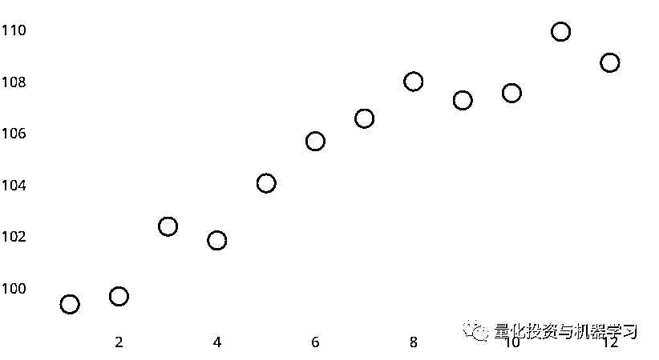

月

下面的图显示了该月复权收盘价每一天均值。平均而言，有一个向上倾斜的趋势，即月底的价格高于前几天。

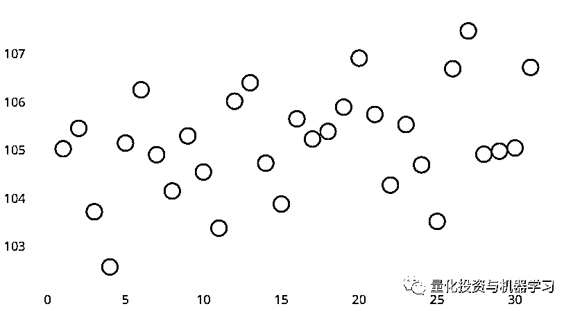

天

下面的图显示了一周中收盘价每一天均值。平均而言，复权后的周四和周五收盘价高于一周中的其它日期。

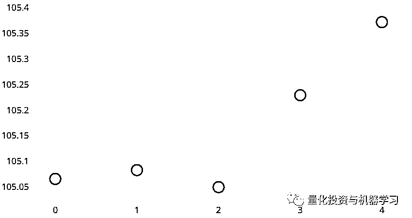

周

下面的热力图显示了经复权后的前几日收盘价与当日收盘价的相关性。很明显，经复权后的收盘价越接近当日，它们之间的相关性就越高。因此，在预测中应该使用与前 10 天复权收盘价相关的特征。

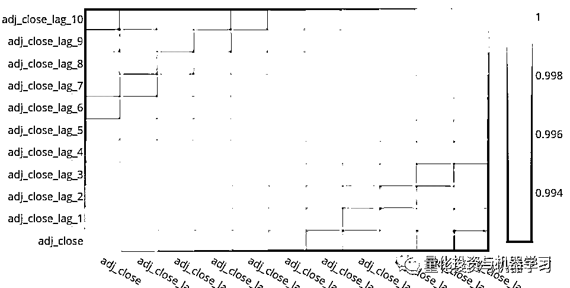

基于上面的 EDA，我们推断与日期相关的特征可能对模型有帮助。此外，复权后的前 10 天收盘价与目标变量高度相关。这些都是我们将用于下面的特征工程的重要信息。

**特征工程**

特征工程是一个创造性的过程，是任何机器学习项目中最重要的部分之一。为了强调特征工程的重要性，Andrew Ng 有一句很好的名言值得分享：

***Coming up with features is difficult, time-consuming, requires expert knowledge. “Applied machine learning” is basically feature engineering.***

*Andrew Ng, Machine Learning and AI via Brain simulations*

在本文中，我们将生成以下特征：

**1、过去 10 天的复权收盘价**

**2、year**
**3、month**
**4、week**
**5、dayofmonth**
**6、dayofweek**
**7、dayofyear**
**8、is_month_end**
**9、is_month_start**
**10、is_quarter_end**
**11、is_quarter_start**
**12、is_year_end**
**13、is_year_start**

使用 fastai 包很容易生成与日期相关的特征，比如：

```py
from fastai.tabular import add_datepart

add_datepart(df, 'date', drop=False)
df.drop('Elapsed', axis=1, inplace=True)
```

使用上面的代码后，dataframe 看起来如下所示。 列 adj_close 将是目标列。为简洁起见，我们省略了过去 N 天调整后的收盘价的相关信息。

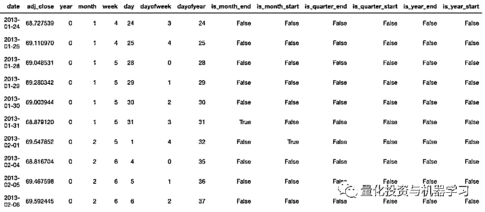

下面的热力图显示了这些特征与目标列之间的相关性。特征 year 与复权收盘价格高度相关。这并不奇怪，因为在我们的数据集中，有一个向上倾斜的趋势，年份越大，复权收盘价越高。其他特征与目标变量没有高度的相关性。从下面，我们还发现，is_year_start 有空值。这是因为每年中的第一天从来都不是交易日，所以我们从模型中移除了这个特征。

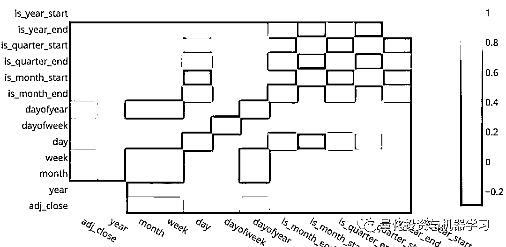

下面的条形图，显示了前 10 个最重要特征的重要性得分。这是对 2017-01-03 的预测得到的，而其他日期的预测对特征重要性的排名可能不同。正如预期的那样，复权的前一天收盘价格是最重要的特征。

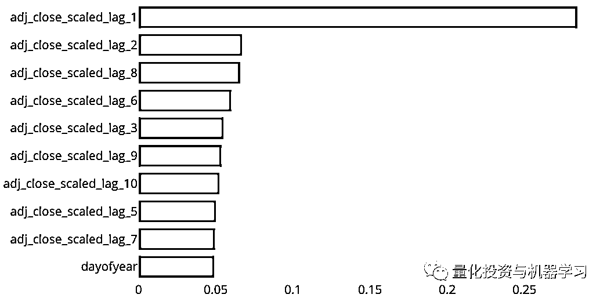

**训练、验证和测试**

要进行预测，我们需要训练和验证数据。我们将使用 3 年的数据作为训练集，这相当于 756 天，因为一年中大约有 252 个交易日（252*3 = 756）。我们将使用接下来 1 年的数据来执行验证，相当于 252 天。换句话说，对于做出的每个预测，我们需要 756+252 = 1008 天的数据来进行模型训练和验证。模型将使用训练集进行训练，而模型超参数将使用验证集进行调优。要调优超参数，我们将使用移动窗口验证方法。

下面举例说明了训练规模为 756 天、验证规模为 40 天和预测周期为 40 天的情况。

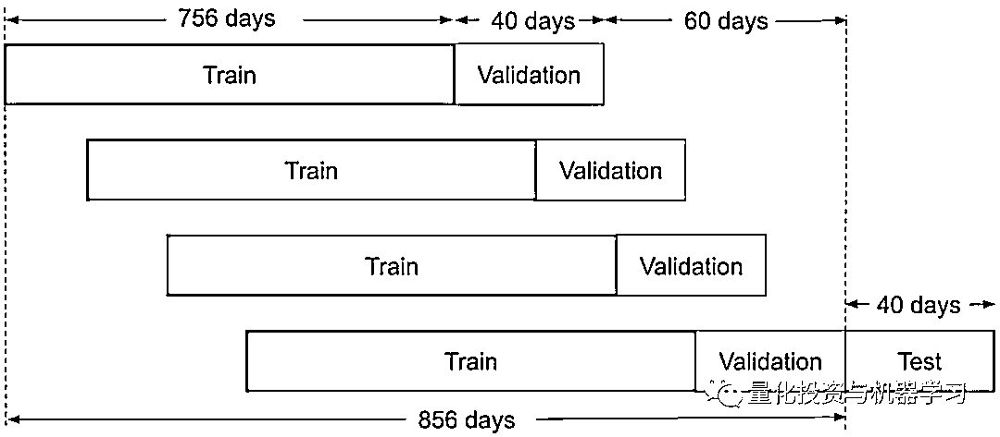

在时间序列预测中，训练、验证、策略必须按时序进行，这一点非常重要！如果不按照此流程去做，将导致模型中的“信息泄漏”。

接下来，我们将使用 XGBoost 在我们的测试集中进行几天的预测，即:

2017–01–03、2017–03–06、2017–05–04、2017–07–05、2017–09–01、2017–11–01、2018–01–03、2018–03–06、2018–05–04、2018–07–05、2018–09–04、2018–11–01

对于上述 12 个预测，我们将使用 21 天的预测周期。我们将使用紧接预测日期之前的 1008 天作为训练和验证集（756:252）。

**特征缩放**

特征缩放在这里很重要，因为，如果你看上面的复权收盘价，按时间顺序分割的训练和测试集几乎总是会导复权收盘价格比训练价格更高。 具体看这篇文章：[**严谨解决 5 种机器学习算法在预测股价的应用（代码+数据）**](https://mp.weixin.qq.com/s?__biz=MzAxNTc0Mjg0Mg==&mid=2653290588&idx=1&sn=1d0409ad212ea8627e5d5cedf61953ac&scene=21#wechat_redirect)

对每个样本复权收盘价的每个特征组，我们将其缩放为均值 0 和方差 1。例如，如果我们对第 T 天进行预测，我们将采用最近 N 天（从第 T 天到第 T 天）的复权收盘价，并将其调整为均值 0 和方差 1。在训练、验证和测试集上对滞后特征执行相同的操作。日期特征没有缩放。然后我们使用这些比例 lag 特征和日期特征来进行预测。预测值也将被缩放，然后我们使用它们相应的均值和方差对它们进行逆变换。

**超参数调整**

我们在验证集上执行超参数调优。对于 XGBoost，有几个超参数可以调优，包括 n_estimators、max_depth、learning_rate、min_child_weight、subsample、gamma、colsample_bytree 和 colsample_bylevel。有关这些超参数的定义，请参见这里：

*https://xgboost.readthedocs.io/en/latest/python/python_api.html#module-xgboost.sklearn*

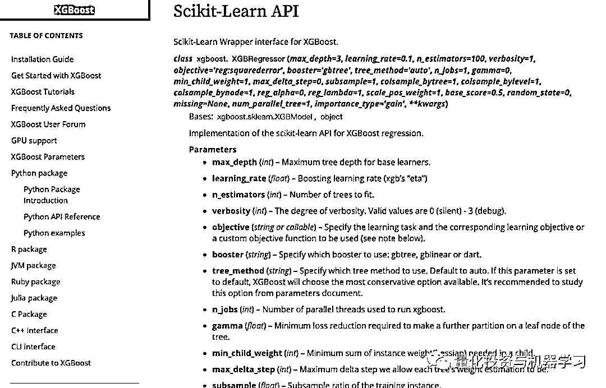

要查看超参数调优的有效性，我们可以查看验证集对 2018-11-01 年的预测。下面显示的预测没有超参数调优，我们只是使用了包中的默认值：

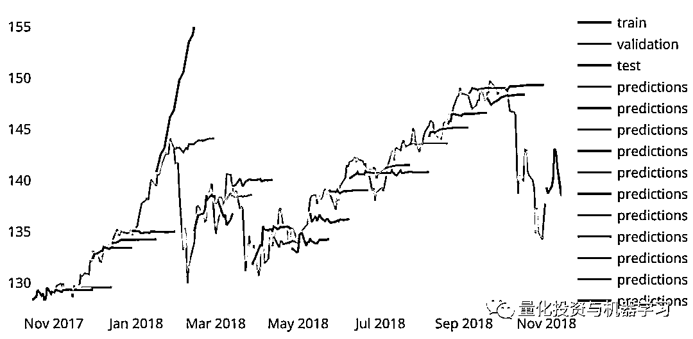

# 下面显示了在超参数调优之后在相同验证集上的预测。你可以看到 1 月 18 日的预测更加稳定了。

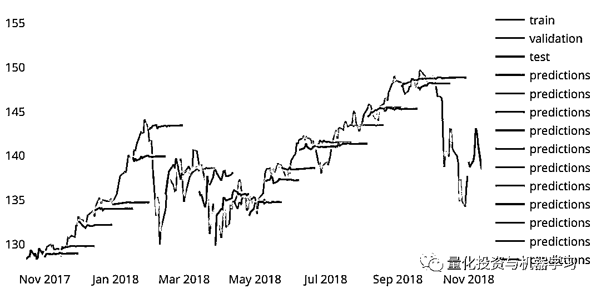

调优前后的超参数：

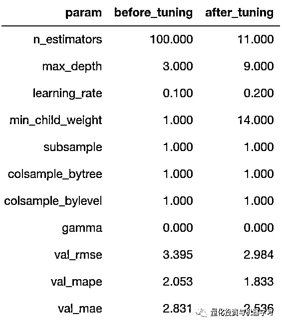

显然，调优后的超参数与默认值有很大不同。此外，在对验证的 RMSE、MAPE 和 MAE 进行调优之后，验证结果如预期一样下降。例如，RMSE 从 3.395 下降到 2.984。

**模型应用**

在执行了上述的步骤后，我们现在准备在测试集上执行预测。在这种情况下，我们的预测周期是 21 天，这意味着我们需要为每个预测生成 21 个预测。我们不能一次生成所有 21 个预测，因为在生成第 T 天的预测之后，我们需要将这个预测反馈到我们的模型中，以生成第 T+1 天的预测，以此类推，直到我们得到所有 21 个预测。这就是所谓的递归预测。因此，我们实现了如下流程图的逻辑：

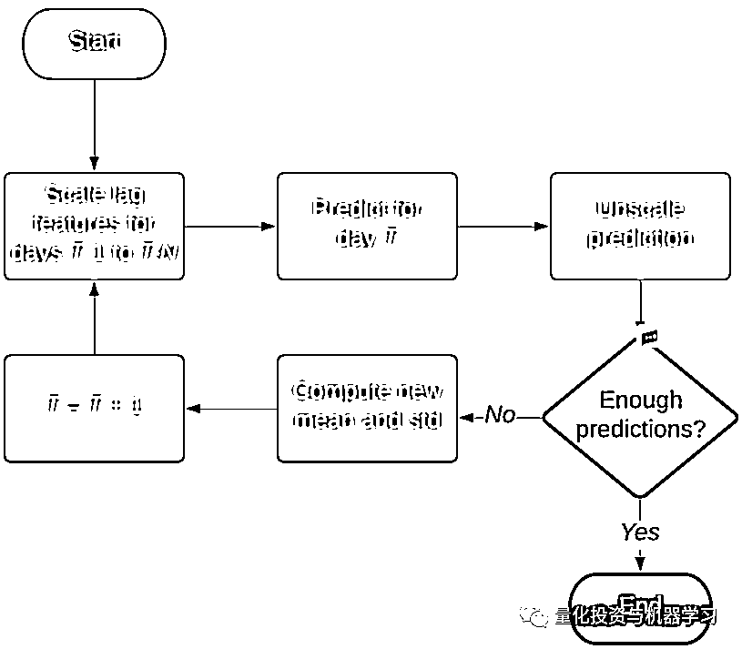

对于预测范围内的每一天，我们需要预测，取消预测的规模，计算最后 N 个值的新平均值和标准偏差，调整最近 N 天的收盘价，然后再次预测。

**结果**

下面显示了每个预测的 RMSE、MAPE 和 MAE，以及使用各自验证集调整的相应最佳超参数。

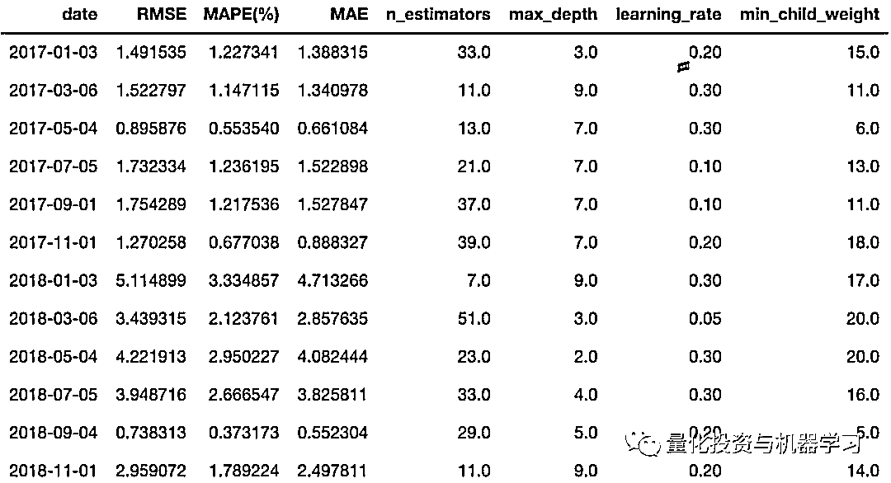

# 使用移动窗口验证方法在测试集上应用 XGBoost 的结果如下所示：

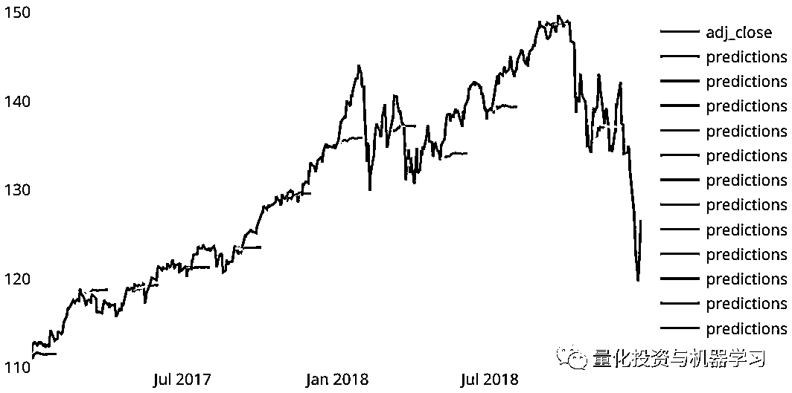

另一种可视化预测的方法是将每个预测与其实际值绘制图。如果我们预测的完美，每个预测应该在对角线 y=x 线上。


最后，以下是我们的模型对照 Last Value 方法得出的结果：

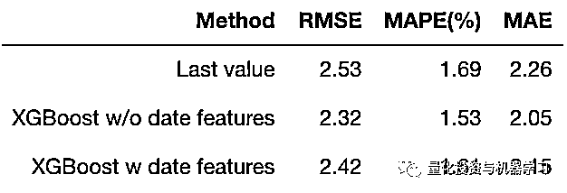

与 Last Value 方法相比，使用带有或不带有日期特征的 XGBoost 可以获得更好的性能。有趣的是，省略日期特征比包含日期特征（2.32 vs. 2.42）得到的 RMSE 稍微低一些。正如我们前面发现的，日期特征与目标变量的相关性很低，并且可能对模型没有太大帮助。

**部分代码展示**

由于代码太多，只展示部分，获取全部见文末：

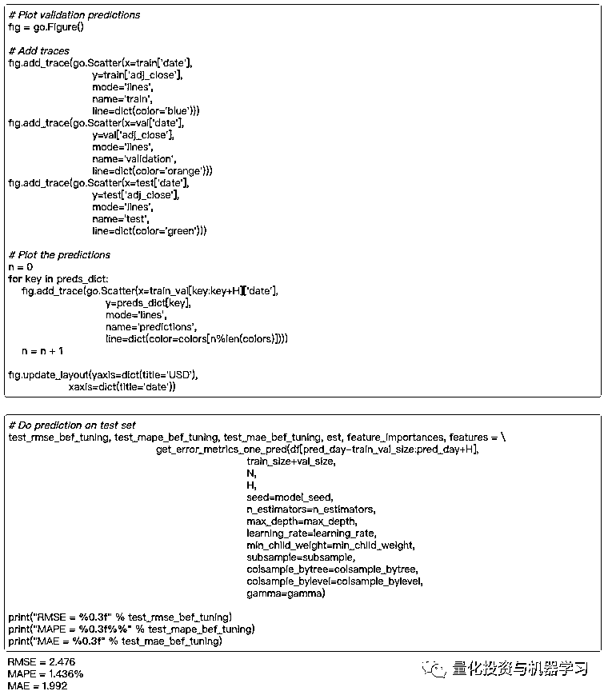

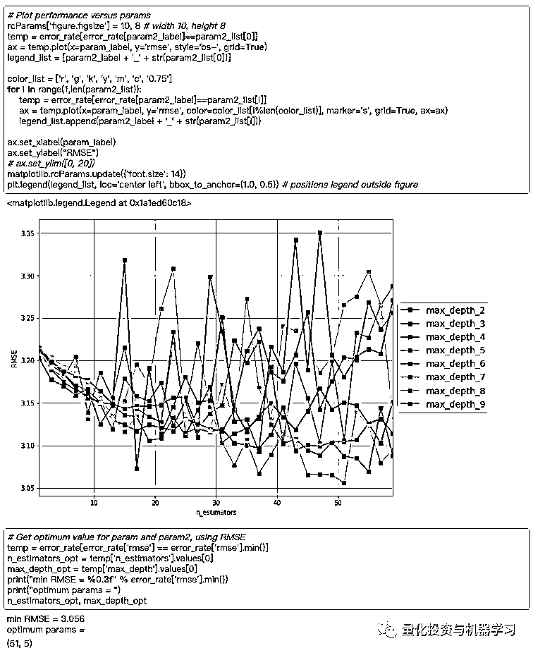

**代码获取**

在**后台**输入（严格大小写）

***XGBoost_QIML_ 股价预测***

*—End—*

量化投资与机器学习微信公众号，是业内垂直于**Quant**、**MFE**、**CST、AI**等专业的**主****流量化自媒体**。公众号拥有来自**公募、私募、券商、银行、海外**等众多圈内**18W+**关注者。每日发布行业前沿研究成果和最新量化资讯。你点的每个“在看”，都是对我们最大的鼓励