# 石川博士演讲纪要：基本面因子投资的三点思考

> 原文：[`mp.weixin.qq.com/s?__biz=MzAxNTc0Mjg0Mg==&mid=2653295362&idx=1&sn=b21138f0422f1ca427cffee940a88c8f&chksm=802dd117b75a5801b9f629afeff61bb388a7bbc87151e2bbba34274e82c3ac09d8f6ab466d1c&scene=27#wechat_redirect`](http://mp.weixin.qq.com/s?__biz=MzAxNTc0Mjg0Mg==&mid=2653295362&idx=1&sn=b21138f0422f1ca427cffee940a88c8f&chksm=802dd117b75a5801b9f629afeff61bb388a7bbc87151e2bbba34274e82c3ac09d8f6ab466d1c&scene=27#wechat_redirect)

**标星★公众号     **爱你们♥   

来自：海通量化团队

**近期原创文章：**

## ♥ [5 种机器学习算法在预测股价的应用（代码+数据）](https://mp.weixin.qq.com/s?__biz=MzAxNTc0Mjg0Mg==&mid=2653290588&idx=1&sn=1d0409ad212ea8627e5d5cedf61953ac&chksm=802dc249b75a4b5fa245433320a4cc9da1a2cceb22df6fb1a28e5b94ff038319ae4e7ec6941f&token=1298662931&lang=zh_CN&scene=21#wechat_redirect)

## ♥ [Two Sigma 用新闻来预测股价走势，带你吊打 Kaggle](https://mp.weixin.qq.com/s?__biz=MzAxNTc0Mjg0Mg==&mid=2653290456&idx=1&sn=b8d2d8febc599742e43ea48e3c249323&chksm=802e3dcdb759b4db9279c689202101b6b154fb118a1c1be12b52e522e1a1d7944858dbd6637e&token=1330520237&lang=zh_CN&scene=21#wechat_redirect)

## ♥ 2 万字干货：[利用深度学习最新前沿预测股价走势](https://mp.weixin.qq.com/s?__biz=MzAxNTc0Mjg0Mg==&mid=2653290080&idx=1&sn=06c50cefe78a7b24c64c4fdb9739c7f3&chksm=802e3c75b759b563c01495d16a638a56ac7305fc324ee4917fd76c648f670b7f7276826bdaa8&token=770078636&lang=zh_CN&scene=21#wechat_redirect)

## ♥ [机器学习在量化金融领域的误用！](http://mp.weixin.qq.com/s?__biz=MzAxNTc0Mjg0Mg==&mid=2653292984&idx=1&sn=3e7efe9fe9452c4a5492d2175b4159ef&chksm=802dcbadb75a42bbdce895c49070c3f552dc8c983afce5eeac5d7c25974b7753e670a0162c89&scene=21#wechat_redirect)

## ♥ [基于 RNN 和 LSTM 的股市预测方法](https://mp.weixin.qq.com/s?__biz=MzAxNTc0Mjg0Mg==&mid=2653290481&idx=1&sn=f7360ea8554cc4f86fcc71315176b093&chksm=802e3de4b759b4f2235a0aeabb6e76b3e101ff09b9a2aa6fa67e6e824fc4274f68f4ae51af95&token=1865137106&lang=zh_CN&scene=21#wechat_redirect)

## ♥ [如何鉴别那些用深度学习预测股价的花哨模型？](https://mp.weixin.qq.com/s?__biz=MzAxNTc0Mjg0Mg==&mid=2653290132&idx=1&sn=cbf1e2a4526e6e9305a6110c17063f46&chksm=802e3c81b759b597d3dd94b8008e150c90087567904a29c0c4b58d7be220a9ece2008956d5db&token=1266110554&lang=zh_CN&scene=21#wechat_redirect)

## ♥ [优化强化学习 Q-learning 算法进行股市](https://mp.weixin.qq.com/s?__biz=MzAxNTc0Mjg0Mg==&mid=2653290286&idx=1&sn=882d39a18018733b93c8c8eac385b515&chksm=802e3d3bb759b42d1fc849f96bf02ae87edf2eab01b0beecd9340112c7fb06b95cb2246d2429&token=1330520237&lang=zh_CN&scene=21#wechat_redirect)

## ♥ [WorldQuant 101 Alpha、国泰君安 191 Alpha](https://mp.weixin.qq.com/s?__biz=MzAxNTc0Mjg0Mg==&mid=2653290927&idx=1&sn=ecca60811da74967f33a00329a1fe66a&chksm=802dc3bab75a4aac2bb4ccff7010063cc08ef51d0bf3d2f71621cdd6adece11f28133a242a15&token=48775331&lang=zh_CN&scene=21#wechat_redirect)

## ♥ [基于回声状态网络预测股票价格（附代码）](https://mp.weixin.qq.com/s?__biz=MzAxNTc0Mjg0Mg==&mid=2653291171&idx=1&sn=485a35e564b45046ff5a07c42bba1743&chksm=802dc0b6b75a49a07e5b91c512c8575104f777b39d0e1d71cf11881502209dc399fd6f641fb1&token=48775331&lang=zh_CN&scene=21#wechat_redirect)

## ♥ [计量经济学应用投资失败的 7 个原因](https://mp.weixin.qq.com/s?__biz=MzAxNTc0Mjg0Mg==&mid=2653292186&idx=1&sn=87501434ae16f29afffec19a6884ee8d&chksm=802dc48fb75a4d99e0172bf484cdbf6aee86e36a95037847fd9f070cbe7144b4617c2d1b0644&token=48775331&lang=zh_CN&scene=21#wechat_redirect)

## ♥ [配对交易千千万，强化学习最 NB！（文档+代码）](http://mp.weixin.qq.com/s?__biz=MzAxNTc0Mjg0Mg==&mid=2653292915&idx=1&sn=13f4ddebcd209b082697a75544852608&chksm=802dcb66b75a4270ceb19fac90eb2a70dc05f5b6daa295a7d31401aaa8697bbb53f5ff7c05af&scene=21#wechat_redirect)

## ♥ [关于高盛在 Github 开源背后的真相！](https://mp.weixin.qq.com/s?__biz=MzAxNTc0Mjg0Mg==&mid=2653291594&idx=1&sn=7703403c5c537061994396e7e49e7ce5&chksm=802dc65fb75a4f49019cec951ac25d30ec7783738e9640ec108be95335597361c427258f5d5f&token=48775331&lang=zh_CN&scene=21#wechat_redirect)

## ♥ [新一代量化带货王诞生！Oh My God！](https://mp.weixin.qq.com/s?__biz=MzAxNTc0Mjg0Mg==&mid=2653291789&idx=1&sn=e31778d1b9372bc7aa6e57b82a69ec6e&chksm=802dc718b75a4e0ea4c022e70ea53f51c48d102ebf7e54993261619c36f24f3f9a5b63437e9e&token=48775331&lang=zh_CN&scene=21#wechat_redirect)

## ♥ [独家！关于定量/交易求职分享（附真实试题）](https://mp.weixin.qq.com/s?__biz=MzAxNTc0Mjg0Mg==&mid=2653291844&idx=1&sn=3fd8b57d32a0ebd43b17fa68ae954471&chksm=802dc751b75a4e4755fcbb0aa228355cebbbb6d34b292aa25b4f3fbd51013fcf7b17b91ddb71&token=48775331&lang=zh_CN&scene=21#wechat_redirect)

## ♥ [Quant 们的身份危机！](https://mp.weixin.qq.com/s?__biz=MzAxNTc0Mjg0Mg==&mid=2653291856&idx=1&sn=729b657ede2cb50c96e92193ab16102d&chksm=802dc745b75a4e53c5018cc1385214233ec4657a3479cd7193c95aaf65642f5f45fa0e465694&token=48775331&lang=zh_CN&scene=21#wechat_redirect)

## ♥ [AQR 最新研究 | 机器能“学习”金融吗](http://mp.weixin.qq.com/s?__biz=MzAxNTc0Mjg0Mg==&mid=2653292710&idx=1&sn=e5e852de00159a96d5dcc92f349f5b58&chksm=802dcab3b75a43a5492bc98874684081eb5c5666aff32a36a0cdc144d74de0200cc0d997894f&scene=21#wechat_redirect)

**前言**

本文是对石川博士在 10 月 30 日由海通证券金工团队举办的《基本面、量化与另类数据》论坛中发言的纪要整理。

**石川博士**  

北京量信投资管理有限公司创始合伙人，首席科学家。清华大学学士、硕士，麻省理工学院博士，研究成果多次发表于 EJOR、IJPE 等国际顶级期刊，现担任知名期刊 Computers in Industry 编委会委员和十余家国际期刊审稿人。石博士曾就职于 Citigroup、Oracle 以及 P&G，擅长以金融数学分析为手段进行资产配置、量化多因子以及衍生品 CTA 策略的开发，对量化投资领域具有独到的见解。同时，石川博士也是量化投资与机器学习公众号的特约专栏作者。

对高博的夸奖，我受之有愧，也感谢各位坚持到现在。从我自己听报告的经验来说，这一下午高质量、高密度的报告，可以听到最后一场，应该都是真爱。希望接下来的四十分钟，不让大家失望。

我今天演讲的题目是基本面因子投资的三点思考。前三场报告听下来，我觉得嘉宾们都把我的思考说得差不多了。今天演讲的整体框架是这样：首先，我简单介绍一下我们公司。然后，提出三点思考：第一点是基本面因子投资需要先验。第二点是基本面因子投资需要方法，最后一点是基本面因子投资需要信仰？这里的信仰后面打了一个问号。对于我，它仍然是一个开放性问题，也是希望和大家探讨的一个问题。到底需不需要信仰，信仰来自什么地方。最后，推荐一些书籍给大家。

我们公司主要是做量化投资，成立了大概四年。大家都说，做量化，要有数学背景，要有金融背景，要有计算机背景。我们三个创始人每个人有一方面的背景，捏在一块，看来还是能做量化这件事的。

**基本面因子投资需要先验**

介绍就这么多，开始第一个思考，就是基本面因子投资需要先验。以前美国金融协会主席 John Cochrane 的一段话作为开场，他说，我们之前认为资本资产定价模型（CAPM）可以解释股票预期收益的差异。那些高 beta 的股票收益应该高，那些低 beta 的股票收益应该低。这是我们最初的理解，但是现在呢，我们似乎认为 CAPM 已经失效，因为我们挖出了成百上千个因子。这里的因子仅限于基本面因子，不谈更高频的量价因子。即使对于基本面因子，学术界已经发表出来的也有四百多个了，再加上其他乱七八糟的，上千应该是没有问题的。也就是说，我们有一千个因子来解释截面上哪些是好股票、哪些是坏股票，哪些股票收益高、哪些股票收益低。这其实是一个挺反讽的事情。

我们为什么会走到今天这个局面，可以借鉴杜克大学 Campbell Harvey 教授之前在美国做的一个演讲。从基因的角度谈，我们是倾向于“过拟合”这件事的，这是从生存、从进化论的角度来说的。假设一只羚羊正在草原上吃草，突然听到了“沙沙沙”的声音。这个声音可能是微风吹过草丛或者树木，也可能是一只猎豹要捕食。这时它觉得有事，它怕可能是猎豹，所以就跑了两步。后来发现，这不是猎豹，就是微风吹过，这时它犯了 Type I error，就是 False Positive，它认为有猎豹，实际上没有。为此付出的代价是什么呢，无非就是多跑了两步，消耗了一定的能量。但如果它不跑，它认为没事，但最终真的是猎豹来了，那它付出的代价就是被吃掉，这说明它犯 Type II error 的代价是巨大的。所以，从羚羊的角度，它宁愿多跑两步。

那么，这件事套在因子上就是，我们挖出的这个因子，Type I error 代表它是假的，但我们相信它并使用了。当然，如果控制好风险、控制好仓位，即使这个因子只是一个“过拟合”的产物，那么它在样本外也不过是一个为零的预期收益。但我们宁愿相信它是一个真的因子，因为如果它是，我们却没有用，那就可能少了一个很有效的收益。所以，从进化的角度来说，人似乎也愿意犯 Type I error。

在实践中，多重检验让我们更容易犯这样的错误。Dr. Marcos Lopez de Prado，True PositiveTechnologies 的 CIO 说：“对同一段历史数据，我们在回测中尝试大量参数或是测试了大量策略后，找出来效果最好的一组参数或者一个策略总能获得不错的效果，但这只是 pure luck。”比如，我试了 20 个因子，找到 20 个因子里表现最好的。我接着试了 50 个，找到其中最好的，那肯定比前面 20 个因子里最好的还要好。我们可以再接着试 100 个因子，不断地试，那效果肯定越来越好。而这些都是基本面因子，通过不同的加减乘除方式构建的基本面因子。

那怎么量化上面这种现象，刚才挖因子的过程归根结底能用两个误差来总结——过拟合偏误（overfitting bias）和选择偏误（selection bias）。我举三个例子：一是假设我试了 n 个因子，得到平均收益 t 值的正负号。我不考虑先验，不考虑基本面原理，使用所有因子。如果 t 值大于零就正着用，小于零就反着用，这就是过拟合偏误。二是我试了 n 个因子，选一个最好的，t 值的绝对值最大的，这就是选择偏误。第三个就是更多人经常实践的，试了 n 个因子，挑出 k 个最好的，那么这两个偏误就都犯了。

通过一个简单的例子就可以看到，犯了这两个偏误可以达到什么样的效果。这是我拿中证 500 成分股做的实验，因子都是随机产生的，即，每期选股的时候都用随机数。这张图的横坐标 n 是实验的因子个数，不同颜色的线条对应选择的因子个数。假如我试了十个因子，然后选一个最好的，那么能达到的 t 值，最高的也能接近 3。

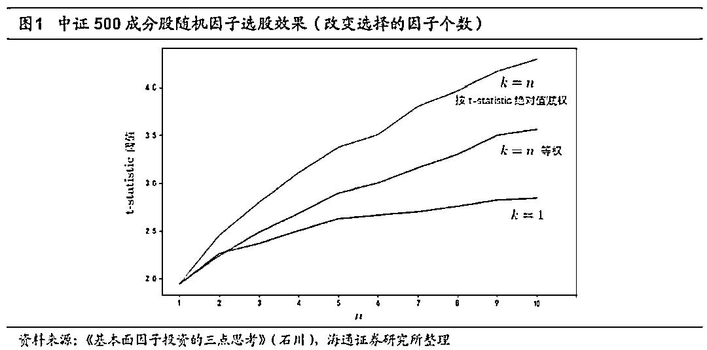

当然，用纯随机来模拟过拟合的效果，通常都是高估的。因为用纯随机来挖掘因子，是可以保证因子之间是相互独立的。然而，在真实挖因子的过程中，大量因子通常是有相关性的。这个方法虽然高估了过拟合的程度，但也说明过拟合这个问题必须重视。而且，随着这三条线往上看，选的因子越多，过拟合程度也是单调上升的。

这张图是换了一个角度看这个问题。横坐标是 k，四个颜色代表因子 n 的个数。在给定选 k 个因子的假设下，试的因子总数越多，能获得的效果也越好。所以仅靠挖掘纯随机的因子，就能得到这么高的效率，可见过拟合是一种稳定存在的现象。

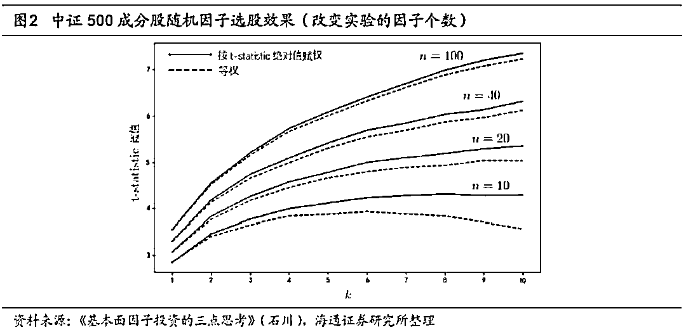

学术界有很多方法来评估是不是过拟合。比如，正交化和自助法就可以在一定程度上达到这个目的。正交化是在截面上把基本面因子真正能预测收益的部分去掉，这样就可以客观评价随机部分。自助法是通过重抽样来构建一个随机部分，即，纯靠运气成分得到的概率分布，这样就可以评价因子在排除运气成分后是否仍然有效。

即便如此，我们有了方法，也有了警惕性。但是能用的指标，包括通过各种组合方法得到的指标，实在太多了。比如，Chordia，Goyal，Saretto（2017）使用纯基本面的指标，通过加减乘除的四则混合运算构建了两百万个因子。实验中，他们对 data mining 做了惩罚，然后找到 17 个在统计上和经济上都非常显著的因子。这是其中一个，针对美股做的。

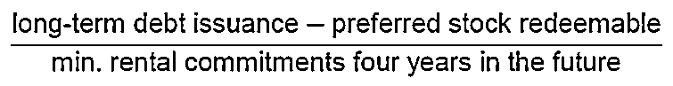

这些纯粹从基本面指标得来的因子，既没有什么先验来支撑，也没有什么道理。但是在经济上和统计上很显著，而且还惩罚了 data mining。你能不能相信呢？

为了回答这个问题，我们首先要思考什么是因子？因子背后的驱动是什么？多因子研究的起源是 Fama-French 三因子模型，现在已经是家喻户晓了。他们在 1993 年发表了一篇非常有影响力的文章，内容是，股票截面的预期收益可以被市场、SMB（小市值-大市值）、HML（价值股-成长股）这三个因子来解释。

看完这篇文章，我们大部分人都记住了三因子模型的公式。但这篇文章最重要的其实是篇尾的这段话。Fama 说，第一，我们虽然从 empirical data 中发现了这个公式，但是我们在这篇文章中并没有回答是什么导致了和价值、市值相关的这些股票，在收益率上的差异，以及是什么基本面促成了这样两个因子。第二，即使我们找到了促成这两个因子的基本面，它们背后又到底代表了什么样的风险？最初，无论是 CAPM 还是 Fama-French 三因子模型，都是要从风险的角度来解释这个因子。为什么这个因子会被定价，为什么这个因子能获得收益？

所以，他们在 1996 年发表了一篇影响力可能不亚于三因子模型的文章，试图去解释，或者说，从风险的角度来将 SMB 以及 HML 和财务困境联系起来。然后，猜想它们代表了投资人需要对冲的某种系统风险。当然，很多人不同意。其中，最知名的当属 Lakonishok, Shleifer，Vishny（1994）。他们认为，比起成长股组合，价值股组合的波动率并不很大。因此，从风险这个角度来解释 HML，似乎站不住脚。他们更愿意从投资者行为偏差和错误定价，比如，对成长股好的基本面过度外推，对价值股反应不足，这些方面来解释。这表明，即便 Fama 和 French 很努力地想对 SMB 和 HML 做出充分解释，但是也有很多人提出不同的看法。

“什么是因子”这个问题，随着五因子模型被提出，变得更加棘手。Fama 和 French 在 2015 年发表了五因子模型，他们从 Dividend Discount Model（DDM）出发，在三因子模型的基础上，加上了盈利和投资两个因子。然后，Hou，Xue，Zhang（2015）从投资理论出发，也提出了盈利和投资两个因子。这些因子，似乎都能找到非常好的经济学原理来支撑，但是还是有人会质疑。Fama，French 以及 Hou，Xue，Zhang 都没有对盈利和投资这两个因子背后的原因，给出任何解释。虽然它们来自 DDM，来自投资的 q-theroy，但是我们仍然不知道为什么 ROE 高的公司，未来就会有更高的收益；total assetsgrowth 低的公司，未来就会有更高的收益。这只是来自实证数据，我们并不知道这背后到底隐含着哪种风险。

这里分享一段来自 Robeco 的观点。Robeco 是一家起源于荷兰的大型资产管理公司，大约有 90-100 年的历史，中文名叫“荷宝”。他们说，从五因子模型开始，似乎我们对资产定价模型的研究就变了。之前，无论是 CAPM 还是三因子模型，我们都希望找到一个风险的解释，找到这些因子背后的逻辑。但是从五因子开始，我们似乎就不再做这件事了。而如果我们不再追求一个风险的解释，或者放开一点，从行为金融学、从错误定价方面的解释。那是不是任何因子都可以用在模型里，只要好使就行。如果是这样的话，我们就可以从 400 个因子里面，找到最小的一个、五个、十个来解释其他因子，那是不是就是一个定价模型，是不是就可以用了？我认为这是一个很好的问题，也值得我们深入讨论。

我们再来回顾一下 ROE 和刚才从两百万个因子中找出来的最好的那一个因子。我自己的看法是，不能因为 ROE 来自于经济学模型，来自 DDM，来自 q-theory，有故事可讲，就认为它比前面那个和 long-term debt 有关的因子更合理。虽然这个因子显然不合理，但 ROE 就真的比它更合理吗？在样本外一定更有效吗？

所以，什么是因子，或者说什么是因子的先验？我自己的看法是，一定要存在以下二者之一的解释。要么它代表了某种风险，要么它代表了某种定价错误的异象。对于三因子模型而言，现在其实无论是美股还是 A 股，市场这个因子在截面上都已经没有什么预测能力了。但大家仍然把它放在因子模型里，因为它在时间序列上可以非常好地解释股票的波动。那么从风险的角度来说，Market 这个因子是有效的，而 SMB 和 HML 可以解释截面上股票收益的差异。我们回到 ROE，虽然大家都在用，但我只是提出一个思考，它真的非常合理吗？

**基本面因子投资需要方法**

第二个思考是基本面因子投资需要方法，主要是这几方面。我们要使用某个因子，要构建因子的投资组合。如何确定因子暴露，如何计算因子收益率，忽视因子相关性有何种危害，以及如何比较不同的因子？这大概是一些比较基础的问题。

因子暴露怎么确定？第一种方法学术界用的比较多，就是回归。先构建一个因子组合，得到因子收益。然后在时序上，拿个股收益率和因子收益率回归，用回归的 beta 作为因子暴露。但是这个方法有两个问题，一是，回归总要有一段比较长的时间窗口，才能得到稳定的回归系数，所以这个系数的变化就会比较慢。二是，这样计算得到的因子暴露存在误差，因为回归本身就有误差。第二种方法是像 MSCI 那样，即 Barra 那一套，直接使用公司的指标。比如，市值就用对数市值，ROE 就用 ROE 本身。当然，因子还是需要标准化。除此以外，还需要关注的是数据质量问题，像数据缺失或不同行业是否可比。现在，大家非常愿意做的一种处理就是行业中性，但这背后又有多少逻辑。不是因为它好使，或者说讲出来特别合理，就用对了。这背后又有多少思考？不过，从学术界最新的研究来看，还是说第二种 Barra 的方法更好。这也是现在业界普遍使用的一种方法，所以应该没有什么问题。只是说，在第二种方法的处理上，还是应该有更细微的考虑。

如何计算因子收益率？有了因子暴露，就可以按因子暴露的高低构建组合，并计算因子收益率。最简单和直接的一种方法，就是组合排序（Portfolio Sort）。排完序以后，做多前百分之十或前百分之三十，做空后百分之十或后百分之三十，得到因子在时序上的收益率。但这种方法最大的问题在于，它无法控制因子在其他因子上的暴露。比如说，以 BP 为目标构建组合。它在 BP 上有比较稳健的暴露，大概都是 3 左右。但是因为没有控制在其他因子上的暴露，可以看到它在市值和 ROE 上都有比较明显的负暴露，而且是时变的。由于在其他因子上有暴露，就会对评价这个因子到底好不好使，挣了谁的钱，是否挣了 BP 的钱，BP 到底有多少收益，产生一定的影响。

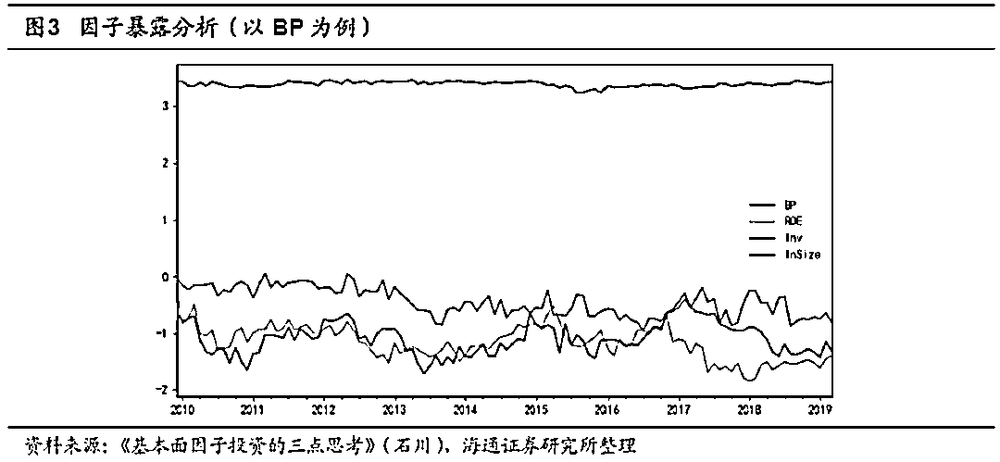

第二种计算因子收益率的方法是 MSCI/Barra 的做法，使用 Fama-MacBeth 截面回归得到所谓的纯因子组合（pure factor portfolio）。现在，这个概念也已经深入人心了，因为它是可以从数学上得到保证的。假设 X 是组合的因子暴露矩阵，那么在最简单的、不考虑任何约束的情况下，得到的纯因子组合就是下面这个关系式：。把这个纯因子组合乘以 X，可以得到一个单位矩阵。这就相当于从数学上保证了，纯因子组合只对目标因子有恒定的暴露，对其他因子没有暴露。这是在数学上非常自洽的一套体系，所以很多人喜欢用。因为这样得到因子组合每期都非常纯净地暴露在目标因子上，在其他因子上没有暴露，这也从数学上保证了怎么检验都是没有问题的。比如，Barra 的十个因子按纯因子组合的方法做，确实能保证只有在目标因子上有暴露，在其他因子上的暴露为 0。

因子需不需要正交化？因为大量因子的相关性都是比较高的，而大家在做因子研究的时候，当然希望尽量研究一些相对独立的因子，这样就能提供不同的信息。当然，仅从 Fama-MacBeth 回归来说，因子是可以有相关性的，它不影响回归的稳健型和有效性。不过，当我们想评价因子收益率的时候，普遍想知道 t 值，而 t 值的计算就要用到标准误（standard error，se）。因子相关性比较高的时候，se 就会比较大。因为对某一个因子 j，它的 se 可以由下面这个公式来表示。

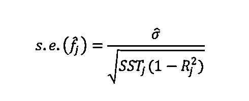

这个公式分母中的 Rj²，是拿因子 j 对其他所有因子回归得到的。Rj² 越大，表明因子 j 和其他因子的相关性越高。而 Rj² 越大，分母越小，se 越大。这样一来，就不太好评价这个因子到底是不是有效。它可能是个有效的因子。但是因为在回归的时候放入了别的和它相关的因子，对它造成了影响。

举个例子，我之前研究了一下异质波动率。这个应该是学术界自 2006 年发表以来，目前来看，影响力最高的因子。我在使用截面回归的时候，除了异质波动率，还加入了波动率。然后，就得到一个非常诡异的结论，我似乎应该选择波动率高但异质波动率低的股票。但是我仔细检查后发现，原来异质波动率和波动率在截面上的相关系数达到了 0.62，t 值达到了 7.8。这就迫使我需要思考，想把这个相关性处理掉。当我用波动率对异质波动率正交化后再去回归，我发现，原来还是异质波动率才能够获得超额收益，波动率就没有非常显著。所以，这个例子说明，我们不能太相信数据分析出来的结论，还是要思考模型背后的假设是否满足。

如何比较不同的因子？常用的方法有 GRS 检验、mean-variance spanning 检验和贝叶斯方法。因子比较的目的是，当同一个模型中有不同的因子时，先要看哪个因子更好。然后再去围绕那些最好使的因子构建组合，才去做落地化这一步。

以第一个比较方法为例，简单介绍一下 GRS 检验。最近有一篇非常火的文章，就是中国版的三因子模型。作者在 Fama-French 三因子模型的基础上用 EP 取代 BP，然后讲了一个非常美丽的故事——壳污染。百分之三十的小市值股票容易受到壳污染，进而影响分组值，所以需要把这百分之三十的股票剔除。在剩余百分之七十的大市值股票中，用 EP 取代 BP，再用市值获得了新的三因子模型。这个三因子模型在中国市场上的效果非常好。为什么能得到这个结论呢，用的就是 GRS 检验。当他们用中国版三因子模型的两个因子作为解释变量，去评价两个 Fama-French 的因子时，市值和 BP 这两个投资组合无法获得任何超额收益。反过来，当他们用 Fama-French 模型中的那两个因子去评价时，这两个中国版因子的投资组合获得了统计意义上非常显著，且根本无法解释的收益。所以，他们认为中国版的三因子模型更好。

总结一下，确定因子暴露可以用时序回归的方法，也可以像 Barra 一样，用指标本身。检验因子的收益率，最常用的是多空对冲的方法或者回归的方法。剔除相关性用正交化的方法。因子比较用 GRS 检验，或者 mean-variance spanning 检验和贝叶斯方法，这些都是学术界非常常见的。现在也能看到，它们正被专业投资人越来越广泛地应用到实际投资中。

**基本面因子投资需要信仰？**

最后一个思考是带着问号的，基本面因子投资需不需要信仰？以 AQR 为例，AQR 是我个人非常喜欢和尊敬的一个公司。它可以说是学术界里最会投资的，投资界里做学术最好的，发了很多高质量的学术论文。AQR 用估值、动量、质量这三个因子，构建了一个市场中性组合。倡导买低估值、高动量、高质量的股票，然后用它们的反面对冲。但 AQR 在 2018 年的日子并不好过，下面这张图上的白线是这个市场中性组合的净值，持续下跌，估值因子实在是不好使。蓝线是 SP500，显然这个组合没有跑赢 SP500。紫线是其他类似的中性策略的平均水平，组合也处于落后的位置。大约从 17 年下半年开始，组合持续下跌了一年。到了 19 年好像也没有好转，还在跌。

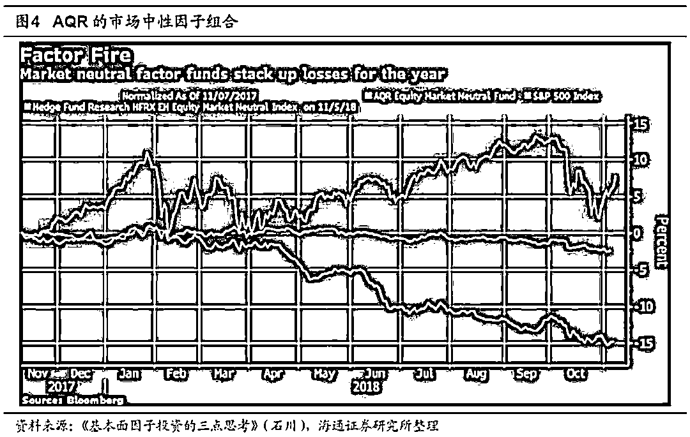

所以，你就会思考，做因子这件事，AQR 肯定是非常专业的。但即便是这样，他们也无法避免在短到中期内，可能是几个月、半年甚至一年以上，因子组合持续出现亏损。任何基本面因子都代表了我们对截面预期收益的某种假设，例如，我认为小市值会更好或者便宜的股票会更好。但市场充满了不确定性，一旦市场背离了这个假设，这个因子就会暂时失效。从我自己非常浅的经验来说，我非常认同墨菲定律——任何能出错的事一定会出错。放到因子层面，就是任何一个因子一定会失效，至少是暂时性的失效。所以，Asness——AQR 的创始人也出来说，任何一个策略都不会很容易，市场上没有容易钱。如果一个策略可以躺着赚钱，那它一定会很快被套利走。任何持续、长期能挣钱的因子，都是时不时会让你非常疼一下的。这是他写的一份非常长的报告的大意，用来安抚投资者。

我们可以做几个实验。因为不论是样本内挖因子，还是多因子的组合，都是用历史数据。我们不可能找一些效果不是很好的因子，构建投资组合。一般都是找相关性比较低，样本内稳定向上的因子。比如，这张图中的十个因子，看起来也没有多好，但是最起码都稳健向上。把它们捏在一块儿可以得到这条黑线，也非常稳定。

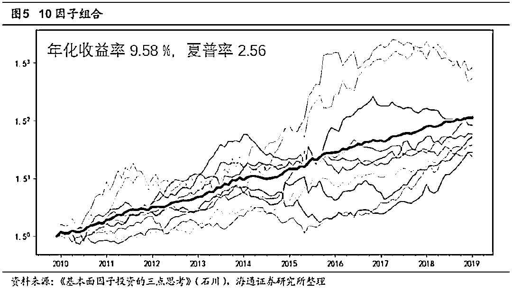

接下来，我对这 10 个因子模拟不同的失效个数。如果没有失效，就是上面那张图中的黑线。这 10 张图分别对应有 1 到 10 个因子失效的情况。蓝线代表平均水平，阴影部分是 5%到 95%的区间，最好的情况和最差的情况的边界。当无效因子的个数越来越多的时候，这个区间会越来越大，表现的波动也会越来越高。有人说，这看起来也很不错，第二行最右边的那张图，所有因子都失效也就是不挣钱。但蓝线只是一个平均水平，要是运气不好就会一直亏，加上交易成本后亏得更多。

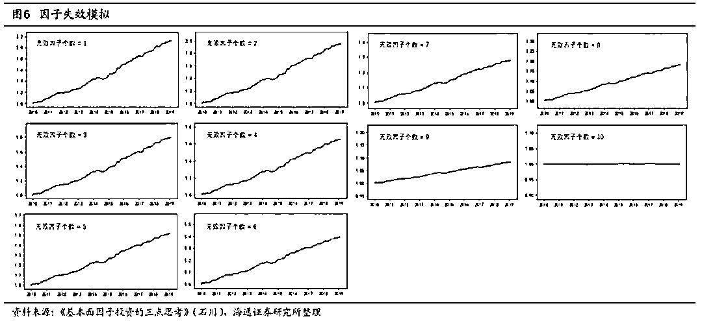

这张表总结了前面那张图。随着失效的因子个数越来越多，表现的波动也越来越大，而且中位数也是逐渐下降的。

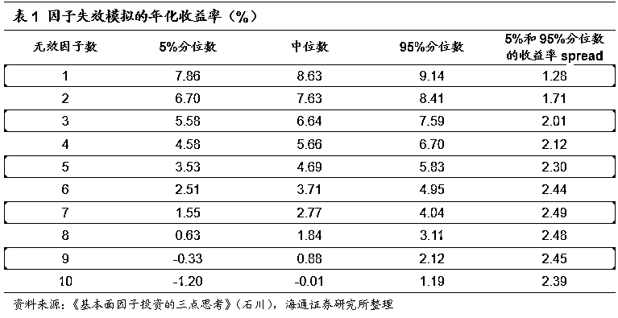

既然因子会失效，大家就会想去做择时，但我们也要思考到底该不该择时。不同的机构、不同的研究，学术界、业界，其实大家做择时的方法也没有什么神秘的，大概就是这四种，有的人也会把这四种方法捏在一块。一个是按动量、一个是按估值、一个是按经济周期、一个是按投资者情绪。大家都是这四种方法，没有太多新的东西。我主要讲前面两种——动量和估值。

很多人用动量来择时，这也非常很容易理解。因子过去一段时间涨得好，未来还会涨得更好。AQR 研究了因子动量择时策略和动量因子（UMD）本身的相关性。他们发现，在不同的计算动量的时间窗口下，无论是截面动量还是时序动量，都和动量因子本身有很高的相关性。相关系数普遍在 50%或 60%，有的甚至更高，达到 77%。所以，一个大概的印象是，按动量择时约等于超配动量因子。

如果按价值来择时呢？Asness 写了另外一篇文章来证明，估值择时也不是很好使。这张图上的绿色虚线是价值因子（HML）的收益，紫线是按估值低来择时获得的超额收益。从结果来看，两者相关性也非常高。由此给我们的粗浅认识是，按估值择时约等于超配价值因子。

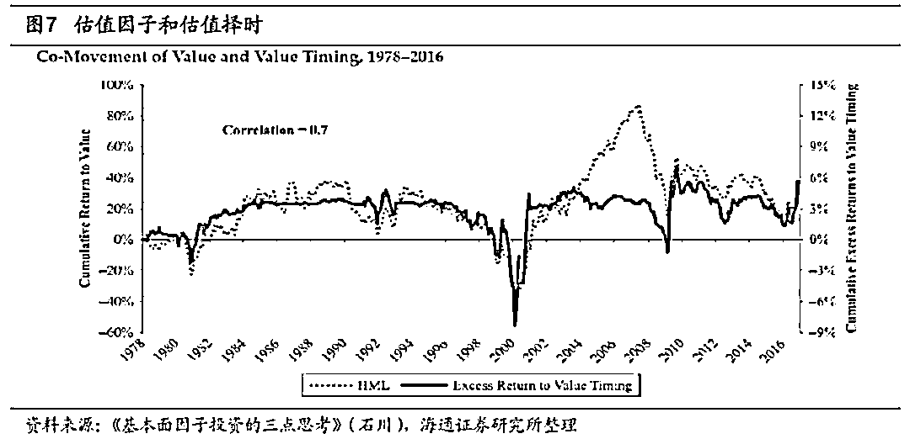

有人说，价值和动量这两个因子都很好，长期来看都能挣钱，也是负相关的。所以，似乎这两种择时方法都很不错，把它们组合在一起也没什么毛病。但是它们两个可以同时失效（together we fall），18 年下半年就是这样一个情况。可以想象，如果在那时按动量或者按估值择时，也会有一个比较惨的表现。

我们还用刚才那十个因子进行模拟，用最简单粗暴的方法，每年等权配置过去一年涨幅最高的五个因子。在样本内，这种方法确实跑赢了十个因子的等权配置。但问题在于，当动量因子无效造成动量择时无效的时候，因为你择时了，会导致这十张图与前面十张图相比，波动是更高的，5%到 95%的区间也变得更宽，收益的中枢也下降得更快。这是因为，样本外的不确定性不仅来自于因子本身的不确定性，还来自于因子失效而造成的择时的不确定性。这一点是在做因子择时的时候，必须要考虑的。任何一种择时方法在样本内一定是非常好使的，因为不好使也不会把这种方法提出来。但是在样本外，如果要评估是否使用因子择时，就一定要考虑这两种不确定性的叠加。

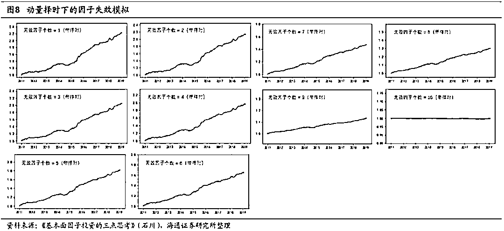

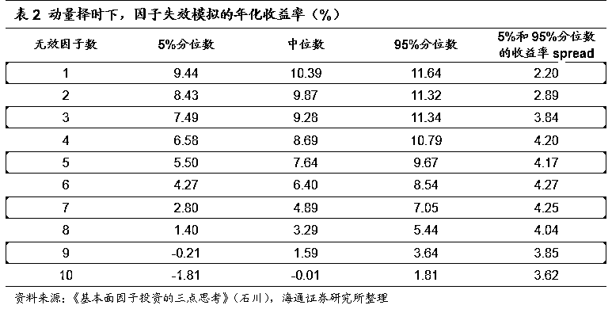

除了按刚才这种假想的方法择时外，还可以按照 A 股因子的估值水平择时。这是一个简单的实证，来自 CQR。他们对 A 股常见的六个因子——流动性、质量、价值、市值、反转以及波动做了一些分析。图 9 是这些因子的估值水平，波动十分剧烈。图 10 是估值和因子未来收益率的相关性，其中大部分因子还是能够看到正相关的。

图 11 是按照估值择时得到的因子权重的时间序列，不同的颜色代表不同的因子。可以看到，其实跟等权的差别也不是很大。虽然在时序上有波动，但总体来说还是比较平稳的。

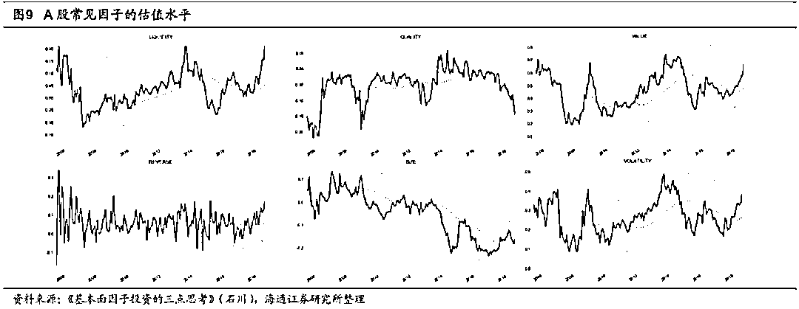

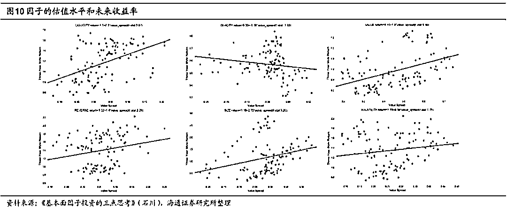

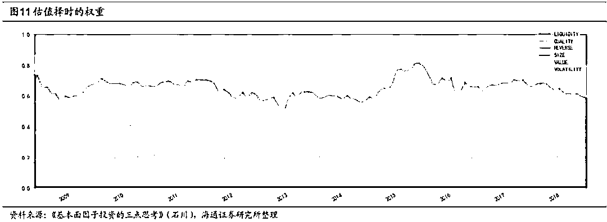

从下图的效果来看，也是微微战胜基准（6 个因子等权配）。当然，这个过程中没有调整参数，因为这不是一个 datamining 的游戏，只是纯粹的例子。我只想提出一个问题，按估值因子择时能取得更好的效果，相当于超配了价值因子。但如果价值因子在未来不好使，我会怎么办？我一定会非常痛苦，那时我还能不能坚持信仰。

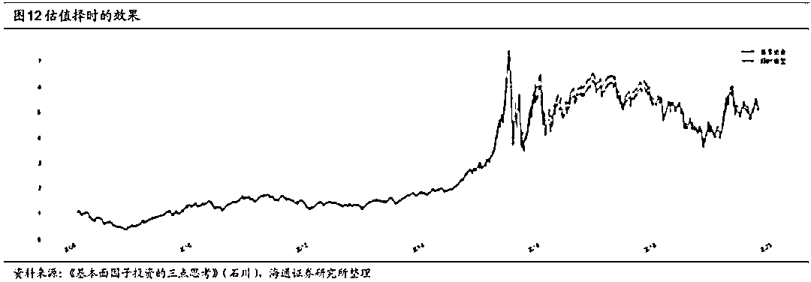

回到这一部分开始的那个问题，数据还是信仰。从贝叶斯的角度来说，信仰就是先验。我认为这个因子好使，可能是我费了很多劲研究出来的，或者是我从学术文献中借鉴的，或者是我和别人讨论的，这些都可以是我的先验。新息是样本外的数据，把这两个糅在一起，就得到后验。我们关心的是，后验中的因子还好不好使。

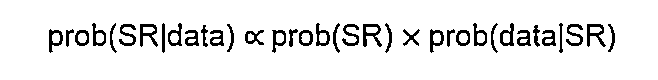

如果用夏普率（SR）代表因子好不好使，并假设先验的 SR 分布是一样的。那么我们就可以只看最后面一项，也就是在不同 SR 的假设下，出现这个新息的最大概率来评价因子现在的表现。我们构建了一个 LLR 指标，它的形式非常简单。先不考虑 log，括号里面是两个后验相除。原假设 H0 是 SR=0，因子无效；备择假设 H1 是 SR=1，因子有效。这两个后验的比值越高，代表备择假设被接受的可能性越大，说明这个因子还持续有效。我们应该接受 H1，拒绝 H0。加个 log 并不改变单调性，只是为了把比值变换到正负无穷之间。

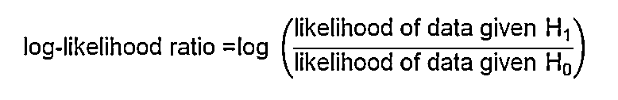

这个指标借鉴了元晟（Winton）的做法，只不过他们是用来评价策略的，我把它用来评价单一因子。这张图中的黄线是 A 股的 SMB 因子从 01 年开始的累计收益率。可以看到，SMB 因子前期涨得非常好，但从 17 年开始就不好使了。

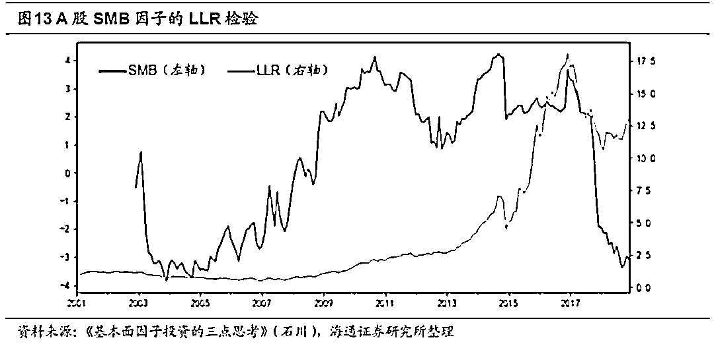

我用滚动两年的数据去计算 LLR 指标，就是图中这条蓝线。17 年 SMB 不好使以后，蓝线就反复告诉我这一点。到后来，LLR 指标都已经下降到了-3、-4 了。那么这个时候，我是否应该摒弃小市值因子？信仰告诉我，应该坚持。因为它来自三因子模型，来自财务困境风险的先验。但数据告诉我，它已经失效了。

我认为这是一个非常值得思考的问题。当样本外的数据告诉你，你所相信的这些风险的解释或者行为的解释，都不能再支撑的时候，你是要相信数据还是要相信信仰。从基本面投资的角度来说，我愿意相信信仰。而从做量化投资、纯 data-driven 的角度来说，永远要相信数据，那我就会在 2017-18 年去做大市值。当然这也没有问题，只要你有一套健全的模型评价体系，并且按照这个模型来做。但是从基本面因子投资的角度来说，这已经背离了初衷。但这两件事谁是对的，谁是错的，这是一个非常值得思考的问题。我相信 AQR 还在坚持，Asness 之所以写这篇文章，AQR 的产品之所以到 19 年还在一直跌，都证明了他们还在坚持。这是非常值得敬佩的，但是对投资人来说却是非常痛苦的体验。所以，到底是相信数据还是相信信仰？

**参考书籍**

最后再推荐几本书。先看第一本——《Empirical Asset Pricing》。如果有人让我只推荐一本学习资产定价（asset pricing）的书，我一定会推荐这本。这本书写得非常深入浅出，主要分成两个部分。第一部分介绍了各种方法，但用了非常友好的方式。书里有数学公式，但用非常友好的语言把这些公式都解释清楚了，所以看这本书不会觉得数学很让人头疼。第二部分解释了学术界常见的几大类因子，并展示了它们在美股上的效果。所以，这本书真的是非常好的一本工具书。

第二本书是也是我非常喜欢的，《Alphanomics: The Informational Underpinnings of Market Efficiency》，它从信息的角度来分析为什么会产生错误定价，以及如何利用这种错误定价。这本书本身是非常好的，但也有一些“小缺点”。第一，它太学术了，相当于一个 200 页的学术论文，有无数的参考文献。平时，我们看一个 20 页的学术论文都头疼，更何况是看一个 200 页的。第二，这本书假设读者对相关背景知识有一定的了解，所以对引用的很多内容都没做太多的解释。如果是平时喜欢看一些学术文章或是有一定基础的读者，读这本书不会觉得有问题。但是对没有基础的读者，可能会觉得比较难接受。好消息是，张然老师把它翻译成了中文版。除了翻译之外，张老师还把内容从实战和务实的角度进行了一些简化。让这本书变得没有那么学术，读起来也就相对更容易理解一些。

最后一本是张老师和汪博士的《基本面量化投资》。在中国，客观地说，基本面量化投资还处在一个比较新鲜的阶段，这本书可以说引领了这个方向的发展，有着重要的意义，在这里也推荐给大家。

以上就是全部内容，谢谢大家！

*—End—*

量化投资与机器学习微信公众号，是业内垂直于**Quant**、**MFE**、**CST、AI**等专业的**主****流量化自媒体**。公众号拥有来自**公募、私募、券商、银行、海外**等众多圈内**18W+**关注者。每日发布行业前沿研究成果和最新量化资讯。你点的每个“在看”，都是对我们最大的鼓励