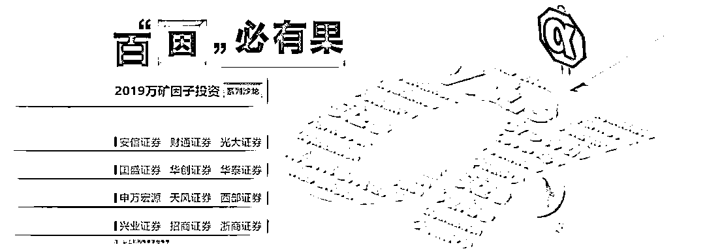
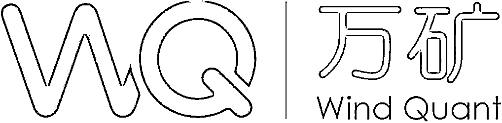
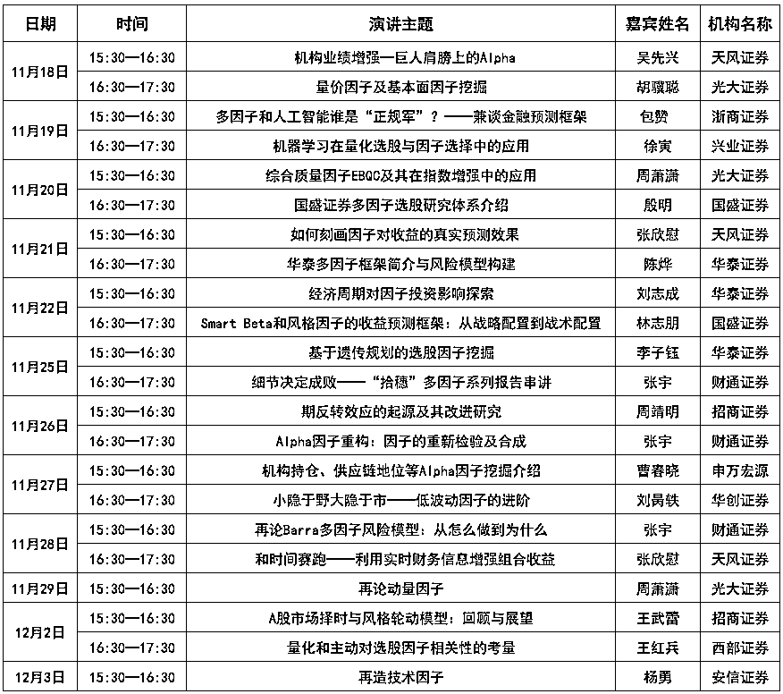
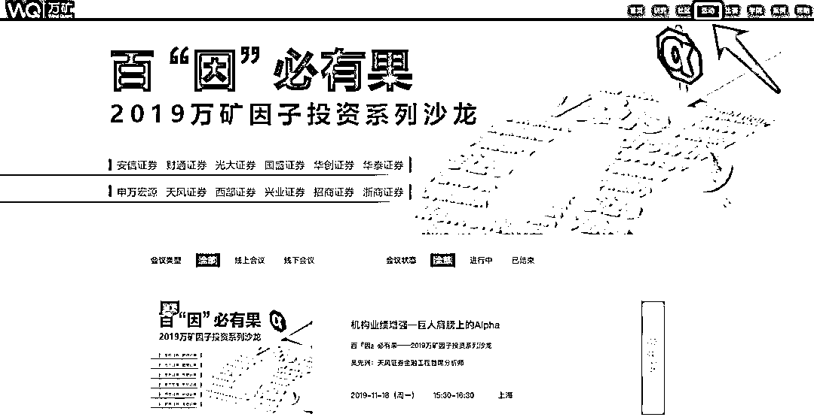
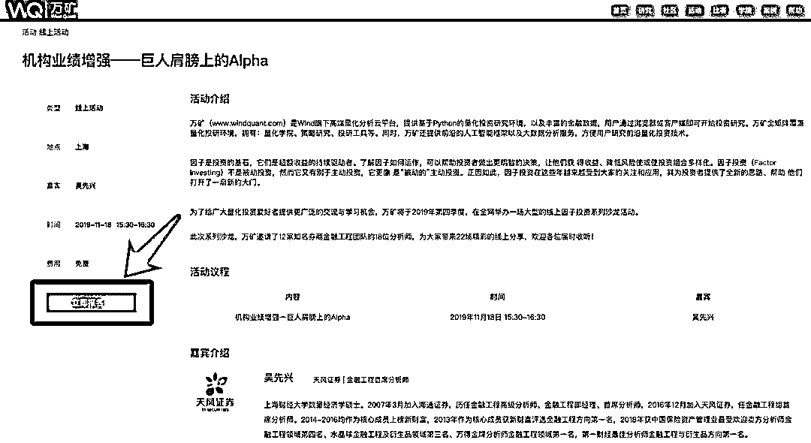
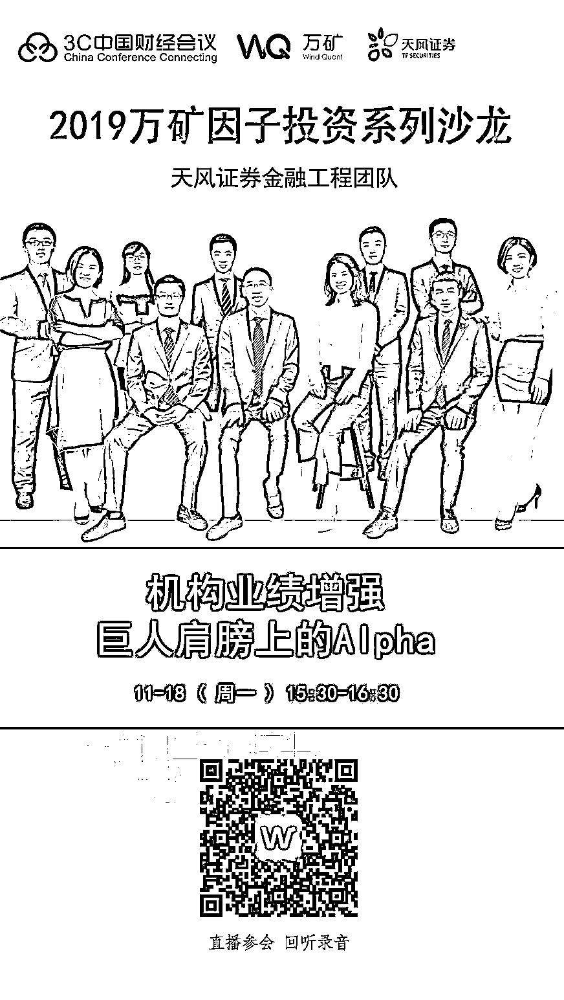
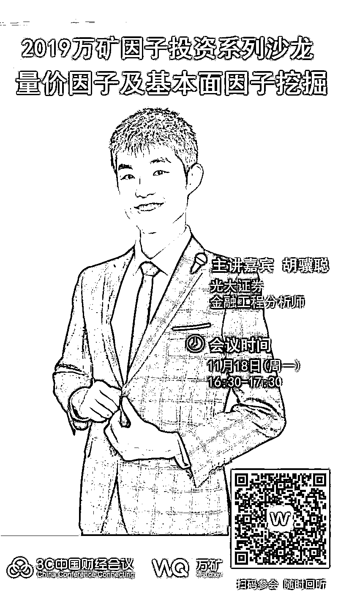
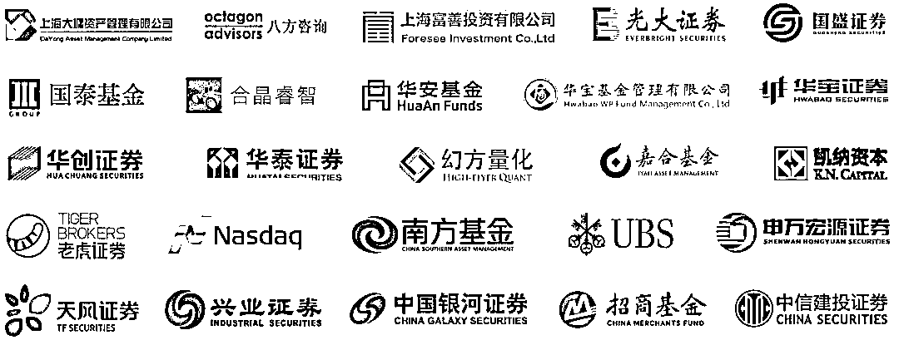

# 百『因』必有果，你的 Alpha 就是我！

> 原文：[`mp.weixin.qq.com/s?__biz=MzAxNTc0Mjg0Mg==&mid=2653295355&idx=1&sn=5b58616693429be7582ac223cbe6e33a&chksm=802dd0eeb75a59f87b33509b7c1b4818c1f68272198979113486ef3fe876af9cdaeb1d1393ee&scene=27#wechat_redirect`](http://mp.weixin.qq.com/s?__biz=MzAxNTc0Mjg0Mg==&mid=2653295355&idx=1&sn=5b58616693429be7582ac223cbe6e33a&chksm=802dd0eeb75a59f87b33509b7c1b4818c1f68272198979113486ef3fe876af9cdaeb1d1393ee&scene=27#wechat_redirect)

**标星★公众号     **爱你们♥   

**近期原创文章：**

## ♥ [5 种机器学习算法在预测股价的应用（代码+数据）](https://mp.weixin.qq.com/s?__biz=MzAxNTc0Mjg0Mg==&mid=2653290588&idx=1&sn=1d0409ad212ea8627e5d5cedf61953ac&chksm=802dc249b75a4b5fa245433320a4cc9da1a2cceb22df6fb1a28e5b94ff038319ae4e7ec6941f&token=1298662931&lang=zh_CN&scene=21#wechat_redirect)

## ♥ [Two Sigma 用新闻来预测股价走势，带你吊打 Kaggle](https://mp.weixin.qq.com/s?__biz=MzAxNTc0Mjg0Mg==&mid=2653290456&idx=1&sn=b8d2d8febc599742e43ea48e3c249323&chksm=802e3dcdb759b4db9279c689202101b6b154fb118a1c1be12b52e522e1a1d7944858dbd6637e&token=1330520237&lang=zh_CN&scene=21#wechat_redirect)

## ♥ 2 万字干货：[利用深度学习最新前沿预测股价走势](https://mp.weixin.qq.com/s?__biz=MzAxNTc0Mjg0Mg==&mid=2653290080&idx=1&sn=06c50cefe78a7b24c64c4fdb9739c7f3&chksm=802e3c75b759b563c01495d16a638a56ac7305fc324ee4917fd76c648f670b7f7276826bdaa8&token=770078636&lang=zh_CN&scene=21#wechat_redirect)

## ♥ [机器学习在量化金融领域的误用！](http://mp.weixin.qq.com/s?__biz=MzAxNTc0Mjg0Mg==&mid=2653292984&idx=1&sn=3e7efe9fe9452c4a5492d2175b4159ef&chksm=802dcbadb75a42bbdce895c49070c3f552dc8c983afce5eeac5d7c25974b7753e670a0162c89&scene=21#wechat_redirect)

## ♥ [基于 RNN 和 LSTM 的股市预测方法](https://mp.weixin.qq.com/s?__biz=MzAxNTc0Mjg0Mg==&mid=2653290481&idx=1&sn=f7360ea8554cc4f86fcc71315176b093&chksm=802e3de4b759b4f2235a0aeabb6e76b3e101ff09b9a2aa6fa67e6e824fc4274f68f4ae51af95&token=1865137106&lang=zh_CN&scene=21#wechat_redirect)

## ♥ [如何鉴别那些用深度学习预测股价的花哨模型？](https://mp.weixin.qq.com/s?__biz=MzAxNTc0Mjg0Mg==&mid=2653290132&idx=1&sn=cbf1e2a4526e6e9305a6110c17063f46&chksm=802e3c81b759b597d3dd94b8008e150c90087567904a29c0c4b58d7be220a9ece2008956d5db&token=1266110554&lang=zh_CN&scene=21#wechat_redirect)

## ♥ [优化强化学习 Q-learning 算法进行股市](https://mp.weixin.qq.com/s?__biz=MzAxNTc0Mjg0Mg==&mid=2653290286&idx=1&sn=882d39a18018733b93c8c8eac385b515&chksm=802e3d3bb759b42d1fc849f96bf02ae87edf2eab01b0beecd9340112c7fb06b95cb2246d2429&token=1330520237&lang=zh_CN&scene=21#wechat_redirect)

## ♥ [WorldQuant 101 Alpha、国泰君安 191 Alpha](https://mp.weixin.qq.com/s?__biz=MzAxNTc0Mjg0Mg==&mid=2653290927&idx=1&sn=ecca60811da74967f33a00329a1fe66a&chksm=802dc3bab75a4aac2bb4ccff7010063cc08ef51d0bf3d2f71621cdd6adece11f28133a242a15&token=48775331&lang=zh_CN&scene=21#wechat_redirect)

## ♥ [基于回声状态网络预测股票价格（附代码）](https://mp.weixin.qq.com/s?__biz=MzAxNTc0Mjg0Mg==&mid=2653291171&idx=1&sn=485a35e564b45046ff5a07c42bba1743&chksm=802dc0b6b75a49a07e5b91c512c8575104f777b39d0e1d71cf11881502209dc399fd6f641fb1&token=48775331&lang=zh_CN&scene=21#wechat_redirect)

## ♥ [计量经济学应用投资失败的 7 个原因](https://mp.weixin.qq.com/s?__biz=MzAxNTc0Mjg0Mg==&mid=2653292186&idx=1&sn=87501434ae16f29afffec19a6884ee8d&chksm=802dc48fb75a4d99e0172bf484cdbf6aee86e36a95037847fd9f070cbe7144b4617c2d1b0644&token=48775331&lang=zh_CN&scene=21#wechat_redirect)

## ♥ [配对交易千千万，强化学习最 NB！（文档+代码）](http://mp.weixin.qq.com/s?__biz=MzAxNTc0Mjg0Mg==&mid=2653292915&idx=1&sn=13f4ddebcd209b082697a75544852608&chksm=802dcb66b75a4270ceb19fac90eb2a70dc05f5b6daa295a7d31401aaa8697bbb53f5ff7c05af&scene=21#wechat_redirect)

## ♥ [关于高盛在 Github 开源背后的真相！](https://mp.weixin.qq.com/s?__biz=MzAxNTc0Mjg0Mg==&mid=2653291594&idx=1&sn=7703403c5c537061994396e7e49e7ce5&chksm=802dc65fb75a4f49019cec951ac25d30ec7783738e9640ec108be95335597361c427258f5d5f&token=48775331&lang=zh_CN&scene=21#wechat_redirect)

## ♥ [新一代量化带货王诞生！Oh My God！](https://mp.weixin.qq.com/s?__biz=MzAxNTc0Mjg0Mg==&mid=2653291789&idx=1&sn=e31778d1b9372bc7aa6e57b82a69ec6e&chksm=802dc718b75a4e0ea4c022e70ea53f51c48d102ebf7e54993261619c36f24f3f9a5b63437e9e&token=48775331&lang=zh_CN&scene=21#wechat_redirect)

## ♥ [独家！关于定量/交易求职分享（附真实试题）](https://mp.weixin.qq.com/s?__biz=MzAxNTc0Mjg0Mg==&mid=2653291844&idx=1&sn=3fd8b57d32a0ebd43b17fa68ae954471&chksm=802dc751b75a4e4755fcbb0aa228355cebbbb6d34b292aa25b4f3fbd51013fcf7b17b91ddb71&token=48775331&lang=zh_CN&scene=21#wechat_redirect)

## ♥ [Quant 们的身份危机！](https://mp.weixin.qq.com/s?__biz=MzAxNTc0Mjg0Mg==&mid=2653291856&idx=1&sn=729b657ede2cb50c96e92193ab16102d&chksm=802dc745b75a4e53c5018cc1385214233ec4657a3479cd7193c95aaf65642f5f45fa0e465694&token=48775331&lang=zh_CN&scene=21#wechat_redirect)

## ♥ [AQR 最新研究 | 机器能“学习”金融吗](http://mp.weixin.qq.com/s?__biz=MzAxNTc0Mjg0Mg==&mid=2653292710&idx=1&sn=e5e852de00159a96d5dcc92f349f5b58&chksm=802dcab3b75a43a5492bc98874684081eb5c5666aff32a36a0cdc144d74de0200cc0d997894f&scene=21#wechat_redirect)

此次因子投资系列沙龙，万矿邀请了：

***12 家****券商金融工程团队***

***18 位 ******业界知名分析师***

***22 场**  **精彩的线上分享***

此次活动也将助力万矿在**西南、西北**地区举办的[**『第三届西部青年量化金融大赛』**](https://mp.weixin.qq.com/s?__biz=MzIwMzY0MTgwMQ==&mid=2247486681&idx=1&sn=fe26a602d9551254697f8c2f23829049&chksm=96cd0a7fa1ba836995f7c23b8b5ec103c41ac7ebf17e459d3409fe760202be189d5b50c8f76c&token=1250224523&lang=zh_CN&scene=21#wechat_redirect)**『第三届丝路高校金融科技建模大赛』**预祝各位参赛选手们取得好的成绩 

**活动介绍**

因子是投资的基石，它们是超额收益的持续驱动者。了解因子如何运作，可以帮助投资者做出更明智的决策，让他们获得收益、降低风险使或使投资组合多样化。因子投资（Factor Investing）不是被动投资，然而它又有别于主动投资，它更像是“被动的”主动投资。正因如此，因子投资在这些年越来越受到大家的关注和应用，其为投资者提供了全新的思路、帮助他们打开了一扇新的大门。

为了给广大量化投资爱好者提供更广泛的交流与学习机会，WindQuant 万矿在 2019 年第四季度联合众多券商机构为大家呈现一场别开生面的因子投资专题沙龙（线上）。

**Wind 介绍**

 | 中国大陆领先的金融数据、信息和软件服务企业，总部位于上海陆家嘴金融中心。在国内市场，Wind 的客户包括中国绝大多数的证券公司、基金管理公司、保险公司、银行和投资公司等金融企业；在国际市场，已经被中国证监会批准的合格境外机构投资者（QFII）中的众多机构是 Wind 的客户。同时国内多数知名的金融学术研究机构和权威的监管机构也是我们的客户，大量中英文媒体、研究报告、学术论文等经常引用 Wind 提供的数据。

**WindQuant 介绍**

 | Wind 旗下高端量化分析云平台，提供基于 Python 的量化投资研究环境，以及丰富的金融数据，全矩阵覆盖量化投研环境。用户通过浏览器或 Wind 金融终端即可开始投资研究。全网用户可登录网页版（***www.windquant.com***）免费使用 。万矿内嵌 Wind Python API 数据接口。为全网用户提供全市场**股票、债券、基金、商品、指数、外汇、期权**等 7 个品种的**历史日线、Tick、分钟和实时行情数据**，以及中国市场所有品种的专题统计报表和中国及海外股票板块数据、宏观数据等。同时万矿还提供有**丰富的量化投研工具**。

**活动议程安排**

**如何收听+回听+获取 PPT**

**全网用户均可在线免费收听****方式 1（回听+获取嘉宾 PPT）**

**Step1**：登陆 ***www.windquant.com*** >> **活动**

点击具体的活动栏目框

**Step2**：点击**立即报名**按钮

方式 2

扫码下方二维码，关注**万矿微信公众号。**我们会每日发布沙龙收听链接。

**今日活动预告**

**天风证券金工首席**

点击图片扫码收听

**网红光大 RSRS 指标作者**

点击图片扫码收听

**万矿历年活动介绍**

**▍WQFA 人才培养计划****（超人气）**

**• **数万**学员报名 WQFA，课程累计收看量达**22 万+****

**• 从机构到高校，各行各业对量化投资感兴趣的人们都加入了 WQFA 计划，部分包括（排名不分先后）：**

**部分机构**

**嘉实基金、博时基金、华安基金、华夏基金、汇添富基金、平安人寿、中国银行、普华永道、国泰君安、中融信托、景顺长城、幻方量化、九坤投资、敦和资管、大岩资本、UBS······**

**部分高校**

**清华、北大、人大、上交、浙大、复旦、中大、上财、中科大、西财、央财、中科院、港大、新加坡国立大学、卡耐基梅隆大学、墨尔本大学、剑桥大学、帝国理工、纽约大学、宾夕法尼亚大学、加州大学伯克利分校······**

****

****报名学习**，点击上方图片**

****▍券商金工量化投资沙龙**** 

****

****会议回听、嘉宾演讲 PPT****获取**，点击上方图片**

****▍全球量化嘉年华**（超人气）******

****会议回听、嘉宾演讲 PPT 获****取**，点击上方图片**

****▍万矿 Python 零基础培训**（超人气）******

**• 所有课程**免费**。****• **真正从 0 到 1**掌握 Python。****•  很用心的为大家准备每一节课程，希望真正帮助那些想学 Python 的金融人，让你们从入门到不放弃！** 

****

****课程回听、课件获****取**，点击上方图片**

****▍万矿·上财商学院量化投资系列****

****

****会议回听、嘉宾演讲 PPT 获****取**，点击上方图片******▍万矿期权专题系列****

****

****会议回听、嘉宾演讲 PPT 获****取**，点击上方图片**

****万矿更多功能介绍****

********

****

********

****

********

****

********

****

****展望 2020****

**在 2020 年，万矿将在量化金融领域与各大金融机构开展更加深入的合作。我们希望给所有 Wind 及万矿用户带来更好的产品体验与服务。**相信品牌的力量！****

**部分合作机构（持续更新）：**

****

***—End—***

**量化投资与机器学习微信公众号，是业内垂直于**Quant**、**MFE**、**CST、AI**等专业的**主****流量化自媒体**。公众号拥有来自**公募、私募、券商、银行、海外**等众多圈内**18W+**关注者。每日发布行业前沿研究成果和最新量化资讯。********你点的每个“在看”，都是对我们最大的鼓励**