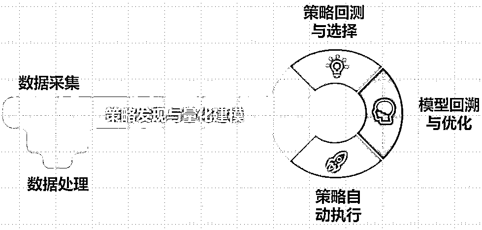
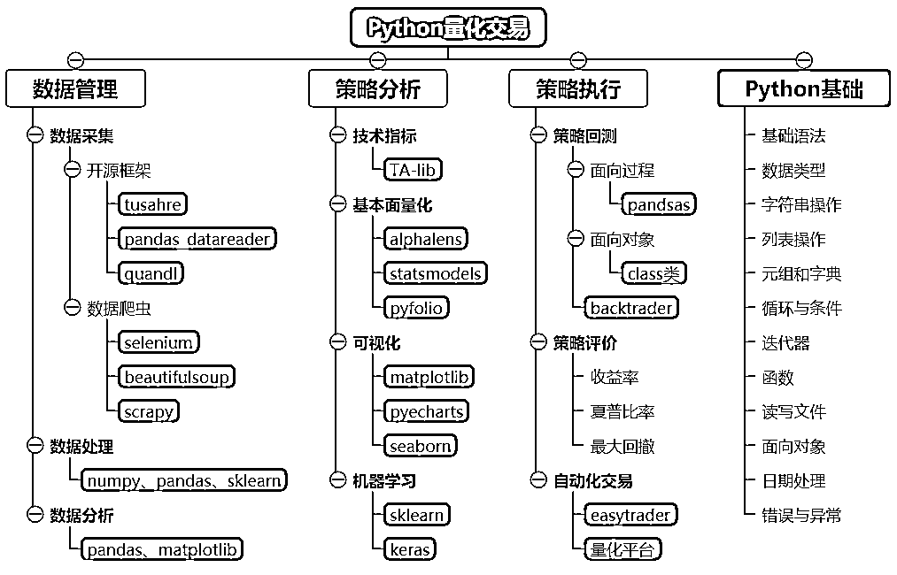
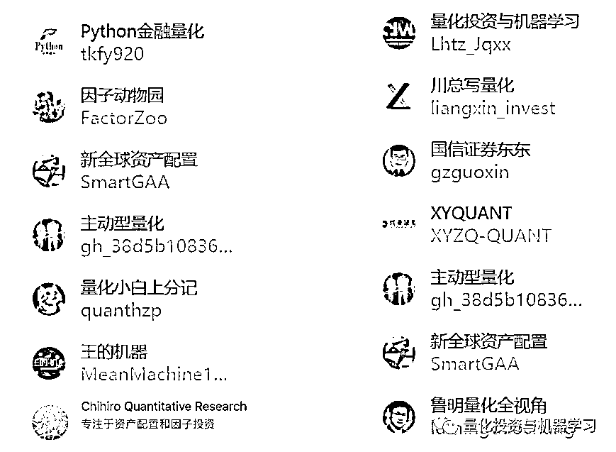
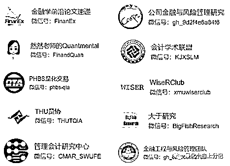
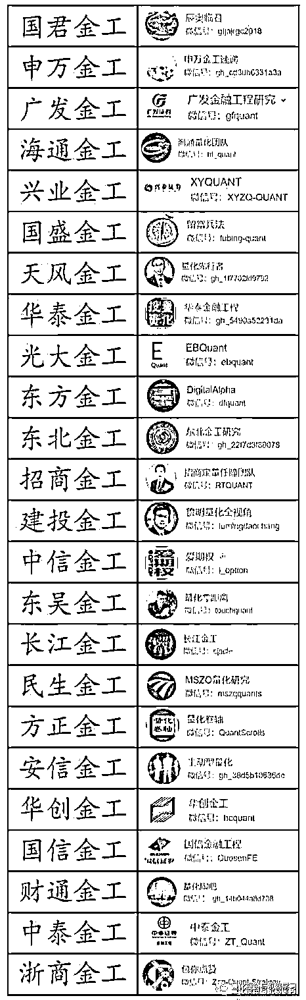

# 收藏级：最全量化资源大合集

> 原文：[`mp.weixin.qq.com/s?__biz=MzAxNTc0Mjg0Mg==&mid=2653295346&idx=1&sn=367d3ba97ca8be85219d43eb6f9ed48e&chksm=802dd0e7b75a59f1edcee0d6864afb6a13377ad0912a6a1556665556b95ed7a6e6986547562d&scene=27#wechat_redirect`](http://mp.weixin.qq.com/s?__biz=MzAxNTc0Mjg0Mg==&mid=2653295346&idx=1&sn=367d3ba97ca8be85219d43eb6f9ed48e&chksm=802dd0e7b75a59f1edcee0d6864afb6a13377ad0912a6a1556665556b95ed7a6e6986547562d&scene=27#wechat_redirect)

**标星★****置顶****公众号     **爱你们♥

**近期原创文章：**

## ♥ [5 种机器学习算法在预测股价的应用（代码+数据）](https://mp.weixin.qq.com/s?__biz=MzAxNTc0Mjg0Mg==&mid=2653290588&idx=1&sn=1d0409ad212ea8627e5d5cedf61953ac&chksm=802dc249b75a4b5fa245433320a4cc9da1a2cceb22df6fb1a28e5b94ff038319ae4e7ec6941f&token=1298662931&lang=zh_CN&scene=21#wechat_redirect)

## ♥ [Two Sigma 用新闻来预测股价走势，带你吊打 Kaggle](https://mp.weixin.qq.com/s?__biz=MzAxNTc0Mjg0Mg==&mid=2653290456&idx=1&sn=b8d2d8febc599742e43ea48e3c249323&chksm=802e3dcdb759b4db9279c689202101b6b154fb118a1c1be12b52e522e1a1d7944858dbd6637e&token=1330520237&lang=zh_CN&scene=21#wechat_redirect)

## ♥ 2 万字干货：[利用深度学习最新前沿预测股价走势](https://mp.weixin.qq.com/s?__biz=MzAxNTc0Mjg0Mg==&mid=2653290080&idx=1&sn=06c50cefe78a7b24c64c4fdb9739c7f3&chksm=802e3c75b759b563c01495d16a638a56ac7305fc324ee4917fd76c648f670b7f7276826bdaa8&token=770078636&lang=zh_CN&scene=21#wechat_redirect)

## ♥ [机器学习在量化金融领域的误用！](http://mp.weixin.qq.com/s?__biz=MzAxNTc0Mjg0Mg==&mid=2653292984&idx=1&sn=3e7efe9fe9452c4a5492d2175b4159ef&chksm=802dcbadb75a42bbdce895c49070c3f552dc8c983afce5eeac5d7c25974b7753e670a0162c89&scene=21#wechat_redirect)

## ♥ [基于 RNN 和 LSTM 的股市预测方法](https://mp.weixin.qq.com/s?__biz=MzAxNTc0Mjg0Mg==&mid=2653290481&idx=1&sn=f7360ea8554cc4f86fcc71315176b093&chksm=802e3de4b759b4f2235a0aeabb6e76b3e101ff09b9a2aa6fa67e6e824fc4274f68f4ae51af95&token=1865137106&lang=zh_CN&scene=21#wechat_redirect)

## ♥ [如何鉴别那些用深度学习预测股价的花哨模型？](https://mp.weixin.qq.com/s?__biz=MzAxNTc0Mjg0Mg==&mid=2653290132&idx=1&sn=cbf1e2a4526e6e9305a6110c17063f46&chksm=802e3c81b759b597d3dd94b8008e150c90087567904a29c0c4b58d7be220a9ece2008956d5db&token=1266110554&lang=zh_CN&scene=21#wechat_redirect)

## ♥ [优化强化学习 Q-learning 算法进行股市](https://mp.weixin.qq.com/s?__biz=MzAxNTc0Mjg0Mg==&mid=2653290286&idx=1&sn=882d39a18018733b93c8c8eac385b515&chksm=802e3d3bb759b42d1fc849f96bf02ae87edf2eab01b0beecd9340112c7fb06b95cb2246d2429&token=1330520237&lang=zh_CN&scene=21#wechat_redirect)

## ♥ [WorldQuant 101 Alpha、国泰君安 191 Alpha](https://mp.weixin.qq.com/s?__biz=MzAxNTc0Mjg0Mg==&mid=2653290927&idx=1&sn=ecca60811da74967f33a00329a1fe66a&chksm=802dc3bab75a4aac2bb4ccff7010063cc08ef51d0bf3d2f71621cdd6adece11f28133a242a15&token=48775331&lang=zh_CN&scene=21#wechat_redirect)

## ♥ [基于回声状态网络预测股票价格（附代码）](https://mp.weixin.qq.com/s?__biz=MzAxNTc0Mjg0Mg==&mid=2653291171&idx=1&sn=485a35e564b45046ff5a07c42bba1743&chksm=802dc0b6b75a49a07e5b91c512c8575104f777b39d0e1d71cf11881502209dc399fd6f641fb1&token=48775331&lang=zh_CN&scene=21#wechat_redirect)

## ♥ [计量经济学应用投资失败的 7 个原因](https://mp.weixin.qq.com/s?__biz=MzAxNTc0Mjg0Mg==&mid=2653292186&idx=1&sn=87501434ae16f29afffec19a6884ee8d&chksm=802dc48fb75a4d99e0172bf484cdbf6aee86e36a95037847fd9f070cbe7144b4617c2d1b0644&token=48775331&lang=zh_CN&scene=21#wechat_redirect)

## ♥ [配对交易千千万，强化学习最 NB！（文档+代码）](http://mp.weixin.qq.com/s?__biz=MzAxNTc0Mjg0Mg==&mid=2653292915&idx=1&sn=13f4ddebcd209b082697a75544852608&chksm=802dcb66b75a4270ceb19fac90eb2a70dc05f5b6daa295a7d31401aaa8697bbb53f5ff7c05af&scene=21#wechat_redirect)

## ♥ [关于高盛在 Github 开源背后的真相！](https://mp.weixin.qq.com/s?__biz=MzAxNTc0Mjg0Mg==&mid=2653291594&idx=1&sn=7703403c5c537061994396e7e49e7ce5&chksm=802dc65fb75a4f49019cec951ac25d30ec7783738e9640ec108be95335597361c427258f5d5f&token=48775331&lang=zh_CN&scene=21#wechat_redirect)

## ♥ [新一代量化带货王诞生！Oh My God！](https://mp.weixin.qq.com/s?__biz=MzAxNTc0Mjg0Mg==&mid=2653291789&idx=1&sn=e31778d1b9372bc7aa6e57b82a69ec6e&chksm=802dc718b75a4e0ea4c022e70ea53f51c48d102ebf7e54993261619c36f24f3f9a5b63437e9e&token=48775331&lang=zh_CN&scene=21#wechat_redirect)

## ♥ [独家！关于定量/交易求职分享（附真实试题）](https://mp.weixin.qq.com/s?__biz=MzAxNTc0Mjg0Mg==&mid=2653291844&idx=1&sn=3fd8b57d32a0ebd43b17fa68ae954471&chksm=802dc751b75a4e4755fcbb0aa228355cebbbb6d34b292aa25b4f3fbd51013fcf7b17b91ddb71&token=48775331&lang=zh_CN&scene=21#wechat_redirect)

## ♥ [Quant 们的身份危机！](https://mp.weixin.qq.com/s?__biz=MzAxNTc0Mjg0Mg==&mid=2653291856&idx=1&sn=729b657ede2cb50c96e92193ab16102d&chksm=802dc745b75a4e53c5018cc1385214233ec4657a3479cd7193c95aaf65642f5f45fa0e465694&token=48775331&lang=zh_CN&scene=21#wechat_redirect)

## ♥ [AQR 最新研究 | 机器能“学习”金融吗](http://mp.weixin.qq.com/s?__biz=MzAxNTc0Mjg0Mg==&mid=2653292710&idx=1&sn=e5e852de00159a96d5dcc92f349f5b58&chksm=802dcab3b75a43a5492bc98874684081eb5c5666aff32a36a0cdc144d74de0200cc0d997894f&scene=21#wechat_redirect)

**引言**

随着 Python 编程语言的流行和普及，越来越多人对如何应用 Python 做金融数据分析和量化交易充满兴趣。但是不少人对量化投资本身存在一定的误解或认识不清，有的人过于异想天开，认为可以躺着挣钱（怕是只有岛国老师吧）；有的人则因循守旧，认为没啥卵用；也有的人盲目追求模型的复杂性，在编程和数学中迷失了方向。

简单理解，量化投资就是利用计算机科技并采用一定的数学模型去实现投资理念、实现投资策略的过程。所以量化投资只是一种工具，只是用数量化的方法去实践投资理念，交易的本质并没有发生变化。量化投资的优势在于提高了我们分析的广度和深度，通过历史回测获取概率优势，同时自动交易过程可以规避人性中的诸多弱点。随着大数据和人工智能的发展，量化投资将成为市场的主流投资工具，并且将与传统的基本面分析和技术分析深度结合。

那么量化投资应该如何系统的学习呢？网上关于 Python 和量化（Quant）的资源汗牛充栋，十分庞杂，让很多踏入这一领域的人不知所措。那些已经掌握了 Python 编程基础的人，却不知如何切入量化的实际场景；而那些具备一定金融基础和策略思路的人，却不知如何使用 Python 来实现策略。因此，本文主要结合个人经验和网上公开资料，为大家分享 Python 和量化投资的学习资源，由于精力和关注度有限，经供参考，欢迎大家补充和分享。

**量化资源分享**

量化可以简单分为**数据管理**、**策略分析**和**策略执行**三个模块，数据是基础，策略分析是核心，其中策略自动化执行（算法交易）在国内由于政策限制实施起来比较麻烦。从 Python 的角度看，数据层往下分解，要学习的模块主要有 Pandas、Numpy、tushare、pandas_datareader 以及一些爬虫库等。策略层往下分解，要掌握的基础工具包括 Pandas、matplotlib、scikit-learn、TA-lib、statsmodels 等等。当然，在学习上述金融量化常用库前，系统的掌握 Python 编程基础是很有必要的。从策略的角度看，**光会玩 Python 是远远不够的，必须有自己的策略思路和逻辑**。那么策略的灵感来自哪里？除了自身实践总结外，各种量化平台、论坛、博客和学术期刊可能会提供一定的借鉴参考。下面将围绕 Python 编程、数据源、量化平台、策略来源等方面分享相关的学习资源。**Python 编程****▍搭建 Python 环境**

**• Anaconda：**推荐使用。

*https://www.anaconda.com/*

**• Pycharm：**用的人也很多。

*https://www.jetbrains.com/pycharm/*

**▍ 入门学习**

**• 廖雪峰官方网站：**

*https://www.liaoxuefeng.com/wiki/1016959663602400*

**• 菜鸟教程：**

*https://www.runoob.com/python3/python3-basic-syntax.html*

**• GitHub 项目：**

分享 notebook 格式小项目，从入门到 numpy、pandas、matplotlib 等各种库的讲解和练习，非常适合新手入门。

*https://github.com/goodchinas/pyquant*

**▍ 高阶学习书籍****• ****Python for Finance**，2014,Yves Hilpisch 中文版：Python 金融大数据分析，人民邮电出版社**• ****Mastering Python for Finance**，2015，James Ma Weiming**• ****Personal Finance with Python**，2018，Max Humber

**xPython for Finance**，2017，Yuxing Yan

**• ****Derivatives Analytics with Python**，2015，Yves Hilpisch**• ****QuantEcon Lectures**，2019，Thomas J. Sargent and John Stachurski**•**** 量化投资以 Python 为工具**，2017，蔡立耑**• ****零起点 Python 大数据与量化交易**，2017，何海群

**• ****量化交易之路用 Python 做股票量化分析**，2017，阿布

**量化数据源**

金融量化数据源主要有三种：一是大数据网站，一般只有日线级数据；二是专业金融数据公司，如通联和万德，收费价格高但数据齐全且比较稳定；三是开源数据模块库，如 Tushare，pandas-datareader，ccxt 数字货币等，github 上还有很多不一一列举。

**▍Python 开源数据**

**• TuShare pro：**中文财经数据接口包，有积分限制。

* https://tushare.pro/*

**•**** BaoStock：**与 tushare 类似，主要提供国内股票行情数据、公司基本面和宏观数据。

*http://baostock.com/*

**•** **Quandl**

*https://www.quandl.com/*

**▍国际金融和经济数据**

**• pandas_datareader：**从 pandas 中独立出来的数据开源库，丰富的数据源，包括美股、A 股、宏观数据等。

*https://pandas-datareader.readthedocs.io/en/latest/*

**• yfinance：**雅虎财经数据 api 的修复。

*https://pypi.org/project/yfinance/*

**• ccxt：**Python 数字货币开源接口。

*https://github.com/ccxt/ccxt*

**▍其他数据源**

**• **通达信 （免费）

**• **聚宽：jqdatasdk（免费/收费）

**• **新浪、雅虎、东方财富网（免费）

**• **Wind 金融终端（收费）

**• **东方财富 Choice 金融终端（收费）

**• **同花顺金融数据终端 （可免费导出）

**在线量化平台和开源框架**

平台之间大同小异，可以重点关注各大平台的策略大赛（练手）、社区（借鉴参考优秀项目）和学院（系统学习量化知识框架）板块。

**▍国内平台（排名不分先后）**

**• WindQuant 万矿 ：**Wind 唯一一个面向互联网的量化平台。内嵌 Wind Python API 数据接口。提供全市场股票、债券、基金、商品、指数、外汇、期权等 7 个品种的历史日线、Tick、分钟和实时行情数据，以及中国市场所有品种的专题统计报表和中国及海外股票板块数据、宏观数据等。学院 WQFA 计划不错！

*https://www.windquant.com/      *

**• JoinQuant 聚宽 ：**免费量化数据、投研工具、量化学习体系。社区、社群全网最活跃。

*https://www.joinquant.com/       *

**• RiceQuant 米筐：**涵盖金融数据、投资组合管理与风险分析、量化投研交易模块。

*https://www.ricequant.com/welcome/*

**• UQER 优矿 ：**特色是深度报告、量化学堂和量化社区。

*https://uqer.io/       *

**• 掘金量化 ：**面向量化投研和实战设计，追求安全、快速、可靠的极限。提供数据、研究、回测、仿真、实盘、风控、绩效等专业量化服务

*https://www.myquant.cn/*

**• BigQuant ：**人工智能量化平台，社区和学院提供了较丰富的资源。

*https://bigquant.com/*

**• 真格量化：**特色是期权回测功能全面。

*https://quant.pobo.net.cn/login#/*

**• DigQuant 点宽：**兼容 MATLAB、Python 语言回测。

*https://www.digquant.com.cn/*

**• Factors 数库 ：**专注于多因子分析，界面操作，黑盒子。

*http://factors.chinascope.com/*

**▍国外量化平台**国外量化平台非常多，这里只推荐两个。

**• Quantopian ：**比较知名的平台，旗下有量化三大件：pyFolio，zipline，alphalens

*https://www.quantopian.com/posts*

**• Quantstart：**平台文章提供了构建自己量化交易系统的思路框架

*https://www.quantstart.com/*

**▍开源框架（实现本地化）**

一般是直接在终端（cmd）上使用 pip install xxx(库名）进行安装，有些可能需要下载安装包离线安装。

• Zipline - 回测框架

# • RQAlpha - 米筐回测框架

# • QUANTAXIS - 量化金融策略框架

# • VN.PY - Python 开源开发框架

• easytrader - 自动程序化股票交易

• pyalgotrade - 基于事件驱动回测框架

• quantmod - 量化金融建模

• backtrader -量化回测框架

**策略来源******▍**量化投资专业网站、博客、论坛**

**• AQR：**

*https://www.aqr.com/*

**• Quantivity：**

*https://quantivity.wordpress.com/page/2/ *

**• QuantLib：**

*http://www.implementingquantlib.com/ *

**• NuclearPhynance：**

*http://www.nuclearphynance.com/ *

**• Udacity：**

*https://www.udacity.com/course/machine-learning-for-trading--ud501*

**• Quant At Risk：**

*http://www.quantatrisk.com/ *

**• 经管之家：**

*https://bbs.pinggu.org/forum-2166-1.html*

**• 知乎 -宽客：**

*https://bbs.pinggu.org/forum-2166-1.html *

**• 知乎 -量化：**

*https://www.zhihu.com/topic/19815465/hot*

**• GitHub：**

*https://github.com/*

**• FMZ 发明者量化交易平台：**

*https://www.fmz.com/bbs*

****▍**量化投资书籍**

如果完全不懂金融投资理论，就谈量化投资，很容易流于形式，画出来漂亮的图表和策略，也就能忽悠一下外行而已。一直强调 Python 只是工具，不要舍本逐末，量化投资核心是策略和思路，而策略的来源需要一定的统计和投资学的积累与沉淀。

**• **曼昆的**宏微观经济学**、米什金的**《货币金融学》**、罗斯**《公司理财》**、博迪**《投资学》**、**《金融工程》**、索罗斯**《金融炼金术》**

**x《计量经济学导论：现代观点》**

主要学习时间序列分析、多元统计线性回归，可结合 Python 的 statsmodels、scipy、sklearn 模块进行学习。

**• 多因子模型：**基础好的话可以阅读砝码三因子的 PAPER。

此外，Barra 风险模型（多因子模型扩展）是现在非常主流的量化模型，有很多可以参考的资料，如**《Barra Risk Model Handbook（US）》**。

****▍**投资相关书籍**

**•**《打开量化投资的黑箱》 里什·纳兰**•**《宽客》[美] 斯科特·帕特森**•**《解读量化投资：西蒙斯用公式打败市场的故事》忻海**•**《漫步华尔街》麦基尔**•**《海龟交易法则》柯蒂斯·费思**•**《交易策略评估与最佳化》罗伯特·帕多**•**《统计套利》 安德鲁·波尔**•**《信号与噪声》纳特•西尔弗**•**《量化投资—策略与技术》丁鹏**•**《量化投资策略:如何实现超额收益 Alpha》吴冲锋**•**《以交易为生》埃尔德**•**《高级技术分析》布鲁斯·巴布科克**•**《积极型投资组合管理》格里纳德，卡恩**•**《金融计量学:从初级到高级建模技术》斯维特洛扎**•**《量化交易如何建立自己的算法交易事业》欧内斯特·陈**•**《聪明的投资者》 本杰明·格雷厄姆**•**《期权、期货和其他衍生品》 约翰·赫尔**▍学术期刊**

金融三大顶级期刊：

**• **Journal of Finance

**• **Journal of Financial Economics

**•** Review of Financial Studies

**▍其他金融投资期刊**

**•**Journal of Accounting and Economics、Journal of Financial and Quantitative Analysis、Financial Analysts 、Journal Financial Management、Journal of Empirical Finance、Quantitative Finance、Journal of Alternative Investments、Journal of Fixed Income、Journal of Investing、Journal of Portfolio Management、Journal of Trading、Review of Asset Pricing Studies

国内期刊：国内专门讨论量化投资的学术文章比较少，可关注**经济研究、经济学（季刊）、金融研究、管理世界、会计研究、投资研究。**

**▍微信公众号资源**

微信公众号也提供了很多量化资源可供学习参考，下面分享几个博主关注的，排名不分先后。

还有热心网友整理的如下：

**结语**

**量化只是一种工具或手段，量化投资则是目前比较流行的一种交易分析框架，需要掌握的知识体系还真比较庞杂。**值得关注的是，证券投资的专业性远没有工科类的专业性那么可靠。比如说，你拥有制造汽车的专业技能，就能造出一部汽车；但当你掌握了证券投资的专业知识，却不一定能在股票市场上赚到钱。一个不难观察到的现象是，很多金融专业人士在股票投资这个领域不一定能干出好的成绩，而一些非金融背景的人却表现优异。这可能与证券投资的非逻辑性（艺术而不是科学）有关，交易市场的本质是零和博弈（不考虑手续费等），尤其是期货交易。但是不得不说这已经是个对专业要求越来越高的行当，因为在高收入的引诱下，各种高精尖人才都挤破脑袋往这个行业里钻。

尤其是近几年，大型券商和基金招人连清北复交也不怎么鸟了，指定北美前五十高校，玩的模型和技术也越来越花了。**尽管专业的金融背景只是投资成功的必要条件（非充分条件），但是如果连基本的经济金融基础也没有，要想与市场上的其他人玩，成为韭菜的概率就更高了。**  

**参考资料**

知乎：守株待兔《史上最全 Quant 资源整理》，原始出处已无从考证：https://zhuanlan.zhihu.com/p/26179943

*—End—*

量化投资与机器学习微信公众号，是业内垂直于**Quant**、**MFE**、**CST、AI**等专业的**主****流量化自媒体**。公众号拥有来自**公募、私募、券商、银行、海外**等众多圈内**18W+**关注者。每日发布行业前沿研究成果和最新量化资讯。你点的每个“在看”，都是对我们最大的鼓励