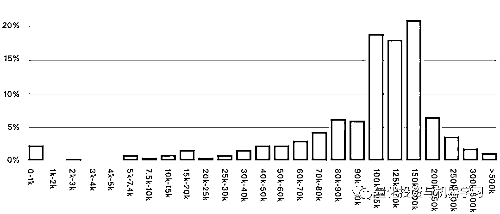
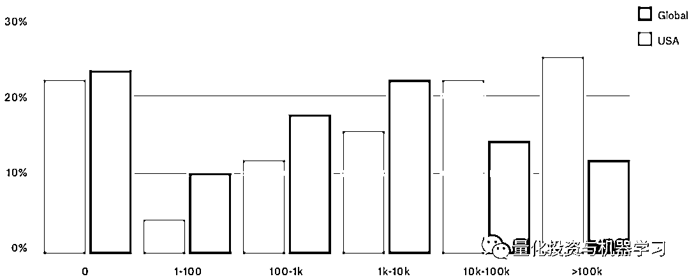

# 2019Kaggle 最新 DS&ML 报告：你大爷还是你大爷！

> 原文：[`mp.weixin.qq.com/s?__biz=MzAxNTc0Mjg0Mg==&mid=2653295334&idx=1&sn=c654911586f64dc67d7e99dfabcd1c50&chksm=802dd0f3b75a59e593d6d07ba6585d82e78d93c6d7a8be2bdfa046f07e453b77238c25061d6c&scene=27#wechat_redirect`](http://mp.weixin.qq.com/s?__biz=MzAxNTc0Mjg0Mg==&mid=2653295334&idx=1&sn=c654911586f64dc67d7e99dfabcd1c50&chksm=802dd0f3b75a59e593d6d07ba6585d82e78d93c6d7a8be2bdfa046f07e453b77238c25061d6c&scene=27#wechat_redirect)

**标星★****置顶****公众号     **爱你们♥   

编译：1+1=6

来自：Kaggle

**近期原创文章：**

## ♥ [5 种机器学习算法在预测股价的应用（代码+数据）](https://mp.weixin.qq.com/s?__biz=MzAxNTc0Mjg0Mg==&mid=2653290588&idx=1&sn=1d0409ad212ea8627e5d5cedf61953ac&chksm=802dc249b75a4b5fa245433320a4cc9da1a2cceb22df6fb1a28e5b94ff038319ae4e7ec6941f&token=1298662931&lang=zh_CN&scene=21#wechat_redirect)

## ♥ [Two Sigma 用新闻来预测股价走势，带你吊打 Kaggle](https://mp.weixin.qq.com/s?__biz=MzAxNTc0Mjg0Mg==&mid=2653290456&idx=1&sn=b8d2d8febc599742e43ea48e3c249323&chksm=802e3dcdb759b4db9279c689202101b6b154fb118a1c1be12b52e522e1a1d7944858dbd6637e&token=1330520237&lang=zh_CN&scene=21#wechat_redirect)

## ♥ 2 万字干货：[利用深度学习最新前沿预测股价走势](https://mp.weixin.qq.com/s?__biz=MzAxNTc0Mjg0Mg==&mid=2653290080&idx=1&sn=06c50cefe78a7b24c64c4fdb9739c7f3&chksm=802e3c75b759b563c01495d16a638a56ac7305fc324ee4917fd76c648f670b7f7276826bdaa8&token=770078636&lang=zh_CN&scene=21#wechat_redirect)

## ♥ [机器学习在量化金融领域的误用！](http://mp.weixin.qq.com/s?__biz=MzAxNTc0Mjg0Mg==&mid=2653292984&idx=1&sn=3e7efe9fe9452c4a5492d2175b4159ef&chksm=802dcbadb75a42bbdce895c49070c3f552dc8c983afce5eeac5d7c25974b7753e670a0162c89&scene=21#wechat_redirect)

## ♥ [基于 RNN 和 LSTM 的股市预测方法](https://mp.weixin.qq.com/s?__biz=MzAxNTc0Mjg0Mg==&mid=2653290481&idx=1&sn=f7360ea8554cc4f86fcc71315176b093&chksm=802e3de4b759b4f2235a0aeabb6e76b3e101ff09b9a2aa6fa67e6e824fc4274f68f4ae51af95&token=1865137106&lang=zh_CN&scene=21#wechat_redirect)

## ♥ [如何鉴别那些用深度学习预测股价的花哨模型？](https://mp.weixin.qq.com/s?__biz=MzAxNTc0Mjg0Mg==&mid=2653290132&idx=1&sn=cbf1e2a4526e6e9305a6110c17063f46&chksm=802e3c81b759b597d3dd94b8008e150c90087567904a29c0c4b58d7be220a9ece2008956d5db&token=1266110554&lang=zh_CN&scene=21#wechat_redirect)

## ♥ [优化强化学习 Q-learning 算法进行股市](https://mp.weixin.qq.com/s?__biz=MzAxNTc0Mjg0Mg==&mid=2653290286&idx=1&sn=882d39a18018733b93c8c8eac385b515&chksm=802e3d3bb759b42d1fc849f96bf02ae87edf2eab01b0beecd9340112c7fb06b95cb2246d2429&token=1330520237&lang=zh_CN&scene=21#wechat_redirect)

## ♥ [WorldQuant 101 Alpha、国泰君安 191 Alpha](https://mp.weixin.qq.com/s?__biz=MzAxNTc0Mjg0Mg==&mid=2653290927&idx=1&sn=ecca60811da74967f33a00329a1fe66a&chksm=802dc3bab75a4aac2bb4ccff7010063cc08ef51d0bf3d2f71621cdd6adece11f28133a242a15&token=48775331&lang=zh_CN&scene=21#wechat_redirect)

## ♥ [基于回声状态网络预测股票价格（附代码）](https://mp.weixin.qq.com/s?__biz=MzAxNTc0Mjg0Mg==&mid=2653291171&idx=1&sn=485a35e564b45046ff5a07c42bba1743&chksm=802dc0b6b75a49a07e5b91c512c8575104f777b39d0e1d71cf11881502209dc399fd6f641fb1&token=48775331&lang=zh_CN&scene=21#wechat_redirect)

## ♥ [计量经济学应用投资失败的 7 个原因](https://mp.weixin.qq.com/s?__biz=MzAxNTc0Mjg0Mg==&mid=2653292186&idx=1&sn=87501434ae16f29afffec19a6884ee8d&chksm=802dc48fb75a4d99e0172bf484cdbf6aee86e36a95037847fd9f070cbe7144b4617c2d1b0644&token=48775331&lang=zh_CN&scene=21#wechat_redirect)

## ♥ [配对交易千千万，强化学习最 NB！（文档+代码）](http://mp.weixin.qq.com/s?__biz=MzAxNTc0Mjg0Mg==&mid=2653292915&idx=1&sn=13f4ddebcd209b082697a75544852608&chksm=802dcb66b75a4270ceb19fac90eb2a70dc05f5b6daa295a7d31401aaa8697bbb53f5ff7c05af&scene=21#wechat_redirect)

## ♥ [关于高盛在 Github 开源背后的真相！](https://mp.weixin.qq.com/s?__biz=MzAxNTc0Mjg0Mg==&mid=2653291594&idx=1&sn=7703403c5c537061994396e7e49e7ce5&chksm=802dc65fb75a4f49019cec951ac25d30ec7783738e9640ec108be95335597361c427258f5d5f&token=48775331&lang=zh_CN&scene=21#wechat_redirect)

## ♥ [新一代量化带货王诞生！Oh My God！](https://mp.weixin.qq.com/s?__biz=MzAxNTc0Mjg0Mg==&mid=2653291789&idx=1&sn=e31778d1b9372bc7aa6e57b82a69ec6e&chksm=802dc718b75a4e0ea4c022e70ea53f51c48d102ebf7e54993261619c36f24f3f9a5b63437e9e&token=48775331&lang=zh_CN&scene=21#wechat_redirect)

## ♥ [独家！关于定量/交易求职分享（附真实试题）](https://mp.weixin.qq.com/s?__biz=MzAxNTc0Mjg0Mg==&mid=2653291844&idx=1&sn=3fd8b57d32a0ebd43b17fa68ae954471&chksm=802dc751b75a4e4755fcbb0aa228355cebbbb6d34b292aa25b4f3fbd51013fcf7b17b91ddb71&token=48775331&lang=zh_CN&scene=21#wechat_redirect)

## ♥ [Quant 们的身份危机！](https://mp.weixin.qq.com/s?__biz=MzAxNTc0Mjg0Mg==&mid=2653291856&idx=1&sn=729b657ede2cb50c96e92193ab16102d&chksm=802dc745b75a4e53c5018cc1385214233ec4657a3479cd7193c95aaf65642f5f45fa0e465694&token=48775331&lang=zh_CN&scene=21#wechat_redirect)

## ♥ [AQR 最新研究 | 机器能“学习”金融吗](http://mp.weixin.qq.com/s?__biz=MzAxNTc0Mjg0Mg==&mid=2653292710&idx=1&sn=e5e852de00159a96d5dcc92f349f5b58&chksm=802dcab3b75a43a5492bc98874684081eb5c5666aff32a36a0cdc144d74de0200cc0d997894f&scene=21#wechat_redirect)

**前言**

近日，Kaggle 发布了名为《2019Kaggle 数据科学和机器学习概要》的报告。此报告为 Kaggle 对其社区的第三次年度调查，调查内容来自 19717 个 Kaggle 成员的反馈。里面有很多有意思的内容，快让我们一睹为快吧！注：报告中所有的货币金额都是美元。

**先总结，再分析**

**1、数据科学大部分是男性，这种不平衡与前几年没有变化。**

**2、超过一半的数据科学家年龄不到 30 岁。**

**3、不出所料，数据科学家都受过高等教育，超过一半的人获得了高等学位。**

**4、超过一半的受访者拥有少于五年的编程经验，甚至一些机器学习经验。**

**5、美国数据科学家的薪水远远超过其他国家。**

**6、大多数数据科学家在小型或大型公司中工作。超过一半的公司是机器学习新手。**

**7、本地开发环境是数据科学家执行其工作最常见的方式。**

**8、近四分之一的专业数据科学家还没有采用云计算。**

**9、TensorFlow 和 Keras 仍然是占主导地位的深度学习框架。**

**10、美国在机器学习和云计算产品上的投入远远超过世界其他国家。**

**11、常规的算法，如线性回归和决策树，虽然不如 RNN、CNN 等复杂和强大，但它们仍然占主导地位。**

**12、与去年相比，谷歌 Cloud AutoML 的使用量几乎翻了一番。**

**1、数据科学家简介****▍性别**

数据科学家的性别差异仍然很大，**84%的用户是男性**。美国的性别差距略小，为 79%，而日本略高，为 90%。无论在哪个地区，结果都是相对一致的。

**▍年龄**

千禧一代主导着数据科学，**25-29 岁是最常见的年龄段**。在印度，这个数字甚至更年轻，41%的人是 19-24 岁。然而，各个年龄段的成年人都在探索数据科学，所有受访者中有 18%的人年龄在 40 岁或 40 岁以上。

**▍国家**

来自美国和印度的受访者数量最多。其次是巴西和俄罗斯。

**教育****▍高等教育**

仅就在职数据科学家而言，**超过 70%的受访者拥有学士以上学位**，其中大多数（约 52%）拥有硕士学位。虽然 19%的受访者拥有博士学位，但这一比例因国家而异。德国拥有博士学位的受访者比例最高，为 38%，而印度的比例最低，不到 5%。

超过 99.5%的数据科学家在高中毕业后继续深造。

**▍终身学习**

超过 70%的数据科学家说他们通过阅读博客来学习。使用 Kaggle 论坛在 Kaggle 用户中也很受欢迎，超过 65%的用户使用该论坛。还有许多其他的回答，但有一件事是肯定的：**绝大多数数据科学家仍在学习**；只有约 2%的受访者表示他们不使用任何媒体来提高他们的数据科学技能。

**学无止境，不断充电！** 

**数据科学和机器学习经验**

全球数据科学家由同等数量的新手和经验丰富的老手组成。**最常见的（33%）是有 3-5 年的工作经验**。大约三分之一的人工作经验少于 3 年，另外三分之一的人工作经验超过 5 年。

花在学习代码上的时间

机器学习的正态分布较少。虽然大多数人有超过一年的经验，但 35%的人仍处于使用机器学习的头两年。大约 6%的人有超过 10 年的机器学习经验。

花在学习机器学习上的时间

**就业****▍Pay**

我们询问了数据科学家关于他们的工资、雇主类型以及他们如何度过这段时光的。结果因国家而异，特别是在 Pay 方面。

**美国数据科学家的平均工资高于其他国家**，其次是德国和日本。另一方面，印度的工资较低，**近 20%的印度受访者年收入不到 1000 美元。**

那些在美国被雇佣为数据科学家的人属于我们调查中使用的最高等级的范围。大多数人的收入在 10 万到 20 万美元之间。

**时间****▍时间花费**

作为一名数据科学家，其最常见的职责是什么？ 与复杂的机器学习相比，**超过 75%的人建议理解和分析数据是最常见的**。也许这就解释了为什么 Kagglers 能够在每次新比赛的第一个小时内创造出如此多的 EDA 内核！超过一半的受访者提到了原型设计和机器学习实验。

**▍使用数据科学的公司**

我们向数据科学家询问了他们工作过公司的更多信息：员工人数、团队规模，以及这些公司是如何采用机器学习实践的。

公司规模（员工人数）

**▍数据科学团队**

数据科学团队的规模各不相同，但有 25%的团队成员在 20 人以上。结合较低的范围，我们看到超过 40%的人在少于 5 人的团队中工作。

在目前被雇佣为数据科学家的用户中，4%的人表示他们的团队规模为零。这些受访者要么没有把自己算在内，要么数据科学只是他们职责的一部分。

数据科学团队（员工人数）

**▍企业机器学习的应用**

结合其他问题，**机器学习正变得越来越流行**。超过 30%的用户说他们公司最近开始使用机器学习方法，17%的用户说他们正在探索机器学习方法。自 2018 年以来，在拥有完善机器学习方法的公司工作的数据科学家比例增加了 11%。

**▍支出**

从全球来看，**多数受访者（23%）根本没有把钱花在机器学习和云计算产品上。**

在美国，情况就不同了，**多数人（24%）在过去五年里在产品上花费了超过 10 万美元。只有 34%的人表示自己的消费低于 1000 美元**，而全球这一比例接近 43%。

过去 5 年企业支出

**技术****▍开发环境**

最常见的分析工具是本地开发环境。其中**Jupyter- La****b**和它的 offshoots 是最常见的，83%的数据科学家经常使用它。这也在情理之中哈！

**▍方法和算法**

**受访者觉得算法越简单越好！**

**天猫双十一的销售额一个三次多项式就解决了**

**多么返璞归真！** 

天猫双十一销售额三次多项式拟合

常规的算法，如线性回归和决策树，虽然不如 RNN、CNN 等复杂和强大，但它们仍然占主导地位，**因为它们更容易理解！**  

至于使用的机器学习框架，数据科学家使用多种工具。**超过 80% 的人使用 Scikit-learn**，这是一个包含流行数据科学算法的 Python 包。**TensorFlow 和 Keras 经常结合使用，二者仍然是主流的深度学习框架。**

**▍企业工具**

大多数专业数据科学家都在使用云计算，尽管仍有超过 24%的人没有使用。**AWS、谷歌云平台和 Microsoft Azure**是目前数据科学家使用云工具的三大首选。

**▍Automated 机器学习**

尤其值得注意的是自去年调查以来 Google Cloud AutoML 的增长。 总体而言，使用这个机器学习平台的受访者数量几乎翻了一番，美国数据科学家的增长速度与此类似。

*来自：**https://www.kaggle.com/*

*—End—*

量化投资与机器学习微信公众号，是业内垂直于**Quant**、**MFE**、**CST、AI**等专业的**主****流量化自媒体**。公众号拥有来自**公募、私募、券商、银行、海外**等众多圈内**18W+**关注者。每日发布行业前沿研究成果和最新量化资讯。你点的每个“在看”，都是对我们最大的鼓励