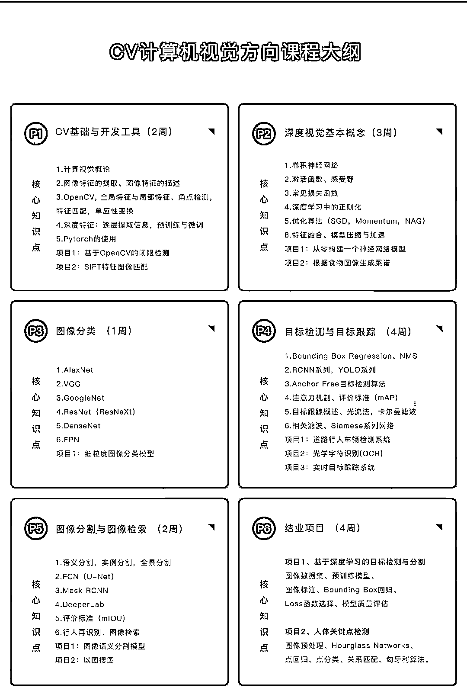
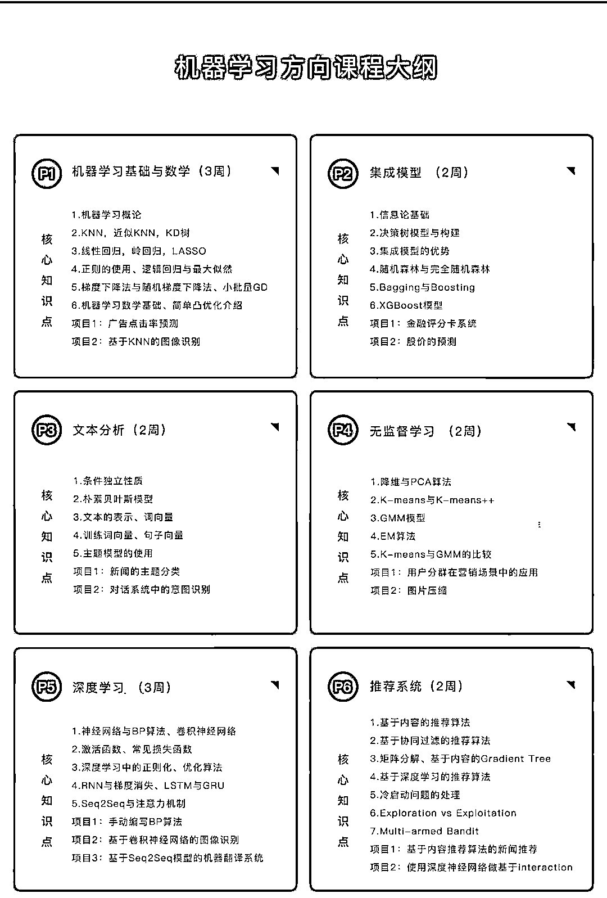
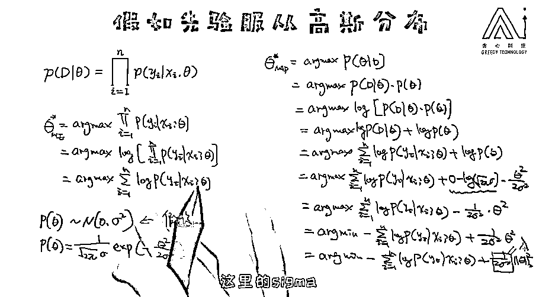
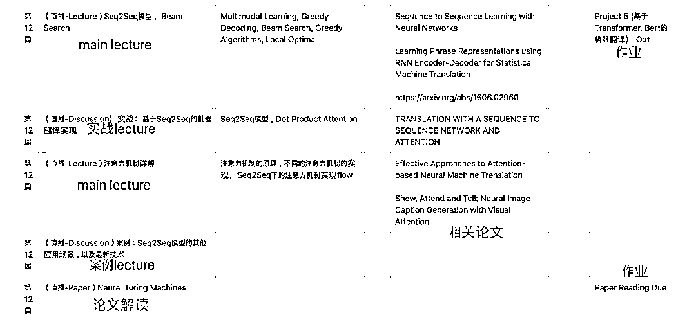

# 贪心学院 AI 魔鬼训练营：机器学习/自然语言处理/CV 专业招生

> 原文：[`mp.weixin.qq.com/s?__biz=MzAxNTc0Mjg0Mg==&mid=2653295307&idx=1&sn=2bd5a1cc604d67ea02dddda7a532fadf&chksm=802dd0deb75a59c80c39d30c584ac49a5ab1f4750ffceaf51cdaf2ad0d3272f705ea6970add1&scene=27#wechat_redirect`](http://mp.weixin.qq.com/s?__biz=MzAxNTc0Mjg0Mg==&mid=2653295307&idx=1&sn=2bd5a1cc604d67ea02dddda7a532fadf&chksm=802dd0deb75a59c80c39d30c584ac49a5ab1f4750ffceaf51cdaf2ad0d3272f705ea6970add1&scene=27#wechat_redirect)

2019 年大家有没有发现一种社会现象，AI 岗位的竞争也变得越来越激烈？但我们不是说 AI 人才非常缺乏吗？这个看似有点矛盾，但仔细想一想就能发现其中的主要原因还是**很多人想涌入这个赛道、但绝大部分人并不满足这个岗位的要求**。所以归根结底，还是人才非常稀缺！ 

如果之后想从事 AI 行业，一方面不得不关注对技术细节的认知、另外一方面有可能会关注项目经历。为了满足社会对 AI 人才的需求，继机器学习高端班和自然语言处理高端班之后，贪心学院这次又重磅对出 AI 训练营的课程（分三个方向），专门为哪些以后从业 AI 者精心打造。 

**01 需要具备的能力**

1.  本科及以上学历最佳。

2.  英语能力，通过 CET-4 最佳。
3.  持续学习能力，课程每周需投入课程+项目、作业共计约 6 小时时间。
4.  最好熟悉一门编程语言，如 Python、Java 等；

**注：**对于满足以上条件的同学，我们为您提供了免费的前置课程（数学基础、Python 编程基础），进行知识的回忆与巩固。

**02 训练营 3 大 AI 技术方向（可选一个方向攻读）**随着各大 AI 企业布局人工智能，如头条、淘宝的推荐系统，谷歌搜索引擎，Siri 和天猫精灵这样的语音助理，百度无人驾驶汽车，美图秀秀 AI 美颜，人脸识别等均应用到了自然语言处理、计算机视觉、机器学习等 AI 技术。课程将围绕这 3 个方向的展开，**由浅入深配备以企业级项目实战**，**4 个月时间助你为心仪企业的 offer 打下扎实的基础。**

**03 魔鬼式 AI 强化训练营**

训练营采用高强度教学形式，在**4 个月内**达让你到能够解决企业常见问题、理解重要原理的水平。找到一份机器学习工程师、NLP 算法工程师、计算机视觉工程师、推荐算法工程师等 AI 相关岗位。

**课程安排**

1.每周三小时主修专业课程（ML／NLP／CV）； 

2.每周一小时项目案例练习及讲解，加深学习印象； 

3.每周一小时公共课程，巩固基础；

4.为期一个月的大型项目毕业设计；

5.10 篇经典专业论文阅读辅导及讲解； 

6.模拟面试、简历修改、背景提升等职业生涯辅导； 

本次课程培训为期时长 6 个月，其中核心授课时间 4 个月，就业指导 2 个月。

**04 企业级项目实操**

区别于普通 demo 讲解，每个项目需要独立完成或与小组内团队成员配合完成，平均完成时长在**1 个月左右**。增涨实战经验的同时，丰富了简历中项目和经历的含金量。

# **项目一、基于医疗知识图谱的问答系统**

## **【项目概要】**

医疗+AI 领域一向都是行业的热点。在本项目中，大家将有机会完成一款基于知识图 谱的问答系统。从知识图谱的搭建到问答系统模块、最后到部署上线，你将会体会 到完整的流程。

## **【涉及到的技术点】**

爬虫，文本数据清洗、预处理，文本挖掘，文本分类，知识图谱的构建以及查询， 序列到序列模型，attention 机制，模型部署。

# **项目二、利用结构化数据生成文本**

## **【项目概要】**

在工业界，文本生成的应用到处可见，比如自动生成天气预报、体育新闻的生成、学生能力报告的生成等等。在本项目中，你将有机会根据给定的结构化数据来一段文本。

## **【涉及到的技术点】**

预训练模型，seq2seq，attention 机制, copy 机制，损失函数的优化，文本质量的评估（rouge，bleu, cider 等）

# **项目三、Kaggle 比赛（文本匹配）**

## **【项目概要】**

Quora 可以认为是英文的知乎，如何给用户匹配接近的问题是平台面临的挑战。客服机器人等应用也会使用文本匹配技术。

**项目四、基于深度学习的目标检测与分割**

## **【项目概要】**

目标的检测是 CV 领域研究最热，应用最广的分支。目标检测广泛应用于人脸检测、自动驾驶、医疗影像处理等多个领域。图像的分割技术也旨在对检测目标的轮廓进行更加细致的描述，是比检测更精确的一种识别方式。本项目中我们将目标检测与分割在同一个算法当中进行同时的输出，然后对模型进行优化，使其能够达到更快的速度，更高的精度。

## **【涉及到的技术点】**

图像数据集、预训练模型、图像标注、Bounding Box 回归、Loss 函数选择、模型质量评估

# **项目五、人体关键点检测**

# **【项目概要】**

人体关键点检测可以用于对身体和手的姿态进行估计估计，对于关键点的估计可以应用于人体的运动分析、行为分析、绘画辅助、游戏人物动作采集、虚拟现实等领域。通过本项目我们构建一个人体关键点检测系统，并且实时输出检测结果。

**【涉及到的技术点】**

图像预处理、Hourglass Networks、点回归、点分类、关系匹配、匈牙利算法。

**对课程有意向的同学**

**请长按识别下方二维码**

**添加课程顾问小姐姐微信**

**报名、课程咨询**

**👇👇👇**

**05 三大方向课程周期及项目展示**

**06 ****从 0 到 1 掌握算法推导原理**区别于劣质的 PPT 讲解，我们的课程全程手推公式，确保每位学员深入理解算法的核心。让你完整掌握相关算法的推导过程。
**07 科学的教学体系+全方位能力培养**课程采用直播的方式，一周 4-5 次的直播教学， 包括 2 次的 main lectures, 1-2 次的 discussion session (讲解某一个实战、必备基础、案例或者技术上的延伸）， 1 次的 paper reading session (每周会 assign 一篇必备论文，并且直播解读)。教学模式参考美国顶级院校的教学培养体系。 以下为其中一周的课程安排，供参考。 

*   **全职助教实时答疑**

不管你在学习过程中遇到多少阻碍，你都可以通过以下 4 种方式解决：

*   直接在线问导师；
*   或者记录到共享文档中，等待每日固定时间的直播答疑；
*   学习社群中全职助教，24h 随时提问答疑
*   共同的问题在 Review Session 里面做讲解

注：每次答疑，班主任都会进行记录，以便学员实时查阅。来自师兄师姐的疑问：

*   **编写一些技术类文章**

通过在知乎上发表相关技术文章进行自我成果检验，同时也是一种思想碰撞的方式，导师会对发表的每一篇文章写一个详细的评语。万一不小心成为一个大 V 了呢？虽然写文章的过程万分痛苦，学习群里半夜哀嚎遍野，但看一看抓着头发写出来的文章结果还是非常喜人的！看着自己收获的点赞数，大家都默默地感谢起大魔头的无情！
这种满满的成就感，让大家一篇接一篇的写了下去！个个都立刻变身成了知乎大牛~

*   **Project 项目**

除了文章，算法工程师立命的根本--项目代码。每次布置的作业，导师都会带领助教团队会予以详细的批改和反馈。并逼着你不断的优化！**08 课程研发导师**
贪心学院联合来至 Google、亚马逊、微软等 AI 企业 11 位 AI 科学家对课程内容进行打造，确保学员学到的是国内外企业中热门 AI 知识技能。**09 学员就业情况**截止目前累积培养数千名 NLP 工程师，CV 视觉算法工程师，机器学习算法工程师。部分学员已在大型 AI 企业担任 CTO，AI 技术负责人等重要角色。**10 往期学员评价****11 奖金及学费说明****班级学费**通关班、无忧班、连读班的课程内容一致，无忧班会在第三方公证平台上签订保过协议。**奖学金****对于满足以下条件的学员，我们提供 50%学费的奖学金奖励：**1\. 具有 QS 或 US News 世界排名前 100 名学校的硕士、博士学位或正在攻读硕士、博士学位；2\. 以第一作者身份发表过至少一篇，或者非第一作者身份发表 2 篇以上 CCF C 类以上的会议(包括 C 类)；3\. 自己的 Github 项目中至少有一个项目 star 数超过 300；4\. ACM、MCM 竞赛获得亚洲区或国际一等奖及以上；5\. Kaggle，天池竞赛获得过前 5%成绩；**全额退款**报名无忧班的同学，报名伊始即签订协议，无忧班学员若完成课程拿不到 offer 或者初始就业税前薪资低于 22w/年（本科不低于 16w/年），则退还全部学费。**报名须知**

**对课程有意向的同学**

**请长按识别下方二维码**

**添加课程顾问小姐姐微信**

**报名、课程咨询**

**👇👇👇**

