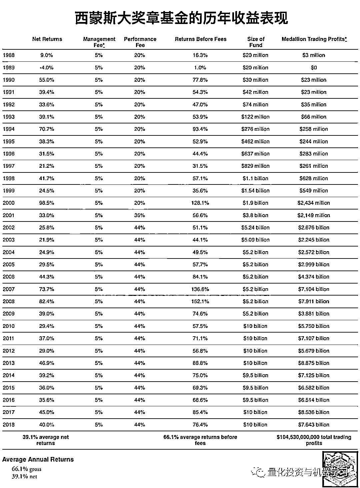

# 西蒙斯新书：『超级脱水』读书笔记！

> 原文：[`mp.weixin.qq.com/s?__biz=MzAxNTc0Mjg0Mg==&mid=2653295295&idx=1&sn=a85a396e206d94def8940c08e5097f0b&chksm=802dd0aab75a59bc035e0d16b5821842845cf31344a9063b98e46ff31045943d06134a4810e1&scene=27#wechat_redirect`](http://mp.weixin.qq.com/s?__biz=MzAxNTc0Mjg0Mg==&mid=2653295295&idx=1&sn=a85a396e206d94def8940c08e5097f0b&chksm=802dd0aab75a59bc035e0d16b5821842845cf31344a9063b98e46ff31045943d06134a4810e1&scene=27#wechat_redirect)

**标星★公众号     **爱你们♥   

来自：FICC 与资产配置 

**近期原创文章：**

## ♥ [5 种机器学习算法在预测股价的应用（代码+数据）](https://mp.weixin.qq.com/s?__biz=MzAxNTc0Mjg0Mg==&mid=2653290588&idx=1&sn=1d0409ad212ea8627e5d5cedf61953ac&chksm=802dc249b75a4b5fa245433320a4cc9da1a2cceb22df6fb1a28e5b94ff038319ae4e7ec6941f&token=1298662931&lang=zh_CN&scene=21#wechat_redirect)

## ♥ [Two Sigma 用新闻来预测股价走势，带你吊打 Kaggle](https://mp.weixin.qq.com/s?__biz=MzAxNTc0Mjg0Mg==&mid=2653290456&idx=1&sn=b8d2d8febc599742e43ea48e3c249323&chksm=802e3dcdb759b4db9279c689202101b6b154fb118a1c1be12b52e522e1a1d7944858dbd6637e&token=1330520237&lang=zh_CN&scene=21#wechat_redirect)

## ♥ 2 万字干货：[利用深度学习最新前沿预测股价走势](https://mp.weixin.qq.com/s?__biz=MzAxNTc0Mjg0Mg==&mid=2653290080&idx=1&sn=06c50cefe78a7b24c64c4fdb9739c7f3&chksm=802e3c75b759b563c01495d16a638a56ac7305fc324ee4917fd76c648f670b7f7276826bdaa8&token=770078636&lang=zh_CN&scene=21#wechat_redirect)

## ♥ [机器学习在量化金融领域的误用！](http://mp.weixin.qq.com/s?__biz=MzAxNTc0Mjg0Mg==&mid=2653292984&idx=1&sn=3e7efe9fe9452c4a5492d2175b4159ef&chksm=802dcbadb75a42bbdce895c49070c3f552dc8c983afce5eeac5d7c25974b7753e670a0162c89&scene=21#wechat_redirect)

## ♥ [基于 RNN 和 LSTM 的股市预测方法](https://mp.weixin.qq.com/s?__biz=MzAxNTc0Mjg0Mg==&mid=2653290481&idx=1&sn=f7360ea8554cc4f86fcc71315176b093&chksm=802e3de4b759b4f2235a0aeabb6e76b3e101ff09b9a2aa6fa67e6e824fc4274f68f4ae51af95&token=1865137106&lang=zh_CN&scene=21#wechat_redirect)

## ♥ [如何鉴别那些用深度学习预测股价的花哨模型？](https://mp.weixin.qq.com/s?__biz=MzAxNTc0Mjg0Mg==&mid=2653290132&idx=1&sn=cbf1e2a4526e6e9305a6110c17063f46&chksm=802e3c81b759b597d3dd94b8008e150c90087567904a29c0c4b58d7be220a9ece2008956d5db&token=1266110554&lang=zh_CN&scene=21#wechat_redirect)

## ♥ [优化强化学习 Q-learning 算法进行股市](https://mp.weixin.qq.com/s?__biz=MzAxNTc0Mjg0Mg==&mid=2653290286&idx=1&sn=882d39a18018733b93c8c8eac385b515&chksm=802e3d3bb759b42d1fc849f96bf02ae87edf2eab01b0beecd9340112c7fb06b95cb2246d2429&token=1330520237&lang=zh_CN&scene=21#wechat_redirect)

## ♥ [WorldQuant 101 Alpha、国泰君安 191 Alpha](https://mp.weixin.qq.com/s?__biz=MzAxNTc0Mjg0Mg==&mid=2653290927&idx=1&sn=ecca60811da74967f33a00329a1fe66a&chksm=802dc3bab75a4aac2bb4ccff7010063cc08ef51d0bf3d2f71621cdd6adece11f28133a242a15&token=48775331&lang=zh_CN&scene=21#wechat_redirect)

## ♥ [基于回声状态网络预测股票价格（附代码）](https://mp.weixin.qq.com/s?__biz=MzAxNTc0Mjg0Mg==&mid=2653291171&idx=1&sn=485a35e564b45046ff5a07c42bba1743&chksm=802dc0b6b75a49a07e5b91c512c8575104f777b39d0e1d71cf11881502209dc399fd6f641fb1&token=48775331&lang=zh_CN&scene=21#wechat_redirect)

## ♥ [计量经济学应用投资失败的 7 个原因](https://mp.weixin.qq.com/s?__biz=MzAxNTc0Mjg0Mg==&mid=2653292186&idx=1&sn=87501434ae16f29afffec19a6884ee8d&chksm=802dc48fb75a4d99e0172bf484cdbf6aee86e36a95037847fd9f070cbe7144b4617c2d1b0644&token=48775331&lang=zh_CN&scene=21#wechat_redirect)

## ♥ [配对交易千千万，强化学习最 NB！（文档+代码）](http://mp.weixin.qq.com/s?__biz=MzAxNTc0Mjg0Mg==&mid=2653292915&idx=1&sn=13f4ddebcd209b082697a75544852608&chksm=802dcb66b75a4270ceb19fac90eb2a70dc05f5b6daa295a7d31401aaa8697bbb53f5ff7c05af&scene=21#wechat_redirect)

## ♥ [关于高盛在 Github 开源背后的真相！](https://mp.weixin.qq.com/s?__biz=MzAxNTc0Mjg0Mg==&mid=2653291594&idx=1&sn=7703403c5c537061994396e7e49e7ce5&chksm=802dc65fb75a4f49019cec951ac25d30ec7783738e9640ec108be95335597361c427258f5d5f&token=48775331&lang=zh_CN&scene=21#wechat_redirect)

## ♥ [新一代量化带货王诞生！Oh My God！](https://mp.weixin.qq.com/s?__biz=MzAxNTc0Mjg0Mg==&mid=2653291789&idx=1&sn=e31778d1b9372bc7aa6e57b82a69ec6e&chksm=802dc718b75a4e0ea4c022e70ea53f51c48d102ebf7e54993261619c36f24f3f9a5b63437e9e&token=48775331&lang=zh_CN&scene=21#wechat_redirect)

## ♥ [独家！关于定量/交易求职分享（附真实试题）](https://mp.weixin.qq.com/s?__biz=MzAxNTc0Mjg0Mg==&mid=2653291844&idx=1&sn=3fd8b57d32a0ebd43b17fa68ae954471&chksm=802dc751b75a4e4755fcbb0aa228355cebbbb6d34b292aa25b4f3fbd51013fcf7b17b91ddb71&token=48775331&lang=zh_CN&scene=21#wechat_redirect)

## ♥ [Quant 们的身份危机！](https://mp.weixin.qq.com/s?__biz=MzAxNTc0Mjg0Mg==&mid=2653291856&idx=1&sn=729b657ede2cb50c96e92193ab16102d&chksm=802dc745b75a4e53c5018cc1385214233ec4657a3479cd7193c95aaf65642f5f45fa0e465694&token=48775331&lang=zh_CN&scene=21#wechat_redirect)

## ♥ [AQR 最新研究 | 机器能“学习”金融吗](http://mp.weixin.qq.com/s?__biz=MzAxNTc0Mjg0Mg==&mid=2653292710&idx=1&sn=e5e852de00159a96d5dcc92f349f5b58&chksm=802dcab3b75a43a5492bc98874684081eb5c5666aff32a36a0cdc144d74de0200cc0d997894f&scene=21#wechat_redirect)

上周二，公众号力推了下面这本书，引起了圈内不小的反响：

**点击上方图片免费下载此书**

一位博主写了篇脱水读书笔记，供大家分享。

**正文**

最近这本书实在太火，周末抽空读了一下，还是比较有意思。当然为了好卖这本书很多部分透露出浓浓的地摊文学风。不过关于投资交易的部分，其实还是比较有见地。至少通过这本书，做 FOF 的可以知道正经的量化策略长什么样子，什么是正道，减少被忽悠的概率。考虑到很多朋友懒得看英文，我就把一些干货总结一下。

**第一章～第二章**

主要讲了西蒙斯（Simons）个人经历。从小他就爱思考，并且在数学上展现了不俗的天赋。但是与普通数学家不同，他也很爱钱，不是他奢侈，而是喜欢金钱带给他的力量（他第一任老婆说：“Jim understood at an early age that money is power. He didn’t want people to have power over him.”）。拿到 PhD 后他先去哈佛教书，后来生活所迫并且觉得无聊就跑去 IDA 工作，专门破解苏联密文。这段经历对他影响很大：

1\. 这是段很纯粹的经历，每天就是想点子破解密文；

2\. 从加密过的信息还原信息自己与从股市中找信号有点类似；

3\. IDA 虽然对外隔绝，但内部环境开放，鼓励相互交流，促使他未来管理公司采取鼓励交流的态度；

4\. 认识了数学家 Baum 等好友，日后跟他合作很深；

5\. Simons 展现了极好的与人合作的能力，比如喜社交，爱聆听；

6\. 工作内容不饱和，自己搞研究搞出了大成果，同时做了个股票模型，通过市场行为把市场分成 8 个状态（虽然没啥实际用处），为日后的投资打下基础。

Simons 的方法在当时很有先驱性，当然还有 Thorp 比他更早（Thorp 是首先关注到 21 点里的条件概率并以此在概率上打败了赌场）。在当时主流炒股模式是基本面分析或技术分析（注意这是 60 年代），而 Simons 的方法和打牌类似：你只需要知道对手现在处于什么情绪并采取对应的策略，至于对手为什么现在高兴还是沮丧，这个不是最主要的。你关注的重点是通过对手的举动更准确地猜出他的状态（隐式马尔可夫过程）。由于假设过于理想化，结果太过于初级，没啥实用价值。

由于越战爆发和 ZZ 观点不同的原因，Simons 被 IDA 开除，然后跑去长岛的纽约大学石溪分校管数学系，这时是 1968 年 Simons 三十岁。Simons 广招英才，包括康奈尔的科学家 Ax（后来的合作伙伴）。同时能人善用，让底下的数学家做自己喜欢的事。他还是个好伯乐，具有慧眼识英才的能力。同事称赞他他作为数学家同时又非常会做人。

这段时间 Simons 离婚再娶略去不讲，他同时取得了学术上的突破，37 岁获得了几何学上的权威奖项（Oswald Veblen Prize）。1977 年 Simons 认为汇率自由浮动会带来巨大投资机会，于是 1978 开公司炒外汇。

此时 1978 年 Simons 四十岁，他此时的成就包括：明星解码员、有成就的数学家、打造了一流数学系。他想要新的挑战了。

**第三章**

## Simons 认为市场应该有些被噪音隐藏的内在规律并且可以被建模：

## ▍*“It looks like there's some structure here. There must be some way to model this”*

于是 Simons 搞了个名叫 Monemetrics 的公司，公司名字也很搞笑，是 Money+Econometrics。Simons 找来了 IDA 共事的 Baum。Baum 擅长分析混沌系统和做短期预测。Baum 很快做出了一个基于趋势线的算法（低于趋势线过多时买入，高于趋势线过多卖出）。Simons 拿着这个算法跑到朋友那里忽悠了差不多 4million。同时 Simons 还叫来了 Ax（他在石溪时从康奈尔忽悠来的那个），还招来了一个年轻程序员 Hullender。Simons 想建一个尽量自动化的交易系统，但当时的科技水平没达到这个水平。Simons 从包括世界银行的各个地方找历史交易记录，当时还记录在磁带上，让 Hullender 弄成数据库保存。在这些数据上 Simons 他们尝试的主要是各种趋势策略，但也关注商品之间的相关度。最终他们做出了一个可以交易商品、债券和外汇的系统（Piggy Basket 系统）。这套系统持仓差不多一天然后卖掉，Simons 往里放了几个 million。但他们很快失去了信心因为不知道这套系统为什么发出这些投资信号：

## ▍*“……but Simons and Baum weren't sure why the model was making its trading decisions”*

随着 Hullender 离职和交易系统出故障，Simons 和 Baum 回到传统的交易方式，也就是看估值和消息，此时他们管着 30million。为了更快速的获得消息，他们采取过各种夸张的手段。他们盈利不错，拓宽了办公室招了新人，此时 Simons 开始做一级，投资有前途的科技企业，1982 年他把公司名字改成了文艺复兴（Renaissance）。

靠着快速分析消息，Baum 在 1979-1982 盈利 43million，但这个过程中也暴露出一些问题，就是 Baum 亏损加仓不爱止损。最终 Baum 因为加杠杆买国债期货亏损超过 40%触发 Baum 与 Simons 的协议导致 Baum 从公司出局，虽然最终国债期货涨回来了。

本次 Baum 的亏损导致 Simons 的朋友们——也就是投资者天天打电话问情况咋样。看到自己的基金每天亏损几个 million，Simons 把净值披露频率改成了一个月一次。可见大佬也是很没节操的。同时这次亏损把 Simons 吓坏了，他开始一心一意做科技公司的一级市场投资。

**第四章**

## 本章最开始的引语非常赞：

## ▍*“Truth . . . is much too complicated to allow for anything but approximations.” By John von Neumann*

随着主观交易失败，Simons 回到了想用数学模型投资的老路上。Ax 想做一套趋势策略系统，但是他们的数据太烂，有各种缺失值和错误。这时 Straus 加入，他对收集数据很有天赋和兴趣，修补和填充了大量数据，甚至搞到了逐笔数据(tick data)，并在苹果 2 型电脑上写了个程序收集和储存更多的数据，虽然此时 Simons 和 Ax 的趋势模型只用到 OHLC。Straus 还招了个实习生去检测可能的数据缺失和错误。这些数据日后发挥了很大的作用，虽然当时算力还用不上这么多数据。

这时 Simons 还招来了另一个数学家 Laufer，Laufer 可以写程序测试一些策略是否应该被加入模型。这些策略通常是反转策略，比如买入低开的合约并在高点卖掉。

1985 年 Ax 和 Straus 想搬去加州（此时他们在纽约），他们搞了个 Axcom 公司，Simons 参股 25%并留在纽约，每年飞加州几次+远程交流。Laufer 回石溪教书。1986 年 Axcom 交易 21 种期货合约，包括外汇和商品。交易大部分依靠 Ax 和 Straus 的模型，也有一部分 Ax 拍脑袋的决策。随着时间推移，计算机算力增加，Ax 尝试用马尔可夫过程建模。他们找来了另一个擅长随机过程的数学家 Carmona，目的是更好地建模和预测：

## ▍*“The name of the game is not to always be right, but to be right often enough.”*

然而虽然基于随机过程的建模看上去更 fancy，预测结果却没有更好。（后来文艺复兴确实用了随机微分方程 SDE，但主要是风控和期权定价）。

这时 Carmona 注意到 Axcom 除了有些突破信号以外，也用到了线性回归。Carmona 觉得合约 A 和 B 之间可能可以做非线性回归，于是他采用了机器学习中的核方法(kernel methods)来分析。随着 Axcom 采用高维核回归来做趋势交易，结果改进了很多。Simons 不喜欢黑箱，他喜欢能有解释性的模型，但看到结果也不说啥了。这时 Simons 主要负责拉钱和管理他的一级生意。这时他们的总规模到了 100m 美金。

**第五章**

## 1988 年，Axcom 的策略主要是趋势和反转。靠着 Straus 的数据和 Carmona 的和方法，以及不断增加的算力，Axcom 能更好地在趋势和反转之间切换，年化收益 20%。但 Simons 不满因为他们的竞争者收益更好，而且这一时期出现了其他使用趋势系统的竞争者。Simmons 招来了数学家 Berlekamp，Berlekamp 告诉 Ax 他们有几个问题：

1\. 交易合约数量有问题：模型信号越强、合约手数应该越多，而不是每次都一样。这有点像 Kelly 公式；

2\. Axcom 交易频率太慢，合约通常持有一周或者更长时间。因为市场有波动，不频繁的交易会丧失更好的波段机会并在下跌中损失很多。Berlekamp 要求 Ax 做更小、更短期的交易。Ax 反驳说频繁交易的成本会爆炸，同时他们的日内数据有错误，难以建模。

Ax 没理他。此时 Axcom 是建模+主观的交易模式，Ax 甚至更沉迷于主观交易，喜欢购买各种高科技产品更快地获取信息。在 1987 年的股灾中，Ax 预见性地买了欧洲美元期货，让 Axcom 当年有 10+%的收益率。1988 年 Simons 把基金命名为大奖章（Medallion），纪念他们自己的数学成就。然而仅仅过了 6 个月基金就开始亏钱，随着基金亏损接近 30%，Simons 和 Ax 之间的矛盾爆发。因为不断有投资者投诉，Simons 想停掉长线策略，而 Ax 坚信长线策略会重新盈利。两人开始打官司，最终 Berlekamp 买下的 Ax 的股份，公司朝着 Berlekamp 设想的方向发展：更短期、更细致的交易模式。

**第六章**

## 随着 Berlekamp 买下 Ax 的股份，他成了 Axcom 的第一大股东。Berlekamp 坚定地向短期方向发展，挑战不能过度交易的经验法则。事实上，他们发现公司的长期交易基本都亏钱，而短期交易基本都赚钱。并且此时 Straus 也把日内数据清洗整理好了。他们假设投资者未来的行为与过去相似，并以此开展预测。并且他们认为这个只能进行短期预测，用在长期趋势上就不行了。Berlekamp 不喜欢长期交易的原因还有：他们会放大每次决策的后果。如果不频繁地进行交易，可能几次就爆仓了；而频繁地交易可以让每次交易影响变小，减少整体风险。

Berlekamp 希望他们的大奖章像一个赌场：每次只赢一点点钱，但不断重复创造惊人收益。只需要一点点统计上的优势，大数定律就能保证盈利：

## ▍*“If you trade a lot, you only need to be right 51 percent of the time. We need a smaller edge on each trade.”*

随着不断挖掘数据，Berlekamp 发现了很多不断重复的规律。Simons 等并不测试自己的 idea，而是寻求数据中间的规律，并且不去寻找规律背后的意义，只要这种规律发生频率够多、并且不是过拟合出来的。他们发现了周末效应、24 小时效应、以及外汇中的强趋势效应，并且进行了一些并不是很严谨的解释。Straus 之前存的 tick data 帮了他们很大忙。在 1989 年，经过 6 个月的努力，Berlekamp 终于做出了一套可以交易商品、货币和债券的系统。他们抓住的异象（anomalies）和趋势都很短期，从分钟级别到日级别。但他们很难找到股票的趋势。

实际上他们找到的信号并不是特别复杂，但很多交易员忽略了这些信号，因为可能发生的概率只有 50%多一点点。他们立刻把这套系统用到了还在管的 27million 上，效果立竿见影。他们开始有了大量的交易，持仓时间从一周半降到了一天半，盈利颇丰。但他们发现了一个问题，就是在加拿大元上一直亏钱。经过调查发现原来是 broker 在捣鬼：通过 front-run 他们的 order 来抬价，然后高价卖给他们。就这么一点点 trick，使得原来盈利的策略变成了亏损。

这时发生了一个插曲，就是有传言说，大奖章的经纪商 Stotler 遭遇了问题。Berlekamp 不知道该怎么做，Simons 咆哮道：“When you smell smoke, you get the hell out!”Stotler 没过几个月就倒了，可见大师的风控意识是很强的。

整个 1990 年，大奖章的收益都很强劲，此时大部分交易的是短线，长线只占 10%。虽然自动化交易很成功，但 Simons 自己还是会主观判断，比如伊拉克入侵科威特，他强烈地想做多黄金。此时 Simons 越来越多地介入公司事务，而 Berlekamp 越来越想回学校教书，于是他把股份卖给 Simons，回 UC Berkley 教书去了。文艺复兴搬回了纽约。后来 Berlekamp 开了一个自己的基金 Berkeley Quantitative，最多时管了 200million，但收益一般，2012 年关闭。

**第七章**

## 这一章颇为精彩，把很多历史上著名的技术分析人物批判了一遍，并且写了量化交易的简史。

Simons 的方法是用电脑发现没人注意的 pattern，但历史上这样做的人不少。古人用占星一类的方法预测价格，18 世纪日本人发明了 K 线图，19 世纪道琼斯的华尔街日报带来了现代的技术分析。至于其他传奇人物：

*   William D. Gann（江恩）信徒很多，他的信徒号称他从大萧条到珍珠港事件都能预测到。他号称万物都遵循波动法则（Law of Vibration）。能但实际上他是开券商公司的（brokerage firm，赚佣金），他对道琼斯指数的预言也不准确。Andrew Lo（公式化技术分析指标的大神）说他是金融占星家（显然是在讽刺）；

*   Gerald Tsai，1960 年在 Fidelity Investments 名声大噪，甚至有个备战室观测各种指标，但在 1969-70 年的大熊市中遭遇重创。但好在他的公司那时候已经卖掉了；

作者对技术分析采取了很嘲讽的态度，认为大众对技术分析的推崇基本来自于懒惰和迷信巫术。虽然荒谬，依然有大量的人不断地画图来寻找头肩形态。Andrew Lo 认为技术分析是量化分析的先驱，但技术分析的法则基本来源于人们对生活的认知和概括，从来都经受不住独立性和彻底的检验：

*However, their methods were never subjected to independent and thorough testing, and most of their rules arose from a mysterious combination of human pattern recognition and reasonable- sounding rules of thumb, raising questions about their efficacy.*

Simons 与他们最大的不同是通过数据本身和严格的统计检验来预测趋势和形态，并且只做短期。但他没意识到随着算力的爆发，很多竞争者已经出现：

芝加哥的 Richard Dennis 通过编写简单的、预设的方法来做不受情绪干扰的投资，且在 1980 年代就名声大噪。人们更熟悉的是他的“海龟交易法则”。他招来一堆新人，教他们自己的方法，这些人称为“海龟”。Dennis 自己 1986 年赚了 80m, 但 1987 年的股灾中遭受重创。后来转行了。

1980 年代华尔街招了大量的 Quant，主要是做定价、风控，但 1987 年的股灾让他们名声变得很臭。这时候还有个叫 Benoit Mandelbrot 的教授号称金融市场遵循分形（fractal patterns）。这意味着市场有更多未知的风险，与 Nassim Nicholas Taleb 这种从交易员变成的畅销书作者观点一致（trader-turned-author 这个词有点嘲讽）。Taleb 认为未来的风险比大部分模型捕捉到的要多。因为这些原因，大众对自动化交易有着负面态度。

这里详细介绍了 Edward Thorp。他是使用现代数学方法开展量化交易的第一人。Thorp 使用了香农的信息论和凯利公式，真正战胜了赌场，并且在 1964 年转战华尔街，依靠捕捉衍生品的错误定价（主要是 warrant 权证）盈利。1970 年 Thorp 建立了对冲基金 Princeton/Newport Partners，依靠市场价格的布朗运动挣错误定价的衍生品的钱。1980 年代 Thorp 的基金管理规模达到了 300million。但因为卷入 Milken 的丑闻，Thorp 于 1988 年关掉了公司。

摩根斯丹利的 Gerry Bamberger 发明了的 pair trading 来捕捉短期的价格背离，1985 年他的策略可以交易 6-7 个股票，并管理 30million 资金。后来因为 MS 管理层变动，离职加入了 Thorp 的公司。

MS 的 Tartaglia 组成了 APT 小组做自动化交易，1987 年赚了 50million。他招入了 David Shaw 和 Robert Frey。这个小组实际上成了第一批做统计套利的人。策略类似于把过去几周的收益率排序，买过去一段时间跌得最多的，卖出涨得最多的，去赌反转。APT 一年赚 20%。到了 1988 年 APT 每天交易 9 亿元的股票，但亏损惨重，MS 把 book 缩了 2/3。Frey 在这期间离职，Simons 帮他成立了自己的公司，希望在股票策略上有突破；Shaw 则依靠 Sussman 提供的 28million 成立了 D.E. Shaw，成了 Simons 的对手。Shaw 的公司很快管理上百 million 的资金，交易各种股票相关的资产，并且招了超过一百名员工。

**第八章**

## Laufer 重新加入 Simons 并且做了个重要决定：大奖章使用一个模型来进行交易，而不是在不同的市场情况下用很多不同的模型。原文写得非常有意思，不大好翻译，这里引用一下：

## *Medallion would employ a single trading model rather than maintain various models for different investments and market conditions, a style most quantitative firms would embrace. A collection of trading models was simpler and easier to pull off, Laufer acknowledged. But, he argued, a single model could draw on Straus’s vast trove of pricing ata, detecting correlations, opportunities, and other signals across various asset classes. Narrow, individual models, by contrast, can suffer from too little data.*

## *Just as important, Laufer understood that a single, stable model based on some core assumptions about how prices and markets behave would make it easier to add new investments later on. They could even toss investments with relatively little trading data into the mix if they were deemed similar to other investments Medallion traded with lots of data.*

他们先是把一周切成 10 份，按交易时段和过夜时段，再是切得更细，最终决定用 5 分钟线的数据开始找 pattern。通过在更短的区间仔细搜索，他们确实在噪音中找到了规律。Laufer 又写了算法自适应地根据对市场的未来预期动态优化下单方式，类似机器学习的方式。Laufer 在 Straus 的数据的基础上写了程序来跟踪滑点，并且开发下单算法减少划点。现在大奖章交易得更频繁，从每天发单 5 次到了每天发单 16 次。盈利也很好，但他们没怎么想过为何盈利。实质上，因为大奖章是对人建模，而人的反应是容易预测的，所以这种规律具有一定的持续性。

**第九章～第十章**

## 1995 年，文艺复兴在股票策略上还没有突破，导致管理规模一直上不去。Frey 的方法就是因子投资，多一篮子空一篮子，因为决定一个股票价格走势的因素太多了，所以进行多空可以把难以预测的部分对冲掉，留下简单、可预测的部分。但是这个模型只是在回测中有效，在实盘里只有在资金量很小的时候有效，资金量一大就亏很多钱。这时三个编程专家 Brown、Mercer 和 Magerman 加入了公司，他们检查代码发现因为 Frey 编程很烂，很多限制(例如某个股票不能卖空，或杠杆超限)不是通过模型做出来的，而是人工处理。这在期货这种单品种策略上不是问题，但是对于股票，因为要相互对冲，有点像牵一发而动全身，因子暴露全乱了。

于是他们重写了 Frey 的代码，把交易成本、杠杆、风险指标等所有限制都放到程序里，这个程序一小时几次地不断求解最优组合做出最佳决策，直接输出结果。这样不仅方便文艺复兴测试新信号，也可以把整个系统做成自适应的，像期货那边的程序一样给力。例如如果一个交易没有执行，他会立刻重新计算均衡组合，调整持仓。最终他们使用 50 万行的程序替代了 Frey 几万行的程序。这个程序很成功，在长达十年的时间里，文艺复兴都是使用这个基于因子的均值回归模型。他们的秘诀是打败人类的不理性（“We make money from the reactions people have to price moves.”）。

在这个程序刚写出来的时候有 Bug，发生了跟 Frey 的代码一样的问题：一旦资金加上去就会亏钱。后来他们发现是 SP500 的数据搞错了，直接设置成了一个常量，用的是 1991 年的价格：

*This test code appeared to use a figure from back in 1991 that was roughly half the current number. Mercer had written it as a static figure, rather than as a variable that updated with each move in the market.*

修复了这个错误以及另一处的一个代数错误后，程序开始完美运行了。而 Laufer 这边的期货策略——在最合适的时点买卖（择时）策略运行依然完美。

**第十一章**

## Simons 开始尝试新的方式盈利。他先是尝试从文献里找 idea，搞了个读书会，每周他自己和各个高管每人读三篇文献并且消化，试图找到新的赢利点。在读了几百篇文献后他们放弃了，论文里各种好点子写成代码实盘一测发现在实际中没有任何用处。

在 1997 年前，大部分的信号大家还能解释，例如超跌/超涨反弹，有 60%的概率会反弹。但 1997 年以后大部分信号大家都不能理解了。与别家不同的是，文艺复兴不会去找背后的原因，也不会把信号丢掉，除非信号本身太扯：

*“Volume divided by price change three days earlier, yes, we'd include that. But not something nonsensical, like the outperformance of stock tickers starting with the letter A.”*

这种不能解释的信号有额外的超额：因为他们的竞争对手更可能把这类信号丢掉。为了防止过拟合，文艺复兴的员工先把这种信号丢到实盘里用点小钱跑并观察，看一下这种异象能不能理解，大部分时候都能理解了。当然也有小部分完全不能理解但确实很强的信号。通过这种方式，文艺复兴的策略基本就是机器学习这套了，自己在跑人工干预很少。

1998 年的时候文艺复兴名气还小，这时候最红的是长期资本 LTCM 和 DE Shaw。LTCM 的故事烂大街了略去不讲，DE Shaw 这时候已经有 600 多号员工，有些时候占 NYSE 交易量的 5%。但在 1998 年的风暴中 DE Shaw 亏了 200m，裁掉了 25%的员工并缩减开支。而大奖章当年赚了 42%。

2000 年股灾，大奖章在 3 月中连续三天亏损，总额接近 300m，而此前大奖章单日最大亏损仅为 5m。排查非常困难，因为很多信号在一起跑。经过几天的分析，研究员认为是一个趋势追踪类的策略出了问题。因为前几年是牛市，这是个赚钱的策略。但现在变成了熊市，就开始血亏。他们把这个策略停掉以后终于开始重新盈利了。这体现了 Simons 的一些特征，他一定程度上信任模型，但在内心深处他没有完全信任模型。毕竟模型只是对现实的近似。

**第十二章**

## 2001 年随着公司盈利实力大增，文艺复兴开始收集和处理各种数据，包括：

1\. 每个交易指令（即使是没完成的）

2\. 季报年报数据

3\. 上市公司高管（买卖本公司股票）的交易数据

4\. government 报告

5\. 经济预测

6\. 新闻、网络帖子、离岸保险索赔数据等另类数据。

文艺复兴收集的数据越来越多，已经是以 TB 记。而策略目标已经是预测票在未来各个时间点的价格（“at every point in the future”）：

*“We want to know in three seconds, three days, three weeks, and three months.”*

文中举了个例子：假如一个报纸报道塞尔维亚发生了粮食短缺，文艺复兴会找历史上所有发生过的类似情况并查看这个怎么影响小麦价格，并更好地开展预测。这个做法其实跟 IBM 开发语音识别算法有点像（条件概率），文艺复兴现在彻底采用了数据驱动的方法开展投资交易。

这时候电子交易已经开始变得主流了，而文艺复兴已经很接近全自动交易系统。员工开始开发非常短的信号（几秒甚至更短），但他们的做法还算不上纯高频交易：虽然大奖章每天做 15-30 万笔交易，但大部分是为了拆单减少市场冲击。他们的电脑也相对比较慢。公司开始交易各个国家的市场，并且加入这些信号后大奖章的收益率跟市场的相关度更小了，夏普率也变得更高，2003 年达到 6——这说明大奖章几乎完全不可能发生年度亏损。而更牛逼的是公司现在管着 5billion 而不是一个小账户。

这时候随着全球降息，银行业开始面临利润更薄的困境，而这时候 Brown 决定扩张文艺复兴的股票策略。因为业绩极度稳健，很多银行抢着给大奖章放杠杆。通过细致地编程进行无缝对接，文艺复兴买了德意志银行和八颗雷的一年期篮子期权工具加杠杆。正常情况下杠杆高达 12.5 倍，而在某些特别好的市场机会中（比如 2002 年的市场下跌中）杠杆可以高达 20 倍。2002 年大奖章规模 5b，但是撬动了 60b 的仓位并且盈利 25.8%。

篮子期权成了文艺复兴的秘密武器，它还有几个其他的好处：

1\. 风险隔离：大奖章最多亏期权费，那个也就几亿；但银行可能损失几十亿；

2\. 避税：一年期期权把股票快速买卖变成了长期投资，可以避税。但这事 2014 年被 IRS 揪出来，官司现在还在打。

随着股票组大赚，他们和期货组之间开始有矛盾。期货组不需要那么好的程序也赚得很开心，生活状态很悠哉；而股票组氛围紧张，天天加班到半夜改代码，他们甚至重写了期货组的代码给期货组用。2003 年股票组已经比期货组收益金额多出来一倍了。

公司内部现在开始出现很多问题，包括股票和期货组之间、新老员工之间，甚至 Simons 和其他员工之间。Simons 还是招了一些传统交易员，但是 Magerman 等不是很理解。这是因为 Simons 内心并不是完全信任全自动交易：

*Simons believed in computer trading, but he didn't entirely trust an automated system in unstable markets, a stance Magerman couldn't understand.*

**第十三章**

## 2003 年 7 月，两个高级员工 Belopolsky 和 Volfbeyn 辞职加入了 Millennium，而且这时候文艺复兴的人力才发现他们没签禁止披露和竞业协议(non-disclosure 和 non-compete)。这俩人后来在 Millennium 盈利达到 100million 并成为了他家最成功的交易员之一，虽然很多证据表明他们用了大奖章的系统和策略（比如信号名字跟大奖章的都是一样的）但是 Simons 没有实锤，最终 Millennium 的老板 Englander 同意把这俩人开掉并陪给 Simons 20million。

由于大奖章容量有限（目前已踢出所有外部投资人并每年分红控制规模），Renaissance 从 2005 年开始设计了一个大容量的基金名叫 RIEF。这个基金持仓一个月以上，使用一些 R 家的成熟信号（比如相关性和 pattern），但更多使用基本面策略（比如看估值和报表数据等），回测显示每年能跑赢市场几个点但波动率显著低于市场，而容量高达 100billion。这时候 R 家已经名声在外，而且 RIEF 只收 1%+10%，比大奖章费率低太多了，投资者疯狂涌入。

RIEF 很快募集了 14B，到 2007 年规模到了 35B，成为最大的对冲基金之一。为了限制规模，R 家限制每个月只能进 2B。

到了 2007 年，不仅仅有了 R 家的成功，很多量化基金冒了出来，包括：

1\. Morgan Stanley 的 PDT 管了 6B；

2\. 格林威治的 AQR 管了 39B；

3\. 芝加哥的 Citadel 管了 13B。他们的老板 Ken Griffin 从 1980 年代在哈佛的时候就在宿舍顶棚装卫星接收器和利用高速计算机做统计套利了。

而到了 2008 年 8 月 6 日，这些量化基金突然开始狂亏（”the quant shake”）。这让很多人觉得奇怪因为各家号称自己的策略都很独特，跟别人没啥相关性。后来研究猜测是一两家量化机构出了问题开始 fire sale 叠加当时债务危机导致部分投资者赎回使得一些基金减仓。从周一开始，R 家也连续血亏，开始 Simons 还很轻松表示大亏以后往往立刻修复并且盈利更好，但随着周二周三越亏越多，大奖章开始担心自己的篮子期权要有 margin call。R 家内部开始分成两派激烈争论，最后 Simons 力排众议决定减仓，因为一旦爆仓会把八颗雷和德银拉下水，以后 R 家就没法在街上混了。这个决定在内部引发很大争议，但 Simons 认为既然发生了这种 20 个 sigma 的小概率事件，就说明市场可能发生了前所未有的情况，必须谨慎。

于是大奖章从周四开始减仓，这周大奖章亏了 1B 或 20%，RIEF 亏了 3B 或 10%。而竞争对手也不好过，PDT 两天亏了 600M。第二周市场终于企稳，Simons 也停止了减仓。很多员工抱怨 Simons 的减仓降低了收益，但 Simons 说再来一次他还会有相同的决定。

RIEF 在 2009 年碰到了问题，那一年 RIEF 亏了 6%，而 SP500 涨了 26.5%。投资者发现原来 RIEF 跟大奖章不是一个东西，于是拼命赎回，RIEF 规模将到了 5B。不过好在后来几年收益又起来了，R 家又发了 RIFF 等其他大容量策略的基金。

**第十四章**

## 到了 2010 年，大奖章同时持有高达几千个多空仓位，并且开始做高频交易，但目的是为了更好地执行。公司也越来越成熟，风控和运营也在改进。大奖章也交易商品、国债和外汇，依然是找趋势和反转等方面的重复的 pattern。Mercer 这时候又强调了一遍 R 家成功的关键：

## *Renaissance enjoyed a slight advantage in its collection of thousands of simultaneous trades, one that was large and consistent enough to make an enormous fortune.*

同时 R 家也观察数据背后的多维关系（multidimensional anomalies），比如两家公司可能有千丝万缕的联系。这种关系在长期很难保持稳定，也很难建模和精准预测，但 R 家通过交易大量有关系的标的可以从统计上捕捉这种关系。另外 R 家成功的关键还有交易执行上的优化，隐藏自己的行踪。

这一章后面乱入了很多床破相关的事情。感觉现在是本书都会往里面放这个情节……整个第十五章都在讲这事，就跳过了（注：这本书叫“the man who solved the market”，不是"the men"，不知道为啥讲那么多无关人士 Mercer 的 ZZ 倾向问题，而且跟 market 有啥关系？）。

**第十六章**

## 最后一章，基本总结了全书：

1、Simons 自己的钱交给了一家叫 Euclidean Capital 的机构打理，他自己经常看市场，在 2018 年 12 月的大跌中直接打电话给 trader 问要不要做空。说明 Simons 内心深处还是相信人的直觉的；

2、到了 2019 年，传统投资方式已经没什么优势了：

a) 被动投资（ETF）基本占了 50%，主动投资从十年前的 75%降到了 50%;

b) 曾经的明星 John Paulson，David Einhorn 等精准预言 2008 年金融危机的人亏很大；

c) 曾经的债券之王 Bill Gross 不怎么赚钱了，巴菲特近几年的业绩跟 SP500 也就差不多的水平；

3、作者认为这是因为市场参与者变了，处理信息的方式也变了。内幕交易管得更严了，而现在有无穷多的电脑监控各种数据，例如一个制药公司在发了一个招聘帖子以后立马涨了 25%，因为算法监控到了这个帖子并且通过解析认为可能新药研发马上有突破；

4、在 2009 年初，量化投资者已经占了市场交易量的 1/3，而量化交易公司赚疯了。R 家赚了 15 亿、2Sigma 赚了 7 亿、Millenium 赚了 5 亿。BTW 这里特地提到了桥水不是量化公司：

*Ray Dalio of Bridgewater Associates—which is a systematic, rules-based investment firm, but not quantitative—made $1 billion, as well.*

5、一个原因是因为数据量大爆炸。IBM 估计 90%的数据是过去两年生成的，大概是 40ZB（也就是 440 万亿 GB）。很多公司和交易员已经大面积使用卫星、网络另类数据作为信号；为了处理数据，对冲基金开始专门招数据猎手（data hunters）来深挖数据，为了更好地判断经济、公司；

6、还有一个原因就是算力大幅增加了，对冲基金可以更好更快地测试策略。并且更多地使用机器学习方法开发策略；

7、当然主观投资也有空间，比如很多问题债券的投资价值取决于法院的审判结果，这是很难数据化的；

8、很多人指出随着量化交易变成市场主流，会改变市场形态。因为以前市场的参与者主要是人，而人性是遵循一定的规律的。但算法可以变化很快，所以机器变多了以后，整体上会让市场变得更难以捉摸。作者认为不一定，因为量化公司的策略比较多样化和分散，而人性更单一；

9、到了 2019 年 6 月，R 家管理 65B，很多时候占市场交易量的 5%。作者认为他们的成功彰显了人性的可预测性。通过数据挖掘，R 家相当于用了一种超越人眼的工具在看市场，可以发掘更多的细节。但 R 家不去预测股价自己的涨跌（avoid predicting pure stock moves.），而是指去预测相对价值。

**一些感想**

## 1、开发策略的自己也不会知道自己的策略哪天失效，特别是长线策略。比如基于单标的预测一年的策略，连续 20 次撞大运也是可能的。现在很多过时的投资方法很多还没消失，很大程度上是因为长线投资运气成分太大、证伪很难，就看你怎么忽悠了；

2、基于期货的策略（标的少）要想与股票多空策略（标的多）做出相同的夏普率，频率就得提高，而频率高意味着容量小。大奖章也是股票策略做出来以后才规模上了一个量级。所以股票多空策略是容纳资金最大的池子，如果连整个 alpha 策略拥挤，那其他小策略基本可以不用看了；

3、大奖章虽好，但降频后的 RIEF 一年跑输过 SP500 百分之几十。夏普 2 和夏普 1 的 VaR 不是一个概念，虽然看上去夏普率只差了一倍。特别是降频后 Tail Risk 会显著变大。所以小容量策略做的牛逼的私募未必扩容后就牛逼，虽然 R 家的 RIEF 后来业绩也不错；

4、即使牛逼如 Simons、Ax 或者 Baum 这种一流数学家组团，也是持续多年做不出有效的策略，可见学霸天才组团搞量化只是成功的必要不充分条件。随着科技进步，运气比较好的一些人有了突破，你不能说 R 家的成功具有必然性。人还是时代的产物，要是没有技术突破估计他们几个也是拍脑袋+听消息做投资；

5、风控风控风控。Simons 毕竟几起几落知道稳健经营的重要性；姜还是老的辣，他知道尽信书不如无书，比那帮迷信机器和算法的小屁孩不知高到哪里去了。如果不想有职业风险就不要想着 double down 不止损。对于风控缺失的私募最好就不要碰了，因为上面的第 1 条：他们自己也不知道自己的策略啥时候失效。而就算爆仓也是把你亏光，管理人最多少赚一点管理费。至于 R 家后来做低频取得成功，也是靠高频策略打磨好了自己的算法和能力才降下来的；

6、当年 Trading Wizards 出来没多久海龟们就被埋了；成为巴菲特这个电影出来的时候老巴已经不咋能跑赢指数了。R 家之前低调的很，现在解密了这么多，可能量化交易真的竞争太激烈了吧。现在虽然市场机会仍在，但各家现在都面临着爆炸的数据成本，说不定哪天就入不敷出了。那会儿可能真的就只能买买 ETF 了；

7、交易成本从来都是很重要的。高频交易对低频策略的影响一定是很大的。滑点从来都不是无所谓的事情。说交易执行无所谓的私募只是没能力优化，但蚕食业绩是一定的；

8、超额机会是高度竞争的，一旦离场就很难再回到赛道上，不存在长期有效的策略；

9、相信科学。当然这几十年来科研环境发生了变化，很多研究结果背后都有相关利益。但至少靠谱的科学研究不会坑你。开发策略还是要从数据出发，搞清楚怎么做好统计测试，不要想当然。

**附录**

下图显示了文艺复兴以 H1B 签证向其 East Setauket New York 办事处聘用的量化分析师和工程师支付的薪资（单位为 K）。**文艺复兴以只雇佣少数精英研究人员而闻名**，但与以往的 H1B 薪酬数据一样，这只是一个小样本，它反映了仅向非美国研究人员支付的薪酬数额（在美国工作的公民）。

数据表明，文艺复兴是很多对冲基金中薪酬最高的机构之一。然而，值得注意的是，**工资并不是大多数人为西蒙斯工作的原因。****真正的吸引力是他们向 Medallion 基金投资的机会**，该基金只对员工开放，自 1988 年成立以来，**每年的回报率约为****40%****。**

*—End—*

量化投资与机器学习微信公众号，是业内垂直于**Quant**、**MFE**、**CST、AI**等专业的**主****流量化自媒体**。公众号拥有来自**公募、私募、券商、银行、海外**等众多圈内**18W+**关注者。每日发布行业前沿研究成果和最新量化资讯。你点的每个“在看”，都是对我们最大的鼓励