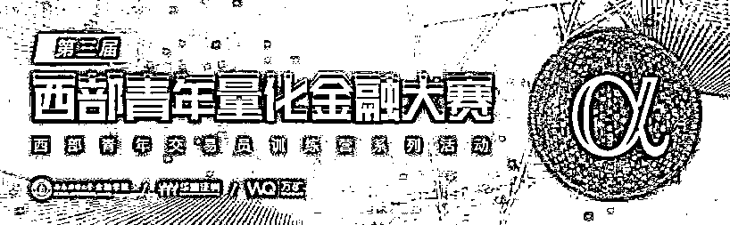
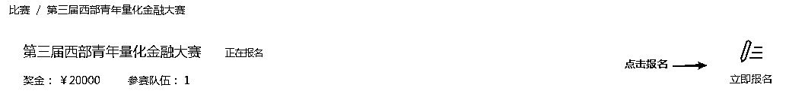
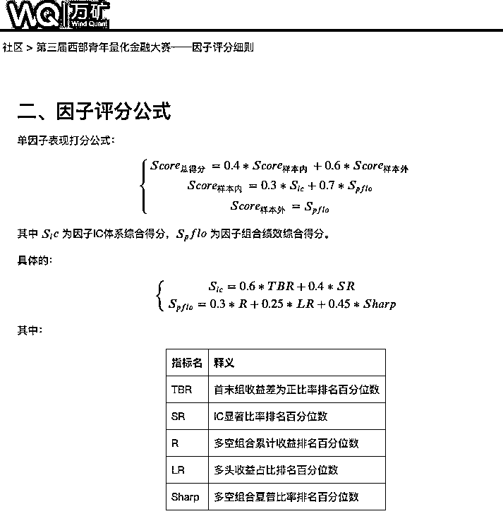
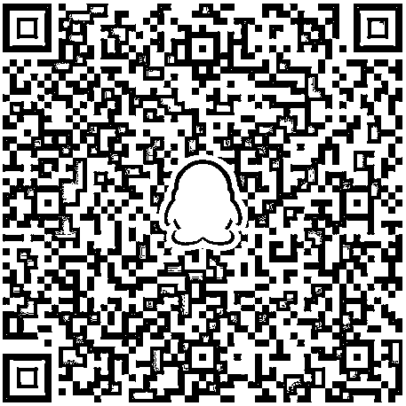

# 西部青年，你们准备好了吗？

> 原文：[`mp.weixin.qq.com/s?__biz=MzAxNTc0Mjg0Mg==&mid=2653295286&idx=1&sn=b23c01d911faacb19dcc29fde7135ea3&chksm=802dd0a3b75a59b529798255148211a975bf2e676f3945c7d05454a2957c92ce8b47724c0c34&scene=27#wechat_redirect`](http://mp.weixin.qq.com/s?__biz=MzAxNTc0Mjg0Mg==&mid=2653295286&idx=1&sn=b23c01d911faacb19dcc29fde7135ea3&chksm=802dd0a3b75a59b529798255148211a975bf2e676f3945c7d05454a2957c92ce8b47724c0c34&scene=27#wechat_redirect)

**标星★公众号     **爱你们♥

**近期原创文章：**

## ♥ [5 种机器学习算法在预测股价的应用（代码+数据）](https://mp.weixin.qq.com/s?__biz=MzAxNTc0Mjg0Mg==&mid=2653290588&idx=1&sn=1d0409ad212ea8627e5d5cedf61953ac&chksm=802dc249b75a4b5fa245433320a4cc9da1a2cceb22df6fb1a28e5b94ff038319ae4e7ec6941f&token=1298662931&lang=zh_CN&scene=21#wechat_redirect)

## ♥ [Two Sigma 用新闻来预测股价走势，带你吊打 Kaggle](https://mp.weixin.qq.com/s?__biz=MzAxNTc0Mjg0Mg==&mid=2653290456&idx=1&sn=b8d2d8febc599742e43ea48e3c249323&chksm=802e3dcdb759b4db9279c689202101b6b154fb118a1c1be12b52e522e1a1d7944858dbd6637e&token=1330520237&lang=zh_CN&scene=21#wechat_redirect)

## ♥ 2 万字干货：[利用深度学习最新前沿预测股价走势](https://mp.weixin.qq.com/s?__biz=MzAxNTc0Mjg0Mg==&mid=2653290080&idx=1&sn=06c50cefe78a7b24c64c4fdb9739c7f3&chksm=802e3c75b759b563c01495d16a638a56ac7305fc324ee4917fd76c648f670b7f7276826bdaa8&token=770078636&lang=zh_CN&scene=21#wechat_redirect)

## ♥ [机器学习在量化金融领域的误用！](http://mp.weixin.qq.com/s?__biz=MzAxNTc0Mjg0Mg==&mid=2653292984&idx=1&sn=3e7efe9fe9452c4a5492d2175b4159ef&chksm=802dcbadb75a42bbdce895c49070c3f552dc8c983afce5eeac5d7c25974b7753e670a0162c89&scene=21#wechat_redirect)

## ♥ [基于 RNN 和 LSTM 的股市预测方法](https://mp.weixin.qq.com/s?__biz=MzAxNTc0Mjg0Mg==&mid=2653290481&idx=1&sn=f7360ea8554cc4f86fcc71315176b093&chksm=802e3de4b759b4f2235a0aeabb6e76b3e101ff09b9a2aa6fa67e6e824fc4274f68f4ae51af95&token=1865137106&lang=zh_CN&scene=21#wechat_redirect)

## ♥ [如何鉴别那些用深度学习预测股价的花哨模型？](https://mp.weixin.qq.com/s?__biz=MzAxNTc0Mjg0Mg==&mid=2653290132&idx=1&sn=cbf1e2a4526e6e9305a6110c17063f46&chksm=802e3c81b759b597d3dd94b8008e150c90087567904a29c0c4b58d7be220a9ece2008956d5db&token=1266110554&lang=zh_CN&scene=21#wechat_redirect)

## ♥ [优化强化学习 Q-learning 算法进行股市](https://mp.weixin.qq.com/s?__biz=MzAxNTc0Mjg0Mg==&mid=2653290286&idx=1&sn=882d39a18018733b93c8c8eac385b515&chksm=802e3d3bb759b42d1fc849f96bf02ae87edf2eab01b0beecd9340112c7fb06b95cb2246d2429&token=1330520237&lang=zh_CN&scene=21#wechat_redirect)

## ♥ [WorldQuant 101 Alpha、国泰君安 191 Alpha](https://mp.weixin.qq.com/s?__biz=MzAxNTc0Mjg0Mg==&mid=2653290927&idx=1&sn=ecca60811da74967f33a00329a1fe66a&chksm=802dc3bab75a4aac2bb4ccff7010063cc08ef51d0bf3d2f71621cdd6adece11f28133a242a15&token=48775331&lang=zh_CN&scene=21#wechat_redirect)

## ♥ [基于回声状态网络预测股票价格（附代码）](https://mp.weixin.qq.com/s?__biz=MzAxNTc0Mjg0Mg==&mid=2653291171&idx=1&sn=485a35e564b45046ff5a07c42bba1743&chksm=802dc0b6b75a49a07e5b91c512c8575104f777b39d0e1d71cf11881502209dc399fd6f641fb1&token=48775331&lang=zh_CN&scene=21#wechat_redirect)

## ♥ [计量经济学应用投资失败的 7 个原因](https://mp.weixin.qq.com/s?__biz=MzAxNTc0Mjg0Mg==&mid=2653292186&idx=1&sn=87501434ae16f29afffec19a6884ee8d&chksm=802dc48fb75a4d99e0172bf484cdbf6aee86e36a95037847fd9f070cbe7144b4617c2d1b0644&token=48775331&lang=zh_CN&scene=21#wechat_redirect)

## ♥ [配对交易千千万，强化学习最 NB！（文档+代码）](http://mp.weixin.qq.com/s?__biz=MzAxNTc0Mjg0Mg==&mid=2653292915&idx=1&sn=13f4ddebcd209b082697a75544852608&chksm=802dcb66b75a4270ceb19fac90eb2a70dc05f5b6daa295a7d31401aaa8697bbb53f5ff7c05af&scene=21#wechat_redirect)

## ♥ [关于高盛在 Github 开源背后的真相！](https://mp.weixin.qq.com/s?__biz=MzAxNTc0Mjg0Mg==&mid=2653291594&idx=1&sn=7703403c5c537061994396e7e49e7ce5&chksm=802dc65fb75a4f49019cec951ac25d30ec7783738e9640ec108be95335597361c427258f5d5f&token=48775331&lang=zh_CN&scene=21#wechat_redirect)

## ♥ [新一代量化带货王诞生！Oh My God！](https://mp.weixin.qq.com/s?__biz=MzAxNTc0Mjg0Mg==&mid=2653291789&idx=1&sn=e31778d1b9372bc7aa6e57b82a69ec6e&chksm=802dc718b75a4e0ea4c022e70ea53f51c48d102ebf7e54993261619c36f24f3f9a5b63437e9e&token=48775331&lang=zh_CN&scene=21#wechat_redirect)

## ♥ [独家！关于定量/交易求职分享（附真实试题）](https://mp.weixin.qq.com/s?__biz=MzAxNTc0Mjg0Mg==&mid=2653291844&idx=1&sn=3fd8b57d32a0ebd43b17fa68ae954471&chksm=802dc751b75a4e4755fcbb0aa228355cebbbb6d34b292aa25b4f3fbd51013fcf7b17b91ddb71&token=48775331&lang=zh_CN&scene=21#wechat_redirect)

## ♥ [Quant 们的身份危机！](https://mp.weixin.qq.com/s?__biz=MzAxNTc0Mjg0Mg==&mid=2653291856&idx=1&sn=729b657ede2cb50c96e92193ab16102d&chksm=802dc745b75a4e53c5018cc1385214233ec4657a3479cd7193c95aaf65642f5f45fa0e465694&token=48775331&lang=zh_CN&scene=21#wechat_redirect)

## ♥ [AQR 最新研究 | 机器能“学习”金融吗？](http://mp.weixin.qq.com/s?__biz=MzAxNTc0Mjg0Mg==&mid=2653292710&idx=1&sn=e5e852de00159a96d5dcc92f349f5b58&chksm=802dcab3b75a43a5492bc98874684081eb5c5666aff32a36a0cdc144d74de0200cc0d997894f&scene=21#wechat_redirect)

在量化因子中挖掘商机在海量数据内洞观全局青春须早为，岂能长少年不若同三两好友共赴一场量化盛宴**奖金 X 优秀实习 X 量化交易训练营**丰厚奖励已备，只差一个你

近年来**因子投资**备受市场关注。本次大赛围绕量化**因子挖掘**为主题展开，与 Wind 旗下 WindQuant 万矿量化平台相结合，挖掘有志于量化投资的人才，培养具有因子挖掘能力的研究员。整合高校教育与金融两大创新资源，推动西部地区的量化教育事业。

**赛程安排**

本届大赛分为报名与策略提交、初赛、复赛、评选与颁奖四个阶段。

**1、报名、提交策略：2019.11.01 — 2019.12.31**
参赛团队通过万矿官网（***www.windquant.com***）进行报名。同时，在此期间内，参赛团队须在线提交阐述因子逻辑的说明文档及源代码。

**2、初赛阶段：2020.1.1 — 2020.4.30 **
在此期间，进行因子样本外测试。

**3、复赛阶段：2020 年 5-7 月（训练营集训阶段）**
复赛分为交易策略打磨与金融机构联合集训培养。通过初赛甄选出进入复赛的前 30 个队伍，参与训练营集训阶段。复赛队伍最后进行现场讲解、答辩。每个团队演讲 15 分钟，答辩 10 分钟，由专家组成员根据现场表现打分。在此阶段，我们会为入选队伍进行形式多样的集训。届时会有各大量化机构（私募、券商、期货等公司）与各位选手进行对接，进行专项指导。

**4、评选与颁奖阶段：2020 年 8 月**

参赛团队的最终成绩由初赛、复赛的成绩加权，主办方将于 2020 年 8 月底前进行评审及结果公示。最终根据综合成绩进行颁奖（时间待定）。

**赛事规则**

**1、面向对象：**

本次大赛面向四川省全省高校在校学生，凡正式注册的四川省在读大学生（含本科生、硕士生、博士生及国（境） 外同层次的学生）均可参赛，参赛人数不限。

**2、参赛规则：**
参赛者可以组成 1-4 人的团队报名参赛。允许参赛者来自不同单位，以第一作者所在单位为参赛单位，但必须全部为学生，每人最多只能参加一支参赛队伍。每个队伍最多允许提交 5 个因子。在比赛期间，允许替换代码，非官方因素，导致的失败、关闭的模拟交易，算作自动放弃比赛。

**3、赛题设置：**

a. 选股范围：中证 800（剔除 ST、*ST、上市不满一年新股、停牌、涨停）；b. 初始资金：10000000（1 千万）;c. 样本内时间：2013 年 6 月 1 日-2019 年 6 月 1 日；d. 每日持仓量：以根据因子排名前 10%的股票作为持仓每日持仓量（具体是因子值最大的前 10%股票，还是因子值最小的前 10%股票根据具体因子的性质自行定义）；e. 调仓频率：日、周、月，不区别评分，但指标计算会有相应调整；f. 交易成本：不考虑滑点，所有交易费用合计为万 3；g. 回测工具：统一用 WindAlgo 模块。

h. 具体详细的评分规则请在万矿官网查看《第三届西部青年量化金融大赛因子评分细则》

**www.windquant.com**

**4、因子构建：**

a. 因子构建代码写在规定函数中，WindPy 中的 API 函数，WindAlgo 回测框架中的函数都可直接调用；b. 大赛模板中非用户自定义部分，请勿修改，否则将取消策略成绩！！！

c. 因子构建思路：我们为参赛选手编写了《大赛因子分析案例介绍》，请在万矿官网查看，**教学大家如做因子分析**。

**5、因子提交：**

详情查看：《第三届西部青年金融大赛参赛指南》中的**《提交因子》**和**《修改和删除因子》**内容。

**6、赛事咨询：**

参赛队员可扫码下方二维码，进 QQ 群（633347024）进行赛事咨询（**只通过参赛队伍**）

**奖项设置**

参赛团队最终成绩由初赛、复赛成绩加权决定。具体计算方式为：
**最终成绩=40%初赛成绩+60%复赛成绩（总）**比赛设一、二、三等奖，优胜奖项根据最终成绩酌情确定。同时在比赛中获奖的同学，均可加入由西南财经大学金融学院、华鑫证券有限责任公司、万矿共同举办的量化交易训练营！比赛奖励中的实习名额为各大知名私募、证券、期货、基金公司量化交易相关岗位。

**1、总得分奖项**

一等奖：1 名，奖金 5000-获奖证书-实习名额

二等奖：4 名，奖金 3000-获奖证书-实习名额

三等奖：3 名，奖金 2000-获奖证书-实习名额

**2、因子得分单项排名奖项**

前十名：获奖证书-实习名额

**参赛须知**

1、参赛者必须全部为学生（仅限四川省内），以第一作者所在单位为参赛单位，每人最多只能参加一支参赛队伍。 

2、参赛作品应具有团队原创性，不得将他人的科研成果直接作为参赛作品，一经发现将取消团队参赛资格。凡是涉及产权纠纷的参赛作品，专家委员会一律不予评审。3、本次大赛主办方将本着勤勉尽责的态度极力保证大赛的顺利进行，但对于由不可抗力因素或非主办方所能控制的情况导致的风险、系统故障或由于网络问题所导致的风险、系统故障等对参赛团队收益及排名的影响不作担保。4、主办方有权根据实际情况对大赛流程、规则、奖项、说明等进行修改或取消，并尽可能提前通知参赛选手。

5、其他补充事宜，以大赛官网通告为准。

**大赛组织**

**指导单位**

成都市金融工作局

**主办单位**

西南财经大学金融学院、华鑫证券有限责任公司、WindQuant 万矿量化平台

**共同主办单位**

四川大学经济学院、西华大学经济学院、成都理工大学商学院、四川农业大学经济学院、西南交通大学经济与管理学院、西南财经大学天府学院智能金融学院

**承办单位**

西南财经大学金融分析协会、天府新区对冲基金学会

**媒体支持**

量化投资与机器学习<mpchecktext></mpchecktext>

***赶快报名参赛吧！******！！***

***www.windquant.com*** ***等你***

万矿是  唯一一个面向互联网的量化平台，全网用户可登录网页版（***www.windquant.com***）免费使用 。万矿内嵌 Wind Python API 数据接口。为全网用户提供全市场**股票、债券、基金、商品、指数、外汇、期权**等 7 个品种的**历史日线、Tick、分钟和实时行情数据**，以及中国市场所有品种的专题统计报表和中国及海外股票板块数据、宏观数据等。

**点击阅读原文，赶紧报名参赛吧！**