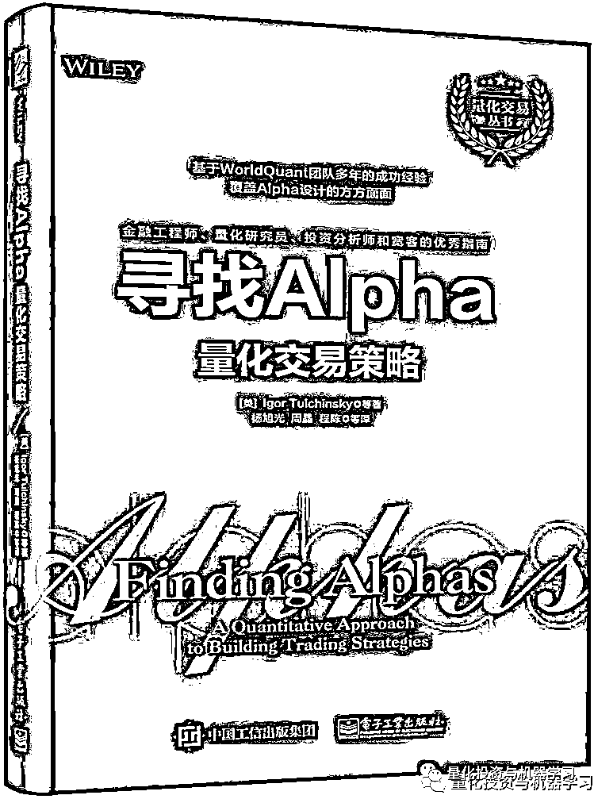
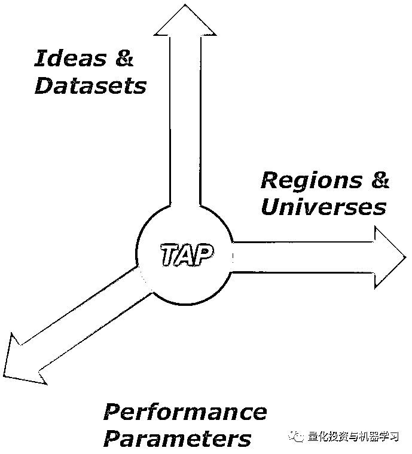
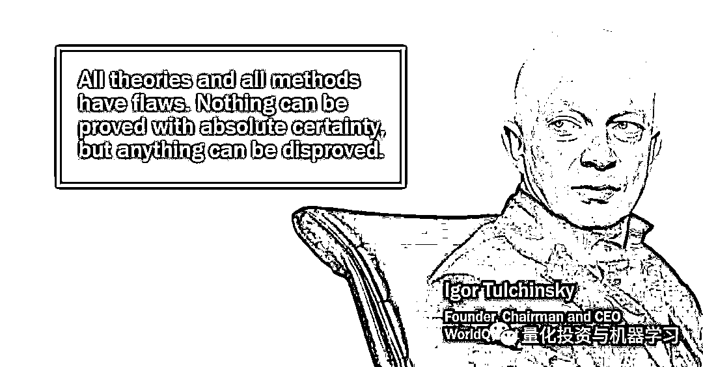
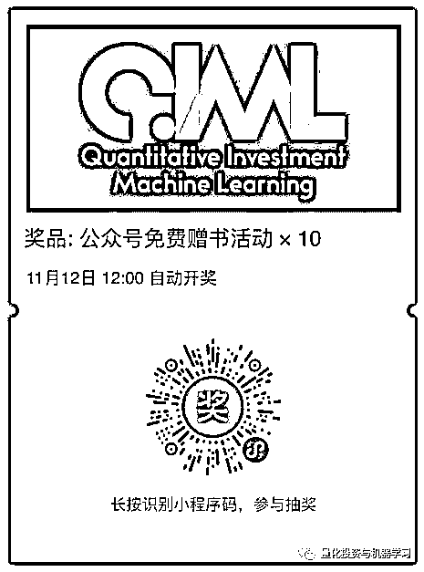

# 免费送书！WorldQuant《寻找 Alpha，量化交易策略》

> 原文：[`mp.weixin.qq.com/s?__biz=MzAxNTc0Mjg0Mg==&mid=2653295266&idx=1&sn=fdb0aaa047134ecf5444a57f4664a10b&chksm=802dd0b7b75a59a1d18e7312ea06f6fac3cc9e9981b63be74cec6f3f18345cd3cc4ca1c84fcb&scene=27#wechat_redirect`](http://mp.weixin.qq.com/s?__biz=MzAxNTc0Mjg0Mg==&mid=2653295266&idx=1&sn=fdb0aaa047134ecf5444a57f4664a10b&chksm=802dd0b7b75a59a1d18e7312ea06f6fac3cc9e9981b63be74cec6f3f18345cd3cc4ca1c84fcb&scene=27#wechat_redirect)

**标星★公众号     **爱你们♥   

**编辑部的话**

为了感谢各位忠实读者对公众号长期以来的支持，量化投资与机器学习微信公众号电子工业出版社合作，**免费**为大家赠送量化类相关书籍。本期**送 10 本**！

本期赠送的书籍是：

**公众号推荐**Worldquant，一家全球知名的量化投资公司，成立于 2007 年，在全球拥有超过 750 名员工。

WorldQuant 为系统研究指定了一个而闻名 Triple-Axis 计划（TAP），分别是：

具体了解请点击：

[***WorldQuant TAP：Alpha 如何多元化？***](https://mp.weixin.qq.com/s?__biz=MzAxNTc0Mjg0Mg==&mid=2653293682&idx=1&sn=a2fa86017c6aacd198fd9bebcb236527&scene=21#wechat_redirect)

此书通过大量图、表清晰地解释了：

1、开发、评估和改进 Alpha 质量的关键步骤。

2、换手率、回测、基本面分析、股票价量、统计套利、过度拟合和 Alpha 多样性的、关键技术细节。

3、在 Alpha 多样性中，哪些该做，哪些不该做。

4、各种资产类别的 Alpha 设计，以及新闻和社交媒体对股票收益率的影响。

**内容介绍**

**本书是世坤投资（WorldQuant）公司的众多资深专家，包括其创始人兼 CEO（IgorTulchinsky）的心血之作，书中对很多能点石成金的交易信号进行了深入分析，并且提供了可以用来做练习和开发的工具。**

本书为读者提供了从数据中找到隐藏信号的方法，且在其他领域中同样适用。本书是很多不同作者的文章合集，通过多维度视角分析相似性，提供了独特的方法来开发 Alpha 信号，同时涵盖了抽象理论和具体技术等多个方面。书中还提供了关于世坤投资的在线模拟工具 WebSimTM 的实用指导，从而帮助读者实践 Alpha 信号的开发过程。

通过本书，读者将学习到信息研究的基本注意事项，包括基本面分析、统计套利、Alpha 多样性等，然后可深入研究更高级的领域和更复杂的设计。

**作者介绍**

Igor Tulchinsky(伊戈尔·图利钦斯基)，华尔街资深交易员、量化交易公司 WorldQuant （世坤）的创始人兼 CEO。早年在得克萨斯大学奥斯汀分校（The University of Texas at Austin）获得了计算机专业的本科及硕士学位，接着去了 AT&T 的贝尔实验室从事科研工作。其后，又在宾夕法尼亚大学的沃顿商学院获得了 MBA 金融创业方向（MBA in Finance & Entrepreneurship）的硕士学位。他还是世坤基金的创始人，该基金为那些在科学和量化研究领域深造的杰出学子提供奖学金。他还创建了 WorldQuant 大学，免费提供计量金融硕士的在线学位教育。

杨旭光，曾就职于 Cadence Design Systems, Inc 和 NVIDIA，从事程序开发等研究工作。有幸经过李佐凡先生帮助进入了量化的世界，从此痴迷于程序化交易：发现规律，预测规律，利用规律。“我有发现美的眼睛，用她来寻找 Alpha！”

**免费赠送规则**

此次赠送活动，公众号将为所有读者**赠送 10 本****《寻找 Alpha：量化交易策略》。**

**规则如下：**

**扫描下方二维码**，在截止日后，系统会自动抽取 10 位幸运粉丝。

中奖用户，届时请发送中奖截图至

官方微信：**zxlgglr**   或

官方邮箱：***lhtzjqxx@163.com***

**活动截止日期**

**2019 年 11 月 12 日 12:00**

*—End—*

量化投资与机器学习微信公众号，是业内垂直于**Quant**、**MFE**、**CST、AI**等专业的**主****流量化自媒体**。公众号拥有来自**公募、私募、券商、银行、海外**等众多圈内**18W+**关注者。每日发布行业前沿研究成果和最新量化资讯。你点的每个“在看”，都是对我们最大的鼓励