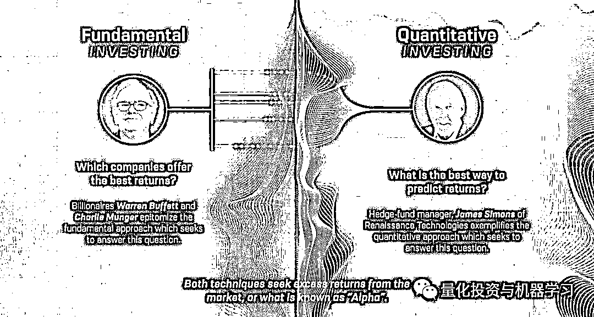
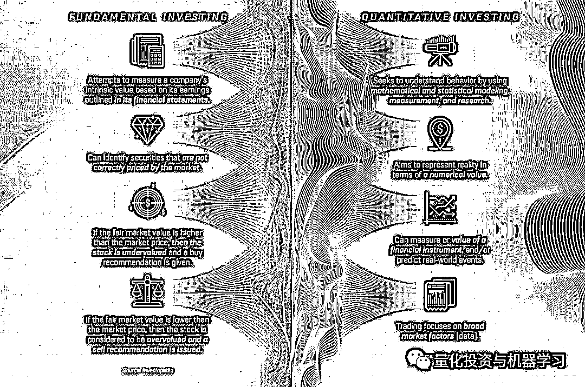
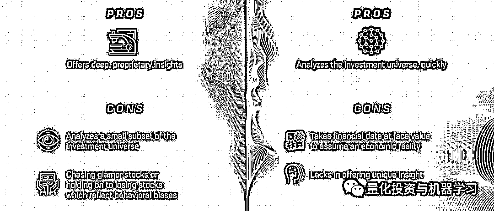
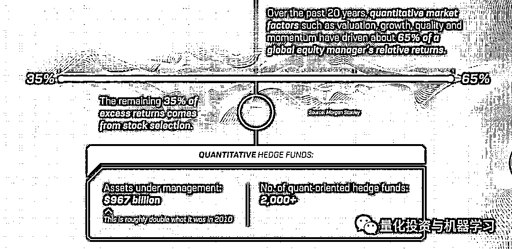
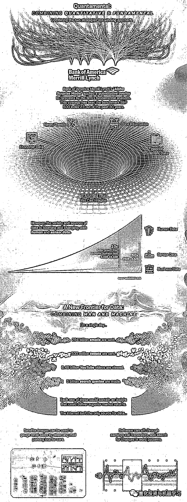
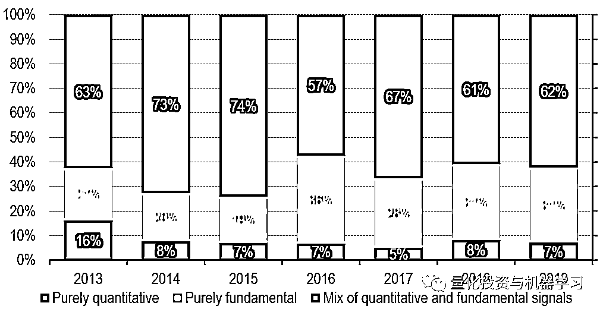
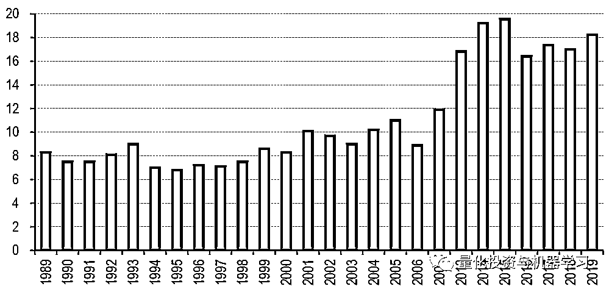
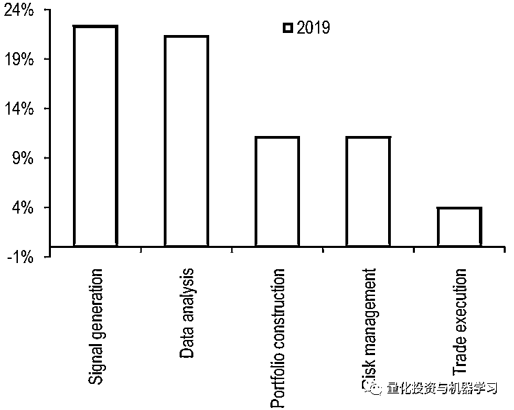
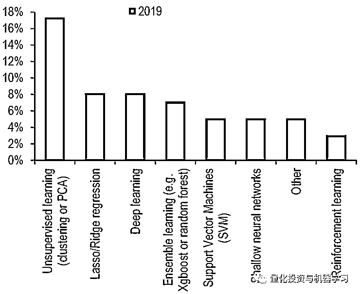
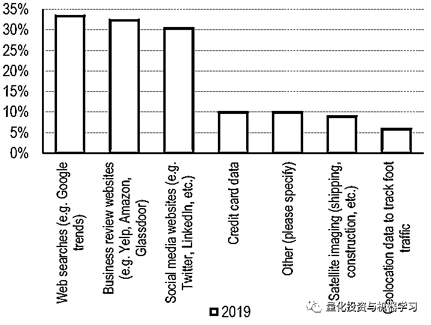

# 巴菲特+西蒙斯：完美！

> 原文：[`mp.weixin.qq.com/s?__biz=MzAxNTc0Mjg0Mg==&mid=2653295230&idx=1&sn=e7db254a56084299d40cff2dc8fbc796&chksm=802dd06bb75a597d019c536a181953e88cf9e493cca776684fe688cc3582b842acd1ff1fa6b1&scene=27#wechat_redirect`](http://mp.weixin.qq.com/s?__biz=MzAxNTc0Mjg0Mg==&mid=2653295230&idx=1&sn=e7db254a56084299d40cff2dc8fbc796&chksm=802dd06bb75a597d019c536a181953e88cf9e493cca776684fe688cc3582b842acd1ff1fa6b1&scene=27#wechat_redirect)

**标星★公众号     **爱你们♥

**近期原创文章：**

## ♥ [5 种机器学习算法在预测股价的应用（代码+数据）](https://mp.weixin.qq.com/s?__biz=MzAxNTc0Mjg0Mg==&mid=2653290588&idx=1&sn=1d0409ad212ea8627e5d5cedf61953ac&chksm=802dc249b75a4b5fa245433320a4cc9da1a2cceb22df6fb1a28e5b94ff038319ae4e7ec6941f&token=1298662931&lang=zh_CN&scene=21#wechat_redirect)

## ♥ [Two Sigma 用新闻来预测股价走势，带你吊打 Kaggle](https://mp.weixin.qq.com/s?__biz=MzAxNTc0Mjg0Mg==&mid=2653290456&idx=1&sn=b8d2d8febc599742e43ea48e3c249323&chksm=802e3dcdb759b4db9279c689202101b6b154fb118a1c1be12b52e522e1a1d7944858dbd6637e&token=1330520237&lang=zh_CN&scene=21#wechat_redirect)

## ♥ 2 万字干货：[利用深度学习最新前沿预测股价走势](https://mp.weixin.qq.com/s?__biz=MzAxNTc0Mjg0Mg==&mid=2653290080&idx=1&sn=06c50cefe78a7b24c64c4fdb9739c7f3&chksm=802e3c75b759b563c01495d16a638a56ac7305fc324ee4917fd76c648f670b7f7276826bdaa8&token=770078636&lang=zh_CN&scene=21#wechat_redirect)

## ♥ [机器学习在量化金融领域的误用！](http://mp.weixin.qq.com/s?__biz=MzAxNTc0Mjg0Mg==&mid=2653292984&idx=1&sn=3e7efe9fe9452c4a5492d2175b4159ef&chksm=802dcbadb75a42bbdce895c49070c3f552dc8c983afce5eeac5d7c25974b7753e670a0162c89&scene=21#wechat_redirect)

## ♥ [基于 RNN 和 LSTM 的股市预测方法](https://mp.weixin.qq.com/s?__biz=MzAxNTc0Mjg0Mg==&mid=2653290481&idx=1&sn=f7360ea8554cc4f86fcc71315176b093&chksm=802e3de4b759b4f2235a0aeabb6e76b3e101ff09b9a2aa6fa67e6e824fc4274f68f4ae51af95&token=1865137106&lang=zh_CN&scene=21#wechat_redirect)

## ♥ [如何鉴别那些用深度学习预测股价的花哨模型？](https://mp.weixin.qq.com/s?__biz=MzAxNTc0Mjg0Mg==&mid=2653290132&idx=1&sn=cbf1e2a4526e6e9305a6110c17063f46&chksm=802e3c81b759b597d3dd94b8008e150c90087567904a29c0c4b58d7be220a9ece2008956d5db&token=1266110554&lang=zh_CN&scene=21#wechat_redirect)

## ♥ [优化强化学习 Q-learning 算法进行股市](https://mp.weixin.qq.com/s?__biz=MzAxNTc0Mjg0Mg==&mid=2653290286&idx=1&sn=882d39a18018733b93c8c8eac385b515&chksm=802e3d3bb759b42d1fc849f96bf02ae87edf2eab01b0beecd9340112c7fb06b95cb2246d2429&token=1330520237&lang=zh_CN&scene=21#wechat_redirect)

## ♥ [WorldQuant 101 Alpha、国泰君安 191 Alpha](https://mp.weixin.qq.com/s?__biz=MzAxNTc0Mjg0Mg==&mid=2653290927&idx=1&sn=ecca60811da74967f33a00329a1fe66a&chksm=802dc3bab75a4aac2bb4ccff7010063cc08ef51d0bf3d2f71621cdd6adece11f28133a242a15&token=48775331&lang=zh_CN&scene=21#wechat_redirect)

## ♥ [基于回声状态网络预测股票价格（附代码）](https://mp.weixin.qq.com/s?__biz=MzAxNTc0Mjg0Mg==&mid=2653291171&idx=1&sn=485a35e564b45046ff5a07c42bba1743&chksm=802dc0b6b75a49a07e5b91c512c8575104f777b39d0e1d71cf11881502209dc399fd6f641fb1&token=48775331&lang=zh_CN&scene=21#wechat_redirect)

## ♥ [计量经济学应用投资失败的 7 个原因](https://mp.weixin.qq.com/s?__biz=MzAxNTc0Mjg0Mg==&mid=2653292186&idx=1&sn=87501434ae16f29afffec19a6884ee8d&chksm=802dc48fb75a4d99e0172bf484cdbf6aee86e36a95037847fd9f070cbe7144b4617c2d1b0644&token=48775331&lang=zh_CN&scene=21#wechat_redirect)

## ♥ [配对交易千千万，强化学习最 NB！（文档+代码）](http://mp.weixin.qq.com/s?__biz=MzAxNTc0Mjg0Mg==&mid=2653292915&idx=1&sn=13f4ddebcd209b082697a75544852608&chksm=802dcb66b75a4270ceb19fac90eb2a70dc05f5b6daa295a7d31401aaa8697bbb53f5ff7c05af&scene=21#wechat_redirect)

## ♥ [关于高盛在 Github 开源背后的真相！](https://mp.weixin.qq.com/s?__biz=MzAxNTc0Mjg0Mg==&mid=2653291594&idx=1&sn=7703403c5c537061994396e7e49e7ce5&chksm=802dc65fb75a4f49019cec951ac25d30ec7783738e9640ec108be95335597361c427258f5d5f&token=48775331&lang=zh_CN&scene=21#wechat_redirect)

## ♥ [新一代量化带货王诞生！Oh My God！](https://mp.weixin.qq.com/s?__biz=MzAxNTc0Mjg0Mg==&mid=2653291789&idx=1&sn=e31778d1b9372bc7aa6e57b82a69ec6e&chksm=802dc718b75a4e0ea4c022e70ea53f51c48d102ebf7e54993261619c36f24f3f9a5b63437e9e&token=48775331&lang=zh_CN&scene=21#wechat_redirect)

## ♥ [独家！关于定量/交易求职分享（附真实试题）](https://mp.weixin.qq.com/s?__biz=MzAxNTc0Mjg0Mg==&mid=2653291844&idx=1&sn=3fd8b57d32a0ebd43b17fa68ae954471&chksm=802dc751b75a4e4755fcbb0aa228355cebbbb6d34b292aa25b4f3fbd51013fcf7b17b91ddb71&token=48775331&lang=zh_CN&scene=21#wechat_redirect)

## ♥ [Quant 们的身份危机！](https://mp.weixin.qq.com/s?__biz=MzAxNTc0Mjg0Mg==&mid=2653291856&idx=1&sn=729b657ede2cb50c96e92193ab16102d&chksm=802dc745b75a4e53c5018cc1385214233ec4657a3479cd7193c95aaf65642f5f45fa0e465694&token=48775331&lang=zh_CN&scene=21#wechat_redirect)

## ♥ [AQR 最新研究 | 机器能“学习”金融吗？](http://mp.weixin.qq.com/s?__biz=MzAxNTc0Mjg0Mg==&mid=2653292710&idx=1&sn=e5e852de00159a96d5dcc92f349f5b58&chksm=802dcab3b75a43a5492bc98874684081eb5c5666aff32a36a0cdc144d74de0200cc0d997894f&scene=21#wechat_redirect)

  公众号海外部推出

巴菲特（基本面投资者）、西蒙斯（量化投资者）。这两位老爷子的光荣伟绩我们就不做过多阐述了，如果有些人还不知道他们，那只能~

无论二位如何操作，其本质都是在市场上寻求超额收益，即所谓的**Alpha**。

基本面投资和量化投资各有特点，主要是以下几个方面：

总结一下：

**基本面投资：**根据财务报表中概述的收益来衡量公司的额内在价值，识别出市场不确定的证券。如果某一证券的公允价值高于市价，则该股票被低估，并且给出卖出意见。反之。

**量化投资：**通过数学、统计建模等方式，利用计算机技术从庞大的历史数据中海选出能带来超额收益的“大概率”事件来制定策略。

如果将这两种投资模式结合起来，就是我们所说的：

**Quantamental**

**Quantamental：**它是 Quantitative 和 Fundamental 两者的结合，就是“量化”+“基本面”的意思，简称**量本投资**。

当然二者也各有优缺点：

**基本面投资：**提供了深刻、独到的见解；局限是根据金融数据的表面价值来假设一个经济实体，缺乏独特的洞察力。

**量化投资：**能够快速分析投资领域；它是投资分析领域的一个小子集，有时会陷入追逐已经位于高位的股票，或者持有反映行为偏差的亏损股票 。

根据摩根士丹利的分析：在过去的 20 年里，比如估值、成长、质量和动量因子，已经驱动了全球股票经理 65%的相对收益。

35%的回报要归因于基本面选股。这种方法有其优点，但这使得该策略依赖于市场因素，使其成为超额收益的唯一来源。

美国银行美林的 Alpha Surprise 模型就是其中一个例子，该模型对公司基本面分析师的预测进行量化叠加。 在过去的 30 年里，该模型 23 次跑赢了标普 500 指数。

*“Quantamental” model with attractive risk/return profile The Alpha Surprise model is a quantitative discipline applied to our fundamental research franchise – it screens for inexpensive, out-of-consensus stock ideas using our fundamental analysts’ earnings estimates. The model has generally offered investors attractive relative returns at comparable or lower levels of risk than the market’s, and, with the exception of the Tech Bubble, has outperformed the S&P 500 in every three-year window since inception.*

人类世界的数据已经开始出现爆发性增长，新模型纳入的数据也更加丰富。在金融界，软件可以跟踪通话记录中的情绪，并检测高管的词汇模式，并以此量化整个市场的交易情绪等等。

在更大的范围内，跟踪和存储数据可以揭示长期的经济模式。例如，商场停车场的卫星图像可以确定商场的销售量等等。

美国银行美林在 2019 年的年度机构因子调查发现，Quantamental 是一个关键趋势：

在报告中我们也给大家分享一些有趣的发现：

**量化模型总体上已经变得更加复杂，平均每个模型有****18 个因****子****构成**，而不是 20 世纪 90 年代大多数模型中使用的 7-8 个因子。

今年，人工智能和机器学习变得尤为重要，因为投资者将传统因子与机器学习结合起来，研究更大的数据集，识别非线性关系。调查发现，**超过 20%的参与者使用机器学习来产生 Alpha：**

**17%****的机器学习用户使用的是****非监督式学习方法**，比如我们常见的 PCA 等。强化学习则用的额最少：

几乎 40%的人使用不同形式的另类数据，其中网上数据最为普遍，占另类数据用户的 30% 。 只有大约 10% 的人声称使用信用卡、卫星和地理定位数据。

关于 Quantamental 的内容有很多具体的方面可以讨论。我们将在今后为大家带来更多的内容！

*—End—*

量化投资与机器学习微信公众号，是业内垂直于**Quant**、**MFE**、**CST、AI**等专业的**主****流量化自媒体**。公众号拥有来自**公募、私募、券商、银行、海外**等众多圈内**18W+**关注者。每日发布行业前沿研究成果和最新量化资讯。

你点的每个“在看”，都是对我们最大的鼓励