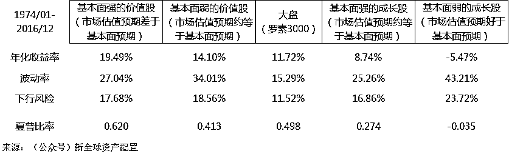
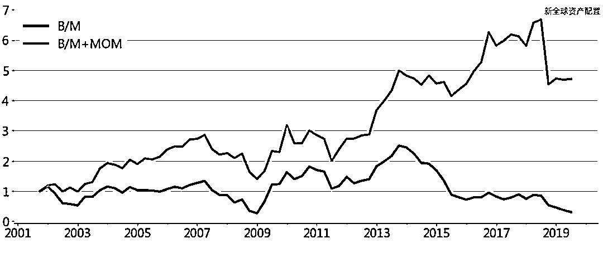

# 公式化价值投资：要想当股神，还得擦亮眼！

> 原文：[`mp.weixin.qq.com/s?__biz=MzAxNTc0Mjg0Mg==&mid=2653295198&idx=1&sn=79e7f6f68b16bdf67f41464a142b29ba&chksm=802dd04bb75a595d3900ed4d03ffdc750009bec862c9cd3b36c3b7c2dfd314a397afe00a3e22&scene=27#wechat_redirect`](http://mp.weixin.qq.com/s?__biz=MzAxNTc0Mjg0Mg==&mid=2653295198&idx=1&sn=79e7f6f68b16bdf67f41464a142b29ba&chksm=802dd04bb75a595d3900ed4d03ffdc750009bec862c9cd3b36c3b7c2dfd314a397afe00a3e22&scene=27#wechat_redirect)

**标星★公众号     **爱你们♥   

**近期原创文章：**

## ♥ [5 种机器学习算法在预测股价的应用（代码+数据）](https://mp.weixin.qq.com/s?__biz=MzAxNTc0Mjg0Mg==&mid=2653290588&idx=1&sn=1d0409ad212ea8627e5d5cedf61953ac&chksm=802dc249b75a4b5fa245433320a4cc9da1a2cceb22df6fb1a28e5b94ff038319ae4e7ec6941f&token=1298662931&lang=zh_CN&scene=21#wechat_redirect)

## ♥ [Two Sigma 用新闻来预测股价走势，带你吊打 Kaggle](https://mp.weixin.qq.com/s?__biz=MzAxNTc0Mjg0Mg==&mid=2653290456&idx=1&sn=b8d2d8febc599742e43ea48e3c249323&chksm=802e3dcdb759b4db9279c689202101b6b154fb118a1c1be12b52e522e1a1d7944858dbd6637e&token=1330520237&lang=zh_CN&scene=21#wechat_redirect)

## ♥ 2 万字干货：[利用深度学习最新前沿预测股价走势](https://mp.weixin.qq.com/s?__biz=MzAxNTc0Mjg0Mg==&mid=2653290080&idx=1&sn=06c50cefe78a7b24c64c4fdb9739c7f3&chksm=802e3c75b759b563c01495d16a638a56ac7305fc324ee4917fd76c648f670b7f7276826bdaa8&token=770078636&lang=zh_CN&scene=21#wechat_redirect)

## ♥ [机器学习在量化金融领域的误用！](http://mp.weixin.qq.com/s?__biz=MzAxNTc0Mjg0Mg==&mid=2653292984&idx=1&sn=3e7efe9fe9452c4a5492d2175b4159ef&chksm=802dcbadb75a42bbdce895c49070c3f552dc8c983afce5eeac5d7c25974b7753e670a0162c89&scene=21#wechat_redirect)

## ♥ [基于 RNN 和 LSTM 的股市预测方法](https://mp.weixin.qq.com/s?__biz=MzAxNTc0Mjg0Mg==&mid=2653290481&idx=1&sn=f7360ea8554cc4f86fcc71315176b093&chksm=802e3de4b759b4f2235a0aeabb6e76b3e101ff09b9a2aa6fa67e6e824fc4274f68f4ae51af95&token=1865137106&lang=zh_CN&scene=21#wechat_redirect)

## ♥ [如何鉴别那些用深度学习预测股价的花哨模型？](https://mp.weixin.qq.com/s?__biz=MzAxNTc0Mjg0Mg==&mid=2653290132&idx=1&sn=cbf1e2a4526e6e9305a6110c17063f46&chksm=802e3c81b759b597d3dd94b8008e150c90087567904a29c0c4b58d7be220a9ece2008956d5db&token=1266110554&lang=zh_CN&scene=21#wechat_redirect)

## ♥ [优化强化学习 Q-learning 算法进行股市](https://mp.weixin.qq.com/s?__biz=MzAxNTc0Mjg0Mg==&mid=2653290286&idx=1&sn=882d39a18018733b93c8c8eac385b515&chksm=802e3d3bb759b42d1fc849f96bf02ae87edf2eab01b0beecd9340112c7fb06b95cb2246d2429&token=1330520237&lang=zh_CN&scene=21#wechat_redirect)

## ♥ [WorldQuant 101 Alpha、国泰君安 191 Alpha](https://mp.weixin.qq.com/s?__biz=MzAxNTc0Mjg0Mg==&mid=2653290927&idx=1&sn=ecca60811da74967f33a00329a1fe66a&chksm=802dc3bab75a4aac2bb4ccff7010063cc08ef51d0bf3d2f71621cdd6adece11f28133a242a15&token=48775331&lang=zh_CN&scene=21#wechat_redirect)

## ♥ [基于回声状态网络预测股票价格（附代码）](https://mp.weixin.qq.com/s?__biz=MzAxNTc0Mjg0Mg==&mid=2653291171&idx=1&sn=485a35e564b45046ff5a07c42bba1743&chksm=802dc0b6b75a49a07e5b91c512c8575104f777b39d0e1d71cf11881502209dc399fd6f641fb1&token=48775331&lang=zh_CN&scene=21#wechat_redirect)

## ♥ [计量经济学应用投资失败的 7 个原因](https://mp.weixin.qq.com/s?__biz=MzAxNTc0Mjg0Mg==&mid=2653292186&idx=1&sn=87501434ae16f29afffec19a6884ee8d&chksm=802dc48fb75a4d99e0172bf484cdbf6aee86e36a95037847fd9f070cbe7144b4617c2d1b0644&token=48775331&lang=zh_CN&scene=21#wechat_redirect)

## ♥ [配对交易千千万，强化学习最 NB！（文档+代码）](http://mp.weixin.qq.com/s?__biz=MzAxNTc0Mjg0Mg==&mid=2653292915&idx=1&sn=13f4ddebcd209b082697a75544852608&chksm=802dcb66b75a4270ceb19fac90eb2a70dc05f5b6daa295a7d31401aaa8697bbb53f5ff7c05af&scene=21#wechat_redirect)

## ♥ [关于高盛在 Github 开源背后的真相！](https://mp.weixin.qq.com/s?__biz=MzAxNTc0Mjg0Mg==&mid=2653291594&idx=1&sn=7703403c5c537061994396e7e49e7ce5&chksm=802dc65fb75a4f49019cec951ac25d30ec7783738e9640ec108be95335597361c427258f5d5f&token=48775331&lang=zh_CN&scene=21#wechat_redirect)

## ♥ [新一代量化带货王诞生！Oh My God！](https://mp.weixin.qq.com/s?__biz=MzAxNTc0Mjg0Mg==&mid=2653291789&idx=1&sn=e31778d1b9372bc7aa6e57b82a69ec6e&chksm=802dc718b75a4e0ea4c022e70ea53f51c48d102ebf7e54993261619c36f24f3f9a5b63437e9e&token=48775331&lang=zh_CN&scene=21#wechat_redirect)

## ♥ [独家！关于定量/交易求职分享（附真实试题）](https://mp.weixin.qq.com/s?__biz=MzAxNTc0Mjg0Mg==&mid=2653291844&idx=1&sn=3fd8b57d32a0ebd43b17fa68ae954471&chksm=802dc751b75a4e4755fcbb0aa228355cebbbb6d34b292aa25b4f3fbd51013fcf7b17b91ddb71&token=48775331&lang=zh_CN&scene=21#wechat_redirect)

## ♥ [Quant 们的身份危机！](https://mp.weixin.qq.com/s?__biz=MzAxNTc0Mjg0Mg==&mid=2653291856&idx=1&sn=729b657ede2cb50c96e92193ab16102d&chksm=802dc745b75a4e53c5018cc1385214233ec4657a3479cd7193c95aaf65642f5f45fa0e465694&token=48775331&lang=zh_CN&scene=21#wechat_redirect)

## ♥ [AQR 最新研究 | 机器能“学习”金融吗](http://mp.weixin.qq.com/s?__biz=MzAxNTc0Mjg0Mg==&mid=2653292710&idx=1&sn=e5e852de00159a96d5dcc92f349f5b58&chksm=802dcab3b75a43a5492bc98874684081eb5c5666aff32a36a0cdc144d74de0200cc0d997894f&scene=21#wechat_redirect)

**前言**

本杰明•格雷厄姆于 75 年前创立了价值投资的理念，其徒弟——金融圈里的第一网红沃伦•巴菲特大力发扬实践了这一理念，并获得了耀眼的成绩。到今天，价值投资依旧是最流行、最持久的投资方式之一。

我们知道价值投资的精髓就是找到长期的好公司、以便宜的价格买入。在量化投资领域，“价值投资”也被广泛使用：**量化价值投资策略在美国几乎是每一个追求大资管额的量化基金的标配。**

在量化投资策略中，“价值投资”越来越多地被简单的基本指标（如账面价值或收益）与价格的比率所表示，投资者据此进行选股并构建分散化投资组合的投资策略。

这种简单的量化价值投资策略，看似能识别出被市场低估的股票，但 U-Wen Kok、Jason Ribando 和 Richard G. Sloan 在《Facts about formulaic value investing》这篇研究论文中表示：

**这一策略并没有识别出真正被低估的股票，只是系统性地找出了会计数据暂时膨胀的公司，**由简单的价值指标构建的价值因子，可能并没有投资于真正的“价值”。

以市盈率的价值指标为例，这些所谓价值股的市盈率均值回归，往往并不意味着股价的上涨，而是每股盈利的下滑：如 2014 年夏天油价暴跌后能源股的处理方式，股市本身开始下跌，但企业的资产负债表尚未反映出宏观问题，这种滞后意味着“账面价值仍然很高，所以看起来很便宜，才被公式化的价值策略相中，但实际上这只是暂时的。”

**公式化价值投资并不简单，要买到物美价廉的东西，我们仍需要一双智慧的眼睛。****数据选取**1\. 文章主要使用两部分数据：因子数据和个股数据。
2\. 因子收益率数据来源于 Ken French 网页，时间段为 1926 年-2015 年。3\. 对于个股数据，选取的样本公司为罗素 3000 指数(Russell 3000 Index)的权重股，基础会计数据和价格来自于 Factset，且对基础会计数据 1%以外的极端值进行缩尾处理(winsorized)，时间区间为 2002 年-2014 年。**传统价值投资的市场表现和收益来源**

作者首先使用 Fama-French 的 HML 因子分析价值因子的表现。这一因子基于账面市值比和市值构建的多空组合。Fama 和 French 将美国股票分成“2*3”种类型，如下表所示：“2”表示大市值(BIG)和小市值(SMALL)，“3”表示高价值(H)，中价值(M)，低价值(L)。

通过 HML 因子分析价值因子作者在每个市值分组内，构建高价值的多头和低价值的空头组合后，分别给予 50%权重，如该表达式所示：HML =1/2 (H / BIG - L / BIG) - 1/2 (H / SMALL - L / SMALL)，得到 HML【高价值-低价值】因子。同理，HMM 表示【高价值-中价值】，LMM 表示【低价值-中价值】。作者从 HML 指标出发，一步步分析价值因子的表现和收益来源。如下表所示，其中加粗的数字表示存在显著的α：价值因子的表现和收益来源由上图可知：1、HML 价值因子的溢价并不总是显著的(红框所示)。HML 列是完整 HML 价值因子在不同时间段的超额收益。全时段的 1926-2015 来看，该因子具有显著的正超额收益。但分时段来看，1926-1962 和 2002-2015 两个时间段的超额收益并不显著。2、价值股中，溢价主要来源于小盘股(绿框所示)。按市值大小将 HML 因子分解成大盘(HML BIG)和小盘(HML SMALL)。从全时段来看，大盘部分的 HML 并不存在显著超额收益。在 HML 存在显著超额收益的两个时间段，HML BIG 只有 1963-1981 的时间段是显著的，而 HML SMALL 在任何时间段都比 HML BIG 组合有着更显著且更高的超额收益。因此 HML 因子的超额收益主要是来源于小盘部分。3、小盘价值股中，溢价主要来源于低价值(成长)股(紫框所示)。HML SMALL 是一个多空因子，我们进一步地将其分解为仅做多的 HMM SAMLL 和仅做空的 LMM SMALL 两部分。可以看到，做多部分的 HMM SAMLL 超额收益并不显著，做空部分的 LMM SMALL 则拥有显著的负α。由此可以判断小盘 HML 因子的超额收益主要是来源于低价值的空头部分。**因此，价值因子的α主要是由于小市值股票的成长股被严重高估了，其收益主要来源于做空小市值的成长股，而不是做多价值股。**而在实践中，做空小市值的成长股可能会面临下述问题产生的高额成本：1、小市值成长股虽然数量庞大，但是只占整个市场市值的 3%。这意味着市场容量不大。可能承受更高的市场冲击等交易成本，且持仓的流动性会受到很大影响。2、做空小市值成长股平均要承受每年 2.8%的股票借贷费用，这会抵消掉很大一部分的α收益(每年 3.98%)。这一结果表明市场的摩擦阻碍着套利。**传统“价值”真正识别的是什么？**文章从 B/P、E/P、预测 E/P 进行分析，发现这些指标确实存在均值回归现象：

三个不同价值指标的均值回归
以 B/M 指标为例，首先对每个股票按 B/M 大小进行排序，构造 5 分位组合并从其中取高(High)、中(Middle)、低(Low)三个分组，计算在随后一年的时间内，各个分组组内的平均 B/M。可以看到，除了低 E/P 的分组外，对于各个指标，随着时间的推移不同分组指标都向着一个方向靠拢。这一现象说明，价值指标的偏离会逐渐被“纠正”。通过下面的公式，可以将价值比率的变动分解为财务变动(Change in Fundamental)和价格变动(Change in Price)两部分：

下图是高价值组合相对于中价值组合的期初溢价和期末溢价，并按上述公式将溢价变动分解为价格变动影响和财务变动影响两个部分。

三个价值比率的价格变动分解
基于三个不同价值指标溢价变动的分解发现，**价值比率的均值回归现象主要来自于财务变动，来自价格变动的影响微乎其微**。结论是这三种价值指标识别的可能并不是标价过低的股票，而是基础会计指标暂时膨胀的股票。

在这种情形下，市场估值已经能正确地反映其较弱基本面的预期，此时难以从中赚取超额回报。正确的价值投资，应该是借助预期差，即寻找市场估值预期差于基本面预期的股票，来赚取超额回报。在《投资中的预期差(Expectation Errors) - 价值投资和成长投资》中，用市场预期和个人对公司基本面的预期这两个维度，做了个测试，结果显示：买价值被低估的（财务）质量高的股票，可以战胜市场的平均预期。市场在没能理性、正确地对价值股基本面作出判断时，财务质量指标有一定的区分公司价值的能力。**高价值股在未来的业绩表现怎么样？**文章对比价值指标高价值组(1/5 段)和中价值组(中间 1/5 段)投资组合，在该指标发布后的业绩表现。指标包括异常费用(UnusualCharges)、收益变动(Changein Earnings)、下一年 EPS 平均预估的修订(Forecast Revisions)、当前年度每股盈利平均预估中的后续误差(ForecastError)、GAAP 每股收益与华尔街分析师调整后收益的差值(GAAP-StreetEarnings)。

价值指标前 1/5 段和中间 1/5 段的业绩表现
当资产的账面价值夸大其公允价值的时候，资产减值会被包含在异常费用中。相比于中价值组，高价值组在随后的一年内通常有着更大规模的异常费用。对于 B/M 构建的价值分组，高/中分组差异尤为明显。这些高 B/M 组的公司账面价值被高估，其后的资产减值使其 B/M 指标发生均值回归。收益变动指标反映，高价值组合的收益在接下来的一年通常会下降。尤其是以 E/P 衡量的价值股，其筛选的股票只是在筛选排名时暂时表现较高。高价值组在后续预估修正中有着更大的负向调整，同时分析师的预测依然存在较大的负向误差，这说明分析师在对收益预测的降低上步伐缓慢，公司实际的收益比分析师的预估更加悲观。最后 GAAP-Street 反映了每股收益与华尔街分析师调整后收益的差值，华尔街分析师在盈利预测中常常忽略一些经常性项目和包括资产减值在内的非经常性项目费用。最终导致随后的 GAAP 收益大幅小于华尔街收益。**总的来说，这些指标选择的“高价值”股票，拥有着大量的异常费用，并在随后的时间内出现收益下降的现象。**此外，对于华尔街的预测收益，在其后的时间内也会存在负面的修正以及负向的预估误差。这些公司有更大的可能面临着不断恶化的财务业绩，甚至陷入财务困境中。研究到这里并不是要否定量化价值投资，而是揭示其潜在的弊端。我们已经证明“简单的公式化价值投资”并不见得是真正有效的价值投资，那么，有没有一些方法来改进呢？**传统价值与动量的相互作用**做量化投资的资产管理人通常将“公式化的价值投资策略” 与其他策略相结合使用。动量策略就是一种常见的选择。

三个价值比率的正/负动量组合价格变动分解
作者按正负动量进行分组，发现正动量组的会计指标变化远小于低动量组。对于远期收益/价格(Forward E/P)指标的正动量组，甚至出现【价格变动】成为价值指标均值回归效应的主要驱动因素。

如前文所述，基于简单价值指标识别出的“价值”股可能只是由于会计数字膨胀产生“价值”。这种虚假的价值股，其价值指标也会出现价值回归，但该现象更多来源于迟滞财务指标的恶化，而不是由价格上升驱动。

如上图结果显示那样，正动量组的财务恶化现象相对负动量组大幅减少甚至消失，此时由价格上升驱动的价值指标回归占比扩大。通过正动量选到因财务指标迟滞产生的虚假“价值”股概率大幅减少，这类“价值”股的财务困境通常在股价(负动量)先于财务反映出来。

加入动量能提升选中“真价值”股的概率，而且在选中后的一段时间内这些股票的财务指标恶化概率/幅度大幅减少了。**因此，在结合动量指标后，能够淘汰一些由于对已恶化业务的延迟会计处理而使基础指标暂时膨胀的股票，从而提升识别出低价股的能力。**

**成功的基本面分析对价值投资的帮助**作者将 B/M 指标和账面价值的未来对数变动排名指标分成十等份，并使用 Fama-MacBeth 方法作回归分析。主要有以下结果：
B/M 指标及账面价值的未来对数变动排名指标与组合收益的 Fama-MacBeth 回归在上面的回归分析中，解释变量均被压缩到 0-1 之间。其中高排名组为 1，低排名组为 0。对于单因子回归，假如我们构造一个投资组合，包含 1 份多头的高排名组和 1 份空头的低排名组，将会获得与该因子系数相等的组合收益率。对于多因子回归，我们也能通过构造类似的多空组合，并使用单因子组合对冲掉相应因子收益，得到回归中任一因子系数的收益。对于上述结果，我们得到如下结论：1、B/M 指标构建的多空组合能获得 4.1%的年收益。2、基于账面价值的未来变动指标（即能完美预测出指标的未来变化）构建的多空组合能产生 36.1%的年收益。3、能完美预测未来变动并不是策略的终点。如果加入 B/M 指标，能使 B/M 的系数提高到 17.8%，账面价值变化的系数增加到 42.6％。**账面市值比率包含有关未来股票收益且未来变动指标所不包含的重要信息，因此，挖掘这些公式化价值指标的信息，是有利可图的。**
另外，提高账面市值比率变动的预测能力，也有助于提高账面市值比策略表现。我们虽然不能像测试中假设那样，做到完美预测未来，但通过更完善更有效的基本面分析，提高指标未来趋势的估计能力，也是价值投资中必不可少的。**文章小结：几乎没有显著的证据证明投资者可以通过简单的比率来筛选出那些看起来被低估的股票。公式化的价值因子溢价实际上是来源于做空“昂贵”的小盘股。然而这类小盘股都有着资金容量、流动性和交易成本的限制。**更进一步的研究表明，使用简单单一的基本面指标与价格的比率，筛选出的股票有可能不是我们期望的低价股，而只是会计数字暂时膨胀的股票。**自己动手，丰衣足食****价值加动量的测试**
讲了那么多，我们不如直接上手构建一个策略，更能说明问题。我们尝试在美股市场构建一个价值+动量的组合，看看这一改进方式在实际应用中对价值投资表现的帮助。我们的策略按如下条件构建：

*   投资范围为罗素 3000 指数的成分股。

*   价值使用最近的账面市值比(B/M)和盈利价格比(E/P)两种比率表示。

*   投资价值比率最大的 20 个股票。20 个股票主要考虑实际投资的可行性，并且该数量组合具有较好的分散化性能。

*   在加入动量的测试组合(B/M+MOM 和 E/P+MOM)中，所选股票要求过去 1 年总回报为正。

*   持仓股票等权重分配，每 3 个月进行再平衡。

*   回测周期为 2002 年 1 月-2019 年 9 月。

回测以$1 为初始投资额的净值曲线及结果表现如下图所示：

初始投资额为$1 的净值曲线对比图(以 B/M 为基础) 

数据时间：2002 年 1 月-2019 年 9 月

数据来源：Bloomberg

初始投资额为$1 的净值曲线对比图(以 E/P 为基础) 

数据时间：2002 年 1 月-2019 年 9 月

数据来源：Bloomberg

价值加动量策略回测结果对比 

数据时间：2002 年 1 月-2019 年 9 月

数据来源：Bloomberg

可以看到，使用单一指标构建的投资组合表现非常糟糕。无论是账面市值比还是盈利价格比，近 17 年的表现为负收益率。与此同时，这些所谓的“价值股”拥有着异常大的波动，购买这些股票的投资者很可能要承受非常大的回撤风险。在加入动量指标后，两个价值策略的收益率都有非常大的提升，不仅从负值变成 7%以上，同时波动率也大幅下降。

根据前文的分析，基于单一价值指标“价值股”的“价值”很可能是由于会计数字临时膨胀产生，这些股票的财务指标在未来会不断恶化，甚至陷入财务困境。因此，没有加入动量条件的价值策略都表现出了异常大的波动。

这些陷入财务困境的“价值”股，通常先于财务在股价中表现出来，即负动量。**在引入正动量的筛选条件后，能够淘汰一些这类型的股票，并提升识别出低价股的能力。**最终反映在策略上的表现就是投资组合的风险大幅度下降，并转亏为盈。

**神奇公式在 A 股**除了动量外，质量也是价值因子很好的搭档，大名鼎鼎的“神奇公式”策略正是基于这一逻辑。神奇公式综合考虑了质量因子(资本收益率)和价值因子(盈利收益率)，为的就是寻找出又好又便宜的股票。这个神奇公式在 A 股市场中有相关的指数和相应的基金产品：中证价值回报量化策略指数(下文简称神奇公式指数)，利用它我们就能非常方便地去进行价值投资。我们把中国神奇公式指数和沪深 300 价值指数及沪深 300 指数放在一起对比：

中国神奇公式指数和沪深 300 价值指数、沪深 300 指数指数累计对数收益

数据时间：2006 年 2 月-2019 年 9 月

数据来源：Wind

中国神奇公式指数和沪深 300 价值指数、沪深 300 指数业绩 数据时间：2006 年 1 月-2019 年 9 月数据来源：Wind 上方图片和表格是各个指数在 2006 年 1 月-2019 年 4 月期间累计对数收益以及评估指标汇总结果。其中，神奇公式策略展现出了它强大的收益能力。相比基准的沪深 300 价值指数和沪深 300 指数，神奇公式策略在维持相似波动率和最大回撤的同时，大幅提高了组合的收益率。**写在最后**通过上面测试，我们发现，简单地引入正动量、或是质量的条件，能大幅提高价值策略的表现。因此，**在量化投资当中，结合不同的因子增加价值股的识别能力是非常有必要的。**此外，配合良好的基本面分析，甄别出假价值股，这才是真正的价值投资。
大家也一定要谨慎看待公式化的价值投资，**传统简单的指标来衡量股票的价值，可能只是识别出会计数字的暂时膨胀。**如果你要结合基本面分析，那么提高对基础会计指标的预测能力，有助于寻找出真正的“价值”股。当然要避免陷入“价值陷阱”，将传统的价值策略与动量、质量、盈利等因子相结合的办法也值得考虑。最后要理解，即便结合了动量和质量，也不意味着你选出来的都是价值股，**公式化价值投资也只是从概率上能选到一篮子更有可能成为价值股的组合，**它能高效快速地帮助我们进入这些市场领域，但要正确确定一家公司内在价值是一项复杂的工作，还需要更精细的基本面分析。

*—End—*

量化投资与机器学习微信公众号，是业内垂直于**Quant**、**MFE**、**CST、AI**等专业的**主****流量化自媒体**。公众号拥有来自**公募、私募、券商、银行、海外**等众多圈内**18W+**关注者。每日发布行业前沿研究成果和最新量化资讯。

你点的每个“在看”，都是对我们最大的鼓励