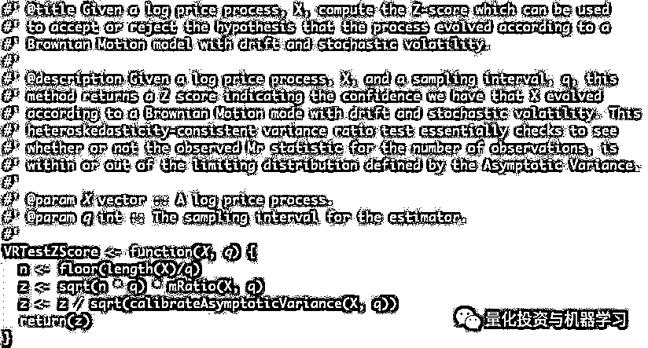
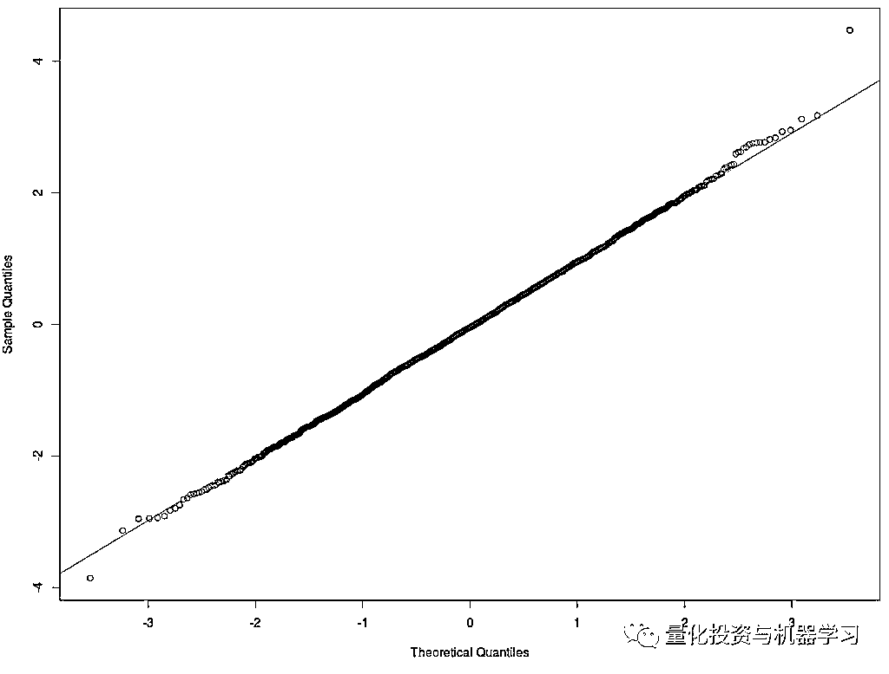

# 是的，股价不遵循随机游走！

> 原文：[`mp.weixin.qq.com/s?__biz=MzAxNTc0Mjg0Mg==&mid=2653295190&idx=1&sn=794c2c09ae2d48d8f77f6ead5f19231d&chksm=802dd043b75a5955043515ece76e9d2a8d9d6b030292353949aa8e8e7c39acff692dc3e13fc5&scene=27#wechat_redirect`](http://mp.weixin.qq.com/s?__biz=MzAxNTc0Mjg0Mg==&mid=2653295190&idx=1&sn=794c2c09ae2d48d8f77f6ead5f19231d&chksm=802dd043b75a5955043515ece76e9d2a8d9d6b030292353949aa8e8e7c39acff692dc3e13fc5&scene=27#wechat_redirect)

**标星★公众号     **爱你们♥   

作者：Stuart Gordon

编译：方的馒头

**近期原创文章：**

## ♥ [5 种机器学习算法在预测股价的应用（代码+数据）](https://mp.weixin.qq.com/s?__biz=MzAxNTc0Mjg0Mg==&mid=2653290588&idx=1&sn=1d0409ad212ea8627e5d5cedf61953ac&chksm=802dc249b75a4b5fa245433320a4cc9da1a2cceb22df6fb1a28e5b94ff038319ae4e7ec6941f&token=1298662931&lang=zh_CN&scene=21#wechat_redirect)

## ♥ [Two Sigma 用新闻来预测股价走势，带你吊打 Kaggle](https://mp.weixin.qq.com/s?__biz=MzAxNTc0Mjg0Mg==&mid=2653290456&idx=1&sn=b8d2d8febc599742e43ea48e3c249323&chksm=802e3dcdb759b4db9279c689202101b6b154fb118a1c1be12b52e522e1a1d7944858dbd6637e&token=1330520237&lang=zh_CN&scene=21#wechat_redirect)

## ♥ 2 万字干货：[利用深度学习最新前沿预测股价走势](https://mp.weixin.qq.com/s?__biz=MzAxNTc0Mjg0Mg==&mid=2653290080&idx=1&sn=06c50cefe78a7b24c64c4fdb9739c7f3&chksm=802e3c75b759b563c01495d16a638a56ac7305fc324ee4917fd76c648f670b7f7276826bdaa8&token=770078636&lang=zh_CN&scene=21#wechat_redirect)

## ♥ [机器学习在量化金融领域的误用！](http://mp.weixin.qq.com/s?__biz=MzAxNTc0Mjg0Mg==&mid=2653292984&idx=1&sn=3e7efe9fe9452c4a5492d2175b4159ef&chksm=802dcbadb75a42bbdce895c49070c3f552dc8c983afce5eeac5d7c25974b7753e670a0162c89&scene=21#wechat_redirect)

## ♥ [基于 RNN 和 LSTM 的股市预测方法](https://mp.weixin.qq.com/s?__biz=MzAxNTc0Mjg0Mg==&mid=2653290481&idx=1&sn=f7360ea8554cc4f86fcc71315176b093&chksm=802e3de4b759b4f2235a0aeabb6e76b3e101ff09b9a2aa6fa67e6e824fc4274f68f4ae51af95&token=1865137106&lang=zh_CN&scene=21#wechat_redirect)

## ♥ [如何鉴别那些用深度学习预测股价的花哨模型？](https://mp.weixin.qq.com/s?__biz=MzAxNTc0Mjg0Mg==&mid=2653290132&idx=1&sn=cbf1e2a4526e6e9305a6110c17063f46&chksm=802e3c81b759b597d3dd94b8008e150c90087567904a29c0c4b58d7be220a9ece2008956d5db&token=1266110554&lang=zh_CN&scene=21#wechat_redirect)

## ♥ [优化强化学习 Q-learning 算法进行股市](https://mp.weixin.qq.com/s?__biz=MzAxNTc0Mjg0Mg==&mid=2653290286&idx=1&sn=882d39a18018733b93c8c8eac385b515&chksm=802e3d3bb759b42d1fc849f96bf02ae87edf2eab01b0beecd9340112c7fb06b95cb2246d2429&token=1330520237&lang=zh_CN&scene=21#wechat_redirect)

## ♥ [WorldQuant 101 Alpha、国泰君安 191 Alpha](https://mp.weixin.qq.com/s?__biz=MzAxNTc0Mjg0Mg==&mid=2653290927&idx=1&sn=ecca60811da74967f33a00329a1fe66a&chksm=802dc3bab75a4aac2bb4ccff7010063cc08ef51d0bf3d2f71621cdd6adece11f28133a242a15&token=48775331&lang=zh_CN&scene=21#wechat_redirect)

## ♥ [基于回声状态网络预测股票价格（附代码）](https://mp.weixin.qq.com/s?__biz=MzAxNTc0Mjg0Mg==&mid=2653291171&idx=1&sn=485a35e564b45046ff5a07c42bba1743&chksm=802dc0b6b75a49a07e5b91c512c8575104f777b39d0e1d71cf11881502209dc399fd6f641fb1&token=48775331&lang=zh_CN&scene=21#wechat_redirect)

## ♥ [计量经济学应用投资失败的 7 个原因](https://mp.weixin.qq.com/s?__biz=MzAxNTc0Mjg0Mg==&mid=2653292186&idx=1&sn=87501434ae16f29afffec19a6884ee8d&chksm=802dc48fb75a4d99e0172bf484cdbf6aee86e36a95037847fd9f070cbe7144b4617c2d1b0644&token=48775331&lang=zh_CN&scene=21#wechat_redirect)

## ♥ [配对交易千千万，强化学习最 NB！（文档+代码）](http://mp.weixin.qq.com/s?__biz=MzAxNTc0Mjg0Mg==&mid=2653292915&idx=1&sn=13f4ddebcd209b082697a75544852608&chksm=802dcb66b75a4270ceb19fac90eb2a70dc05f5b6daa295a7d31401aaa8697bbb53f5ff7c05af&scene=21#wechat_redirect)

## ♥ [关于高盛在 Github 开源背后的真相！](https://mp.weixin.qq.com/s?__biz=MzAxNTc0Mjg0Mg==&mid=2653291594&idx=1&sn=7703403c5c537061994396e7e49e7ce5&chksm=802dc65fb75a4f49019cec951ac25d30ec7783738e9640ec108be95335597361c427258f5d5f&token=48775331&lang=zh_CN&scene=21#wechat_redirect)

## ♥ [新一代量化带货王诞生！Oh My God！](https://mp.weixin.qq.com/s?__biz=MzAxNTc0Mjg0Mg==&mid=2653291789&idx=1&sn=e31778d1b9372bc7aa6e57b82a69ec6e&chksm=802dc718b75a4e0ea4c022e70ea53f51c48d102ebf7e54993261619c36f24f3f9a5b63437e9e&token=48775331&lang=zh_CN&scene=21#wechat_redirect)

## ♥ [独家！关于定量/交易求职分享（附真实试题）](https://mp.weixin.qq.com/s?__biz=MzAxNTc0Mjg0Mg==&mid=2653291844&idx=1&sn=3fd8b57d32a0ebd43b17fa68ae954471&chksm=802dc751b75a4e4755fcbb0aa228355cebbbb6d34b292aa25b4f3fbd51013fcf7b17b91ddb71&token=48775331&lang=zh_CN&scene=21#wechat_redirect)

## ♥ [Quant 们的身份危机！](https://mp.weixin.qq.com/s?__biz=MzAxNTc0Mjg0Mg==&mid=2653291856&idx=1&sn=729b657ede2cb50c96e92193ab16102d&chksm=802dc745b75a4e53c5018cc1385214233ec4657a3479cd7193c95aaf65642f5f45fa0e465694&token=48775331&lang=zh_CN&scene=21#wechat_redirect)

## ♥ [AQR 最新研究 | 机器能“学习”金融吗](http://mp.weixin.qq.com/s?__biz=MzAxNTc0Mjg0Mg==&mid=2653292710&idx=1&sn=e5e852de00159a96d5dcc92f349f5b58&chksm=802dcab3b75a43a5492bc98874684081eb5c5666aff32a36a0cdc144d74de0200cc0d997894f&scene=21#wechat_redirect)

**非随机游走**

《非随机漫步华尔街》是由 Lo 和 MacKinlay 撰写的一本在学术上具有挑战性的教科书：

主要是为回应由 Burton Malkiel 教授撰写的最畅销的华尔街经典著作《随机漫步华尔街》：

尽管这本书只包含过时的结果，并且数学上是不可原谅的，但它是一本令人印象深刻的教科书。

**文章灵感**

本文将结合 Lo 和 MacKinlay 的一篇论文。在本文中，Lo 和 MacKinlay 利用随机波动方差估计的几何布朗运动模型在采样区间内是线性的这一事实，设计了随机游走假设的统计检验。本文结合了这个检验的理论和应用。

*http://finance.martinsewell.com/stylized-facts/dependence/LoMacKinlay1988.pdf*

**效率、马尔可夫性质和随机游走**

**随机游走假设**是一种流行的理论。它认为股票市场价格不能根据随机游走进行预测和演化。这种假设是弱式市场有效假设的逻辑结果，该假设表明：** 通过分析过去价格无法预测未来价格......**

对统计学家来说，未来价格不能通过分析过去的价格来预测的论断有一个不同的名称：**马尔可夫性质**，或者更直观地说，是**无记忆性（Memorylessness）**。任何满足马尔可夫性质的时间序列称为马尔可夫过程。随机游走只是马尔可夫过程的一种类型。

1900 年，年轻的学者 Louis Bachelier 在其题为《投机理论》的开创性论文中提出了股票市场价格可能根据马尔可夫（或者更确切的说是随机游走）演变的观点。在他的论文中，他提出使用布朗运动，一个马尔可夫过程，来模拟股票期权。也就是说，直到 1973 年才发布衍生品定价的 Black Scholes 公式，这一想法才真正获得推动。

从那时起，使用随机过程进行衍生品定价已成为行业标准。话虽如此，关于股票市场价格是否真的根据随机游走而演变，或者至少根据当今工业中流行的随机过程而演变的哲学问题仍然存在。我们不禁要问：

**这是（随机游走假设）真实的生活吗？这只是幻想吗？**

**随机游走假设的不同版本**

随机游走假设的经典检验包括三个步骤。首先，假设资产价格确实是根据随机游走而变化，然后你选择一个合适的随机模型。其次，你可以在资产价格中看到那些你定义的统计属性。最后，你要检验资产价格是否表现出预期的属性。如果资产价格没有表现出预期的属性，那么资产就不会根据你最开始假设的随机游走假设模型演变。

**仅仅说市场收益不是随机的还不够，你还需要指定哪种类型不是随机的！**

鉴于此，我们在下面定义了三种流行的随机游走假说：

**RW1：**随机游走假设的第一个也是最强的形式是假设随机波动ϵ_t 是独立且相同分布的（IID）。这与几何布朗运动模型相对应，其中ϵ_t 随机波动的波动率只允许同方差增量（常数）。在这个假设之下，方差是时间的线性函数。

**RW2：**随机游走假设的第二种较弱形式放松了同分布假设，并假设随机波动是独立且不相同分布（INID）。这对应于 Heston 模型，其中ϵ_t 的波动率也允许无条件的异方差增量。在这个假设之下，方差是时间的非线性函数。

 

**RW3：**第三种也是随机游走假设最弱的形式放松了独立性假设，这意味着它允许在ϵ_t 中有条件异方差增量。这对应于一些随机游走过程，其中波动率要么具有某种非线性结果（它以自身为条件），要么是以另一个随机变量为条件的。使用 ARCH（自回归条件异方差）和 GARCH（广义自回归条件异方差）模型的波动率随机过程属于这一类。

换句话说，任何对随机游走假设的成功反驳最终都必须依赖于模型。此外，该模型必须明显落在上述范围内。碰巧的是，随机游走假设的形式越弱，反驳越困难，你的统计检验就越需要强大。

**任何对随机游走假设的成功反驳最终都必须依赖于模型！**

为了说明这一点，考虑一下，证明某些资产的价格不是根据布朗运动而演变的是多么容易，但另一方面，要证明同一资产的价格不是根据没有独立的且有条件的异方差增量的随机过程而演变是多么困难。

**随机模型说明**

我们将基于随机游走假设有效性的统计检验的模型是随机对数价格过程，它受到漂移和随机波动率部分的作用。我们还定义了一个简单的随机波动模型，该模型后来用于生成模拟资产价格的结果。尽管如此，读者应该注意到这个检验对于大多数形式的非条件异方差都是稳健的。换句话说，我们将检验随机游走假设的第二个变体 RW2。

**随机对数价格过程**

让 S_t 表示某些资产在 t 时的价格，并定义为 X_t=ln⁡(P_t)为对数价格过程。此对数价格过程满足马尔可夫性质，并由以下递归关系给出：

其中μ表示漂移部分，ϵ_t 是来自某个分布的随机波动样本，其期望值为零，E[ϵ_t ]=0。在模拟数据部分的结果中，我们证明了上述模型的两个版本的检验结果：一个是同方差增量，基本上是几何布朗运动（该模型与 RW1 有关）；另一个是无条件异方差增量，其基本上是具有随机波动性的几何布朗运动（该模型与 RW2 有关）。

**同方差增量（RW1）和异方差增量(RW2)版本**

在模型的同方差版本中，随机波动ϵ_t 是从高斯分布中取样的

这直接对应于几何布朗运动模型。在模型的异方差版本中，随机波动是从具有随机性σ_0² 的高斯分布中取样的，

这基本上是具有随机波动性的几何布朗运动，但是，我们想强调的是，这与 Heston 模型不同。这是一种简化。

然而，从下面的两个密度图和随后的两个时间序列图中可以清楚地看到随机波动的期望效果，即较大的尾部分布和更高的波动性。

比较同方差随机波动模型（蓝色）和异方差随机波动模型（红色）中取样的随机波动的比较。可以看出，异方差分布具有更肥的尾巴。

比较从同方差随机波动模型（蓝色）和异方差随机波动模型（红色） 中取样的两个随机波动序列。可以看出，异方差序列具有更大的波动。

我们想要对所通过的随机游走假设进行检验（它得出市场是随机的），即使收益显示出异方差增量以及大漂移。为什么？因为这两种属性在大多数历史资产价格数据中都得到了广泛观测，并且都没有使支持随机游走假设的基本原理失效，即马尔可夫性质（考虑到过去资产价格的未来资产价格的不可预测性）。

在下一节中，我们将展示如何估计参数μ和ϵ_t。在下面章节中，Lo 和 MacKinlay 定义了方差比检验，该检验在ϵ_t 中存在漂移和异方差性的情况下是稳健的，但仍然对 X 中自相关增量敏感。然后将显示结果。

**随机模型代码**

给定μ和σ_0² 的值，下面的 R 函数一起生成任意长度的对数价格、价格和离散收益过程。这些过程随后用于检验校准和方差比检验。

  

使用此代码非常简单。为了在没有随机波动的情况下，绘制每五年一次的十五个资产价格路径，只需要在 R 命令提示符中输入以下命令。

  

**随机模型校正**

理解方差比检验是如何工作的，关键在于理解参数μ和σ_0² 可以使用它们的极大似然估计法来校准的不同方法。

**μ的极大似然估计**

参数μ表示对漂移作出贡献的日收益部分。给定的对数价格过程 X，包含 2n+1 的观测，μ ̂由极大似然估计来给定：

这可以在 r 中使用下面的函数计算：

下面的图表，说明随着对数价格过程中观测数量的增加，估算值变得更准确（更多数据=更准确）。圆点表示μ的真实值设置为 0.1，线条表示对μ从随机波动率为 1 年至 50 年长度生成的对数价格过程的估计值。理想情况下，我们在检验中需要尽可能多的数据，这就是为什么最终结果仅限于已经交易或已被跟踪至少 10 年的资产。

 

**用离散样本对σ_0² 的极大似然估计**

有很多种对σ_0² 进行估计的方法。你可以使用每个在 X 中的观测值来计算对数价格过程的标准差。或者，你可以沿着 X 每隔一秒取样并估计σ_0²：

所有的观察结果

一个观察的子集

我们可以用一个采样区间 q 来表达这个想法，每个 q^th 的观测值用来估计σ_0²。当 q=1 时，我们使用每个观测值，当 q=2 时，我们使用每隔一秒的观测值，依次类推。给定一个对数价格过程 X，包含 2n+1 个观测值以及一个采样区间 q，参数σ_0² 的无偏极大似然估计由下式给出：

在 R 中用以下函数计算：

并且如下图所示，用μ的图表说明了对数价格过程中观测数量变得更大（更多数据=更准确），σ_0² 的估计值变得更准确。

 

**用重叠样本对σ_0² 的极大似然估计**

上述对σ_0² 估计的问题在于，随着我们增加采样区间，我们减少了可用于估计σ_0² 的观测数量，这导致估计结果恶化。

通过利用重叠样本可以获得对该估计量进行显著的改进。虽然这确实使估计量有偏差，但这是可以忽略不计的，并且使用重叠样本对σ_0² 的估计通常更准确。

给定包含 2n+1 个观测值以及一个采样区间 q 的对数价格过程 X，对参数σ_0² 的重叠无偏极大似然估计量由下式给出： 

这个可以在 R 中使用以下函数计算：

与之前的估计器一样，我们看到随着样本量的增加，估计值也会提高。在此图中很难看到，但对σ_0² 的误差小于之前的估计值。

我们两个模型的关键特征是波动率在采样区间内是线性的，这意味着方差估计使用一半（q=2）点计算的波动率应是使用所有（q=1）点估计的两倍。估算器考虑到了这一点，所以无论你是用 q=1，q=2 或者甚至 q=16 对σ_0² 进行估计，你都应该得到类似的估计。该观测是方差比检验的核心。

**方差比属性和统计**

因为在不同采样区间内对σ_0² 的估计应收敛到相同的真值，因此我们可以定义两个检验统计数据，它们在模型下的期望值为零。这些统计数据成为方差比率。

**M_d (q)：使用重叠样本估计的差异**

这个统计是作为在给定的采样区间 q 中对σ_0² 的估计以及在给定的采样区间 1 中对σ_0² 的估计的差异而计算的。给定的σ ̂_0² (q)和σ ̂_0² (1)应该收敛，M ̂_d (q)的期望值为零。在数学上，该方差比表示如下：

在 R 中我们可以用以下函数计算 M ̂_d (q)：

现在让我们检验看看是否这是真的。以下 M ̂_d (q)的计算图表统计了 500 个随机生成的 10 年期对数价格过程，分别在 q=2 以及 q=4 时，其中随机值分别为μ和σ，一个有随机波动率，另一个没有。正如看到的那样，M ̂_d (q)的值通常接近于零。

可以得出一个观测结果是，随着采样区间的增加，统计数据的性能会出现“退化”；这实际上是有预期的，因为随着我们增加 q，统计数据的极限分布会扩大。一个更为重要的观测是，**任何 q 中具有或不具有随机波动性的统计数据几乎是无法区分的，这说明了统计的稳健性。**

**M_r (q)：使用重叠样本估计的差异**

这个统计数据由给定的采样区间 q 对σ_0² 的估计值与给定的采样区间 1 对σ_0² 的估计值之比再减 1 而计算的。同时这个统计数据 M_r (q)的期望值为零：

并且我们可以在 R 中用以下函数计算 M ̂_r (q)：

让我们再次检验来看看这是否是真的。以下 M ̂_d (q)的计算图表统计了 500 个随机生成的 10 年期对数价格过程，分别在=2 以及 q=4 时，其中随机值分别为μ和σ，一个有随机波动率，另一个没有。正如看到的那样，M ̂_d (q)的值总是接近于 0。

    

与 M ̂_d (q)统计数据一样，我们看到极限分布的扩大以及具有和没有具有随机波动率的对数价格过程之间几乎无法区分。我们还发现这个统计比差异统计更敏感。这是一个很好的特点。

**异方差性：一致方差比检验**

大多数学者和从业者都认为资产价格的波动率会随着时间的推移而起伏不定，Lo 和 MacKinlay 希望方差比能够对变化的方差变得更强大，即异方差和随机波动率。因此，使用他们的检验对随机游走假设的任何拒绝都不是由于波动率或长期漂移的随机性，而是由于在 X 中存在自相关的增量。

**使用 Lo 和 MacKinlay 的检验对随机游走假设的任何拒绝都不是由于波动率或长期漂移。**

他们之所以希望关注于检验 X 中是否存在自相关增量，是因为这表明 X 是否满足马尔可夫性质，并且根据本文开头的逻辑，未来价格是否可以（至少在理论上）使用历史价格进行预测。为了实现这一目标，我们从一个相当简单的观测开始，即：

***“只要增量是不相关的，即使存在异方差性，方差比仍必须接近一致，因为观测数量不受约束地增加。这是因为不相关增量之和的方差必须仍然等于方差之和”。***

***——Lo 和 MacKinlay***

  

也就是说，这些方差比趋向统一的速度和它们的渐进方差有多快取决于存在在 X 中的异方差性的性质。鉴于此，有两种选择：要么你可以预先指定你正在检验的异方差模型（限制）；要么你可以对存在在 X 中的异方差性的性质做一些简化的假设，以便将检验推广到任何满足简化假设的异方差模型（更广泛适用）。

Lo 和 MacKinlay 选择了后一种方法，假设异方差模型具有有限的方差，并据此发展了异方差性一致方差比检验。**这意味着统计检验对数学金融中使用的大多数形式的随机波动都有效，但并非全部有效。**特别是他们定义的方差比检验不适用于 Pareto-Levy 家族的异方差模型。Lo 和 MacKinlay 对零假设所做的假设如下框所示：

这看起来很重，但直觉很简单。我们的零假设表明：X 具有不相关的增量。但允许一般形式的随机波动，前提是第二时刻和σ_0² 的估计值也是有限的。假设这是真的，那么我们可以正确地说：

鉴于此，Lo 和 MacKinlay 推导出了渐进方差，从中可以计算出异方差性下 M_r (q)的期望值分布，并用于检验随机游走假设：

给定对数价格过程 X 和一个采样区间 q，以下 R 中的函数可以用来估计θ(q)（M_r (q)的渐进方差的方差比检验）。

当我们有θ ̂(q)，给定的对数价格过程 X 以及采样区间 q，我们可以开始着手使统计数据 M_r (q)标准化，以便达到统计数据 z^* (q)最终的标准化检验。终于！

可以使用以下 R 中的函数来计算上述的 z^*-分数。

由于这仍然是渐进标准的正态，我们可以使用非常常见的显著性水平来检查任何给定资产的 z^* (q)价值是否具有统计显著性。如果是的话，那么我们有 95%或 99%的把握来确定资产价格不是由具有随机波动性的几何布朗运动模型生成的，并且在 X 中存在一些统计上显著的自相关性，最重要的是，资产可能不会根据随机游走而演变，可能在 X 中有一定程度的预测能力。

 

注意：如果上述解释（与 Lo 和 MacKinlay 的完整推导相比简化了）没有多大意义，那么我想引导你阅读他们的原始论文。如果你对有限样本统计的大小和功效感兴趣，Lo 和 MacKinlay 也写了一篇关于这个主题的后续文章：

*1、Lo, Andrew W., and A. Craig MacKinlay. "Stock market prices do not follow random walks: Evidence from a simple specification test." Review of financial studies 1.1 (1988): 41-66.*

*2、Lo, Andrew W., and A. Craig MacKinlay. "The size and power of the variance ratio test in finite samples: A Monte Carlo investigation." Journal of econometrics 40.2 (1989): 203-238.*

**模拟资产价格的结果**

在我们得出实际资产价格的结果之前，通过计算 z^* (q)随机生成的具有和不具有随机波动性的对数价格过程来检验我们对 Lo 和 MacKinlay 模型的实现是一个非常好的主意。如果 z^*-分数的结果是正态分布的（我们将使用 Shapiro-Wilk 检验进行检验），那么我们可以非常确信我们的代码是有效的，并且希望它没有任何严重的错误。

下图显示了 2500 个正态分布（红色）随机数样本的密度相对于计算 2500 个对数价格 z^*-分数密度，参数如下：

*   均匀分布在 5 至 25 年之间的随机数年
*   均匀分布在-0.25 和 0.25 之间的随机选择μ
*   均匀分布在 0.05 和 0.75 之间的随机选择σ_0²
*   在ϵ_t 中的同方差增量，即恒定波动率，以及
*   使用两个采样区间计算，q=2

 

使用 Shapiro Wilk 检验计算两个ρ值，正态分布的随机变量以及计算的 z^*-分数分别为 0.0545 和 0.3476。这两者都表明分布是正态的。最后，下面的两个线图显示了正态分布随机变量（第二张图）的 QQ 图与计算 z^*-分数的 QQ 图的对比。我们觉得它们都很合理。

  

下面我们有完全相同的模拟结果，除了它们具有应用于对数价格过程的随机波动率。随机波动率的类型是在模型规定部分之下定义的。

使用 Shapiro Wilk 检验计算两个ρ值，正态分布的随机变量以及计算的 z^*-分数分别为 0.6363 和 0.7011。这两者都表明分布是正态的。最后，下面的两个线图显示了正态分布随机变量（第二张图）的 QQ 图与计算 z^*-分数的 QQ 图的对比。我们觉得它们都很合理。

  

从上述结果中我们可以得出什么？首先，我们知道，如果资产价格是使用具有漂移和随机波动率的布朗运动明显生成的，那么它们很可能会使用此检验标记为随机游走（95%或 99%肯定取决于置信区间）。其次，我们对我的代码更有信心。检验量化代码很难，所以有时你不得不求助于蒙特卡罗模拟！

**实际资产价格的结果**

以下结果被分成两项：

1、从全球 50 个股票市场指数获得的结果

2、对当前标准普尔 500 指数成分股资产获得的结果

**产生结果所遵循的方法**

对于以下方法的每个部分都遵循 q=2 和 q=4：

*   使用代码从 Quandl 下载数据。
*   如果可能，提取调整后的收盘价，否则，提取收盘价并将其表示为 S。这样做是为了减轻股票分割的影响，这可能造成“不连续性”。
*   将对数价格过程 X 计算为 X=ln⁡(S)。
*   检查无限值，用 NA（缺失）值替换它们。
*   省略对数价格过程中的所有 NA（缺失）值。
*   如果我们检验个股的结果，那么：

*   检查历史天数是否超过 10 年。如果为真，则将过去 10 年作为子集并丢弃先前的数据。这样做是为了避免任何小盘股数据相关问题，应该注意的是，无论你是否遵循此步骤，得出的结论都是相同的。

*   估计对数价格过程的μ和σ_0² 的值。
*   使用μ和σ_0²，X_sim 模拟一个对数价格过程。
*   计算及存储 X 和 X_sim 的 z^*-分数。
*   绘制计算 z^*-分数的密度。
*   检查正态性，然后得出结论。

**从全球 50 个股票市场指数获得的结果**

当 q=2 时，21 个股票市场指数（42%）的被测者在 95%的置信水平上有统计学显著的 z^*-分数，以及 11 个股票市场指数（22%）在 99%的置信水平上有统计学显著的 z^*-分数。计算的 z^*-分数分布如下所示：

 

红色图显示在模拟资产上计算的 z^*-分数密度，其具有与股票市场指数相同的μ和σ。蓝色图显示在指数本身上计算的 z^*-分数密度。大部分指数超出预期分布范围，因此被认为不是随机的。

按重要性排序，最不可能是随机股票市场指数为：南非 SATRIX 金融指数（ETF）（z^*=+5.61），印度尼西亚雅加达综合指数（z^*=-5.01）；墨西哥 INMEX 指数（z^*=-4.47），斯里兰卡科伦坡全股指数（z^*=-4.45）；俄罗斯 RTS 指数（z^*=-4.35）；印度漂亮 50 指数（z^*=-3.75）；新加坡海峡时报指数（z^*=-3.69）；墨西哥纽交所 ARCA 墨西哥指数（z^*=-3.34）；比利时 Bel 20 指数（z^*=-3.11）；印度 BSE 30 敏感性指数（z^*=-2.83）以及道琼斯工业平均指数（z^*=+2.62）。

当 q=4 时，z^*-分数的分布几乎相同，50 个指数中有 9 个具有统计学上显著的 z^*-分数。上述指数中有三个下跌，有趣的是，来自美国的 Rusell 1000 指数跌幅达到了+2.77〖的 z〗^*-分数。当 q=4 时。

对于统计上显著性的指数，这一结果意味着我们 99%确定它们不是由具有漂移和/或随机波动的布朗运动模型生成的。我们也可以说，它们几乎肯定根据随机游走而演变。这将在结论中进行更详细地讨论。

**从标普 500 当前成分获得的结果**

下一组结果是目前标准普尔 500 指数中 500 只股票中 484 只的过去十年价格。一些股票被删除，因为雅虎金融上没有可获得的数据，以及其他被删除是由于与数据相关的问题。当 q=2 时，484 只股票中的 142 只（30%）在 95%的置信水平上具有统计学显著的 z^*-分数，以及 484 只股票中的 88 只（18%）在 99%的置信水平上有统计学显著的 z^*-分数！

 

红色图显示在模拟资产上计算的 z^*-分数密度，其具有与标准普尔 500 指数中的股票相同的μ和σ。蓝色图显示在标准普尔 500 指数中的股票本身上计算的 z^*-分数密度。大部分指数超出预期分布范围，因此被认为不是随机的。

这里的结果与股票市场指数的结果有一个主要的区别：股票市场指数的 z^*-分数偏向平均值的左边，而标准普尔 500 指数成分股的 z^*-分数偏向平均值的右边。在结论中详细讨论了这一观测结果。

“那么哪只股票是最不随机的？”根据我们在过去十年中的异方差性一致性方差比检验，我们在下面列出了当 q=2 时前十名最不随机的股票。

1、PSA（z^*=5.80）——一家美国国际自储公司，总部位于加利福尼亚州格伦代尔，是一家房地产投资信托基金（REIT）。

2、波士顿地产有限公司，BXP（z^*=5.74）——一家位于美国马萨诸塞州波士顿的自主管理的美国房地产投资信托基金。他们主要收购、开发和管理 A 级空间。

3、股本住宅，EQR（z^*=5.61）——标准普尔 500 指数的成员之一，是一家位于伊利诺伊州芝加哥的上市房地产投资信托基金。

4、西蒙房地产集团有限公司，SPG（z^*=5.58）——是一家美国商业房地产公司，在美国排名第一，是最大的房地产投资信托基金。

5、梅溪木材有限公司，PCL（z^*=5.52）——林地所有者和管理者，以及林产品、矿物开采和房地产开发公司。

6、健康塔有限公司，HCN（z^*=5.44）——一家房地产投资信托基金，主要投资于老年人的辅助生活设施和其他形式的住房和医疗设施。

7、沃那多房产信托公司，VNI（z^*=5.23）——一家位于纽约的房地产投资信托基金。它是以前由两人和亚历山大等公司控制的房地产的继承者。

8、金佰利公司，KMB（z^*=5.19）——一家美国个人护理公司，主要生产纸质消费品。

9、联邦房地产投资信托基金，FRT（z^*=5.14）——一家拥有和经营零售物业的股权房地产投资信托基金。

10、美国家庭人寿保险公司，AFL（z^*=5.01）——一家美国保险公司，是美国最大的补充保险供应商。

当 q=4 时的结果再次与当 q=2 时的结果相似；484 只股票中有 182 只股票（37.6%）在 95%的水平上具有统计学显著性 z^*-分数，以及 484 只股票中有 116 只（23.4%）在 99%的水平上具有统计学显著性 z^*-分数。

**备注和结论**

在这篇文章中，我们迈出的第一步是《非随机漫步华尔街》。我们已经理解并实施了 Lo 和 MacKinlay 在其开创性论文中定义的异方差一致性方差比检验，股票市场价格不遵循随机游走：来自简单规范检验的证据。**本文的目标是让研究人员和从业人员更容易获得这个强有力的检验。**因此，只要有可能，我们就会关注检验背后的直觉，而不是它的推导，因为直觉并不难理解。

**直觉概述：**

α. 使用我们的估计器，不管我们使用每个观测值来估计方差，还是用每隔一秒的观测值来估计方差，并不重要，因为它们都会随着观测值的增长而收敛到相同的估计值。

β. 因此，随着观测值的增加，使用每一秒的观测值方差估计与使用每个观测值（例如）方差估计的比率接近于零。

γ. 如果我们假设价格是不相关的，并且异方差性模型具有一个有限方差，则上述陈述对于具有恒定波动率或随机波动率的随机游走是正确的。

δ. 鉴于方差比率接近于零，我们可以构建围绕此的统计检验，其对自相关敏感，但对漂移和随机波动不敏感。以及最后

ε. 然后我们可以使用该统计检验来检验随机游走假设的合理性，而检验中的任何失败都是关于被检验的时间序列中的马尔可夫性质的直接陈述。

在本文中，我们在 R 中实现了 Lo 和 MacKinlay 的检验，检验了该检验在模型数据上的预期工作，然后将该检验应用于两个真实世界数据集：50 个全球股票市场指数和 484 个标准普尔 500 指数的成分股。对于全球股票市场指数，使用了所有可获得的历史数据，并且使用了过去十年每日价格的个股。假设这些资产是根据带有漂移和随机波动的随机游走而演变的，那么我们将看到：

*   在 0 到 1 之间的股票市场指数通过了 2 和 4 的采样区间（平均为 1%）

*   在 4 到 5 只股票之间通过了 2 和 4 的采样区间（平均为 1%）

相反，我们观测到：

*   11 和 9 只股票市场指数的采样区间为 2 和 4（18%至 22%）

*   88 和 116 只股票的采样区间为 2 和 4（18 至 23%）

因此，我们可以很有说服力地得出这样的结论：股票市场指数和被检验股票并不随漂移和随机波动的随机游走（这对于未通过检验的资产尤其如此，但对其他资产也可能如此），因此：股票市场不遵循随机游走。

**股票市场不遵循随机游走。**

这一声明与 28 年前的 1988 年一样真实，当时 Lo 和 MacKinlay 根据美国一些股票的周收益数据和广泛的市场指数得出了相同的结论。

在我们的调查中，获得了两个意想不到但有趣的结果：

1、市场指数的 z^*-分数分布向左倾斜，而个别股票的 z^*-分数分布向右倾斜

2、根据我们的检验，在过去十年中，标准普尔 500 指数前十只最不随机的股票中，有大量是已被列入 REITs（房地产投资信托基金）中。

对于这两个观测值，我提出了以下两个未经检验的假设：

1、股票市场指数的自相关通常为正，而个别股票的自相关通常为负。这也许可以解释 z^*-分数分布的偏差。

2、检验期间包含自 1929 年大萧条以来最大的一次房地产市场崩盘，即 2008 年的金融危机。因此，特别是这些股票的明显非随机性可能是与金融危机有关的一段时间假象。

**这标志着随机游走假设的另一个关键点。也就是说，我们真的不认为这是一个惊喜。几十****年来，学者和从业者一直在发现价格和收益数据中的异常现象，这在随机游走假设下根本不应该存在。**

*—End—*

量化投资与机器学习微信公众号，是业内垂直于**Quant**、**MFE**、**CST、AI**等专业的**主****流量化自媒体**。公众号拥有来自**公募、私募、券商、银行、海外**等众多圈内**18W+**关注者。每日发布行业前沿研究成果和最新量化资讯。

你点的每个“在看”，都是对我们最大的鼓励