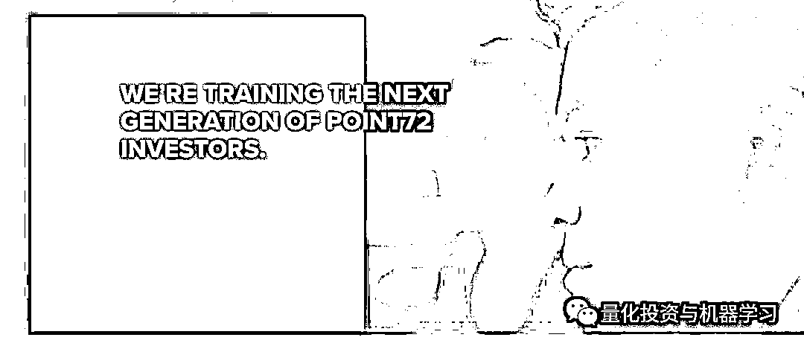

# 全球顶尖对冲基金挖人大战，亚洲开抢！

> 原文：[`mp.weixin.qq.com/s?__biz=MzAxNTc0Mjg0Mg==&mid=2653295154&idx=1&sn=669389cdeb0a47dde1cc0a7748c4f33b&chksm=802dd027b75a59314874ee06b411f632e8f6ce6d6e31572008ec7ca963cf3d0e2e1adb0f774c&scene=27#wechat_redirect`](http://mp.weixin.qq.com/s?__biz=MzAxNTc0Mjg0Mg==&mid=2653295154&idx=1&sn=669389cdeb0a47dde1cc0a7748c4f33b&chksm=802dd027b75a59314874ee06b411f632e8f6ce6d6e31572008ec7ca963cf3d0e2e1adb0f774c&scene=27#wechat_redirect)


**标星★公众号     **爱你们♥   

作者：Bei Hu、1+1=6

**近期原创文章：**

## ♥ [5 种机器学习算法在预测股价的应用（代码+数据）](https://mp.weixin.qq.com/s?__biz=MzAxNTc0Mjg0Mg==&mid=2653290588&idx=1&sn=1d0409ad212ea8627e5d5cedf61953ac&chksm=802dc249b75a4b5fa245433320a4cc9da1a2cceb22df6fb1a28e5b94ff038319ae4e7ec6941f&token=1298662931&lang=zh_CN&scene=21#wechat_redirect)

## ♥ [Two Sigma 用新闻来预测股价走势，带你吊打 Kaggle](https://mp.weixin.qq.com/s?__biz=MzAxNTc0Mjg0Mg==&mid=2653290456&idx=1&sn=b8d2d8febc599742e43ea48e3c249323&chksm=802e3dcdb759b4db9279c689202101b6b154fb118a1c1be12b52e522e1a1d7944858dbd6637e&token=1330520237&lang=zh_CN&scene=21#wechat_redirect)

## ♥ 2 万字干货：[利用深度学习最新前沿预测股价走势](https://mp.weixin.qq.com/s?__biz=MzAxNTc0Mjg0Mg==&mid=2653290080&idx=1&sn=06c50cefe78a7b24c64c4fdb9739c7f3&chksm=802e3c75b759b563c01495d16a638a56ac7305fc324ee4917fd76c648f670b7f7276826bdaa8&token=770078636&lang=zh_CN&scene=21#wechat_redirect)

## ♥ [机器学习在量化金融领域的误用！](http://mp.weixin.qq.com/s?__biz=MzAxNTc0Mjg0Mg==&mid=2653292984&idx=1&sn=3e7efe9fe9452c4a5492d2175b4159ef&chksm=802dcbadb75a42bbdce895c49070c3f552dc8c983afce5eeac5d7c25974b7753e670a0162c89&scene=21#wechat_redirect)

## ♥ [基于 RNN 和 LSTM 的股市预测方法](https://mp.weixin.qq.com/s?__biz=MzAxNTc0Mjg0Mg==&mid=2653290481&idx=1&sn=f7360ea8554cc4f86fcc71315176b093&chksm=802e3de4b759b4f2235a0aeabb6e76b3e101ff09b9a2aa6fa67e6e824fc4274f68f4ae51af95&token=1865137106&lang=zh_CN&scene=21#wechat_redirect)

## ♥ [如何鉴别那些用深度学习预测股价的花哨模型？](https://mp.weixin.qq.com/s?__biz=MzAxNTc0Mjg0Mg==&mid=2653290132&idx=1&sn=cbf1e2a4526e6e9305a6110c17063f46&chksm=802e3c81b759b597d3dd94b8008e150c90087567904a29c0c4b58d7be220a9ece2008956d5db&token=1266110554&lang=zh_CN&scene=21#wechat_redirect)

## ♥ [优化强化学习 Q-learning 算法进行股市](https://mp.weixin.qq.com/s?__biz=MzAxNTc0Mjg0Mg==&mid=2653290286&idx=1&sn=882d39a18018733b93c8c8eac385b515&chksm=802e3d3bb759b42d1fc849f96bf02ae87edf2eab01b0beecd9340112c7fb06b95cb2246d2429&token=1330520237&lang=zh_CN&scene=21#wechat_redirect)

## ♥ [WorldQuant 101 Alpha、国泰君安 191 Alpha](https://mp.weixin.qq.com/s?__biz=MzAxNTc0Mjg0Mg==&mid=2653290927&idx=1&sn=ecca60811da74967f33a00329a1fe66a&chksm=802dc3bab75a4aac2bb4ccff7010063cc08ef51d0bf3d2f71621cdd6adece11f28133a242a15&token=48775331&lang=zh_CN&scene=21#wechat_redirect)

## ♥ [基于回声状态网络预测股票价格（附代码）](https://mp.weixin.qq.com/s?__biz=MzAxNTc0Mjg0Mg==&mid=2653291171&idx=1&sn=485a35e564b45046ff5a07c42bba1743&chksm=802dc0b6b75a49a07e5b91c512c8575104f777b39d0e1d71cf11881502209dc399fd6f641fb1&token=48775331&lang=zh_CN&scene=21#wechat_redirect)

## ♥ [计量经济学应用投资失败的 7 个原因](https://mp.weixin.qq.com/s?__biz=MzAxNTc0Mjg0Mg==&mid=2653292186&idx=1&sn=87501434ae16f29afffec19a6884ee8d&chksm=802dc48fb75a4d99e0172bf484cdbf6aee86e36a95037847fd9f070cbe7144b4617c2d1b0644&token=48775331&lang=zh_CN&scene=21#wechat_redirect)

## ♥ [配对交易千千万，强化学习最 NB！（文档+代码）](http://mp.weixin.qq.com/s?__biz=MzAxNTc0Mjg0Mg==&mid=2653292915&idx=1&sn=13f4ddebcd209b082697a75544852608&chksm=802dcb66b75a4270ceb19fac90eb2a70dc05f5b6daa295a7d31401aaa8697bbb53f5ff7c05af&scene=21#wechat_redirect)

## ♥ [关于高盛在 Github 开源背后的真相！](https://mp.weixin.qq.com/s?__biz=MzAxNTc0Mjg0Mg==&mid=2653291594&idx=1&sn=7703403c5c537061994396e7e49e7ce5&chksm=802dc65fb75a4f49019cec951ac25d30ec7783738e9640ec108be95335597361c427258f5d5f&token=48775331&lang=zh_CN&scene=21#wechat_redirect)

## ♥ [新一代量化带货王诞生！Oh My God！](https://mp.weixin.qq.com/s?__biz=MzAxNTc0Mjg0Mg==&mid=2653291789&idx=1&sn=e31778d1b9372bc7aa6e57b82a69ec6e&chksm=802dc718b75a4e0ea4c022e70ea53f51c48d102ebf7e54993261619c36f24f3f9a5b63437e9e&token=48775331&lang=zh_CN&scene=21#wechat_redirect)

## ♥ [独家！关于定量/交易求职分享（附真实试题）](https://mp.weixin.qq.com/s?__biz=MzAxNTc0Mjg0Mg==&mid=2653291844&idx=1&sn=3fd8b57d32a0ebd43b17fa68ae954471&chksm=802dc751b75a4e4755fcbb0aa228355cebbbb6d34b292aa25b4f3fbd51013fcf7b17b91ddb71&token=48775331&lang=zh_CN&scene=21#wechat_redirect)

## ♥ [Quant 们的身份危机！](https://mp.weixin.qq.com/s?__biz=MzAxNTc0Mjg0Mg==&mid=2653291856&idx=1&sn=729b657ede2cb50c96e92193ab16102d&chksm=802dc745b75a4e53c5018cc1385214233ec4657a3479cd7193c95aaf65642f5f45fa0e465694&token=48775331&lang=zh_CN&scene=21#wechat_redirect)

## ♥ [AQR 最新研究 | 机器能“学习”金融吗](http://mp.weixin.qq.com/s?__biz=MzAxNTc0Mjg0Mg==&mid=2653292710&idx=1&sn=e5e852de00159a96d5dcc92f349f5b58&chksm=802dcab3b75a43a5492bc98874684081eb5c5666aff32a36a0cdc144d74de0200cc0d997894f&scene=21#wechat_redirect)

**战争起源**

如果你希望 2019 年在 Point72 找到一份工作，你可以通过 Point72 研究员来进行申请。


该项目是 Point72 在日益激烈的人才争夺战中发起的新攻势。

在这里，我们给大家介绍一下 Point72 研究院。



先看看高大上的研究院视频介绍：  

[`mp.weixin.qq.com/mp/readtemplate?t=pages/video_player_tmpl&action=mpvideo&auto=0&vid=wxv_737850546744377346`](https://mp.weixin.qq.com/mp/readtemplate?t=pages/video_player_tmpl&action=mpvideo&auto=0&vid=wxv_737850546744377346)

在 Point72 建立自己的职业生涯，成为一名优秀的投资者。

这个计划分为 5 个阶段：

**▎阶段一：全球案例大赛**

一年一度的全球案例大赛让你有机会与你的团队一起向 Point72 展示你们的投资技巧。你还有机会将获得一次全额费用的旅行，向 Point72 的顶级投资专业人士展示你们的案例。去年还向竞赛获胜者颁发了超过**2.4 万美元的现金和奖品**。


**▎阶段二：学术峰会**

作为峰会的参与者，你将与你的同行、我们的投资组合经理、分析师和学院教师进行小组合作，**学习前所未有的投资方式**。


**▎阶段三：暑期实习项目**

在这 10 周的实习中，你将接受研究院工作人员的培训，**由投资专家指导，并由研究院毕业生指导。**暑期实习项目是 Point72 研究院（全日制）最重要的项目。我们非常谨慎地雇佣每一位暑期实习生，并希望他们中的大多数能在毕业时收到重返 Point72 研究院项目的 offer。2020 年暑期实习申请截止日期为 2019 年 5 月 1 日。


**▎阶段四：金融分析师计划**

学期最后一年的学生被邀请参加为期 10 个月的强化培训项目，旨在教你在 Point72 开始投资生涯所需的技能。你将**花费 2500 多个小时学习创建和完善金融模**型，进行初步研究，准备股票推荐以及有效地传达你的投资理念。


**▎阶段五：开始在 Point72 职业生涯**

Point72 基于你的技能、能力和职业道德，为你提供了一条通往成功职业生涯的清晰道路。如果你在课程中一直表现出色，你将有机会继续留在 Point72 作为投资专业人士。


***An experience like no other***

*“Point72 研究院将帮助你以一种前所未有的方式思考市场。我们将把你对研究和投资的热情转化为你作为 Point72 分析师所需要的技能。”*

Point72 研究院招募和培训大学毕业生，以速成的培训方式将其培养成为多/空股票投资专业人士。在 12 个月的金融分析师课程期间，学院课程学员将花费 2500 多个小时的时间学习创建和完善金融模型，开展初级研究，策划股票建议，并有效地传递其理念。

学院主任 Jaimi Goodfriend 表示，“Point72 学院转变了我们招募和培养青年投资人才的方式。首期学院课程班的才华和成就让我们大吃一惊，坦率来讲，甚至让我们感到汗颜。我们成功地将 2015 届的每位毕业生安置到我们的投资平台上。”

Point72 国际业务首席执行官 Marc Desmidt 表示：“我们可以将 Point72 在美国的投资方式教给青年才俊，并向他们提供直接与所在区域的投资组合经理共事的机会。”


Billions 的原形大佬：科恩

在一开始，研究院更像是一所学校而非实习。最初的几个月实际上花在了课堂上，学习了买方职业生涯所需的所有基础知识：会计，金融建模，业务运营和数据分析等。在课程的第二部分，学生将学习如何利用这些技能来研究公司和股票。学生还将听取目前 Point72 投资专业人士以及沃顿商学院和哈佛商学院的专家意见。该计划的最后三分之一是更多动手实践。

**前 1％**

如果你想参加这个计划，你可能会面临一些激烈的竞争。2015 年，Point72 收到了约 400 份申请人。这个数字今年增加到大约**12k**，这意味着只有不到 1%的才能最终入选。

**战争蔓延**

随着越来越多的大型对冲基金在亚洲的扩张，亚洲地区管理资产的增长速度超过了美国和英国，行业高管们表示：**合格的候选人数量未能跟上。**

如此现状，对冲基金开始从竞争对手那里挖走人才，提高明星员工的薪酬，并向年轻员工投入更多资源。像 Steve Cohen 的 Point72 和 Balyasny Asset Management 这样的公司正在进行着像开头介绍那样的培训项目，希望这些新员工能发展成为忠诚的 Alpha 基金经理。

负责监管 Point72 亚洲股票投资团队的 Howard Man 表示：“在亚太地区，没有那么多现成的、经验丰富的基金经理符合 Point72 的投资风格”。Point72 在该地区为期 10 个月的培训项目是模仿该公司 2015 年引入美国的一个项目，于今年 3 月在香港开设了第一堂课。

**尽管全球对冲基金行业近年来经历了动荡，投资者对高昂的费用和黯淡的回报感到不满，但亚洲已被证明是一个相对的亮点，这要归功于强劲的经济增长和不断扩张的资本市场。**

根据 Eurekahedge Pte 的数据显示，自 2016 年以来，澳大利亚、香港、日本和新加坡的基金管理规模增长了 20%以上，达到了 1920 亿美元，而美国的增幅为 5%，英国为 6%。


数据来自：Eurekahedge

像 Point72 这样的对冲基金，将资金分配给多个基金经理，每个基金经理负责自己所在公司总资产中所占的份额。

近年来的新进入者包括 ExodusPoint Capital Management LP，Schonfeld Strategic Advisors LLC 和 Polymer Capital Management，Polymer Capital Management 由 Point72 前亚洲主管 Angus Wai 创立。该地区目前至少有八家大型对冲基金平台，规模是 2013 年的两倍，管理着全球总计 1000 亿美元的资金。Polymer 是从亚洲竞争对手那里挖来人才的公司之一，同时从从 Point72 和 Izzy Englander 旗下的 Millennium Management LLC 聘请了基金经理。

招聘公司 Michael Page Singapore 的董事总经理 Nilay Khandelwal 说：

**“挑战****不在于找到一位基金经理，而是找到一个既在亚洲工作，又在亚洲投资有一手经验的基金经理”。**

**“任何在这里工作了五年、六年、七年的人都能胜任好的工作，要让他们离开是很困难的”**。


知情人士表示，随着对冲基金提高薪酬以吸引顶级候选人，亚洲的薪酬方案正在增加。求职者现在可以为其薪酬中的业绩部分争取到更有吸引力的条款。绩效部分通常占他们薪酬的大部分，并以投资产生的利润百分比来表示。

知情人士说：

**如果计入业绩奖金，亚洲的****顶级基金经理****每年可以拿到****1500 万- 2000 万美元****；**

**初级基金经理****每年可以拿到****200 万- 300 万美元****。**

亚洲地区的薪酬水平仍可能低于欧洲和美国，但猎头公司 principal Partners Pte 驻美国的董事总经理 Will Tan 说，这是因为驻亚洲的基金经理通常管理的资产较少，在美国，大型基金的明星经理在好的行情中可以赚到 5000 万美元以上。

**在 Point72，亚洲的招聘工作很早就开始了**。在香港大学和新加坡国立大学等，培训为期 10 周的夏季实习学生。参与者在美国待四个月，然后返回亚洲接受四个月的培训，然后与基金经理进行轮换。

Point72 亚太研究院院长 Jahanzeb Naseer 表示：“如果有人刚刚在美国做过金融方面的工作，而你要求他们覆盖亚洲市场，那将是一个漫长的学习过程”。“你需要了解中国，泰国，印度尼西亚等 13 个市场”。

通常在对冲基金的道路上，从初级分析师到完全成熟的投基金经理，可能需要 10 年以上的时间。这是一个漫长而不确定的回报期，**但像 Point72 这样的公司，却很愿意把资源投入到他们认为有巨大增长潜力的地方。**

Point72 的国际业务负责人 Marc Desmidt 表示：**“我们发现这个生态系统还很年轻，我们必须采取双管齐下的策略——在招人的同时发展自己人才储备的队伍”。**

**国内量化私募反思**

公众号觉得这句话也同样适用于国内的对冲基金公司（私募）。国内量化圈就这么大，优质人才也就那么多。除了海外，**公司通过猎头、招聘机构招人的同时，如果能像 Point72 那样，花精力、花时间、花血本在学生力量中培养自己的人才储备队伍，从长远来看，不比花很多钱请一个优秀基金经理的差。**

从这点来说，国内的九坤做的不错！还有就是 WorldQuant···

可能很多人会觉得，我辛辛苦苦培养的人才却被别的公司挖走了。其实不然，如果我们能够像 Point72 一样，**有****完整的培训体系、明确的筛选机制、丰厚的奖励等等**。大多数人才还是很愿意为你的公司效劳，因为他们在这个过程能感受到**公司专业的研究能力、培训项目的深度广度，还有你们对待人才的诚意！**

如果没想好或者不愿意付出就不要做！不然最后会变得特别 low，被网友调侃为”骗策略“、”割韭菜“等这种 level。

**眼前利益固然好，但若从长远利益来看，它会让你持久拥有更多的利益！**

希望国内量化机构能够以此为鉴，祝越来越好！ 

```py
*—End—*

量化投资与机器学习微信公众号，是业内垂直于**Quant**、**MFE**、**CST、AI**等专业的**主****流量化自媒体**。公众号拥有来自**公募、私募、券商、银行、海外**等众多圈内**18W+**关注者。每日发布行业前沿研究成果和最新量化资讯。

你点的每个“在看”，都是对我们最大的鼓励

```