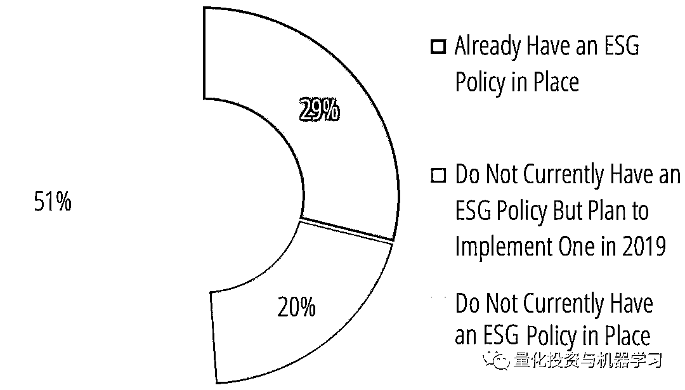

# AQR：这才是 ESG 对投资组合的真正作用！

> 原文：[`mp.weixin.qq.com/s?__biz=MzAxNTc0Mjg0Mg==&mid=2653295106&idx=1&sn=1e88c88f5cdca9414193ffbd92efb2d4&chksm=802dd017b75a590188d14218a09cd988b03417ad64935e67f0d0124ccdd7bef016df8e3f1c34&scene=27#wechat_redirect`](http://mp.weixin.qq.com/s?__biz=MzAxNTc0Mjg0Mg==&mid=2653295106&idx=1&sn=1e88c88f5cdca9414193ffbd92efb2d4&chksm=802dd017b75a590188d14218a09cd988b03417ad64935e67f0d0124ccdd7bef016df8e3f1c34&scene=27#wechat_redirect)

**标星★公众号     **爱你们♥   

公众号海外部报道

作者：Amy Whyte

**近期原创文章：**

## ♥ [5 种机器学习算法在预测股价的应用（代码+数据）](https://mp.weixin.qq.com/s?__biz=MzAxNTc0Mjg0Mg==&mid=2653290588&idx=1&sn=1d0409ad212ea8627e5d5cedf61953ac&chksm=802dc249b75a4b5fa245433320a4cc9da1a2cceb22df6fb1a28e5b94ff038319ae4e7ec6941f&token=1298662931&lang=zh_CN&scene=21#wechat_redirect)

## ♥ [Two Sigma 用新闻来预测股价走势，带你吊打 Kaggle](https://mp.weixin.qq.com/s?__biz=MzAxNTc0Mjg0Mg==&mid=2653290456&idx=1&sn=b8d2d8febc599742e43ea48e3c249323&chksm=802e3dcdb759b4db9279c689202101b6b154fb118a1c1be12b52e522e1a1d7944858dbd6637e&token=1330520237&lang=zh_CN&scene=21#wechat_redirect)

## ♥ 2 万字干货：[利用深度学习最新前沿预测股价走势](https://mp.weixin.qq.com/s?__biz=MzAxNTc0Mjg0Mg==&mid=2653290080&idx=1&sn=06c50cefe78a7b24c64c4fdb9739c7f3&chksm=802e3c75b759b563c01495d16a638a56ac7305fc324ee4917fd76c648f670b7f7276826bdaa8&token=770078636&lang=zh_CN&scene=21#wechat_redirect)

## ♥ [机器学习在量化金融领域的误用！](http://mp.weixin.qq.com/s?__biz=MzAxNTc0Mjg0Mg==&mid=2653292984&idx=1&sn=3e7efe9fe9452c4a5492d2175b4159ef&chksm=802dcbadb75a42bbdce895c49070c3f552dc8c983afce5eeac5d7c25974b7753e670a0162c89&scene=21#wechat_redirect)

## ♥ [基于 RNN 和 LSTM 的股市预测方法](https://mp.weixin.qq.com/s?__biz=MzAxNTc0Mjg0Mg==&mid=2653290481&idx=1&sn=f7360ea8554cc4f86fcc71315176b093&chksm=802e3de4b759b4f2235a0aeabb6e76b3e101ff09b9a2aa6fa67e6e824fc4274f68f4ae51af95&token=1865137106&lang=zh_CN&scene=21#wechat_redirect)

## ♥ [如何鉴别那些用深度学习预测股价的花哨模型？](https://mp.weixin.qq.com/s?__biz=MzAxNTc0Mjg0Mg==&mid=2653290132&idx=1&sn=cbf1e2a4526e6e9305a6110c17063f46&chksm=802e3c81b759b597d3dd94b8008e150c90087567904a29c0c4b58d7be220a9ece2008956d5db&token=1266110554&lang=zh_CN&scene=21#wechat_redirect)

## ♥ [优化强化学习 Q-learning 算法进行股市](https://mp.weixin.qq.com/s?__biz=MzAxNTc0Mjg0Mg==&mid=2653290286&idx=1&sn=882d39a18018733b93c8c8eac385b515&chksm=802e3d3bb759b42d1fc849f96bf02ae87edf2eab01b0beecd9340112c7fb06b95cb2246d2429&token=1330520237&lang=zh_CN&scene=21#wechat_redirect)

## ♥ [WorldQuant 101 Alpha、国泰君安 191 Alpha](https://mp.weixin.qq.com/s?__biz=MzAxNTc0Mjg0Mg==&mid=2653290927&idx=1&sn=ecca60811da74967f33a00329a1fe66a&chksm=802dc3bab75a4aac2bb4ccff7010063cc08ef51d0bf3d2f71621cdd6adece11f28133a242a15&token=48775331&lang=zh_CN&scene=21#wechat_redirect)

## ♥ [基于回声状态网络预测股票价格（附代码）](https://mp.weixin.qq.com/s?__biz=MzAxNTc0Mjg0Mg==&mid=2653291171&idx=1&sn=485a35e564b45046ff5a07c42bba1743&chksm=802dc0b6b75a49a07e5b91c512c8575104f777b39d0e1d71cf11881502209dc399fd6f641fb1&token=48775331&lang=zh_CN&scene=21#wechat_redirect)

## ♥ [计量经济学应用投资失败的 7 个原因](https://mp.weixin.qq.com/s?__biz=MzAxNTc0Mjg0Mg==&mid=2653292186&idx=1&sn=87501434ae16f29afffec19a6884ee8d&chksm=802dc48fb75a4d99e0172bf484cdbf6aee86e36a95037847fd9f070cbe7144b4617c2d1b0644&token=48775331&lang=zh_CN&scene=21#wechat_redirect)

## ♥ [配对交易千千万，强化学习最 NB！（文档+代码）](http://mp.weixin.qq.com/s?__biz=MzAxNTc0Mjg0Mg==&mid=2653292915&idx=1&sn=13f4ddebcd209b082697a75544852608&chksm=802dcb66b75a4270ceb19fac90eb2a70dc05f5b6daa295a7d31401aaa8697bbb53f5ff7c05af&scene=21#wechat_redirect)

## ♥ [关于高盛在 Github 开源背后的真相！](https://mp.weixin.qq.com/s?__biz=MzAxNTc0Mjg0Mg==&mid=2653291594&idx=1&sn=7703403c5c537061994396e7e49e7ce5&chksm=802dc65fb75a4f49019cec951ac25d30ec7783738e9640ec108be95335597361c427258f5d5f&token=48775331&lang=zh_CN&scene=21#wechat_redirect)

## ♥ [新一代量化带货王诞生！Oh My God！](https://mp.weixin.qq.com/s?__biz=MzAxNTc0Mjg0Mg==&mid=2653291789&idx=1&sn=e31778d1b9372bc7aa6e57b82a69ec6e&chksm=802dc718b75a4e0ea4c022e70ea53f51c48d102ebf7e54993261619c36f24f3f9a5b63437e9e&token=48775331&lang=zh_CN&scene=21#wechat_redirect)

## ♥ [独家！关于定量/交易求职分享（附真实试题）](https://mp.weixin.qq.com/s?__biz=MzAxNTc0Mjg0Mg==&mid=2653291844&idx=1&sn=3fd8b57d32a0ebd43b17fa68ae954471&chksm=802dc751b75a4e4755fcbb0aa228355cebbbb6d34b292aa25b4f3fbd51013fcf7b17b91ddb71&token=48775331&lang=zh_CN&scene=21#wechat_redirect)

## ♥ [Quant 们的身份危机！](https://mp.weixin.qq.com/s?__biz=MzAxNTc0Mjg0Mg==&mid=2653291856&idx=1&sn=729b657ede2cb50c96e92193ab16102d&chksm=802dc745b75a4e53c5018cc1385214233ec4657a3479cd7193c95aaf65642f5f45fa0e465694&token=48775331&lang=zh_CN&scene=21#wechat_redirect)

## ♥ [AQR 最新研究 | 机器能“学习”金融吗](http://mp.weixin.qq.com/s?__biz=MzAxNTc0Mjg0Mg==&mid=2653292710&idx=1&sn=e5e852de00159a96d5dcc92f349f5b58&chksm=802dcab3b75a43a5492bc98874684081eb5c5666aff32a36a0cdc144d74de0200cc0d997894f&scene=21#wechat_redirect)

**前言**

来自 Preqin 的一份最新报告显示，在 ESG 投资策略方面，对冲基金公司落后于其它另类投资公司。

**什么是 ESG 呢?**

ESG（Environmental, Social and Governance）通常代表环境、社会和公司治理三大因素，是社会责任投资中投资决策的重要考量因子。而社会责任投资选择的投资对象就是除了企业基本面表现外，一般在这三大因素下表现更为优秀的企业。通常而言，ESG 表现更好的企业，在其他条件等同的情境下更受到投资者的欢迎。

接受 Preqin 调查的 65%的对冲基金投资者表示，他们认为 ESG 在未来五年将变得更加重要。相比之下，只有 37%的对冲基金经理说了同样的话。

Preqin 表示，对冲基金公司传统上反对 ESG 投资策略。但 AQR 等大型的基金正越来越多地考虑这个问题。

Preqin 的报告称: “对冲基金的存在是为了在一系列市场和资产类别中产生绝对收益，使用各种工具实现差异化收益流“。该报告指出，出于这些原因，基于 ESG 考虑来限制投资组合可能是一些对冲基金的“诅咒”。

根据 Preqin 的调查，29%的投资者已经为他们的对冲基金投资制定了 ESG 策略，而 20%的投资者计划在 2019 年增加该策略。Preqin 称，仅有 20%的受访对冲基金公司有自己的 ESG 策略，15%的公司计划立即推出相关策略。

相比之下，私募股权行业有 53%的公司已经制定了 ESG 策略，而 15%的公司告诉 Preqin，他们计划在年底前制定相关策略。

报告称：“在接受和采纳 ESG 方面，对冲基金显然还有很长的路要走，才能赶上其它另类资产”。但据 Preqin 说，他们可能想要迎头赶上。

**AQR 的观点**

ESG 策略对投资组合有利吗？还是会拖低收益率？最近，AQR 的三位研究人员给出了答案：  

**这很复杂**

AQR 负责人 Lasse Pedersen 和董事总经理 Shaun Fitzgibbons 和 Lukasz Pomorski 在题为《Responsible Investing: The ESG-Efficient Frontier》的新论文中提出了一个模型，该模型考虑了投资者在环境、社会和公司治理问题上的偏好，平衡了基于 ESG 投资的潜在成本和收益。

**获取论文，见文末**

在模型的开发过程中，他们发现，**虽然一些 ESG 指标可以预测更高的收益，但其他指标会导致更糟糕的业绩，还有一些指标对投资组合的影响似乎可以忽略不计。**

Pedersen、Fitzgibbons 和 Pomorski 写道：“我们认为，如果 ESG 是未来公司利润的正向预测因子，那么 ESG 也是一个正向预测因子，只要 ESG 的价值没有完全在市场中定价”。“此外，该模型预测，当大多数投资者看到 ESG 的价值时，ESG 会成为一个中性的预测指标，甚至出现反转迹象，当投资者愿意为更负责任的股票接受更低的收益率时，ESG 会成为收益的一个负面预测指标，这种关系可能会减弱”。

例如，良好的公司治理被发现是预测未来盈利能力的积极因素。虽然 AQR 的研究人员指出，投资者对这类股票的需求已经增加，但他们说，良好治理公司的股票还没有达到让它们变得更贵的地步。相反，这些股票的估值“相对较低”，随后表现出显著的正异常收益。

另一方面，所谓的“罪恶股票”——酒精、烟草和博彩公司与非罪恶股票有着类似的盈利前景，但投资者对它们的需求要少得多，这导致它们的估值更低。

总体而言，**AQR 研究人员的模型确定，ESG 对投资业绩的影响取决于市场总体上对 ESG 信息的利用程度****。当大多数投资者忽视环境、社会和治理方面的考虑时，ESG 就是 Alpha 的来源。但随着越来越多的投资者利用 ESG 信息，这种 Alpha 值就会降低。**

作者写道：“投资者哄抬高 ESG 股票的价格，以准确反映他们的预期利润，从而消除了 ESG 与预期收益之间的联”。

ESG 的影响还取决于投资者如何执行他们的环境、社会和治理策略。例如，长期以来，Negative screens 与较低的预期性能相关——AQR 的研究证实了这一结果。作者指出：“约束降低了投资组合的预期表现”。

有趣的是，作者们发现，如果投资者为了最高的夏普比而优化他们的投资组合，那么这些 Negative screens 不仅会影响业绩，还会降低投资组合的 ESG 总分。

“低 ESG 资产可能是对高 ESG 资产的有用的对冲工具，并可能帮助投资者改善整体投资组合的夏普比，潜在地通过增加他们对高 ESG 证券的投资”。作者解释道：“通过筛选，投资者可以最佳地选择那些在高 ESG 资产中不占很大头寸的投资组合”。

与此同时，AQR 研究人员考虑的另外两个 ESG 指标（carbon output and ESG scores produced by MSCI）与公司基本面或随后的投资收益没有任何相关性。

作者写道：“投资者，尤其是养老基金等机构，希望拥有道德高尚的公司，以一种神圣的努力促进良好的企业行为，同时希望以一种不牺牲投资者收益的无愧方式做到这一点”。“投资者必须现实地评估负责任投资的成本和收益，我们希望我们的框架将是一种有用的方式来概念化和量化这些成本和收益”。

**获取论文**

在**后台**输入（严格大小写）

***AQR_ESG_QIML***

*—End—*

量化投资与机器学习微信公众号，是业内垂直于**Quant**、**MFE**、**CST、AI**等专业的**主****流量化自媒体**。公众号拥有来自**公募、私募、券商、银行、海外**等众多圈内**18W+**关注者。每日发布行业前沿研究成果和最新量化资讯。

你点的每个“在看”，都是对我们最大的鼓励