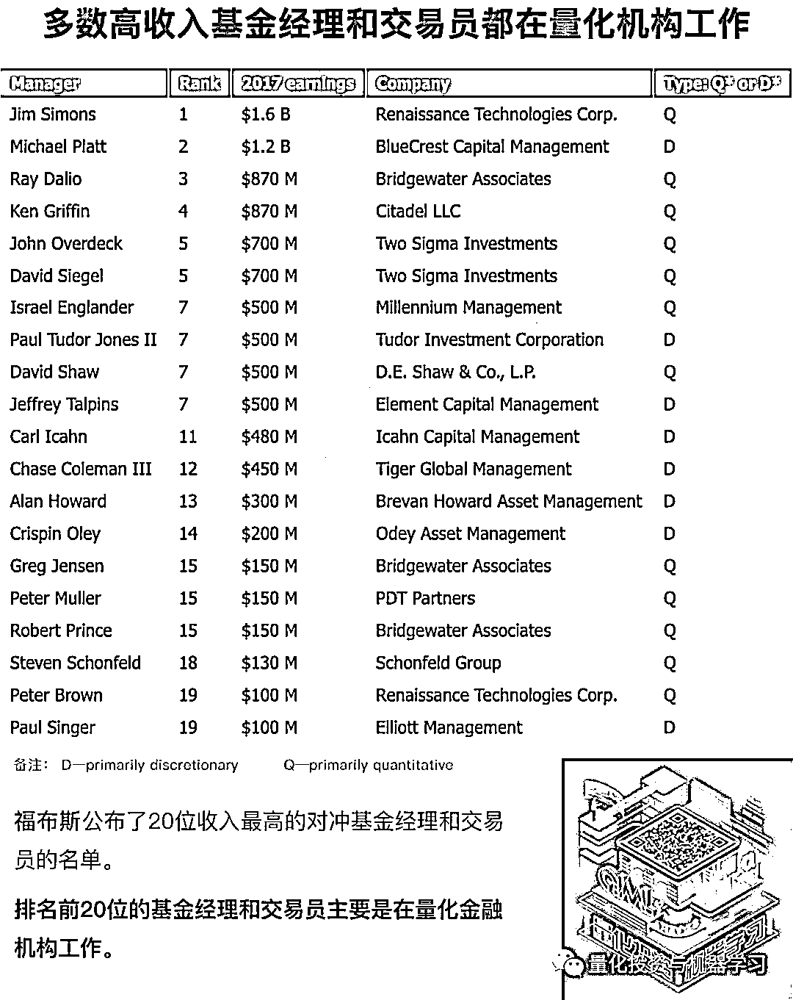
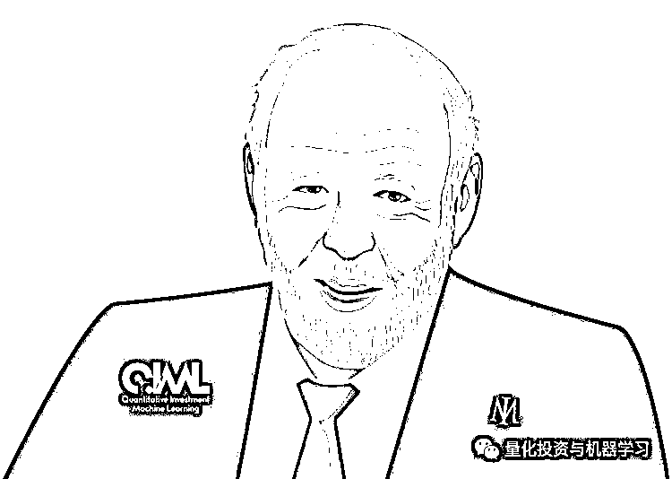
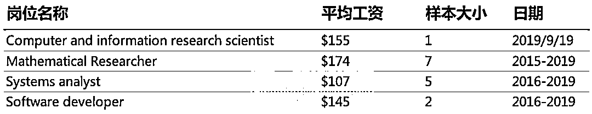

# 想去文艺复兴？看看西蒙斯给你发多少钱！

> 原文：[`mp.weixin.qq.com/s?__biz=MzAxNTc0Mjg0Mg==&mid=2653295088&idx=1&sn=866988471ef6e19cc4375f35f16906fb&chksm=802dd3e5b75a5af3e23ff993be3ca976d4b883182fc576145cb9525fefe783545ab2f7c8aaa9&scene=27#wechat_redirect`](http://mp.weixin.qq.com/s?__biz=MzAxNTc0Mjg0Mg==&mid=2653295088&idx=1&sn=866988471ef6e19cc4375f35f16906fb&chksm=802dd3e5b75a5af3e23ff993be3ca976d4b883182fc576145cb9525fefe783545ab2f7c8aaa9&scene=27#wechat_redirect)

**前言**

根据机构投资者在 4 月份公布的年度收入最高对冲基金经理富豪榜中：文艺复兴科技公司的西蒙斯排名第二，其赚了 15 亿美元，低于 2017 年的 17 亿美元。第一名则是桥水的[***达里奥***](https://mp.weixin.qq.com/s?__biz=MzAxNTc0Mjg0Mg==&mid=2653294948&idx=1&sn=bd2a6b749ed236d7e538a75878a0311d&chksm=802dd371b75a5a67dd473800325a7feb4c742500aa98d034317af84cf758920815b73389bf0e&token=1350979614&lang=zh_CN&scene=21#wechat_redirect)。Citadel 的创始人 Kenneth Griffin 以 8.7 亿美元的收入位居第三，与去年的 14 亿美元持平。  

Two Sigma 的创始人 John Overdeck 和 David Siegel 他们每人赚了 8.2 亿美元。Millennium 的 Israel A. Englander 赚了 7.5 亿美元，Odey Asset Management 的 Crispin Odey 赚了 5.3 亿美元，D.E. Shaw Group 的 David Shaw 赚了 5 亿美元，Tiger Global Management 的 Chase Coleman 赚了 4.65 亿美元。来自 Brevan Howard 的 Alan Howard 以 3.9 亿美元的收入跻身榜单前十名。达里奥的副手格 Greg Jensen 和 Bob Prince 各赚得.25 亿美元，并列第 12 名。排在榜单末尾（第 22 位）的是 Point72 的创始人 Steven A. Cohen（亿万的原形），他赚了 7000 万美元。

另外根据近期福布斯发布的一份排行榜可以看出，大佬还是大佬！

**正文**

**詹姆斯·西蒙斯（ James Simons，1938 年－）是美国的数学家、投资家和慈善家。作为最伟大的对冲基金经理之一，他是量化投资界的传奇人物！**

****

**2017 年，西蒙斯的平均工资为 ****每小时 18.4 万美元**。该基金的许多量化研究员一年挣的钱还不够这个数字，至少在薪水方面是这样。

下图显示了文艺复兴以 H1B 签证向其 East Setauket New York 办事处聘用的量化分析师和工程师支付的薪资（单位为 K）。**文艺复兴以只雇佣少数精英研究人员而闻名**，但与以往的 H1B 薪酬数据一样，这只是一个小样本，它反映了仅向非美国研究人员支付的薪酬数额（在美国工作的公民）。

数据表明，文艺复兴是很多对冲基金中薪酬最高的机构之一。然而，值得注意的是，**工资并不是大多数人为西蒙斯工作的原因。****真正的吸引力是他们向 Medallion 基金投资的机会**，该基金只对员工开放，自 1988 年成立以来，**每年的回报率约为****40%****。**

**2019 年公众号年度巨献**

**内容概要**  

*   **对商业的兴趣**

*   **其他概括**

*   **为什么去石溪大学数学系？**

*   **为什么开始从事货币交易？**

*   **关于大奖章基金**

*   **文艺复兴办公环境介绍**

*   **如何管理你的团队 ？**

*   **如何保持在业绩上的长青？**

*   **2008 金融危机**

*   **问答环节（12 个问题）**

**▼▼▼点击阅读▼▼▼**

*—End—*

量化投资与机器学习微信公众号，是业内垂直于**Quant**、**MFE**、**CST、AI**等专业的**主****流量化自媒体**。公众号拥有来自**公募、私募、券商、银行、海外**等众多圈内**18W+**关注者。每日发布行业前沿研究成果和最新量化资讯。你点的每个“在看”，都是对我们最大的鼓励