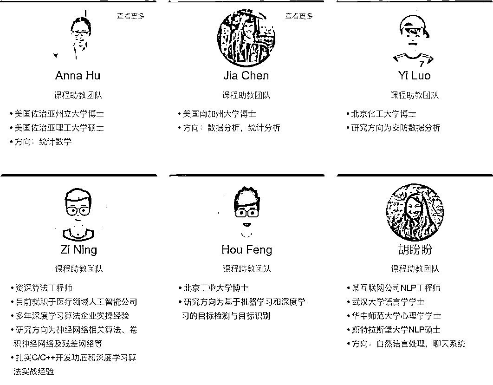
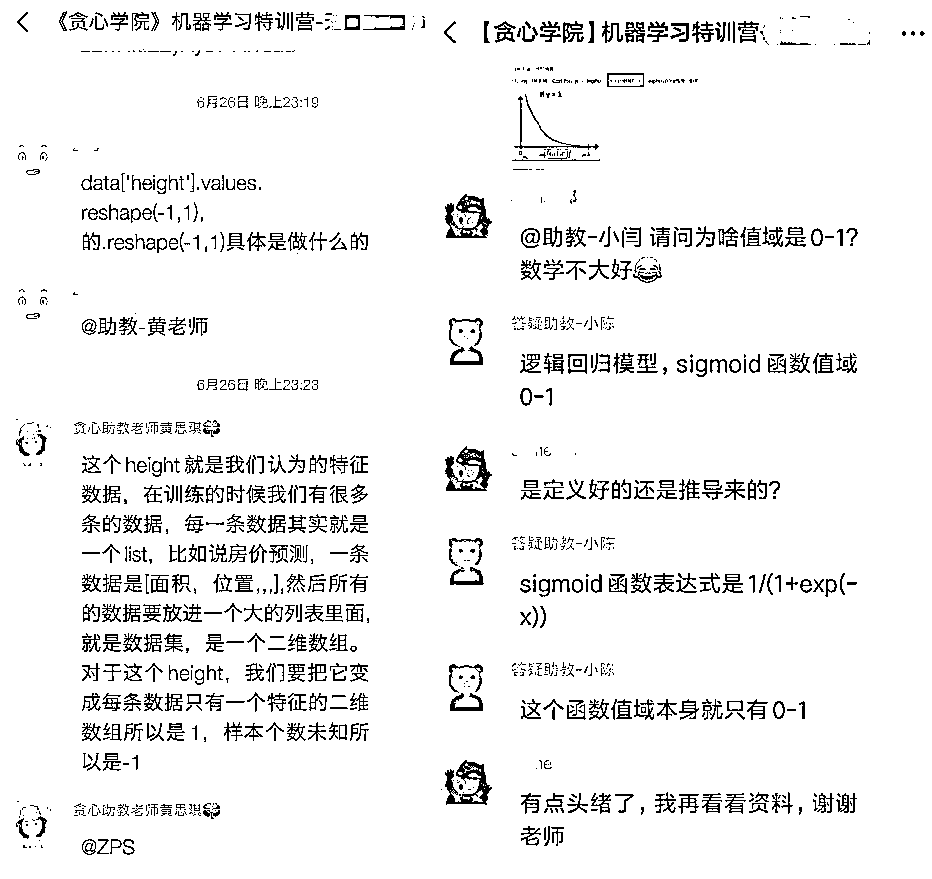

# 掌握“机器学习”，这可能是比啃西瓜书更高效的方法！

> 原文：[`mp.weixin.qq.com/s?__biz=MzAxNTc0Mjg0Mg==&mid=2653295076&idx=1&sn=c012dd8fbc8b45cab0887459f5e5b92a&chksm=802dd3f1b75a5ae7d5a3bfef91edecfd11dceb01c18f2b21e1953ef24eb2bb505e059c48d7dd&scene=27#wechat_redirect`](http://mp.weixin.qq.com/s?__biz=MzAxNTc0Mjg0Mg==&mid=2653295076&idx=1&sn=c012dd8fbc8b45cab0887459f5e5b92a&chksm=802dd3f1b75a5ae7d5a3bfef91edecfd11dceb01c18f2b21e1953ef24eb2bb505e059c48d7dd&scene=27#wechat_redirect)

相信很多朋友对机器学习算法都有所了解，有尝试学习并利用机器学习算法以及工具做一些 AI 产品！但是仅仅停留在“调包”的阶段。想去深入理解一些算法的核心内涵却被 XGBoost | GBDT 等算法劝退了！ 

为了帮助大家扎实机器学习算法基础并熟练应用，重磅推荐一款**交互式机器学习实战课程，**涵盖**16 大机器学习算法**，**20+案例讲解**，**9 大项目实操**。

今日开课，限**100 个**体验名额

具备 Python 基础即可学习，课程通过 5 步教学法，真正的掌握每个算法的核心，每个算法会从原理讲解到实现该的详细算法推导。结合算法在企业中的应用，进行实战练习。

**十六大经典算法**

| K-NN 最近邻 | 线性回归 | 逻辑回归 |

| 凸优化 | 朴素贝叶斯 | 支持向量机 |

| 决策树 | 随机森林 | GBDT | 

| XGBoost | 矩阵分解 | K-Means | 

| GMM | 主题模型 | EM | 聚类 | PCA | 

**项目作业实操**没有项目练手，看这里！课程里的所涉及的项目，均是针对每个算法的高阶应用来展开的。增强算法掌握的同时，项目的成果可直接应用于工作中。  

**20 个项目讲解**

回归分析身高预测  

利用 KNN 筛选简历

二手车价格预估

量化投资之股票价格预测

预测广告点击率

利用 L1 正则模拟神经科学中的稀疏性

垃圾邮件分类

员工离职率预测

基于随机森林的疾病分析

利用 GBDT 解决搜索中的排序问题

人脸识别

基于聚类的消费群分类

内容推荐算法的电影推荐引擎

基于协同过滤算法的音乐推荐引擎

搭建 OCR 识别引擎

利用聚类算法压缩图片

基于主题模型和 SVM 的文本分类

问答系统搭建

利用 kemel SVM 识别医疗图片

利用聚类算法压缩图片

从零搭建方向传播算法

**学习收获**

收获成为出众算法工程师的四大技能

*   ****知识****：理解算法背后的原理以及算法之间的内在关联。

*   ****实战****：学会如何把学到的原理应用在实际的工作当中。

*   ****逻辑****：培养举一反三能力，解决问题能力，并提升逻辑思考能力。

*   ****业务****：广泛接触行业中的经典的案例，加深对业务的理解。

**适合人群**

*   ****互联网从业者：****想了解机器学习并在日常工作中加以应用。

*   **IT 从业者：**希望入门机器学习，并且能够把技术应用到自身的 AI 场景。

*   **在校学生：**想深入理解机器学习技术、或者之后想从事 AI 相关的岗位。

*   **AI 从业者：**很喜欢机器学习，也有一定的经验，希望根据业务场景能够在模型上做一些创新、以及有能力自己求解出来；

福利来啦！

**今日开课，限****100 个****体验名额**

**试学仅需****8.8 元**

**试学 7 天时间，四章内容包含**

KNN、 KD 树、交叉验证、特征编码、

特征缩放、复杂度分析、降维、

图像识别项目、二手车价格预测项目等

点击下方**阅读原文** 或 **扫描二维码**

加入《机器学习集训营》

**付款之后请添加班主任微信**

**进入专属 VIP 社群，助教老师辅导**

**下面，我来给各位朋友介绍一下这款重磅级产品吧，保证让大家有惊喜。**

****全新学习体验****

****A. 全程手推公式，确保你深入理解算法的核心。****

********

****B. 项目源码均有清晰明了的代码注释，看代码都能上瘾！****

******** 

******C. 对话式学习指导，实时检测所学所得。******

************

******D. 不需要安装任何环境，完全依赖于云端编程。******

************

******E. 项目作业代码审核，老师精心批改，错误纰漏一目了然。******

********

******F. 精心录制的视频讲解******

****视频内容通俗易懂而且保证简洁性，力求做到极致。**用最低的时间成本学会核心知识点！**下面截取了 KNN 算法相关的两个短视频（全部课程拥有几百个视频）****

****样例 1：KNN 算法中 K 值对预测的影响 ****

 ****[`v.qq.com/iframe/preview.html?width=500&height=375&auto=0&vid=f09168jf2oo`](https://v.qq.com/iframe/preview.html?width=500&height=375&auto=0&vid=f09168jf2oo)**** 

****样例 2： 构造 KD 树 (1)****

 ****[`v.qq.com/iframe/preview.html?width=500&height=375&auto=0&vid=q0916f8vkqw`](https://v.qq.com/iframe/preview.html?width=500&height=375&auto=0&vid=q0916f8vkqw)**** 

******G.  更多彩蛋等你发现 ... ******

******课程大纲******

****课程内容由**李文哲博士（美国南加州大学 AI 博士）**亲自操刀设计，目前市面上火爆的[NLP 高阶训练营](https://mp.weixin.qq.com/s?__biz=MzIwMTc4ODE0Mw==&mid=2247499063&idx=1&sn=6cdd135785853779b792e7819de5ab12&scene=21#wechat_redirect)也是来自于李文哲博士。课程内容上涵盖了主流的机器学习算法，由浅入深，非常通俗易懂。以下是课程大纲：****

 ********

******专业的教研团队******

****教研团队均是工业界和学术界的专家，具有丰富的教学经验和实战经验。为内容的专业性和前瞻性保驾护航。**** 

********

******学员的评价******

********

******答疑服务保障******

****1、每位助教老师均有国内外一线 AI 企业从业经验，人工智能专业硕士以上学历。在学习中，除了能得到专业的解答，还可以收获超强的人脉资源。找工作内推都不是事！**** 

********

****2、授课导师+班主任+助教老师全天监督辅导学习，保障每位同学的问题可以及时得到满意的回答。****

******** 

****福利来啦！****

******今日开课，限****100 个****体验名额******

******试学仅需****8.8 元******

******试学 7 天时间，四章内容包含******

****KNN、 KD 树、交叉验证、特征编码、****

****特征缩放、复杂度分析、降维、****

****图像识别项目、二手车价格预测项目等****

****点击下方**阅读原文** 或 **扫描二维码******

****加入《机器学习集训营》****

********

******付款之后请添加班主任微信******

******进入专属 VIP 社群，助教老师辅导******

******我们是谁？**我们是一家专注于人工智能领域的在线教育公司，由一群有情怀的硅谷科学家来创办。我们提供专业的 AI 课程以及每月 4-5 期的免费 AI 类公开课。****