# 无敌了！新闻情绪因子进阶来啦！

> 原文：[`mp.weixin.qq.com/s?__biz=MzAxNTc0Mjg0Mg==&mid=2653295052&idx=1&sn=a6243391f11214e7cdc67fa909776c7a&chksm=802dd3d9b75a5acf66096799085a37e6d8e8af3a124f2bc23a506aa1e9eb4ab1f4b7a4a1e99f&scene=27#wechat_redirect`](http://mp.weixin.qq.com/s?__biz=MzAxNTc0Mjg0Mg==&mid=2653295052&idx=1&sn=a6243391f11214e7cdc67fa909776c7a&chksm=802dd3d9b75a5acf66096799085a37e6d8e8af3a124f2bc23a506aa1e9eb4ab1f4b7a4a1e99f&scene=27#wechat_redirect)

**标星★公众号     **爱你们♥   

**近期原创文章：**

## ♥ [5 种机器学习算法在预测股价的应用（代码+数据）](https://mp.weixin.qq.com/s?__biz=MzAxNTc0Mjg0Mg==&mid=2653290588&idx=1&sn=1d0409ad212ea8627e5d5cedf61953ac&chksm=802dc249b75a4b5fa245433320a4cc9da1a2cceb22df6fb1a28e5b94ff038319ae4e7ec6941f&token=1298662931&lang=zh_CN&scene=21#wechat_redirect)

## ♥ [Two Sigma 用新闻来预测股价走势，带你吊打 Kaggle](https://mp.weixin.qq.com/s?__biz=MzAxNTc0Mjg0Mg==&mid=2653290456&idx=1&sn=b8d2d8febc599742e43ea48e3c249323&chksm=802e3dcdb759b4db9279c689202101b6b154fb118a1c1be12b52e522e1a1d7944858dbd6637e&token=1330520237&lang=zh_CN&scene=21#wechat_redirect)

## ♥ 2 万字干货：[利用深度学习最新前沿预测股价走势](https://mp.weixin.qq.com/s?__biz=MzAxNTc0Mjg0Mg==&mid=2653290080&idx=1&sn=06c50cefe78a7b24c64c4fdb9739c7f3&chksm=802e3c75b759b563c01495d16a638a56ac7305fc324ee4917fd76c648f670b7f7276826bdaa8&token=770078636&lang=zh_CN&scene=21#wechat_redirect)

## ♥ [机器学习在量化金融领域的误用！](http://mp.weixin.qq.com/s?__biz=MzAxNTc0Mjg0Mg==&mid=2653292984&idx=1&sn=3e7efe9fe9452c4a5492d2175b4159ef&chksm=802dcbadb75a42bbdce895c49070c3f552dc8c983afce5eeac5d7c25974b7753e670a0162c89&scene=21#wechat_redirect)

## ♥ [基于 RNN 和 LSTM 的股市预测方法](https://mp.weixin.qq.com/s?__biz=MzAxNTc0Mjg0Mg==&mid=2653290481&idx=1&sn=f7360ea8554cc4f86fcc71315176b093&chksm=802e3de4b759b4f2235a0aeabb6e76b3e101ff09b9a2aa6fa67e6e824fc4274f68f4ae51af95&token=1865137106&lang=zh_CN&scene=21#wechat_redirect)

## ♥ [如何鉴别那些用深度学习预测股价的花哨模型？](https://mp.weixin.qq.com/s?__biz=MzAxNTc0Mjg0Mg==&mid=2653290132&idx=1&sn=cbf1e2a4526e6e9305a6110c17063f46&chksm=802e3c81b759b597d3dd94b8008e150c90087567904a29c0c4b58d7be220a9ece2008956d5db&token=1266110554&lang=zh_CN&scene=21#wechat_redirect)

## ♥ [优化强化学习 Q-learning 算法进行股市](https://mp.weixin.qq.com/s?__biz=MzAxNTc0Mjg0Mg==&mid=2653290286&idx=1&sn=882d39a18018733b93c8c8eac385b515&chksm=802e3d3bb759b42d1fc849f96bf02ae87edf2eab01b0beecd9340112c7fb06b95cb2246d2429&token=1330520237&lang=zh_CN&scene=21#wechat_redirect)

## ♥ [WorldQuant 101 Alpha、国泰君安 191 Alpha](https://mp.weixin.qq.com/s?__biz=MzAxNTc0Mjg0Mg==&mid=2653290927&idx=1&sn=ecca60811da74967f33a00329a1fe66a&chksm=802dc3bab75a4aac2bb4ccff7010063cc08ef51d0bf3d2f71621cdd6adece11f28133a242a15&token=48775331&lang=zh_CN&scene=21#wechat_redirect)

## ♥ [基于回声状态网络预测股票价格（附代码）](https://mp.weixin.qq.com/s?__biz=MzAxNTc0Mjg0Mg==&mid=2653291171&idx=1&sn=485a35e564b45046ff5a07c42bba1743&chksm=802dc0b6b75a49a07e5b91c512c8575104f777b39d0e1d71cf11881502209dc399fd6f641fb1&token=48775331&lang=zh_CN&scene=21#wechat_redirect)

## ♥ [计量经济学应用投资失败的 7 个原因](https://mp.weixin.qq.com/s?__biz=MzAxNTc0Mjg0Mg==&mid=2653292186&idx=1&sn=87501434ae16f29afffec19a6884ee8d&chksm=802dc48fb75a4d99e0172bf484cdbf6aee86e36a95037847fd9f070cbe7144b4617c2d1b0644&token=48775331&lang=zh_CN&scene=21#wechat_redirect)

## ♥ [配对交易千千万，强化学习最 NB！（文档+代码）](http://mp.weixin.qq.com/s?__biz=MzAxNTc0Mjg0Mg==&mid=2653292915&idx=1&sn=13f4ddebcd209b082697a75544852608&chksm=802dcb66b75a4270ceb19fac90eb2a70dc05f5b6daa295a7d31401aaa8697bbb53f5ff7c05af&scene=21#wechat_redirect)

## ♥ [关于高盛在 Github 开源背后的真相！](https://mp.weixin.qq.com/s?__biz=MzAxNTc0Mjg0Mg==&mid=2653291594&idx=1&sn=7703403c5c537061994396e7e49e7ce5&chksm=802dc65fb75a4f49019cec951ac25d30ec7783738e9640ec108be95335597361c427258f5d5f&token=48775331&lang=zh_CN&scene=21#wechat_redirect)

## ♥ [新一代量化带货王诞生！Oh My God！](https://mp.weixin.qq.com/s?__biz=MzAxNTc0Mjg0Mg==&mid=2653291789&idx=1&sn=e31778d1b9372bc7aa6e57b82a69ec6e&chksm=802dc718b75a4e0ea4c022e70ea53f51c48d102ebf7e54993261619c36f24f3f9a5b63437e9e&token=48775331&lang=zh_CN&scene=21#wechat_redirect)

## ♥ [独家！关于定量/交易求职分享（附真实试题）](https://mp.weixin.qq.com/s?__biz=MzAxNTc0Mjg0Mg==&mid=2653291844&idx=1&sn=3fd8b57d32a0ebd43b17fa68ae954471&chksm=802dc751b75a4e4755fcbb0aa228355cebbbb6d34b292aa25b4f3fbd51013fcf7b17b91ddb71&token=48775331&lang=zh_CN&scene=21#wechat_redirect)

## ♥ [Quant 们的身份危机！](https://mp.weixin.qq.com/s?__biz=MzAxNTc0Mjg0Mg==&mid=2653291856&idx=1&sn=729b657ede2cb50c96e92193ab16102d&chksm=802dc745b75a4e53c5018cc1385214233ec4657a3479cd7193c95aaf65642f5f45fa0e465694&token=48775331&lang=zh_CN&scene=21#wechat_redirect)

## ♥ [AQR 最新研究 | 机器能“学习”金融吗](http://mp.weixin.qq.com/s?__biz=MzAxNTc0Mjg0Mg==&mid=2653292710&idx=1&sn=e5e852de00159a96d5dcc92f349f5b58&chksm=802dcab3b75a43a5492bc98874684081eb5c5666aff32a36a0cdc144d74de0200cc0d997894f&scene=21#wechat_redirect)

在上一篇新闻情绪因子推文中：

[***厉害了！新闻情绪因子***](http://mp.weixin.qq.com/s?__biz=MzAxNTc0Mjg0Mg==&mid=2653294929&idx=1&sn=e5c0e1e4243e6c3a358d52530d9e11bf&chksm=802dd344b75a5a52faec363ee80c1a8c338160676806800cd2bc806a65986694a4bf111307f9&scene=21#wechat_redirect)  

我们详细分析对比了采用不同情绪得分计算方法的因子表现。从而得出一个很重要且结论：**即情绪因子构建时应该考虑新闻与股票的相关度即情绪得分的时间衰减**。基于以上的结论，在本篇推文中，我们主要**基于中证 800 指数的成分**股，测试新闻**情绪因子在这些成份股中的具体表现**。报告的第一部分我们会对从各个维度对新闻情绪数据进行统计，第二部分主要对基于日度的新闻情绪因子进行测试及对比。

注：本文数据来自：**数库新闻舆情数****据。**

**新闻数据统计说明**

我们在数库监控的新闻版面中，每天新闻中出现的股票数量平均有 700 只左右，这些股票的总市值占当日 A 股总流通市值的 50%左右。每个月出现在新闻中的股票平均为 3100 只，基本能覆盖 A 股市场上的所有股票。

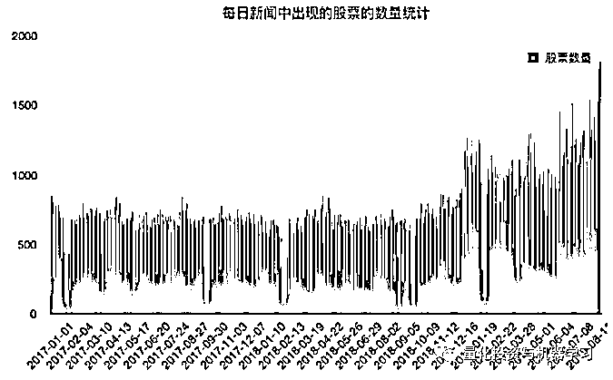

图 1 每日新闻中出现的股票数量

每日股票出现的重复率即今天出现在新闻中的股票在昨天的新闻中也出现过的比例平均为 43%左右。重复率最大的日期出现在 2019 年 8 月 31 日，当天出现在新闻中的股票有 84%在 2019 年 8 月 30 日的新闻中出现过。

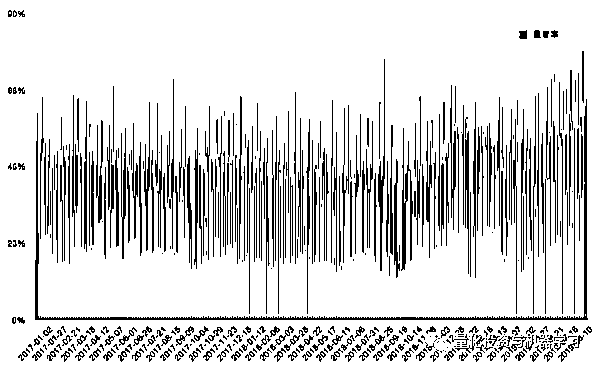

图 2 每日股票与昨日股票的重复率

每日出现在新闻的股票中，平均 52%为沪深 300 的成分股，30%为中证 500 的成分股，40%为中证 800 的成分股（如下图）：

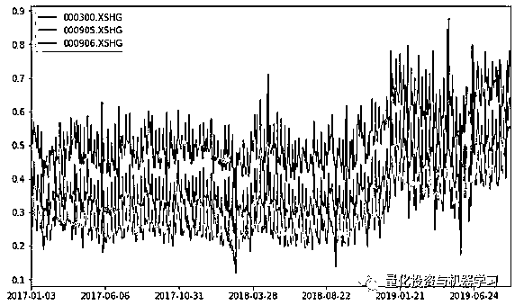

图 3 每日各指数成分股占比

除了以上不同维度的统计数据，还有以下几个数据值得我们关注：

a)   所有情绪数据中，正面情绪占 45%，中性在 40%，负面 15%；

b)   新闻发布高峰在开盘与收盘前后，盘中的新闻占当日所有新闻的 36%左右；

c)   所有情绪数据中，任意类型的情绪，概率大于 80%的数据占所有数据的 70%。

以上统计带我们直观的了解了整个新闻情绪数据集，结合我们上一篇推文，在接下来的部分，我们将要测试新闻情绪数据在中证 800 指数成分股中的因子化应用。**所有的测试都基于开源因子测试工具 Alp****haLens。**

**基于中证 800 的新闻情绪因子的测试对比**

基于第一篇推文的结论，情绪得分因子的计算需要去除中性新闻且要考虑新闻与股票的相关度及情绪得分的时间衰减，我们将计算中证 800 成分股的情绪得分因子。具体的计算逻辑我们将结合 csf_kit 中的样例数据详细说明：

a) 过滤中性情绪：删除数据中情绪类型 senti_type 为 0 的记录。

b)   匹配交易日期：将每天情绪得分记录匹配到对应的交易日期，我们的做法是把 t-1 日 15 点到 t 日 15:00 点的记录对应到 t+1 日（假设是每日汇总得分）。

c)   计算考虑时间衰减的情绪得分, 其中 dt 为新闻发布的时间，T 当前新闻匹配的交易日期与上一个交易日之间的时间间隔：

d)   计算该时间段（比如每日）每只股票在所有新闻中情绪得分（按照步骤 3 计算）的总分或平均分。

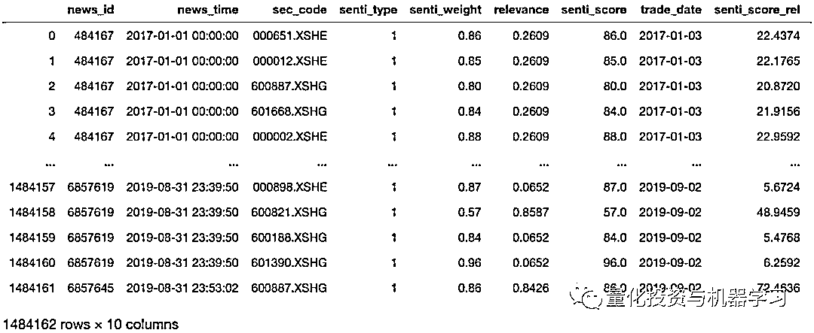

表 1 新闻情绪样例数据

我们将测试基于以上步骤计算的情绪得分平均分因子和情绪得分总分因子，并分别命名为 SENTI_MEAN 和 SENTI_TOTAL。

**1、日度 SENTI_MEAN_1D 因子测试**

SENTI_MEAN_1D 因子计算的是中证 800 成分股每天在不同新闻得分中的平均分。需要说明的是这里的**“一天”并不只日历日中的一天，而是指交易日。也就是说，节假日出现的新闻会加总到其往后最近一个交易日。**

在因子测试过程中，股票分组的方法至关重要，由于情绪因子的数据分布极度不均匀，所以采用等分的方法肯定是不明智的选择，所以在确定分组方法之前，我们有必要对我们的因子数据做一个跟全面的了解。我们按 20 分的区间将因子值的范围[-100,100]划成了 10 个区间，进而观察每个区间出现的股票的数量及收益率表现。基于表 2 及图 4 的数据，我们有以下结论：

a)  市场对于负面事件的反应要大于正面事件，所以极度正面的股票组合（大于 80 分）的收益只有极度负面股票组合（小于-80 分）的四分之一。

b)  70%的股票的得分处于 0-40 分的区间，且这部分股票的平均收益基本为 0。

c)  越靠近得分区间的两端，股票的数量就越少，在考虑可投资性股票的数量时，我们不能只选择处于两端的股票。

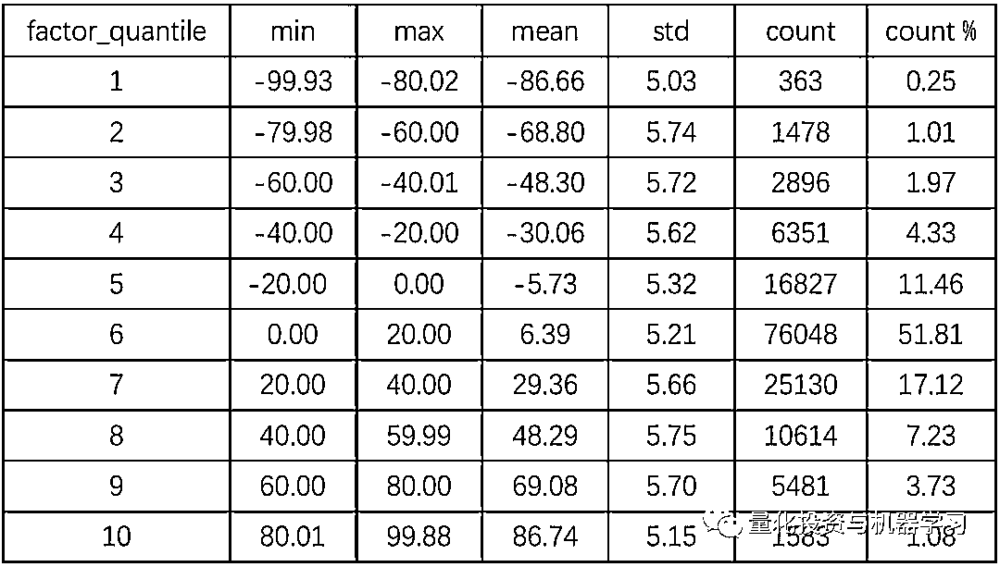

表 2 因子分布统计数据

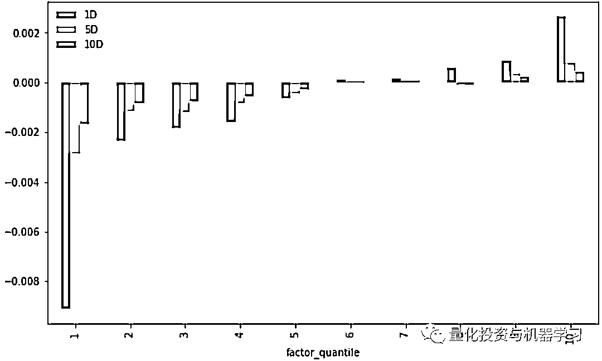

图 4 分组收益率统计

基于以上的结论，我们在进行分组时并没有采用等分的方法，而是采用了以下两种方法：

a)   固定分位数法（SENTI_MEAN_1D/QUANTILE）：

每日按以下分位数区间，[0, 0.05, 0.25, 0.45, 0.75, 0.95, 1.0]，把出现在新闻中的中证 800 成分股分为 6 个组（首尾各占当日总股票数量的 5%）。该方法的好处是股票的数量相对固定。

b)   固定分数区间法（SENTI_MEAN_1D/BIN）：

在尽量考虑了选股数量后，我们确定一个划分的区间[-100，-40，-20，0，40，60，100]。每天将处于同一情绪得分区间的股票合为一组。

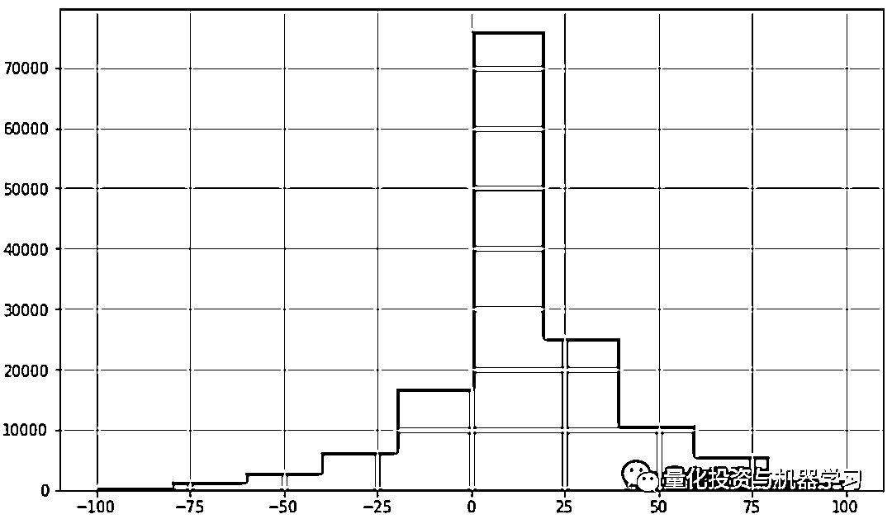

图 5 SENTI_MEAN_1D 的因子值分布（偏度=0.05）

Alphalens 中对因子的收益率测试主要分为两部分，首先是计算因子的收益指标（如表格 3 中 Ann.alpha 及 beta）。此时并不对因子进行分组，以当期的股票构建一个组合，组合中各股票的权重由因子值决定，买入因子为正的股票，卖出因子为负的股票，计算整个样本期间的因子累计收益率（未扣除交易成本）。然后是分组计算各组的平均收益及累计收益，最后是计算 IC 及换手率等指标。

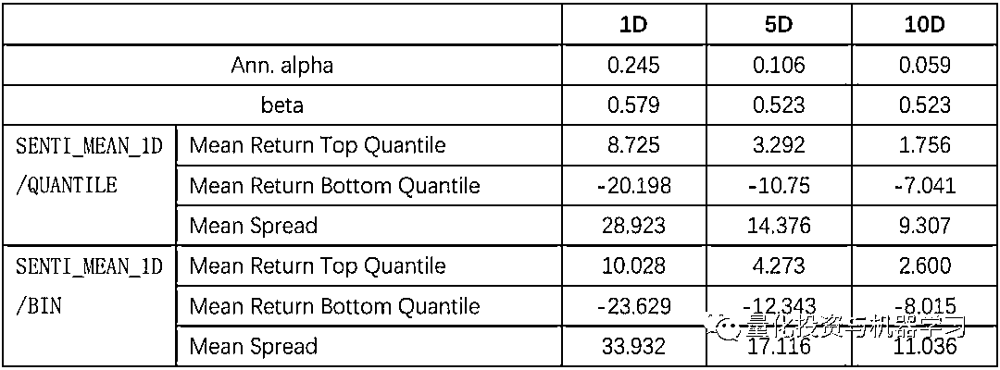

表 3 SENTI_MEAN_1D 因子收益率统计

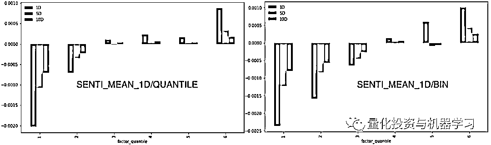

图 6 SENTI_MEAN_1D 分组平均收益

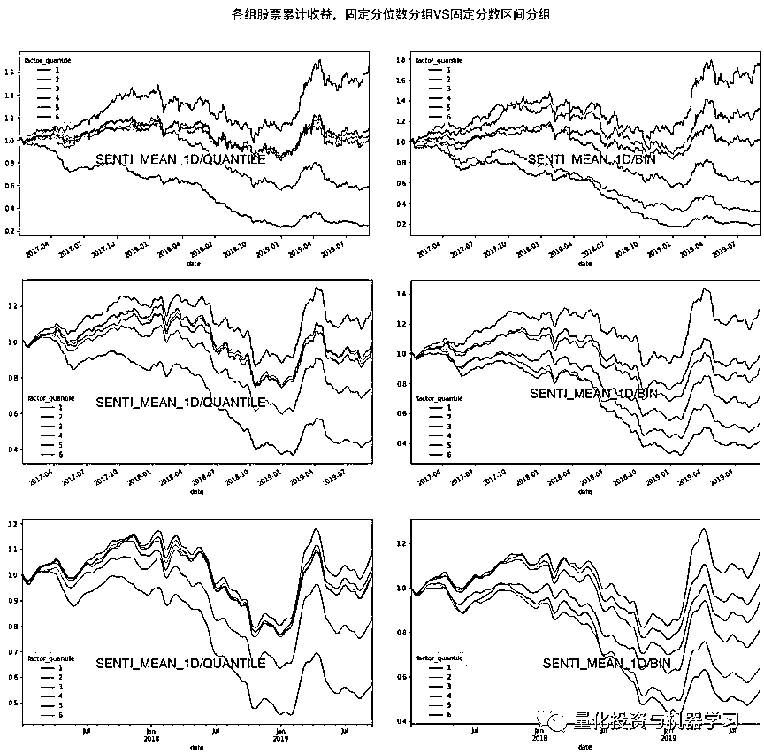

图 7 SENTI_MEAN_1D 分组累计收益

从表格 3 及图 6、图 7 中，我们可以明显的看出，以固定分数区间分组的方式得到的股票组别间的收益分层性更加明显，如图 7 右所示，**无论是持仓期是 1 天、5 天还是 10 天**（分别以蓝色、黄色及绿色的柱状表示），**收益与情绪得分呈严格的单调性，情绪得分越高的股票组，平均收益越高。而且，以固定分数区间法划分的股票组，第一组与最后一组的收益差更大。**

似乎所有数据都在告诉我们，应该采用固定分数区间法给股票分组，因为使用这种方法更能区分股票收益的高低，且头尾股票组的收益差更明显。确实，在以上的分数区间选择是我们考虑到了股票数量的问题。我们知道采用固定了分数的区间，但每天落在每个区间的股票的数量是不一定的，特别是落在首尾区间的股票数量，所以在确定分数区间时要根据自己的策略需求来尝试不同的划分区间进行测试。**再接下来的测试中，如果涉及到分组划分，我们将只采用以固定分数区间[-100，-40，-20，0，40，60，100]划分的方法。**

接下来是信息系数 IC 测试，信息系数反应的是因子值与股票收益率之间的相关性，信息系数越高，说明因子的预测性越好。按照经验值，因子的 IC 大于 3%可以认为该因子是一个有预测性的因子。可是 SENTI_MEAN_1D 的 IC 值只有 0.018（1D）、0.02（5D）及 0.018（10D），是不是说明新闻情绪因子不具有预测性或分层性呢？在上面的收益率测试中，我们发现处于 0-40 分区间的股票的平均收益率基本为 0，考虑到新闻情绪得分因子的特点，这部分股票对我们的因子造成了很大的干扰，所以我们可以尝试把这部分股票去掉，再看一下因子的 IC 值（如图 9），果然不出所望，因子的 IC 值成倍的增加，达到了 4%左右。

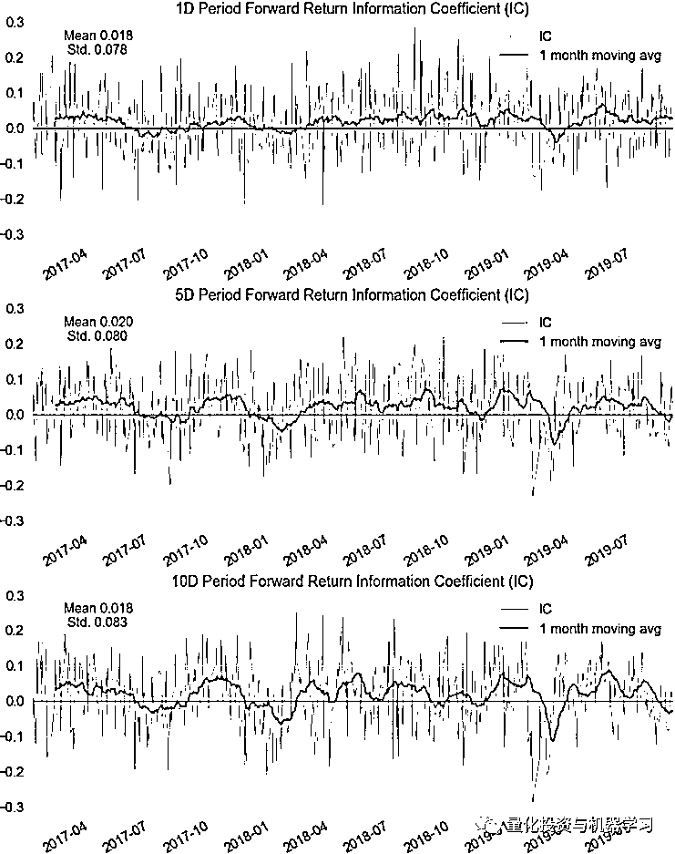

图 8 SENTI_MEAN_1D 因子 IC 序列

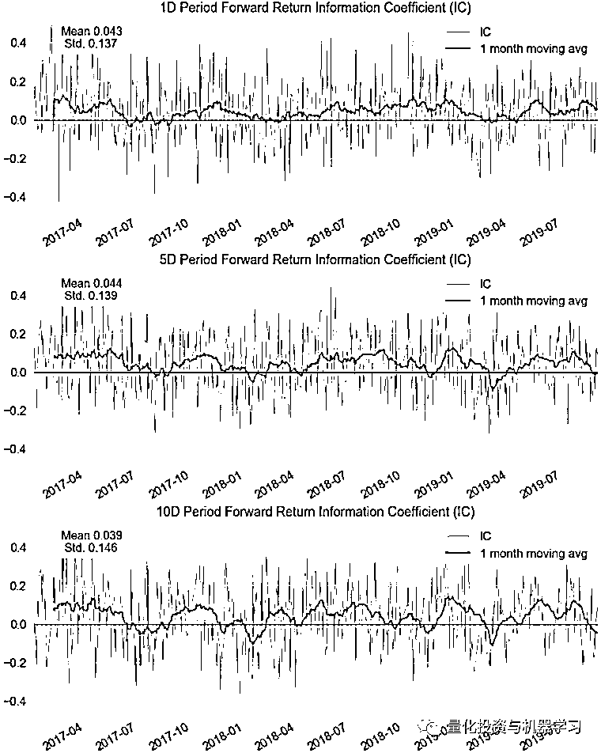

**因子的分层性和预测性固然重要，但最终还是要看交易的可行性，A 股的换仓成本极大的限制了中高频多因子策略的收益，因子的换手率可以直观的反映交易成本**，下表给出了不同调仓周期的各组平均换手率，基本上都在 1 左右，除了占比最大的第四组。

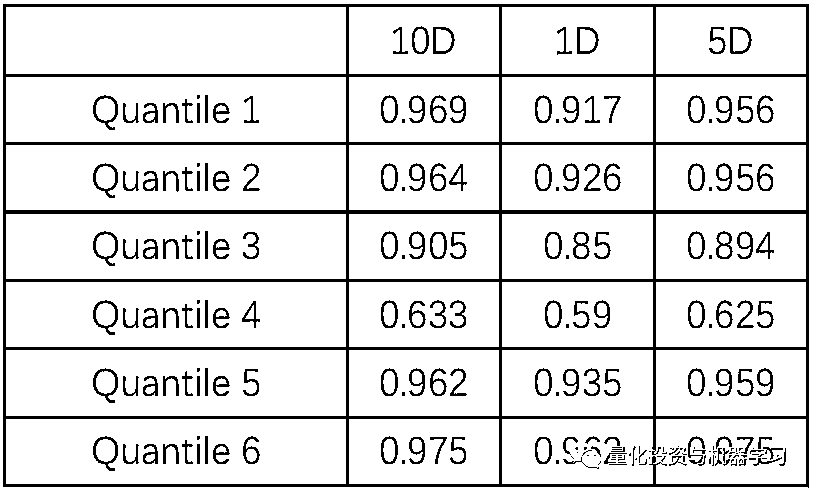

表格 4 SENTI_MEAN_1D 换手率

**2、日度 SENTI_TOT_1D 因子测试及与 SENTI_MEAN_1D 因子的对比**

SENTI_TOT_1D 因子计算的是中证 800 成分股每天在不同新闻得分中的总分，与 SENTI_MEAN_1D 不同的是总分因子考虑了新闻的热度，所以总分因子没有固定的区间，造成了 SENTI_TOT_1D 分布的极度不均匀(如下图所示)。既然没有固定的得分区间，那么用就不适合采用固定分数区间的分组方法。所以我们采用固定分位数法对 SENTI_TOT_1D 进行分组，并命名该因子为 SENTI_TOT_1D/QUANTILE。

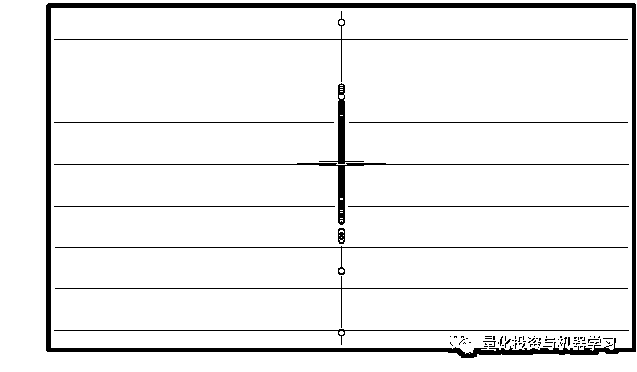

图 9 SENTI_TOT_1D 箱形图

我们对 SENTI_TOT_1D 总分因子与 SENTI_MEAN_1D 平均分因子的相关性进行计算，结果显示这两个因子的平均相关系数达到了 0.92，这与我们的逻辑相符合。**我们认为绝大多数的股票热度相近，总分因子相对于平均分因子的区别就是能够在正负面情绪比较极端的股票中区分出热度比较高的股票**。所以基于这个假设，我们分别用以下三组分位数区间对两个因子进行分组测试及对比，三组分位数比例主要是首尾比例的不同，分别是 1%，5%及 10%：

[0,0.01,0.25,0.45,0.75,0.99,1.0]

[0,0.05,0.25,0.45,0.75,0.95,1.0]

[0,0.10,0.25,0.45,0.75,0.90,1.0]

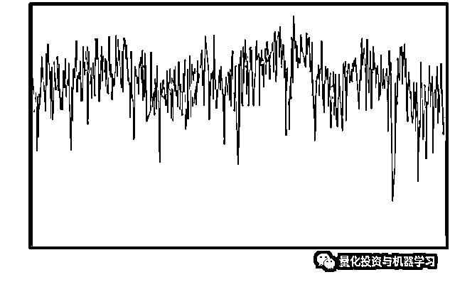

图 10 SENTI_TOT_1D 与 SENTI_MEAN_1D 的相关系数序列

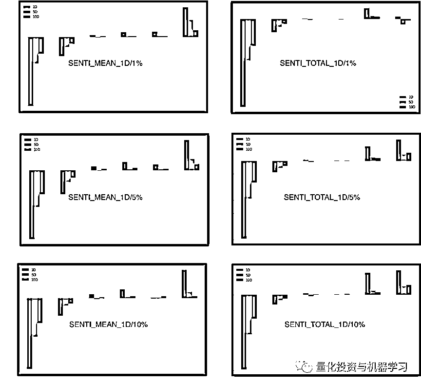

图 11 SENTI_MEAN_1D 与 SENTI_TOT_1D 分组平均收益率对比

图 11 中左边三副图是 SENTI_MEAN_1D 首尾分别取 1%、5%及 10%的分组平均收益，右边是 SENTI_TOT_1D 首尾分别取 1%、5%及 10%的分组平均收益。对比左右两部分，我们可以清楚的发现，在取同样百分比的股票的情况下，总分因子第一组（最负面一组）的收益要明显小于平均分因子，但平均分因子第六组（最正面一组）的收益要明显大于总分因子，也就是说，**热度因素并不能从正面情绪的股票中选出更优的股票，反而在负面情绪的股票中有提升组合表现的效果。**所以我们可以得出以下结论，**热度因子适用于负面股票的增强，在后续的测试中我们讲结合这两个因子构建股票多空组合。**

最后，我们以[0,0.05,0.25,0.45,0.75,0.95,1.0]的分位数区间，测试因子的其他指标，该因子的分组累计收益如下各图所示，全样本股票的因子 IC 值为 0.02 左右，如果去除中间两组平均收益为 0 的股票，IC 值可以上升到 0.037 左右，同样说明总分因子也是在得分靠左右两端时，分层效果比较明显。

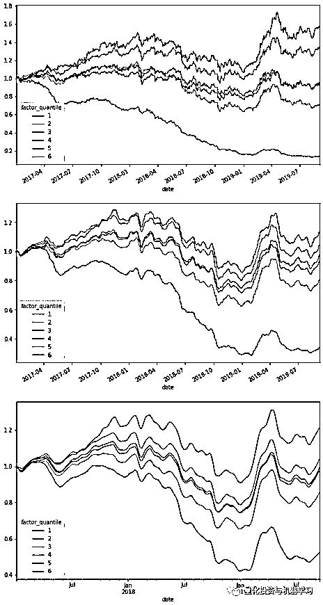

图 12 SENTI_TOT_1D/QUANTILE 分组收益累计

**总结**

本篇推文我们主要测试了日度情绪因子，包括日度情绪平均分因子 SENTI_MEAN_1D 及日度情绪总分因子 SENTI_TOT_1D，并对比了不同分组方法的效果。主要有以下结论：

**1、无论是均分还是总分，情绪因子在两端的分层效果更为明显，当去除得分处于中间 50%的股票时，IC 值明显上升。**

**2、对于平均分因子，由于有固定的分数区间，所以固定分数区间的分组的分层效果要明显好于固定分位数分组的分层效果。**

**3、总分因子更利于筛选出负面情绪的股票，均分因子更利于筛选出正面情绪的股票。**

在后面的推文中，我们将结合总分因子与均分因子各自的优点，并利用开源回测框架 Backtrader 详细回测情绪因子在考虑各交易因素情况下的回测表现。

更多关于数库智能资讯系统的详细介绍，可参考数库智能资讯用户手册及数库 NLP 技术白皮书（**点击阅读原文获取**）。

大家敬请期待啦！

*—End—*

量化投资与机器学习微信公众号，是业内垂直于**Quant**、**MFE**、**CST、AI**等专业的**主****流量化自媒体**。公众号拥有来自**公募、私募、券商、银行、海外**等众多圈内**18W+**关注者。每日发布行业前沿研究成果和最新量化资讯。

你点的每个“在看”，都是对我们最大的鼓励