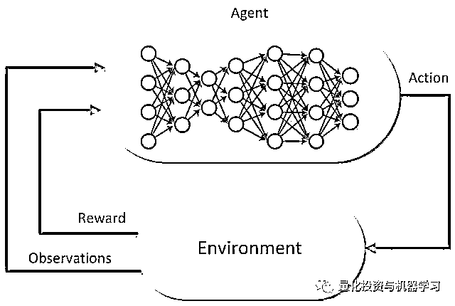

# TensorTrade：基于深度强化学习的 Python 交易框架

> 原文：[`mp.weixin.qq.com/s?__biz=MzAxNTc0Mjg0Mg==&mid=2653295002&idx=1&sn=ce0ec3c2e22e7bd2dd297199225d500a&chksm=802dd38fb75a5a9937a454e9f9d568a19626f62fcc9a820e9f737a143d1c5d0869426bb13e62&scene=27#wechat_redirect`](http://mp.weixin.qq.com/s?__biz=MzAxNTc0Mjg0Mg==&mid=2653295002&idx=1&sn=ce0ec3c2e22e7bd2dd297199225d500a&chksm=802dd38fb75a5a9937a454e9f9d568a19626f62fcc9a820e9f737a143d1c5d0869426bb13e62&scene=27#wechat_redirect)


**标星★公众号     **爱你们♥   

作者：Adam King

编译：1+1=6

**近期原创文章：**

## ♥ [5 种机器学习算法在预测股价的应用（代码+数据）](https://mp.weixin.qq.com/s?__biz=MzAxNTc0Mjg0Mg==&mid=2653290588&idx=1&sn=1d0409ad212ea8627e5d5cedf61953ac&chksm=802dc249b75a4b5fa245433320a4cc9da1a2cceb22df6fb1a28e5b94ff038319ae4e7ec6941f&token=1298662931&lang=zh_CN&scene=21#wechat_redirect)

## ♥ [Two Sigma 用新闻来预测股价走势，带你吊打 Kaggle](https://mp.weixin.qq.com/s?__biz=MzAxNTc0Mjg0Mg==&mid=2653290456&idx=1&sn=b8d2d8febc599742e43ea48e3c249323&chksm=802e3dcdb759b4db9279c689202101b6b154fb118a1c1be12b52e522e1a1d7944858dbd6637e&token=1330520237&lang=zh_CN&scene=21#wechat_redirect)

## ♥ 2 万字干货：[利用深度学习最新前沿预测股价走势](https://mp.weixin.qq.com/s?__biz=MzAxNTc0Mjg0Mg==&mid=2653290080&idx=1&sn=06c50cefe78a7b24c64c4fdb9739c7f3&chksm=802e3c75b759b563c01495d16a638a56ac7305fc324ee4917fd76c648f670b7f7276826bdaa8&token=770078636&lang=zh_CN&scene=21#wechat_redirect)

## ♥ [机器学习在量化金融领域的误用！](http://mp.weixin.qq.com/s?__biz=MzAxNTc0Mjg0Mg==&mid=2653292984&idx=1&sn=3e7efe9fe9452c4a5492d2175b4159ef&chksm=802dcbadb75a42bbdce895c49070c3f552dc8c983afce5eeac5d7c25974b7753e670a0162c89&scene=21#wechat_redirect)

## ♥ [基于 RNN 和 LSTM 的股市预测方法](https://mp.weixin.qq.com/s?__biz=MzAxNTc0Mjg0Mg==&mid=2653290481&idx=1&sn=f7360ea8554cc4f86fcc71315176b093&chksm=802e3de4b759b4f2235a0aeabb6e76b3e101ff09b9a2aa6fa67e6e824fc4274f68f4ae51af95&token=1865137106&lang=zh_CN&scene=21#wechat_redirect)

## ♥ [如何鉴别那些用深度学习预测股价的花哨模型？](https://mp.weixin.qq.com/s?__biz=MzAxNTc0Mjg0Mg==&mid=2653290132&idx=1&sn=cbf1e2a4526e6e9305a6110c17063f46&chksm=802e3c81b759b597d3dd94b8008e150c90087567904a29c0c4b58d7be220a9ece2008956d5db&token=1266110554&lang=zh_CN&scene=21#wechat_redirect)

## ♥ [优化强化学习 Q-learning 算法进行股市](https://mp.weixin.qq.com/s?__biz=MzAxNTc0Mjg0Mg==&mid=2653290286&idx=1&sn=882d39a18018733b93c8c8eac385b515&chksm=802e3d3bb759b42d1fc849f96bf02ae87edf2eab01b0beecd9340112c7fb06b95cb2246d2429&token=1330520237&lang=zh_CN&scene=21#wechat_redirect)

## ♥ [WorldQuant 101 Alpha、国泰君安 191 Alpha](https://mp.weixin.qq.com/s?__biz=MzAxNTc0Mjg0Mg==&mid=2653290927&idx=1&sn=ecca60811da74967f33a00329a1fe66a&chksm=802dc3bab75a4aac2bb4ccff7010063cc08ef51d0bf3d2f71621cdd6adece11f28133a242a15&token=48775331&lang=zh_CN&scene=21#wechat_redirect)

## ♥ [基于回声状态网络预测股票价格（附代码）](https://mp.weixin.qq.com/s?__biz=MzAxNTc0Mjg0Mg==&mid=2653291171&idx=1&sn=485a35e564b45046ff5a07c42bba1743&chksm=802dc0b6b75a49a07e5b91c512c8575104f777b39d0e1d71cf11881502209dc399fd6f641fb1&token=48775331&lang=zh_CN&scene=21#wechat_redirect)

## ♥ [计量经济学应用投资失败的 7 个原因](https://mp.weixin.qq.com/s?__biz=MzAxNTc0Mjg0Mg==&mid=2653292186&idx=1&sn=87501434ae16f29afffec19a6884ee8d&chksm=802dc48fb75a4d99e0172bf484cdbf6aee86e36a95037847fd9f070cbe7144b4617c2d1b0644&token=48775331&lang=zh_CN&scene=21#wechat_redirect)

## ♥ [配对交易千千万，强化学习最 NB！（文档+代码）](http://mp.weixin.qq.com/s?__biz=MzAxNTc0Mjg0Mg==&mid=2653292915&idx=1&sn=13f4ddebcd209b082697a75544852608&chksm=802dcb66b75a4270ceb19fac90eb2a70dc05f5b6daa295a7d31401aaa8697bbb53f5ff7c05af&scene=21#wechat_redirect)

## ♥ [关于高盛在 Github 开源背后的真相！](https://mp.weixin.qq.com/s?__biz=MzAxNTc0Mjg0Mg==&mid=2653291594&idx=1&sn=7703403c5c537061994396e7e49e7ce5&chksm=802dc65fb75a4f49019cec951ac25d30ec7783738e9640ec108be95335597361c427258f5d5f&token=48775331&lang=zh_CN&scene=21#wechat_redirect)

## ♥ [新一代量化带货王诞生！Oh My God！](https://mp.weixin.qq.com/s?__biz=MzAxNTc0Mjg0Mg==&mid=2653291789&idx=1&sn=e31778d1b9372bc7aa6e57b82a69ec6e&chksm=802dc718b75a4e0ea4c022e70ea53f51c48d102ebf7e54993261619c36f24f3f9a5b63437e9e&token=48775331&lang=zh_CN&scene=21#wechat_redirect)

## ♥ [独家！关于定量/交易求职分享（附真实试题）](https://mp.weixin.qq.com/s?__biz=MzAxNTc0Mjg0Mg==&mid=2653291844&idx=1&sn=3fd8b57d32a0ebd43b17fa68ae954471&chksm=802dc751b75a4e4755fcbb0aa228355cebbbb6d34b292aa25b4f3fbd51013fcf7b17b91ddb71&token=48775331&lang=zh_CN&scene=21#wechat_redirect)

## ♥ [Quant 们的身份危机！](https://mp.weixin.qq.com/s?__biz=MzAxNTc0Mjg0Mg==&mid=2653291856&idx=1&sn=729b657ede2cb50c96e92193ab16102d&chksm=802dc745b75a4e53c5018cc1385214233ec4657a3479cd7193c95aaf65642f5f45fa0e465694&token=48775331&lang=zh_CN&scene=21#wechat_redirect)

## ♥ [AQR 最新研究 | 机器能“学习”金融吗](http://mp.weixin.qq.com/s?__biz=MzAxNTc0Mjg0Mg==&mid=2653292710&idx=1&sn=e5e852de00159a96d5dcc92f349f5b58&chksm=802dcab3b75a43a5492bc98874684081eb5c5666aff32a36a0cdc144d74de0200cc0d997894f&scene=21#wechat_redirect)

**前言**

大家可以先阅读我们往期的两篇文章（附代码）：

**必看！**

[**1、用深度强化学习打造不亏钱的交易机器人**](https://mp.weixin.qq.com/s?__biz=MzAxNTc0Mjg0Mg==&mid=2653292021&idx=1&sn=a9cbc37fd50d917df61728eee0a109db&scene=21#wechat_redirect)[**2、使用深度强化学习和贝叶斯优化获得巨额利润**](https://mp.weixin.qq.com/s?__biz=MzAxNTc0Mjg0Mg==&mid=2653292562&idx=1&sn=2c1fcf6183661356daeb8eb20051e5c1&scene=21#wechat_redirect)

互联网上有很多关于强化学习交易系统零零碎碎的东西，但是没有一个是可靠和完整的。出于这个原因，我们决定创建一个开源的 Python 框架，使用深度强化学习，有效地将任何交易策略从想法转化为实际应用。

**Tensortrade**

Tensortrade 是一个开源的 Python 框架，用于使用深度强化学习进行训练、评估和部署稳健的交易策略。该框架的重点是高度可组合性和可扩展性，允许系统在单个 CPU 上从简单的交易策略扩展到在 HPC 机器上运行的复杂投资策略。


https://www.tensortrade.org/en/latest/index.html

在底层，该框架使用现有机器学习库中的许多 API 来维护高质量的数据通道和学习模型。TensorTrade 的主要目标之一是利用 Numpy、Pandas、Gym、Keras 和 Tensorflow 提供现有的工具，实现算法交易策略的快速实验。

框架的每个部分都被分割成可重用的组件，允许你利用社区构建的通用组件，同时保持私有私密性。其目的是使用深度强化学习来简化测试和部署稳健的交易代理过程，使我们能够专注于创建有利可图的策略。

**强化学习回顾**

***Reinforcement learning (RL)*** *is an area of machine learning concerned with how software agents ought to take actions in an environment so as to maximize some notion of cumulative reward.*

每一个强化学习问题开始于一个环境和一个或多个可以与环境交互的 agent。



agent 将首先观察环境，然后构建当前状态和该环境中操作的预期值模型。基于该模型，agent 将采取它认为具有最高期望值的行动。

根据环境中所选择的操作的效果，agent 将获得与该操作的实际值相对应的奖励。然后，通过反复试验（即通过强化学习）的过程，强化学习 agent 可以改进其底层模型，并学会随着时间的推移采取更有价值的行动。

**安装**

**TensorTrade 需要 Python 3.5 或更高版本**，所以请确保在安装该框架之前使用的是有效版本。

```py
pip install tensortrade
```

你还需要安装一些额外的依赖库：**t*ens******orflow、tensorforce、stable-baselines、ccxt、TA-lib、stochastic***等。

```py
pip install tensortrade[tf,tensorforce,baselines,ccxt,talib,fbm]
```

**TensorTrade 组件**

**TensorTrade 是围绕组成交易策略的模块组件构建的**。交易策略将强化学习 agent 与可组合的交易逻辑以 gym 环境的形式结合起来。交易环境由一组模块化组件组成，这些组件可以混合和匹配以创建高度多样化的交易和投资策略。稍后我们将更详细地解释这一点。


就像电子元件一样，TensorTrade 元件的目的是能够根据需要进行匹配。

**交易环境**

交易环境是遵循 OpenAI 的 gym.Env 规范的强化学习环境。这允许我们在我们的交易代理中利用许多现有的强化学习模型。

交易环境是完全可配置的 gym 环境，具有高度可组合的 InstrumentExchange、 FeaturePipeline、 ActionStrategy、RewardStrategy 组件。

*   **InstrumentExchange：**提供观察并执行代理的交易。

*   **FeaturePipeline：**在将 exchange 输出传递给代理之前，FeaturePipeline 可选择将其转换为更有意义的一组特征。

*   **ActionStrategy：**将 agent 的操作转换为可执行的交易。

*   **RewardStrategy：**根据 agent 的表现计算每个时间步骤的奖励。

**如果现在看起来有点复杂，其实不然。这就是它的全部内容，现在只需将这些组件组合成一个完整的环境。**

当调用 TradingEnvironment 的 reset 方法时，所有子组件也将被重置。每个 instrument exchang，FeaturePipeline，transformer，action strategy，和 reward strategy 都会被设置回默认值，为下一面做好准备。

让我们从一个示例环境开始。如前所述，初始化交易环境需要一个 exchang、一个 action strategy 和一个 reward strategy，FeaturePipeline 是可选的。


虽然推荐用例是将交易环境插入到交易策略中，但显然你可以单独使用交易环境，以任何方式使用 gym 环境。

**Instrument Exchanges**

Instrument Exchanges 决定交易环境中可交易工具的范围，在每个时间步上向环境返回观测值，并执行在环境中进行的交易。有两种类型的 Instrument Exchanges：现场和模拟。

实时交易所是由实时定价数据和实时交易执行引擎支持的 InstrumentExchange 实现。例如，CCXTExchange 是一个实时交易所，它能够返回定价数据并在数百个实时加密货币交易所（如 Binance 和 Coinbase）上执行交易。


也有股票和 ETF 交易的交易所，如 RobinhoodExchange 和 InteractiveBrokersExchange。

另一方面，模拟交易所是由模拟定价数据和交易执行支持的 InstrumentExchange 实现。

例如，FBMExchange 是一个模拟交易所，它使用分数布朗运动（FBM）生成定价和成交量数据。由于它的价格是模拟的，所以它执行的交易也必须模拟。该交易所使用一个简单的滑动模型来模拟交易中的价格和交易量的滑动，尽管和 TensorTrade 中的东西几乎一样，这个滑动模型可以很容易地替换为更复杂的东西。


虽然 FBMExchange 使用随机模型生成虚假的价格和交易量数据，但它只是模拟交换的实现。实际上，SimulatedExchange 只需要一个 data_frame 的价格历史记录来生成它的模拟。这个 data_frame 可以由编码的实现（如 FBMExchange）提供，也可以在运行时提供：


**Feature Pipelines**

Feature Pipelines 用于将环境中的观察结果转换为有意义的特征，供 agent 学习。如果将 Pipelines 添加到特定的交换中，则在将观察结果输出到环境之前将通过 FeaturePipeline 传递。例如，在将观察结果返回给 agent 之前，Feature Pipelines 可以将所有的价格值归一化、使时间序列固定、添加移动平均列和删除不必要的列。

Feature Pipelines 可以用任意数量的逗号分隔变压器进行初始化。每个 FeatureTransformer 都需要使用要转换的列集初始化，或者如果没有传递任何内容，则转换所有输入列。

每个 Feature Pipelines 都有一个 transform 方法，该方法将把单个观察结果）一个 pandas.DataFrame）从更大的数据集中转换出来，在内存中保留转换下一 frame 所需的任何状态。由于这个原因，经常需要定期重置 FeatureTransformer。每次 FeaturePipeline 或 InstrumentExchange 时，都会自动执行此操作。

让我们创建一个示例 pipeline 并将其添加到现有的交换器中。


这个 Feature Pipelines 将 0 到 1 之间的价格值归一化，然后添加一些移动平均列，并通过对连续的值进行差分使整个时间序列保持平稳。

**Action Strategies**

Action Strategies 定义环境的操作空间，并将 agent 的操作转换为可执行的交易。例如，如果我们使用一个包含 3 个 Action 的离散操作空间（0 =持有，1 = 100%买入，2 = 100%卖出），我们的学习 agent 不需要知道返回 1 的动作等同于买一个 instrument。相反，我们的 agent 需要知道在特定情况下返回动作 1 的收益，并且可以将 Action 转换为交易的实现细节留给 ActionStrategy。

每个 Action Strategy 都有一个 get_trade 方法，该方法将代理指定的操作转换为一个可执行的 Trade。通常需要在策略中存储额外的状态，例如跟踪当前的交易头寸。每次调用操作策略的 reset 方法时都应该重置此状态，当 TradingEnvironment 交易环境重置时将自动执行此操作。


这种离散 Action Strategy 使用 20 个离散操作，相当于 5 种交易类型（市价买入/卖出，限价买入/卖出，持有）。例如：[0,5,10,15]=持有，1=市场买入 25%，2=市价卖出 25%，3=限价买入 25%，4=限价卖出 25%，6=市价买入 50%，7=市价卖出 50%，等等。

**Reward Strategies**

Reward Strategies 接收每一步进行的交易，并返回一个浮动值，与特定操作的收益相对应。例如，如果采取这一步的行动是卖出，导致正的利润，我们的 Reward Strategies 可以返回一个正数，以奖励更多这样的交易。另一方面，如果这个行为是一个导致损失的卖出行为，那么这个策略可能会得到一个负的收益，以教会 agent 在未来不要再做类似的行为。

此示例算法的一个版本是在 SimpleProfitStrategy 中实现的，但是可以使用更复杂的策略。

每个 Reward Strategies 都有一个 get_reward 方法，该方法在每个时间步骤执行交易，并返回与该行为的值相对应的浮动值。与 Action Strategy 一样，每次调用 Reward Strategies 的 reset 方法时，这个状态都应该被重置，这是在父 TradingEnvironment 被重置时自动完成的。


**学习 Agents**

到目前为止，我们还没有看到深度强化学习框架的“深度”部分。这就是学习 agent 的用武之地。


在每个时间步骤中，agent 将来自环境的观察作为输入，通过其底层模型（大多数情况下是一个神经网络）运行它，并输出要执行的操作。例如，观察到的可能是交易所之前的开盘价、高点、低点和收盘价。学习模型将这些值作为输入，并输出与要采取的操作（如购买入、卖出或持有）相对应的值。

重要的是要记住，学习模型对这些价值所代表的价格或交易没有直觉。相反，该模型只是简单地学习对于特定的输入值或输入值序列输出哪些值，以获得最高的收益。

**Stable Baselines**

在本例中，我们将使用 Stable Baselines 库来为我们的交易策略提供学习 agent，然而，TensorTrade 框架与许多强化学习库兼容，如 Tensorforce、Ray's RLLib、OpenAI's Baselines、Intel's Coach 或 TensorFlow 中的任何东西，如 TF Agents。

**https://stable-baselines.readthedocs.io/en/master/**

**在未来，自定义 TensorTrade 学习 agent 可能会被添加到这个框架中，尽管这个框架的目标是尽可能多地与现有的增强学习库进行互操作，因为在这个领域中有如此多的并行增长。**

**但就目前而言，稳定的 Baselines 简单而强大，足以满足我们的需求。**

****

****Tensorforce****

**快速介绍一下 Tensorforce 库，以展示在增强学习框架之间切换是多么简单。**

****

****交易策略****

**一个交易策略（TradingStrategy）由一个学习 agent 和一个或多个交易环境组成，以调整、训练和评估。如果只提供一个环境，它将用于调优、训练和评估。否则，可能在每个步骤中提供一个单独的环境。**

****

****把它们放在一起****

**现在我们已经了解了构成交易策略的每个组件，让我们构建并评估一个组件。**

**简单回顾一下，交易策略由交易环境和学习 agent 组成。交易环境是一个 gym 环境，它接 InstrumentExchange，ActionStrategy，RewardStrategy 和一个可选的 FeaturePipeline，并返回学习 agent 可以训练和评估的观察和奖励。**

****创建一个环境****

****第一步是使用上面列出的组件创建一个 TradingEnvironment。****

****很简单，现在环境是一个 gym 的环境，可以被任何兼容的交易策略或学习代理使用。****

********

******定义 Agent******

****现在环境已经设置好了，是时候创建我们的学习 agent 了。同样的，我们将会使用 Stable Baselines，但是你可以随意加入任何其他的强化学习代理。****

****因为我们使用的是 StableBaselinesTradingStrategy，所以我们需要做的就是为要训练的底层神经网络提供一个模型类型和一个策略类型。对于本例，我们将使用一个简单的近似策略优化（proximal policy optimization, PPO）模型和一个分层规范化的 LSTM 策略网络。****

********

****有关模型和策略规范的更多示例，请参见 Stable Baselines 文档：****

****https://stable-baselines.readthedocs.io/en/master/****

******训练策略******

****创建我们的交易策略就像插入我们的代理和环境一样简单。****

********

****然后，为了训练策略(即在当前环境中训练 agent)，我们所需要做的就是调用 strategy.run()，其中包含你希望运行的步骤等。****

********

****三小时后，成千上万的声明打印，你会看到你的 agent 做的结果！****

****如果这个反馈循环对你来说有点慢，那么你可以传递一个回调函数来运行，它将在每一集结束时被调用。回调函数将传入一个 data frame，其中包含该事件中 agent 的性能，并期望返回一个 bool。如果是，agent 将继续训练，否则，agent 将停止并返回其整体性能。****

********

******保存和恢复******

****所有的交易策略都能够将它们的代理保存到一个文件中，以便以后恢复。环境没有被保存，因为它没有我们关心的状态。要将我们的 TensorflowTradingStrategy 保存到一个文件中，我们只需要提供文件到我们的策略的路径。****

```py
**`strategy.save_agent(path="../agents/ppo_btc_1h")`**
```

****要从文件中恢复 agent，首先需要实例化我们的策略，然后调用 restore_agent。****

********

****我们的策略现在恢复到以前的状态，准备再次使用。****

******优化策略******

****有时，交易策略需要调整一组超参数或特征，以达到最大的性能。在这种情况下，每个 TradingStrategy 都提供一个可选的可实现调优方法。****

****调整模型类似于训练模型，但是除了调整和保存最佳执行模型的权重和偏差外，该策略还调整和保持生成该模型的超参数。****

********

****在这种情况下，agent 将接受 10 集的训练，每一集都有不同的超参数。最好的集合将保存在策略中，并在任何时间策略中使用。****

******策略评估******

****现在我们已经调整和训练了我们的 agent，是时候看看它表现如何了。为了评估我们的策略在样本外数据上的性能，我们需要在有这些数据支持的新环境上运行它。****

********

****当完成时，strategy.run 返回一个代理性能的 pandas 数据框架，包括代理在每个时间步的净值和余额。****

********

******真实交易******

****一旦你建立了一个有利可图的交易策略，训练了一个 agent 来正确地交易，并确保它对新数据集的泛化能力，剩下要做的就是赚钱。****

****你可能喜欢开始一个策略，并让它无限制地运行，但风险厌恶程度越高，你可以使用 trade_callback，它将在每次策略进行交易时被调用。这个回调函数类似于 episode 回调，它将传入一个包含 agent 的整体性能的 dataframe，并返回一个 bool。如果为 True，agent 将继续交易，否则，agent 将在会话期间停止并返回其性能。****

********

****传递 steps=0 指示策略运行，否则停止。****

****正如你所看到的**，使用简单的组件和深度强化学习来构建复杂的交易策略是非常简单的。**你还在等什么？****

******未来******

****目前，该框架正处于早期阶段。到目前为止，重点是得到一个工作的原型，与所有必要的积累，以创建高利润的策略。下一步是为未来构建一个路线图，并决定哪些即将到来的构建块对社区来说是重要的。****

********

****TensorTrade 是一个强大的框架，能够构建高度模块化、高性能的交易系统。尝试新的交易和投资策略是相当简单和容易的，同时允许你将一种策略的组件利用到另一种策略中。****

******获取代码******

****在**后台**输入（严格大小写）****

*******TensorTrade_ 强化 _ 学习*******

*****—End—*****

****量化投资与机器学习微信公众号，是业内垂直于**Quant**、**MFE**、**CST、AI**等专业的**主****流量化自媒体**。公众号拥有来自**公募、私募、券商、银行、海外**等众多圈内**18W+**关注者。每日发布行业前沿研究成果和最新量化资讯。****

************你点的每个“在看”，都是对我们最大的鼓励****