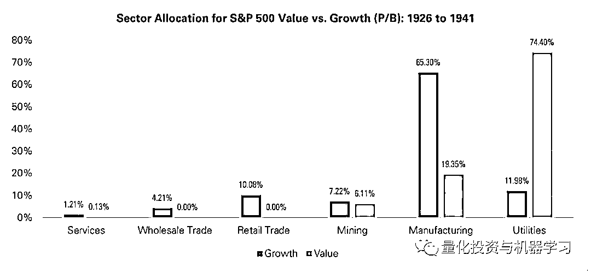
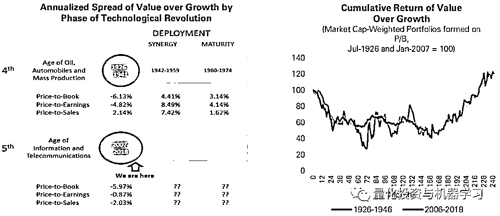

# 价值已死，价值万岁！

> 原文：[`mp.weixin.qq.com/s?__biz=MzAxNTc0Mjg0Mg==&mid=2653294969&idx=1&sn=7253ebf33fcf6e5e6a4a76ab0ff76535&chksm=802dd36cb75a5a7a7a15b6485ef8510be854a6292e19446edf6e2ee088238a295f5f94b18a70&scene=27#wechat_redirect`](http://mp.weixin.qq.com/s?__biz=MzAxNTc0Mjg0Mg==&mid=2653294969&idx=1&sn=7253ebf33fcf6e5e6a4a76ab0ff76535&chksm=802dd36cb75a5a7a7a15b6485ef8510be854a6292e19446edf6e2ee088238a295f5f94b18a70&scene=27#wechat_redirect)

**标星★公众号     **爱你们♥   

作者：Chris Meredith

编译：方的馒头

**近期原创文章：**

## ♥ [5 种机器学习算法在预测股价的应用（代码+数据）](https://mp.weixin.qq.com/s?__biz=MzAxNTc0Mjg0Mg==&mid=2653290588&idx=1&sn=1d0409ad212ea8627e5d5cedf61953ac&chksm=802dc249b75a4b5fa245433320a4cc9da1a2cceb22df6fb1a28e5b94ff038319ae4e7ec6941f&token=1298662931&lang=zh_CN&scene=21#wechat_redirect)

## ♥ [Two Sigma 用新闻来预测股价走势，带你吊打 Kaggle](https://mp.weixin.qq.com/s?__biz=MzAxNTc0Mjg0Mg==&mid=2653290456&idx=1&sn=b8d2d8febc599742e43ea48e3c249323&chksm=802e3dcdb759b4db9279c689202101b6b154fb118a1c1be12b52e522e1a1d7944858dbd6637e&token=1330520237&lang=zh_CN&scene=21#wechat_redirect)

## ♥ 2 万字干货：[利用深度学习最新前沿预测股价走势](https://mp.weixin.qq.com/s?__biz=MzAxNTc0Mjg0Mg==&mid=2653290080&idx=1&sn=06c50cefe78a7b24c64c4fdb9739c7f3&chksm=802e3c75b759b563c01495d16a638a56ac7305fc324ee4917fd76c648f670b7f7276826bdaa8&token=770078636&lang=zh_CN&scene=21#wechat_redirect)

## ♥ [机器学习在量化金融领域的误用！](http://mp.weixin.qq.com/s?__biz=MzAxNTc0Mjg0Mg==&mid=2653292984&idx=1&sn=3e7efe9fe9452c4a5492d2175b4159ef&chksm=802dcbadb75a42bbdce895c49070c3f552dc8c983afce5eeac5d7c25974b7753e670a0162c89&scene=21#wechat_redirect)

## ♥ [基于 RNN 和 LSTM 的股市预测方法](https://mp.weixin.qq.com/s?__biz=MzAxNTc0Mjg0Mg==&mid=2653290481&idx=1&sn=f7360ea8554cc4f86fcc71315176b093&chksm=802e3de4b759b4f2235a0aeabb6e76b3e101ff09b9a2aa6fa67e6e824fc4274f68f4ae51af95&token=1865137106&lang=zh_CN&scene=21#wechat_redirect)

## ♥ [如何鉴别那些用深度学习预测股价的花哨模型？](https://mp.weixin.qq.com/s?__biz=MzAxNTc0Mjg0Mg==&mid=2653290132&idx=1&sn=cbf1e2a4526e6e9305a6110c17063f46&chksm=802e3c81b759b597d3dd94b8008e150c90087567904a29c0c4b58d7be220a9ece2008956d5db&token=1266110554&lang=zh_CN&scene=21#wechat_redirect)

## ♥ [优化强化学习 Q-learning 算法进行股市](https://mp.weixin.qq.com/s?__biz=MzAxNTc0Mjg0Mg==&mid=2653290286&idx=1&sn=882d39a18018733b93c8c8eac385b515&chksm=802e3d3bb759b42d1fc849f96bf02ae87edf2eab01b0beecd9340112c7fb06b95cb2246d2429&token=1330520237&lang=zh_CN&scene=21#wechat_redirect)

## ♥ [WorldQuant 101 Alpha、国泰君安 191 Alpha](https://mp.weixin.qq.com/s?__biz=MzAxNTc0Mjg0Mg==&mid=2653290927&idx=1&sn=ecca60811da74967f33a00329a1fe66a&chksm=802dc3bab75a4aac2bb4ccff7010063cc08ef51d0bf3d2f71621cdd6adece11f28133a242a15&token=48775331&lang=zh_CN&scene=21#wechat_redirect)

## ♥ [基于回声状态网络预测股票价格（附代码）](https://mp.weixin.qq.com/s?__biz=MzAxNTc0Mjg0Mg==&mid=2653291171&idx=1&sn=485a35e564b45046ff5a07c42bba1743&chksm=802dc0b6b75a49a07e5b91c512c8575104f777b39d0e1d71cf11881502209dc399fd6f641fb1&token=48775331&lang=zh_CN&scene=21#wechat_redirect)

## ♥ [计量经济学应用投资失败的 7 个原因](https://mp.weixin.qq.com/s?__biz=MzAxNTc0Mjg0Mg==&mid=2653292186&idx=1&sn=87501434ae16f29afffec19a6884ee8d&chksm=802dc48fb75a4d99e0172bf484cdbf6aee86e36a95037847fd9f070cbe7144b4617c2d1b0644&token=48775331&lang=zh_CN&scene=21#wechat_redirect)

## ♥ [配对交易千千万，强化学习最 NB！（文档+代码）](http://mp.weixin.qq.com/s?__biz=MzAxNTc0Mjg0Mg==&mid=2653292915&idx=1&sn=13f4ddebcd209b082697a75544852608&chksm=802dcb66b75a4270ceb19fac90eb2a70dc05f5b6daa295a7d31401aaa8697bbb53f5ff7c05af&scene=21#wechat_redirect)

## ♥ [关于高盛在 Github 开源背后的真相！](https://mp.weixin.qq.com/s?__biz=MzAxNTc0Mjg0Mg==&mid=2653291594&idx=1&sn=7703403c5c537061994396e7e49e7ce5&chksm=802dc65fb75a4f49019cec951ac25d30ec7783738e9640ec108be95335597361c427258f5d5f&token=48775331&lang=zh_CN&scene=21#wechat_redirect)

## ♥ [新一代量化带货王诞生！Oh My God！](https://mp.weixin.qq.com/s?__biz=MzAxNTc0Mjg0Mg==&mid=2653291789&idx=1&sn=e31778d1b9372bc7aa6e57b82a69ec6e&chksm=802dc718b75a4e0ea4c022e70ea53f51c48d102ebf7e54993261619c36f24f3f9a5b63437e9e&token=48775331&lang=zh_CN&scene=21#wechat_redirect)

## ♥ [独家！关于定量/交易求职分享（附真实试题）](https://mp.weixin.qq.com/s?__biz=MzAxNTc0Mjg0Mg==&mid=2653291844&idx=1&sn=3fd8b57d32a0ebd43b17fa68ae954471&chksm=802dc751b75a4e4755fcbb0aa228355cebbbb6d34b292aa25b4f3fbd51013fcf7b17b91ddb71&token=48775331&lang=zh_CN&scene=21#wechat_redirect)

## ♥ [Quant 们的身份危机！](https://mp.weixin.qq.com/s?__biz=MzAxNTc0Mjg0Mg==&mid=2653291856&idx=1&sn=729b657ede2cb50c96e92193ab16102d&chksm=802dc745b75a4e53c5018cc1385214233ec4657a3479cd7193c95aaf65642f5f45fa0e465694&token=48775331&lang=zh_CN&scene=21#wechat_redirect)

## ♥ [AQR 最新研究 | 机器能“学习”金融吗](http://mp.weixin.qq.com/s?__biz=MzAxNTc0Mjg0Mg==&mid=2653292710&idx=1&sn=e5e852de00159a96d5dcc92f349f5b58&chksm=802dcab3b75a43a5492bc98874684081eb5c5666aff32a36a0cdc144d74de0200cc0d997894f&scene=21#wechat_redirect)

**前言**

众所周知，价值投资者是一群坚强的人，他们愿意购买那些被其他人不看好的股票。 但过去 12 年来，廉价股票的表现逊色的可怕，价值会消失吗？

过去 10 年选择昂贵成长型公司的投资者对了。 他们经常声称这次真的不一样。 那些以高于账面价值、盈利和销售额倍数进行交易的新技术，显示了它们自身的价值。 像苹果公司、微软公司、Facebook 这样的公司已经成长为世界上最大的股票，因为它们赚了很多钱。

**价值投资**是量化和基本面股票管理者的基本原则，因为相对于昂贵的成长型股票，购买廉价股票具有长期的有效性。尽管价值投资在整个现有数据历史上仍然具有吸引力，但自 2007 年初以来，它一直面临着巨大的压力。截至 2019 年 6 月 30 日，罗素 1000 指数在过去十二年半的时间里，以-4.3％的年化收益率差距，累计表现落后于罗素 1000 成长的-136％。仅从 2017 年中期以来，价值就落后了-21％。价值管理者们在努力解释为什么他们的风格这么长时间以来一直不受欢迎，配置者们质疑在价值股上过重的仓位。

**我们相信投资成功的关键原则是在业绩不利于你的时期保持自律。在投资过程中坚定信念可以培养自律**。信念是从广泛的研究中产生的。**本篇推文试图通过在大的历史背景下回答最近一个时期以来有关价值表现不佳的问题，为我们为什么处于增长型态提供一些解释**，并尝试设定对价值投资何时会重新受到青睐的预期。 

**增长模式**

投资者面临的主要问题是这种表现不佳是结构性的还是偶发性的；价值投资是永远失败了，还是只在长期糟糕的环境中运行。回答这个问题的挑战在于，大多数投资研究不包括持续超过十二年的任何价值表现不佳的时期，这导致投资者认为这一次是有所不同的。 

在寻求视角的过程中，我们将研究范围扩展到了新的时间范围。大多数研究始于 1963 年，因为那时历史财务报表的主要数据提供者 Compustat 有季度收入报表可获得的时间。Ken French 还收集了一个数据集，提供了 1926 年的股票账面价值，这确实允许我们进行一些扩展研究。在本文中，我们希望在研究中使用多种评估指标。为了尝试获得有关此增长模式是结构性的还是偶发性的，我们创建了一套新的基本面方法，我们称之为深度历史（Deep History），将单个公司的收入和收益数据扩展到 1926 年 6 月。这些数据集与 CRSP 定价数据库相结合，使我们能够对三种比率的价值投资进行将近 92 年的历史研究：**市净率，市盈率和市销率**。我们还利用 CRSP 提供的标普 500 成分股来创建价值和成长型投资组合。

广泛的结论是，**在整个 92 年的时间范围内，价值投资一直是一种有效的投资策略****，其产生的收益高于成长型股票**。但是，通过将最早的时间范围追溯到 1926 年，我们发现了价值投资与现在一样艰难的另一个时期：从 1926 年 7 月到 1941 年的第二个增长模式。

对这些时间范围的归因表明：

在本文中，采用了多期 Brinson 归因方法来说明相对绩效贡献。对于每个时期，都会为每个投资组合计算组的权重、收益和贡献。然后，按照 Brinson 方法 ，将每个组的相对绩效分解为份额、选择和交互效果：

使用几何链接方法跨期间链接了投资组合贡献和相对绩效分解。然后将组分配、选择和交互效果相加，得出总效果。实际超额绩效和关联超额绩效的残差平均分配到所有最终组合效果中。

价值和成长方面有特定的部分对投资组合的收益有着重大贡献。对于成长型投资组合，1926 年至 1941 年的制造业股票主要集中在增长投资组合中，而从 2007 年至 2018 年的技术股票也是如此。就价值型投资组合而言，公用事业在最早的增长模式中主要位于价值型投资组合中，而金融业则在最新投资组合中聚集在价值中。

**技术革命**

这两个时期的历史很复杂，难以总结，但是经济模型有助于将大规模趋势简化为易于理解的东西，应用这些模型可以为我们提供洞察力。由于两种增长模式都持续十二至十五年，但相距六十七年，因此最好通过技术革命的长期经济周期来研究它们。

技术革命是一系列新技术，它们在长达 45 到 60 年的时期内引起了经济的动荡。这个周期始于发现想法，Installation 基础设施以使其可扩展，然后进行具有强劲增长的 Deployment，最终导致成熟，增长放缓。Carlota Perez 在她的著作《技术革命和金融资本》（2002 年）中将革命的阶段分为两个阶段：**Installation 阶段、Deployment 阶段**。

在新的技术革命的 Installation 阶段，前一次革命几乎耗尽了获利的机会。然后，通过实验，建立了利用思想的新的社会和经济规范。随着这些概念的形成和利用形式因素的确立，人们看到了潜在的增长，也为它们的广泛采用奠定了基础设施。这个 Installation 阶段是创造性的破坏，因为新标准取代了之前的革命。这是一个随着创新者得到回报，财富变得倾斜的时期。

随着新技术转变为新规范，Deployment 阶段开始。它利用了 Installation 阶段中奠定的基础设施的优势，并得到了广泛的社会认可。这始于高增长阶段，即真正的增长发生，而技术革命则扩散到整个经济。创业活动从构建基础设施转移到顶层的应用程序层。这是一个创造性建设的时代。赢家逐渐形成寡头垄断，这种增长最终会放缓至成熟阶段，在这一阶段市场增长停滞不前。

几十年来，人们对电弧灯和真空管进行了实验，直到 Thomas Edison 于 1880 年完善了碳化灯丝灯泡，为照明奠定了基础。还需要同时进行发电和电力基础设施的创新，但是在 Installation 了该范例之后，出现了大量的应用：更长的业务转移，一旦发现了这些，就只需要部署到全国，改变我们的生活方式。 最终，这些想法成熟了，商品化了，现在每家每户都有几十个灯泡。

这些革命的开始和结束的时间有待解释，但 Perez 的模型通过一些关键的观测，为阶段提供了一些特定的时间。首先是技术创新的“大爆炸”事件，技术进步的高度可观测的事件。第二个时机信号是技术革命自然产生的市场泡沫。Perez 在生产资本和金融资本之间进行了区分：“金融资本是指那些以货币或其他票据资产形式拥有财富的代理商的动机和行为。生产资本体现了那些通过生产商品或提供服务来创造新财富的代理商的动机和行为。”随着规范的扩展，“狂热”开始了，金融资本超过生产资本，产生了估值泡沫。这些气泡表示转折点的开始。金融资本最终会重新链接起来，重新建立公司实际生产的正常估值，但这可能需要几年时间。由于赢已经确定，在此期间存在重大失败。

在大爆炸启动和市场泡沫之间，Perez 可以为技术革命的各个阶段指派大致的时间范围。从工业革命开始，她已经确定了五项主要技术革命。最近的两个是石油、汽车和大规模生产时代（1908-1974 年）以及信息和电信时代（1971 年至今）。 

在她的模型中，我们已经确定的两种增长模式正处于第四和第五次技术革命转折点的中间。

**石油、汽车和大规模生产时代**

**了解技术革命带来的创新如何改变社会行为，对于理解技术革命如何影响价值投资至关重要**。我们一定要了解这些阶段的情况，回顾一下我们从前两次革命中所了解的内容将很有帮助。

第四次技术革命的关键创新是内燃机与廉价能源通过汽油的融合来创造汽车。汽车的生产始于 1880 年代，当时有人委托汽车进行定制。当时，业界正在尝试几种整合，以确定被广泛采用的最佳模型。实际上，在世纪之交，蒸汽和电动汽车约占 57 家美国公司生产的 4,000 辆汽车的四分之三。

汽车工业的重头戏是 Henry Ford 在底特律的新高地公园工厂。该工厂通过引入移动装配线制定汽车的制造标准，该装配线是在沿移动平台运输时构造车身的。随着过程的发展，Ford 最终每两分钟生产一辆汽车。这项创新导致了组织、管理、社会和技术变革，从而导致了大规模生产的出现。

然而，汽车的崛起仅仅是因为无处不在的廉价汽油动力。成立于 1913 年的 Standard Oil 通过在各种温度和压力下对原油进行提炼试验来开发热裂解工艺，石油成为汽车兴起的核心投入。创建用于大规模生产的装配线以及通过汽油实现能源的商品化是冲动阶段的标志。

随后的疯狂阶段始于汽车的大规模采用，这是 Henry Ford 专注于低价销售汽车所推动的。福特的 T 型车于 1908 年以 850 美元的售价推出，到 1916 年为 360 美元，削减了更昂贵的选择，例如 1913 年售价为 2800 美元的电动汽车 。此外，General Motors 于 1919 年发明了 GMAC，为汽车购买者提供融资，从而巩固了 General Motors 在行业领先的地位。较低的价格和可获得的资金导致了汽车的广泛采用，并确立了至今仍然存在的形式因素：汽油动力内燃机、变速箱、四个车轮、通过踏板和方向盘控制。到 1929 年，美国每户家庭拥有的汽车数量已增至 0.80 辆。在 Chrysler 的帮助下，这三者成为了将在未来数年主导汽车制造业的“三巨头”，而 GeneralMotors 在 1926 年至 1941 年间成为成长型投资组合的最大贡献者也就不足为奇了。

增长不仅限于一种产品。随着其他几个行业的共同发展，变化也很普遍。这些直接来自于汽车制造业的投入，但也源于汽车的引进间接引起的社会经济变化。着眼于汽车的直接原材料投入，到 1929 年，汽车生产消耗了美国 73％的平板玻璃、60％的带钢、84％的橡胶、52％的可锻铸铁和 37％的铝，以及大量的铜、锡、铅和镍。因此，生产这些基本材料的公司都经历了显著的增长。

随着技术革命转向 Deployment，汽车和大规模生产带来的社会后遗症的范围是如此之广，以至于难以捕捉。例如，移动装配线的组织和管理策略的应用创造了家用电器等其他行业。这可能是由于卡车运输的运输基础设施以及将货物运送到家庭的能力。这些电器改变了人们的日常生活；每家每户平均花费在做家务上的时间从 1900 年的每周 58 小时骤降到 1975 年的 18 小时。

**同样，汽车改变了人们的购物方式。**以前，消费者的体验仅限于当地提供的商品和邮购目录。1924 年，当 Robert E. Wood 加入 Sears、Roebuck 和 Co.时，一切都改变了。虽然 Sears 只是从事邮购目录业务，但 Wood 意识到，由于汽车的缘故，偏远地区的人们将有更多的机会进入城市零售区。Sears 于 1925 年在芝加哥创建了第一家零售店，到 1929 年，该公司已在 300 个地点开业。1931 年，零售额首次超过邮购目录，并且继续增长。到“二十世纪中叶，Sears 公司的国内年收入约为美国国内生产总值的 1％，相当于 1800 亿美元。（2016 年，亚马逊在北美收入仅为 800 亿美元）”。Sears 公司最主要的也是最成功的创新就是其大规模生产商品的综合商店。该公司知道，跨越广阔地理半径的客户都可以到达其所在地，从而确立了美国消费主义的标准。

**1926-1941 年的转折点**

将 Installation 阶段视为建立可用于汽车运转的技术的漫长过程，并将其视为以大众消费为价格点构建和融资过程，而将 Deployment 阶段视为对行业进行改良、大规模采用和成熟化。“转折点”介于这两个阶段之间，这是增长最快的阶段，因为这一趋势才刚刚开始，并且该行业的最终赢家已经确定。这是价值长期低于增长的情况。

**价值和成长型投资组合的归因有助于量化这种转变。**首先，我们可以看到行业配置的明显差异。成长型投资组合中有 65％来自制造业，而价值型投资组合中只有 19％。此外，价值型投资组合中有 74％在公用事业领域，而成长型投资组合中只有 12％分配到该领域。综上所述，这些因素加起来是 1926-1941 年成长型超过价值型的原因的一半多一点。

**从个股来看，我们提到 General Motors 是成长型投资组合的最大贡献者**，但其他制造商（如 General Electric、Eastman Kodak）和零售商（如 Sears、Woolworth）也是主要贡献者。就价值型投资组合而言，公用事业和铁路面临着多重的阻力，因为铁路面临着许多不利因素：1917-1920 年国有化以来基础设施不断减少，而运行蒸汽机车与卡车的相对成本则使结构性竞争处于劣势。新泽西州的 Standard Oil 和加利福尼亚州的 Standard Oil（即 Exxon 和 Chevron）是最大的贡献者，石油也帮助了成长型投资组合。通过 National Biscuit，Standard Brands 和 General Foods 的大规模食品生产的增长也帮助了成长型投资组合。从 1905 年到 1936 年，资本世界的“旧”产品需求（从煤炭、铁、钢、造船和棉花开始）一直呈下降趋势，而汽油、铝、氮和人造丝等“新”产业的规模增加了两倍甚至更多，像 Union Carbide & Carbon（现为 Dow Chemical 的一部分）和 Allied Chemical & Dye（AlliedSignal 成为 Honeywell）产生了强劲的增长。

**信息与电信时代**

这两个时代以及制造业和技术时代之间的相似之处在于通过创新带来的社会变革。技术革命始于 1971 年的微处理器，但是稳定的发展步伐导致在大约过去的 50 年中大规模使用趋同。人们引用一种流行的统计数据来衡量处理能力的进步，那就是 iPhone 6 的指令执行速度比阿波罗登月的计算机快 1.2 亿倍。这类似于将 Wright 兄弟 1903 年的第一架飞机与第二次世界大战的“飞行堡垒”轰炸机进行比较。磁盘空间的面密度每 13 个月翻一倍，从而降低了数字内容的存储价格。Microsoft 公司成立于 1975 年，创建一个操作系统来开发用于生产力和娱乐的软件。1977 年，Apple、Tandy 和 Commodore 将它们捆绑在一起，以合理的价格为每个家庭提供台式机计算。像 Model T 一样，有一个价格电，每个家庭都能负担得起，因此被大众所接受。路由器和网络协议始于 1980 年代，随后是 HTTP 和 HTML 协议，以它们为基础进行标准化开发，这导致了 1990 年代末互联网服务的爆炸式增长。

Amazon 是互联网繁荣的早期赢家，在电子商务领域处于领先地位。他们创建了商业模式，建立了信任关系，以便人们将其信用卡输入网站。将第四次革命与第五次革命进行比较，Sears 和 1930 年代的零售商扰乱了手工业市场，因为汽车使人们能够前往百货商店购买东西。Amazon 通过提供在线订购的零售体验，将商品运送给你，部分瓦解了第四时代的零售模式。在电子商务时代，一些零售模式（如杂货店）仍在建立，Amazon 购买全食就表明了这一点。

随着人们从电话线上的拨号连接迁移到电缆调制解调器，宽带改变了互联网体验，从而提供了更丰富的媒体和与站点的更高交互性。1998 年引入了 3G 无线网络，随后在 2008 年引入了 4G，将蜂窝服务从语音和消息传递扩展到了无线数据。现在已经是 5G 的时代！

随着智能手机的推出，创新并没有继续放缓。在 1990 年代，曾有一些使用这种设备的尝试，但是到 2000 年初，RIM 凭借 Blackberry 手机已确立了自己在商界的市场领导地位，而 Blackberry 手机则将电子邮件作为其主要用途。然后，在 2007 年 1 月，Steve Jobs 推出了 iPhone。“我们将摆脱所有这些按钮，使用这个巨大的屏幕”。iPhone 本身并不是一项技术创新，而是多项既定技术的一种新形式：计算机处理、闪存、电池存储、触摸屏和操作系统。它为人们如何与手机交互以及如何将人们连接到 Internet 进行信息、通讯和娱乐提供了新的范例，而无论其所处地理位置如何。

iPhone 于 2007 年 6 月首次发布，凭借其直观的界面，智能手机的采用率从 2010 年至 2018 年占美国总人口的 20％大幅增长至 72％。随后正常的市场竞争接踵而至，Samsung 以较低的价格发布了一款有竞争力的产品，整体市场持续扩大。Blackberry 未能采用触摸屏格式，并于 2012 年开始公布季度亏损。智能手机的销售量终于在 2018 年达到顶峰，这是销售量出现下滑的第一年。从市场渗透率的角度来看，年龄在 14 岁或 15 岁以下的人口占 18％，这意味着几乎每个成年人现在都有一部智能手机。此外，这些设备的使用量稳步增长，2019 年 iPhone 的每日使用量首次超过电视。平均每人每周花在手机上的时间超过一整天，几乎是一天四个小时。在这段时间里，Apple 公司一度成为世界上最有价值的公司，并且在 2007 年至 2018 年间成为业绩超过价值成长的头号贡献者。

价值投资通过对未来收益相对于过去 12 个月收益的过度贴现来产生超额收益。但这需要一个稳定和复苏，同时还需要将估值重新定为新的期望。Seagate Technology 就是一个很好的例子，在 2013 年许多空头们公开押注。投资论点是，随着移动计算和云计算的出现，个人计算机市场正在衰退，硬盘驱动器将处于结构性衰退的状态。没有考虑到的是，硬盘驱动器仍然是大型数据中心的最佳解决方案，因此需求不会像预期的那样下降。该股在 2013 年初的市盈率约为 4 倍，并且在接下来的两年内通过重新回到 14 倍的市盈率，股价上涨了一倍多。Seagate 的故事尚未完成，但是那两年挤压了卖空者，而价值投资者却获得了回报。

iPhone 发行后，Blackberry 公司的市盈率低至 3 倍范围内，直到 2012 年盈利为负。技术革命通过创造性的破坏来实现，而对于 Blackberry 而言，这种变革并不能为重新定价提供稳定。OSAM 通过使用质量因素来确认公司的健康状况（如盈利增长、盈利质量、财务实力、动量）来降低价值陷阱的风险。但是即使有了质量控制，技术革命带来的创新集群仍会为价值型投资组合创造更多的潜在陷阱。

**2007-2019 的转折点**

价值和成长型投资组合之间也发生了类似的行业权重失衡，科技股属于成长型。贡献价值的技术股是那些利用了 1970 年代开始建立的基础设施的股票。我们讨论了 Apple 革新移动计算的能力，以及 Amazon 制定电子商务标准，它们是科技股的两个主要贡献者。Facebook 在互联网和移动计算之上建立了一个社交媒体帝国，并做出了巨大贡献。像 Intel 这样奠定基础设施的科技公司并未实现价值或成长型，因为它们倾向于在商业周期中相对成熟的情况下获得更多的核心估值。Microsoft 是冲动阶段中唯一仍是最大贡献者的股票，因为它已在通过 Azure 向云计算的转变中做好了自己的定位。

尽管科技股的上涨是成长型在这一转折点上超越价值型的重要原因之一，但大约四分之三的表现不佳来自金融股。在第四个时代的转折点，公用事业也产生了类似的负面影响，**因此了解这些行业对价值型投资组合的影响变得非常有用。**

**金融资本的两次崩盘**

尽管尚不为人所知，但 Samuel Insull 对公用事业行业的影响可能比该国其他任何人都大。Insull 最初被聘为 Thomas Edison 的私人秘书，并在 1892 年升为 General Electric 公司的第三人。32 岁时，他接管了规模约为 General Electric 2％的 Chicago Edison。在 ChicagoEdison 公司，他为当今的公用事业市场中存在的公用事业建立了几种商业范例，包括使用 AC / DC 配电。

在他建立公用事业公司的同时，Insull 积极收购了其他几家公用事业公司，从而建立了一个业务覆盖及 32 个州的燃气和电力帝国。他收购如此多公司的能力基础是金字塔控股的公司结构，该结构极大地青睐保证股息的债券和优先股。他激进的收购刺激了其他人采取了类似行动，导致八家控股公司控制了投资者拥有的电力业务的 73％。随着现金枯竭，Insull 还从现金股利转为股票股利，使用剔除的股票估值来代替现金以保持机器运转。进行一次收购尝试之后，Insull 创建了另外两个控股公司层，以试图保留控制权。叠加这些结构会产生大量的杠杆作用，以至于他以仅有 2700 万美元的股权控制着一个资产 5 亿美元的帝国。在高端市场这种杠杆作用还不错，但是市场下滑会导致重大问题。当在《福布斯》采访中被问及其控股公司的杠杆作用时，Insull 回应称，“对于电力公司而言，灾难性的暴跌或惨剧实际上是不可想象的”。

在大萧条时期的衰退中，公用事业收入的确比制造业维持得更好，但即使是轻微的下降也给公司带来了巨大压力。Insull 的公司已将其股票作为纽约银行的抵押品，当英国宣布退出金本位制时，该公司最终倒闭。随着银行开始利用杠杆作用发现问题，国家启动了刑事诉讼程序，而 Insull 立即逃离该国，认为他无法获得公正的审判。最终他被引渡并面临审判，但所有指控均被免除。

刑事制度可能已经确定 Insull 不应受到惩罚，但政治程序却没有，因此产生了 1933 年的联邦《证券法》，1934 年的《证券交易法》和 1935 年的《公共事业控股公司法》。最后一项法案解散了控股公司，并迫使它们在美国证券交易委员会（SEC）注册。此外，还命令这些公司专注于一项服务（如天然气或电力），并剥离所有不相关的股份。严格监管的时代为公用事业公司在可预见的未来实现规模经济和创造超常收益设置了障碍。

只要读者理解与 1926-1941 年公用事业所发生的相似之处，我们就不必重新审视金融危机：**人们相信市场永远不会下跌，再加上杠杆作用，导致泡沫和随后的崩盘，随之而来的是公愤和更严格的监管。**

Carlota Perez 的模型在其书的第二部分中解释了这两种崩盘，其中她介绍了**金融资本与生产资本之间的关系**。当周期的疯狂和转折点发生时，投资的成功将导致金融资本**“相信自己有能力通过自己的行动来创造财富，就像为一种新型的经济发明了神奇的规则一样”**。在这种情况下，Insull 计划所使用的杠杆以及次贷中轻松获得的资金，两者都源于人们对电力和房价的需求永远不会崩盘的信念。

此外，这些股票的影响几乎完全被低估值的股票所控制。当市场感觉到这两个行业的困境时，由于收益未能恢复，估值下跌，从而形成了价值陷阱。

**沿着曲线移动**

到此为止，我们已经确定，尽管这可能是一个长期的市场动态，但过去十二年是我们以前经历过的事情。在某些时期，创新集群会改变我们的社会标准、经济的消费模式以及这些经济行为的价值如何在上市公司之间分配。这些创新集群具有从广泛 Installation 到 Deployment 的过渡时期，这些时期与成长型超过价值型的模式保持一致。该分析提供的见解是，随着经济从转折点过渡到 Deployment 阶段，经济从框架的扩展利用中获得了广泛增长，在此期间，价值型恢复到了优于增长型。无法保证这种模式会持续下去，但其理由是令人信服的。

回顾第四次技术革命，我们可以看到，随着我们逐步进行 Deployment 和协同效应的高速发展，价值投资又很快恢复了形成。在此期间内，所有这三个价值因素产生的利差均高于整个 92 年期间的利差。该图表显示了两个时期内的市净率跌幅非常相似，人们可以看到从 1942 年开始的急剧反弹。

1942-1959 年协同效应阶段的归因表明，一些业绩表现优于制造业，像 Goodyear Tire、Texas 和 International Paper 等公司从成长型转向价值型，类似 Apple 在过去几年中转向价值型（基于收益）。但是，导致价值跑赢大盘的主要贡献者是铁路和公用事业公司，这是第三次技术革命的公司，在 1929-1941 年的转折点上拖累得非常严重。铁路行业在 1930 年代开始从蒸汽转向柴油，从第三次革命转向第四次革命。这一变化极大地改变了它们的成本结构，柴油铁路在大规模运输货物方面比卡车运输具有竞争优势。南方铁路是这段时期收益最大的铁路，从 1939 年开始采用柴油，到 1953 年成为第一个拥有完整柴油机的主要运输公司。

如果我们相信这种长期的历史演变将会上演，那么重要的问题是我们何时进入 Deployment 阶段？对于资本配置者，我们想知道这种增长模式还能持续多久。

任何技术的关键点之一是何时为该技术在整个社会中的 Deployment 制定技术标准。就技术而言，人们可能会争辩说，智能手机的推出打乱了信息的消费模式，而我们仍在研究平台与消费的匹配问题。人们是否会使用台式机、笔记本电脑、游戏机、智能扬声器、平板电脑或电话进行交流、购物、游戏和商业生产力的社会习惯。但是随着智能手机采用曲线的显示，这个平台已经建立起来，可以在任何地方向任何人传递信息，并且嵌入了 cookies、指纹识别和地理位置跟踪，可以将任何人的信息传递给任何人。

制定标准的另一个关键迹象是寡头垄断和垄断的形成。对于以往的每一次技术革命，都有赢家建立了标准，累积了市场份额，并成为技术本身的代名词。下图显示了过去十二年来市场领导地位的转变，随着技术时代通过 FAANG 股票形成寡头垄断。

应该提到的是，由于这些寡头如此之大，人们会怀疑它们无法变大。Amazon 的市场份额占在线零售的 49％，占总零售的 5％。尽管它是世界上最大的公司之一，但仍有发展潜力。直到 1950 年代，Sears 才增长到 GDP 的 1％，一直持续到 Deployment 的经济周期。General Motors 和 Sears 公司在 1942 年至 1959 年的协同效应阶段是成长型投资组合的前两大主要贡献者，但价值型投资组合在 Deployment 的创造性结构中表现突出，整体经济增长，股票价值周期被过度贴现和重新评级已是常态。

人们不应该低估监管在技术时代如何发挥作用中的作用。最近参议院对 Facebook 的听证会强调，隐私权还远远没有确立，可能会给技术公司带来结构性问题。此外，反垄断法总是在近乎垄断的情况下抬头。

希望本文能够给价值投资者带来新的视角视角。**技术革命是回顾、审视历史的一种框架，但它们为我们当今世界和市场的发展提供了许多洞察**。互联网和移动计算的引入是广泛而迅速的，其引入变革的步伐要远远超过汽车。这些变化会给以前的商业模式带来困扰，这是有道理的。从 1770 年代的工业革命开始，这是一个漫长的周期。随着我们收集历史数据的能力不断提高，我们在这里所提供的是成长型超过价值型的长期制度可能成为这些曲线的一部分。我们还看到，**随着创新逐渐走向成熟，价值投资也逐渐回归到一个长期的领先趋势。**

**附录**

**1、价值组合**

对于投资领域，我们仅限于通过 CRSP 获得的标普 500 指数成分股。这个想法的目的是：

a. 可投资的股票领域，以便研究能够反映现实世界的情况；

b. 让我们的方法可复制给其他研究人员以验证结果。标普 500 指数成份股于 1957 年变成了 500 只股票，因此从 1926 年到 1957 年，全球仅有 90 只股票可供投资。

定价和市值由 CRSP 提供。销售额和净收益均来自 OSAM 深层历史和 Compustat，其中深层历史是 1956 年及之前财政年度的主要来源，Compustat 则是此后的主要来源。账面价值主要来自 Compustat，其次是 Ken French 网站上提供的数据集，最后是 OSAM 深层历史。首先使用 Ken French 的数据作为账面价值的原因是为了允许其他人将价格时间序列复制到市净率上。

投资组合是使用与 Fama-French（1993 年）类似的方法形成的，基本面是在每年的 6 月底形成的，以确保完整报告年度报告。这也与新数据集所基于的穆迪手册的发布相吻合，以确保不存在前瞻性偏差。

由于全球股票数量有限，我们基于 Fama-French 1993 方法论（每个评估指标的前 30％和后 30％）来构建价值型和成长型投资组合。这样可以确保每个投资组合中有适当数量的股票，以实现股票特定风险的分散。我们对每次测试使用价值加权（即市值加权）收益率。标普 500 指数成份股的等权重收益率也得到了运行，在所讨论的时间范围内呈现出类似的表现不佳。

需要注意的是：尽管我们的标普 500 指数投资组合与 Ken French 网站上的价值加权投资组合总体上保持一致，但我们发现等权重宇宙存在显著差异。我们认为，这是由于法国投资组合中包含了微型股。下表显示了 1926 年至 1941 年期间使用各种市值限额（调整通货膨胀）后的市净率所形成的 30/40/30 投资组合的收益率。少数非常小的公司的加入极大地改变了同等权重的价值型投资组合。特别是在 1932 年，Manati 糖业公司之类的小公司在接下来的十二个月里上涨了 800％，总市值达到三万一千美元。我们认为，包括这些公司在内并不能准确代表价值投资者在 1926 年至 1941 年间的表现。

*—End—*

量化投资与机器学习微信公众号，是业内垂直于**Quant**、**MFE**、**CST、AI**等专业的**主****流量化自媒体**。公众号拥有来自**公募、私募、券商、银行、海外**等众多圈内**18W+**关注者。每日发布行业前沿研究成果和最新量化资讯。你点的每个“在看”，都是对我们最大的鼓励