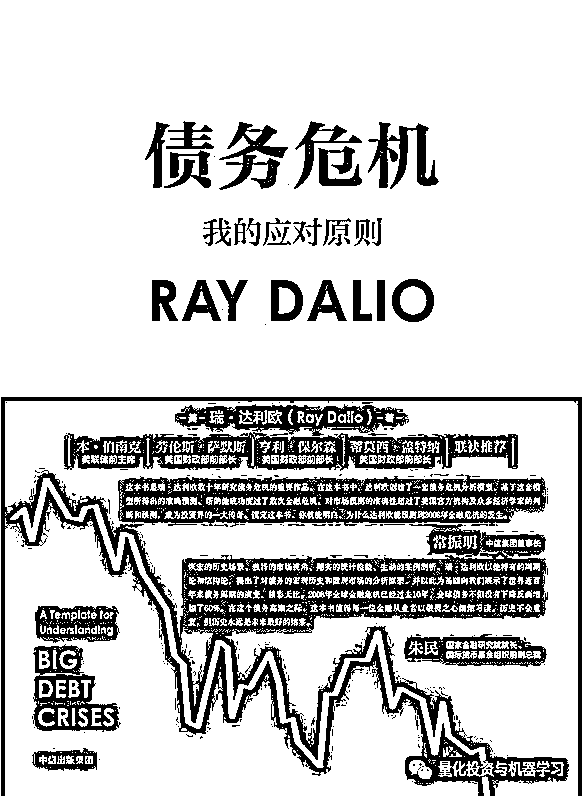
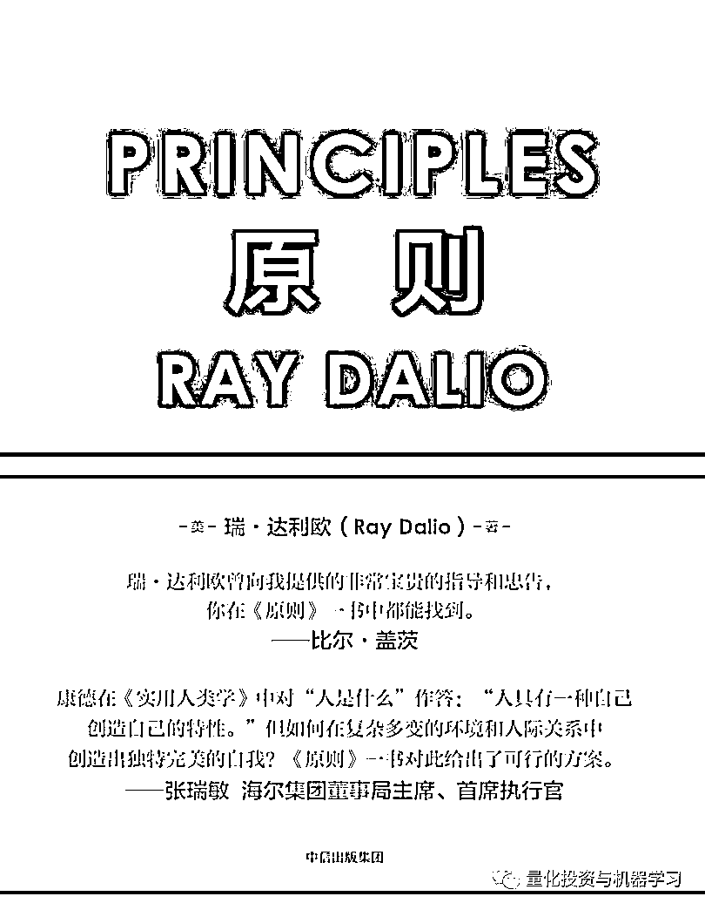
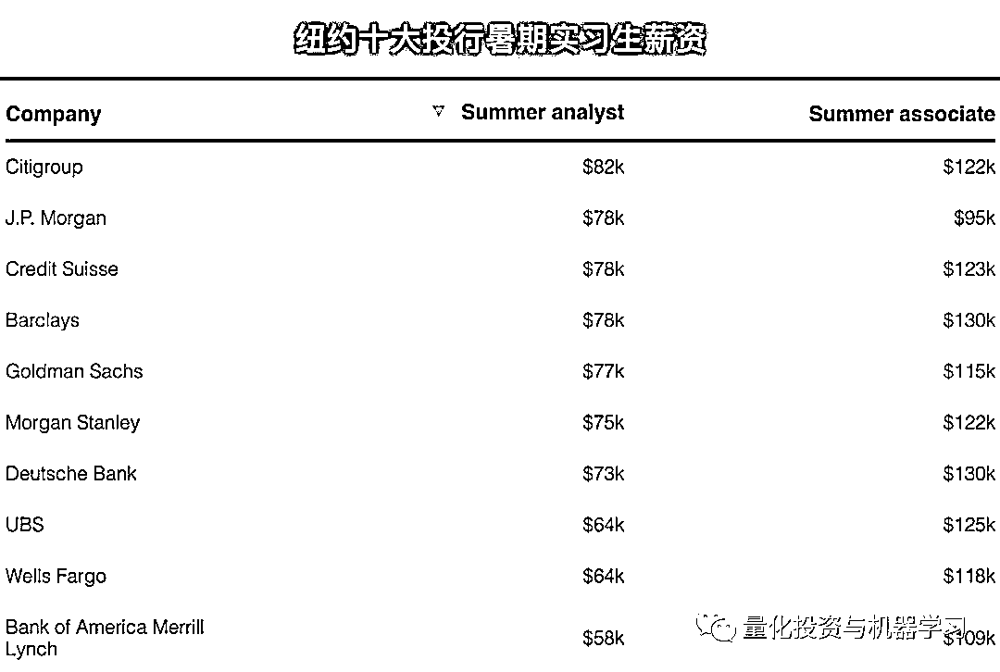
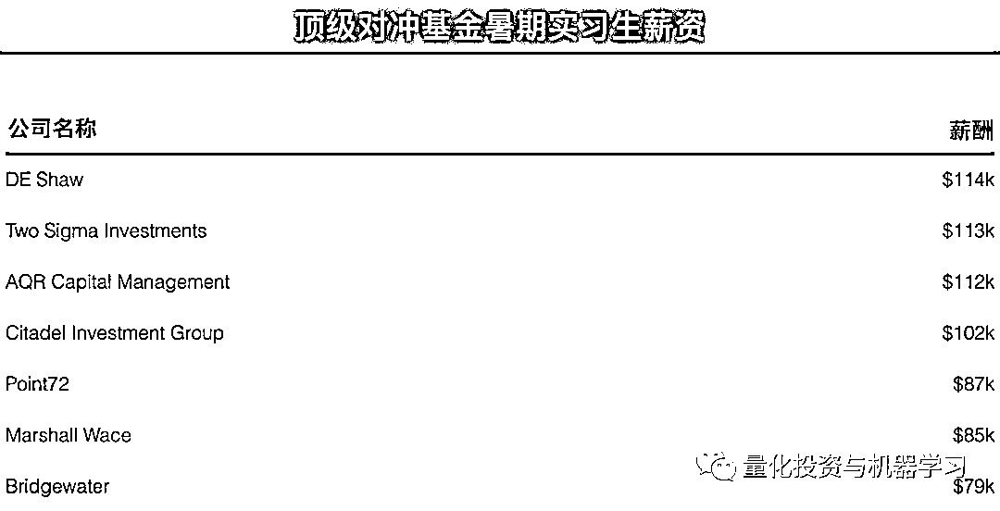

# 想去桥水，达里奥会付给你多少薪水？

> 原文：[`mp.weixin.qq.com/s?__biz=MzAxNTc0Mjg0Mg==&mid=2653294948&idx=1&sn=bd2a6b749ed236d7e538a75878a0311d&chksm=802dd371b75a5a67dd473800325a7feb4c742500aa98d034317af84cf758920815b73389bf0e&scene=27#wechat_redirect`](http://mp.weixin.qq.com/s?__biz=MzAxNTc0Mjg0Mg==&mid=2653294948&idx=1&sn=bd2a6b749ed236d7e538a75878a0311d&chksm=802dd371b75a5a67dd473800325a7feb4c742500aa98d034317af84cf758920815b73389bf0e&scene=27#wechat_redirect)

**标星★公众号     **爱你们♥   

**近期原创文章：**

## ♥ [5 种机器学习算法在预测股价的应用（代码+数据）](https://mp.weixin.qq.com/s?__biz=MzAxNTc0Mjg0Mg==&mid=2653290588&idx=1&sn=1d0409ad212ea8627e5d5cedf61953ac&chksm=802dc249b75a4b5fa245433320a4cc9da1a2cceb22df6fb1a28e5b94ff038319ae4e7ec6941f&token=1298662931&lang=zh_CN&scene=21#wechat_redirect)

## ♥ [Two Sigma 用新闻来预测股价走势，带你吊打 Kaggle](https://mp.weixin.qq.com/s?__biz=MzAxNTc0Mjg0Mg==&mid=2653290456&idx=1&sn=b8d2d8febc599742e43ea48e3c249323&chksm=802e3dcdb759b4db9279c689202101b6b154fb118a1c1be12b52e522e1a1d7944858dbd6637e&token=1330520237&lang=zh_CN&scene=21#wechat_redirect)

## ♥ 2 万字干货：[利用深度学习最新前沿预测股价走势](https://mp.weixin.qq.com/s?__biz=MzAxNTc0Mjg0Mg==&mid=2653290080&idx=1&sn=06c50cefe78a7b24c64c4fdb9739c7f3&chksm=802e3c75b759b563c01495d16a638a56ac7305fc324ee4917fd76c648f670b7f7276826bdaa8&token=770078636&lang=zh_CN&scene=21#wechat_redirect)

## ♥ [机器学习在量化金融领域的误用！](http://mp.weixin.qq.com/s?__biz=MzAxNTc0Mjg0Mg==&mid=2653292984&idx=1&sn=3e7efe9fe9452c4a5492d2175b4159ef&chksm=802dcbadb75a42bbdce895c49070c3f552dc8c983afce5eeac5d7c25974b7753e670a0162c89&scene=21#wechat_redirect)

## ♥ [基于 RNN 和 LSTM 的股市预测方法](https://mp.weixin.qq.com/s?__biz=MzAxNTc0Mjg0Mg==&mid=2653290481&idx=1&sn=f7360ea8554cc4f86fcc71315176b093&chksm=802e3de4b759b4f2235a0aeabb6e76b3e101ff09b9a2aa6fa67e6e824fc4274f68f4ae51af95&token=1865137106&lang=zh_CN&scene=21#wechat_redirect)

## ♥ [如何鉴别那些用深度学习预测股价的花哨模型？](https://mp.weixin.qq.com/s?__biz=MzAxNTc0Mjg0Mg==&mid=2653290132&idx=1&sn=cbf1e2a4526e6e9305a6110c17063f46&chksm=802e3c81b759b597d3dd94b8008e150c90087567904a29c0c4b58d7be220a9ece2008956d5db&token=1266110554&lang=zh_CN&scene=21#wechat_redirect)

## ♥ [优化强化学习 Q-learning 算法进行股市](https://mp.weixin.qq.com/s?__biz=MzAxNTc0Mjg0Mg==&mid=2653290286&idx=1&sn=882d39a18018733b93c8c8eac385b515&chksm=802e3d3bb759b42d1fc849f96bf02ae87edf2eab01b0beecd9340112c7fb06b95cb2246d2429&token=1330520237&lang=zh_CN&scene=21#wechat_redirect)

## ♥ [WorldQuant 101 Alpha、国泰君安 191 Alpha](https://mp.weixin.qq.com/s?__biz=MzAxNTc0Mjg0Mg==&mid=2653290927&idx=1&sn=ecca60811da74967f33a00329a1fe66a&chksm=802dc3bab75a4aac2bb4ccff7010063cc08ef51d0bf3d2f71621cdd6adece11f28133a242a15&token=48775331&lang=zh_CN&scene=21#wechat_redirect)

## ♥ [基于回声状态网络预测股票价格（附代码）](https://mp.weixin.qq.com/s?__biz=MzAxNTc0Mjg0Mg==&mid=2653291171&idx=1&sn=485a35e564b45046ff5a07c42bba1743&chksm=802dc0b6b75a49a07e5b91c512c8575104f777b39d0e1d71cf11881502209dc399fd6f641fb1&token=48775331&lang=zh_CN&scene=21#wechat_redirect)

## ♥ [计量经济学应用投资失败的 7 个原因](https://mp.weixin.qq.com/s?__biz=MzAxNTc0Mjg0Mg==&mid=2653292186&idx=1&sn=87501434ae16f29afffec19a6884ee8d&chksm=802dc48fb75a4d99e0172bf484cdbf6aee86e36a95037847fd9f070cbe7144b4617c2d1b0644&token=48775331&lang=zh_CN&scene=21#wechat_redirect)

## ♥ [配对交易千千万，强化学习最 NB！（文档+代码）](http://mp.weixin.qq.com/s?__biz=MzAxNTc0Mjg0Mg==&mid=2653292915&idx=1&sn=13f4ddebcd209b082697a75544852608&chksm=802dcb66b75a4270ceb19fac90eb2a70dc05f5b6daa295a7d31401aaa8697bbb53f5ff7c05af&scene=21#wechat_redirect)

## ♥ [关于高盛在 Github 开源背后的真相！](https://mp.weixin.qq.com/s?__biz=MzAxNTc0Mjg0Mg==&mid=2653291594&idx=1&sn=7703403c5c537061994396e7e49e7ce5&chksm=802dc65fb75a4f49019cec951ac25d30ec7783738e9640ec108be95335597361c427258f5d5f&token=48775331&lang=zh_CN&scene=21#wechat_redirect)

## ♥ [新一代量化带货王诞生！Oh My God！](https://mp.weixin.qq.com/s?__biz=MzAxNTc0Mjg0Mg==&mid=2653291789&idx=1&sn=e31778d1b9372bc7aa6e57b82a69ec6e&chksm=802dc718b75a4e0ea4c022e70ea53f51c48d102ebf7e54993261619c36f24f3f9a5b63437e9e&token=48775331&lang=zh_CN&scene=21#wechat_redirect)

## ♥ [独家！关于定量/交易求职分享（附真实试题）](https://mp.weixin.qq.com/s?__biz=MzAxNTc0Mjg0Mg==&mid=2653291844&idx=1&sn=3fd8b57d32a0ebd43b17fa68ae954471&chksm=802dc751b75a4e4755fcbb0aa228355cebbbb6d34b292aa25b4f3fbd51013fcf7b17b91ddb71&token=48775331&lang=zh_CN&scene=21#wechat_redirect)

## ♥ [Quant 们的身份危机！](https://mp.weixin.qq.com/s?__biz=MzAxNTc0Mjg0Mg==&mid=2653291856&idx=1&sn=729b657ede2cb50c96e92193ab16102d&chksm=802dc745b75a4e53c5018cc1385214233ec4657a3479cd7193c95aaf65642f5f45fa0e465694&token=48775331&lang=zh_CN&scene=21#wechat_redirect)

## ♥ [AQR 最新研究 | 机器能“学习”金融吗](http://mp.weixin.qq.com/s?__biz=MzAxNTc0Mjg0Mg==&mid=2653292710&idx=1&sn=e5e852de00159a96d5dcc92f349f5b58&chksm=802dcab3b75a43a5492bc98874684081eb5c5666aff32a36a0cdc144d74de0200cc0d997894f&scene=21#wechat_redirect)

公众号编辑部报道

**前言**

### 全球最大的对冲基金公司桥水（Bridgewater Associates），管理着近 1400 亿美元的资产。根据机构投资者在 4 月份公布的年度收入最高对冲基金经理富豪榜中，桥水的掌舵人达里奥位居榜首。

#### **2019: $2 billion**
**2018 排名: 4 ($1.3 billion)**

在过去一年半的时间里，达里奥一直看跌，这推动了他的旗舰产品 Pure Alpha 宏观策略，其获得了 14.6%的收益，这是自 2011 年以来的最佳表现，因此荣登今年富豪榜榜首。这也让达里奥净赚了 20 亿美元。正如机构投资者此前计算的那样，这相当于他：

**每天赚 550 万美元**

**or**
**每周工作 ****7 天****每天工作 ****24 小时****每小时赚 ****228310 美元**

达利奥最近又出版了一本新书：

**获取本书 PDF，见文末**

此前，他在 2017 年出版的第一本著作《Principles》获得的巨大的成功。

**获取本书 PDF，见文末**

**公众号提供：****中英对照版、PDF 版、电子书版**

紧随达里奥之后的是去年的第一名，文艺复兴科技公司的西蒙斯，他赚了 15 亿美元，低于 2017 年的 17 亿美元。Citadel 的创始人 Kenneth Griffin 以 8.7 亿美元的收入位居第三，与去年的 14 亿美元持平。

Two Sigma 的创始人 John Overdeck 和 David Siegel 他们每人赚了 8.2 亿美元。Millennium 的 Israel A. Englander 赚了 7.5 亿美元，Odey Asset Management 的 Crispin Odey 赚了 5.3 亿美元，D.E. Shaw Group 的 David Shaw 赚了 5 亿美元，Tiger Global Management 的 Chase Coleman 赚了 4.65 亿美元。来自 Brevan Howard 的 Alan Howard 以 3.9 亿美元的收入跻身榜单前十名。达里奥的副手格 Greg Jensen 和 Bob Prince 各赚得.25 亿美元，并列第 12 名。排在榜单末尾（第 22 位）的是 Point72 的创始人 Steven A. Cohen（亿万的原形），他赚了 7000 万美元。

**桥水会付给你多少薪水？**

那么，达里奥会付给其公司的员工多少呢？可能没有你想象中的那么多！

下面的表格显示了从 H1B 签证数据库中获取的桥水薪资范围。这里显示的工资指的是桥水 2019 年聘用的 H1B 签证持有者，不包括奖金分配。从某种程度上说，他们具有代表性，H1B 签证持有者代表着桥水康涅狄格州的员工。

**H1B：**美国签证的一种，指特殊专业人员/临时工作签证 Specialty Occupations/ Temporary Worker Visas (H-1B)。发放给美国公司雇佣的外国籍有专业技能的员工，属于非移民签证的一种。

结果是：**如果你是一名资历较浅的员工，桥水的工资似乎没有那么高**。10 万美元或更少的工资对于员工来说是相当标准的。133k 美元是 senior management associate 的标准薪资。**软件工程师的薪酬高于投资工程师，而投资组合策略师的薪酬高于其他人**。

这份表格上，高薪职位显然是 mission manager，年薪 18.5 万美元。目前还不清楚这指的是什么，但人们猜测这与戴利奥的原则有关，相对较高的薪酬反映出这一更广泛的使命对基金会有多么重要。

桥水薪酬概览

**其他基金对比**

我们对比一下 Citadel 2019 年美国 H1B 签证持有者薪酬。这些薪水大部分来源于纽约和芝加哥，不过 Citadel 也在纽瓦克、Westlake 和新泽西周围提供技术工作。

与此同时，根据我们之前的报道，下面列出的一些对冲基金是大型雇主。例如，Winton Capital Management 有 375 名员工。BlueBay 有 317 名。Aspect Capital 拥有 142 家公司等等。

除非你是合伙人，否则对冲基金对雇主的吸引力可能会比以前小。在伦敦的高盛（Goldman Sachs）， 2018 年的平均薪资为 31.4 万英镑，高于下表中的大多数对冲基金。一旦你加入了对冲基金，就很难再离开了。

再看看部分投行和对冲基金实习生的薪资：

数据来自：WSO

数据来自：WSO

**获取《原则+债务危机》**

在**后台**输入（严格大小写）

***Ray_Dalio_ 书籍***

公众号提供：中英对照版、PDF 版、电子书版

*—End—*

量化投资与机器学习微信公众号，是业内垂直于**Quant**、**MFE**、**CST、AI**等专业的**主****流量化自媒体**。公众号拥有来自**公募、私募、券商、银行、海外**等众多圈内**18W+**关注者。每日发布行业前沿研究成果和最新量化资讯。你点的每个“在看”，都是对我们最大的鼓励