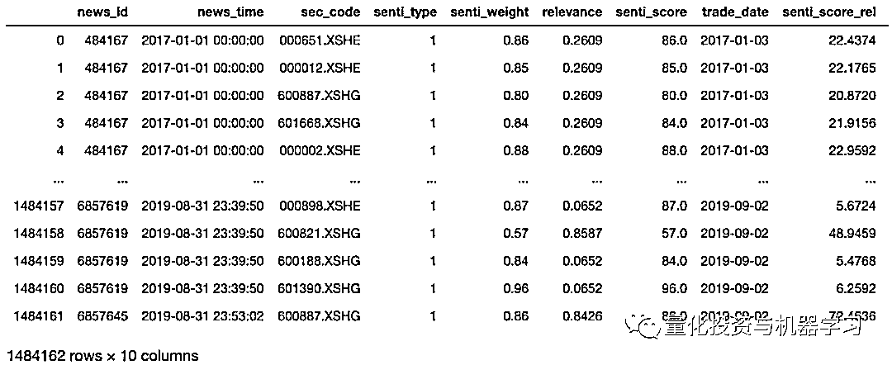
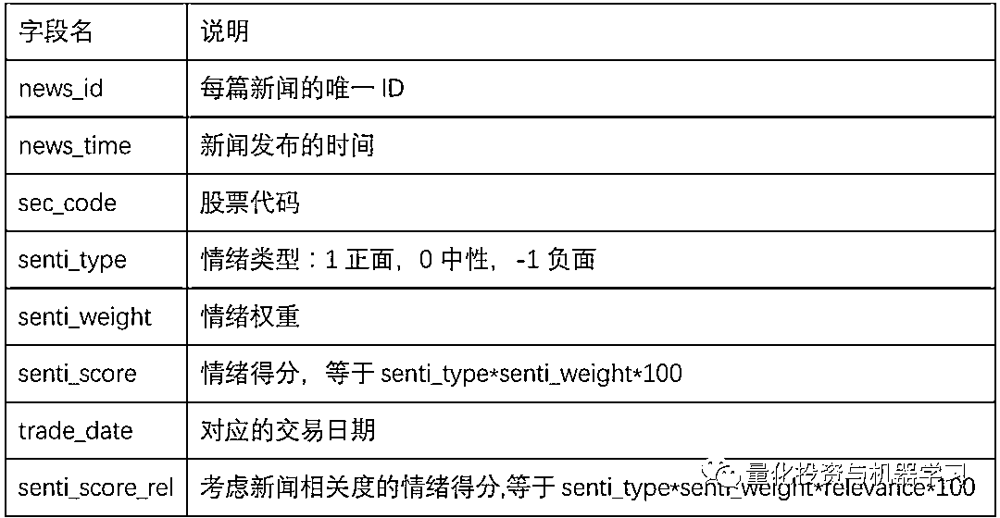
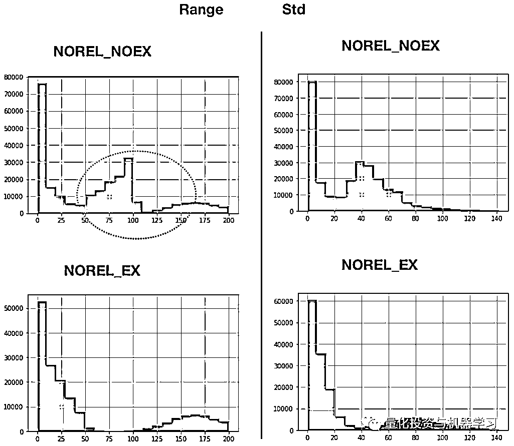
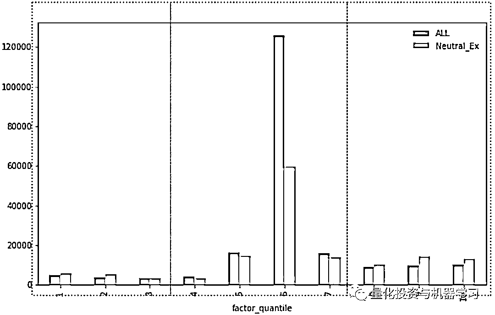
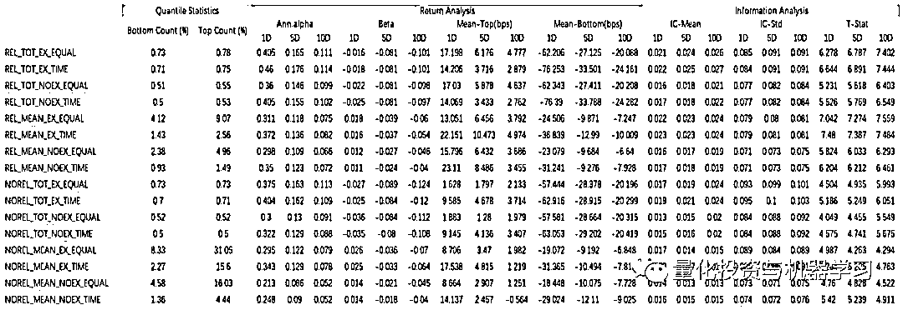
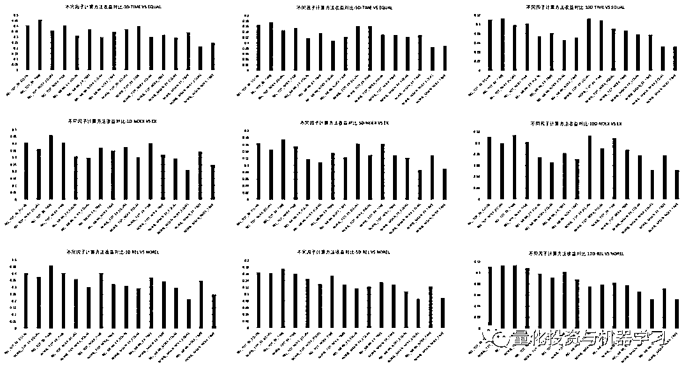
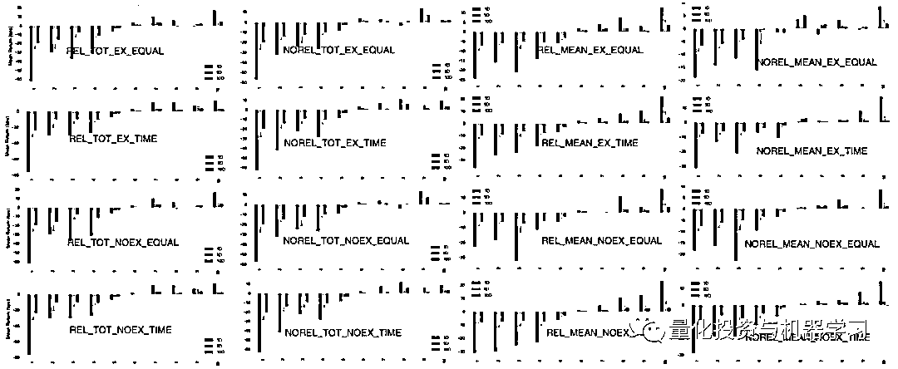

# 厉害了！新闻情绪因子

> 原文：[`mp.weixin.qq.com/s?__biz=MzAxNTc0Mjg0Mg==&mid=2653294929&idx=1&sn=e5c0e1e4243e6c3a358d52530d9e11bf&chksm=802dd344b75a5a52faec363ee80c1a8c338160676806800cd2bc806a65986694a4bf111307f9&scene=27#wechat_redirect`](http://mp.weixin.qq.com/s?__biz=MzAxNTc0Mjg0Mg==&mid=2653294929&idx=1&sn=e5c0e1e4243e6c3a358d52530d9e11bf&chksm=802dd344b75a5a52faec363ee80c1a8c338160676806800cd2bc806a65986694a4bf111307f9&scene=27#wechat_redirect)

**标星★公众号     **爱你们♥   

编辑部：1+1=6

**近期原创文章：**

## ♥ [5 种机器学习算法在预测股价的应用（代码+数据）](https://mp.weixin.qq.com/s?__biz=MzAxNTc0Mjg0Mg==&mid=2653290588&idx=1&sn=1d0409ad212ea8627e5d5cedf61953ac&chksm=802dc249b75a4b5fa245433320a4cc9da1a2cceb22df6fb1a28e5b94ff038319ae4e7ec6941f&token=1298662931&lang=zh_CN&scene=21#wechat_redirect)

## ♥ [Two Sigma 用新闻来预测股价走势，带你吊打 Kaggle](https://mp.weixin.qq.com/s?__biz=MzAxNTc0Mjg0Mg==&mid=2653290456&idx=1&sn=b8d2d8febc599742e43ea48e3c249323&chksm=802e3dcdb759b4db9279c689202101b6b154fb118a1c1be12b52e522e1a1d7944858dbd6637e&token=1330520237&lang=zh_CN&scene=21#wechat_redirect)

## ♥ 2 万字干货：[利用深度学习最新前沿预测股价走势](https://mp.weixin.qq.com/s?__biz=MzAxNTc0Mjg0Mg==&mid=2653290080&idx=1&sn=06c50cefe78a7b24c64c4fdb9739c7f3&chksm=802e3c75b759b563c01495d16a638a56ac7305fc324ee4917fd76c648f670b7f7276826bdaa8&token=770078636&lang=zh_CN&scene=21#wechat_redirect)

## ♥ [机器学习在量化金融领域的误用！](http://mp.weixin.qq.com/s?__biz=MzAxNTc0Mjg0Mg==&mid=2653292984&idx=1&sn=3e7efe9fe9452c4a5492d2175b4159ef&chksm=802dcbadb75a42bbdce895c49070c3f552dc8c983afce5eeac5d7c25974b7753e670a0162c89&scene=21#wechat_redirect)

## ♥ [基于 RNN 和 LSTM 的股市预测方法](https://mp.weixin.qq.com/s?__biz=MzAxNTc0Mjg0Mg==&mid=2653290481&idx=1&sn=f7360ea8554cc4f86fcc71315176b093&chksm=802e3de4b759b4f2235a0aeabb6e76b3e101ff09b9a2aa6fa67e6e824fc4274f68f4ae51af95&token=1865137106&lang=zh_CN&scene=21#wechat_redirect)

## ♥ [如何鉴别那些用深度学习预测股价的花哨模型？](https://mp.weixin.qq.com/s?__biz=MzAxNTc0Mjg0Mg==&mid=2653290132&idx=1&sn=cbf1e2a4526e6e9305a6110c17063f46&chksm=802e3c81b759b597d3dd94b8008e150c90087567904a29c0c4b58d7be220a9ece2008956d5db&token=1266110554&lang=zh_CN&scene=21#wechat_redirect)

## ♥ [优化强化学习 Q-learning 算法进行股市](https://mp.weixin.qq.com/s?__biz=MzAxNTc0Mjg0Mg==&mid=2653290286&idx=1&sn=882d39a18018733b93c8c8eac385b515&chksm=802e3d3bb759b42d1fc849f96bf02ae87edf2eab01b0beecd9340112c7fb06b95cb2246d2429&token=1330520237&lang=zh_CN&scene=21#wechat_redirect)

## ♥ [WorldQuant 101 Alpha、国泰君安 191 Alpha](https://mp.weixin.qq.com/s?__biz=MzAxNTc0Mjg0Mg==&mid=2653290927&idx=1&sn=ecca60811da74967f33a00329a1fe66a&chksm=802dc3bab75a4aac2bb4ccff7010063cc08ef51d0bf3d2f71621cdd6adece11f28133a242a15&token=48775331&lang=zh_CN&scene=21#wechat_redirect)

## ♥ [基于回声状态网络预测股票价格（附代码）](https://mp.weixin.qq.com/s?__biz=MzAxNTc0Mjg0Mg==&mid=2653291171&idx=1&sn=485a35e564b45046ff5a07c42bba1743&chksm=802dc0b6b75a49a07e5b91c512c8575104f777b39d0e1d71cf11881502209dc399fd6f641fb1&token=48775331&lang=zh_CN&scene=21#wechat_redirect)

## ♥ [计量经济学应用投资失败的 7 个原因](https://mp.weixin.qq.com/s?__biz=MzAxNTc0Mjg0Mg==&mid=2653292186&idx=1&sn=87501434ae16f29afffec19a6884ee8d&chksm=802dc48fb75a4d99e0172bf484cdbf6aee86e36a95037847fd9f070cbe7144b4617c2d1b0644&token=48775331&lang=zh_CN&scene=21#wechat_redirect)

## ♥ [配对交易千千万，强化学习最 NB！（文档+代码）](http://mp.weixin.qq.com/s?__biz=MzAxNTc0Mjg0Mg==&mid=2653292915&idx=1&sn=13f4ddebcd209b082697a75544852608&chksm=802dcb66b75a4270ceb19fac90eb2a70dc05f5b6daa295a7d31401aaa8697bbb53f5ff7c05af&scene=21#wechat_redirect)

## ♥ [关于高盛在 Github 开源背后的真相！](https://mp.weixin.qq.com/s?__biz=MzAxNTc0Mjg0Mg==&mid=2653291594&idx=1&sn=7703403c5c537061994396e7e49e7ce5&chksm=802dc65fb75a4f49019cec951ac25d30ec7783738e9640ec108be95335597361c427258f5d5f&token=48775331&lang=zh_CN&scene=21#wechat_redirect)

## ♥ [新一代量化带货王诞生！Oh My God！](https://mp.weixin.qq.com/s?__biz=MzAxNTc0Mjg0Mg==&mid=2653291789&idx=1&sn=e31778d1b9372bc7aa6e57b82a69ec6e&chksm=802dc718b75a4e0ea4c022e70ea53f51c48d102ebf7e54993261619c36f24f3f9a5b63437e9e&token=48775331&lang=zh_CN&scene=21#wechat_redirect)

## ♥ [独家！关于定量/交易求职分享（附真实试题）](https://mp.weixin.qq.com/s?__biz=MzAxNTc0Mjg0Mg==&mid=2653291844&idx=1&sn=3fd8b57d32a0ebd43b17fa68ae954471&chksm=802dc751b75a4e4755fcbb0aa228355cebbbb6d34b292aa25b4f3fbd51013fcf7b17b91ddb71&token=48775331&lang=zh_CN&scene=21#wechat_redirect)

## ♥ [Quant 们的身份危机！](https://mp.weixin.qq.com/s?__biz=MzAxNTc0Mjg0Mg==&mid=2653291856&idx=1&sn=729b657ede2cb50c96e92193ab16102d&chksm=802dc745b75a4e53c5018cc1385214233ec4657a3479cd7193c95aaf65642f5f45fa0e465694&token=48775331&lang=zh_CN&scene=21#wechat_redirect)

## ♥ [AQR 最新研究 | 机器能“学习”金融吗](http://mp.weixin.qq.com/s?__biz=MzAxNTc0Mjg0Mg==&mid=2653292710&idx=1&sn=e5e852de00159a96d5dcc92f349f5b58&chksm=802dcab3b75a43a5492bc98874684081eb5c5666aff32a36a0cdc144d74de0200cc0d997894f&scene=21#wechat_redirect)

**前言**

本文数据来自：**数库新闻舆情数据**。

数库对于每一篇抓取到的新闻均做了以下处理：

**1、提取基本信息：**包括新闻的标题、时间、来源、智能摘要

**2、智能标签识别：**识别新闻中存在的法人及自然人实体、SAM 产品、行业、事件及概念。除了识别出这些标签，算法还能给出这篇新闻与这些标签的相关程度。

**3、情绪判定：**对于整篇新闻及新闻中涉及的主体均做情绪判定。情绪一共分为三个类型，包括正面、负面及中性。算法会给出这个主体在三类情绪的概率分布，取概率最大的情绪类型作为该主体的情绪。例如，某篇新闻中提及股票 A，算法给出 A 的情绪概率为 30%中性、10%负面及 60%正面。那么在这篇新闻中，股票 A 的情绪就为正面。

我们可以通过以下的示例数据来更直观的了解数库提供的新闻舆情数据，每一条原始数据都是一个嵌套多层的 json 字典。其中 newInfo 为基本信息，newsTags 为标签信息，标签信息中的 ItemRelevance 为该新闻与该标签的相关度，emotionInfos 为情绪得分信息，emotionIndicator 为该主体的情绪类型，1 为正面，2 为负面，0 为中性。

海量及时的新闻情绪数据给我们提供一个快速了解及量化整个市场及每个上市公司的当前情绪的机会，通过这些数据我们可以及时控制风险，也可以借助传统的投资理论建立量化投资模型。

本篇报告主要基于以上的新闻舆情数据及传统的因子理论，构建了一套基于新闻舆情因子的因子模型，并在因子构建的过程中测试了各种不同的因子构建方法，详细分析了不同方法带来的影响及利弊。报告中主要使用的是 emotionInfos 中的情绪数据，并未使用到智能标签中的产品、行业、概念及事件标签等数据。

图表 1  数据样例

**如何快速获取新闻情绪数据**

数库的新闻舆情的历史数据可追溯至 2008 年，为了使广大用户更方便的测试及使用新闻情绪相关的数据，我们开放了部分加工后的情绪数据（而非图表 1 的原始数据），大家可以通过安装 Python 模块 csf_kit 快速便捷的获取该数据。具体安装及使用方法如下：

如果您使用 python 进行数据研究，那么可以在命令行窗口输入：pip install csf_kit 快速安装数库开源示例代码库。

安装好 csf_kit 后，运行以下代码导入示例数据：

***from csf_kit import SAMPLE_SENTI_SCORE***

其中 SAMPLE_SENTI_SCORE 就是 2017 年 1 月 1 日至 2019 年 8 月 31 日的 A 股情绪数据，具体的数据及字段说明如下：

图表 2  A 股情绪数据

图表 3  情绪数据字段说明

关于示例数据有以下几点需要说明：

1、每条记录表示某只股票在某篇新闻中的情绪得分，且该数据中只有 A 股数据；

2、senti_type 对应原始数据中的 emotionIndicator，且把原先 2 表示负面改为-1 表示负面；

3、trade_date 为该记录对应的交易日期，具体对应规则为 t-2 的 15:00 到 t-1 的 15:00 对应到 t 日期。csf_kit 中提供了便捷的函数 align_trade_date，用户可以方便的使用自己认为合适的对应规则。

**新闻情绪因子测试**

**1、新闻情绪因子构建过程中的选择**

新闻情绪因子的构建主要在于用什么算法把某个股票一段时间内的在不同新闻中的情绪得分汇总成一个得分，针对这个问题，有不同的选择需要考虑：

**a. 保留中性的记录还是去除中性的记录？**

相对于正负面的评判，中性的评判是最模棱两可的，在我们的 NLP 技术白皮书中也提到中性新闻的准确度是最低的。而且，中性新闻的得分为 0 分，由于人们对于极端正负面的新闻与中性新闻的反应不一样，特别是在用平均分刻画股票情绪得分时，中性新闻会扭曲极端正负面股票的得分。

即使逻辑上，去除中性新闻的记录更为合理，我们后面还会用数据分析验证我们的结论是否正确。

**b. 平均分还是总分？**

平均分指的是计算一段时间内某只股票在所有新闻中得分的平均分，所以基于平均分的股票情绪因子固定在（-100，100）这个区间里，这样的计算方式会丢失掉热度的信息，比如在 10 篇新闻中出现的 A 股票且得分都为 100 分，与只有一篇新闻出现的 B 股票但得分也为 100，是一样的。

总分是计算某只股票在一段时间里的得分的总分，总分的计算考虑了股票的热度，但造成了股票得分分布的不均匀，容易出现极端值。所以总分的因子逻辑上更能抓住极端行情的股票，但股票数量不稳定。

**c. 是否考虑新闻与股票的相关度？**

在我们的原始数据及测试数据中都有某篇新闻与其出现的某只股票的相关度，在测试数据中为 relevance 字段。在计算情绪得分时，是否应该乘以相关度？逻辑告诉我们，应该乘以该字段，因为这样才能体现不同股票在同一篇新闻中的差别。两种情况的具体测试结果我们将在后面的分析中呈现

**d. 不同时间发生的新闻是否要考虑情绪得分的时间衰减？**

假设我们的交易决策在 t-1 收盘时执行，那么在这之前不同时间发生的新闻是否要考虑时间衰减。比如某只股票在 t-2 收盘时在某篇新闻的得分为 80 分，在 t-1 收盘时是否还应该按其 80 分作为情绪得分，还是要考虑时间衰减，以一个低于 80 分的得分计算其情绪得分？逻辑上，考虑情绪得分的时间衰减的处理方式更为合理，但由于新闻情绪数据噪音很大，具体的结论还要看测试结果。

**2、新闻情绪因子测试结果**

基于以上不同的选择，我们做了以下详细的测试，我们所有的因子测试都是采用的开源因子测试工具 Alphalens。分组的方式是采用等分位区间制，且在 0 上下等分为 5 组，即每日根据今日得分划为 10 个区间，处于同一分数区间的股票分为一组。

我们以不同的字母代表不同的处理方式，具体说明如下

*   REL：情绪得分计算时使用相关度指标
*   NOREL：情绪得分计算时不使用相关度指标
*   TOT：计算情绪得分的总分
*   MEAN：计算情绪得分的平均分
*   EX：去除中性新闻
*   NOEX：保留中性新闻
*   EQUAL：等权计算情绪得分，不考虑时间衰减
*   TIME：按时间权重计算情绪得分

那么，例如 REL_TOT_EX_TIME 就表示考虑了相关度及情绪衰减，去除中性新闻的情绪总分。

我们先来回答第一个问题，是否保留中性新闻？图 4 中，统计了每天同一个股票在不同新闻中得分分布的差异，我们采用了两个指标，左边用的是 Range（最大值-最小值），右边采用的是 Std 标准差。我们希望一只股票在不同新闻中的得分差异越小，对于我们因子的构建就越有利。我们可以发现，当去除中性新闻后，差异的分布明显变的平缓，坐标轴靠左区域的密度变大。图 5 中说明，对股票进行分组时，当去除中性新闻后，处于两边的组别（如 1、2、3 及 8、9、10）的股票数量增加，而处于中间的股票数量减少，也就是说去除中性新闻后有利于增加因子的区分度。

图表 4  去除中性与不去除中性新闻对比 A

图表 5  去除中性与不去除中性新闻对比 B

下表（图表 6）给出了全部组合的测试结果，基于这些数据我们会做详细的解读。

图 7 给了一个我们非常期待的结果，其中从左到右三列分别为 1D、5D、10D 的测试结果，从上到下三行分别为 TIME 与 EQUAL、NOEX 与 EX 及 REL 与 NOREL 的对比。图中每根柱子代表了该因子计算方式下的组合年化收益率。我们有以下几点发现：

无论调仓期是 1D、5D 还是 10D，从收益的角度：

*   TIME 的因子收益表现总是好于 EQUAL（应该考虑情绪衰减）

*   EX 的因子收益表现总是好于 NOEX（应该去除中性新闻）

*   REL 的因子收益表现总是好于 NOREL（应该考虑新闻与股票的相关度）

关于 TOT 与 MEAN 的对比实际上还是要考虑具体的需求，从图 6 中可以看出以总分计算的因子 TOP 与 BOTTOM 的股票数量很少，且 BOTTOM 组的收益明显要低于以平均分计算的因子。所以考虑热度因子的总分因子，更能反应出负面情绪的影响，捕获负面 Alpha。通过图 8，我们也可以发现，TOT 因子在负面情绪的分层效果要好于 MEAN 因子，而 MEAN 因子在正面情绪的分层效果要好于 TOT 因子，整体上看 MEAN 因子的分层效果更好。所以，在后续报告的详细回测测试中，我们将分别使用 TOT 和 MEAN 的因子，具体是以下两个因子 REL_TOT_EX_TIME 和 REL_MEAN_EX_TIME。

图表 6  因子测试结果 A

图表 7  因子测试结果 B

图表 8  因子测试结果 C

**总结**

本文介绍了数库的情绪数据，主要是对于各种不同的情绪因子构建方法做了测试与对比，测试的结果与逻辑相符合，所以我们在构建因子时要去除中性新闻数据，考虑新闻与股票的相关度，且考虑情绪的时间衰减。关于采用总分还是均分，则要结合具体的组合需求，因为总分选出的股票数量偏少，而均分的股票数量比较稳定。在后续的推文中，我们将详细测试 REL_TOT_EX_TIME 和 REL_MEAN_EX_TIME 两个因子，以及在指数增强中使用这两个因子的具体效果。

数库通过自主研发的资讯采集平台灵活迅速的抓取互联网上的海量财经信息，并通过强大的处理能力，准确挖掘所需数据，如智能标签、实体识别及情绪识别等。目前，该系统已覆盖中国大陆主流财经媒体及主要行业网站，总计 3000+网站新闻版面，平均每 5 分钟抓取一次，每日新增新闻抓取量约 20000 条。更多关于数库智能资讯系统的详细介绍可参考数库智能资讯用户手册及数库 NLP 技术白皮书（**点击阅读原文**）。

*—End—*

量化投资与机器学习微信公众号，是业内垂直于**Quant**、**MFE**、**CST、AI**等专业的**主****流量化自媒体**。公众号拥有来自**公募、私募、券商、银行、海外**等众多圈内**18W+**关注者。每日发布行业前沿研究成果和最新量化资讯。你点的每个“在看”，都是对我们最大的鼓励