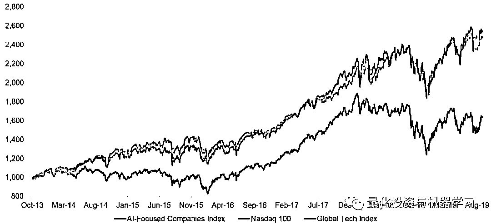
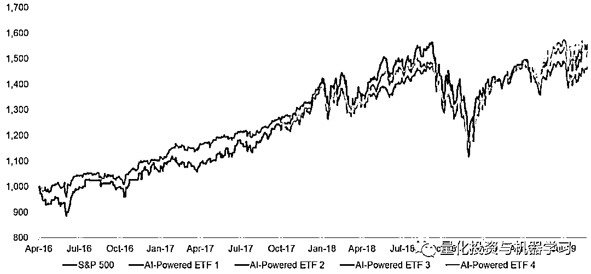
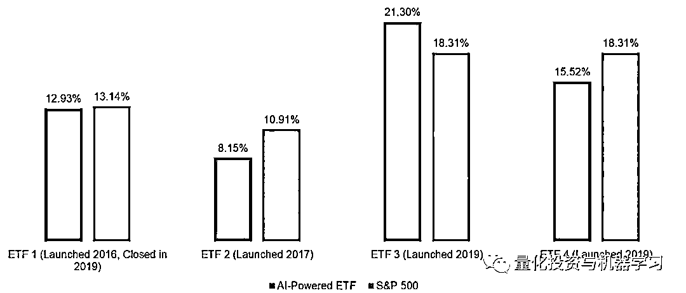

# 当年的 AI 对冲基金，如今几何？

> 原文：[`mp.weixin.qq.com/s?__biz=MzAxNTc0Mjg0Mg==&mid=2653294901&idx=1&sn=8e1edb0ff74f80258268fcf23f5c6b47&chksm=802dd320b75a5a36b8b1480786a9329593762abf0882b375604d024328a31b44c5ab9897b8c0&scene=27#wechat_redirect`](http://mp.weixin.qq.com/s?__biz=MzAxNTc0Mjg0Mg==&mid=2653294901&idx=1&sn=8e1edb0ff74f80258268fcf23f5c6b47&chksm=802dd320b75a5a36b8b1480786a9329593762abf0882b375604d024328a31b44c5ab9897b8c0&scene=27#wechat_redirect)

**标星★公众号     **爱你们♥   

作者：Nicolas Rabener

编译：1+1=6

**近期原创文章：**

## ♥ [5 种机器学习算法在预测股价的应用（代码+数据）](https://mp.weixin.qq.com/s?__biz=MzAxNTc0Mjg0Mg==&mid=2653290588&idx=1&sn=1d0409ad212ea8627e5d5cedf61953ac&chksm=802dc249b75a4b5fa245433320a4cc9da1a2cceb22df6fb1a28e5b94ff038319ae4e7ec6941f&token=1298662931&lang=zh_CN&scene=21#wechat_redirect)

## ♥ [Two Sigma 用新闻来预测股价走势，带你吊打 Kaggle](https://mp.weixin.qq.com/s?__biz=MzAxNTc0Mjg0Mg==&mid=2653290456&idx=1&sn=b8d2d8febc599742e43ea48e3c249323&chksm=802e3dcdb759b4db9279c689202101b6b154fb118a1c1be12b52e522e1a1d7944858dbd6637e&token=1330520237&lang=zh_CN&scene=21#wechat_redirect)

## ♥ 2 万字干货：[利用深度学习最新前沿预测股价走势](https://mp.weixin.qq.com/s?__biz=MzAxNTc0Mjg0Mg==&mid=2653290080&idx=1&sn=06c50cefe78a7b24c64c4fdb9739c7f3&chksm=802e3c75b759b563c01495d16a638a56ac7305fc324ee4917fd76c648f670b7f7276826bdaa8&token=770078636&lang=zh_CN&scene=21#wechat_redirect)

## ♥ [机器学习在量化金融领域的误用！](http://mp.weixin.qq.com/s?__biz=MzAxNTc0Mjg0Mg==&mid=2653292984&idx=1&sn=3e7efe9fe9452c4a5492d2175b4159ef&chksm=802dcbadb75a42bbdce895c49070c3f552dc8c983afce5eeac5d7c25974b7753e670a0162c89&scene=21#wechat_redirect)

## ♥ [基于 RNN 和 LSTM 的股市预测方法](https://mp.weixin.qq.com/s?__biz=MzAxNTc0Mjg0Mg==&mid=2653290481&idx=1&sn=f7360ea8554cc4f86fcc71315176b093&chksm=802e3de4b759b4f2235a0aeabb6e76b3e101ff09b9a2aa6fa67e6e824fc4274f68f4ae51af95&token=1865137106&lang=zh_CN&scene=21#wechat_redirect)

## ♥ [如何鉴别那些用深度学习预测股价的花哨模型？](https://mp.weixin.qq.com/s?__biz=MzAxNTc0Mjg0Mg==&mid=2653290132&idx=1&sn=cbf1e2a4526e6e9305a6110c17063f46&chksm=802e3c81b759b597d3dd94b8008e150c90087567904a29c0c4b58d7be220a9ece2008956d5db&token=1266110554&lang=zh_CN&scene=21#wechat_redirect)

## ♥ [优化强化学习 Q-learning 算法进行股市](https://mp.weixin.qq.com/s?__biz=MzAxNTc0Mjg0Mg==&mid=2653290286&idx=1&sn=882d39a18018733b93c8c8eac385b515&chksm=802e3d3bb759b42d1fc849f96bf02ae87edf2eab01b0beecd9340112c7fb06b95cb2246d2429&token=1330520237&lang=zh_CN&scene=21#wechat_redirect)

## ♥ [WorldQuant 101 Alpha、国泰君安 191 Alpha](https://mp.weixin.qq.com/s?__biz=MzAxNTc0Mjg0Mg==&mid=2653290927&idx=1&sn=ecca60811da74967f33a00329a1fe66a&chksm=802dc3bab75a4aac2bb4ccff7010063cc08ef51d0bf3d2f71621cdd6adece11f28133a242a15&token=48775331&lang=zh_CN&scene=21#wechat_redirect)

## ♥ [基于回声状态网络预测股票价格（附代码）](https://mp.weixin.qq.com/s?__biz=MzAxNTc0Mjg0Mg==&mid=2653291171&idx=1&sn=485a35e564b45046ff5a07c42bba1743&chksm=802dc0b6b75a49a07e5b91c512c8575104f777b39d0e1d71cf11881502209dc399fd6f641fb1&token=48775331&lang=zh_CN&scene=21#wechat_redirect)

## ♥ [计量经济学应用投资失败的 7 个原因](https://mp.weixin.qq.com/s?__biz=MzAxNTc0Mjg0Mg==&mid=2653292186&idx=1&sn=87501434ae16f29afffec19a6884ee8d&chksm=802dc48fb75a4d99e0172bf484cdbf6aee86e36a95037847fd9f070cbe7144b4617c2d1b0644&token=48775331&lang=zh_CN&scene=21#wechat_redirect)

## ♥ [配对交易千千万，强化学习最 NB！（文档+代码）](http://mp.weixin.qq.com/s?__biz=MzAxNTc0Mjg0Mg==&mid=2653292915&idx=1&sn=13f4ddebcd209b082697a75544852608&chksm=802dcb66b75a4270ceb19fac90eb2a70dc05f5b6daa295a7d31401aaa8697bbb53f5ff7c05af&scene=21#wechat_redirect)

## ♥ [关于高盛在 Github 开源背后的真相！](https://mp.weixin.qq.com/s?__biz=MzAxNTc0Mjg0Mg==&mid=2653291594&idx=1&sn=7703403c5c537061994396e7e49e7ce5&chksm=802dc65fb75a4f49019cec951ac25d30ec7783738e9640ec108be95335597361c427258f5d5f&token=48775331&lang=zh_CN&scene=21#wechat_redirect)

## ♥ [新一代量化带货王诞生！Oh My God！](https://mp.weixin.qq.com/s?__biz=MzAxNTc0Mjg0Mg==&mid=2653291789&idx=1&sn=e31778d1b9372bc7aa6e57b82a69ec6e&chksm=802dc718b75a4e0ea4c022e70ea53f51c48d102ebf7e54993261619c36f24f3f9a5b63437e9e&token=48775331&lang=zh_CN&scene=21#wechat_redirect)

## ♥ [独家！关于定量/交易求职分享（附真实试题）](https://mp.weixin.qq.com/s?__biz=MzAxNTc0Mjg0Mg==&mid=2653291844&idx=1&sn=3fd8b57d32a0ebd43b17fa68ae954471&chksm=802dc751b75a4e4755fcbb0aa228355cebbbb6d34b292aa25b4f3fbd51013fcf7b17b91ddb71&token=48775331&lang=zh_CN&scene=21#wechat_redirect)

## ♥ [Quant 们的身份危机！](https://mp.weixin.qq.com/s?__biz=MzAxNTc0Mjg0Mg==&mid=2653291856&idx=1&sn=729b657ede2cb50c96e92193ab16102d&chksm=802dc745b75a4e53c5018cc1385214233ec4657a3479cd7193c95aaf65642f5f45fa0e465694&token=48775331&lang=zh_CN&scene=21#wechat_redirect)

## ♥ [AQR 最新研究 | 机器能“学习”金融吗](http://mp.weixin.qq.com/s?__biz=MzAxNTc0Mjg0Mg==&mid=2653292710&idx=1&sn=e5e852de00159a96d5dcc92f349f5b58&chksm=802dcab3b75a43a5492bc98874684081eb5c5666aff32a36a0cdc144d74de0200cc0d997894f&scene=21#wechat_redirect)

**公众号的话**从今天起的几期内容中，**公众号将对人工智能（AI）对当今对冲基金领域的影响和发展做一个丰富全面的报道。**敬请期待！**本期为第一篇报道***AI will probably most likely lead to the end of the world, but in the meantime, there’ll be great companies.****– Sam Altman***专注于人工智能的公司和基于人工智能管理的 ETF 表现如何呢？**Investing in AI**

在美国，与人工智能相关的 ETF 管理着大约 60 亿美元的规模，而美国的股票 ETF 管理着 3 万亿美元的规模。**500 倍！**

**需求不足的一个原因可能是业绩不佳。自 2013 年以来，这类主题 ETF 的等权指数表现远逊于 NASDAQ 和全球科技指数。这还不包括管理费：这些 ETF 的平均年管理费为 78bps，而所有股票 ETF 平均年管理费为 53bps。**

****

**数据来自：ETF.com**

****AI Investing****

**但或许投资者根本就不应该把目标对准专注于人工智能基金。为什么不让人工智能直接管理我们的钱呢?** 

**不幸的是，**只有少数 ETF 的投资决策是由人工智能执行的**。那它们管理规模是多少呢？**刚刚超过 1 亿美元**。这些基金的年平均管理费为 0.77%。**

**但即便如此，投资者对人工智能的耐心也有限，解雇它们也是很容易的事。BUZ 是首只使用人工智能收集美国股市舆情数据的 ETF。今年早些时候，该公司在成立仅三年后就倒闭了。**

**近年来，以人工智能驱动的新 ETF 纷纷推出，其中包括使用 IBM 著名 Watson AI 的 ETF。这些基金大多试图击败美国大盘股。但很难找到证据表明他们在这方面取得了成功。事实证明，人工智能想要战胜市场，可能和人类一样困难。**

****以 AI 驱动的 ETF（美股）****

****

**数据来自：FactorResearch**

**以标普 500 为基准，四分之三以 AI 驱动 ETF 表现不佳。**

**尽管有两只 ETF 是今年推出的，交易历史较短，但如果认为人工智能会像传统 ETF 一样，需要一个完整的市场周期才能产生超群表现，那就有点牵强了。**

****CAGR****

****

**数据来自：FactorResearch**

****以人工智能为驱动的对冲基金****

**基于人工智能驱动的 ETF 的问题在于，它们局限于股票和只 long-only 的投资。人工智能可能需要更大的灵活性来创造价值并释放其全部潜力。自 2009 年以来，以人工智能为驱动的对冲基金表现明显好于常用基准，尽管它们在今年的表现不如基准。**

****以人工智能为驱动的对冲基金****

****

****

**数据来自：Eurekahedge**

**Eurekahedge AI 对冲基金指数目前有 14 个成员。另有 36 家公司已被清算或不再提出进一步报告。因此，成功地选择基金是一项挑战！**

**以人工智能为驱动的对冲基金为例，投资者需要更加谨慎。创建人工智能的程序员和数据科学家常常不能完全理解他们的行为。所以它们仍然是黑盒，甚至对它们的创造者也是如此。**

**我们可以对对冲基金的投资组合进行因子敞口分析。通过此项表明，人工智能基金最近看涨欧元区和新兴市场股票以及公司债券，看跌英国股市、高收益债券和大宗商品。**

**当然，这个分析并不能告诉我们人工智能基金为什么会会持有这些头寸，我们也不能和他们讨论他们的投资主张。至少现在还没有。**

****以人工智能为驱动的对冲基金因子暴露分析****

****

**数据来自：FactorResearch**

****进一步的想法****

**在全球范围内，几乎每家大型投资公司都有团队致力于人工智能和机器学习技术。许多公司已经将这些工具整合到他们的投资过程中。机器学习已经有了成功的应用，例如，以数十亿信用卡交易的形式处理大数据，以发现消费者支出的趋势。这种策略可能会导致相关公司的多头和空头头寸。**

**然而，这很难预示人工智能支持者所预言的革命。但人工智能或许会以一种不同的方式改变投资行业。金融市场是嘈杂的，资产价格受到许多变量的影响，这些变量在一个开放、复杂的系统中相互作用。这可能会一直干扰预测，不管我们的算力如何。**

**由于人工智能不太可能在短期内在投资中发挥巨大的作用，因此让它们为部分自动化或涉及较少变量的中台和后台功能可能是有意义的。**

***—End—***

**量化投资与机器学习微信公众号，是业内垂直于**Quant**、**MFE**、**CST、AI**等专业的**主****流量化自媒体**。公众号拥有来自**公募、私募、券商、银行、海外**等众多圈内**18W+**关注者。每日发布行业前沿研究成果和最新量化资讯。********你点的每个“在看”，都是对我们最大的鼓励**