# 论文抄袭！网课骗钱！人设崩塌！

> 原文：[`mp.weixin.qq.com/s?__biz=MzAxNTc0Mjg0Mg==&mid=2653294883&idx=1&sn=c363929376f6ec70ebc86295de62f9fe&chksm=802dd336b75a5a207c9d4d068c0c4378a77b00db4f0101b4a9c2c5f5656678c13011cbf39af7&scene=27#wechat_redirect`](http://mp.weixin.qq.com/s?__biz=MzAxNTc0Mjg0Mg==&mid=2653294883&idx=1&sn=c363929376f6ec70ebc86295de62f9fe&chksm=802dd336b75a5a207c9d4d068c0c4378a77b00db4f0101b4a9c2c5f5656678c13011cbf39af7&scene=27#wechat_redirect)

**标星★公众号     **爱你们♥   

边策 鱼羊 发自 凹非寺 

##### 量子位 报道 | 公众号 QbitAI

**近期原创文章：**

## ♥ [5 种机器学习算法在预测股价的应用（代码+数据）](https://mp.weixin.qq.com/s?__biz=MzAxNTc0Mjg0Mg==&mid=2653290588&idx=1&sn=1d0409ad212ea8627e5d5cedf61953ac&chksm=802dc249b75a4b5fa245433320a4cc9da1a2cceb22df6fb1a28e5b94ff038319ae4e7ec6941f&token=1298662931&lang=zh_CN&scene=21#wechat_redirect)

## ♥ [Two Sigma 用新闻来预测股价走势，带你吊打 Kaggle](https://mp.weixin.qq.com/s?__biz=MzAxNTc0Mjg0Mg==&mid=2653290456&idx=1&sn=b8d2d8febc599742e43ea48e3c249323&chksm=802e3dcdb759b4db9279c689202101b6b154fb118a1c1be12b52e522e1a1d7944858dbd6637e&token=1330520237&lang=zh_CN&scene=21#wechat_redirect)

## ♥ 2 万字干货：[利用深度学习最新前沿预测股价走势](https://mp.weixin.qq.com/s?__biz=MzAxNTc0Mjg0Mg==&mid=2653290080&idx=1&sn=06c50cefe78a7b24c64c4fdb9739c7f3&chksm=802e3c75b759b563c01495d16a638a56ac7305fc324ee4917fd76c648f670b7f7276826bdaa8&token=770078636&lang=zh_CN&scene=21#wechat_redirect)

## ♥ [机器学习在量化金融领域的误用！](http://mp.weixin.qq.com/s?__biz=MzAxNTc0Mjg0Mg==&mid=2653292984&idx=1&sn=3e7efe9fe9452c4a5492d2175b4159ef&chksm=802dcbadb75a42bbdce895c49070c3f552dc8c983afce5eeac5d7c25974b7753e670a0162c89&scene=21#wechat_redirect)

## ♥ [基于 RNN 和 LSTM 的股市预测方法](https://mp.weixin.qq.com/s?__biz=MzAxNTc0Mjg0Mg==&mid=2653290481&idx=1&sn=f7360ea8554cc4f86fcc71315176b093&chksm=802e3de4b759b4f2235a0aeabb6e76b3e101ff09b9a2aa6fa67e6e824fc4274f68f4ae51af95&token=1865137106&lang=zh_CN&scene=21#wechat_redirect)

## ♥ [如何鉴别那些用深度学习预测股价的花哨模型？](https://mp.weixin.qq.com/s?__biz=MzAxNTc0Mjg0Mg==&mid=2653290132&idx=1&sn=cbf1e2a4526e6e9305a6110c17063f46&chksm=802e3c81b759b597d3dd94b8008e150c90087567904a29c0c4b58d7be220a9ece2008956d5db&token=1266110554&lang=zh_CN&scene=21#wechat_redirect)

## ♥ [优化强化学习 Q-learning 算法进行股市](https://mp.weixin.qq.com/s?__biz=MzAxNTc0Mjg0Mg==&mid=2653290286&idx=1&sn=882d39a18018733b93c8c8eac385b515&chksm=802e3d3bb759b42d1fc849f96bf02ae87edf2eab01b0beecd9340112c7fb06b95cb2246d2429&token=1330520237&lang=zh_CN&scene=21#wechat_redirect)

## ♥ [WorldQuant 101 Alpha、国泰君安 191 Alpha](https://mp.weixin.qq.com/s?__biz=MzAxNTc0Mjg0Mg==&mid=2653290927&idx=1&sn=ecca60811da74967f33a00329a1fe66a&chksm=802dc3bab75a4aac2bb4ccff7010063cc08ef51d0bf3d2f71621cdd6adece11f28133a242a15&token=48775331&lang=zh_CN&scene=21#wechat_redirect)

## ♥ [基于回声状态网络预测股票价格（附代码）](https://mp.weixin.qq.com/s?__biz=MzAxNTc0Mjg0Mg==&mid=2653291171&idx=1&sn=485a35e564b45046ff5a07c42bba1743&chksm=802dc0b6b75a49a07e5b91c512c8575104f777b39d0e1d71cf11881502209dc399fd6f641fb1&token=48775331&lang=zh_CN&scene=21#wechat_redirect)

## ♥ [计量经济学应用投资失败的 7 个原因](https://mp.weixin.qq.com/s?__biz=MzAxNTc0Mjg0Mg==&mid=2653292186&idx=1&sn=87501434ae16f29afffec19a6884ee8d&chksm=802dc48fb75a4d99e0172bf484cdbf6aee86e36a95037847fd9f070cbe7144b4617c2d1b0644&token=48775331&lang=zh_CN&scene=21#wechat_redirect)

## ♥ [配对交易千千万，强化学习最 NB！（文档+代码）](http://mp.weixin.qq.com/s?__biz=MzAxNTc0Mjg0Mg==&mid=2653292915&idx=1&sn=13f4ddebcd209b082697a75544852608&chksm=802dcb66b75a4270ceb19fac90eb2a70dc05f5b6daa295a7d31401aaa8697bbb53f5ff7c05af&scene=21#wechat_redirect)

## ♥ [关于高盛在 Github 开源背后的真相！](https://mp.weixin.qq.com/s?__biz=MzAxNTc0Mjg0Mg==&mid=2653291594&idx=1&sn=7703403c5c537061994396e7e49e7ce5&chksm=802dc65fb75a4f49019cec951ac25d30ec7783738e9640ec108be95335597361c427258f5d5f&token=48775331&lang=zh_CN&scene=21#wechat_redirect)

## ♥ [新一代量化带货王诞生！Oh My God！](https://mp.weixin.qq.com/s?__biz=MzAxNTc0Mjg0Mg==&mid=2653291789&idx=1&sn=e31778d1b9372bc7aa6e57b82a69ec6e&chksm=802dc718b75a4e0ea4c022e70ea53f51c48d102ebf7e54993261619c36f24f3f9a5b63437e9e&token=48775331&lang=zh_CN&scene=21#wechat_redirect)

## ♥ [独家！关于定量/交易求职分享（附真实试题）](https://mp.weixin.qq.com/s?__biz=MzAxNTc0Mjg0Mg==&mid=2653291844&idx=1&sn=3fd8b57d32a0ebd43b17fa68ae954471&chksm=802dc751b75a4e4755fcbb0aa228355cebbbb6d34b292aa25b4f3fbd51013fcf7b17b91ddb71&token=48775331&lang=zh_CN&scene=21#wechat_redirect)

## ♥ [Quant 们的身份危机！](https://mp.weixin.qq.com/s?__biz=MzAxNTc0Mjg0Mg==&mid=2653291856&idx=1&sn=729b657ede2cb50c96e92193ab16102d&chksm=802dc745b75a4e53c5018cc1385214233ec4657a3479cd7193c95aaf65642f5f45fa0e465694&token=48775331&lang=zh_CN&scene=21#wechat_redirect)

## ♥ [AQR 最新研究 | 机器能“学习”金融吗](http://mp.weixin.qq.com/s?__biz=MzAxNTc0Mjg0Mg==&mid=2653292710&idx=1&sn=e5e852de00159a96d5dcc92f349f5b58&chksm=802dcab3b75a43a5492bc98874684081eb5c5666aff32a36a0cdc144d74de0200cc0d997894f&scene=21#wechat_redirect)

这也割袍，那也断交，AI 界网红 Siraj Raval 这回真成了过街老鼠。 

而且下场“喊打”的，不少都是业界知名大佬。

在 MIT 教授**Lex Fridman**从自己的社交媒体上删除了一切有关 Siraj 的内容之后，谷歌 AI 掌门人**Jeff Dean**也公开宣布：取关 Siraj Raval。

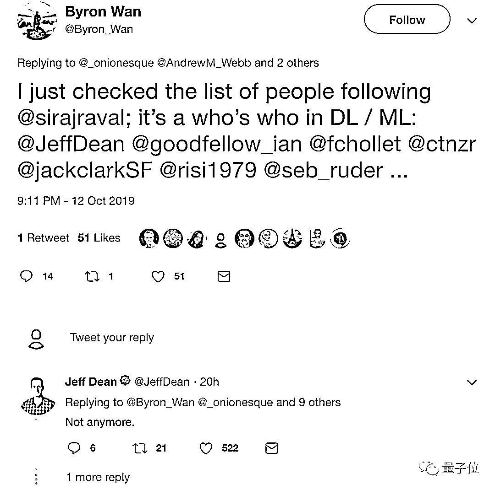

谷歌大脑首席科学家**Douglas Eck**则带头呼吁：这种渣渣，批判他，取关他！

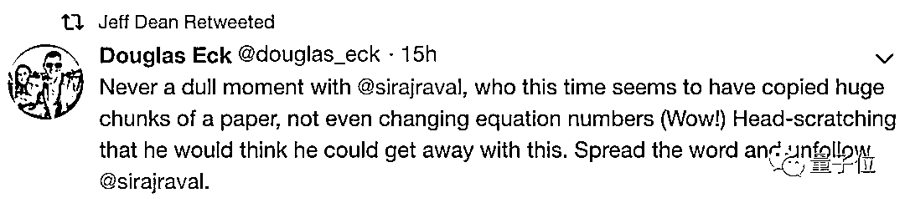

fast.ai 的联合创始人**Rachel Thomas**更是后悔不已： 

> 采访过 Siraj Raval 都成人生污点了。

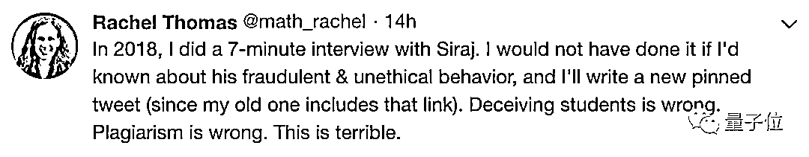

被一众大佬手撕，Siraj Raval（西拉杰·拉瓦尔）何许人也？ 

他是 YouTube 知名播主，其 AI 网络课程在国外大受欢迎。如果要做个类比，他在英语 AI 网课中的知名度，就如同李笑来在币圈一样。

然而现在，这位网红人设崩塌得稀碎，不仅付费网课被指**骗钱**，发表的论文竟然也是赤裸裸的**抄袭**——全靠 Ctrl+C 和 Ctrl+V。

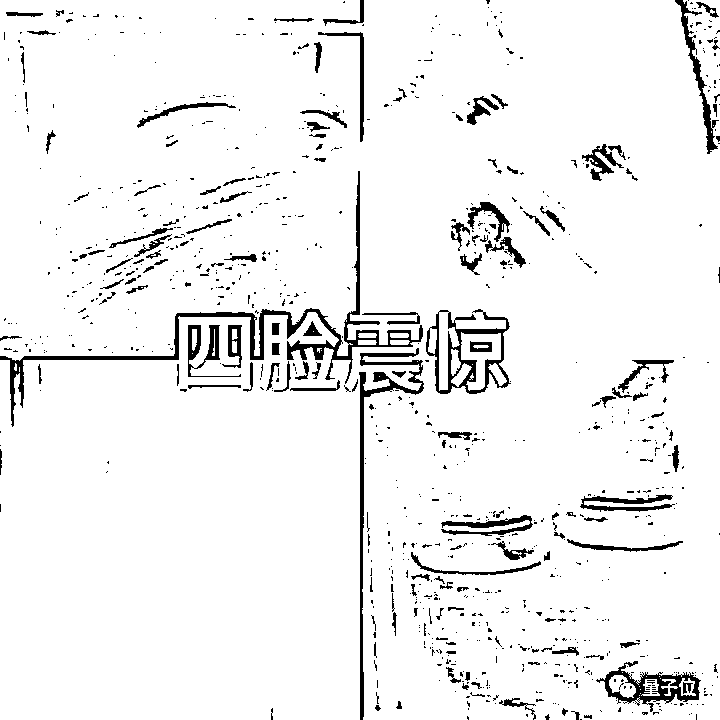

此前被指“骗钱”，Siraj 还依然面不改色心不跳，照常直播蹦跶，还公开引用“自己”论文。

然而说巧不巧，曼彻斯特大学研究员 Andrew M. Webb 随手一查——这样复制粘贴的论文也太侮辱别人智商了吧？

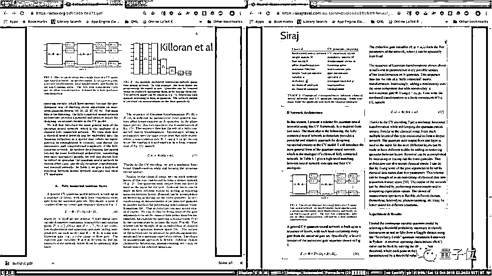

随后鼓破万人捶，更多网友纷纷下场揭露，昔日网红 Siraj，今日底裤都不剩……

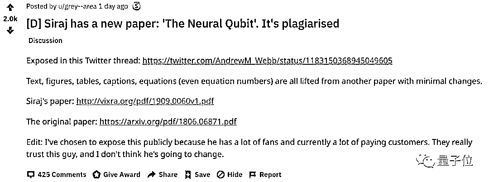

###### **△**扒皮贴 reddit 热度 2000

也算是 AI 太火，泥沙俱下，Siraj 以一己之力，震碎 AI 界三观。

**爆红的网课**

Siraj 有多火爆？看看他曾经的关注者们就知道了：Jeff Dean，Ian Goodfellow，François Chollet…（均已取关）

本科毕业于哥伦比亚大学（被网友质疑是肄业），2016 年开始在 YouTube 上传人工智能、区块链相关课程，Siraj 以这样的画风——

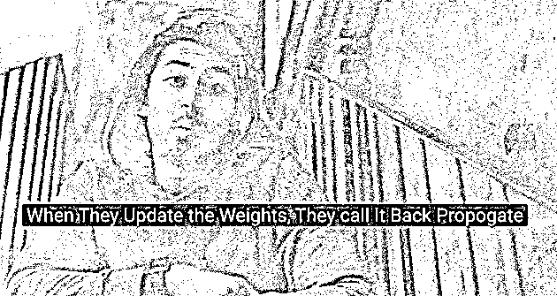

###### **△**唱跳 rap

被称为 AI 界的最强 Rapper。

他还创办了 AI 学习社区 School of AI，并称这是一个非营利组织，旨在为地球上的任何人提供世界一流的 AI 教育。

据称，有超过百万学生看过他的网课。而他在 GitHub 上的每个项目也都几千个星星。

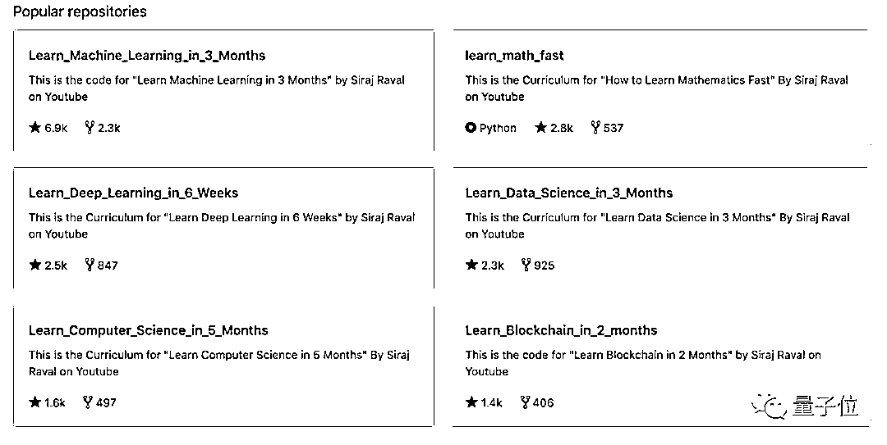

###### **△**Siraj Raval 部分 GitHub 项目

三个月学会数据科学，六星期深度学习速成……几乎每个教程都打着**速成**的旗号。

而且大谈特谈学习 AI 赚钱之道，就差取个“通往财富自由之路”的书名标题了。

因为这履历这口才和这忽悠能力，起初真是追随者众，商业前景一片光明。

不过，在他“顺势”推出了收费课程 Make Money with Machine Learning（用机器学习赚钱）之后，Siraj 摊上事了。

**人设崩塌导火索：利用知识付费骗钱**

让 Siraj 摊上事的是他开设的一门“用机器学习赚钱”网络课程。

光听名字就能知道这是网友们喜闻乐见的知识付费网络课，但价格一点不亲民，比一般 Udacity 和 Coursera 的课程贵很多，全部学完要交 199 美元——折合人民币近 1300 元。

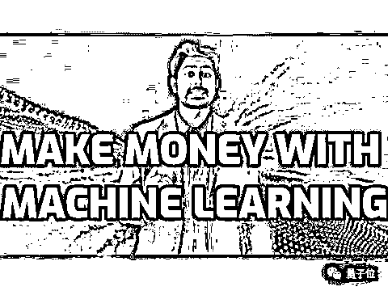

他还声称精力有限，为了专注于少数学生，因此限额 500 人。

即便如此，按照这种限额，这一项课程也能为他入账 10 万美元。

当然，凭着 Siraj 积攒下超高人气，课程爆满肯定不成问题。

但猫腻也就此开始暴露。

付费学员随后发现，Siraj 不仅对课程不建交流群，而且一些学员试图通过聊天软件 Slack 交流时还发现，他们之间根本无法互相联系。

这自然是有意为之。

Siraj 实际采取了分批建群的方法，前后总共招收了 1200 名学生，也就是说以“限量”营销之名，利用信息差，偷偷行扩招之实，目的就是尽可能多赚钱。

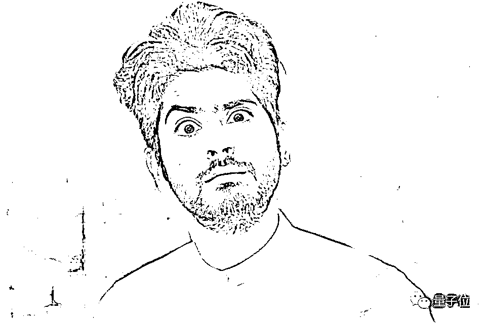

知道真相的学生一来因“虚假宣传”而愤怒，二还发现课程质量和承诺，跟报名时的宣传简直天上地下。

其中重要一项就是**个性化帮助**，完全食言了。

Siraj 只是每周放出 30 分钟的视频课程，并且给大家一段答疑时间。说好的专注于少数学生呢？

更讽刺的是，学生发现课程内容在 GitHub 上都能**免费**找到……这还得了？

拿着免费开源的东西，再删掉 license 声称原创来挣钱，这本身就违反了开源社区的精神，为广大程序员所不齿。

于是学员纷纷要求退款退课，声势越来越大。

但生财有道的 Siraj 又怎会轻易放掉到嘴的肉。他把学员们迁移到另一个聊天软件 Discord 中，且专门设置程序，所有包含“退款”一词的消息，一律被删除。

如果有人去他的 YouTube 或者 Twitter 上回复要求退款，Siraj 则一律把他们拉黑。

随后 Siraj 还在网页上添加了退款政策，但要求是退款必须在注册课程后的 14 天之内完成。

不过这显然违背加州法律，因为消费者有权在 30 天内要求退款。

最终，Siraj 顶不住网友舆论的巨大压力，也可能是出于对吃官司的担忧，他权衡再三后宣布对课程不满意且付款在 30 天之内的学生，可以提供全额退款。

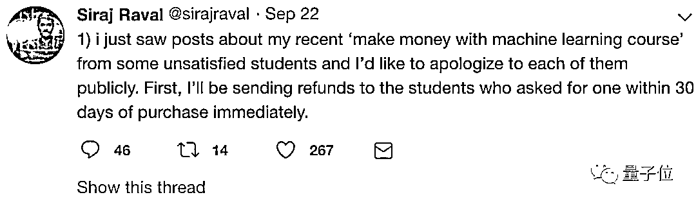

当然，经此一役，网红人设算是崩了。

之前也算侧面“粉”过 Siraj 的 MIT 的教师兼研究员 Lex Fridman，上一周也被网友发现悄然删除了关于 Siraj 的所有推荐。

**论文被发现“像素级”抄袭**

然而事情还不算完。

让 Siraj 人设彻底崩塌的是他“像素级”抄袭他人学术论文。

在这篇帖子下面，一名网友说早就发现了 Siraj 的骗子本质，特别是从他的“Neural Qubit”视频开始。在这个视频里，他只是总结了 Nathan Killoran 论文的结果，添加了一些主观的极具争议性的生物学理论，但却声称是他自己的研究。

甚至他发布到 GitHub 上的代码也只是复制粘贴别人的版本，而且删除了其中的许可证，并更改了一些常量。

昨天，更是有人在 Twitter 上详细分析了 Siraj 和 Nathan Killoran 两篇论文的差异，等于将 Siraj 的抄袭定罪。

可以看到 Siraj 几乎是成段成段的抄袭。两篇文章的的图表、公式甚至是所用的符号都一模一样。

甚至还有细心的网友发现，Siraj 的抄袭可谓是“真·像素级”的，就是真的去截图。

一般做学术的人写论文都会用 LaTeX 编辑公式，而 Siraj 论文里公式的分辨率居然比原论文低。

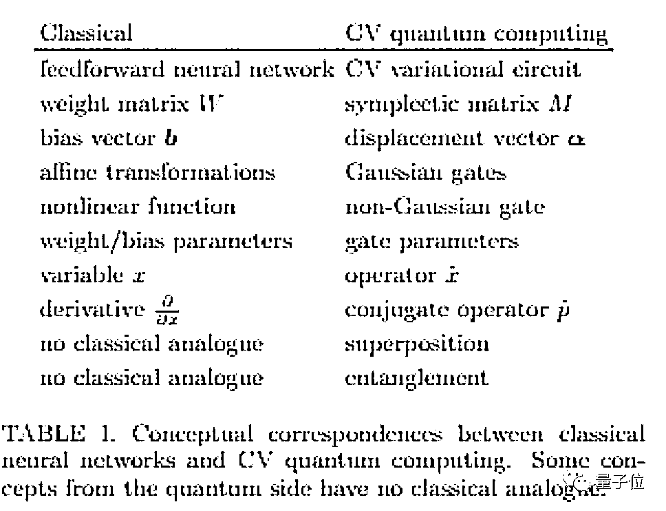

没错他的论文里图表就是这么模糊。一个合理的解释就是，他就是直接复制粘贴别人论文里的图片。

可能连“洗稿”都觉得费力气。

当然，还有人说，也许 Siraj 根本不知道 LaTeX，他的大学成绩是 B，而且也没读过研究生，他没有撰写专业学术论文的能力。

但就算是不会 LaTeX，这抄袭也太不走心了。本科生在粘贴公式的时候，遇到分辨率不佳的情况，还知道去 Word 里编辑一下而不是直接粘贴图片。

难怪有人评价，这简直就是一个**Ctrl+C、Ctrl+V 级别的抄袭**。

**大佬割席，Siraj 道歉**

倘若说 Siraj 网课扩招不过是“恰饭”的姿势不太好看，但是抄袭学术论文、开源代码就等于让自己在圈子里被判了“死刑”。

很多原先关注过 Siraj 的大佬们纷纷表示取消关注，其中就包括谷歌传奇 Jeff Dean。

一位 AI 爱好者说，Jeff 的表态很重要，很多人看到 Jeff 取关，就可以避免 Siraj 的骗局。

Siraj 也看到声势如此，再也不死扛了。

在经历罕见的沉默后，面对着网友挖出的种种证据，Siraj 几个小时前终于在自己的 Twitter 上道歉，并且在全网删除了这篇涉嫌抄袭的论文。

但依然有人被蒙在鼓里，比如欧洲航天局，甚至还邀请他参加活动发表演讲。

只是当初有多少粉丝，现在就有多少黑，热心网友自愿架设“防忽悠咨询热线”，还主动向欧洲航天局发电子邮件，说 Siraj 的学术道德受到质疑，呼吁抵制他的演讲。

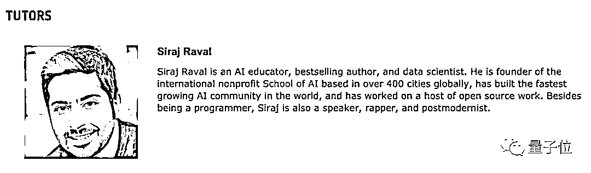

另外值得注意的是，Siraj 这些年来也不忘来中国圈钱。

去年还有国内的区块链社区邀请与之合作，甚至将其称为“机器学习界的耶稣”。

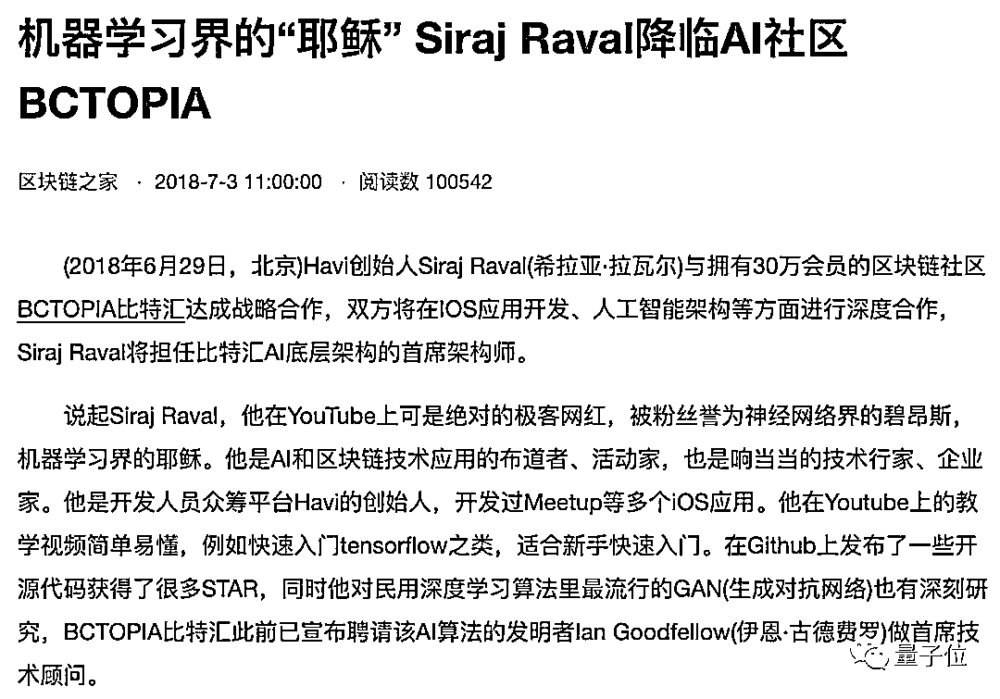

当然，现在复盘追溯，其实 Siraj 行为不端也并非毫无马脚。

但因为之前在机器学习领域具有超高的知名度，加上个人太会营销，之前网友对他圈钱的指责，没有形成声势。

而且 Siraj 起初获得认可，确实也有过人之处，毕竟在这个领域里，活泼多样的讲课形式确实独具特色。

然而动机不纯、突破学术道德底线，还妄图利用信息差赚钱捞金，最后人设难免自取灭亡。

**总之，出来混迟早要还。**

在 AI 领域造假，迟早会被扒皮吊打。是吧？

*—End—*

量化投资与机器学习微信公众号，是业内垂直于**Quant**、**MFE**、**CST、AI**等专业的**主****流量化自媒体**。公众号拥有来自**公募、私募、券商、银行、海外**等众多圈内**18W+**关注者。每日发布行业前沿研究成果和最新量化资讯。你点的每个“在看”，都是对我们最大的鼓励