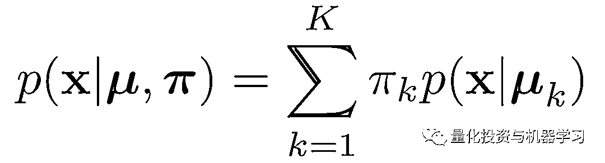

# 一、个等式！3 行代码！78 倍！如何加速机器学习算法？

> 原文：[`mp.weixin.qq.com/s?__biz=MzAxNTc0Mjg0Mg==&mid=2653294873&idx=1&sn=38cd89b1f9df34f01ec7ac2587958393&chksm=802dd30cb75a5a1a69ad91f4b743c509eca5a537d15ff3b59ff53f21f00b08258d45e072cf69&scene=27#wechat_redirect`](http://mp.weixin.qq.com/s?__biz=MzAxNTc0Mjg0Mg==&mid=2653294873&idx=1&sn=38cd89b1f9df34f01ec7ac2587958393&chksm=802dd30cb75a5a1a69ad91f4b743c509eca5a537d15ff3b59ff53f21f00b08258d45e072cf69&scene=27#wechat_redirect)

**标星★公众号     **爱你们♥   

作者：Ioannis Gatopoulos

编译：1+1=6

**近期原创文章：**

## ♥ [5 种机器学习算法在预测股价的应用（代码+数据）](https://mp.weixin.qq.com/s?__biz=MzAxNTc0Mjg0Mg==&mid=2653290588&idx=1&sn=1d0409ad212ea8627e5d5cedf61953ac&chksm=802dc249b75a4b5fa245433320a4cc9da1a2cceb22df6fb1a28e5b94ff038319ae4e7ec6941f&token=1298662931&lang=zh_CN&scene=21#wechat_redirect)

## ♥ [Two Sigma 用新闻来预测股价走势，带你吊打 Kaggle](https://mp.weixin.qq.com/s?__biz=MzAxNTc0Mjg0Mg==&mid=2653290456&idx=1&sn=b8d2d8febc599742e43ea48e3c249323&chksm=802e3dcdb759b4db9279c689202101b6b154fb118a1c1be12b52e522e1a1d7944858dbd6637e&token=1330520237&lang=zh_CN&scene=21#wechat_redirect)

## ♥ 2 万字干货：[利用深度学习最新前沿预测股价走势](https://mp.weixin.qq.com/s?__biz=MzAxNTc0Mjg0Mg==&mid=2653290080&idx=1&sn=06c50cefe78a7b24c64c4fdb9739c7f3&chksm=802e3c75b759b563c01495d16a638a56ac7305fc324ee4917fd76c648f670b7f7276826bdaa8&token=770078636&lang=zh_CN&scene=21#wechat_redirect)

## ♥ [机器学习在量化金融领域的误用！](http://mp.weixin.qq.com/s?__biz=MzAxNTc0Mjg0Mg==&mid=2653292984&idx=1&sn=3e7efe9fe9452c4a5492d2175b4159ef&chksm=802dcbadb75a42bbdce895c49070c3f552dc8c983afce5eeac5d7c25974b7753e670a0162c89&scene=21#wechat_redirect)

## ♥ [基于 RNN 和 LSTM 的股市预测方法](https://mp.weixin.qq.com/s?__biz=MzAxNTc0Mjg0Mg==&mid=2653290481&idx=1&sn=f7360ea8554cc4f86fcc71315176b093&chksm=802e3de4b759b4f2235a0aeabb6e76b3e101ff09b9a2aa6fa67e6e824fc4274f68f4ae51af95&token=1865137106&lang=zh_CN&scene=21#wechat_redirect)

## ♥ [如何鉴别那些用深度学习预测股价的花哨模型？](https://mp.weixin.qq.com/s?__biz=MzAxNTc0Mjg0Mg==&mid=2653290132&idx=1&sn=cbf1e2a4526e6e9305a6110c17063f46&chksm=802e3c81b759b597d3dd94b8008e150c90087567904a29c0c4b58d7be220a9ece2008956d5db&token=1266110554&lang=zh_CN&scene=21#wechat_redirect)

## ♥ [优化强化学习 Q-learning 算法进行股市](https://mp.weixin.qq.com/s?__biz=MzAxNTc0Mjg0Mg==&mid=2653290286&idx=1&sn=882d39a18018733b93c8c8eac385b515&chksm=802e3d3bb759b42d1fc849f96bf02ae87edf2eab01b0beecd9340112c7fb06b95cb2246d2429&token=1330520237&lang=zh_CN&scene=21#wechat_redirect)

## ♥ [WorldQuant 101 Alpha、国泰君安 191 Alpha](https://mp.weixin.qq.com/s?__biz=MzAxNTc0Mjg0Mg==&mid=2653290927&idx=1&sn=ecca60811da74967f33a00329a1fe66a&chksm=802dc3bab75a4aac2bb4ccff7010063cc08ef51d0bf3d2f71621cdd6adece11f28133a242a15&token=48775331&lang=zh_CN&scene=21#wechat_redirect)

## ♥ [基于回声状态网络预测股票价格（附代码）](https://mp.weixin.qq.com/s?__biz=MzAxNTc0Mjg0Mg==&mid=2653291171&idx=1&sn=485a35e564b45046ff5a07c42bba1743&chksm=802dc0b6b75a49a07e5b91c512c8575104f777b39d0e1d71cf11881502209dc399fd6f641fb1&token=48775331&lang=zh_CN&scene=21#wechat_redirect)

## ♥ [计量经济学应用投资失败的 7 个原因](https://mp.weixin.qq.com/s?__biz=MzAxNTc0Mjg0Mg==&mid=2653292186&idx=1&sn=87501434ae16f29afffec19a6884ee8d&chksm=802dc48fb75a4d99e0172bf484cdbf6aee86e36a95037847fd9f070cbe7144b4617c2d1b0644&token=48775331&lang=zh_CN&scene=21#wechat_redirect)

## ♥ [配对交易千千万，强化学习最 NB！（文档+代码）](http://mp.weixin.qq.com/s?__biz=MzAxNTc0Mjg0Mg==&mid=2653292915&idx=1&sn=13f4ddebcd209b082697a75544852608&chksm=802dcb66b75a4270ceb19fac90eb2a70dc05f5b6daa295a7d31401aaa8697bbb53f5ff7c05af&scene=21#wechat_redirect)

## ♥ [关于高盛在 Github 开源背后的真相！](https://mp.weixin.qq.com/s?__biz=MzAxNTc0Mjg0Mg==&mid=2653291594&idx=1&sn=7703403c5c537061994396e7e49e7ce5&chksm=802dc65fb75a4f49019cec951ac25d30ec7783738e9640ec108be95335597361c427258f5d5f&token=48775331&lang=zh_CN&scene=21#wechat_redirect)

## ♥ [新一代量化带货王诞生！Oh My God！](https://mp.weixin.qq.com/s?__biz=MzAxNTc0Mjg0Mg==&mid=2653291789&idx=1&sn=e31778d1b9372bc7aa6e57b82a69ec6e&chksm=802dc718b75a4e0ea4c022e70ea53f51c48d102ebf7e54993261619c36f24f3f9a5b63437e9e&token=48775331&lang=zh_CN&scene=21#wechat_redirect)

## ♥ [独家！关于定量/交易求职分享（附真实试题）](https://mp.weixin.qq.com/s?__biz=MzAxNTc0Mjg0Mg==&mid=2653291844&idx=1&sn=3fd8b57d32a0ebd43b17fa68ae954471&chksm=802dc751b75a4e4755fcbb0aa228355cebbbb6d34b292aa25b4f3fbd51013fcf7b17b91ddb71&token=48775331&lang=zh_CN&scene=21#wechat_redirect)

## ♥ [Quant 们的身份危机！](https://mp.weixin.qq.com/s?__biz=MzAxNTc0Mjg0Mg==&mid=2653291856&idx=1&sn=729b657ede2cb50c96e92193ab16102d&chksm=802dc745b75a4e53c5018cc1385214233ec4657a3479cd7193c95aaf65642f5f45fa0e465694&token=48775331&lang=zh_CN&scene=21#wechat_redirect)

## ♥ [AQR 最新研究 | 机器能“学习”金融吗](http://mp.weixin.qq.com/s?__biz=MzAxNTc0Mjg0Mg==&mid=2653292710&idx=1&sn=e5e852de00159a96d5dcc92f349f5b58&chksm=802dcab3b75a43a5492bc98874684081eb5c5666aff32a36a0cdc144d74de0200cc0d997894f&scene=21#wechat_redirect)

**前言**

众所周知，Python 的 for 循环本质上要比 C 慢很多。 而且深度学习和机器学习算法严重依赖通过 for 循环执行的矩阵运算。

这就是为什么像 numpy 等这样包诞生，它们在 numpy 数组上提供向量化的操作。这意味着它将通常在 Python 中完成的 for 循环推进到 C 的级别。

我们希望将最大期望算法（Expectation-Maximization algorithm, EM）用于无监督学习（例如，识别 MNIST 数据集中的手写数字)，并且我们的数据是二进制的(例如，二进制图像)。一种常见的方法是将数据建模为伯努利混合模型；一个人伯努利分布的加权和，如果每个分布有自己的标量权重π和自己的平均向量μ，并表示一组数据（例如，如果我们的数据是数字 2、3&4 的图形，我们使用 3 伯努利模型，一个伯努利将是数字 2，另一个是 4，等等）。总的来说，前者是一个向量，后者是一个矩阵。

Bernoulli mixture model

Distribution of one observation x given the cluster k 

在 E-step 中，我们特别感兴趣的是隐变量后验的期望值，也就是所谓的 responsibilities。

E-step of EM algorithm

γ实际返回的期望值观察 n 属于集群 k。

γ是一个 NxK 矩阵；对于每个观测，我们分配的一个概率属于每个集群。最大值是我们指定的值。

因为：**向量化过程中最重要的事情是要理解变量的维数。**

*   X : NxD matrix

*   π : 1xK vector

*   μ : KxD matrix

*   γ : NxK matrix

**Pipeline**

我们将创建一个 E_step 函数来计算上面的表达式并用下面的代码进行测试：  

**第一次尝试**

# 在第一次尝试中，我们将使用 for 循环编写所有内容；在向量/矩阵操作中，只使用标量。

通过观察这些方程，我们可以看到有 3 个循环，每个例子 D 有一个循环，每个集群 K 有一个循环，每个对象 D 有一个循环，我们将按这个顺序循环。所以我们要每次用一个元素填充矩阵γ。

下图是结果：

**第二次尝试**

# 最好从内部循环开始，然后逐步进入外部循环。这正是我们要做的！

我们想去掉 for loop D。因此，每个依赖于 D 的 term 应该变成一个向量。在 for loop 中，我们有两个变量；μ和 x。因此 x 和 μ → 向量。问题是，它是 μ**x。

有一个函数，它把一个幂运算变成了乘法运算。没错，就是对数！因此，**让我们使用对数来表示我们的表达式**，然后对结果取指数。

**关于对数概率的操作是首选的，因为它们提供了数值稳定性！**

即使在我们的例子中它没有任何影响，每次你使用对数的时候，在表达式中使用一个常量 epsilon 来表示稳定性（不趋于 0，是-inf）。

因此，我们将不得不对元素进行矢量乘法，easy！

结果是：

**第三次尝试**

一次一个 loop：K turn

在向量化过程中，有如下操作：

**标量→向量→矩阵**

当我们用 numpy 数组替换越来越多的循环时，越来越多的代码将在 C 上运行。

我们使用之前的实现，我们想要删除 K for loop。因此，每一个依赖于 K 的标量都会变成一个向量，每一个向量都会变成一个矩阵。这意味着 X 和μ将保持不变，π变成矩阵，γ变成向量。

结果：

n=1000 的时候，我们只花了一半的时间！

**第四次尝试**

还有一个循环。我们可以有一个 loop-python-free 吗？come on！

由于我们要将**矩阵*向量**运算转换成**矩阵@矩阵**运算，我们需要取前者的传输矩阵（@是正则的矩阵乘法）。记住，现在我们的输出必须是整个γ矩阵。

**一个循环也没有！****代码看起来很优雅，只有三行！**

对于 n=1000，我们的运行时长**从 11.688 下降到 0.012！**

**总结**

那么，当你想向量化一个表达式时，你需要做什么呢？

1、**了解矩阵的大小。**

2、**一支笔一张纸：**写下公式，从一个求和到另一个求和，把它变成一个等价的矩阵运算。

3、**数学是你的朋友：**总是对任何表达式必须返回的维数进行推理；观察相邻的求和操作，因为它们具有相同的维度。

4、一个循环一个循环，一步步：**标量→向量→矩阵。**

5、**取对数**，确保引入标准化常数。

6、为你的方法编写向量版的代码。

*来自：**https://twitter.com/TDataScience*

*—End—*

量化投资与机器学习微信公众号，是业内垂直于**Quant**、**MFE**、**CST、AI**等专业的**主****流量化自媒体**。公众号拥有来自**公募、私募、券商、银行、海外**等众多圈内**18W+**关注者。每日发布行业前沿研究成果和最新量化资讯。你点的每个“在看”，都是对我们最大的鼓励