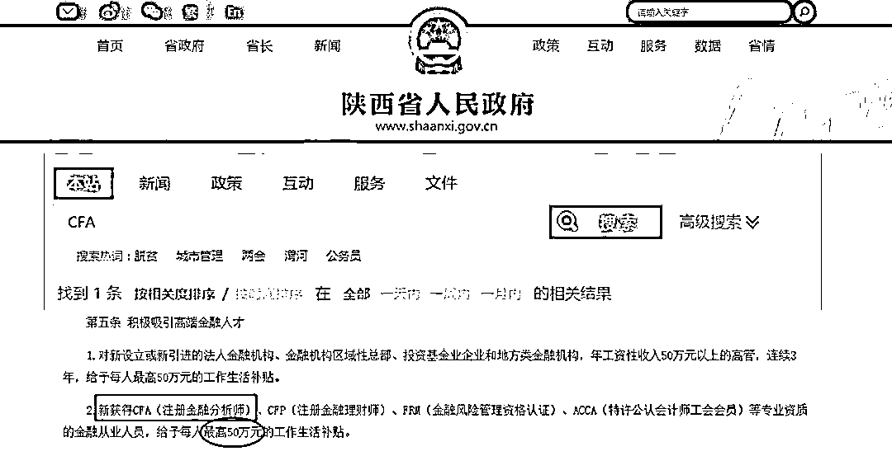
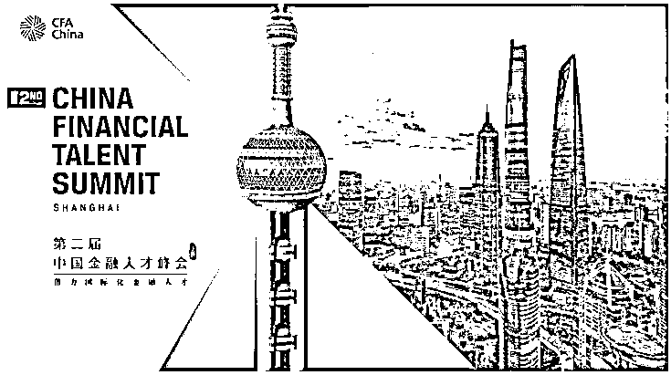
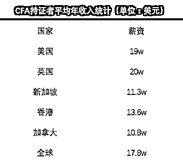

# 请停止盲目备考 CFA！

> 原文：[`mp.weixin.qq.com/s?__biz=MzAxNTc0Mjg0Mg==&mid=2653294854&idx=1&sn=b1781c664c11d5bfb22ad3c5481f72ed&chksm=802dd313b75a5a05db32ff73443e0c0e84029220a60703942d5510552294c3951fc4b146c47d&scene=27#wechat_redirect`](http://mp.weixin.qq.com/s?__biz=MzAxNTc0Mjg0Mg==&mid=2653294854&idx=1&sn=b1781c664c11d5bfb22ad3c5481f72ed&chksm=802dd313b75a5a05db32ff73443e0c0e84029220a60703942d5510552294c3951fc4b146c47d&scene=27#wechat_redirect)

**标星★公众号     **爱你们♥   

来自：UniCareer

作者：Uni 酱

**近期原创文章：**

## ♥ [5 种机器学习算法在预测股价的应用（代码+数据）](https://mp.weixin.qq.com/s?__biz=MzAxNTc0Mjg0Mg==&mid=2653290588&idx=1&sn=1d0409ad212ea8627e5d5cedf61953ac&chksm=802dc249b75a4b5fa245433320a4cc9da1a2cceb22df6fb1a28e5b94ff038319ae4e7ec6941f&token=1298662931&lang=zh_CN&scene=21#wechat_redirect)

## ♥ [Two Sigma 用新闻来预测股价走势，带你吊打 Kaggle](https://mp.weixin.qq.com/s?__biz=MzAxNTc0Mjg0Mg==&mid=2653290456&idx=1&sn=b8d2d8febc599742e43ea48e3c249323&chksm=802e3dcdb759b4db9279c689202101b6b154fb118a1c1be12b52e522e1a1d7944858dbd6637e&token=1330520237&lang=zh_CN&scene=21#wechat_redirect)

## ♥ 2 万字干货：[利用深度学习最新前沿预测股价走势](https://mp.weixin.qq.com/s?__biz=MzAxNTc0Mjg0Mg==&mid=2653290080&idx=1&sn=06c50cefe78a7b24c64c4fdb9739c7f3&chksm=802e3c75b759b563c01495d16a638a56ac7305fc324ee4917fd76c648f670b7f7276826bdaa8&token=770078636&lang=zh_CN&scene=21#wechat_redirect)

## ♥ [机器学习在量化金融领域的误用！](http://mp.weixin.qq.com/s?__biz=MzAxNTc0Mjg0Mg==&mid=2653292984&idx=1&sn=3e7efe9fe9452c4a5492d2175b4159ef&chksm=802dcbadb75a42bbdce895c49070c3f552dc8c983afce5eeac5d7c25974b7753e670a0162c89&scene=21#wechat_redirect)

## ♥ [基于 RNN 和 LSTM 的股市预测方法](https://mp.weixin.qq.com/s?__biz=MzAxNTc0Mjg0Mg==&mid=2653290481&idx=1&sn=f7360ea8554cc4f86fcc71315176b093&chksm=802e3de4b759b4f2235a0aeabb6e76b3e101ff09b9a2aa6fa67e6e824fc4274f68f4ae51af95&token=1865137106&lang=zh_CN&scene=21#wechat_redirect)

## ♥ [如何鉴别那些用深度学习预测股价的花哨模型？](https://mp.weixin.qq.com/s?__biz=MzAxNTc0Mjg0Mg==&mid=2653290132&idx=1&sn=cbf1e2a4526e6e9305a6110c17063f46&chksm=802e3c81b759b597d3dd94b8008e150c90087567904a29c0c4b58d7be220a9ece2008956d5db&token=1266110554&lang=zh_CN&scene=21#wechat_redirect)

## ♥ [优化强化学习 Q-learning 算法进行股市](https://mp.weixin.qq.com/s?__biz=MzAxNTc0Mjg0Mg==&mid=2653290286&idx=1&sn=882d39a18018733b93c8c8eac385b515&chksm=802e3d3bb759b42d1fc849f96bf02ae87edf2eab01b0beecd9340112c7fb06b95cb2246d2429&token=1330520237&lang=zh_CN&scene=21#wechat_redirect)

## ♥ [WorldQuant 101 Alpha、国泰君安 191 Alpha](https://mp.weixin.qq.com/s?__biz=MzAxNTc0Mjg0Mg==&mid=2653290927&idx=1&sn=ecca60811da74967f33a00329a1fe66a&chksm=802dc3bab75a4aac2bb4ccff7010063cc08ef51d0bf3d2f71621cdd6adece11f28133a242a15&token=48775331&lang=zh_CN&scene=21#wechat_redirect)

## ♥ [基于回声状态网络预测股票价格（附代码）](https://mp.weixin.qq.com/s?__biz=MzAxNTc0Mjg0Mg==&mid=2653291171&idx=1&sn=485a35e564b45046ff5a07c42bba1743&chksm=802dc0b6b75a49a07e5b91c512c8575104f777b39d0e1d71cf11881502209dc399fd6f641fb1&token=48775331&lang=zh_CN&scene=21#wechat_redirect)

## ♥ [计量经济学应用投资失败的 7 个原因](https://mp.weixin.qq.com/s?__biz=MzAxNTc0Mjg0Mg==&mid=2653292186&idx=1&sn=87501434ae16f29afffec19a6884ee8d&chksm=802dc48fb75a4d99e0172bf484cdbf6aee86e36a95037847fd9f070cbe7144b4617c2d1b0644&token=48775331&lang=zh_CN&scene=21#wechat_redirect)

## ♥ [配对交易千千万，强化学习最 NB！（文档+代码）](http://mp.weixin.qq.com/s?__biz=MzAxNTc0Mjg0Mg==&mid=2653292915&idx=1&sn=13f4ddebcd209b082697a75544852608&chksm=802dcb66b75a4270ceb19fac90eb2a70dc05f5b6daa295a7d31401aaa8697bbb53f5ff7c05af&scene=21#wechat_redirect)

## ♥ [关于高盛在 Github 开源背后的真相！](https://mp.weixin.qq.com/s?__biz=MzAxNTc0Mjg0Mg==&mid=2653291594&idx=1&sn=7703403c5c537061994396e7e49e7ce5&chksm=802dc65fb75a4f49019cec951ac25d30ec7783738e9640ec108be95335597361c427258f5d5f&token=48775331&lang=zh_CN&scene=21#wechat_redirect)

## ♥ [新一代量化带货王诞生！Oh My God！](https://mp.weixin.qq.com/s?__biz=MzAxNTc0Mjg0Mg==&mid=2653291789&idx=1&sn=e31778d1b9372bc7aa6e57b82a69ec6e&chksm=802dc718b75a4e0ea4c022e70ea53f51c48d102ebf7e54993261619c36f24f3f9a5b63437e9e&token=48775331&lang=zh_CN&scene=21#wechat_redirect)

## ♥ [独家！关于定量/交易求职分享（附真实试题）](https://mp.weixin.qq.com/s?__biz=MzAxNTc0Mjg0Mg==&mid=2653291844&idx=1&sn=3fd8b57d32a0ebd43b17fa68ae954471&chksm=802dc751b75a4e4755fcbb0aa228355cebbbb6d34b292aa25b4f3fbd51013fcf7b17b91ddb71&token=48775331&lang=zh_CN&scene=21#wechat_redirect)

## ♥ [Quant 们的身份危机！](https://mp.weixin.qq.com/s?__biz=MzAxNTc0Mjg0Mg==&mid=2653291856&idx=1&sn=729b657ede2cb50c96e92193ab16102d&chksm=802dc745b75a4e53c5018cc1385214233ec4657a3479cd7193c95aaf65642f5f45fa0e465694&token=48775331&lang=zh_CN&scene=21#wechat_redirect)

## ♥ [AQR 最新研究 | 机器能“学习”金融吗](http://mp.weixin.qq.com/s?__biz=MzAxNTc0Mjg0Mg==&mid=2653292710&idx=1&sn=e5e852de00159a96d5dcc92f349f5b58&chksm=802dcab3b75a43a5492bc98874684081eb5c5666aff32a36a0cdc144d74de0200cc0d997894f&scene=21#wechat_redirect)

如今 CFA 证书越来越火了

大多数认为想做金融必须要考

但也有不少人说 CFA 证书没用

**那事实究竟是怎样的？**

**CFA 证书到底有没有用？**

**谁需要考 CFA？**

**证书是锦上添花, 并非雪中送炭 **

由于国内求职竞争日益激烈、企业招聘标准逐年提高，在日益紧张的就业环境中，越来越多的学生想通过考证来增加自己的就业筹码。**而在求职市场中，尤其是金融行业，企业也明确表达对证书的偏好。于是越来越多的人都成为了考证大军的一员。**

*图片来源：网络

与此同时，在大环境的影响下，很多没有明确目标的在校生/求职者选择随大流考取证书，更加剧了这类现象。**据各大证书报考官网显示，去年全球共 227,031 名考生报名 CFA 考生，其中亚太地区占比最大，参加考试人数占总人数的 53%之多。**相较往年，同比增长达 33%。

*图片来源：网络

很多人大学四年都忙于考证，为了进投行，他们考 CPA、CFA、FRM、ACCA，在他们看来，多一个证书就能多一些竞争力。却很少有人去想自己到底需不需考这个证书，这个证书到底能对自己起多大用，到底什么行业才需要这个证书。

**像 CPA 是会计岗位唯一认可的会计相关证书，由注册会计师依法执行审计业务出具的报告，具有法定证明效力。**一般公司会主动要求员工考取证书，而四大和不少其他会计事务所也都会提供带薪休假(参加考试)、考试费用报销等福利。

**而最适合考 FRM 的是 Risk Management 类岗位。**FRM 由美国全球风险管理协会颁发和认证，是全球金融风险管理领域含金量极高的认证。有相关数据统计，54%的持证人受雇于投行，12%的持证人受雇于证券公司。

**像 Equity Research、Asset Management 这类岗位会就非常需要 CFA 证书了**，因为这些岗位需要宏观的金融知识面，以及证书来证明他们的权威性。**而像 IBD、S&T 类的岗位，CFA 证书并不适用，因为这些岗位非常强调实习经验和 Soft Skill。**

曾经某投行高管公开放话不欣赏盲目考 CFA 的人，他的理由是：

CFA 协会建议，平均每个级别的备考时间约 300 小时，所以考完三级一共是 900 小时。而在同样的时间里，你可以参加 900 家银行的面试；或者用更少点的时间做一次完整的投行实习（10 周×80 小时/周）；也可以用同样的时间学习一门外语（12 周*40 小时/周活的基本语言熟练度）。**高含金量的实习经历远比 CFA 证书更容易敲开投行大门。**

所以如果你大三参加实习，然后在大四已经拿到全职的 Return Offer，**那本科毕业的那一年就可以报名 Level I 了**。因为 CFA 的考试内容比较全面，综合的介绍了各类金融领域，适合有一定金融专业基础的同学入门。

**许多人考 CFA 是因为持证福利好**

**1、国家大力支持**

在全球一体化特别是中国“一带一路”战略实施的大背景下，国家、市场以及企业都迫切需要具有国际化视野的专业金融人才。比如在陕西，获得 CFA（注册金融分析师）、CFP（注册金融理财师）等专业资质的金融从业人员，**给予每人最高 50 万元的工作生活补贴。**

*图片来源：陕西省人民政府官网

在北京，对于拥有 CFA、FRM 等持证资格的人，在个人所得税方面给予优惠待遇，**并对于来京工作的可办理调京手续并办理本市户口**；其子女可在京参加高考，录取时与北京市户籍考生享受同等待遇等方面给予照顾和便利等。

在深圳，17 年 1 月 1 号之后取得证书并且在深圳金融系统全职工作满 2 年的，按照用人单位提供的**考试费用补贴给予 1:1 奖励补贴，每人不超过 5 万元**。获得 CFA 证书，办理“鸿儒卡”等高层次就业人才配套政策，**还可以申请 100 平方米公租房或每月 3200 元租房补贴。**

不仅这几个城市，像**上海、成都、天津、广州、青岛、厦门、南京、佛山**等城市都有相关人才福利政策，补贴、房子、落户等福利都另大家两眼放光。

**2、入职行业核心岗位**

CFA 官方曾在报告中指出，CFA 持证人正广泛受雇于**摩根大通、瑞银、RBC、美国银行 ML、汇丰银行、富国银行、摩根士丹利、花旗集团、贝莱德、瑞士信贷和华尔街顶级金融公司等**雇主：

*图片来源：CFA Institute®

CFA 培养高端金融人才，大多从事金融行业优质/核心的工作岗位，**50%以上的持证人是投资经理/基金经理/以及企业高管 CFO、CEO。**

*图片来源：网络

**3、拓宽优质的人脉圈子**

在 CFA 官网报名，即成为 CFA 会员，可以参加 CFA 协会举办的多种学员活动；同时在学习 CFA 的过程中，也可以认识一群优秀的金融从业人员，从而拓展自己的人脉圈子。

*图片来源：CFA Institute®

**持证者薪资待遇将更丰厚 **

除了优秀的国家福利政策，能拓宽自己的人脉圈子外，最能吸引大家报考 CFA 的原因大概就是“升职加薪”选项！ 

金融圈最被人羡慕的就是高额奖金，动辄几十上百万的奖金让人羡慕的眼红。而 CFA 作为金融第一证，对高薪高奖金的帮助也是极其明显的。有数据表明，某人力资源网站曾对 CFA 人才薪水做过一份调查，结果显示：**持有 CFA 证书的从业者，比没有持证的同事薪水高出 24%左右。**

*图片来源：网络

**这种薪资的差距，在拥有十年以上工作经验的人群中能达到二十万美元，最高时能达到二十五万美元。**而如果不考虑工作经验，是否拥有 CFA 证书对薪资的影响差距更大，最高值在 54%左右，而具体数额也在十一万美元到十八万美元之间。

在具体薪资方面，以美国、英国、香港为例，哪怕是与哈佛 MBA12.8 万美元的年收入相比较，CFA 持证人也是完胜。

*图片来源：网络

另外，哪怕只是通过了 CFA 一级、二级考试，薪资水平也会发生巨大变化，有职业教育培训机构的数据表明，在分别通过 CFA 一级、二级、三级的学员中，薪资水平也是逐步上升。

*图片来源：网络

而在国内，薪资或许还无法和国际水平比肩，但从企业招聘时开出的薪资水平来看，**不算奖金，薪资也达到了 40 万 RMB 以上**。所以说，只要金融圈高薪高奖金的大环境不变，CFA 持证人想拿到高薪水并不难。

很多人都是通过 CFA 实现了薪资三级跳，自己也从金融圈的底层登上了更高的位置。据**权威调查统计 CFA 年收入统计(单位：美元)，如下：**

*图片来源：网络

而也有充分的数据证明，持有 CFA 证书的从业者，比没有持证的同事薪水高出 24%左右。一些金融机构的负责人也明确表示，他们更愿意给持有 CFA 这样国际资格证书的员工开出更高的薪水，同时对他们也有更多的期待。

就像高盛新任 CEO 大卫·所罗门说：**投资是绩效滞后的工作，但是拥有 CFA 资格的员工总能带来惊喜。**

*图片来源：网络

**CFA 持证者都选择去哪里工作？  **

不管从雇员总数还是增长速度而言，**JP 一直是全球最大的 CFA 雇主**。从 TOP 10 的榜单中可以看到，不管是以投行为代表的 Sell side，还是私募基金所属的 Buy side，都不乏 CFA 的持证者。  

**在中国大陆拥有最多 CFA 持证人的雇主包括**：普华永道、中国银行、中国工商银行、中国国际金融有限公司、汇丰银行、中国中信集团、法国巴黎银行、瑞银、德勤、安永会计师事务所、中国平安保险、招商局集团、国泰君安证券股份有限公司等。

*图片来源：网络

而当我们转换到行业视角，从 efinancialcareers18 年的数据反映出来的结果，从业人员最需要 CFA 的领域是：

资管>金融与会计>投行 M&A>财富管理>私募>风险管理>... ...

虽然是锦上添花，但**刚入职 0-3 年和工作 3-5 年**的不少人还是会选择考 CFA 的“不归路”为自己在投行、银行、基金、信托、期货等金融机构核心业务岗位补充基础知识。

但尽管备考的人只增不减，已经飙到了 26 万，不过这 26 万人显然是这几年不太好的一届，因为 Bloomberg 马上站出来打脸了：

*图片来源：Bloomberg Businessweek

**18 年过 CFA 2 级的人数刷新 13 年以来的最低记录，过 1 级的比例也仅仅是和去年（43%）持平罢了。**毕竟 Notes、Mock 题目、错题、教材加起来多到吓人，在微博上随便一搜，就能看到备考 CFA 的小伙伴晒出厚厚的一摞复习资料...

*图片来源：微博 | CFA 复习材料

**选择比努力更重要**

**祝各位加油！**

*—End—*

量化投资与机器学习微信公众号，是业内垂直于**Quant**、**MFE**、**CST、AI**等专业的**主****流量化自媒体**。公众号拥有来自**公募、私募、券商、银行、海外**等众多圈内**18W+**关注者。每日发布行业前沿研究成果和最新量化资讯。你点的每个“在看”，都是对我们最大的鼓励