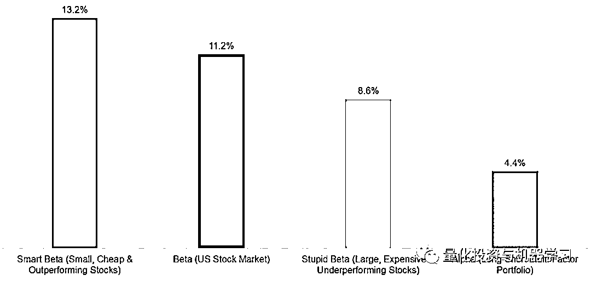
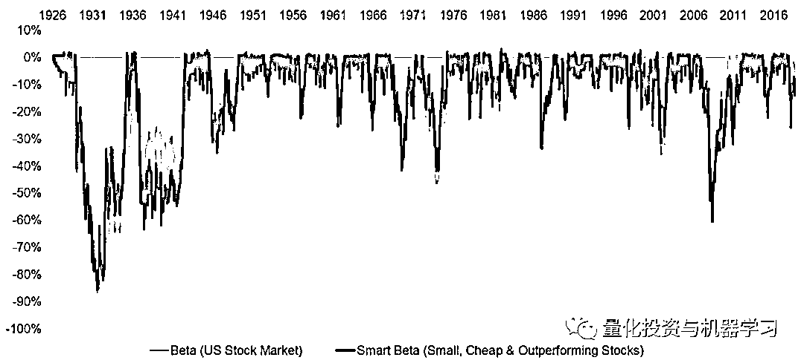
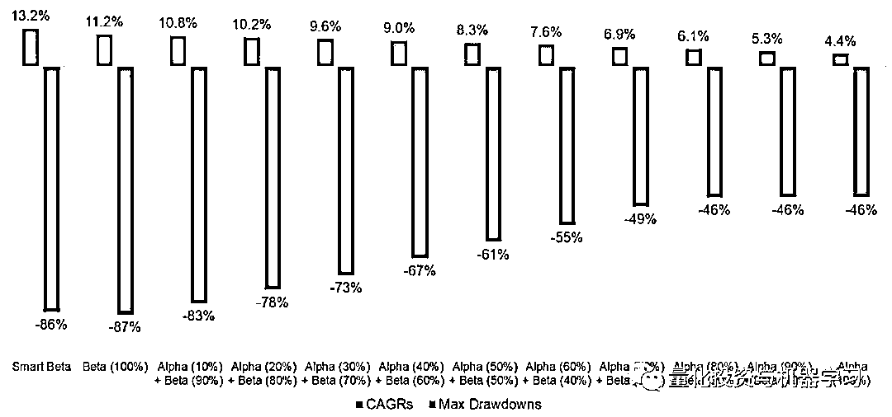
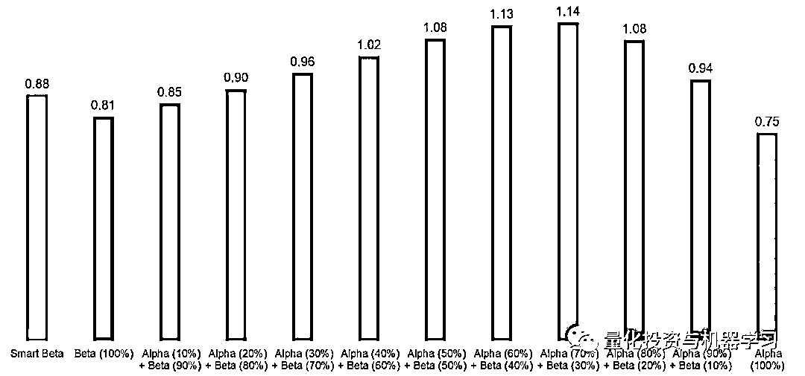
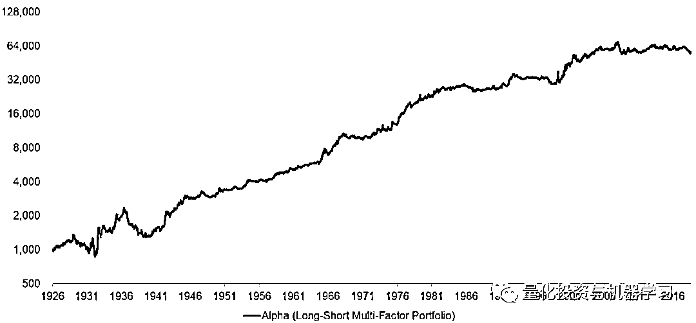
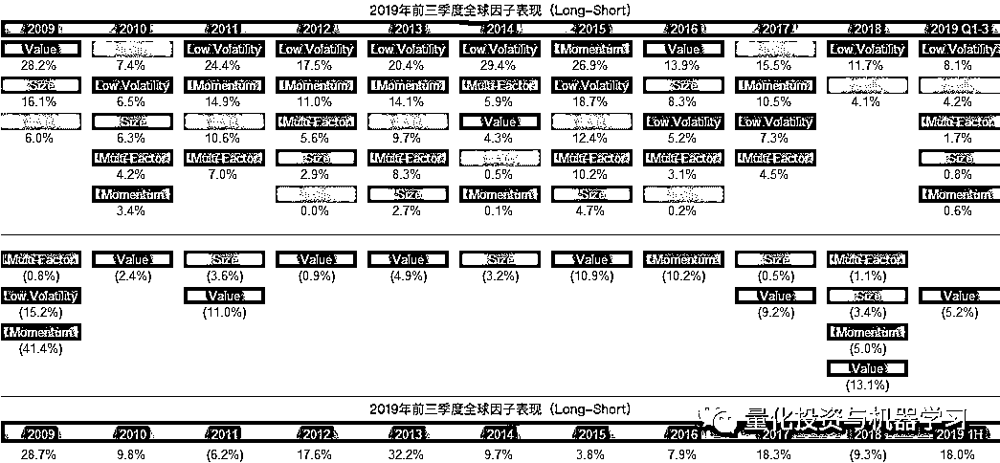
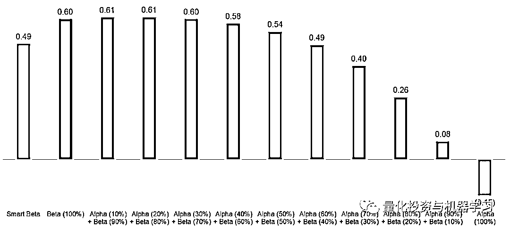
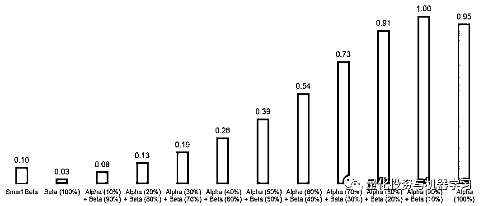

# Smart Beta VS Alpha+Beta

> 原文：[`mp.weixin.qq.com/s?__biz=MzAxNTc0Mjg0Mg==&mid=2653294844&idx=1&sn=78957f8ff120458546d619a3cdfb6bcf&chksm=802dd2e9b75a5bff94fa8f15128085547f93bf65d16601cd5ff080b63344eac06670c5c2ea31&scene=27#wechat_redirect`](http://mp.weixin.qq.com/s?__biz=MzAxNTc0Mjg0Mg==&mid=2653294844&idx=1&sn=78957f8ff120458546d619a3cdfb6bcf&chksm=802dd2e9b75a5bff94fa8f15128085547f93bf65d16601cd5ff080b63344eac06670c5c2ea31&scene=27#wechat_redirect)

**标星★公众号     **爱你们♥   

作者：Nicolas Rabener

编译：1=1=6

**近期原创文章：**

## ♥ [5 种机器学习算法在预测股价的应用（代码+数据）](https://mp.weixin.qq.com/s?__biz=MzAxNTc0Mjg0Mg==&mid=2653290588&idx=1&sn=1d0409ad212ea8627e5d5cedf61953ac&chksm=802dc249b75a4b5fa245433320a4cc9da1a2cceb22df6fb1a28e5b94ff038319ae4e7ec6941f&token=1298662931&lang=zh_CN&scene=21#wechat_redirect)

## ♥ [Two Sigma 用新闻来预测股价走势，带你吊打 Kaggle](https://mp.weixin.qq.com/s?__biz=MzAxNTc0Mjg0Mg==&mid=2653290456&idx=1&sn=b8d2d8febc599742e43ea48e3c249323&chksm=802e3dcdb759b4db9279c689202101b6b154fb118a1c1be12b52e522e1a1d7944858dbd6637e&token=1330520237&lang=zh_CN&scene=21#wechat_redirect)

## ♥ 2 万字干货：[利用深度学习最新前沿预测股价走势](https://mp.weixin.qq.com/s?__biz=MzAxNTc0Mjg0Mg==&mid=2653290080&idx=1&sn=06c50cefe78a7b24c64c4fdb9739c7f3&chksm=802e3c75b759b563c01495d16a638a56ac7305fc324ee4917fd76c648f670b7f7276826bdaa8&token=770078636&lang=zh_CN&scene=21#wechat_redirect)

## ♥ [机器学习在量化金融领域的误用！](http://mp.weixin.qq.com/s?__biz=MzAxNTc0Mjg0Mg==&mid=2653292984&idx=1&sn=3e7efe9fe9452c4a5492d2175b4159ef&chksm=802dcbadb75a42bbdce895c49070c3f552dc8c983afce5eeac5d7c25974b7753e670a0162c89&scene=21#wechat_redirect)

## ♥ [基于 RNN 和 LSTM 的股市预测方法](https://mp.weixin.qq.com/s?__biz=MzAxNTc0Mjg0Mg==&mid=2653290481&idx=1&sn=f7360ea8554cc4f86fcc71315176b093&chksm=802e3de4b759b4f2235a0aeabb6e76b3e101ff09b9a2aa6fa67e6e824fc4274f68f4ae51af95&token=1865137106&lang=zh_CN&scene=21#wechat_redirect)

## ♥ [如何鉴别那些用深度学习预测股价的花哨模型？](https://mp.weixin.qq.com/s?__biz=MzAxNTc0Mjg0Mg==&mid=2653290132&idx=1&sn=cbf1e2a4526e6e9305a6110c17063f46&chksm=802e3c81b759b597d3dd94b8008e150c90087567904a29c0c4b58d7be220a9ece2008956d5db&token=1266110554&lang=zh_CN&scene=21#wechat_redirect)

## ♥ [优化强化学习 Q-learning 算法进行股市](https://mp.weixin.qq.com/s?__biz=MzAxNTc0Mjg0Mg==&mid=2653290286&idx=1&sn=882d39a18018733b93c8c8eac385b515&chksm=802e3d3bb759b42d1fc849f96bf02ae87edf2eab01b0beecd9340112c7fb06b95cb2246d2429&token=1330520237&lang=zh_CN&scene=21#wechat_redirect)

## ♥ [WorldQuant 101 Alpha、国泰君安 191 Alpha](https://mp.weixin.qq.com/s?__biz=MzAxNTc0Mjg0Mg==&mid=2653290927&idx=1&sn=ecca60811da74967f33a00329a1fe66a&chksm=802dc3bab75a4aac2bb4ccff7010063cc08ef51d0bf3d2f71621cdd6adece11f28133a242a15&token=48775331&lang=zh_CN&scene=21#wechat_redirect)

## ♥ [基于回声状态网络预测股票价格（附代码）](https://mp.weixin.qq.com/s?__biz=MzAxNTc0Mjg0Mg==&mid=2653291171&idx=1&sn=485a35e564b45046ff5a07c42bba1743&chksm=802dc0b6b75a49a07e5b91c512c8575104f777b39d0e1d71cf11881502209dc399fd6f641fb1&token=48775331&lang=zh_CN&scene=21#wechat_redirect)

## ♥ [计量经济学应用投资失败的 7 个原因](https://mp.weixin.qq.com/s?__biz=MzAxNTc0Mjg0Mg==&mid=2653292186&idx=1&sn=87501434ae16f29afffec19a6884ee8d&chksm=802dc48fb75a4d99e0172bf484cdbf6aee86e36a95037847fd9f070cbe7144b4617c2d1b0644&token=48775331&lang=zh_CN&scene=21#wechat_redirect)

## ♥ [配对交易千千万，强化学习最 NB！（文档+代码）](http://mp.weixin.qq.com/s?__biz=MzAxNTc0Mjg0Mg==&mid=2653292915&idx=1&sn=13f4ddebcd209b082697a75544852608&chksm=802dcb66b75a4270ceb19fac90eb2a70dc05f5b6daa295a7d31401aaa8697bbb53f5ff7c05af&scene=21#wechat_redirect)

## ♥ [关于高盛在 Github 开源背后的真相！](https://mp.weixin.qq.com/s?__biz=MzAxNTc0Mjg0Mg==&mid=2653291594&idx=1&sn=7703403c5c537061994396e7e49e7ce5&chksm=802dc65fb75a4f49019cec951ac25d30ec7783738e9640ec108be95335597361c427258f5d5f&token=48775331&lang=zh_CN&scene=21#wechat_redirect)

## ♥ [新一代量化带货王诞生！Oh My God！](https://mp.weixin.qq.com/s?__biz=MzAxNTc0Mjg0Mg==&mid=2653291789&idx=1&sn=e31778d1b9372bc7aa6e57b82a69ec6e&chksm=802dc718b75a4e0ea4c022e70ea53f51c48d102ebf7e54993261619c36f24f3f9a5b63437e9e&token=48775331&lang=zh_CN&scene=21#wechat_redirect)

## ♥ [独家！关于定量/交易求职分享（附真实试题）](https://mp.weixin.qq.com/s?__biz=MzAxNTc0Mjg0Mg==&mid=2653291844&idx=1&sn=3fd8b57d32a0ebd43b17fa68ae954471&chksm=802dc751b75a4e4755fcbb0aa228355cebbbb6d34b292aa25b4f3fbd51013fcf7b17b91ddb71&token=48775331&lang=zh_CN&scene=21#wechat_redirect)

## ♥ [Quant 们的身份危机！](https://mp.weixin.qq.com/s?__biz=MzAxNTc0Mjg0Mg==&mid=2653291856&idx=1&sn=729b657ede2cb50c96e92193ab16102d&chksm=802dc745b75a4e53c5018cc1385214233ec4657a3479cd7193c95aaf65642f5f45fa0e465694&token=48775331&lang=zh_CN&scene=21#wechat_redirect)

## ♥ [AQR 最新研究 | 机器能“学习”金融吗](http://mp.weixin.qq.com/s?__biz=MzAxNTc0Mjg0Mg==&mid=2653292710&idx=1&sn=e5e852de00159a96d5dcc92f349f5b58&chksm=802dcab3b75a43a5492bc98874684081eb5c5666aff32a36a0cdc144d74de0200cc0d997894f&scene=21#wechat_redirect)

**前言**

在佛教文化中，阻止修行人提升到更高境界的三大障碍是：

**无知、贪婪、愤怒**

这让修行的人不能更进一层，也无法让我们成为成功的投资者。

大多数投资者仍然相信，只要运用高超的选股技巧，我们就能够超越市场。在选择股票时，我们也倾向于贪婪和追逐业绩。 我们的投资决策，应该尽可能在冷静的状态下做出，但在大多数情况下，却受到了情绪的影响，在这其中就包括愤怒。

正如冥想可以集中注意力一样，对于大多数投资组合也可以做同样的事情。一个代表整个股票市场的 ETF 可以满足平衡投资组合的股票配置。如果业绩优异是一项强制性要求，那么，除了因子投资，其他系统性和 Research-backed 的策略，也可能是我们的选择之一。

但是，因子投资有其自身的复杂性。自金融危机以来，一波单因子和多因子的 Smart Beta 产品已经问世。然而，它们却不伦不类，是一些带有因子倾斜且 long-only 的指数产品，。

那么，我们可以通过分离 Alpha 和 Beta 来创建一个简单而又纯净的股票投资组合呢？我们能做些什么来改变人类天生的弱点，这些弱点会破坏我们的投资决策吗？

**美股的因子投资**

### 尽管研究表明，选股基本上是一种失败的游戏，但随着时间的推移，因子投资已经产生了正的超额收益。

将小型、廉价和表现优于股票组合在一起的投资组合是一种典型的因子策略。根据 Kenneth R. French data Library 的数据，从 1926 年到 2019 年，这样的投资组合远超过美国股市。然而，押注于大型、昂贵且表现不佳的股票，结果反而不是很好。

我们可以通过一个多空投资组合来构建这两种策略之间的差异，包括规模、价值和动量因子。

**美股因子投资：CAGRs，1926-2019**

来自：Kenneth R. French Data Library

尽管我们将这个投资组合的收益称为 Alpha，但这并不完全正确，因为这个术语在技术上指的是无法解释的超额收益。但是，在这种情况下，我们了解了收益的来源，我们或许可以更好地将其描述为“另类 Beta 收益”，但这可能掩盖了它所揭示的一切。为了简单起见，我们将使用 Alpha 来表示因子的超额收益。

**风险和 Smart Beta**

基于历史收益率，一个 Smart Beta 投资组合在 1926 年至 2019 年期间的表现优于美股。但这两家公司经常会出现超过 30%的资产缩水，这将使它们难以长期持有。

从概念上讲，多数投资者对撤资并不介意。他们可以等待。但有证据表明，当我们的损失增加时，我们会挣扎，会倾向于在市场触底或接近触底时减持，这使得我们在市场复苏时投资不足。

**我们可以通过投资高质量、低波动性的股票来改善 Smart Beta 投资组合，这些股票被认为可以提供下行保护**。尽管这可能会导致小幅的减持，但这仍然只是 long-only，且与股市高度相关。毕竟，Smart Beta 仍然是 Beta。从数字感知上来说，18%或 20%的降幅是没有什么区别的。

**美股市场上 Smart Beta 投资组合最大回撤**

来自：Kenneth R. French Data Library

**Smart Beta VS Alpha+Beta**

**我们可以将股票市场和多空多因子投资组合结合起来进行配置，而不是通过选择按因子排序的股票来构造一个 Smart Beta**。我们可以通过 ETF 或流动性较强的另类共同基金来构建 Alpha+Beta 策略。标普 500 的 Beta 成本几乎为零，多空多因子 ETFs 的定价远低于 1%，因此其总成本与 Smart Beta ETFs 相当。

那么，**Alpha+Beta 相对于 Smart Beta 的关键优势是什么呢?**

1、一个 Smart Beta 投资组合缺乏清晰度，需要持续的业绩归因分析来区分 Beta 和因子收益。**一个 Alpha+Beta 投资组合更容易确定是否产生了超额收益。**

2、在投资组合构建中，Smart Beta 和因子投资之间存在显著差异。**配置一个多因子 long–short 投资组合可以得到与因子投资为基础的学术研究相一致的收益。**

3、Smart Beta ETFs 与股市的相关性大于 0.9。相比之下，多因子 long–short 投资组合与 Beta 的相关性为零。 因此，在平衡投资组合中，Alpha 可以部分替代债券。在低利率环境下，这是一个有趣的观点。**Alpha 的投资组合权重可以根据投资者的风险偏好进行调整：风险厌恶程度越高，Beta 的风险敞口就越小。**

我们创建了一系列 Alpha+Beta 投资组合，投资于美股市场和多空多因子投资组合，其中包括规模、价值和动量因子。虽然我们没有包括交易成本，但投资组合每年都会重新平衡，以使其最小化。

Smart Beta 组合的 CAGR 最高，其次是市场（Beta） ，然后是各种 Alpha+Beta 组合。这在一定程度上反映了在稳步上涨的股市中：**复利的力量**。

**CAGR**：是 Compound Annual Growth Rate 的缩写，意思是复合年均增长率。复合年均增长率是指：一项投资在特定时期内的年度增长率。其计算方法为总增长率百分比的 n 方根，n 相等于有关时期内的年数。

事后看来，无论复利的好处是什么，投资者都必须坚持 Smart Beta 投资组合。在最高削减超过 80%的情况下，这将是一个挑战。Alpha+Beta 组合避免了如此剧烈的下跌**。理论上，投资者想要获得最大的收益，但实际上，我们需要一个平稳的过程来进行投资。**

**Smart Beta VS Alpha+Beta CAGRs 和最大回撤（1926 - 2019）**

来自：FactorResearch

将焦点转移到风险调整后的收益上，我们就可以计算出风险收益率。**几乎每一个 Alpha+Beta 投资组合都高于 Smart Beta 或 Beta。Beta 和 Alpha 之间的相关性接近于零，这产生了显著的多样化收益。**

考虑到风险调整后的收益率相对于 Smart Beta 或 Beta 更高，那些担心 Alpha+Beta 投资组合 CAGR 较低的人可以采用更高的杠杆，尽管这自然会增加成本和复杂性。

**Smart Beta 与 Alpha+Beta 风险收益率（1926 - 2019）**

来自：FactorResearch

**在更具挑战性的时期进行因子投资**

从长期来看，因子投资产生了诱人的收益。但在过去的 10 年里，一个多因子 long–short 组合的表现却令人失望。1926 年至 2019 年的年超额收益为 4.4%，2009 年至 2019 年为-0.9%。尽管低波动性等其他因子同期表现良好，但因子投资者可能会有一些怀疑或诱惑，以减少他们的损失。

**美股市因子投资（Long–Short）**

来自：FactorResearch

如何解释我们的 long–short 多因子投资组合在过去十年表现平平？结构变化是原因之一吗？十年是一段很长的等待时间。 因子投资是否需要超越大多数投资者视野的视角？

来自：FactorResearch

在解决这些问题以及投资因子近期面临的挑战时，需要**牢记以下几点：**

1、业绩持平或下滑并非异常现象，尽管以历史标准衡量，目前的 10 年回落时间过长。然而，历史代表过去。

2、动量崩溃很罕见，在过去的 90 年里只发生过两次。所以过去的十年在这方面是不同寻常的。

3、大量资金流入 Smart Beta ETFS 和其它以因子为重点的产品，是否侵蚀了因子收益？衡量估值价差（以倍数衡量的多头和空头投资组合之间的差异），可以告诉我们各种因子的交易成本是高还是低。但是这些数据并没有表明结构性变化已经使所有因子变得更加昂贵。

4、尽管有大量资金流入 Smart Beta，但从共同基金到追踪标准普 500 及其它市值加权指数的 ETFs 的再配置，规模要大得多。例如，这对规模因子产生了负面影响，因为大盘股的权重过大。ETFs 的流行同样加剧了某些因子的表现不佳。

5、动量和价值因子分别自 2000 年和 2009 年以来产生了较差的收益，但其他因子（包括低波动性）在过去 20 年中表现良好。

6、大多数因子源于行为偏差，没有任何迹象表明投资者已经抛弃了他们的人性。

考虑到这一切，几乎没有迹象表明，因子投资已发生结构性变化，或已失去吸引力。虽然近期的表现令人失望，但我们需要耐心等待将来更好的未来！

那么，在因子投资失去的十年中，Alpha+Beta 组合是如何维持的呢？**尽管 Alpha 为负，但由于多样化的好处，在 Beta 投资组合中增加少量 Alpha 仍然可以增加风险调整后的收益率。相比之下，Smart Beta 的风险收益率低于市场。**

**Smart Beta 与 Alpha+Beta 当因子收益为 poor（2009 - 2019）：****风险收益**

来自：FactorResearch

考虑到我们对因子投资黑暗十年的关注，为了进行比较，我们研究了股票市场收益较低的时期。上世纪 40 年代和 70 年代，股市表现平平，最近的熊市相对较短。 但在 1999 年的科技泡沫和 2009 年的全球金融危机之间，股市收益率几乎为零。

但因子收益是正的：Smart Beta 产生了比 Beta 更强的风险调整收益。**但 Alpha+Beta 投资组合产生了更高的风险收益，即便是在多因子多空组合中配置很少的情况下也是如此**。这是最好的多样化。

**Smart Beta 与 Alpha+Beta 当市场收益为 poor（2009 - 2019）：****风险收益**

来自：FactorResearch

**进一步思考**

在佛教文化中，我们在最前面说到的三大障碍也各有解药：

**慷慨、慈悲、智慧**

对投资者来说，这三种方法中的最后一种尤其有用。

因子投资的追随者有大量的学术研究来支持他们的方法。许多产品凭借方法透明、每日流动性高，费用低的特点，直接暴露多空因子。通过它们，投资者可以建立由 Beta 和 Alpha 组成的简单而纯粹的股票投资组合，其能带来经风险调整后更高的收益。

然而，因子产品在过去几年表现不佳。**事实证明，因子投资具有一定的周期性。**

道理很简单：**任何策略都不可能一直有效。虽然重新学习这个真理可能是痛苦的，但承认它，可以帮助我们理清思路，带来智慧。**

*—End—*

量化投资与机器学习微信公众号，是业内垂直于**Quant**、**MFE**、**CST、AI**等专业的**主****流量化自媒体**。公众号拥有来自**公募、私募、券商、银行、海外**等众多圈内**18W+**关注者。每日发布行业前沿研究成果和最新量化资讯。

你点的每个“在看”，都是对我们最大的鼓励