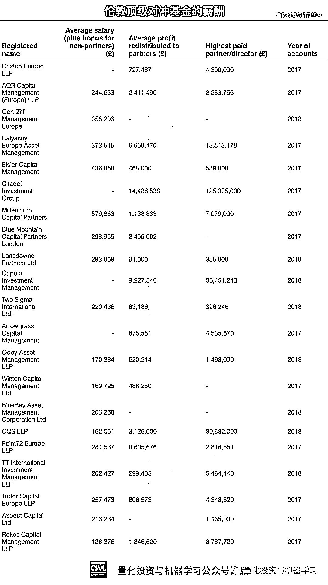
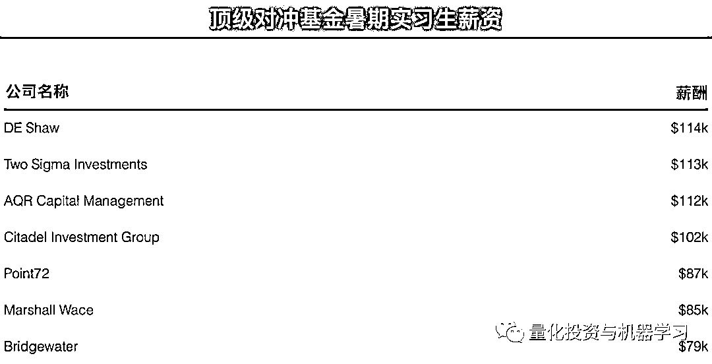
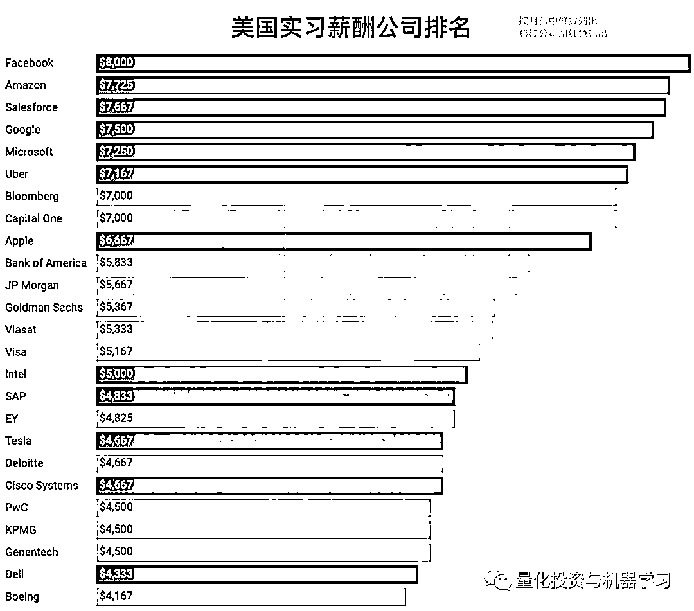

# 想去 Citadel？凭本事你能拿多少薪水！

> 原文：[`mp.weixin.qq.com/s?__biz=MzAxNTc0Mjg0Mg==&mid=2653294812&idx=1&sn=811fd7e6bc9b53764990f0cd4d0640ff&chksm=802dd2c9b75a5bdf219a3c18fbf3fe01c6bfb5cd39695cc17155f71b770156ba43a6f5e898bd&scene=27#wechat_redirect`](http://mp.weixin.qq.com/s?__biz=MzAxNTc0Mjg0Mg==&mid=2653294812&idx=1&sn=811fd7e6bc9b53764990f0cd4d0640ff&chksm=802dd2c9b75a5bdf219a3c18fbf3fe01c6bfb5cd39695cc17155f71b770156ba43a6f5e898bd&scene=27#wechat_redirect)

**标星★公众号     **爱你们♥   

**近期原创文章：**

## ♥ [5 种机器学习算法在预测股价的应用（代码+数据）](https://mp.weixin.qq.com/s?__biz=MzAxNTc0Mjg0Mg==&mid=2653290588&idx=1&sn=1d0409ad212ea8627e5d5cedf61953ac&chksm=802dc249b75a4b5fa245433320a4cc9da1a2cceb22df6fb1a28e5b94ff038319ae4e7ec6941f&token=1298662931&lang=zh_CN&scene=21#wechat_redirect)

## ♥ [Two Sigma 用新闻来预测股价走势，带你吊打 Kaggle](https://mp.weixin.qq.com/s?__biz=MzAxNTc0Mjg0Mg==&mid=2653290456&idx=1&sn=b8d2d8febc599742e43ea48e3c249323&chksm=802e3dcdb759b4db9279c689202101b6b154fb118a1c1be12b52e522e1a1d7944858dbd6637e&token=1330520237&lang=zh_CN&scene=21#wechat_redirect)

## ♥ 2 万字干货：[利用深度学习最新前沿预测股价走势](https://mp.weixin.qq.com/s?__biz=MzAxNTc0Mjg0Mg==&mid=2653290080&idx=1&sn=06c50cefe78a7b24c64c4fdb9739c7f3&chksm=802e3c75b759b563c01495d16a638a56ac7305fc324ee4917fd76c648f670b7f7276826bdaa8&token=770078636&lang=zh_CN&scene=21#wechat_redirect)

## ♥ [机器学习在量化金融领域的误用！](http://mp.weixin.qq.com/s?__biz=MzAxNTc0Mjg0Mg==&mid=2653292984&idx=1&sn=3e7efe9fe9452c4a5492d2175b4159ef&chksm=802dcbadb75a42bbdce895c49070c3f552dc8c983afce5eeac5d7c25974b7753e670a0162c89&scene=21#wechat_redirect)

## ♥ [基于 RNN 和 LSTM 的股市预测方法](https://mp.weixin.qq.com/s?__biz=MzAxNTc0Mjg0Mg==&mid=2653290481&idx=1&sn=f7360ea8554cc4f86fcc71315176b093&chksm=802e3de4b759b4f2235a0aeabb6e76b3e101ff09b9a2aa6fa67e6e824fc4274f68f4ae51af95&token=1865137106&lang=zh_CN&scene=21#wechat_redirect)

## ♥ [如何鉴别那些用深度学习预测股价的花哨模型？](https://mp.weixin.qq.com/s?__biz=MzAxNTc0Mjg0Mg==&mid=2653290132&idx=1&sn=cbf1e2a4526e6e9305a6110c17063f46&chksm=802e3c81b759b597d3dd94b8008e150c90087567904a29c0c4b58d7be220a9ece2008956d5db&token=1266110554&lang=zh_CN&scene=21#wechat_redirect)

## ♥ [优化强化学习 Q-learning 算法进行股市](https://mp.weixin.qq.com/s?__biz=MzAxNTc0Mjg0Mg==&mid=2653290286&idx=1&sn=882d39a18018733b93c8c8eac385b515&chksm=802e3d3bb759b42d1fc849f96bf02ae87edf2eab01b0beecd9340112c7fb06b95cb2246d2429&token=1330520237&lang=zh_CN&scene=21#wechat_redirect)

## ♥ [WorldQuant 101 Alpha、国泰君安 191 Alpha](https://mp.weixin.qq.com/s?__biz=MzAxNTc0Mjg0Mg==&mid=2653290927&idx=1&sn=ecca60811da74967f33a00329a1fe66a&chksm=802dc3bab75a4aac2bb4ccff7010063cc08ef51d0bf3d2f71621cdd6adece11f28133a242a15&token=48775331&lang=zh_CN&scene=21#wechat_redirect)

## ♥ [基于回声状态网络预测股票价格（附代码）](https://mp.weixin.qq.com/s?__biz=MzAxNTc0Mjg0Mg==&mid=2653291171&idx=1&sn=485a35e564b45046ff5a07c42bba1743&chksm=802dc0b6b75a49a07e5b91c512c8575104f777b39d0e1d71cf11881502209dc399fd6f641fb1&token=48775331&lang=zh_CN&scene=21#wechat_redirect)

## ♥ [计量经济学应用投资失败的 7 个原因](https://mp.weixin.qq.com/s?__biz=MzAxNTc0Mjg0Mg==&mid=2653292186&idx=1&sn=87501434ae16f29afffec19a6884ee8d&chksm=802dc48fb75a4d99e0172bf484cdbf6aee86e36a95037847fd9f070cbe7144b4617c2d1b0644&token=48775331&lang=zh_CN&scene=21#wechat_redirect)

## ♥ [配对交易千千万，强化学习最 NB！（文档+代码）](http://mp.weixin.qq.com/s?__biz=MzAxNTc0Mjg0Mg==&mid=2653292915&idx=1&sn=13f4ddebcd209b082697a75544852608&chksm=802dcb66b75a4270ceb19fac90eb2a70dc05f5b6daa295a7d31401aaa8697bbb53f5ff7c05af&scene=21#wechat_redirect)

## ♥ [关于高盛在 Github 开源背后的真相！](https://mp.weixin.qq.com/s?__biz=MzAxNTc0Mjg0Mg==&mid=2653291594&idx=1&sn=7703403c5c537061994396e7e49e7ce5&chksm=802dc65fb75a4f49019cec951ac25d30ec7783738e9640ec108be95335597361c427258f5d5f&token=48775331&lang=zh_CN&scene=21#wechat_redirect)

## ♥ [新一代量化带货王诞生！Oh My God！](https://mp.weixin.qq.com/s?__biz=MzAxNTc0Mjg0Mg==&mid=2653291789&idx=1&sn=e31778d1b9372bc7aa6e57b82a69ec6e&chksm=802dc718b75a4e0ea4c022e70ea53f51c48d102ebf7e54993261619c36f24f3f9a5b63437e9e&token=48775331&lang=zh_CN&scene=21#wechat_redirect)

## ♥ [独家！关于定量/交易求职分享（附真实试题）](https://mp.weixin.qq.com/s?__biz=MzAxNTc0Mjg0Mg==&mid=2653291844&idx=1&sn=3fd8b57d32a0ebd43b17fa68ae954471&chksm=802dc751b75a4e4755fcbb0aa228355cebbbb6d34b292aa25b4f3fbd51013fcf7b17b91ddb71&token=48775331&lang=zh_CN&scene=21#wechat_redirect)

## ♥ [Quant 们的身份危机！](https://mp.weixin.qq.com/s?__biz=MzAxNTc0Mjg0Mg==&mid=2653291856&idx=1&sn=729b657ede2cb50c96e92193ab16102d&chksm=802dc745b75a4e53c5018cc1385214233ec4657a3479cd7193c95aaf65642f5f45fa0e465694&token=48775331&lang=zh_CN&scene=21#wechat_redirect)

## ♥ [AQR 最新研究 | 机器能“学习”金融吗](http://mp.weixin.qq.com/s?__biz=MzAxNTc0Mjg0Mg==&mid=2653292710&idx=1&sn=e5e852de00159a96d5dcc92f349f5b58&chksm=802dcab3b75a43a5492bc98874684081eb5c5666aff32a36a0cdc144d74de0200cc0d997894f&scene=21#wechat_redirect)

**公众号海外部报道**

**前言**

根据我们在网上查找到的资料，全球顶尖的对冲基金公司 Citadel 截止 2019 年 6 月的数据显示，其**支付给量化分析师和技术专家平均薪酬为 21.7 万美元，高于其平均薪酬为 21.5 万美元的投资分析师。**

从 WSO 与 Glassdoor 的提供的数据综合来看，Citadel 技术人员的薪资从 12.7 万美元到 21.5 万美元不等。

Citadel 支付给技术人员的薪酬高于其他对冲基金，也高于多数投行。高盛在 2017 年将其初级工程师的薪资提高至 10 万美元，并在今年早些时候开始向拥有硕士学位的新技术分析师提供总计 12.8 万美元的薪酬（工资加奖金）。

最近，根据 H1B 薪资数据库的也证实了这一点，至少在薪资方面，**Citadel 将大多数开发人员和技术专业人士的薪酬水平与专业投资人士同等对待。**

**H1B：**美国签证的一种，指特殊专业人员/临时工作签证 Specialty Occupations/ Temporary Worker Visas (H-1B)。发放给美国公司雇佣的外国籍有专业技能的员工，属于非移民签证的一种。

下表列出了 Citadel2019 年美国 H1B 签证持有者薪酬的一个具有代表性的部分。这些薪水大部分来源于纽约和芝加哥，不过 Citadel 也在纽瓦克、Westlake 和新泽西周围提供技术工作。这些薪水只是支付给 H1B 签证持有者。

**Citadel 付给投资人员多少薪酬?**

H1B 签证数据显示，Citadel 向其**交易主管**支付了**50 万美元**的薪酬。今年 6 月，一名**大宗商品主管**的薪资为**50 万美元**，而一名**量化交易主管**的薪资为**37.5 万美元**。

**资历较浅的量化研究人员的薪酬从 14.5 万美元到 22 万美元不等**。**电子交易分析师和助理的薪酬为 10.5 万美元或 15 万美元**。

值得注意的是，**H1B 数字不包括奖金**，如果你是一明投资交易人员并能产生 Alpha 收益，那么，上面的数字是相当可观的。在许多情况下，基本工资只占总薪酬的一小部分。

**所以啊！****搞量化的朋友们，不要盯着基本工资看！**

与其他公司相比，Citadel 的交易员薪水并不高。这可能是因为交易员通常只是执行预先制定的策略。

**Citadel 付给技术人员多少薪酬?**

虽然一些高级投资人员的薪水高达 50 万美元，但 Citadel 给高级技术人员开出的最高薪水似乎是 25 万美元。量化分析师的薪资似乎高于技术人员，而数据科学家的薪资水平也高于软件工程师。然而，量化研究人员（研究新的交易策略）与量化开发人员（帮助将这些策略转换成代码）的薪水类似。

**开发人员和软件工程师的薪水似乎在 14.5 万美元到 20 万美元之间。**

高薪可能并不是 Citadel 吸引科技员工的唯一因素。员工在 Glassdoor 上提交的申请表明，该基金还为工程师们提供了难得的创新机会。

**没有项目经理！开发人员可以自由地与业务用户直接聊天，集思广益，共同创建解决方案。**

**对比**

与此同时，根据我们之前的报道，大家可以做个对比：

下面列出的一些对冲基金是大型雇主。例如，Winton Capital Management 有 375 名员工。BlueBay 有 317 名。Aspect Capital 拥有 142 家公司等等。

除非你是合伙人，否则对冲基金对雇主的吸引力可能会比以前小。在伦敦的高盛（Goldman Sachs）， 2018 年的平均薪资为 31.4 万英镑，高于下表中的大多数对冲基金。一旦你加入了对冲基金，就很难再离开了。

  再看看部分投行和对冲基金实习生的薪资：

数据来自：WSO

数据来自：WSO

尽管对冲基金付给实习生的薪水比华尔街的银行要高，但他们的薪水却低于大型科技公司。例如，Facebook 今年将实习生的月薪提高到了 8 千美元。

数据来自：Glassdoor

在国内，你觉得你会比他们高吗？

*—End—*

量化投资与机器学习微信公众号，是业内垂直于**Quant**、**MFE**、**CST、AI**等专业的**主****流量化自媒体**。公众号拥有来自**公募、私募、券商、银行、海外**等众多圈内**18W+**关注者。每日发布行业前沿研究成果和最新量化资讯。

你点的每个“在看”，都是对我们最大的鼓励