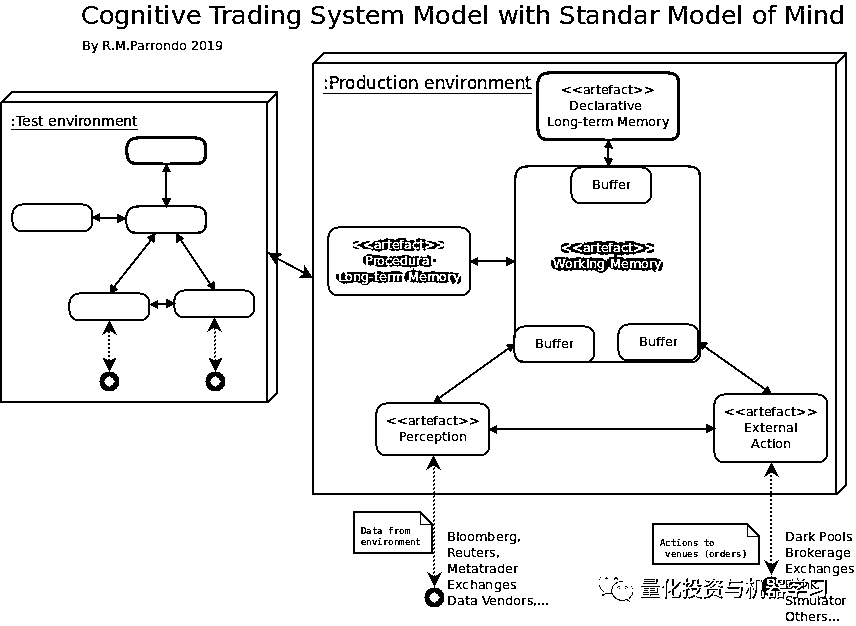
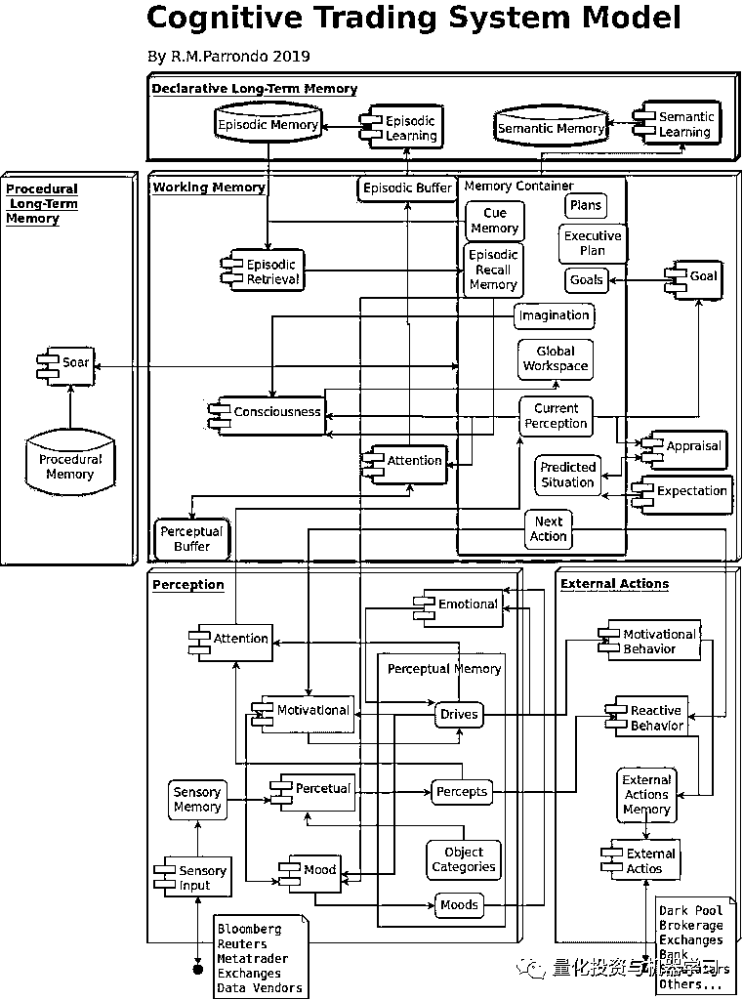

# 认知交易系统模型，给策略施加魔力！

> 原文：[`mp.weixin.qq.com/s?__biz=MzAxNTc0Mjg0Mg==&mid=2653294803&idx=1&sn=f0a16ab7474a95a5b11ada355298cd75&chksm=802dd2c6b75a5bd098bdd32ce2024af1e0f90ba1a91987e6ff2a210aac283a2b997e5d07c9bf&scene=27#wechat_redirect`](http://mp.weixin.qq.com/s?__biz=MzAxNTc0Mjg0Mg==&mid=2653294803&idx=1&sn=f0a16ab7474a95a5b11ada355298cd75&chksm=802dd2c6b75a5bd098bdd32ce2024af1e0f90ba1a91987e6ff2a210aac283a2b997e5d07c9bf&scene=27#wechat_redirect)

**标星★公众号     **爱你们♥   

作者：Ramón Martín Parrondo

编译：方的馒头

**近期原创文章：**

## ♥ [5 种机器学习算法在预测股价的应用（代码+数据）](https://mp.weixin.qq.com/s?__biz=MzAxNTc0Mjg0Mg==&mid=2653290588&idx=1&sn=1d0409ad212ea8627e5d5cedf61953ac&chksm=802dc249b75a4b5fa245433320a4cc9da1a2cceb22df6fb1a28e5b94ff038319ae4e7ec6941f&token=1298662931&lang=zh_CN&scene=21#wechat_redirect)

## ♥ [Two Sigma 用新闻来预测股价走势，带你吊打 Kaggle](https://mp.weixin.qq.com/s?__biz=MzAxNTc0Mjg0Mg==&mid=2653290456&idx=1&sn=b8d2d8febc599742e43ea48e3c249323&chksm=802e3dcdb759b4db9279c689202101b6b154fb118a1c1be12b52e522e1a1d7944858dbd6637e&token=1330520237&lang=zh_CN&scene=21#wechat_redirect)

## ♥ 2 万字干货：[利用深度学习最新前沿预测股价走势](https://mp.weixin.qq.com/s?__biz=MzAxNTc0Mjg0Mg==&mid=2653290080&idx=1&sn=06c50cefe78a7b24c64c4fdb9739c7f3&chksm=802e3c75b759b563c01495d16a638a56ac7305fc324ee4917fd76c648f670b7f7276826bdaa8&token=770078636&lang=zh_CN&scene=21#wechat_redirect)

## ♥ [机器学习在量化金融领域的误用！](http://mp.weixin.qq.com/s?__biz=MzAxNTc0Mjg0Mg==&mid=2653292984&idx=1&sn=3e7efe9fe9452c4a5492d2175b4159ef&chksm=802dcbadb75a42bbdce895c49070c3f552dc8c983afce5eeac5d7c25974b7753e670a0162c89&scene=21#wechat_redirect)

## ♥ [基于 RNN 和 LSTM 的股市预测方法](https://mp.weixin.qq.com/s?__biz=MzAxNTc0Mjg0Mg==&mid=2653290481&idx=1&sn=f7360ea8554cc4f86fcc71315176b093&chksm=802e3de4b759b4f2235a0aeabb6e76b3e101ff09b9a2aa6fa67e6e824fc4274f68f4ae51af95&token=1865137106&lang=zh_CN&scene=21#wechat_redirect)

## ♥ [如何鉴别那些用深度学习预测股价的花哨模型？](https://mp.weixin.qq.com/s?__biz=MzAxNTc0Mjg0Mg==&mid=2653290132&idx=1&sn=cbf1e2a4526e6e9305a6110c17063f46&chksm=802e3c81b759b597d3dd94b8008e150c90087567904a29c0c4b58d7be220a9ece2008956d5db&token=1266110554&lang=zh_CN&scene=21#wechat_redirect)

## ♥ [优化强化学习 Q-learning 算法进行股市](https://mp.weixin.qq.com/s?__biz=MzAxNTc0Mjg0Mg==&mid=2653290286&idx=1&sn=882d39a18018733b93c8c8eac385b515&chksm=802e3d3bb759b42d1fc849f96bf02ae87edf2eab01b0beecd9340112c7fb06b95cb2246d2429&token=1330520237&lang=zh_CN&scene=21#wechat_redirect)

## ♥ [WorldQuant 101 Alpha、国泰君安 191 Alpha](https://mp.weixin.qq.com/s?__biz=MzAxNTc0Mjg0Mg==&mid=2653290927&idx=1&sn=ecca60811da74967f33a00329a1fe66a&chksm=802dc3bab75a4aac2bb4ccff7010063cc08ef51d0bf3d2f71621cdd6adece11f28133a242a15&token=48775331&lang=zh_CN&scene=21#wechat_redirect)

## ♥ [基于回声状态网络预测股票价格（附代码）](https://mp.weixin.qq.com/s?__biz=MzAxNTc0Mjg0Mg==&mid=2653291171&idx=1&sn=485a35e564b45046ff5a07c42bba1743&chksm=802dc0b6b75a49a07e5b91c512c8575104f777b39d0e1d71cf11881502209dc399fd6f641fb1&token=48775331&lang=zh_CN&scene=21#wechat_redirect)

## ♥ [计量经济学应用投资失败的 7 个原因](https://mp.weixin.qq.com/s?__biz=MzAxNTc0Mjg0Mg==&mid=2653292186&idx=1&sn=87501434ae16f29afffec19a6884ee8d&chksm=802dc48fb75a4d99e0172bf484cdbf6aee86e36a95037847fd9f070cbe7144b4617c2d1b0644&token=48775331&lang=zh_CN&scene=21#wechat_redirect)

## ♥ [配对交易千千万，强化学习最 NB！（文档+代码）](http://mp.weixin.qq.com/s?__biz=MzAxNTc0Mjg0Mg==&mid=2653292915&idx=1&sn=13f4ddebcd209b082697a75544852608&chksm=802dcb66b75a4270ceb19fac90eb2a70dc05f5b6daa295a7d31401aaa8697bbb53f5ff7c05af&scene=21#wechat_redirect)

## ♥ [关于高盛在 Github 开源背后的真相！](https://mp.weixin.qq.com/s?__biz=MzAxNTc0Mjg0Mg==&mid=2653291594&idx=1&sn=7703403c5c537061994396e7e49e7ce5&chksm=802dc65fb75a4f49019cec951ac25d30ec7783738e9640ec108be95335597361c427258f5d5f&token=48775331&lang=zh_CN&scene=21#wechat_redirect)

## ♥ [新一代量化带货王诞生！Oh My God！](https://mp.weixin.qq.com/s?__biz=MzAxNTc0Mjg0Mg==&mid=2653291789&idx=1&sn=e31778d1b9372bc7aa6e57b82a69ec6e&chksm=802dc718b75a4e0ea4c022e70ea53f51c48d102ebf7e54993261619c36f24f3f9a5b63437e9e&token=48775331&lang=zh_CN&scene=21#wechat_redirect)

## ♥ [独家！关于定量/交易求职分享（附真实试题）](https://mp.weixin.qq.com/s?__biz=MzAxNTc0Mjg0Mg==&mid=2653291844&idx=1&sn=3fd8b57d32a0ebd43b17fa68ae954471&chksm=802dc751b75a4e4755fcbb0aa228355cebbbb6d34b292aa25b4f3fbd51013fcf7b17b91ddb71&token=48775331&lang=zh_CN&scene=21#wechat_redirect)

## ♥ [Quant 们的身份危机！](https://mp.weixin.qq.com/s?__biz=MzAxNTc0Mjg0Mg==&mid=2653291856&idx=1&sn=729b657ede2cb50c96e92193ab16102d&chksm=802dc745b75a4e53c5018cc1385214233ec4657a3479cd7193c95aaf65642f5f45fa0e465694&token=48775331&lang=zh_CN&scene=21#wechat_redirect)

## ♥ [AQR 最新研究 | 机器能“学习”金融吗？](http://mp.weixin.qq.com/s?__biz=MzAxNTc0Mjg0Mg==&mid=2653292710&idx=1&sn=e5e852de00159a96d5dcc92f349f5b58&chksm=802dcab3b75a43a5492bc98874684081eb5c5666aff32a36a0cdc144d74de0200cc0d997894f&scene=21#wechat_redirect)

**具体原文见文末**

我们希望我们的策略能够自动化。当市场一次又一次地发生变化时，我们希望在我们的系统中纳入一些自适应的纠正方法，以及告诉我们什么时候哪些指标不再有效等。

以上这些操作都暗示着大量的编程工作。如果没有很好的代码结构

对于所有算法交易领域的新手来说，要找交易系统的所有细节内容将是困难的。今天的这篇文章，我们将带领大家了解交易平台系统设计的一些知识。

**概要**

**认知计算（Cognnitive computing）是一种学习系统，有规模、有原因、有目的地学会和人类交互。**

认知计算和认知技术是未来工程系统的游戏改变者。金融市场的复杂性迫使人们使用日益复杂的交易系统。算法交易是近年来金融业讨论最多的问题之一。在当今竞争异常激烈的投资中，金融机构感到越来越需要技术来帮助他们实现一些他们人工无法做到的事情。

在这种情况下，系统交易和算法交易起着至关重要的作用。

自 2006 年以来，算法交易已成为主流。算法技术及其驱动技术现在对在交易所和场很多金融工具产生了重大影响。在各种资产（包括股票、期货、期权和外汇）中使用算法交易。甚至在博彩中也有应用。

现代交易系统包括复杂的人工智能（AI）技术，并且在高速发展中。因此，拥有一个交易系统模型可以方便指导开发人员和交易者在系统开发的每个阶段知道所处的位置。系统和认知理论可以帮助实现这一目的。

人工智能的关键基本假设是，思维是一种特定种类的计算实体，即认知系统，它可以通过各种物理设备来实现。它们可能是大脑，传统的通用计算机或其他形式的硬件或软件。

人工智能、认知科学、神经科学和机器人技术有助于我们理解复杂的学习任务，尽管它们各自基于不用的角度指导研究。不同之处在于：

*   人工智能是指人工思维的构建，因此，与表现出智能的行为相比，它更关心如何构建系统。
*   认知科学是指建立自然思维的模型，因此，它更关注于理解产生人类思维的认知过程。
*   神经科学指的是大脑的结构和功能，因此，它更加关注大脑的思维是如何产生的。
*   机器人技术指的是人工身体的构造和控制，因此，人们更担心大脑如何控制这些身体。

我们的目的是了解**认知交易系统 Cognitive Trading System （CTS）模型**，该模型从更一般的意义上定义了交易系统模型。此模型的目的是：

*   该模型可用于支持体系架构解决方案，以及将交易系统需求流向各个组件。

*   该模型可用于支持将硬件和软件集成到交易系统中，以及支持验证交易系统是否满足其要求。

**认知交易系统**

这里我们提出以下定义：认知交易系统（CTS）是一组相互作用的实体，它们形成一个统一的组织，受其环境的影响，受限于其实施和时间限制。它以其认知结构和功能来描述，其目的是通过在金融市场上交易资产来获取财富。

这里有一些解释：

*   “交互实体组”是任务执行所需的所有必要元素的集合。例如，我们现在可以考虑一个交易系统由交易者+计算机+交易软件组成的。

*   “形成一个统一的组织”意味着，如果我们取消其中的某些部分，则无法执行系统任务。

*   “受其环境影响”。也就是说，系统感知其环境，例如经济事件、自然灾害、新闻。

*   “它受限于其实施和时间限制”。所以，硬件和软件限制了系统，也限制了实现日期。

*   “它是由其认知结构和功能来描述的”。最后一个是定义的主要部分，因为这意味着我们可以从系统如何感知信息以及它如何处理和行动来描述系统。简言之，我们可以通过一种或几种认知架构来描述系统。

*   “其目的是通过在金融市场交易资产来获取财富”。

因此，**一个认知交易系统是由从环境中接收信息、处理信息和通过执行交易操作而采取****行动的所有必要元素组成的。**

在计算机时代之前的几年里，一个“场内交易者”+电话或电报，本身就是认知交易系统。

然而，目前我们可以看到非常复杂的交易系统，其中很大一部分信息处理（认知任务）是由人工智能的专属模块执行的。然后我们可以说，认知任务在交易者和机器之间是共享的，即使越来越多的任务是由机器执行的，从而使人类交易者只能执行高层的认知任务，例如策略的制定或者全球风险的控制。此外，该机器已经从一台简单的计算机演变成了一个有着云端分布的复杂网络集群。因此需要有一个系统模型来设计当前复杂的交易活动。

因此，我们可以将认知交易系统视为一个扩展，它不仅包含行业中传统上使用的概念，例如交易算法、量化交易、交易策略、交易系统、交易架构、数据输入及其处理等，还包括由参与交易任务的人员（交易员、风险管理人员、系统管理人员等）执行的心理过程。这些目前人类最典型的心理过程（情境分析、目标设置、策略制定、实现、问题解决等）也可能很快由机器来执行。为此，认知交易系统旨在识别可以随时自动执行的任务，并将这些任务转移到机器上。然后，认知交易系统将作为一个设计和监控地图，以了解日益复杂和不断发展的交易系统的性能。

**指南**

当我们建立一个交易系统模型时，我们需要考虑对该系统和模型的期望。下面我是一些需求。

*   当今市场不断发展，每分钟都有新的机会出现。White-box 交易系统允许快速组合和发展算法，以特定方式监控、分析和响应市场事件。根据公司的独特需求定制业务策略的能力意味着存在更大的竞争优势机会。在当今的竞争激烈的环境中，交易者必须能够制定算法策略以便在创纪录的时间内实施。

*   由于算法策略的创建和定制至关重要，因此交易系统的快速发展也至关重要。我们必须持续而系统地开发系统。在算法至上的竞争中，公司试图观察对方的商业活动，并自动或手动地对所使用的策略“应用逆向工程”。

*   访问多个流动资金池。随着电子通讯网络（ElectronicCommunications Network）和直接市场准入模式（Direct Market Access）的增加，电子市场继续向前发展。如今，公司可以通过将商业活动分散到多个组中来获得优势，这些组的优势各不相同。例如，在外汇市场上，Currenex 与 Hotspot 类似，但它不是匿名的；EBS 和 Reuters Dealing3000 是必不可少的参与者，但在成对的特定汇率上往往具有异常的竞争力。了解各种流动性组中的异常情况可能是优势的来源，但是获得中意优势的唯一途径是算法交易平台能够同时访问多个流动性组。另外，对多个组的实时监控允许策略将订单发送到该组，例如，具有最佳价格或最高可用流动性。

*   在多个资产类别中操作。当交易平台具有对多个资产类别访问时，可以通过在单个策略中同时操作多个资产来组合现有的算法系统。例如，一家公司可以买入股票并用期权来覆盖股票，而同时持有外汇头寸。

*   将新闻和各种实时数据通道集成到交易系统中。当今的金融市场正在关注这一消息。例如，非农就业人数、全球利率的决定或与特定行动相关的公告都会影响人们对受影响的价值的信心，进而影响对价格的信心。当交易系统可以先于其他系统分析新闻和其他数据并对之做出反应时，就会产生优势。

*   为低延迟决策而设计。在算法交易中，毫秒是必不可少的。最小化事件检测（市场数据、新闻、报价请求）和行动（下单）之间的时间是至关重要的。

*   随着公司不断发展其独特的策略，他们如何确保在市场上引入的策略是最好的？为了快速开发和部署新策略，在一系列预期的市场条件下测试算法至关重要。为此，必须实行科学的系统研发方法。

*   历史上，风险敞口的计算通常在交易日结束时分批进行。现在，公司将后台功能纳入算法交易中，例如调整风险敞口。这最后一点加强了实时算法风险管理的需求。

**认知架构**

认知架构是通用人工智能研究的一部分，该研究始于 1950 年代，旨在创建能够在不同领域中推理问题、开发想法、适应新情况并反思自己的程序。

认知架构的目标是为人类思维建模，最终允许在人类层面构建人工智能。为此，认知架构试图提供特定机制来产生智能行为的证据。人工智能可以通过四种不同的方式执行：

*   像人类一样思考的系统

*   理性思考的系统

*   像人类一样运作的系统

*   理性行为的系统

现有的认知架构已经探索了这四种可能性。我们要强调的是，现代交易系统需要具有良好的软件和硬件架构，但也需要认知架构。这样，就有可能以灵活的方式将人工智能应用于金融市场的所有进展整合起来。

在附录中，我们有一个当前正在实施和成熟的主要认知架构的列表。

在下一节中，我们将描述心理

模型，该模型允许我们指定认知交易系统模型是如何的。这个标准模型凝聚了三种认知架构，即：**Soar、ACT-R 和 Sigma**。然而，其使命是覆盖尽可能多的兼容模型。这就是为什么它是我们认知交易模型的良好基础。

**具有思维风格标准模型的认知交易系统模型**

心理模型（SMM）分为结构和处理、内存和内容、学习以及感知和行动。该模型表示作者对 AAAI 专题研讨会上通过的纲要提出的共识的理解，主要基于以下三种感兴趣的认知架构：

*   Soar [Laird，2018 年]

*   ACT-R [Anderson， 2007 年]

*   Sigma [Rosenbloom 等， 2016 年]

这是一个共识模型，因此，它不是普遍接受的，毕竟它不需要一致性：它是一种试图提

供连贯的总结以及在该领域广泛共享的一系列假设的尝试。

虽然原则上心理模型（SMM）很好地适应了上面提到的三种认知体系架构，但如果需要的话，仍可以继续添加当前或将来的其他架构，并进行相应的调整，这没有任何障碍。我们已经用组件的概念取代了 codelet 的概念，组件的概念更广泛地应用于金融行业软件的设计中。然而，已经有严格的 codelet 实施方式可以使完整的交易系统构建可行。

认知交易系统架构定义了如何将信息组织和处理成组件，以及信息如何在组件之间流动。该模型假定具有不同功能的独立模块构成一个认知交易系统。

下图 1 显示了基于心理模型提出的认知交易系统架构的结果。

认知交易模型的主要组成部分包括：

*   感知渠道（PC）

*   动作信道（AC）

*   工作内存[微软用户 2] （WM）

*   声明性长期内存（DLTM）

*   程序性长期内存（PLTM）

它可以作为设计和开发各种交易系统的模型。它是一个模型，所以它必须进行更改和修

改，以适应设计需要。

我们可以将每个模块看作是整体的，或者可以进一步分解为多个模块。

作内存缓冲器是：

*   语义声明性内存

*   情景陈述式内存

*   匹配程序式内存

*   执行程序式内存

在 PC 和 AC 模块之间的直接连接外，WM 还充当组件之间的组件间通信缓冲区。我们可以将其视为单一的，或者由单独的特定于形式的内存（例如，市场数据、视觉数据等）组成，它们共同构成一个汇总的工作内存。

DLTM、PC 和 AC 模块都只能访问和修改有关联的工作内存缓冲器，而程序式内存可以访问

所有工作内存。所有长期内存都具有一种或多种相关的学习机制，这些机制可根据架构的处理自动存储、修改或调整信息。

图 1：基于心理模型的认知交易系统模型概述，其中主要模块是可观测的。检验（研究）和生产环境理想情况下应该是相同的。

我们已经表示了与生产环境分离的检验环境，因为它是一种常见的实践，但其思想是两个环境都集成在相同的认知结构中。也就是说，这种分离应该被认为是象征性的，因为交易系统的整个认知结构形成了一个整体。

**认知交易系统模型**

在本节中，我们将介绍认知交易系统模型的主要模块。图 2 显示了认知交易系统模型的概述。组件的名称遵循多用途增强认知架构和认知系统工具包参考架构。认知交易系统的概念从不同的来源继承了许多想法。首先，认知交易系统是心理模型的一个实例。这意味着认知交易系统分为五个模块。该模型四一个连接三种类型元素的网络：组件、内存和容器（将内存分组在一起）。模型的所有输入和输出都是由“感知”和“外部动作”模块单独完成。认知交易系统的输入由感觉组件（在图的左下方）完成，它们复制收集输入数据并填充“感觉内存”。认知交易系统的输出由“外部动作”组件执行，该组件从“外部动作”存储器中收集数据，并负责将这些数据发送到系统执行器（包括订单管理系统）。

图 2：认知交易系统模型，它是可见的模块组件的详细试图

**架构指南**

接下来，我们将描述设计者在认知交易系统时应考虑的所有内容。此描述应作为一个设计检查清单。

**结构和加工**

认知交易系统的结构定义了如何将信息和处理组织为组件以及信息如何在组件之间流动。

*   架构处理的目的是支持有限理性，而不仅仅是最优性。然而，最优性是可以接受的，因为我们也在思考非人类的人工智能。

*   处理是基于少量独立于任务的模块

*   在架构处理中存在显著的并行性

*   处理是跨模块并行的，可能是：

*   异步

*   同步

*   处理在模块内是并行的，信息处理可能是：

*   规则匹配

*   图解

*   规则触发

行为是由认知周期中的顺序行动选择所驱动的。在人类认知中，这最后一次以每个周期 50 毫秒的速度运行，但对于机器周期，可能是以纳秒的顺序运行。

复杂的行为源于一系列在其本地环境中运行独立的认知周期，而没有用于全局优化的单独的架构模块（或规划）。

**感知**

无论其设计和目的如何，交易系统都不能孤立存在，需要输入来产生行为。感知通道是将原始输入数据转换为系统内部表示的过程。它将外部信号与关联的元数据转换成符号和关系，并将结果放入工作存储器中的特定缓冲器中。该系统可以有许多不同的感知模块，每个模块都有不同模态的信息（请参见下面可能的数据类型），每个模块都有其感知缓冲区。

根据源的来源和数据项的属性，可以区分多个模块：最常见的是：

*   基本数据（资产、投资收益率、宏参数）

*   市场数据（价格、数量、股息）

*   分析数据（建议、市场情绪）

*   其他数据（图片、Google 搜索、社交网络）

自然，许多系统的架构都实现了其中的一些，以及其他与市场没有明确关联但以人类为象征性入口的模式以及各种传感器，甚至来自其他系统的预测。

根据其能力，交易系统可以出来各种数量和类型的数据作为感知输入。在本节中，设计人员必须调查交易架构中使用的数据项的多样性。另外，从这些来源中提取什么样的信息以及如何应用它。

感知将外部信号与相关的元数据转换为符号和关系，并将结果放入工作内存中的特定缓冲区中。该系统可以有许多不同的感知模块，每个模块都有不同模态的信息（请参见上面可能的数据类型），每个模块都有其感知缓冲区。

感知在特定的工作内存缓冲区中生成具有关联元数据的符号结构。

*   可以有许多不同的感知模块，每个模块都有来自不同数据模态及其缓冲区的输入。

*   知觉学习获得了新的模式和现有的曲调。

*   注意力瓶颈限制了工作内存中可用的信息量。

*   感知可能会受到工作内存提供的自上而下的信息的影响。

**注意（过滤）**

通过“注意”，我们想命名输入数据将提交到的所有过滤器和选择策略。

感知注意在交易系统的信息处理中起着至关重要的作用，因为它介导了相关信息的选择并过滤了输入数据中的无关信息。然而，将注意力看作一个决定处理什么或不处理什么的整体式过滤器将是错误的。我们必须将注意力理解为影响感知和处理任务的一系列机制。当前，对价格和成交量数据的处理以及系统入口处缺少任何数据，仍然是研究最多的关注形式。最后一点是因为只有少数架构具有有效过滤新闻或图像数据的基础机制。此外，注意组件还包括风险管理过滤器。

该模型假设存在一个注意瓶颈，该瓶颈限制了工作内存中可用的信息量，但并未在感知模块内纳入有关信息的内部表示（或处理）的任何妥协。

**外部操作**

外部操作通道通过订单管理器将符号结构及其存储在缓冲区中的元数据转换为订单。与感知通道一样，可以有多个订单模块。尽管风险控制（注意）系统监督对订单的最终控制。

操作选择在任何时间点都会决定“下一步做什么”。“什么”部分涉及决策，而“如何”部分涉及操作（运动）控制。在我们的交易环境中，运动操作是涉及订单管理相关动作的外部操作。

然后在“外部操作”模块和工作存储器中涉及操作。

我们区分了三种主要的操作类型：

*   计划操作是指传统的人工智能算法。它们决定在运行之前达到特定目标或解决问题的步骤顺序。

*   动态操作会根据当时可用的知识在备选方案中选择最佳操作之一。默认选项始终是基于定义的标准的最佳操作（例如，具有最高激活值的操作）。

选择类型：

*   赢家通吃（WTA）

*   概率

*   预定义顺序

*   有限状态机

选择标准：

*   关联

*   效用

*   情感/感觉

执行反应操作，绕过操作选择。这些操作是典型的风险管理系统（RMS），必要时可以完全控制该系统。

最后，学习也会形象操作的选择。请记住，这些操作选择机制并非互斥，大多数交易系统都不止一个。

**内存**

内存是任何交易系统的重要组成部分。内存系统存储中间的计算结果，允许学习并适应不断变化的环境。然而，尽管它们在功能上相似，但是内存系统的具体实现却有很大的不同，这取决于研究目标和概念上的限制，例如编程语言、软件架构、框架的使用、软件范例。在认知架构中，内存是根据其持续时间（短期和长期）和类型（程序性、声明性、语义性）来描述的，尽管它不一定作为单独的知识存储来实现。

我们遵循内存惯例：

*   长期内存

*   语义内存（存储事实知识）

*   程序性（有关在某些特定条件下应采取的操作的信息）

*   情景内存（存储事实知识和系统个人经验中的情景）

*   短期内存

*   感觉或知觉内存（非常短期的缓冲区，用于存储一些最近的知觉）

*   工作内存（用于感知的临时存储器，其中还包含与当前任务有关的并与当前关注的焦点相关联的其他项目。）

**学习**

学习是一个系统随时间的推移而提高其性能的能力。经验是任何学习（反馈）的基础，因此，一个交易者或交易系统本身能够从观察到的事件或其行动结果中推断出事实和行为。学习的类型及其实现取决于许多因素，例如设计范例、应用场景、数据结构和用于实现体系架构的算法等。Squire 定义了学习的陈述性和非陈述性类型，Breazeal 等人描述了启动：

声明性或显式项非声明性，包括类型：

*   知觉的

*   程序性

*   联想的

*   非联想的

*   启动

**推理**

推理是逻辑和系统地处理知识的能力。这种推理几乎可以影响或构建任何类型的交易系统。结果，除了经典的逻辑推理三合一外，还考虑了其他类型的推理，如启发式推理、可辩护推理、类比推理、叙述推理，甚至道德推理。所有的交易系统都必须与实践推理有关，实践推理的最终目标是找到并实施下一个最佳操作，而不是旨在建立或评估信念的理论推理。为了构建一个具有非平凡能力的交易系统，需要设计师进行大量的推理和规划。推理与计划、决策和学习，以及对语言、情境和问题解决的感知、理解密切相关。

**元认知**

元认知，直观地被定义为“思考思想”，是一套能够内省地监控内部过程及其原因的技能。由于识别、解释和纠正错误决策的实际需要，人们对交易系统的元认知的发展越来越感兴趣。我们将关注三种最常见的元认知机制，即：

自我观察

自我分析

自我调节

**实际应用**

因此，使用此模型，我们可以映射所有类型的实际交易架构。下面的示例是一个交易架构，该交易架构是根据[Reid，2013 年]设计的原始“算法交易系统”进行改编和修改而成的，在那里，我们可以看到粉红色的高级认知操作仍然存在于人类智能的特定领域中。该任务代表了走向全自动交易系统的研究机会领域。这些领域包括：

*   交易员筛选

*   风险人员筛选

*   系统管理员筛选

图 3：根据[Reid，2013 年]算法交易系统架构改编的认知交易系统模型实际应用。

**结论**

我们提供了金融市场中使用的交易系统的扩展定义，以及基于该系统被我们称为“认知交易系统”的认知架构。我们以心理模型为参照，提出了一个“认知交易系统”的模型。我们已经描述了主要模块以及此类模块的主要组件。最后，基于一个实际的交易系统架构，我们给出了该模型的具体应用实例。我们未来的工作将致力于提供每个模块及其可能实现的更重要细节。我们的目标也是利用这个模型来研究当前交易系统可能的改进之处。

**附录：认知架构**

4D-RCS https://github.com/usnistgov/rcslib

ACT-R http://act-r.psy.cmu.edu/software/

AIS http://www-ksl.stanford.edu/projects/BB1/bb1.html

APEX http://apex-autonomy.sourceforge.net/

ART http://techlab.bu.edu/resources/software/

ASMOhttps://github.com/airobots/asmo_python, https://github.com/airobots/asmo_ros

BECCA https://github.com/brohrer/becca

CAPS http://www.ccbi.cmu.edu/4CAPS/4caps-v1-3.2.6.lsp

CERA-CRANIUM https://github.com/raul-arrabales/OpenCranium,https://github.com/raularrabales/crubots

CHREST https://github.com/petercrlane/chrest

CLARION https://sites.google.com/site/clarioncognitivearchitecture/downloads

CogPrime https://github.com/opencog

CoJACK http://aosgrp.com/products/cojack/download_cojack.html

Copycat/Metacathttp://science.slc.edu/~jmarshall/metacat/Metacat-1.1.zip,

http://web.cecs.pdx.edu/~mm/how-to-get-copycat.html

CoSy http://www.cognitivesystems.org/software.asp

Darwinian Neurodynamicshttps://osf.io/7xfh2/

DIARC http://ade.sourceforge.net/

HTM http://numenta.org/

ICARUS https://github.com/ghballiet/acsjournal/tree/master/app/webroot/courses/langley/aicogsys11/Icarus

iCub http://wiki.icub.org/wiki/ICub_Software_Installation

Leabrahttps://grey.colorado.edu/emergent/index.php/Leabra,

https://grey.colorado.edu/emergent/index.php/Main_Page

LIDA http://ccrg.cs.memphis.edu/framework.html

MicroPsi https://github.com/joschabach/micropsi2

MIDCA https://github.com/mclumd/MIDCA

MusiCog http://www.sfu.ca/~jbmaxwel/MusiCog/downloads.html

NARS https://github.com/opennars/opennars/wiki

NEUCOGAR https://github.com/research-team/NEUCOGAR

OSCAR http://johnpollock.us/ftp/OSCAR-web-page/oscar.html

Pogamut http://pogamut.cuni.cz/main/tiki-index.php

PRODIGY http://www.cs.cmu.edu/afs/cs.cmu.edu/project/prodigy/Web/Distribution/distrib.html

Sigma https://bitbucket.org/sigma-development/sigma-release/wiki/Home

Soar https://github.com/SoarGroup

SPA (Spaun) http://www.nengo.ca/download

STAR https://github.com/TsotsosLab/STAR-FC

Xapagy https://github.com/Xapagy/Xapagy

*—End—*

量化投资与机器学习微信公众号，是业内垂直于**Quant**、**MFE**、**CST、AI**等专业的**主****流量化自媒体**。公众号拥有来自**公募、私募、券商、银行、海外**等众多圈内**18W+**关注者。每日发布行业前沿研究成果和最新量化资讯。

你点的每个“在看”，都是对我们最大的鼓励