# 量化 A 股市场：“国庆效应”该看什么（附代码）？

> 原文：[`mp.weixin.qq.com/s?__biz=MzAxNTc0Mjg0Mg==&mid=2653294790&idx=1&sn=d5175d0f0db98e8ae17cc12f159ecf48&chksm=802dd2d3b75a5bc5a2497fa88829cc0bd53da062d10497d7f014cb53fa7faed15811aeff69fa&scene=27#wechat_redirect`](http://mp.weixin.qq.com/s?__biz=MzAxNTc0Mjg0Mg==&mid=2653294790&idx=1&sn=d5175d0f0db98e8ae17cc12f159ecf48&chksm=802dd2d3b75a5bc5a2497fa88829cc0bd53da062d10497d7f014cb53fa7faed15811aeff69fa&scene=27#wechat_redirect)

**标星★公众号     **爱你们♥   

来自：WindQuant 万矿

**近期原创文章：**

## ♥ [5 种机器学习算法在预测股价的应用（代码+数据）](https://mp.weixin.qq.com/s?__biz=MzAxNTc0Mjg0Mg==&mid=2653290588&idx=1&sn=1d0409ad212ea8627e5d5cedf61953ac&chksm=802dc249b75a4b5fa245433320a4cc9da1a2cceb22df6fb1a28e5b94ff038319ae4e7ec6941f&token=1298662931&lang=zh_CN&scene=21#wechat_redirect)

## ♥ [Two Sigma 用新闻来预测股价走势，带你吊打 Kaggle](https://mp.weixin.qq.com/s?__biz=MzAxNTc0Mjg0Mg==&mid=2653290456&idx=1&sn=b8d2d8febc599742e43ea48e3c249323&chksm=802e3dcdb759b4db9279c689202101b6b154fb118a1c1be12b52e522e1a1d7944858dbd6637e&token=1330520237&lang=zh_CN&scene=21#wechat_redirect)

## ♥ 2 万字干货：[利用深度学习最新前沿预测股价走势](https://mp.weixin.qq.com/s?__biz=MzAxNTc0Mjg0Mg==&mid=2653290080&idx=1&sn=06c50cefe78a7b24c64c4fdb9739c7f3&chksm=802e3c75b759b563c01495d16a638a56ac7305fc324ee4917fd76c648f670b7f7276826bdaa8&token=770078636&lang=zh_CN&scene=21#wechat_redirect)

## ♥ [机器学习在量化金融领域的误用！](http://mp.weixin.qq.com/s?__biz=MzAxNTc0Mjg0Mg==&mid=2653292984&idx=1&sn=3e7efe9fe9452c4a5492d2175b4159ef&chksm=802dcbadb75a42bbdce895c49070c3f552dc8c983afce5eeac5d7c25974b7753e670a0162c89&scene=21#wechat_redirect)

## ♥ [基于 RNN 和 LSTM 的股市预测方法](https://mp.weixin.qq.com/s?__biz=MzAxNTc0Mjg0Mg==&mid=2653290481&idx=1&sn=f7360ea8554cc4f86fcc71315176b093&chksm=802e3de4b759b4f2235a0aeabb6e76b3e101ff09b9a2aa6fa67e6e824fc4274f68f4ae51af95&token=1865137106&lang=zh_CN&scene=21#wechat_redirect)

## ♥ [如何鉴别那些用深度学习预测股价的花哨模型？](https://mp.weixin.qq.com/s?__biz=MzAxNTc0Mjg0Mg==&mid=2653290132&idx=1&sn=cbf1e2a4526e6e9305a6110c17063f46&chksm=802e3c81b759b597d3dd94b8008e150c90087567904a29c0c4b58d7be220a9ece2008956d5db&token=1266110554&lang=zh_CN&scene=21#wechat_redirect)

## ♥ [优化强化学习 Q-learning 算法进行股市](https://mp.weixin.qq.com/s?__biz=MzAxNTc0Mjg0Mg==&mid=2653290286&idx=1&sn=882d39a18018733b93c8c8eac385b515&chksm=802e3d3bb759b42d1fc849f96bf02ae87edf2eab01b0beecd9340112c7fb06b95cb2246d2429&token=1330520237&lang=zh_CN&scene=21#wechat_redirect)

## ♥ [WorldQuant 101 Alpha、国泰君安 191 Alpha](https://mp.weixin.qq.com/s?__biz=MzAxNTc0Mjg0Mg==&mid=2653290927&idx=1&sn=ecca60811da74967f33a00329a1fe66a&chksm=802dc3bab75a4aac2bb4ccff7010063cc08ef51d0bf3d2f71621cdd6adece11f28133a242a15&token=48775331&lang=zh_CN&scene=21#wechat_redirect)

## ♥ [基于回声状态网络预测股票价格（附代码）](https://mp.weixin.qq.com/s?__biz=MzAxNTc0Mjg0Mg==&mid=2653291171&idx=1&sn=485a35e564b45046ff5a07c42bba1743&chksm=802dc0b6b75a49a07e5b91c512c8575104f777b39d0e1d71cf11881502209dc399fd6f641fb1&token=48775331&lang=zh_CN&scene=21#wechat_redirect)

## ♥ [计量经济学应用投资失败的 7 个原因](https://mp.weixin.qq.com/s?__biz=MzAxNTc0Mjg0Mg==&mid=2653292186&idx=1&sn=87501434ae16f29afffec19a6884ee8d&chksm=802dc48fb75a4d99e0172bf484cdbf6aee86e36a95037847fd9f070cbe7144b4617c2d1b0644&token=48775331&lang=zh_CN&scene=21#wechat_redirect)

## ♥ [配对交易千千万，强化学习最 NB！（文档+代码）](http://mp.weixin.qq.com/s?__biz=MzAxNTc0Mjg0Mg==&mid=2653292915&idx=1&sn=13f4ddebcd209b082697a75544852608&chksm=802dcb66b75a4270ceb19fac90eb2a70dc05f5b6daa295a7d31401aaa8697bbb53f5ff7c05af&scene=21#wechat_redirect)

## ♥ [关于高盛在 Github 开源背后的真相！](https://mp.weixin.qq.com/s?__biz=MzAxNTc0Mjg0Mg==&mid=2653291594&idx=1&sn=7703403c5c537061994396e7e49e7ce5&chksm=802dc65fb75a4f49019cec951ac25d30ec7783738e9640ec108be95335597361c427258f5d5f&token=48775331&lang=zh_CN&scene=21#wechat_redirect)

## ♥ [新一代量化带货王诞生！Oh My God！](https://mp.weixin.qq.com/s?__biz=MzAxNTc0Mjg0Mg==&mid=2653291789&idx=1&sn=e31778d1b9372bc7aa6e57b82a69ec6e&chksm=802dc718b75a4e0ea4c022e70ea53f51c48d102ebf7e54993261619c36f24f3f9a5b63437e9e&token=48775331&lang=zh_CN&scene=21#wechat_redirect)

## ♥ [独家！关于定量/交易求职分享（附真实试题）](https://mp.weixin.qq.com/s?__biz=MzAxNTc0Mjg0Mg==&mid=2653291844&idx=1&sn=3fd8b57d32a0ebd43b17fa68ae954471&chksm=802dc751b75a4e4755fcbb0aa228355cebbbb6d34b292aa25b4f3fbd51013fcf7b17b91ddb71&token=48775331&lang=zh_CN&scene=21#wechat_redirect)

## ♥ [Quant 们的身份危机！](https://mp.weixin.qq.com/s?__biz=MzAxNTc0Mjg0Mg==&mid=2653291856&idx=1&sn=729b657ede2cb50c96e92193ab16102d&chksm=802dc745b75a4e53c5018cc1385214233ec4657a3479cd7193c95aaf65642f5f45fa0e465694&token=48775331&lang=zh_CN&scene=21#wechat_redirect)

## ♥ [AQR 最新研究 | 机器能“学习”金融吗？](http://mp.weixin.qq.com/s?__biz=MzAxNTc0Mjg0Mg==&mid=2653292710&idx=1&sn=e5e852de00159a96d5dcc92f349f5b58&chksm=802dcab3b75a43a5492bc98874684081eb5c5666aff32a36a0cdc144d74de0200cc0d997894f&scene=21#wechat_redirect)

**量化投资与机器学习公众号**

**热烈庆祝新中国成立 70 周年！**

**前言**

在行为金融学的发展历史中，**“日历效应”（Calendar effect）**是最早被发现的市场异常现象之一，即金融资产收益率在不同的时间段上存在系统性的差异。日历效应主要包括**星期效应、月份效应、季节效应**和**假日效应**，它们分别指金融市场与季节、月份、星期和假日有关的非正常收益、非正常二阶矩及其他非正常高阶矩。这种周期性异象有悖于有效市场假说，因为资产收益不再是随机的，而是基于特定的日历期间存在一定的可预测性。有一种解释为日历效应是由人们在投资决策过程中认知的偏差和情绪、情感、偏好等心理方面的原因导致其无法以理性人方式做出无偏差估计而造成的一种现象，反映出市场的非有效性。

本文主要对**2010-2018**年期间的**A 股市场的国庆效应**进行实证研究，包括**指数层面**和**行业层面。**

**指数层面： **对沪深两市中 9 大常用指数——上证综指、深证成指、上证 50、中证 100、沪深 300、中证 500、中证 1000、中小板指数、创业板指数的国庆效应进行对比分析；

**单个指数： **对单个指数，不同国庆前后推移时间的国庆效应进行对比分析；

**行业层面： **中信一级行业的国庆效应进行对比分析。

**获取全部代码，见文末**

**主要指数国庆期间及前后的涨跌情况**

### 我们通过 [**WindPy**](https://mp.weixin.qq.com/s?__biz=MzIwMzY0MTgwMQ==&mid=2247484640&idx=1&sn=69086f4c1f5b0ea67c262bce1a7512ad&chksm=96cd0246a1ba8b50a56c92cf39ec4eca13b6a2b3068dc5b67d4c3cc1cb98e237caef8a549bf7&token=771985913&lang=zh_CN&scene=21#wechat_redirect) 和 Python 基于 [**万矿量化云平台**](https://mp.weixin.qq.com/s?__biz=MzIwMzY0MTgwMQ==&mid=2247485330&idx=1&sn=43c0ce9acd3fff3a3f1a2ef78eef5f71&chksm=96cd0134a1ba88222e3a884113d6e80e66583acb18d3fcbdbe350a5e6ea2a94b9b02700f1cbf&token=771985913&lang=zh_CN&scene=21#wechat_redirect) 自动生成了国庆休市前后对应的交易日和休市天数：

### **获取全部代码查看文末**

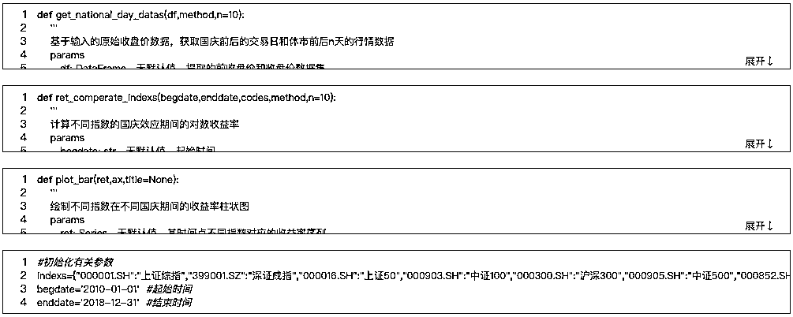

**国庆休市前后对应的交易日和休市天数**

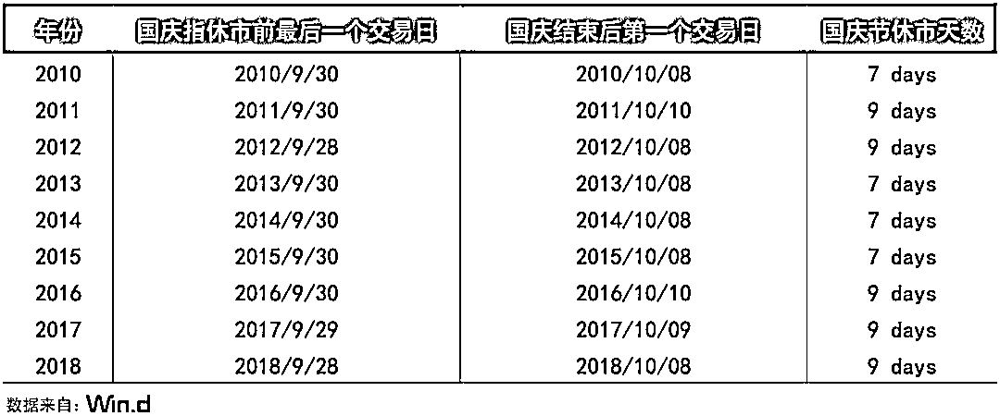

#### 从上表可知，不同年份 A 股市场休市天数会有不同，2010 年-2018 年期间，2010 年、2013 年-2015 年的国庆共休市 7 天，其余年份共休市了 9 天。

**▍国庆前 10 个交易日的收益情况**

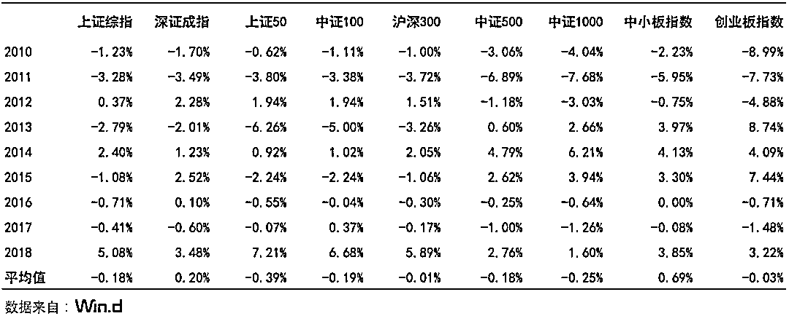

**9 大常用指数国庆前收益率柱状图**

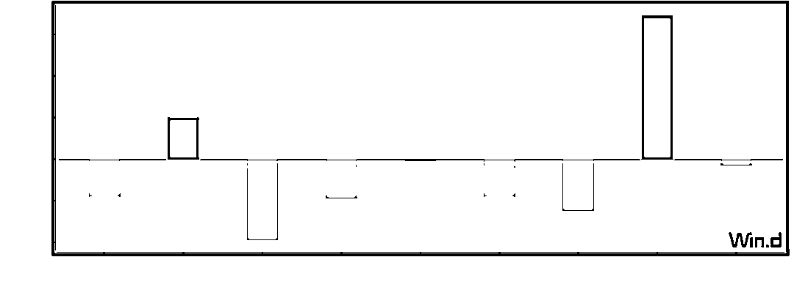

#### 从柱状图中可以看出，大部分指数在国庆前的表现都不尽如人意。

#### **深证成指、中小板指数除外**，**其余指数在历年国庆前的平均涨幅均为负**。

#### 但从各指数历年涨跌明细表中可以发现，**不同年份国庆前的涨跌表现不一**，其中 2012 年和 2018 年国庆前普遍上涨，所有指数均取得了正收益，但也有普遍下跌的年份（如 2010 年、2011 年、2016 年、2017 年）。

**▍国庆后 10 个交易日的收益情况**

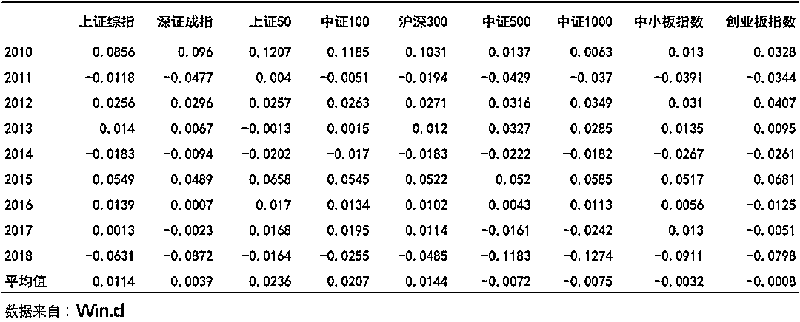

**9 大常用指数国庆后收益率柱状图**

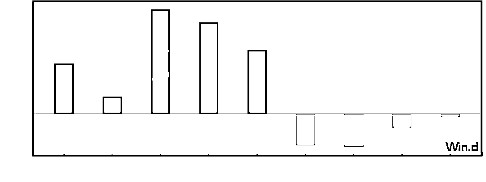

#### 从柱状图中可以看出，**国庆过后行情出现了逆转**， 上证 50 和沪深 300 指数节后反弹幅度较大。**特别是上证 50 指数，节前收益最差，节后收益却位居榜首。节后市场风格更倾向于大盘股。**

### **▍****主要指数****国庆期间****与****国庆前后****涨跌对比**

**9 大常用指数国庆前后收益率柱状图**

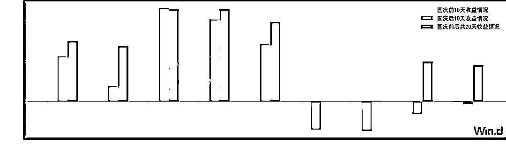

### **▍单个指数国庆前后涨跌对比（以上证 50 为例）**

****获取全部代码查看文末****

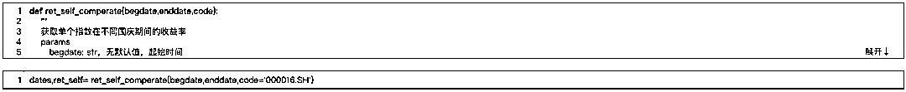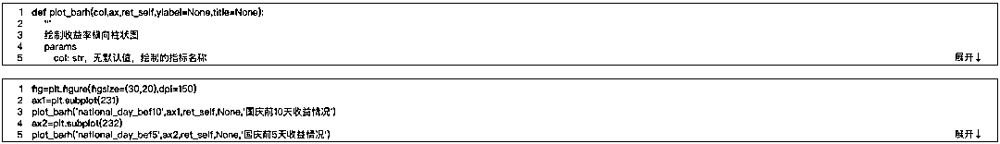

### **上证 50 国庆节前后 5 天收益**

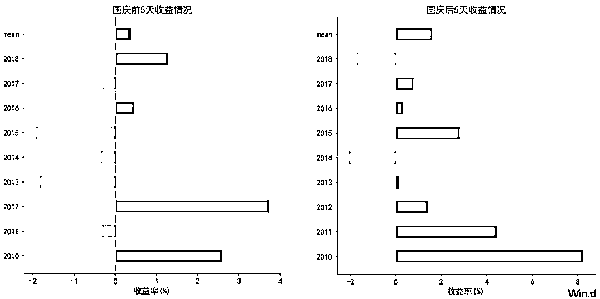

### **上证 50 国庆节前后 10 天收益**

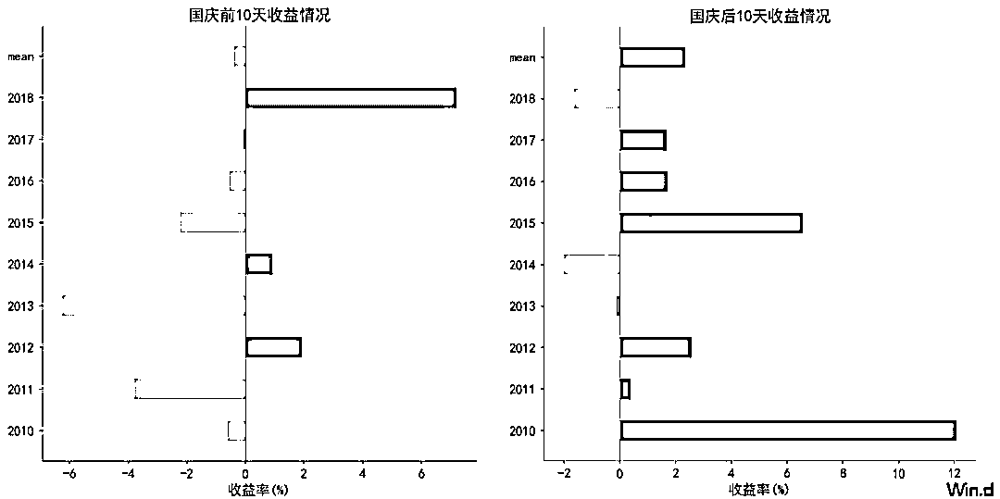

#### 虽然国庆前市场表现不佳，但随着节日的逼近，收益情况逐渐好转。就单个中证 50 指数而言，国庆前 10 日的平均收益为负，但前 5 日的却取得了正收益。国庆结束后，收益成功逆转，并持续上升。

**中信一级行业国庆期间涨跌情况**

#### 从行业层面来看，与指数一样，**各行业国庆前后行情都会出现大逆转**。特别是**银行**和**金融**行业，**节后收益率上涨幅度最高**，这也与前文中得到的“节后中证 50 指数在各指数中涨幅最大”结论相符。此外电力及公共事业、轻工制造业、交通运输业、制造业等涨幅也较大。

**获取全部代码查看文末**

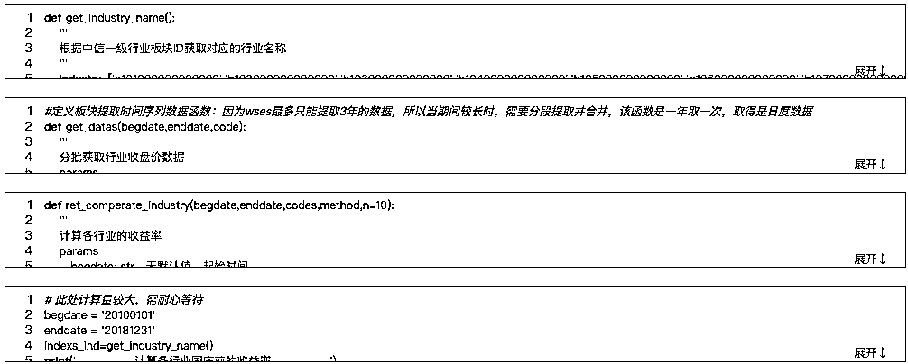

### **中信一级行业国庆期间涨跌情况**

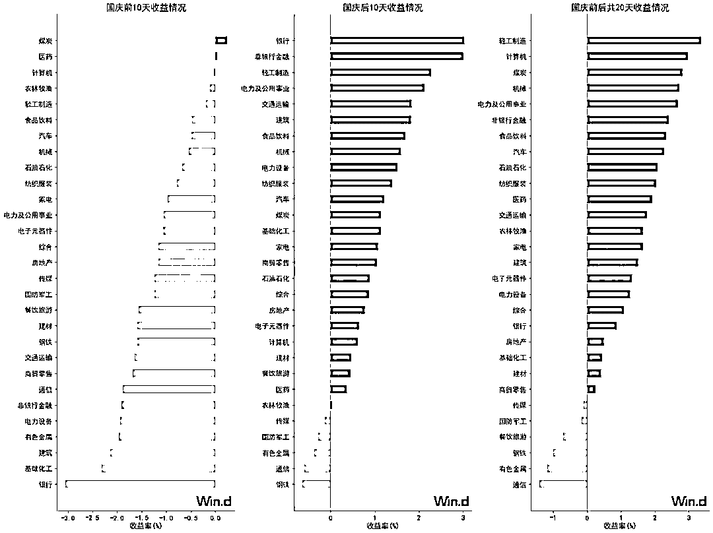

**总结**

#### 综上所示，A 股市场国庆效应较为明显**。****节前资金流出过节，市场表现普遍偏弱，节后资金回流，市场出现反弹。**

点击**阅读原文**或者**扫描下方二维码****获取代码**：

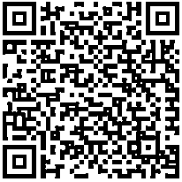

**代码获取**

**

**WQFA**英文全称 WindQuant Quantitative Finance Analyst。由**万矿**联合**众多金融机构**以及**高校**，共同开展的一项专业量化人才培养计划。

万矿是 Wind 唯一一个面向互联网的量化平台，全网用户可登录网页版（***www.windquant.com***）免费使用 。万矿内嵌 Wind Python API 数据接口。为全网用户提供全市场**股票、债券、基金、商品、指数、外汇、期权**等 7 个品种的**历史日线、Tick、分钟和实时行情数据**，以及中国市场所有品种的专题统计报表和中国及海外股票板块数据、宏观数据等。

*—End—*

量化投资与机器学习微信公众号，是业内垂直于**Quant**、**MFE**、**CST、AI**等专业的**主****流量化自媒体**。公众号拥有来自**公募、私募、券商、银行、海外**等众多圈内**18W+**关注者。每日发布行业前沿研究成果和最新量化资讯。

点击**阅读原文**，**获取代码！**