# 来！因子投资基金如何赚钱？

> 原文：[`mp.weixin.qq.com/s?__biz=MzAxNTc0Mjg0Mg==&mid=2653294782&idx=1&sn=0b0ac64f3863864f9e6450a3f981e677&chksm=802dd2abb75a5bbd31cb7ab574a5c0e24f59dda6c38c45243b3e4b120c1e01507d2814a48e6e&scene=27#wechat_redirect`](http://mp.weixin.qq.com/s?__biz=MzAxNTc0Mjg0Mg==&mid=2653294782&idx=1&sn=0b0ac64f3863864f9e6450a3f981e677&chksm=802dd2abb75a5bbd31cb7ab574a5c0e24f59dda6c38c45243b3e4b120c1e01507d2814a48e6e&scene=27#wechat_redirect)

**标星★公众号     **爱你们♥

作者：许坤圣     

来自：新球资产配置

**近期原创文章：**

## ♥ [5 种机器学习算法在预测股价的应用（代码+数据）](https://mp.weixin.qq.com/s?__biz=MzAxNTc0Mjg0Mg==&mid=2653290588&idx=1&sn=1d0409ad212ea8627e5d5cedf61953ac&chksm=802dc249b75a4b5fa245433320a4cc9da1a2cceb22df6fb1a28e5b94ff038319ae4e7ec6941f&token=1298662931&lang=zh_CN&scene=21#wechat_redirect)

## ♥ [Two Sigma 用新闻来预测股价走势，带你吊打 Kaggle](https://mp.weixin.qq.com/s?__biz=MzAxNTc0Mjg0Mg==&mid=2653290456&idx=1&sn=b8d2d8febc599742e43ea48e3c249323&chksm=802e3dcdb759b4db9279c689202101b6b154fb118a1c1be12b52e522e1a1d7944858dbd6637e&token=1330520237&lang=zh_CN&scene=21#wechat_redirect)

## ♥ 2 万字干货：[利用深度学习最新前沿预测股价走势](https://mp.weixin.qq.com/s?__biz=MzAxNTc0Mjg0Mg==&mid=2653290080&idx=1&sn=06c50cefe78a7b24c64c4fdb9739c7f3&chksm=802e3c75b759b563c01495d16a638a56ac7305fc324ee4917fd76c648f670b7f7276826bdaa8&token=770078636&lang=zh_CN&scene=21#wechat_redirect)

## ♥ [机器学习在量化金融领域的误用！](http://mp.weixin.qq.com/s?__biz=MzAxNTc0Mjg0Mg==&mid=2653292984&idx=1&sn=3e7efe9fe9452c4a5492d2175b4159ef&chksm=802dcbadb75a42bbdce895c49070c3f552dc8c983afce5eeac5d7c25974b7753e670a0162c89&scene=21#wechat_redirect)

## ♥ [基于 RNN 和 LSTM 的股市预测方法](https://mp.weixin.qq.com/s?__biz=MzAxNTc0Mjg0Mg==&mid=2653290481&idx=1&sn=f7360ea8554cc4f86fcc71315176b093&chksm=802e3de4b759b4f2235a0aeabb6e76b3e101ff09b9a2aa6fa67e6e824fc4274f68f4ae51af95&token=1865137106&lang=zh_CN&scene=21#wechat_redirect)

## ♥ [如何鉴别那些用深度学习预测股价的花哨模型？](https://mp.weixin.qq.com/s?__biz=MzAxNTc0Mjg0Mg==&mid=2653290132&idx=1&sn=cbf1e2a4526e6e9305a6110c17063f46&chksm=802e3c81b759b597d3dd94b8008e150c90087567904a29c0c4b58d7be220a9ece2008956d5db&token=1266110554&lang=zh_CN&scene=21#wechat_redirect)

## ♥ [优化强化学习 Q-learning 算法进行股市](https://mp.weixin.qq.com/s?__biz=MzAxNTc0Mjg0Mg==&mid=2653290286&idx=1&sn=882d39a18018733b93c8c8eac385b515&chksm=802e3d3bb759b42d1fc849f96bf02ae87edf2eab01b0beecd9340112c7fb06b95cb2246d2429&token=1330520237&lang=zh_CN&scene=21#wechat_redirect)

## ♥ [WorldQuant 101 Alpha、国泰君安 191 Alpha](https://mp.weixin.qq.com/s?__biz=MzAxNTc0Mjg0Mg==&mid=2653290927&idx=1&sn=ecca60811da74967f33a00329a1fe66a&chksm=802dc3bab75a4aac2bb4ccff7010063cc08ef51d0bf3d2f71621cdd6adece11f28133a242a15&token=48775331&lang=zh_CN&scene=21#wechat_redirect)

## ♥ [基于回声状态网络预测股票价格（附代码）](https://mp.weixin.qq.com/s?__biz=MzAxNTc0Mjg0Mg==&mid=2653291171&idx=1&sn=485a35e564b45046ff5a07c42bba1743&chksm=802dc0b6b75a49a07e5b91c512c8575104f777b39d0e1d71cf11881502209dc399fd6f641fb1&token=48775331&lang=zh_CN&scene=21#wechat_redirect)

## ♥ [计量经济学应用投资失败的 7 个原因](https://mp.weixin.qq.com/s?__biz=MzAxNTc0Mjg0Mg==&mid=2653292186&idx=1&sn=87501434ae16f29afffec19a6884ee8d&chksm=802dc48fb75a4d99e0172bf484cdbf6aee86e36a95037847fd9f070cbe7144b4617c2d1b0644&token=48775331&lang=zh_CN&scene=21#wechat_redirect)

## ♥ [配对交易千千万，强化学习最 NB！（文档+代码）](http://mp.weixin.qq.com/s?__biz=MzAxNTc0Mjg0Mg==&mid=2653292915&idx=1&sn=13f4ddebcd209b082697a75544852608&chksm=802dcb66b75a4270ceb19fac90eb2a70dc05f5b6daa295a7d31401aaa8697bbb53f5ff7c05af&scene=21#wechat_redirect)

## ♥ [关于高盛在 Github 开源背后的真相！](https://mp.weixin.qq.com/s?__biz=MzAxNTc0Mjg0Mg==&mid=2653291594&idx=1&sn=7703403c5c537061994396e7e49e7ce5&chksm=802dc65fb75a4f49019cec951ac25d30ec7783738e9640ec108be95335597361c427258f5d5f&token=48775331&lang=zh_CN&scene=21#wechat_redirect)

## ♥ [新一代量化带货王诞生！Oh My God！](https://mp.weixin.qq.com/s?__biz=MzAxNTc0Mjg0Mg==&mid=2653291789&idx=1&sn=e31778d1b9372bc7aa6e57b82a69ec6e&chksm=802dc718b75a4e0ea4c022e70ea53f51c48d102ebf7e54993261619c36f24f3f9a5b63437e9e&token=48775331&lang=zh_CN&scene=21#wechat_redirect)

## ♥ [独家！关于定量/交易求职分享（附真实试题）](https://mp.weixin.qq.com/s?__biz=MzAxNTc0Mjg0Mg==&mid=2653291844&idx=1&sn=3fd8b57d32a0ebd43b17fa68ae954471&chksm=802dc751b75a4e4755fcbb0aa228355cebbbb6d34b292aa25b4f3fbd51013fcf7b17b91ddb71&token=48775331&lang=zh_CN&scene=21#wechat_redirect)

## ♥ [Quant 们的身份危机！](https://mp.weixin.qq.com/s?__biz=MzAxNTc0Mjg0Mg==&mid=2653291856&idx=1&sn=729b657ede2cb50c96e92193ab16102d&chksm=802dc745b75a4e53c5018cc1385214233ec4657a3479cd7193c95aaf65642f5f45fa0e465694&token=48775331&lang=zh_CN&scene=21#wechat_redirect)

## ♥ [AQR 最新研究 | 机器能“学习”金融吗？](http://mp.weixin.qq.com/s?__biz=MzAxNTc0Mjg0Mg==&mid=2653292710&idx=1&sn=e5e852de00159a96d5dcc92f349f5b58&chksm=802dcab3b75a43a5492bc98874684081eb5c5666aff32a36a0cdc144d74de0200cc0d997894f&scene=21#wechat_redirect)

**前言**

因子策略的开端，要从 Fama-French 在资本资产定价模型上提出三因子模型说起，其在原有的市场因子 Beta 上，加上市值因子 SMB 和账面市值比因子 HML，指出 Beta 不能完全解释不同股票回报率的差异，所以还应考虑上市公司的市值、账面市值比、市盈率的差异。

随着时间的发展，因子投资的价值逐渐被市场证实，也被投资者们所认同。贝莱德曾估计，到 2022 年，投入到专门的因子策略产品的资产规模将增至 3.4 万亿美元。许多养老基金、捐赠基金甚至散户投资者都在拥抱因子投资这种新方法。

然而，对于使用因子投资策略的共同基金，相对于传统的主动管理型基金，是否有显著的超额收益，我们还需要做进一步的探究。另外对于投资者来讲，若因子策略基金赚钱，他们是否也能获得相应水平的收益？

若没有，又是什么因素导致了投资者的收益降低呢？本次给大家分享来自 Eduard van Gelderen, Joop Huij, Georgi Kyosev 的文章《Factor Investing From Concept To Implementation》，即围绕以上三方面进行探讨，同时我们结合实操加入了一些自己的想法。

**数据选取**

原文主要探究因子投资策略型基金在【美国市场】和【国际发达国家市场】的表现，关注纯多头股票共同基金。下面为测试数据的选取：

**美国基金月度数据：**包括月度收益率，基金净资产，季度换手率，费用比率；数据来源：CRSP 无幸存者偏差共同基金数据库；样本时间段：1990.01- 2015.12。**国际发达国家基金月度数据：**包括月度收益率，基金净资产，季度换手率，费用比率；数据来源：晨星数据库；由于国际市场因子收益出现晚了一年，样本时间段：1991.01– 2015.12。**美国和国际市场因子收益率：**数据来源，Kenneth French 数据图书馆；样本时间段：1991.01– 2015.12。

除此之外，为了后续检验结果在统计上有效，数据还需要排除【存续时间少于 36 个月】的基金、【资产规模在 5 千万美元以下】和【CAPM R² 值低于 0.6】的基金，因为 R² 的值如果太低，则用 CAPM 模型不能有效解释收益来源。

**如何衡量因子策略基金相对于****传统主动型基金的 alpha?**

单因子，即一个可以描述股票某方面特征的因素；风格因子投资是通过量化标准筛选出具备某种特征因素的股票，期望这些股票能产生超越大盘收益的策略。

顾名思义，多因子就是筛选多个因子，构建一个股票组合，期望该组合在未来的一段时间跑赢或者跑输指数。如果跑赢，则可以做多该组合，同时做空期指；如果跑输，则可以做多期指。多因子模型的关键就是在市场找到这些有预测能力因素的共同特征，即因子。

所以首先，通过 Fama-French 五因子模型加上动量因子来确定基金的因子暴露，通过回归检验看这些因子是否能带来超额收益，计算方式如下：

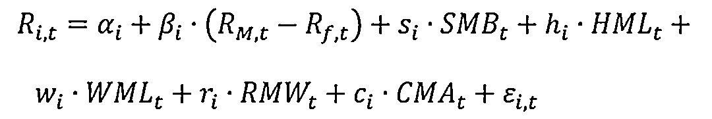

*   **R_M,t-R_f,t：**市场收益率
*   **SMB_t：**市值因子(Small-minus-Big)
*   **HML_t：**价值因子(High-minus-Low)
*   **WML_t：**横截面动量因子(Winner-minus-Loser)
*   **RMW_t：**盈利因子(Robust-minus-Weak)，由营业利润率(operating profitability)高的组合收益率减去营业利润率低的组合收益率
*   **CMA_t：**投资水平因子(Conservative-minus-Aggressive)，由投资水平高组合收益率减去投资水平低的组合收益率，其中投资水平指 t-1 年的总资产增速

若一个因子的回归系数为正且在统计上显著，则将该基金分类到对应因子基金当中。例如：当 SMB 的系数大于 2, 我们认为该基金是小市值基金；当（R_M,t-R_f,t）的系数β_i 小于 0.8，则认为该基金是低β 基金。一只基金可以同时包含多个因子。最后通过 CAPM 模型，求出基金相对于市场组合收益的 alpha：用基金收益率和市场组合收益率进行线性回归，获得该基金的 alpha，如果 alpha 大于 0，则说明在回测时间段里使用这些因子能为基金带来超额收益。

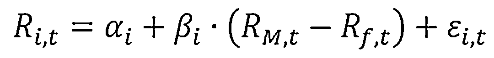

我们将因子基金和传统基金分别与市场组合收益率进行线性回归分析，并将结果进行对比，由下图可见，无论在美国市场还是国际市场，因子基金获得高于市场组合收益的比例，远远大于传统主动型基金的比例。

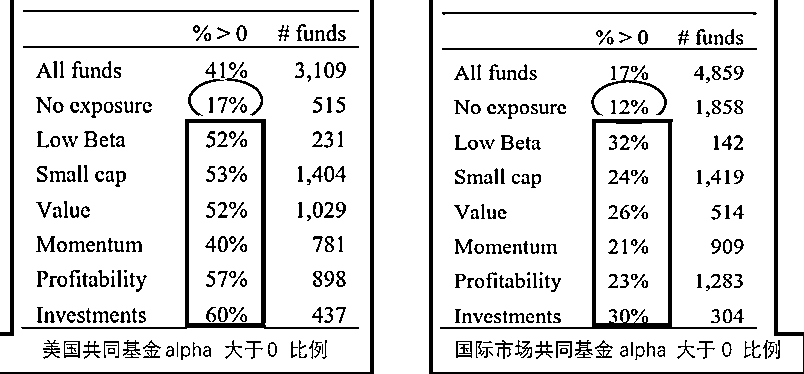

因子基金收益高于市场组合的比例

为了验证这些超额收益在统计上是显著且独立的，即各因子对基金产生的收益是独立的，文章将基金的 alpha 与基金因子分类进行了回归检验。为了限制奇异值的影响，文章对 alpha 取了 z 评分值(z-score), 限制其在-2 到 2 之间。评分算法如下：

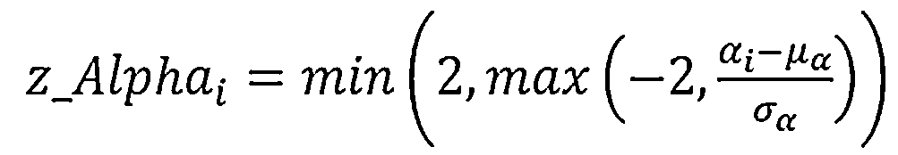

*   **z_Alpha**代表该基金有超越(+)或者低于(-)全样本基金 alpha 的标准差数量

*   **μ_α**代表全样本基金的平均 alpha

*   **σ_α**代表全样本基金的横截面标准差

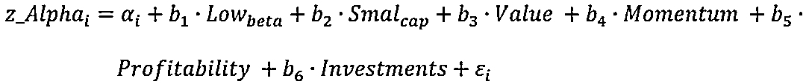

其中 Low_beta,Small_cap, Value, Momentum, Profitability, and Investments 都是哑变量，用来反映基金的属性。即当该基金属于该分类因子基金时，则标记对应值为 1，否则为 0。计算结果如下：

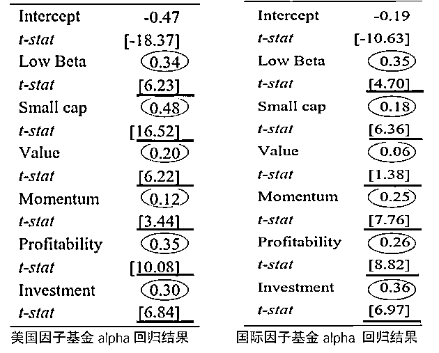

因子基金 alpha 回归结果

从美国基金与国际基金的 alpha z 评分回归来看，因子基金都有显著且为正的 alpha 收益。另外，通过对互斥组合（单因子组合，双因子组合，三因子组合和大于等于四因子组合）的 z_alpha 进行因子哑变量线性回归检验，结果如下图显示：**随着因子数增多，因子基金的超额收益也在提高。**

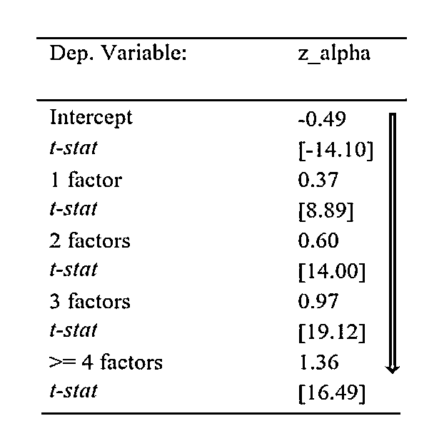

对互斥组合的 z_alpha 进行因子哑变量线性回归  

通过以上测试可见，共同基金收益中是存在因子风险溢价的。那么，如果从投资者角度出发，由于投资者有行为差异，买卖时点和买卖权重等都有区别，如果买了因子基金，其真实收益是否和非因子基金相似，我们还需要做进一步探讨。**因子基金投资者****是否获得了因子风险溢价？**文章通过资金流动分布（fund distribution）和资金权重收益率(Dollar-weighted return => IRR) 来定义因子基金投资者的真实收益。其中资金流动分布为：

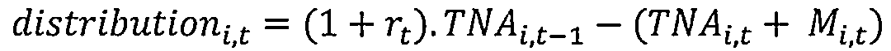

*   **TNA_i,t：**基金 i 在 t 时刻的基金总净值(total net asset)

*   **M_i,t：**由于并购而导致的总净值增长

*   **r_t：**基金 t 时刻的当月收益率

当期基金资金流入为正时，资金流动分布以负值展示。而资金权重收益率通过 IRR 的方式来计算,将初始总净值定义负值作为初始值，定义最新的总净值为终值：

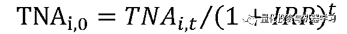

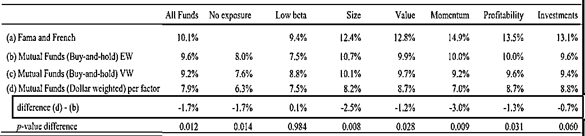

不同风格的因子基金投资者的真实年化收益

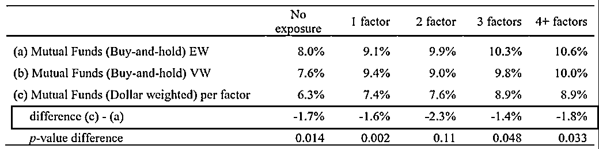不同数量因子基金投资者的真实年化收益可以看到，因子基金投资者的真实年化收益（Dollar-weighted return）相较于因子基金本身的收益有明显下滑，其中动量因子基金最为明显。并且，无论是对于传统的主动基金还是因子基金，投资者的收益都不及买入并长期持有基金(Buy-and-hold)的收益。**但需要注意的是,上表中的"Buy and hold"并不是单纯地买入持有就不管了，而是每个月要将投资组合再平衡到目标权重，这种操作有机会会使投资组合获得额外的再平衡收益。**但对于只买入少数几个因子基金的个人投资者来说，这种再平衡收益是难以获得的。既然有数据证明长期持有基金的收益更高，那么为什么落到实地上，很多投资者还是不能坚持做到长期投资呢？有很多行为经济学理念可以解释这个现象，可以看看我们的相关文章[《诺奖得主塞勒教授的行为金融学研究框架 - 有这篇论文就够了》](http://mp.weixin.qq.com/s?__biz=MjM5NzU3MDc1MA==&mid=2455722712&idx=1&sn=fc411380e5aba6d66b55e1c8532535a9&chksm=b17c0b09860b821f49d63f48b0cc29f35d57e8b2e92c3cf4f80d027eb0c42e8cc9d49a3234ff&scene=21#wechat_redirect)。这里，我们从数据的角度来挖掘一下，到底是什么因素让投资者进行择时配置的。**主导共同基金投资者****进行择时或配置的因素是什么？**文章将【基金净资产增速(rel_flow_i,t)】、 【因子哑变量】、【过去 12 个月超额收益】和【存活时长】等控制变量进行分段线性回归，衡量资金流量驱动因子。计算方式如下：

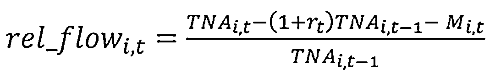

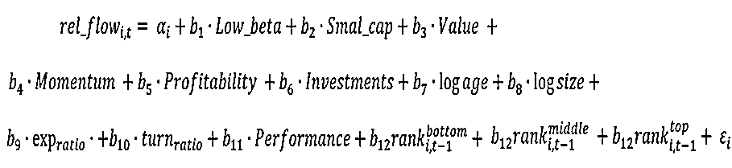由下图可以得知，资金流量驱动因子最显著的是过去 12 个月的超额收益，也就是，投资者投资基金的主要依据并不是基金本身的因子风格暴露，而是基金过往获得的超额收益（基金历史回报）。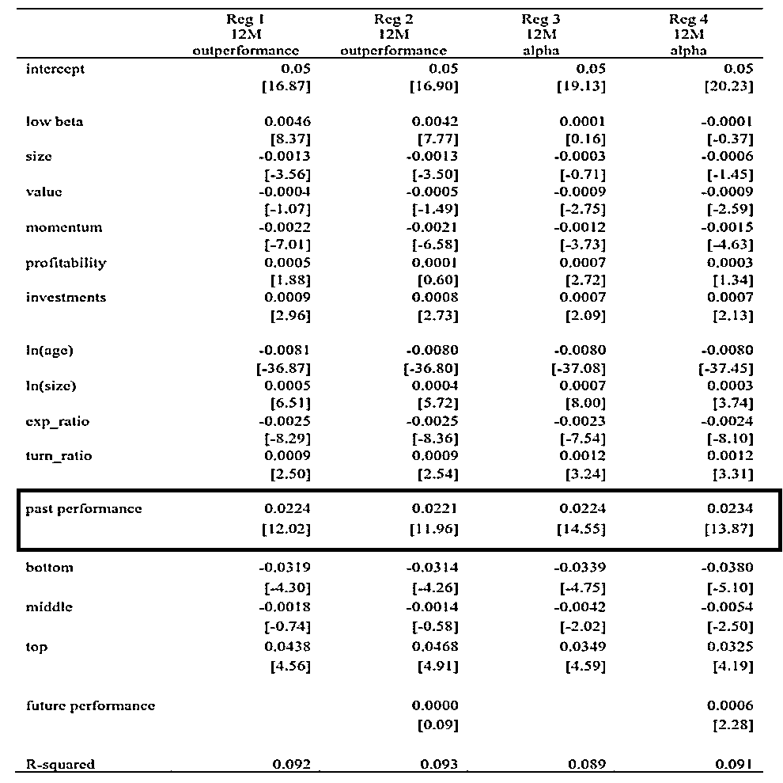资金流量驱动因子线性回归结果以前，驱动市场的因素就像天上的神仙——神秘、深不可测。但发现了因子后，我们能明白究竟是些什么在推动绩效了。**量化因子投资融入了金融学和行为学理念，通过建立客观可靠的数据，形成系统性投资框架，同样这也是快速发展的因子投资基金的核心。**本篇文章即通过严谨的数据分析，探讨了因子基金收益来源，以及因子基金对投资者的投资价值：首先，共同基金收益中是存在因子风险溢价的。因子基金能获得比传统主动基金更高的超额收益，而多因子基金能获得比单因子基金更高的超额收益。这是由于多因子基金的因子间有低相关性，更能平滑基金净值曲线，获取更高的收益。因此，多因子基金相较单因子基金或许是更好的选择。普遍来说，选择有稳定因子风险暴露的基金优于选取市场组合或者主动型基金，主动型基金有更大的踩雷风险。另外，从投资者角度来看，因子基金的投资者由于主观的择时或换仓，并不能获得与买进并持有基金的收益。这是由于基金过去的超额收益(基金历史回报) 回报投资者作为投资该基金的主要因素。**因此，对于投资人来说，与其每天盯盘投机，不如花时间建立自己的因子分析框架，长期持有自己理解的、相对低费率的多因子基金。****自己动手，丰衣足食**【买进多因子共同基金并长期持有就可以获得超于市场的收益】，这篇研究的目的可能是为了给普通投资者提供一个，一劳永逸的投资方法。不过，我们在读过多篇相关方向的论文和在市场实操之后会发现，理想与现实还是有差距的。
为了延展论文的结论，我们测试了长期持有因子 ETF 的收益。研究选用了基金 AUM 靠前的动量和价值 ETF 作为代表，与代表美股全市场表现的罗素 3000 指数（RAY）做对比；由于 ETF 发行时间不一致，我们选取测试的起始时间点为 2014 年 1 月。所选 ETF 如下表所示：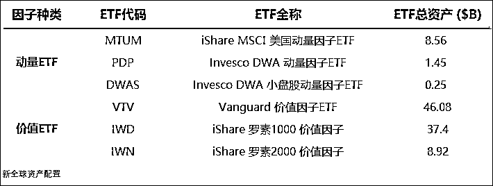数据时间：2019 年 4 月    数据来源：Bloomberg 我们把价值 ETF、动量 ETF 和大盘作对比，结果如下图所示：深蓝色线条（RAY）代表大盘走势，与其对比可见，多数的价值或者动量 ETF 并不能跑赢大盘，6 只市值靠前的因子 ETF 也只有 MTUM 跑赢了大盘。

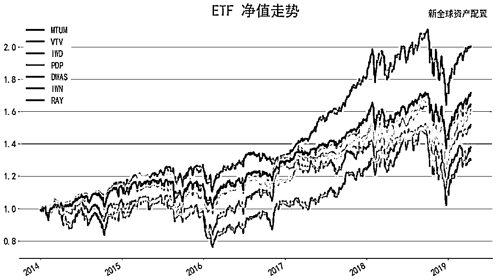

数据时间：2014 年 1 月-2019 年 4 月   数据来源：Bloomberg 这个结果也许是因为上述因子 ETF 向投资者收取的费率，因而因子回报降低了，另外，数据选取时间点也会影响测试结果。但无论如何，我们可以得出一个很明显的结论：在实际操作中，因子投资与理想中的"投资圣杯"是有差距的。**我们在这里并不是想说因子 ETF 跑不赢大盘，而是给大家提供另一种观点，对于原论文中所提的【选取一只因子基金并长期持有, 就能获取超额收益】的说法，持保守意见。**关于共同基金是否能够获取超额收益，学术界上有不同的见解。Baker, Haslem 和 Smith 在《Performance and Characteristics of Actively Managed InstitutionalEquity Mutual Funds》 中曾提及：美国主动管理型股票共同基金平均来说，在扣除管理费后并不能击败市场。虽然我们在这提出的两个观点与论文所提及的结论有所违背，不过论文提供的思路和分析工具还是很有借鉴意义的。关于共同基金是否能打败市场的讨论，【样本集的选择】对于最后的结论或许至关重要。平均全市场的基金来看，可能无法战胜市场，但是从胜率来看，因子类的基金战胜市场的概率或许会更大一些。而且对基金进行因子归因的这种方式，能够让投资者更了解他自己投资的基金，究竟投在了什么东西上，它的背后是有逻辑的；反观 P2P 这类产品，表面上承诺较高的收益，投资者如果全仓投资进去，很容易就血本无归了。最后，我们用国内的长信量化先锋基金举个简单例子，讲讲投资者如何判断基金的风格。作为一个投资者，了解一只基金的首选途径就是查看基金的招募说明书。招募说明书上，长信量化先锋基金的比较基准为【沪深 300 * 0.75 + 中证综合债* 0.25】。配置策略使用了 Black-Litterman 模型确定大类资产间的权重分配以及股票行业的投资权重，并且使用价值因子，成长因子，基本面因子以及动量和反转的市场因子进行股票池的筛选。

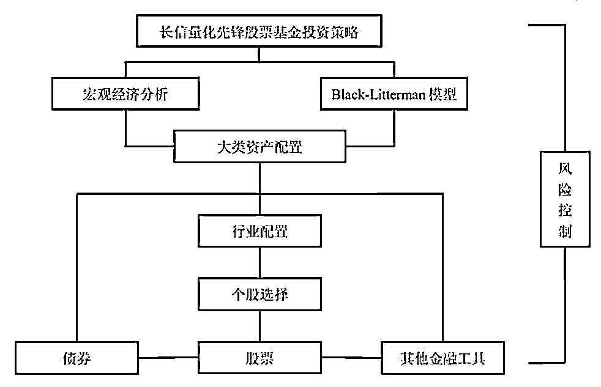

基金投资策略基本框架  

通过招募说明书，我们可以知道该基金纸面上的策略，然而市场在变，基金的风格也可能跟随改变，并不完全和纸面上的一模一样。若你希望得知基金当下的风格，因子归因则是个更好的方法。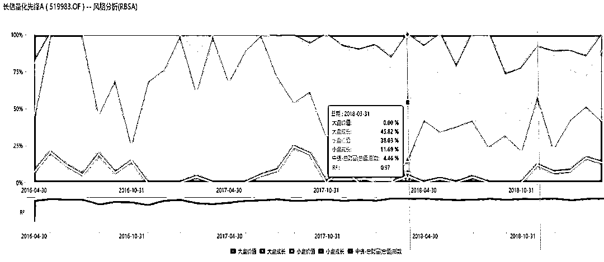长信量化先锋 A 风格分析、数据时间：2016 年 4 月-2019 年 4 月、图片来源：万得终端我们通过 Wind 数据终端分析了基金的风格归因发现，这只著名的基金，在 2018 年以前绝大多数时间有着明显的小盘风格，或者说有着明显的小市值因子风险暴露。如下图所示，深红色区域代表小盘成长风格，所占面积最大；2018 年以后，风格慢慢地向大盘偏移，可见该基金在市值因子暴露上已不如 2018 年以前那般稳定；到了 2019 年又重新转移回了小盘风格上。从下面的价格走势图中，我们也能看出一些端倪：

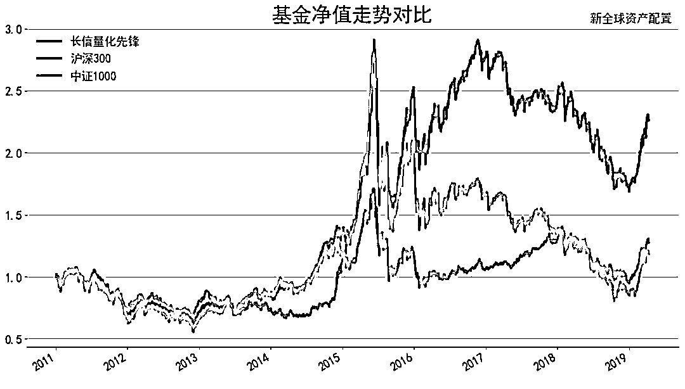

数据时间：2010 年 11 月-2019 年 4 月    数据来源：万得终端  在叠加上中证 1000 和其基准沪深 300 走势后，我们发现，长信量化先锋基金 2018 年以前走势反而与中证 1000 明显趋同，但到了 2018 年，基金风格发生了改变，走势与沪深 300 更加贴合，而进入 2019 年基金走势又与中证 1000 类似。下图为该基金的业绩表现：

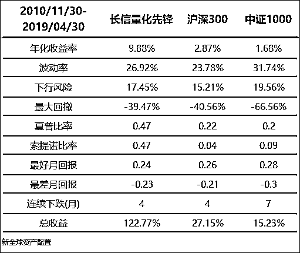

长信量化先锋基金业绩表现、数据时间：2010 年 11 月-2019 年 4 月、数据来源：万得终端总体来说，长信量化先锋能够获得高于沪深 300 以及中证 1000 的收益，回撤控制得也比这两宽基指数要好。对于希望基金经理有风格切换的投资者，可以将长信量化先锋加入基金池进行筛选和考虑，但对于想将其作为稳定的风格因子投资工具的投资者，恐怕需要重新选择投资标的了。**写在最后****投资是一件持久的事，但现实中很多人在这件事上急于求成，导致结果并不如意**。行为金融学中的各种行为谬误导致了投资者很多行为决策不能从理性的角度出发，冲动地全仓一把梭、买涨杀跌，结果被割韭菜。
而建立在系统性框架下的量化投资，通过历史数据和量化手段，回溯历史上几十年甚至几百年的数据，是更为理想的的方法论。它可以透过充满噪音的市场现象，找到市场运行的真正本质，避开不理性的决策。**因子投资，是量化框架中重要的一部分，对于普通投资者来讲，通过大量的学习，掌握基本的分析方法；建立在逻辑认同的之上的长期投资，会让你有更好的投资结果。**

*—End—*

量化投资与机器学习微信公众号，是业内垂直于**Quant**、**MFE**、**CST、AI**等专业的**主****流量化自媒体**。公众号拥有来自**公募、私募、券商、银行、海外**等众多圈内**18W+**关注者。每日发布行业前沿研究成果和最新量化资讯。

你点的每个“在看”，都是对我们最大的鼓励